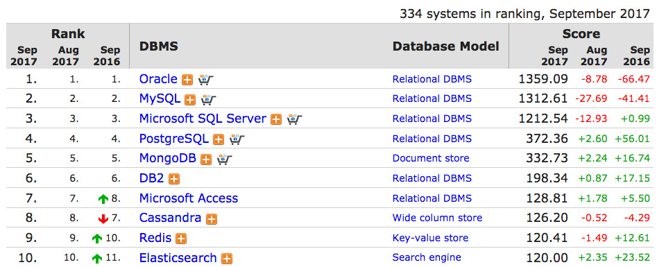
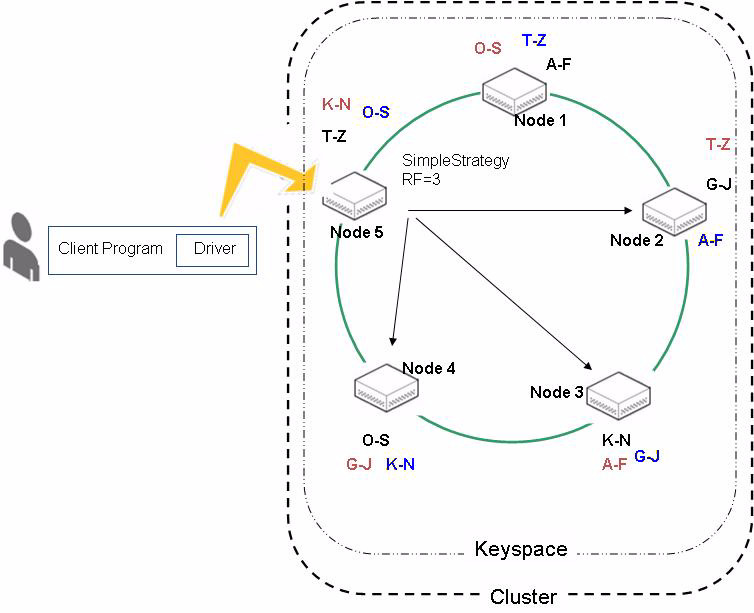
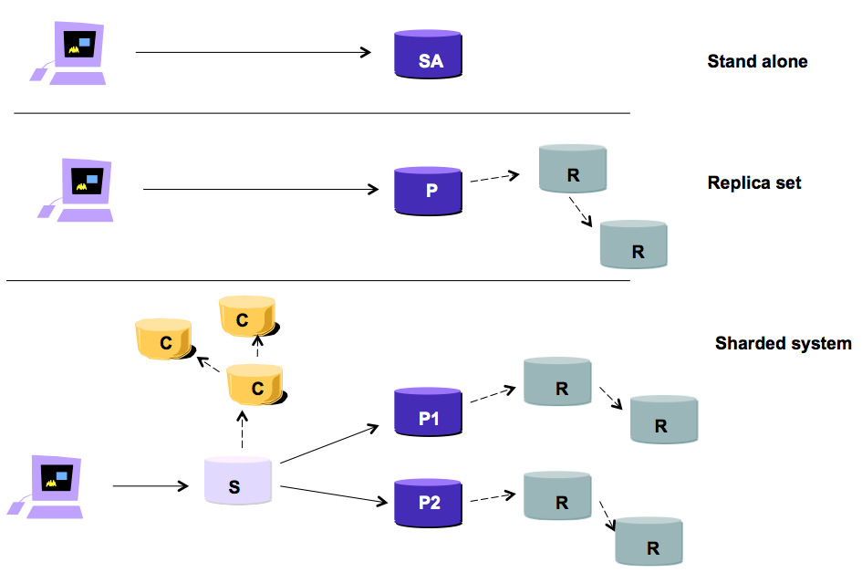
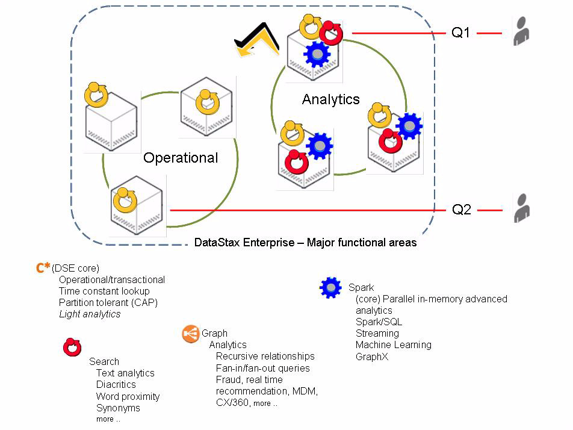
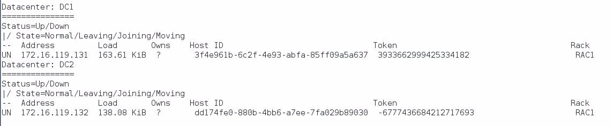

| **[Monthly Articles - 2022](../../README.md)** | **[Monthly Articles - 2021](../../2021/README.md)** | **[Monthly Articles - 2020](../../2020/README.md)** | **[Monthly Articles - 2019](../../2019/README.md)** | **[Monthly Articles - 2018](../../2018/README.md)** | **[Monthly Articles - 2017](../../2017/README.md)** | **[Data Downloads](../../downloads/README.md)** |
|-------------------------|-------------------------|-------------------------|-------------------------|-------------------------|-------------------------|-------------------------|

[Back to 2017 archive](../README.md)
[Download original PDF](../DDN_2017_10_DsePrimer.pdf)

## From The Archive

2017 October - -

>Customer:
>My company is investigating using DataStax for our new Customer/360 system in our customer call
>center. I haven’t learned a new database in over 10 years, and should mention that I know none
>of the NoSQL (post relational) databases. Can you help ?
>
>Daniel:
>Excellent question ! We’ve expertly used a good number of the leading NoSQL databases and while
>DataStax may take longer to master than some, DataStax is easily more capable (functionally, and
>scalability wise), than any other systems we have experienced.
>
>DataStax supports operational AND analytics workloads on one integrated platform, offers no single
>point of failure, is proven to scale past 1000 nodes, and is enterprise ready with all of the requisite
>security and administrative (maintenance and self healing) features.
>
>In this document we will:
>
>• Walk through a reasonably complete primer on DataStax Enterprise (DSE) terms, its object hierarchy, history, use, operating conventions, configuration files, and more.
>
>• Build a 2 node DSE cluster from scratch with a NetworkTopologyStrategy.
>
>• Demonstrate network partition failure tolerance.
>
>• Demonstrate strong and eventual consistency.
>
>[Read article online](./README.md).
>


---

# DDN 2017 10 DsePrimer

## Chapter 10. October 2017

DataStax Developer’s Notebook -- October 2017 V1.2

Welcome to the October 2017 edition of DataStax Developer’s Notebook (DDN). This month we answer the following question(s); My company is investigating using DataStax for our new Customer/360 system in our customer call center. I haven’t learned a new database in over 10 years, and should mention that I know none of the NoSQL (post relational) databases. Can you help ? Excellent question ! We’ve expertly used a good number of the leading NoSQL databases and while DataStax may take longer to master than some, DataStax is easily more capable (functionally, and scalability wise), than any other systems we have experienced. DataStax supports operational AND analytics workloads on one integrated platform, offers no single point of failure, is proven to scale past 1000 nodes, and is enterprise ready with all of the requisite security and administrative (maintenance and self healing) features. In this document we’ll offer a DataStax primer, and install and configure a two node cluster to demonstrate network partition fault tolerance, and strong data consistency.

## Software versions

The primary DataStax software component used in this edition of DDN is DataStax Enterprise (DSE), currently release 5.1. All of the steps outlined below can be run on one laptop with 16 GB of RAM, or if you prefer, run these steps on Amazon Web Services (AWS), Microsoft Azure, or similar, to allow yourself a bit more resource.

For isolation and (simplicity), we develop and test all systems inside virtual machines using a hypervisor (Oracle Virtual Box, VMWare Fusion version 8.5, or similar). The guest operating system we use is CentOS version 7.0, 64 bit.

DataStax Developer’s Notebook -- October 2017 V1.2

## 10.1 Terms and core concepts

As stated above, ultimately the end goal is to construct and deliver a customer/360 (single-view-of-customer) style end user application system. And given that DataStax Enterprise (DSE) is the first NoSQL database platform you will have learned, this document aims to offer a primer on DSE and surrounding topics. We will introduce all of the relevant DSE terms, build and operate a two node DSE cluster on your laptop, including creation of at least a single table, and perform inserts, updates, and selects.

## 10.1.1 NoSQL, post relational database systems

Certainly the defacto database choice for the past 30 years was a SQL relational database in the form of Oracle, DB2, Informix, MySQL, MS/SQLServer or similar. Figure 10-1 below displays the current ranking (popularity) from DB-Engines.com of all manner of database servers as determined by mentions on Google, Bing, Indeed.com, social postings, new projects started, etcetera.



*Figure 10-1 Source: https://db-engines.com/en/ranking*

Relative to Figure 10-1, the following is offered:

- Oracle, MySQL, MS/SQLServer and even PostgreSQL have been around for 30 or more years, hence; their large head start in terms of ranking. The bigger question might be, are these platforms growing or shrinking and why.

DataStax Developer’s Notebook -- October 2017 V1.2

- DataStax Inc. (DataStax Enterprise) is the commercial entity behind the open source Apache Cassandra project, hence; DataStax’s entry in this list is a bit under valued because contributions to ranking could arrive as Cassandra, DataStax, DataStax Enterprise, and others.

Figure 10-2 below displays listings from Indeed.com, the number-one information technology (IT) job posting Web site.


*Figure 10-2 Source, Indeed.com*

Relative to Figure 10-2, the following is offered:

- DataStax Enterprise (DSE) delivers four major functional areas: DSE Core (often denoted as, C*, powered by Apache Cassandra), Search (powered by Apache Lucene / Apache Solr), Analytics (powered by Apache Spark), and Graph (powered by Apache TinkerPop).

- You could argue whether any of these four functional areas represented on the graph above are additive or not, regardless; by using DSE you might be in a better place career wise than say any relational database. See image Figure 10-3 below.

DataStax Developer’s Notebook -- October 2017 V1.2


*Figure 10-3 Source, Indeed.com*

So, all of the above was meant to imply there is a movement as far as modern database platform choice, but why is there a movement-

> Note: While it might seem off topic, one of our favorite books is the O’Reilly

```text
Hadoop: The Definitive Guide
```

Publishing title, , available at,

```text
https://www.amazon.com/Hadoop-Definitive-Guide-Tom-White/dp/14493
11520
```

You needn’t read all (n) hundred pages of the O’Reilly Hadoop Guide, but perhaps you may choose to read the first 80 or so. These pages detail why folks like Amazon, Google, and others did not believe they could deliver their Web scale, always on, mission critical applications using common relational database servers.

Hadoop was the first in the wave of NoSQL (post relational) database platforms in the form of HBase (HBase: The Hadoop Database).

DataStax Developer’s Notebook -- October 2017 V1.2

While DataStax Enterprise (DSE) is categorized by the industry as a NoSQL database, we prefer the term post relational . Relational databases were generally solid, safe, and rich with features. The first of the NoSQL databases could be a bit rough (what do you mean you want backup and restore, versus start-over/erase and reload ?), or a bit one dimensional, only solving single niche application problems. By labelling DSE as post relational, we mean to highlight the fact that DSE does what NoSQL does, AND has many or all of the expected relational features like role based security, encryption, auditing, integration with performance monitoring tools, other.

To go farther on this topic we need a diagram, as offered in Figure 10-4. A code review follows.

## 10.1.2 A DSE cluster explained



*Figure 10-4 Example DataStax Enterprise Cluster*

Relative to Figure 10-4, the following is offered:

DataStax Developer’s Notebook -- October 2017 V1.2

- When relational databases were created, they were expected (designed to) operate on a single computer. Scalability was achieved by moving the database to a new, single, larger box (vertical scalability). The modern expectation, common to NoSQL and DSE, is that the database span seamlessly and automatically across multiple computers (multiple nodes), even across a wide area network (WAN: nodes being located globally). Need more compute or storage capacity (more scale) ? Add a new node in full multi-user mode (no downtime), and after that data automatically re-balances (is automatically shared with/to the new node), greater scale is achieved.

- What a relational database server generally referred to as a database server instance , DSE refers to as a cluster ; a single or set of nodes operating as a single, integrated database platform. A DSE cluster is a peer to peer, possibly geographically disperse set of expectedly homogeneous nodes, where data is distributed across all nodes.

> Note: A DSE cluster can have one node (bad, because one node offers a single point of failure, but it still works), or mulitple nodes.

Further, nodes may be logically grouped as being members of given datacenters and/or racks . Datacenters and racks are logical constructs, meant to organize nodes. Nodes are physical; nodes have mass, they exist. The full object hierarchy is, DSE cluster -> datacenter (optional) -> rack (optional) -> node Datacenters do not span clusters. Racks do not span datacenters. Nodes do not span racks. If you have an operational DSE system, you must have at least one node, member to one cluster.

Why datacenters and racks ? Example: if two nodes are in two different cities (two different datacenters), DSE can automatically span the data across datacenters to avoid a single point of failure. E.g., what if the datacenter in Katy, TX goes down (floods) ? We can still operate fully from the datacenter located in Buena Vista, CO.

While DSE could know that these two nodes are likely to be geographically disperse based on network latency, DSE can not really be informed of this fact unless you configure it as such.

DataStax Developer’s Notebook -- October 2017 V1.2

Peer to peer means that there is no master, no special node in DSE. As such, DSE provides no single point of failure because of node specialization.

- In Figure 10-4, we see a DSE cluster with 5 nodes. Consider the following: • A client program written in any number of popular programming languages uses a client side library ( a DSE driver ), to connect to a given DSE cluster. The DSE driver has the ability to detect any of which DSE nodes to connect to based on observed (real time) performance (say node 2 is performing way better than node 1 or nodes 3-5, use node 2), or based on data locality (node 3 has the data we want and is currently most performant). Regardless, the client connects to a given node, which in Figure 10-4 is node 5. • Inherit to the DSE server software, each node is automatically assigned a range of data that it is responsible for. In Figure 10-4, node 1 is responsible data in the range A-F, node 2 for data in the range G-J, and so on.

> Note: So that we have no single point of failure based on data singularity, it is expected that data in a DSE cluster is replicated across two or more nodes; three or more being the preference.

Why three, and not just two copies of the data ?

If you have just two copies of any piece of data, and one (copy) goes down (you manually take a node offline to upgrade the underlying operating system version, or similar), then you are left with a single point of failure.

By having three copies, you can temporarily (remove) one, leaving two copies, and still observe no single point of failure.

• A DSE keyspace could be viewed as similar to a relational database schema, in the fact that a keyspace sits between the cluster and the table. A DSE keyspace can not span DSE clusters, but it can span datacenters and/or racks. A DSE keyspace is a logical construct that defines at least two things for any tables that it contains- The replication strategy including count ( replication factor , a sub-element to the replication strategy) and location ( replication placement strategy , a sub-element to the replication strategy), and the

DataStax Developer’s Notebook -- October 2017 V1.2

need to journal activities against said table ( durable writes , true or false: the default is true).

> Note: Durable writes are probably easier to define-

In general, database servers write modifications made to its contents in two locations (in effect, dual writes); writes to the data pages proper (this is easily expected), and writes to a journal, sometimes called a transaction log file or similar.

DSE calls its journal the commit log . Whether given (tables) make entries to the commit log is controlled via the DURABLE_WRITES adjective to the CREATE KEYSPACE command.

The commit log is meant to provide fault tolerance, in the event the database server (a node) fails. After modifications to a given (table), the commit log is flushed to disk, whereas modifications to the table proper might exist only in volatile RAM. When DSE flushes the (data page buffer pool: memtables) the commit log records this event and is logically emptied (a pointer is moved forward).

When a node boots, it checks for entries in the commit log. If the commit log contains entries, then there are modifications to (tables, data pages), that were likely never flushed from RAM to disk. By replaying the entries in the commit log, DSE returns to a point of known consistency. I.e., you get your data back. Why not just flush the data pages themselves, and forget having a commit log, dual/redundant writes ? The commit log offers a single, contiguous, big block write (highly performant), whereas the tables themselves could be on any number of disks incurring seek and other latencies (lower performance). Why allow certain keyspaces (tables) to disable this (fault tolerance) ? You might be using some tables as scratch space, working storage as part of batch processing, and you do not care if that data were to get lost. While uncommon, this functionality has long existed in relational databases and as such, DSE offers this functionality for those who prefer it.

DataStax Developer’s Notebook -- October 2017 V1.2

> Note: DSE offers at least 4 replication placement strategies ; two for internal system-only (administrative) use, and two for normal (customer, end user) use.

The two normal replication placement strategies are titled, SimpleStrategy and NetworkTopologyStrategy . The two system-only use replication placement strategies include: LocalStrategy, (the system keyspace, and others), and EverywhereStrategy, (the dse_system keyspace, and others). You could easily imagine why (DSE system internal) data needs to be on all nodes in the cluster, or just local to one node.

You may use one or both (normal) strategies and they may (overlap). A replication strategy is set at the keyspace level, and all tables contained in that keyspace observe the same replication strategy. (You can alter the replication strategy post use, but as this may involve moving all data, this operation is costly.)

SimpleStrategy is what is displayed in Figure 10-4. In effect we call to use SimpleStrategy when creating a keyspace, and specify a replication factor (RF), a number one or greater. One gives you one copy of the data, two for two copies, and so on.

In Figure 10-4, data in the range A-F resides on node 1, with additional copies on nodes 2 and 3. Data in the range G-J resides on nodes 2 though 4.

As stated above, all nodes in a DSE cluster are peers, offering no single point of failure because of node specialization. As such, any of the nodes 1 through 3 can accept reads and writes of data in the range, A-F.

Why A-F, G-J, that seems limiting ?

We are oversimplifying at this point. In reality the exact (data partitioning scheme) is determined by the single or set of columns that form the primary key to each table. (Actually a sub-element of the primary key titled the partition key.)

Further, these (A-F, G-J values) are broken into discreet, resolute partition key ranges . A given (node) may have responsibility for several partition key ranges, which may not be contiguous themselves. E.g., node 1 may have responsibility to partition key ranges (A, M-N), whereas node 2 has responsibility for (M, X, E). And again, we are over simplifying using single alpha character values for the range boundaries.

DataStax Developer’s Notebook -- October 2017 V1.2

Thus far in our examination of Figure 10-4 we have detailed the following terms: node, cluster, keyspace, datacenter, rack, (client side) driver, (table), replication strategy (replication placement strategy plus replication factor (RF), commit log, and (the buffer pool, or memtables).

What remains from Figure 10-4 is to detail the approximated write path (the means by which data is written to a table). We say (approximated) because there are additional physical constructs needed to detail a complete write path that are not present in Figure 10-4, and which we do not wish to introduce now.

## 10.1.3 (Approximated) DSE write path

We continue to use Figure 10-4 as we overview the (approximated) write path in DSE. We say approximated, since we are currently overviewing the write path, and leaving some of the constructs to a full write path unmentioned.

In Figure 10-4, the following is stated as already having taken place:

- Someone has created a 5 node DSE cluster.

- Someone has created a keyspace using a replication placement strategy of SimpleStrategy, with an associated replication factor of 3 (RF=3).

- Someone has created a given table (unspecified) with columns, column types, other, and placed this table in the keyspace referenced just above.

> Note:

By definition, a given table is contained wholly within a given keyspace.

If this example table contains 1 GB of data, we will be storing a total of 3 GB of data for this table, since the RF for the keyspace in which this table is located is 3. (1GB dataset * (RF=3) == 3GB total volume)

3 GB of data, 5 nodes; each node will contain approximately 600MB of data.

- Based on the primary key to the above table (a single or set of columns to the primary key), DSE will automatically calculate where rows are written (which nodes get which data) to ensure balance across all available nodes. On read, DSE will know which nodes contain given key values. By volume, and if unbalanced, each node is capable of serving up to 60% of the requested reads. ((1 of 5 nodes is 20%) * (RF=3) == 60%)

In Figure 10-4, the client program calls to perform a new row insert:

DataStax Developer’s Notebook -- October 2017 V1.2

- The client side driver will determine which node to connect to based on a configurable strategy in the client side driver configuration. The client may connect to the closest node (lowest network latency), or the client may connect to a single node responsible to contain rows of this newly inserted key value, other. Again, this is configurable in the client side driver.

- Moving forward in this example, we state that the client side driver chose to connect to node 5. Node 5 will act as the local coordinator , and send asynchronous requests to all nodes required to complete this service request. For this example, assume we are writing a key value in the range G-J. Since we have a keyspace RF=3, the local coordinator (node 5) will send write requests to three nodes, nodes 2 though 4.

- Default behaviors- • The default DSE write consistency level is one, meaning; only one of three nodes need to acknowledge this write before control is returned to the client program. This value may easily be changed individual statement by statement, based on your preference and application need. You could set it to 3 (in this case, all nodes, since RF=3) if you wish. • One node will acknowledge the write first. Under normal circumstances, the remaining nodes will also acknowledge within low single digit (zero or higher) milliseconds. • By default, what is required for a given node to acknowledge a write- The first activity taken is to write to the commit log buffer. As a buffer, this structure resides in RAM and is volatile. The second activity is to write to the memtable for the given table; a memtable forms what most database servers calls a buffer pool. Again, volatile RAM. Control is returned to the client function via an acknowledgement of the write to both structures in RAM. • Flushing the commit log buffer- By default, the commit log buffer flushes every 10 seconds. This value is configurable. This behavior is titled periodic flushing (of the commit log buffer), and is also configurable. Periodic flushing is the default. The other/optional setting is titled batch flushing (of the commit log buffer).

DataStax Developer’s Notebook -- October 2017 V1.2

When configured to use batch flushing, the default (interval) between flushes is 2 milliseconds.

> Note: What is the difference between periodic flushing of the commit log buffer at 2 milliseconds, and batch flushing of the commit log buffer at 2 milliseconds ?

Good question !

Batch flushing will only acknowledge only after the buffer is flushed. The 2 millisecond delay is to allow other writes to piggy back on this call for physical (blocking) disk I/O. Under this configuration, every write will take up to 2 milliseconds, but you are guaranteed that the write occurred.

Period flushing will flush the buffer every 2 milliseconds, but control is returned to the client before this commit log buffer write is likely to have completed.

> Note: Don’t the defaults of periodic commit log buffer flushing, and 10 second (commit log sync period) leave my application grossly exposed to data loss ?

Also a good question; you’re two for two !

No, absolutely not.

In our example, there were two other nodes that were sent asynchronous write requests. Even following the same default write path, those two nodes are likely to receive and successfully complete the write request. Even if one node survives to a commit log buffer flush, your data is preserved.

> Note: This seems way more scary than my old relational database. Why is that ?

The commit log buffer flushing is exactly the same as every relational database. Relational databases also had tunable commit log buffer flushing, regardless of whatever defaults they carry.

What you are not seeing in this use case for DSE are (exclusive row) locks, and even more costly/scary, distributed locks, distributed lock time out, deadly embrace, and other relational database issues.

The only blocking operation you saw above was a delay to complete commit log buffer flush, which DSE can guarantee to complete since it is an internal blocking, but uninterruptable operation.

DataStax Developer’s Notebook -- October 2017 V1.2

## 10.1.4 Data consistency: strong, tunable, eventual

An introduction to the topic of data consistency is well covered on Wikipedia.com,

```text
https://en.wikipedia.org/wiki/Data_consistency
```

The net/net of this topic becomes:

- If you only have a one node database server, you need not even discuss data consistency since data is read/written from/to only one place. This scenario offers what is called strong consistency .

- If you have a multi-node database using a master/replica style architecture you have some advantage/disadvantages. See Figure 10-5, with a code review to follow.



*Figure 10-5 Multi-node database, master/replica style architecture.*

Figure 10-5 represents the available network topologies of another NoSQL database. Relative to this diagram, the following is offered:

- This database vendor offers single node (stand alone) systems. Single point of failure; good for development, and not for production.

- This vendor’s replica set style system offers high availability; if the primary database server (P) fails, any of two replicas (R) can take over within sub-second time. Cool.

DataStax Developer’s Notebook -- October 2017 V1.2

This is labeled a high availability solution and not a solution for horizontal scaling, because only one server is actively accepting reads and writes. You are bound by the write capacity of one server.

- In the replica set style system, you can optionally direct read requests to secondary servers. As with all multi-node database servers, you are now optionally seeing a data consistency issue. • If the write needs only be acknowledged by the primary (P), and we allow reads from any replica (R), are we seeing accurate, up to the moment in time version of the data- • Just like DSE, this server system has the concept of consistency level on read and write. And just like DSE, this consistency level is tunable via client side requests statement by statement. E.g., do I write just to the primary before returning to the client program, and do I read from just one replica to get my data. Or, do I write to more than one node, or (poll) more than one read node to get a consensus of the data-

> Note: This is actually all tunable, and super simple- Strong consistency == (nodes written + nodes read > replication factor)

That is:

- For all examples below, assume an RF=3

- If you write (W) to 3 nodes, and read (R) from 1 node, then 3W+1R > 3RF (3 + 1 > 3) you are experiencing (reading) strongly consistent data

- If you write to 1 node, and read from 3 nodes, then 1W + 3R > 3RF (1 + 3 > 3) you are experiencing (reading) strongly consistent data

Anything less, and you might be reading stale data; same in all multi-node databases.

And, if you had read the data 2 milliseconds earlier, before another user changed it, you’re still reading stale data the same as in a single node database server, relational or otherwise.

DataStax Developer’s Notebook -- October 2017 V1.2

## 10.1.5 But this means even more, the CAP Theorem

In Figure 10-5, there is more to discuss. Thus far we have only discussed a highly available solution (replica sets); what about scaling out (exceeding the write capacity of a single node); E.g., a sharded or partitioned database server ?

In Figure 10-5, the following is offered regarding sharding:

- In sharded or partitioned databases, there can be more than one primary server, more than one server accepting writes. High availability is achieved by having two or more replicas for each primary, just as with the simple single node primary server system. Having more than one primary is a horizontal scalability solution.

- In Figure 10-5, we see that the sharded system has two primary servers, P1 and P2. (All of the other servers in Figure 10-5 are superfluous to this immediate discussion.) Each of the primaries is configured to accept a distinct range of key values based on some scheme. E.g., primary server P1 to accept key values A-M, and primary server P2 to accept key values N-Z. • Now imagine you are a global company, or have a Web site application that can of course be accessed anywhere. You place primary server P1 in the USA, and primary server P2 in Asia. You partition the data so that USA users write their data in the USA to server P1, Asia users to P2. • Now what if a USA user is in Asia accessing their account ? You can place one of the USA replicas in Asia to reduce at least read latency (it can take 200 milliseconds to network round trip Asia to the USA). However, all USA writes from Asia must round trip to the P1 server. If you’re a global company, and/or people travel, you have a problem. • Now what if you lose connectivity between Asia and the USA ? (You have a network partition issue; Asia and the USA can not see each other.) Minimally you will not be able to accept any writes in Asia designated for the USA based primary. For any replica to be promoted to a primary (the single of three USA replicas based in Asia), you need a majority of secondaries to agree, to vote for a new primary server. That’s not happening.

DataStax Developer’s Notebook -- October 2017 V1.2

The CAP Theorem introduced in 1998 by Eric Brewer is well detailed on Wikipedia.com at,

```text
https://en.wikipedia.org/wiki/CAP_theorem
```

In effect the CAP theorem states:

- Consistency: Every read sees the most current version of data, else the client receives an error.

- Availability: Every read or write request receives a non-error response.

- Partition tolerance: The system continues to accept read and write requests, regardless of any network failure (network failure: some number of nodes can not communicate with other nodes).

The CAP Theorem puts forth that no (database server system) can deliver all three letters from CAP, and that the server must choose at most 2.

DataStax Enterprise (DSE) delivers AP (availability, partition tolerance) from the CAP Theorem. In effect:

- From our example above, and during a network partition failure: USA users could write USA data in Asia, Asia users could write Asia data in the USA. Many/most SQL/NoSQL database servers can not do this.

- Because of the network outage, USA users writing in Asia can not see other changes to USA data made in the USA during the time of the network outage.

- After the network partition outage is repaired, DSE will automatically consolidate changes and create a best, most complete version to each and every modified row.

> Note: In fact, we will witness this advanced capability in an exercise below.

## 10.1.6 This is still scary, I don’t like this-

Keep in mind that this is the default DSE behavior, and you can configure to change (disallow) this. If you change your client configuration to say, “I must see and receive an acknowledgement of write from all servers”, then that is what will transpire. From our continuing example and in the event of a network partition failure, USA users in Asia will not be able to write USA data.

Optionally, you can deliver a global (Web) capable application (one that supports network partition errors). Your client application can even be configured to accept

DataStax Developer’s Notebook -- October 2017 V1.2

writes when it can not see any of the write target nodes. DSE will automatically complete those writes when the write target nodes become available.

## 10.1.7 More comments about Insert and Update

In short, DSE behaves in a manner perhaps more friendly than a relational database. DSE calls its (SQL) language CQL, short for Cassandra Query Language. Perhaps its called CQL to highlight the fact that there are differences between CQL and SQL.

Example 10-1 creates a DSE table we use in the examples that follow.

### Example 10-1 DSE CQL data definition language to create a table.

```text
create table t2
(
col1 int,
col2 int,
col3 int,
col4 int,
primary key ((col1), col2, col3)
) with clustering order by (col2 asc, col3 asc);
```

Relative to Example 10-1, the following is offered:

- The primary key above is composed of three columns; col1, col2 and col3. The values of these three columns together uniquely identify one row.

- DSE primary key values are immutable. E.g., to change the value of a primary key value, basically you cheat; you must insert a new row with a new primary key value, and delete the row with the old primary key value.

- CQL INSERTS and UPDATES will act as upserts unless otherwise specified. Example 1: INSERT on existing row- • The following two INSERTS leave you with one new row in the table,

```text
insert into t2 (col1, col2, col3, col4) values (1,1,1,1);
insert into t2 (col1, col2, col3, col4) values (1,1,1,2);
select * from t2;
col1 | col2 | col3 | col4
------+------+------+------
1 | 1 | 1 | 2
```

DataStax Developer’s Notebook -- October 2017 V1.2

• Because the second insert specifies the primary key of a row that already exists (this row is created as the result of the first insert), the second insert is converted to an upsert (an update).

> Note: Truncate is the command verb to empty a table of all rows as efficiently as possible.

• If you do not desire this behavior, execute an INSERT .. IF NOT EXISTS.

```text
truncate t2;
insert into t2 (col1, col2, col3, col4) values (1,1,1,1) if not
exists;
[applied]
-----------
True
insert into t2 (col1, col2, col3, col4) values (1,1,1,2) if not
exists;
[applied] | col1 | col2 | col3 | col4
-----------+------+------+------+------
False | 1 | 1 | 1 | 1
```

Returned as an error (applied == False), is the row that prevented the operation from completing, in this case; the first row inserted with its (conflicting) primary key value. Example 2: UPDATE on non-existing row- • Executing the following code,

```text
truncate t2;
select * from t2;
col1 | col2 | col3 | col4
------+------+------+------
(0 rows)
update t2 set col4 = 1
where col1 = 1 and col2 = 1 and col3 = 1;
select * from t2;
col1 | col2 | col3 | col4
------+------+------+------
```

DataStax Developer’s Notebook -- October 2017 V1.2

```text
1 | 1 | 1 | 1
```

Inserts one new row into the table. Column values are derived from the predicates (the WHERE clause column values) in the UPDATE statement, as well as the SET column values themselves. • If you do not desire this behavior, execute an UPDATE .. IF EXISTS.

```text
truncate t2;
select * from t2;
col1 | col2 | col3 | col4
------+------+------+------
(0 rows)
update t2 set col4 = 1
where col1 = 1 and col2 = 1 and col3 = 1 if exists;
[applied]
-----------
False
select * from t2;
col1 | col2 | col3 | col4
------+------+------+------
(0 rows)
```

## 10.1.8 Two value props of DSE, and primary keys

Value prop (proposition) is a marketing term used to summarize why a customer should buy (value) a given product.

One of two value props to DSE that arrives from core Cassandra (C*), is network partition fault tolerance. Relevant to the CAP Theorem, this topic was discussed in detail above.

A second value prop to DSE that arrives from C* is time constant lookup .

Every database server claims to scale linearly. Some do. DataStax Inc. is the commercial entity behind the creation of Cassandra. DataStax Enterprise (DSE) delivers 4 major functional areas:

- DSE Core (often denoted as, C*, powered by Apache Cassandra).

- Search (powered by Apache Lucene / Apache Solr).

- Analytics (powered by Apache Spark).

DataStax Developer’s Notebook -- October 2017 V1.2

- Graph (powered by Apache TinkerPop).

Each of the above solves a largely distinct set of use cases within DSE. Through the delivery and integration of all 4 functional areas, DSE can perform most, all, or more activities than you would on another database server system, faster, and with greater uptime.

DSE Core (C*, Cassandra) was initially created, and then open sourced by Facebook. Facebook created Cassandra from two seminal industry white papers:

- Amazon’s DynamoDB- This white paper is available for download here,

```text
http://www.allthingsdistributed.com/files/amazon-dynamo-sosp20
07.pdf
```

This white paper was published by Amazon in 2007, and details a primary technology used to power the core of Amazon’s international and Web scale business. This paper expertly details the following sub-topics: • Clustering • Web scale data architecture • Data partitioning • Advanced data replication • Gossip, inter-nodal administrative communication: status and performance discovery • Anti-entropy, how to recover from the natural intent of a multi-nodal database system to enter an inconsistent (data) state • Hints, a protocol to store and forward data to down or missing nodes

- Google BigTable- This white paper is available for download here,

```text
https://static.googleusercontent.com/media/research.google.com
/en//archive/bigtable-osdi06.pdf
```

This white paper was published by Google in 2006, and details a primary technology used to power Google’s international and Web scale business. This paper expertly details the following sub-topics: • Distributed schema management • memtables, an in-memory and hash indexed data structure • Compaction, maintenance and performance management of SSTables (next)

DataStax Developer’s Notebook -- October 2017 V1.2

• SSTables, a sorted string table (SST), of an immutable data, append only, and hash indexed • Commit log, a transaction log file discussed above

So, does DSE Core (C*), based on the Amazon DynamoDB and Google BigTable white papers, scale ? Consider the following:

- Netflix • Witnesses one trillion transactions per day • Stores 95% of their non-programming (non video) data • Used as an Oracle replacement for scale and cost • Performed a 2500+ node migration by two DBAs over one weekend

- Intuit • Serves 45+M customers • 6 PB data using hybrid cloud (on premise, and bursting during peak season to off premise) • Meets or exceeds complex legal requirements • Delivers a highly personalized customer experience • On 600+ nodes

Central to the above (Amazon, Google, Netflix, Intuit) is the ability to deliver time constant lookups, that is; no matter how large the dataset, mission critical queries are guaranteed to complete with a given (and fast) service level.

## 10.1.9 What queries can be time constant, part 1-

DSE can execute queries equal in function to, or in greater function than a relational database. But, to execute advanced queries (advanced analytics, aka online analytical processing, OLAP), DSE will make use of its functional areas other than DSE Core:

- Search (powered by Apache Lucene / Apache Solr). Generally, relational databases use B-tree type indexes. See the Wikipedia.com article related to B-trees to overview this topic available here,

```text
https://en.wikipedia.org/wiki/B-tree
```

B-trees excel at fast lookup of highly volatile data , a condition common to relational databases and online transaction processing (OLTP) in general. B-trees serve equality, range lookup, and sometimes sorting with great efficiency.

DataStax Developer’s Notebook -- October 2017 V1.2

> Note: We say ‘sometimes sorting’, because relational databases must filter and join rows before sorting. By that time the relational database has commonly chosen another index to provide function, one that does not also support the sort. Or, the sort is being performed on a virtual what-if row that did not exist in the database, and thus could not have been previously indexed.

Another type of index is the bitmap, overviewed on Wikipedia.com here,

```text
https://en.wikipedia.org/wiki/Bitmap_index
```

What Apache Solr / Apache Lucene give DSE Search (Search) its indexing technology and associated query processing for text analytics. (Although Search can easily serve more than text.) In the context of Solr, bitmap indexes are also referred to as bit vector, or term frequency - inverse document frequency (Tf-Idf) indexes. A diagram is in order, and arrives in Figure 10-6. A code review follows.


*Figure 10-6 Bitmap index example.*

Relative to Figure 10-6, the following is offered:

- Displayed in Figure 10-6 we have a bitmap index; a two dimensional array with an x-axis of document-id (row id), and a y-axis of term. A boolean value (one or zero) indicates if the term is found to exist in a given document.

- Running down the vertical column for document 6, we see this document contains the terms ‘the’ and ‘trot’, and no other terms from this list. If you’re looking for unicorns, you wont find one in document 6.

DataStax Developer’s Notebook -- October 2017 V1.2

- A beauty to bitmap indexes is the highly performant set operands that we can perform on them. In effect, multiple bitmap indexes can be ‘and’ed and ‘or’ed together very quickly to perform complex logic, and efficiently to perform unions, intersections, projections (set theory) and more. Further, the value of true or false (the intersection of a key and a value), is stored as a single bit. As such, bitmap style indexes are asked to store large amounts of data and yet consume relatively little resource. The equivalent entry in a B-tree type index is regularly a 16 or 32 byte integer row identifier.

> Note: So why do relational databases favor use of B-tree style indexes and not the more highly performant bitmap or hash style indexes ?

Relational databases do offer these index types under rare conditions, however; each index style has its strengths. A a relational database might create a new hash index during the execution of a single query, then discard that index once the query is complete. Why does a hash index work in this case ? Because the execution of a query offers a one time (static) view of the data at that moment in time. Static, not volatile.

B-trees excel at highly volatile data, and relational databases expect to serve highly volatile data. In a relational database, data is updated in place. Bitmap and hash both stumble on highly volatile data. Each index style has strengths, and preferred/optimal use cases.

Doesn’t DSE also serve highly volatile data ?

Yes, but. DSE does not update data in place like a relational database. DSE SSTables are immutable. Changes to the data are only appended to the (table), which offer many advantages:

- You are not performing random writes (seek, latency) within a larger disk structure. You are performing targeted bulk writes (less physical I/O by count) to a single or set of structures.

- The only downside to an append only scheme is consolidation (compaction). You must periodically maintain these appended lists of data, removing deleted entries to reclaim space, overwriting updated values, and so on. This is also a low cost, targeted bulk write.

- Using (Solr), DSE Search can provide: • Wild card lookup, including Regex expressions. E.g., show me all last names that end with ‘son’; Johnson, Hanson, etcetera.

DataStax Developer’s Notebook -- October 2017 V1.2

• Equalities and ranges. • Synonyms • Soundex/NYSIIS, and others. • Term locality. E.g., show me records with the term ‘mortgage expiration’ followed by a valid date value within 4 word spaces. • More.

> Note: At a high level, Apache Solr gives DSE Search index and query processing capabilities. DSE Core still stores all of the data proper, and only index data is produced, maintained, and processed by DSE Search. DSE Search produces a list of candidate (primary keys), that are then further processed by DSE and returned to the client.

By the nature of Solr indexes being inverted, Solr index processing (a DSE Search query) is often scatter/gather , that is; a single query will need to process data on a larger number of nodes in the keyspace. (The exception being if you were to include the partition key in another predicate expression.)

Scatter/gather queries are generally not time constant lookup capable.

- Analytics (powered by Apache Spark). Some would heuristically label Apache Spark as Apache Hadoop version

2.0. Regardless, here’s the net/net on this topic: • The underpinnings of Hadoop arrived in 2003 with the Google white paper titled, Google (Distributed) File System. Hadoop became an Apache subproject in 2006. • Hugely complex, Hadoop is delivered as a collection of 20 or more interrelated packages; a resource monitor, a scheduler, an event logging/reporting system, at least two databases, etcetera. There are two central packages to Hadoop, however, that deliver the bulk of Hadoop’s function and value: a distributed filesystem (based Google’s distributed filesystem), and a parallel application framework (Map/Reduce: M/R). If you understand nothing else about Hadoop other than these two packages, you are in good shape. • Why does a distributed filesystem have value ? By itself a distributed filesystem may not seem valuable. When coupled with the next piece, the parallel application framework, you have something of great value and something in the IT industry had never really seen before; the ability to index data at Internet scale.

DataStax Developer’s Notebook -- October 2017 V1.2

Imagine 100 computers sitting in an office. Imagine that by placing a file on your C drive (your hard disk), that file is automatically replicated on three or more other computers to provide high availability. Now imagine that your file is intelligently partitioned across these 100 computers so that each computer user could work on your file in parallel. And now wait for the next piece, the parallel application framework. • Map/Reduce (M/R)- The value of M/R, the wisdom and clarity, is that it productized, standardized, the ability to execute end user application code across dozens and hundreds of nodes easily and efficiently. There are other application frameworks (mostly Web application frameworks like JEE, dot.[Net], others), but M/R stands apart as a parallel application framework. Hoes does M/R work ? M/R defines (n) standard stages in the receipt, fanning out to multiple nodes, execution, and consolidation (fanning in of results) to the execution of a parallel routine. In general, give M/R the specific routine you want to run, and M/R does all of the lifting as far as making this routine parallel. Generally these (n) M/R stages include: an input reader, a mapper, partitioner, a comparator, a reducer, and an output writer. It may seem complex, but all of the really hard work (delivering the parallelism at scale) is performed for you.

DataStax Developer’s Notebook -- October 2017 V1.2

> Note: If Hadoop is so great, why did such a large number of Hadoop projects fail to realize their business objectives ? Why is Hadoop considered under performant ?

Well, first consider that just being able to index the Internet is a major accomplishment. And while this next piece is a major oversimplification, consider the following:

- Given a list of postal offices (zip codes) in the USA, determine which city name is most common across states.

- First you must remove redundant data; Buena Vista, CO has one post office and would appear once in this list. Houston, TX has many post offices in this one city. So as to not count Houston, TX numerous times (in error), we have the responsibility to reduce the numerous Houston, TX entries to just one entry.

- In short you would: • Sort the dataset • Remove redundant entries like (n) copies of Houston, TX. (Generally a GROUP-BY city and state operation.) • Now GROUP-BY again to count cities across states. (GROUP-BY just city.) • Now sort the list descending by count. • And likely remove all but the top-N records.

- An oversimplification certainly, but Hadoop could be expected to lift the data from disk, perform one of the processing steps above, then land the data back to disk, waiting for the next step, which would again lift the data from disk, process, land back to disk, and so on. This is how you do it when indexing the Internet; you’re more worried about fitting in memory than fitting on disk.

Apache Spark sought to improve on the performance of Hadoop. Generally, Spark will lift the data once at the start of processing, perform all computing steps in memory, then land the data only the final and last time. There’s more to Spark’s advantages and differences over Hadoop and M/R, which we will have to detail another time.

• Where DSE delivers 4 major functional areas, Spark has a number of functional area itself, to include: (Spark core), in-memory parallel analytics-

DataStax Developer’s Notebook -- October 2017 V1.2

Spark/SQL, generally expect that you can run most standard SQL here including joins, group-by, sorting, unions, intersections, etcetera. Spark/Streaming- Machine Learning, MLlib, predictive analytics, E.g., customers who bought (x) also bought (y), predicting customer churn, and many others. GraphX-

> Note: What Spark gives DSE is huge- – A parallel analytics and processing framework – The ability to run most SQL and in parallel – Machine Learning – ETL/ELT style data processing – (This list is nearly endless)

• More than just a connector, Spark is fully integrated into DSE. Without delving into a full Spark process architecture discussion, we will state: All of the Spark master, worker, and driver (processes) run inside the DSE JVM. Only the Spark executors (similar to a user defined function in a relational database) run outside the DSE JVM. This might be most optimal, since it makes it hard for end user created code to (negatively impact) DSE. And through this integration, Spark is fully DSE data locality aware. Huh ? Spark will know how to avoid unnecessary inter-nodal communication of data.

- Graph (powered by Apache TinkerPop). We tabled (provided only an overview) of a number of topics above, and Graph will have to be another of these topics. A detailed discussion of graph could take 80 pages itself. In short, however, we offer the following: • DSE Core provides all data storage and time constant lookups, and more. All of the remaining functional areas sit atop DSE Core. • DSE Search provides indexing and query processing technology, text analytics and more. • DSE Analytics provides a parallel analytics framework, and analytics for machine learning, and the ability to process SQL.

DataStax Developer’s Notebook -- October 2017 V1.2

• What does Graph uniquely do in comparison to those functional areas above ? (We say uniquely because there is overlap in the functionality between Graph and Search, other.) Minimally, Graph provides recursive joins better than the other functional areas. E.g., given United Airlines flight schedule, What is the easiest/fastest/cheapest means for me to get from San Jose, CA to Vail, CO ? And Graph does relationship joining- A relational database knows to join Customer to Orders, then Orders to Order Line Items. However, that join path is hierarchical, top down. Imagine having to answer the question; Houston, TX is currently under water. Which of my employees, customers, expected parcel deliveries, flights of employees or guests, etcetera, will be impacted by outages related to this flooding ? Graph can perform fan out join paths with somewhat undefined (variable, unknown) relationships. In SQL these join paths have to be defined. In Graph, the query processing engine will use predicates (WHERE clauses on data AND relationships) to explore your network of data, and process your query.

## 10.1.10 What queries can be time constant, part 2-

Now that we’ve defined what DSE Search, DSE Analytics, and DSE Graph can do, let’s zero in on what DSE Core can do, and what time constant lookups (query processing) are.

The short answer is:

- These are your mission critical queries than need to complete in zero to low single digit millisecond time, and are the core of your business.

- We don’t want queries that scatter/gather, that review and score reams of data (no machine learning here), no queries that join data (n) levels deep (probably across nodes), other.

- We do want queries that access data from one node, highly targeted, using a hash index, and from data that is pre-sorted.

Relational databases model data irregardless of use; entities and attributes, third normal form, Codd and Date, done. Almost exclusively NoSQL databases (post relational), model data entirely by use .

Given a business application to be delivered we:

- Gather requirements, logical entity and attributes.

DataStax Developer’s Notebook -- October 2017 V1.2

- Write all of the queries in at least pseudo code.

- Score all of the queries by frequency, concurrency and spread. E.g., if a query runs once at end of month, and can take 60 seconds to complete, it is modelled one way. Queries of this type may choose to use Search, Analytics and/or Graph. If a query must support a time constant lookup. we model it as such.

- Finalize the data model to support the queries above.

Consider the following queries based on the same table structure we used in Example 10-1:

```text
create table t2
(
col1 int,
col2 int,
col3 int,
col4 int,
primary key ((col1), col2, col3)
) with clustering order by (col2 asc, col3 asc);
```

- Example 1-

```text
select * from t2 where col1 = 1;
```

This query uses an equality on the whole of the partition key to this table. This query will support time constant lookup.

> Note: A DSE primary key is composed of two parts: first the partition key (one or more columns), and then optionally, one or more clustering columns.

The partition key tells DSE exactly which node contains this data (avoiding scatter/gather queries), and even which distinct SSTable contains this data (SSTable: the physical storage in memory or on disk).

After the partition key, we optionally have one or columns (the clustering columns) that determine sorting within each partition. I.e., all data is presorted.

- Example 2-

```text
select * from t2 where col1 > 1;
select * from t2 where col1 > 1 allow filtering;
```

DataStax Developer’s Notebook -- October 2017 V1.2

The first query does not support time constant lookup, and will actually fail. Because the first query does not reference an equality on the partition key, it will scatter/gather. To syntactically support a scatter/gather query, you must add the ‘allow filtering’ adjective. With no partition key based equalities, the first query might be calling to read all of terabytes of data. As such, this query should be avoided at all costs. Minimally, this query will never support time constant lookup.

- Example 3-

```text
select * from t2 where col1 = 1 order by col2;
select * from t2 where col1 = 1 order by col2, col3;
```

Both of the above queries support time constant lookup; they both access the whole of the partition key on an equality. The ORDER-BYs are of no concern. As a result of col2 and col3 being members of the clustering column set, the data is actually presorted on disk; no sorting is actually performed during the execution of the query. Why is sorting data during the execution of a query bad ? Its not bad, but it is a blocking operation (you can not return any row until you have sorted all rows; what if the last row received should have been the first row output ?). To guarantee time constant lookups, data must be pre-sorted in memory or on disk.

- Example 4-

```text
select * from t2 where col1 = 1 order by col1;
select * from t2 where col1 = 1 order by col3;
select * from t2 where col1 = 1 order by col2, col3, col4;
```

All three of the above queries fail. The first query calls to sort on the partition key which is already predicated by an equality; there is no need to sort the data. Call it syntactic sugar if you wish, the first query requests an unnecessary operation. Query 2 fails because of a non-anchored key condition . The data is sorted by col2 then col3, and is not sorted by col3 alone.

DataStax Developer’s Notebook -- October 2017 V1.2

> Note: Imagine the old style paper phone books with hundreds of pages. That data was sorted by last name, then first name.

If you wish to do a lookup by last name, you’re fine. The data is sorted by (anchored by) last name. If you wish to find John Smith, and there are hundreds of Smiths, you’re still fine. The data is sorted by last name, then first name and you are using (anchored by) all columns in the index.

If instead you try to do a lookup by first name, you must read the whole phone book (perform a sequential scan, or scatter/gather) because the data is not sorted by first name. The data is sorted by last name then first name; the sort is anchored by the leading column or columns.

Once you lose the anchor columns, you lose the ability to process data via that index, you lose the sort order.

And the last query fails because while anchored, we added col4 to the sort which was never a part of the clustering column set. If you really need this query to work, we need to change the model; we need col4 to be a member of the clustering column set.

## 10.1.11 A very brief discussion on data modeling

Data modeling in relation databases and NoSQL databases is based on sound engineering principles, published even. Still, there is a bit of an art to it. The art may come in the determination of query importance (frequency, concurrency, and spread), and techniques to optimize (balance) need versus cost.

Relational databases were created at a time when disk was expensive; a limiting cost factor to the delivery of application systems. A huge element of relational modeling is to remove all data redundancy.

NoSQL was created at a time when the limiting cost was labor, or lost revenue through longer times to market, or lost revenue through longer execution times. Disk is cheap, and NoSQL databases allow/encourage redundant data throughout.

The one CQL table below models what would normally be three tables in SQL. See Example 10-2, with a code review that follows.

### Example 10-2 Sample CQL data model for Customer Orders

```text
create type orderLineItem
(
itemNum int,
```

DataStax Developer’s Notebook -- October 2017 V1.2

```text
quantity int,
perUnitPrice float
);
```

```text
create table customerOrders
(
custNum int,
custName text static,
orderNum int,
orderDate date,
itemList frozen<list
<orderLineItem>>,
primary key ((custNum), orderNum,
orderDate)
) with clustering order by (
orderNum asc, orderDate asc);
```

```text
insert into customerOrders
(custNum, custName, orderNum,
orderDate, itemList)
values
(101, 'Ram Smith', 1, '2005-12-12',
[ ( 1, 5, 10.0 ), (2, 1, 5.0) ] );
```

Relative to Example 10-2, the following is offered:

- First, we are not saying this is how you should model, Customer -> Orders -> Order Line Items We’re just saying this is one way to model that supports a discussion of data redundancy.

- We specify a user defined type (tuple) titled orderLineItem. This entity is just a definition, a macro of sorts. By creating this type, we can refer to it later to create an array (list) of items inside (an actual data row).

- CustomerOrders is our actual table, similar to what we’d experience in a relational database. This table contains attributes of what would be in three tables in a relational system; custNum would normally be in a Customer table, orderNum would be in the Orders table, and so on. In effect we’ve denormalized the model.

- Why denormalize ? In effect, we’ve pre-joined Customer with Order, with Order Line Items; much more highly performant over relational and having to join on every query, or shred every record on insert.

DataStax Developer’s Notebook -- October 2017 V1.2

- What does the ‘static’ keyword do ? The static keyword specifies that this column value is shared/common to all rows with this partition key. This offers a disk space savings; we’ve modeled in a redundant manner, but not necessarily storing as such on disk.

- What is a ‘list’ ? We’ve already seen that DSE CQL has user defined types. DSE CQL also has three array types (collections) that can be embedded in tables; list, set, and map, and each has specific properties regarding order of its contents or whether duplicate values are permitted or not. This topic is not expanded upon further here.

## 10.1.12 Workload isolation, another network topology

We displayed our first DSE network topology above, in Figure 10-4. We display our second in Figure 10-7. A code review follows.



*Figure 10-7 A two datacenter DSE network topology*

Relative to Figure 10-7, the following is offered:

DataStax Developer’s Notebook -- October 2017 V1.2

- This figure displays one DSE cluster, with two datacenters. Datacenter 1 has three nodes, as does datacenter 2.

- Datacenter 1 has been configured to support only DSE Core queries (time constant lookup), whereas datacenter 2 supports Search, Analytics, and Graph queries. Why ? Its one thing to have tables, indexes, query processing and more to support time constant lookups, however; if you share this box with other routines that could negatively impact your required service level agreements, you are still in danger. We use the grouping of nodes (datacenters and/or racks) for geographic placement of data (discussed above), as well as for workload isolation.

- Keyspaces are that DSE entity which place data (tables) on given nodes. Above we could create a keyspace for just nodes in datacenter 1, just datacenter 2, or a mix thereof. We have an exercise below to demonstrate this feature.

## 10.1.13 And lastly, files (install and config)

There are three means with which you may install the DataStax Enterprise (DSE) binary program files:

- An operating system supported package installer program. On CentOS version 7 Linux, this is the Yum package installer. Pros and cons: • Pro, you just say, yum install .. DSE will be installed as a service (Linux systemd), easy to stop and start. • Con, you lose a lot of control. I.e., where do my data files go, where do the binary program files go.

- The Web based DataStax Ops (Operations) Manager. • Pro, point and click install over many (1, 10 or 200+) nodes. • Con, if you are doing a simple exercise like the one we complete below in this document, you still have to complete installation of DSE Ops Manager first; maybe you save steps overall, maybe not.

- A manual install, download the zip file, unpack, point to the relative bin directory.

DataStax Developer’s Notebook -- October 2017 V1.2

• Pro, fast for a quick and dirty install. Also, the only means to operate differing versions of the DSE software. (Package installers famously maintain one version, not several.) • Pro, fastest means to install multiple DSE nodes on one operating system node. (Not useful for production, but useful for testing.) • Con, nothing prevents you from making a mistake in editing the requisite configuration files or similar.

In the exercise below, we use a manual install. Comments related to this task:

- You hit a given Url, download and unzip.

- Standard for all/most Zip/Tar based (manual) installs, wherever you place or move the files to is your root. For example, If you unzip the files in /opt/dse, then a set of subdirectories is installed and relative to /opt/dse. You’ll want to place /opt/dse/bin in your PATH. E.g.,

```text
export PATH=$PATH:/opt/dse/bin
```

You’ll have (n) configuration files you will need to edit before booting the DSE server.

Whether you are installing one DSE node per operating system node, on two operating system nodes (two DSE nodes total, as we are in the exercise below), or installing multiple DSE nodes on one operating system node (useful for testing, not doing this in this document), there are (n) DSE configuration files you must edit first. Comments related to this topic:

```text
/opt/dse
```

- Given an install directory of , all of these configuration files will be

```text
/opt/dse/resources/
```

under There are further subdirectories under resources, one per subsystem of DSE. For a simple install, as we are performing in this document, all of the necessary files are under,

```text
/opt/dse/resources/cassandra/conf/
```

- cassandra.yaml As the name implies, cassandra.yaml is a YAML file and thus, is whitespace sensitive. Indentation is important. 1282 lines, plus or minus, this file is mostly comments. Only 120 or so lines are actual settings, and of those most customers never change more than 20. Minimally you will want/need-to change: • cluster_name

DataStax Developer’s Notebook -- October 2017 V1.2

All nodes in one DSE cluster must have the same cluster_name • endpoint_snitch The default is,

```text
endpoint_snitch: com.datastax.bdp.snitch.DseSimpleSnitch
```

We discussed SimpleStrategy and NetworkTopologyStrategy above. For the purposes of our exercise we need the PropertyFileSnitch, so that we can support a NetworkTopologyStrategy, and must change this line on all nodes to be,

```text
endpoint_snitch:
org.apache.cassandra.locator.PropertyFileSnitch
```

This change necessitates a change to a file named,

```text
cassandra-topology.properties
```

detailed below. • seeds (seed nodes) ‘seeds’ is a list of hostnames or IP addresses that inform a given DSE node how/where to find other nodes in this same cluster. Best practice is to have 1-3 (3 for redundancy) nodes per datacenter acting as seed nodes. You would also make entries here so that datacenters would have entries for seed nodes from other datacenters, so that datacenters can find each other. For our simple two datacenter, one DSE node per datacenter example, we just enter both IP addresses here. The unedited entries here resemble,

```text
- class_name: org.apache.cassandra.locator.SimpleSeedProvider
parameters:
- seeds: "127.0.0.1"
```

The above would work for a single node DSE system operating on just localhost. And our edited entry resembles,

```text
- class_name: org.apache.cassandra.locator.SimpleSeedProvider
parameters:
- seeds: "172.16.119.131, 172.16.119.132"
```

• listen_address, and rpc_address

DataStax Developer’s Notebook -- October 2017 V1.2

A given operating system host may have multiple network interface cards, and as a result a given single operating system host may have multiple IP addresses. Which is DSE to listen on for client requests ? This is the function of listen_address and rpc_address.

> Note: DSE had a legacy communication protocol based on Thrift, which is now deprecated.

Thrift uses rpc_address and now or in the near future you can ignore setting rpc_address.

All (modern) client connections use listen_address.

The values for these setting are unique to a given DSE node. We

```text
172.16.119.131,
```

expect to have two nodes, one with IP address, and

```text
172.16.119.132.
```

the other with, On the 131 box enter these lines,

```text
rpc_address: 172.16.119.131
listen_address: 172.16.119.131
```

And on the 132 box enter these lines,

```text
rpc_address: 172.16.119.132
listen_address: 172.16.119.132
```

• There are (n) settings for the various directories in which DSE will place its data files. These include:

```text
commitlog_directory: /var/lib/cassandra/commitlog
data_file_directories:
- /var/lib/cassandra/data
saved_caches_directory: /var/lib/cassandra/saved_caches
hints_directory: /var/lib/cassandra/hints
cdc_raw_directory: /var/lib/cassandra/cdc_raw
```

Optionally change all of the above to something resembling,

```text
/opt/dse/data/commitlog
/opt/dse/data/data
/opt/dse/data/saved_caches
/opt/dse/data/hints
```

DataStax Developer’s Notebook -- October 2017 V1.2

```text
/opt/dse/data/cdc_raw
```

> Note: You only have to change these settings if you wish to run multiple DSE nodes per operating system node, else two DSE nodes will try to write to each other’s data files. Not good.

We can not recall the behavior if the directories above do not exist or are not writable, so be certain you meet that requirement before booting DSE.

• The above completes all of the changes to cassandra.yaml.

- cassandra-env.sh As the name implies, cassandra-env.sh is a Linux shell script, and as such, follows the syntax laws for shell scripts. 300 lines, we’ve only ever edited three lines in this file. DSE is a Java based server (its source code is written in Java). A bunch of the code in this file determines how much RAM to give to DSE. In production certainly, DSE expects to be the only real software running on a given operating system node and thus, this file and the settings it specifies make assumptions. Also, the very minimum recommended RAM size on a dedicated/production DSE box is 32GB RAM. See,

```text
http://docs.datastax.com/en/dse-planning/doc/planning/planning
Hardware.html
```

We’re just testing on a small laptop, and possibly some day running multiple DSE nodes on one operating system node, so we override these choices. Find these lines,

```text
#MAX_HEAP_SIZE="4G"
#HEAP_NEWSIZE="800M"
```

and set them to,

```text
MAX_HEAP_SIZE="1024M"
HEAP_NEWSIZE="100M"
```

These settings are used to determine the initial and then subsequent memory allocation for the JVM running DSE. These numbers are well below published recommended settings, but we are trying to fit a lot on a laptop. If you try to run crazy analytics (production sized analytics) with these settings, you will likely receive errors.

DataStax Developer’s Notebook -- October 2017 V1.2

If you try to run two or more DSE nodes on one operating system node, the JMX_PORT setting will conflict. (Two daemons on one box will try to open the same port. Not good.) In this same file, find the entry similar to,

```text
JMX_PORT="7199"
```

and give each DSE node on the same box a unique value here.

```text
cassandra-env.sh
```

• The above completes all of the changes to

- logback.xml As the name implies, logback.xml is an XML formatted file, and as such, must constitute valid XML. We need to change 10 entries here. Look for every line that contains the

```text
${cassandra.logdir}
```

string, . There should be about 10 in number. One example as shown below:

```text
<file>${cassandra.logdir}/system.log</file>
${cassandra.logdir}
```

Change every occurrence of this string to resemble

```text
/opt/dse
```

Example as shown,

```text
<file>/opt/dse/system.log</file>
```

Again, there are 10 or so of these strings/lines. Its better to use an editor where you know how to use global search and replace.

> Note: You might realize that we are editing file path names. If you plan to run multiple DSE nodes per operating system node, then each DSE node must have unique values here.

```text
logback.xml.
```

The above completes all of the changes to

- You would be done at this point except, we chose NetworkTopologyStrategy and DSE needs more metadata about each DSE node; specifically, which datacenter and/or rack is each node beholden to. For our example we have two DSE nodes (one in DC1, one in DC2) with IP

```text
172.16.119.131
172.16.119.132.
```

addresses and Edit your cassandra-topology.properties to resemble,

```text
# Cassandra Node IP=Data Center:Rack
172.16.119.131=DC1:RAC1
172.16.119.132=DC2:RAC1
```

DataStax Developer’s Notebook -- October 2017 V1.2

```text
# default for unknown nodes
default=DCn:RACn
```

```text
fe80\:0\:0\:0\:202\:b3ff\:fe1e\:8329=DCm:RACm
```

> Note: We are using the cassandra-topology.properties file because its super easy to use and understand.

This document being a primer, there are a number of topics we are not discussing in detail. One of those topics is which gossip protocol to use. A strong recommendation for production systems is to use the GossipingPropertyFileSnitch. When using this snitch, you are discouraged from using cassandra-topology.properties.

## 10.1.14 Booting DSE, install verifying DSE

If you have edited your (n) configuration files to DSE as detailed above, you are ready to start the DSE server. DSE can be run as a Linux service, in the background, or in the foreground. For development/testing, we prefer to run it in the foreground and as root (root is not required). Using two Linux terminal windows, enter the following command in one window,

```text
cd /opt/dse/bin
# or wherever you installed DSE and then /bin
./dse cassandra -f -R -s -k -g
```

As a code review to the above, the following is offered:

- “dse cassandra” is the command and argument that calls to boot DSE.

- -f calls to run DSE in the foreground. A Control-C in this same window will calls to stop DSE. Warning and informational messages will scroll by the screen that may be handy.

- -R is required if you are running as root.

- Do not enter -s -k -g • -s will start the Search functional area. • -k will start Analytics • -g will start Graph You may have enough resource on your laptop to run all of the above, and you may not.

At some point DSE will enter (full multi-user mode). You can confirm DSE’s state by running,

DataStax Developer’s Notebook -- October 2017 V1.2

```text
./nodetool status
```

The output is wide, so we post it in Figure 10-8 so we may scale the image. A code review follows.



*Figure 10-8 Output from nodetool status*

Relative to Figure 10-8, the following is offered:

- Notice that the output is organized by datacenter and rack. We have two datacenters in our configuration (DC1 and DC2), and only one rack each (RAC1).

- Each of two boxes is (Status) UN, up and normal.

Each of our two DSE servers was configured to listen on given IP addresses, and not on localhost. (There’s no reason to not support localhost. We were just lazy and didn’t enter this IP address for listen_address.)

To enter the CQL command shell, run a,

```text
cqlsh 172.16.119.131
```

And enter any number of CQL commands you wish.

## 10.2 Complete the following

At this point in this document we have completed a lengthy primer on DataStax Enterprise (DSE) terms, its object hierarchy, history, use, operating conventions, configuration files, and more. 40 pages or so, the above was a lot to ingest.

Now it is time for a lab exercise.

While this lab exercise is brief, there are a large number of possibly complex Linux prerequisites. The prerequisites are large because we seek to run two separate Linux nodes that can talk to one another. You need to meet these Linux prerequisites, else you are not able to proceed:

DataStax Developer’s Notebook -- October 2017 V1.2

- These instructions were tested on CentOS version 7 Linux. If you are using another operating system, you may be okay, maybe not.

- These instructions were tested on two Linux virtual machines running side by side on your laptop using a hypervisor like Oracle VirtualBox or VMWare Fusion. (We tested on Fusion version 8.5.)

- The two Linux boxes need to be configured so that you may ssh from box1 into box2, and box2 into box1 without a password. (We tested as the user root.) You may have firewall issues, routing issues, sshd daemon issues and more. As a prerequisite to this exercise, we need you to figure all of this out. If we try to detail these set of steps here, this document might grow by another 30 pages. Sorry.

- These two Linux servers should have static IP addresses. In our example below we use 172.16.119.131 and 132, and Linux hostnames node1 and node2.

## 10.2.1 What does this exercise do

In this exercise you will:

- Download and install DataStax Enterprise (DSE) on two separate Linux nodes.

- Configure and boot same on two separate Linux nodes. These two DSE nodes will belong to one DSE cluster. As configured they will find one another and form a DSE cluster.

- Run the CQL command line utility to perform- • Make a keyspace, several actually • Make tables in specific keyspaces • Insert data, run SELECTS, UPDATES

- Then we will take one DSE node down, and test consistency. • What can you read and write- • What happens when the node comes up-

- Then we’ll configure a serious (10 second) network lag between the two nodes. Why ? Those 10 seconds give us a reliable window in which to enter CQL INSERTs/UPDATEs on either box simultaneously, and see what happens when data (collides).

DataStax Developer’s Notebook -- October 2017 V1.2

Fun.

## 10.2.2 Download, install, configure, and boot DataStax Enterprise

In this section of this document we download, install, configure and boot DataStax Enterprise (DSE) on two Linux nodes. To be successful, you need to meet the Linux prerequisites listed above. We perform all work in Linux terminal windows as the root user. All steps should be performed on both Linux nodes, with minor differences as noted below.

1. Download DSE- The DSE download Url is,

```text
https://academy.datastax.com/quick-downloads
```

You may need to create a free username/password pair account. All software downloaded is subject to terms and conditions. None of the software downloaded is time bombed or restricted in function. After you log in using the above Url, you may get redirected. You may need to manually re-enter the above Url. You should be on a download screen that resembles Figure 10-9.


*Figure 10-9 Correct DataStax download page.*

We want to download the Tar ball for the proper operating system. We are using CentOS Linux version 7. Download this file to both Linux nodes.

2. On both Linux nodes, place the download in /opt. Our file arrived as a Gunzip, and then Tar ball. To unpack we performed a,

DataStax Developer’s Notebook -- October 2017 V1.2

```text
gunzip *.gz
tar xf *.tar
rm -f *.tar
```

The directory produced has a useful, but painfully long name. Let’s change that name.

```text
mv dse-* dse
```

At this point the DSE product is installed. Next let’s configure it.

3. Configure DSE- On both Linux nodes we seek to configure the DSE server. In most cases, the changes we need to make are identical between nodes. In a few places, the change we need to make needs a different value per Linux node. We need to complete all steps as outlined in section 10.1.13 of this document above. In effect you will:

```text
/opt/dse/resources/cassandra/conf
```

- Edit 4 files located in the directory.

- The 4 files are named: • cassandra.yaml • cassandra-env.sh • logback.xml • cassandra-topology.properties If you make an error, and can not boot DSE as outlined below, the error will have originated in the steps outlined in section 10.1.13. If you are not a commercial DataStax customer with a current support agreement, you will have to Google to resolve. If you have support, you may ask them to aid you in your quest. As part of the steps above (configuring, section 10.1.13) you will make a set of directories under /opt/dse/data. Any errors you create may place (data) under /opt/dse/data that prevents you from proceeding given your new/current skill level. Consider erasing the entire contents under /opt/dse/data, then recreating new/empty directories under /opt/dse/data as outlined in section 10.1.13 of this document. Having completed the steps detailed in section 10.1.13, DSE is now configured and ready to boot.

4. Now boot DSE-

DataStax Developer’s Notebook -- October 2017 V1.2

On both Linux nodes you will need two Linux terminal windows, 4 terminal windows total. In one terminal window per Linux node, enter the following command,

```text
dse cassandra -f -R
```

The above command will occupy (retain control) of this terminal window until DSE is shut down. All remaining work per each Linux node will be performed in the second terminal window.

5. If DSE booted successfully, the following command should return data similar to that as displayed in Figure 10-8. When booting for the first time, it may take DSE as long as 45-120 seconds to boot as configured on your laptop, so be patient. If you never achieve the display in Figure 10-8, then you are unable to proceed and must return to step 3 in this section until you can boot DSE successfully.

Cool. You successfully installed, configured and booted a two node DSE cluster with a NetworkTopologyStrategy. That’s a significant and marketable skill.

Let’s advance to creating keyspaces, tables, and inserting data.

## 10.2.3 Making keyspaces, tables, and inserting data

In this section of this document, we create a keyspace, table, and insert data. Unless otherwise noted, you need only execute these steps in one terminal window; DSE is a multi-nodal database server and will automatically replicate all changes and data to whichever node requires them.

We are going to make two keyspaces, to include:

- One keyspace for just DC1 titled ks_10a. Data is not written to keyspaces per se. Data is written to tables which are contained within keyspaces, so we will put a table in this keyspace and add data to it. The intent is to take DC1 down, and see what happens when we try to read and write. As a keyspace with no (replicas) it should fail right ? Even though we are using one keyspace in this exercise, we still use NetworkTopologyStrategy because we need this keyspace to be aware of node groupings (nodes grouped by datacenter, in this case).

- One keyspace with a NetworkTopologyStrategy in both DC1 and DC2, titled ks_10b, specifying a replication factor of one per datacenter.

DataStax Developer’s Notebook -- October 2017 V1.2

The intent is to take DC1 down, and see what happens when we try to read and write. Should the writes succeed ?

- Then we will alter both Linux boxes and place a huge time delay on the network cards, 10 seconds in fact. It will be as though one of your nodes is on Earth and the other on Mars. This 10 second delay will give us the ability to update the same row on both nodes and watch DSE resolve potential conflict (strong data consistency).

1. Since we are going to eventually take DSE node 1 down, perform all of this work in a Linux terminal window on node 2. On Linux node 2 and in a Linux terminal window, enter the CQL command shell via this command,

```text
cqlsh 172.16.119.132
```

If successful, you should receive a “cqlsh>” prompt and be able to run the following command,

```text
cqlsh> describe keyspaces;
```

```text
dse_security
system_auth
dse_leases
system_traces
dse_system
system_schema
system system_distributed
dse_perf
cqlsh>
```

> Note: All CQL commands need to end with a semicolon by the way. And if you see the examples using quotes, assume right single apostrophes.

2. Create the first keyspace and table- Enter these commands into cqlsh,

```text
cqlsh> create keyspace ks_10a WITH replication =
... {'class': 'NetworkTopologyStrategy',
... 'DC1' : 1 } AND durable_writes = 'true';
cqlsh> use ks_10a;
cqlsh:ks_10a> create table t1
... (
... col1 int,
... col2 int,
... col3 int,
```

DataStax Developer’s Notebook -- October 2017 V1.2

```text
... primary key ((col1), col2)
... );
cqlsh:ks_10a> insert into t1 (col1, col2, col3) values (1,1,1);
cqlsh:ks_10a> insert into t1 (col1, col2, col3) values (2,2,2);
cqlsh:ks_10a> insert into t1 (col1, col2, col3) values (3,3,3);
cqlsh:ks_10a> insert into t1 (col1, col2, col3) values (4,4,4);
cqlsh:ks_10a> select * from t1;
col1 | col2 | col3
------+------+------
1 | 1 | 1
2 | 2 | 2
4 | 4 | 4
3 | 3 | 3
(4 rows)
```

> Note: Do not enter the command prompts (“cqlsh>”, “cqlsh:ks_10a>”), or ellipsis “...”. Ellipsis indicates a single command continuation over multiple lines.

## 10.2.4 Demonstrate DSE network partition failure tolerance

In this portion of the exercise we are going to demonstrate that DataStax Enterprise (DSE) is in fact AP in the CAP theorem; network partition fault tolerant.

1. Take the DSE node on Linux node 1 down. You started this DSE node in a Linux terminal window on Linux node 1. If you Control-C in that terminal window, DSE will shutdown.

2. Returning to the CQL command shell on Linux node 2, and enter these commands,

```text
cqlsh:ks_10a> select * from t1;
NoHostAvailable:
cqlsh:ks_10a> consistency
Current consistency level is ONE.
cqlsh:ks_10a> insert into t1 (col1, col2, col3) values (5,5,5);
NoHostAvailable:
```

DataStax Developer’s Notebook -- October 2017 V1.2

```text
cqlsh:ks_10a> consistency any
Consistency level set to ANY.
cqlsh:ks_10a> insert into t1 (col1, col2, col3) values (5,5,5);
cqlsh:ks_10a> select * from t1;
InvalidRequest: Error from server: code=2200 [Invalid query]
message="ANY ConsistencyLevel is only supported for writes"
cqlsh:ks_10a> consistency one
Consistency level set to ONE.
cqlsh:ks_10a> select * from t1;
NoHostAvailable:
```

The ‘consistency’ cqlsh shell directive (this is not a CQL command and thus does not require a semicolon command separator), returns your currently observed (default or requested) consistency level. The default level is one. The consistency level ‘any’ is valid only for writes. So, questions: • Why did the first select fail, why wasn’t data available ? • Why did the first insert fail ? • Did the second insert succeed ? • If the second insert failed, Why did it fail ? If the second insert succeeded, How did it succeed, Where was the data placed ?

3. Restart the DSE server on node 1, DC1.

4. Rerun the same select in cqlsh on Linux node 2, What data is returned and why/how ? Did you have to do anything special to your client program to now be able to read data from DC1 ? (Did you have to reconnect or restart ?)

DataStax Developer’s Notebook -- October 2017 V1.2

> Note: To be fair, we never explicitly covered why the insert of row 5 succeeded.

We stated that DSE was network partition fault tolerant, but you likely assumed you still needed to see at least one replica of the table. You don’t.

Our DSE node on DC2 had the data dictionary entry for table t1 which resided only on DC1, the down node.

Take DC1 down again and try to insert into table t5, a never before existing table. It will fail. DC2 has no dictionary information for table t5.

DSE performed what is called a hinted handoff, that is; for a default period of 3 hours, the local coordinator will store writes for a down node until that write is completed. You can tune this 3 hour period to be longer, however; at that point there are likely to be so many writes queued for that server it might be best to just re-sync the formerly downed node en mass.

Wait a minute, this wasn't a network partition failure. It was a downed node ? What’s the difference; the node was not reachable.

All of the above is tunable, should you wish to alter default behavior.

## 10.2.5 Demonstrate DSE eventual consistency

Data consistency can become a bit of a religious argument. Folks coming from single node relational database systems have come to expect that all data is (accurate) everywhere up to the exact instant in time.You can tune for that behavior using DSE (strong consistency), but the latency costs can be prohibitive.

If you have a global database and call for a write consistency level of ‘all’, a round trip acknowledgement across the Pacific Ocean can take 200 milliseconds plus. Can we really deliver a successful application that takes 200 milliseconds to write each row ?

To begin this exercise, ensure that both DSE nodes DC1 and DC2 are up. To ensure both nodes report as up, you might choose to use the nodetool status command.

1. Make a new keyspace, table, and add data. You only need to perform these steps on one Linux/DSE node. DSE is a multi-nodal database server and will automatically replicate all changes and data to whichever node requires them.

DataStax Developer’s Notebook -- October 2017 V1.2

Returning to the CQL command shell on Linux node 2, and enter these commands,

```text
cqlsh:ks_10a> create keyspace ks_10b WITH replication =
... {'class': 'NetworkTopologyStrategy',
... 'DC1' : 1, 'DC2' : 1 } AND
... durable_writes = 'true';
cqlsh:ks_10a> use ks_10b;
cqlsh:ks_10b> create table t1
... (
... col1 int,
... col2 int,
... col3 int,
... primary key (col1)
... );
cqlsh:ks_10b> insert into t1 (col1, col2, col3) values (1,1,1);
cqlsh:ks_10b> insert into t1 (col1, col2, col3) values (2,2,2);
cqlsh:ks_10b> insert into t1 (col1, col2, col3) values (3,3,3);
cqlsh:ks_10b> insert into t1 (col1, col2, col3) values (4,4,4);
cqlsh:ks_10b> select * from t1;
col1 | col2 | col3
------+------+------
1 | 1 | 1
2 | 2 | 2
4 | 4 | 4
3 | 3 | 3
(4 rows)
```

2. Make the network traffic between Linux nodes 1 and 2 very slow. Why ? Be making the Linux inter-node communication slow, we can execute a CQL UPDATE command on DSE datacenter DC2 that will eventually replicate to DSE datacenter DC1. We will have much time (10 seconds) to observe what DC2 is reporting and what DC1 is reporting, before the CQL UPDATE originated at DC2 arrives at DC1.

DataStax Developer’s Notebook -- October 2017 V1.2

To accomplish this, we will need a Linux terminal window on both Linux node 1 and Linux node 2. We will execute DSE CQL command shell commands separately on Linux node 1 and Linux node 2. First we need the name of the network interface card on Linux node 1. If you are in the CQL command shell on Linux node 1, you may exit by typing ‘exit’, and pressing Enter. At the Linux terminal window on Linux node 1 enter this command,

```text
# ifconfig
ens33: flags=4163<UP,BROADCAST,RUNNING,MULTICAST> mtu 1500
inet 172.16.119.131 netmask 255.255.255.0 broadcast
172.16.119.255
inet6 fe80::250:56ff:fe2a:d9b3 prefixlen 64 scopeid
0x20<link>
ether 00:50:56:2a:d9:b3 txqueuelen 1000 (Ethernet)
( lines deleted )
```

There are line wraps above, and the output may be a bit confusing. Since we know our IP addresses per each of the two Linux nodes (we set them explicitly), we see that the line with the value 172.16.119.131 is prefixed with the value “ens33”. Your observed value will differ. ‘ens33’ is the name of the network interface card on Linux node 1. Execute the following on Linux node 1 with the correct network interface card name (ours is ens33, yours will be different). The example below is demonstrated to be run from the Linux node 1 with the IP address

172.16.119.131 (Linux node 1),

```text
# ping 172.16.119.132
PING 172.16.119.132 (172.16.119.132) 56(84) bytes of data.
64 bytes from 172.16.119.132: icmp_seq=1 ttl=64 time=0.853 ms
64 bytes from 172.16.119.132: icmp_seq=2 ttl=64 time=0.633 ms
64 bytes from 172.16.119.132: icmp_seq=3 ttl=64 time=0.444 ms
64 bytes from 172.16.119.132: icmp_seq=4 ttl=64 time=0.434 ms
64 bytes from 172.16.119.132: icmp_seq=5 ttl=64 time=0.507 ms
^C
--- 172.16.119.132 ping statistics ---
5 packets transmitted, 5 received, 0% packet loss, time 4004ms
```

DataStax Developer’s Notebook -- October 2017 V1.2

```text
rtt min/avg/max/mdev = 0.434/0.574/0.853/0.157 ms
```

```text
# tc qdisc add dev eno16777736 root netem delay 10000ms
```

```text
# ping 172.16.119.132
PING 172.16.119.132 (172.16.119.132) 56(84) bytes of data.
64 bytes from 172.16.119.132: icmp_seq=1 ttl=64 time=10000 ms
64 bytes from 172.16.119.132: icmp_seq=2 ttl=64 time=10001 ms
64 bytes from 172.16.119.132: icmp_seq=3 ttl=64 time=10001 ms
64 bytes from 172.16.119.132: icmp_seq=4 ttl=64 time=10000 ms
64 bytes from 172.16.119.132: icmp_seq=5 ttl=64 time=10000 ms
^C
--- 172.16.119.132 ping statistics ---
15 packets transmitted, 5 received, 66% packet loss, time 14001ms
rtt min/avg/max/mdev = 10000.653/10001.159/10001.821/0.419 ms,
pipe 11
```

Above we run a ping, then the ‘tc’ command to slow the network by 10 seconds, then ping again. Notice the difference in the response time pre and post the ‘tc’ command.

3. Run a CQL update on the same row from both DC1 and DC2, and watch what happens. On both Linux node 1 and Linux node 2, enter the CQL command interpreter. On Linux node 1 you enter,

```text
cqlsh 172.16.119.131
```

On Linux node 2 you enter,

```text
cqlsh 172.16.119.132
```

In both CQL command interpreters enter the following,

```text
use ks_10b;
select * from t1;
```

Was the response fast or slow any why ? To speed typing in the CQL command interpreter, be aware you can recall command history using the up arrow. Pull (up arrow to) the select statement we just ran from command history, and run it again.

DataStax Developer’s Notebook -- October 2017 V1.2

In the CQL command interpreter on Linux node 1 type the following, but do not hit Enter,

```text
update t1 set col2 = 10 where col1 = 2;
```

Enter this CQL command on Linux node 2, but do not hit Enter,

```text
update t1 set col3 = 10 where col1 = 2;
```

At this point you need split second timing (okay, 10 second timing).

Hit Enter in both windows, and run the select over and over on both windows. What did you see ?

> Note: Both DC1 and DC2 will see only their individual updates to the row, until the UPDATEs (DC1 to DC2, and DC2 to DC1) can reach the remote datacenter.

After the updates are complete, both datacenters will see a merged, and completely updated row.

Very cool.

What if the two UPDATEs had updated the same column in the same row ?

Whichever update had executed last would take precedence, just like in a relational database.

Is this behavior configurable ? Yes, using consistency level, which is tunable statement by statement.

There is also another option, a CQL syntax option, not previously discussed. This topic within DSE it titled, lightweight transactions (LWT), and is not expanded upon further here.

4. Restore the Linux network performance with a,

```text
tc qdisc del dev ens33 root netem
```

Where ens33 is your actual network card name.

## 10.3 In this document, we reviewed or created:

This month and in this document we detailed the following:

- A rather complete primer to DataStax Enterprise (DSE).

DataStax Developer’s Notebook -- October 2017 V1.2

We detailed DSE object hierarchy, history, use, operating conventions, configuration files, and more.

- We downloaded, installed, configured and booted a two node DSE cluster with a NetworkTopologyStrategy.

- We made keyspaces, tables, inserted, updated, and selected data.

- And we ran exercises demonstrating network partition failure tolerance, and eventual consistency.

### Persons who help this month.

Kiyu Gabriel, Matt Atwater, and Ram Sivaguru.

### Additional resources:

Free DataStax Enterprise training courses,

```text
https://academy.datastax.com/courses/
```

Take any class, any time, for free. If you complete every class on DataStax Academy, you will actually have achieved a pretty good mastery of DataStax Enterprise, Apache Spark, Apache Solr, Apache TinkerPop, and even some programming.

This document is located here,

```text
https://github.com/farrell0/DataStax-Developers-Notebook
```
