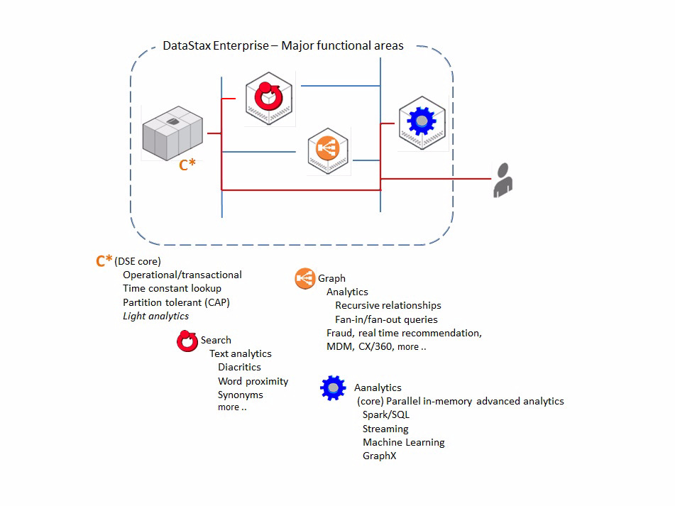
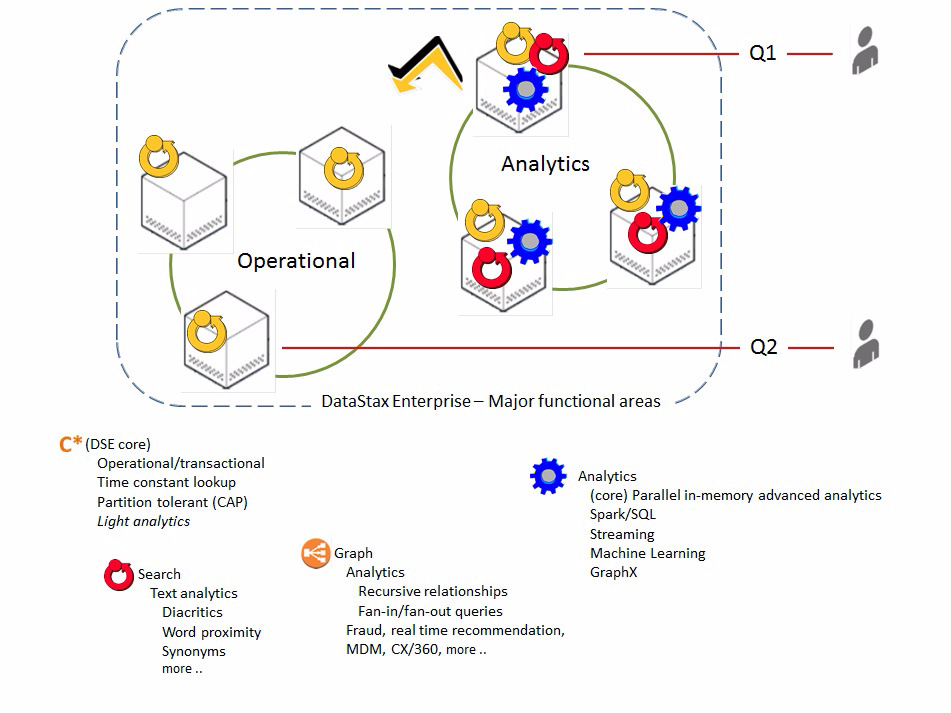
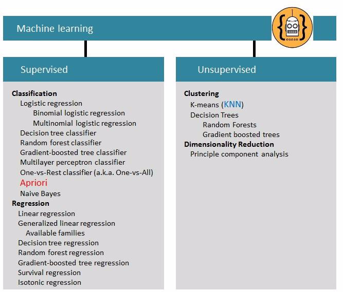
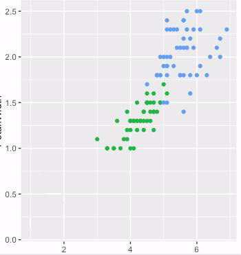
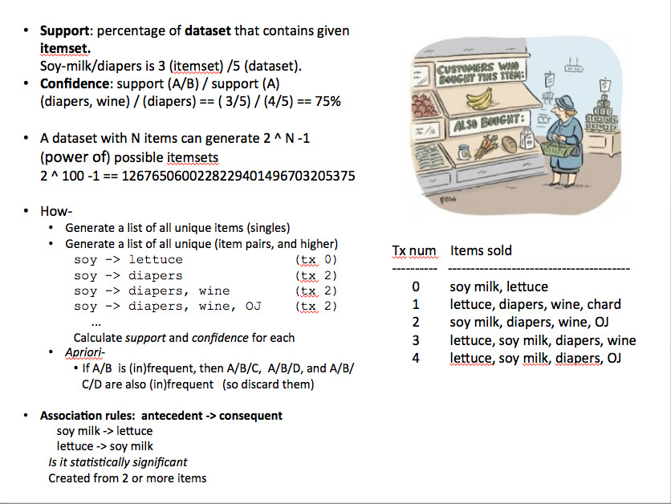
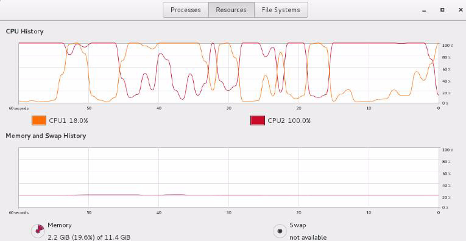
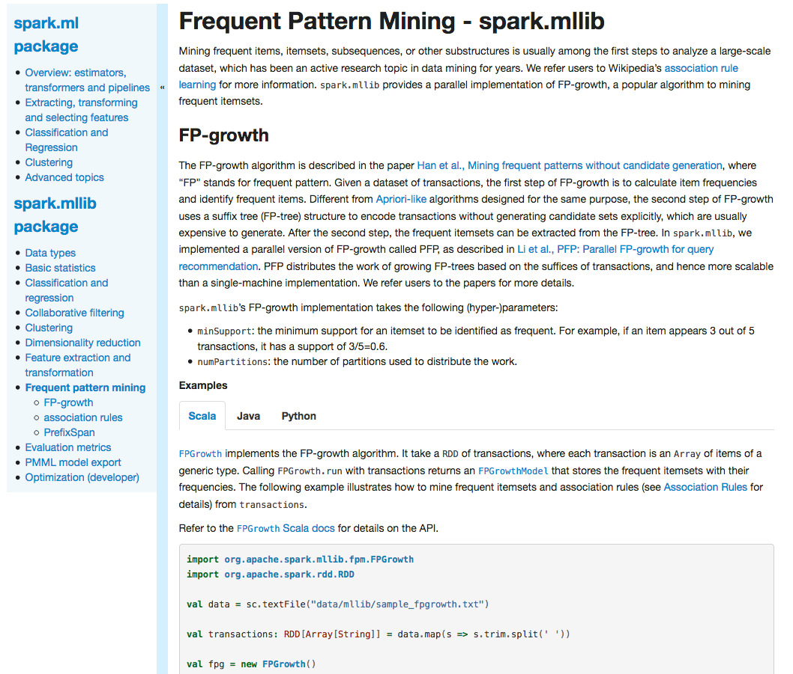
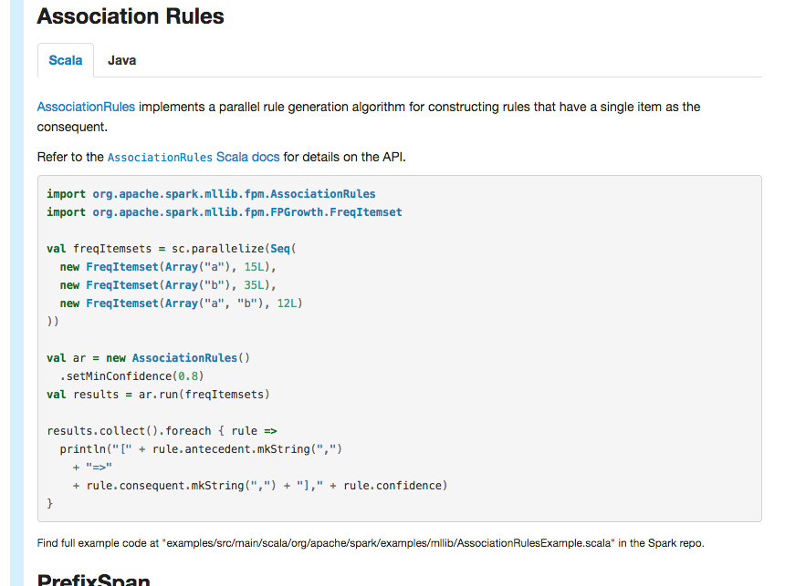
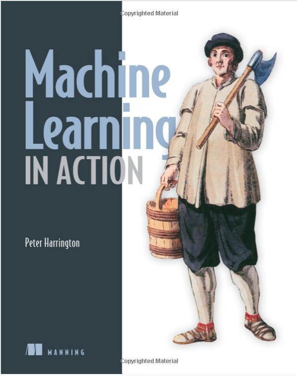

| **[Monthly Articles - 2022](../../README.md)** | **[Monthly Articles - 2021](../../2021/README.md)** | **[Monthly Articles - 2020](../../2020/README.md)** | **[Monthly Articles - 2019](../../2019/README.md)** | **[Monthly Articles - 2018](../../2018/README.md)** | **[Monthly Articles - 2017](../../2017/README.md)** | **[Data Downloads](../../downloads/README.md)** |
|-------------------------|-------------------------|-------------------------|-------------------------|-------------------------|-------------------------|-------------------------|

[Back to 2017 archive](../README.md)
[Download original PDF](../DDN_2017_11_Apriori.pdf)
[Companion asset: DDN_2017_11_Apriori.tar](../DDN_2017_11_Apriori.tar)

---

# DDN 2017 11 Apriori

## Chapter 11. November 2017

DataStax Developer’s Notebook -- November 2017 V1.2

Welcome to the November 2017 edition of DataStax Developer’s Notebook (DDN). This month we answer the following question(s); My company wants to deliver a, "customers who bought (x) also bought (y)" functionality to our Web site, to improve cross sell and up sell (increase revenue per transaction). Can the DataStax database server help me do this ? Excellent question ! In last month’s edition of this document we provided a ‘primer’ on all things DataStax Enterprise (DSE), including an overview of the the analytics functionality in DSE, powered by Apache Spark. Through Apache Spark, DSE has built in machine learning, and more specifically, frequent pattern matching; the specific machine learning algorithm used to deliver “customers who bought (x) ..”. (A frequent name for this same routine is, an Apriori algorithm.) We’ll start with a raw grocery list of approximately 10,000 orders, load it, analyze it, generate association rules, and even use a small Web form (Web site) to demonstrate results. We’ll use some Python for ease of use, and also some Scala; comparing and contrasting both approaches. All code is available for download at the same location as this document.

## Software versions

The primary DataStax software component used in this edition of DataStax Developer’s Notebook (DDN) is DataStax Enterprise (DSE), currently release

5.1. All of the steps outlined below can be run on one laptop with 16 GB of RAM, or if you prefer, run these steps on Amazon Web Services (AWS), Microsoft Azure, or similar, to allow yourself a bit more resource.

For isolation and (simplicity), we develop and test all systems inside virtual machines using a hypervisor (Oracle Virtual Box, VMWare Fusion version 8.5, or similar). The guest operating system we use is CentOS version 7.0, 64 bit.

DataStax Developer’s Notebook -- November 2017 V1.2

## 11.1 Terms and core concepts

As stated above, ultimately the end goal is to deliver a “customers who bought (x) also bought (y)”, machine learning insight and analysis capability, to a Web site. As such, there is a common and two part design pattern that we have to observe:

- Frequent pattern matching, machine learning- By its mere name, frequent pattern matching implies we look at frequent history . And, the definition of machine learning we prefer is, “a routine whose accuracy improves as it examines a larger set of data ”. So, the more data we look at, then the better our insight (improved accuracy) into these frequent buying patterns. In this context, more data could mean terabytes or more of data. Reading/processing terabytes is not completed in sub-second time.

- The Web site delivery means we need low millisecond response times from these routines.

- As such, delivery of this total capability (“customers who bought (x) ..” ) will be delivered in two phases: • A batch job reviewing/processing a large amount of data to detect the frequent buying patterns. E.g., if you buy pasta, we may observe that there’s a high percentage chance you will buy pasta sauce; flashlights and batteries, wrapping paper and tape. • And a (Web service) that performs a fast lookup of what the consumer is viewing, or has just placed in their shopping cart, and then presents the (pre-calculated), “don’t forget the sauce/batteries/tape !”, style prompting.

Examining history in order to gain insight into a data set is referred to as

> Note: the . The output of the training phase is a . training phase model

In this context, model is an abstract term. Each given machine learning routine may output an entirely different model (structure); a single array of terms, a two dimensional array of keys and values, a 20+ axis array of (data), whatever the given analysis routine requires. Models exist as structured data.

Following the training phase, we in order that we may score or apply the model validate newly arriving data; the . scoring phase

DataStax Developer’s Notebook -- November 2017 V1.2

> Note: The training phase may be computationally intensive, or not.

As we will see below, frequency pattern matching has a computationally intensive training phase. Generally, a routine with a computationally intensive training phase has a relatively computationally efficient scoring phase, and this is the case with frequency pattern matching. Oh, you’re buying wine and cheese. We’ve already calculated that response before you arrived. We’ll do an indexed lookup on that item set (wine and cheese), and see that you need fresh bread ! We already knew the history of wine, cheese, and bread, and had all of those items in the database and frequency patterns pre-calculated.

Inversely, computationally efficient (low intensity) training phases are most commonly associated with computationally intensive scoring phases. To give it a name; K-nearest neighbors (Knn) is a machine learning routine with a low intensity training phase, and a computationally intensive scoring phase. The textbook/common example used to introduce the Knn analysis routine is new bird species identification. Imagine a data set of bird; weight, color, wing span, beak style, diet, nesting behavior, environs (climate choice), foot design, other. As an entirely new, never before seen bird arrives, you can score the observed data of this new bird and compare it to known species. If this new bird has talons, a hooked (and sharp) beak, and eats mice, you can start to believe this new bird is related to hawks or eagles. The scoring phase to Knn is computationally intensive because we’ve never seen this bird (this data) before. Generally the scoring phase involves comparing this new, never before seen data set to all previously known data sets while scoring . That takes a while.

Knn is one of many forms of machine learning algorithms, and a clustering common commercial application is to predict customer churn. Customers who churn share these traits, and customers who do not churn share other traits. Given a new set of customer conditions, will this given customer churn ?

A little more background related to run time As stated above, the prior month’s edition of this document offered a primer on most topics related to DataStax Enterprise (DSE). Figure 11-1 displays the four functional areas to DataStax Enterprise (DSE). A code review follows.

DataStax Developer’s Notebook -- November 2017 V1.2



*Figure 11-1 Four primary functional areas to DataStax Enterprise.*

Relative to Figure 11-1, the following is offered:

- DataStax Enterprise (DSE) Analytics, powered by Apache Spark, is that area within DSE which provides machine learning; processing of terabytes and more of data in parallel .

- DSE Core, is that area with time constant lookup. In this context, serve the pre-computer frequency pattern analysis results to the Web site in single digit millisecond time.

Figure 11-2 offers a common DSE network topology, and a code review follows.

DataStax Developer’s Notebook -- November 2017 V1.2



*Figure 11-2 Using multiple data centers to isolate workload by type.*

Relative to Figure 11-2, the following is offered:

- So not only is reading/analyzing terabytes of data not offered at millisecond speed, it is also intrusive to other routines which must be fast. In Figure 11-2, we have configured DSE with two data centers, in order that we may isolate the analytics work load from the workload supporting the Web site. (The two rings represent two data centers.)

A DataStax Enterprise (DSE) is a ; logical

> Note: data center logical construct as in, a (definition or device) used to organize groups of physical constructs.

A data center is just a collection of nodes, and nodes from two data centers could be inches away from one another.

We use DSE data centers as a construct to isolate workload type, as well as to isolate by geography. (Put German data in Germany, Green Bay data in Green Bay.)

DataStax Developer’s Notebook -- November 2017 V1.2

- Inside DSE this is all one cluster, and managed as one logical entity. We use two DSE concepts to isolate these workloads from one another: • Keyspace- We configure DSE to store the Web site data (sales, order data), in one keyspace. This one keyspace has a set of nodes local to one data center and another set of nodes local to another data center; one part of the keyspace local to the operational data center, and another part of the keyspace local to the analytics data center. Using the keyspace construct, DSE will automatically will keep all data in sync between the two data centers in perpetuity as the result of a single command executed one time.

Wait, you mean we’ll have two copies of the data. Why ?

> Note:

One copy of the data will be accessed by the high speed Web site set of activities, and the second copy will be accessed by analytics routines. You can not have the wide, sweeping analytics routines accessing the same copy of data without slowing down the Web site unless you do something similar to what we’ve outlined here.

DSE will automatically handle all of this work for us forever, because of how we create the keyspace.

• (Boot parameters)- Upon system start up (boot, or restart), we configure the nodes in the operational data center to support DSE Core functionality only. And we configure the analytics data center to support DSE Analytics and DSE Core functionality. (DSE Core is always supported as the underlying storage engine.) There is no means by which the analytics workload can infringe on our always fast Web site.

Figure 11-3 offers an overview of the functional areas within Apache Spark machine learning. A code review follows.

DataStax Developer’s Notebook -- November 2017 V1.2



*Figure 11-3 Overview of Spark Machine Learning functional areas.*

Relative to Figure 11-3, the following is offered:

- In Figure 11-2 we kind of blew over what DSE Analytics can do, and how this fits in the overall landscape of DSE. In short: • DSE Core is a time constant lookup storage, and query processing engine; basically a full blown database server. • DSE Search, powered by Apache Solr, provides indexing technology and query processing. DSE Search uses DSE Core for all storage. • DSE Graph, powered by Apache TinkerPop, provides graph centric query processing, with all storage provided by DSE Core. • DSE Analytics is nearly storage unawares. Yes, DSE Analytics reads and writes data, but at its core, DSE Analytics is a parallel processing framework.

> Note: Notice we didn’t say query processing framework above. DSE Analytics, powered by Apache Spark, can process any workload type in parallel; stream, compute, crack passwords, generate random numbers, whatever.

DataStax Developer’s Notebook -- November 2017 V1.2

- DSE Analytics can run Spark SQL, a derivative of Hive/SQL, which is roughly equivalent to ANSI SQL-99. You can do table joins, SQL GROUP BY, etcetera. And DSE Analytics can do stream processing and graph native processing. But, as is the purpose of this document, DSE Analytics supports machine learning which is unique to all of the four functional areas of DSE.

- In Figure 11-3, we overview machine learning per the Apache Spark set of offered routines. We say per Apache Spark, because the details in Figure 11-3 will differ whether you are in Spark, or another machine learning run time. In general, we state the following to be true: • Top down, machine learning categorizes its routines into supervised and unsupervised. • Frequency pattern matching is an example of , and supervised learning is further subcategorized as . In supervised learning, classification generally, you supply a single or set of well defined columns to a machine learning routine, analysis is performed, a model is output, and then the model is used for scoring. • In unsupervised learning, you may not know precisely what is contained in the columns you supply (the official terminology being, these are unlabeled columns ), what the output may be, or whether the output is even useful. Above we referenced the K-nearest neighbors (Knn) unsupervised clustering machine learning algorithm, to detect unknown bird identity. To be more precise, we would have supplied bird data to a Knn routine and asked that routine to generate clusters of data (groups of data). If we asked for two groups of data to be output, we might have received received marine birds and non-marine birds. Or, the data may have produced meat eaters and non-meat eaters. The output of Knn would not have stated or even known what meat or marine is. Knn what have produced the two groups as the mathematically cleanest distinction of two groups of data. Figure 11-4 displays the output of a Knn routine and a random data set where we asked for two groups to be output. A code review follows.

DataStax Developer’s Notebook -- November 2017 V1.2



*Figure 11-4 Visual graph, data output from Knn routine.*

Relative to Figure 11-4, the following is offered:

- As an unsupervised machine learning algorithm, Knn will output a model (like all machine learning algorithms do). Generally the next step we perform is to graph the data (Knn always comes with utilities to perform this work), humans being visual creatures. Now, clearly we cherry picked. We produced a graph that has a very clean data set falling easily into two groups. In the real world, you are almost never this lucky on your first attempt, and the two requested groups would have been 70-90% or more overlapping. Your next step would be to add or remove columns from the Knn analysis routine, or to weight given columns (give certain columns more importance), all in an effort to discover patterns in the data. Or, perhaps you need to look for a higher or lower number of groups.

DataStax Developer’s Notebook -- November 2017 V1.2

> Note: At this point you may be thinking that supervised machine learning produces models ready for consumption (scoring), and that unsupervised machine learning is more of a data discovery set of activities, and we’d be fine with that position.

- In Figure 11-4, the two groups would be output unlabeled; Knn would output two groups, but what is in each group ? Marine, meat, or something we’ve never seen before. In the real world say you are looking to identify customers who churn, versus those customer who do not churn. You might run a Knn machine learning algorithm dozens (hundreds) of times, graphing each result, adding and remove columns, change weighting and related, until you get a clean result (graph/model) in which you have high confidence. You might find 5, 12, 20, or more data points that churn customers share, and that non-churn customer exclude.

- Customer churn is a pretty specific, and high value quest. Another, simpler use of clustering (Knn) is to search for outliers. E.g., you produce silicon wafers on a production line with a 2% defect ratio. What characteristics do these bad chips share ? Was it relative humidity in the production area, Earth wave form resonance, or Earl in Accounting had always badged into the production area with his peanut butter fingers during these faults ?

Supervised and unsupervised machine learning, and the further

> Note: sub-categorization of routines under each, AND knowing the general business use cases for each, is a super highly marketable skill set.

A last word on Knn clustering-

> Note:

While the focus of this document is to provide “customers who bought (x) also bought (y)”, using supervised machine learning and classification, this is only a very good first step. Would you offer to sell the same next grocery item to a 70 year old grandfather who prefers ready-to-eat meals, as you would a 20 year old new mother who favors organic produce ?

Frequent pattern analysis (as done in this document, perhaps using Apriori) is most powerful when combined with clustering (market segmentation), perhaps using Knn.

The Apriori algorithm All frequency pattern matching machine learning algorithms are designed largely the same, and do largely the same processing. Where these various

DataStax Developer’s Notebook -- November 2017 V1.2

implementations differ is in the assumptions they make for efficiency. The Apriori algorithm for frequency analysis is commonly used in recommendation engines, market basket analysis, and similar, and arrived in 1994 from two persons:

- Rakesh Agrawal, of MIT and Purdue.

- And Ramakrishnan Srikant, of UW/Madison, and currently a Google fellow. Go Badgers !

> Note: The Apriori algorithm title derives from a Latin term and means, from before . In the description of the algorithm below, we will highlight where the “from before” behavior (optimization) of this algorithm presents itself.

Figure 11-5 below introduces a small (5 row) grocery order data set we use in the discussion that follows.



*Figure 11-5 Small data set in our discussion of Apriori.*

Relative to Figure 11-5, the following is offered:

- The data set displayed in Figure 11-5 contains five grocery store orders, as listed on the right side of the image. The first order has two items; soy

DataStax Developer’s Notebook -- November 2017 V1.2

milk and lettuce. We see that four of the five orders contain soy milk; orders zero, and two through four.

- The first task in the delivery of the Apriori algorithm is to walk once (loop) through the list of orders and generate a unique list of single items . In this example, this effort produces six unique single items; soy milk, lettuce, diapers, wine, chard (a type of beet), and OJ (orange juice). As a result of this processing we also know the number of total orders in the data set, a number we will use often.

> Note: Why do we generate a unique list of single items ?

The official name of the list is, “ candidate item set of size 1 ”, or C1 .

From this list (C1), we can generate the possible list of item pairs (C2, orders with 2 items, the candidate item set of size 2 ), the possible list of item triplets (C3, orders with 3 items), and so on.

Again, why are we creating these lists; aren’t these combinations already in our order set data ?

Yes, but. The manner in which we create this lists is highly efficient, indexed and in memory. If we build these lists as we read and process the orders data set, we’ll be performing constant re-shuffling and bubble sorts, yadda.

Generating these lists ourselves is faster, and in a moment you will see why.

> Note: There are really just two more keywords (variables) we have to define (support and confidence), and then you will have the bulk of understanding related to Apriori-

Support is defined as the item set count divided by the total order count.

In Figure 11-5:

- Soy milk appears in 4 of 5 orders, and its “support” value is 4 / 5 == 80%.

- Chard appears in only 1 of 5 orders, and its support value is, 1 / 5 == 20%.

- Diapers / Wine appears in 3 of 5 orders, and its support value is 3 / 5 == 60%.

We want to look at frequent item sets, and support is a value used to that end.

DataStax Developer’s Notebook -- November 2017 V1.2

- Our second task is to take C1, and generate a list of items pairs (C2). We generate C2 from C1 using a nested loop, super fast. Thus far all we have been doing is generating internal control structures in memory, inside our analysis routine. Now the fun begins.

We generate items pairs (C2) from C1 because this is the first time we

> Note: are discussing performing this task in the dialog of this document.

On subsequent/further processing, C2 will be used to generate C3, C3 generates C4, and so on, using this same function.

We write this function so that it is re-entrant; so that we may pass (custom, or reduced) C(n) lists.

Why ?

Code optimization for one; write less application program code. But also you will see in a moment we will start pruning these lists C2, C3, etcetera, as given items sets display (weak relationships).

- Our third task is to take C2 and evaluate it, to score it. Remember “support” ? Our sample (and small) data set from Figure 11-5 has only five orders. As such, chard seems to have a really high support value of 20%. In the real world your data sets will have hundreds of thousands (or millions) of orders, and if something is only purchased

0.0002% of the time (a very low support value), you want to discard further processing of it. Why ? Also from Figure 11-5, is a formula that displays how large possible (candidate) item sets can grow. From Figure 11-5, a data set (list of orders) with 100 unique items (a C1), can generate 2 ^ 100 -1 == 1267650600228229401496703205375 item sets The caret (^) above means; 2 to the power of (100). If items have very low support values, we remove them from the candidate item set for efficiency. Also, these items are just not frequently purchased; why even consider up selling them ?

DataStax Developer’s Notebook -- November 2017 V1.2

> Note: The first of our two defined (variables) was support. Now we define confidence .

In Figure 11-5, order number two contains the items (item set); soy milk, diapers, and wine (and OJ). If someone is only currently holding the item diapers, how certain can we be that they may also purchase wine ?

An example will help- The diapers (A) and wine (B) item set occurs in 3 of 5 total orders, a support value of 3 / 5 == 60%. Diapers (A) alone (as an item set) occurs in 4 of 5 total orders, a support value of 4 / 5 == 80% Confidence is defined as support (A,B) / support (A) (diapers-A, wine-B) / (diapers-A) == (3/5) / (4/5) == 75% Thus we can say, from order history; we are 75% confident that a diaper user will also buy wine. 75% is our confidence level.

Just to be excessively verbose- The left side of that equation is called the antecedent, and the right side is called the subsequent. Human behavior certainly, we can not state why diaper users buy wine, but the data displays that they do. Also, notice that the relationship of wine to diapers is different than diapers to wine, because the support value for wine is different; this relationship is directional. Don’t get hung up on the answer, as this data set is ridiculously small and inaccurate.

- Fourth and final tasks- We have the gist of things already covered: • We generate C1, and use this to generate C2, C3 generates C3, and so on. • We use support and confidence to prune C2 on down.

DataStax Developer’s Notebook -- November 2017 V1.2

> Note: Recall that Apriori is latin for “from before” ?

If a given item set is pruned from C(n) because low support or confidence, it also does not get passed down to C(n+1). If folks aren’t buying prunes (low support), why should we expect they buy prunes and beer ? If we have low confidence that folks buy prunes, beer and then danishes, why would we expect with high confidence prunes, beer, danish and then tissues ?

The “from before” reference is made to the manner in which we prune candidate item sets; prune from what we have seen upstream in the derived data.

• Another final task is to output , which are just the association rules stated relationship of confidence level, and an antecedent and consequent item set; example, (diapers --> wine, 75%).

- Where we had candidate item set 1 (C1), producing C2, and so on, we need to mention that the scored (reduced by support and confidence) item sets are generally referred to as, L1, L2, etcetera.

A larger data set We used the first data set of just 5 orders because it is easy for we, humans, to calculate and understand the data. Next we move to a larger data set of 10,000 orders in the data set, as displayed in Figure 11-6. A code review follows.

DataStax Developer’s Notebook -- November 2017 V1.2


*Figure 11-6 A new, larger grocery data set with 10,000 orders*

Relative to Figure 11-6, the following is offered:

- We’d love to credit where we downloaded this larger data set from (probably from one of the Apache Spark pages), but we’ve lost that link. Sorry. (This larger data set is available for your download in the download area adjacent to this document.) 10,000 orders, and at some point this data was likely real; the confidence levels and related association rules seem to make sense.

- In Figure 11-6, we see reference to: • 9,835 total orders, 43,367 total items sold. • 169 unique items. •

4.4 average items per order. • With a requested 1% support level, we can generate 523 association rules.

- Using real’ish data, we see that the highest observed confidence level in this data set was butter to whole milk, at nearly 50%.

DataStax Developer’s Notebook -- November 2017 V1.2

The lowest observed confidence level (still though with a support level of 1% or higher), was whole milk to hard cheese at less then 4% confidence.

Contents of a Tar ball A Tar ball is a Linux operating means to group multiple files into one file for ease of transport/distribution; It’s like a Windows Zip file, without compression. Adjacent to the GitHub site hosting this document is a related Tar ball with the following contents:

```text
– 10_grocery.csv
```

Is an ASCII text file with 10,000 grocery orders; the example (large) data set we detailed above.

```text
– 12_association_rules.csv
```

Is an ASCII text file with 56 association rules we derived from the first data set above. Below, in file 30*, we load these 56 rules into a DSE table and power a Web site.

```text
– 20_AprioriByHand.py
```

In this Python program, we code the entire Apriori algorithm by hand (from scratch, no machine learning libraries). Why ? It’s kind of a nit we have. You can find these machine learning libraries all over the Internet, but finding detail as to what precise calculations, or even what specific input file formatting they expect is a very elusive target. This program is based on a Manning publication (book) we reference below. In effect, if you understand this program, then you are a master of the Apriori algorithm.

DataStax Developer’s Notebook -- November 2017 V1.2

> Note: Another reason (besides mastery of the given routine) we like to write all of our jobs from scratch is completeness; Apache Spark is written in Scala, a Java/JVM based language. It’s getting better, but Spark machine learning libraries arrive first for Scala and Java, and then later or much later for Python. If you look at this current Jira,

```text
https://issues.apache.org/jira/browse/SPARK-14501
```

You see that the Apache Spark, frequency pattern matching library is missing the association rules methods for Python. They are present for Scala and Java, not Python. If you know how to calculate association rules, you’re okay; write them yourself. If not, you now have to port your entire program over to Scala/Java.

We write these programs from scratch to achieve mastery/comprehension. That doesn’t mean we’d run these hand written programs in production.

The approved/canned Apache Spark machine learning libraries are parallel execution capable, where our hand coded Python program is not. That means orders of magnitude gains in performance when running Spark.

```text
– 21_20_ButUsesLargerCSVFileData.py
```

Is a slightly modified copy of the number 20* file above. This version of the (same) program loads the 10,000 line data set from CSV file. (The 20* version of this file uses the 5 row sample orders data set.)

```text
– 24_21_UsingSparkMLlib.py
```

Is a hugely modified copy of the 20* and 21* files above. Instead of hand coding, this version of the program uses the Apache Spark machine learning libraries; parallel aware, very fast, less for us to learn and maintain. Figure 11-7 displays a performance graph when running the single threaded, Python version of the Apriori algorithm. A code review follows.

DataStax Developer’s Notebook -- November 2017 V1.2



*Figure 11-7 Performance graph of the Python, single threaded Apriori program.*

Relative to Figure 11-7, the following is offered:

- You can write multi-threaded, or parallel Python programs, itis just harder; definitely non-trivial for an Apriori algorithm.

- In Figure 11-7 we see we are nailing 1 CPU, leaving the second completely idle. Memory is constant, and no swap.

- Where the hand coded Python Apriori program ran for 20+ minutes, the Apache Spark equivalent ran in seconds.

(Back to the Tar ball contents)

```text
– 30_MakeTablesAndData.py
```

This is a simple Python client program to create a DSE keyspace, table, and insert data. For a default CentOS version 7 Linux operating system, you will need to install the DSE Python client side driver via a,

```text
pip install dse-client
```

“pip” is the Python installer program, similar to “yum” or apt-get” for the operating system.

```text
– 34_RunAsDseSparkJob.py
```

Every sample program in this list and until this point has run as a client program, that is; a connection was opened to the DSE database server,

DataStax Developer’s Notebook -- November 2017 V1.2

and data was either read and/or written in a separate process. Standard client/server access. That’s all good, except; • DataStax Enterprise (DSE) ships with a pre-installed and fully integrated Apache Spark run time. You can easily run your (client) programs in parallel, as managed and directed by Spark. • To submit these (jobs) to run in a parallel Spark framework, you issue a,

```text
dse spark-submit /tmp/farrell0/34_RunAsDseSparkJob.py
“dse”
```

Where is the DSE utility to submit Spark jobs (and more).

```text
“spark-submit”
“dse”
```

is the switch to to indicate that this is to be a new Spark job.

```text
“/tmp/farrell0/ ..”
```

And is the absolute pathname to the given program. • This program happens to demonstrate a Spark/SQL job, written in Python. We read from a given table (the table created and loaded in program 30* above), and output to the screen.

```text
– 40 Scala, simplest compile
```

As detailed above, Apache Spark is more complete using Scala or Java than Python. This directory contains the simplest Scala, Hello World style program you can run. We use this program to validate our Scala run time environment. Comments related to this: • Our CentOS version 7 Linux operating system included an existing Java Development Kit (JDK) version 1.8. • We had to downloaded and installed Scala via a,

```text
wget
http://downloads.typesafe.com/scala/2.11.6/scala-2.11.6.rpm
yum install *.rpm
```

• After that, we placed the Scala subdirectory “./bin” in our $PATH. • You’re done when you can scalac (compile), and then scala (run) the

```text
zzz1.scala
```

file named in this 40* subdirectory.

```text
– 41 Gradle compile, Spark run
```

The sample file in the 40* directory above is just a Hello World style program, used to install verify Scala.

DataStax Developer’s Notebook -- November 2017 V1.2

As soon as you start doing real programming in Scala (or Java), you will need a build tool to download and manage all of your dependencies. You’ll find yourself using a given library for whatever reason, and that library will need 8 more libraries, 2 of which need 14 more libraries themselves, yadda. Automate that by using the Maven or Gradle build management utilities. Since the demonstration programs that ship with DSE use Gradle, we use Gradle.

> Note: Assuming you installed DataStax Enterprise (DSE) in,

```text
/opt/dse/node1/
```

then the demonstration programs are under,

```text
./demos/
```

And in this document we specifically make use of,

```text
/opt/dse/node1/demos/spark-mllib/*
```

An interactive development environment like Apache Eclipse or similar will do all of this for you, automatically. If you are not using those tools, however, here’s the short list to using Gradle: • Gradle is downloaded and installed just like Scala; unpack the downloaded object and install Gradle,

```text
wget
https://services.gradle.org/distributions/gradle-3.4.1-bin.zip
```

• If you get stuck, a good how-to guide is available here,

```text
https://www.vultr.com/docs/how-to-install-gradle-on-centos-7
```

• From whatever parent directory you write your source code from, you will need the following-

```text
build.gradle
```

o You need at least two ASCII text files: , and

```text
gradle.properties
```

, and both are supplied in the Tar ball we are currently discussing.

```text
build.gradle
```

You should only need to edit , in most cases. o And your source code needs to be under,

```text
./src/main/scala/com/your_file_name.scala
“package com”
```

assuming you have a statement in your Scala source code file.

DataStax Developer’s Notebook -- November 2017 V1.2

• This program is still a Hello World style program, but it serves to install verify Scala, Gradle, and Spark submits of same.

```text
– 42 Both above, SQL job
```

This program build on file 41* above, and supplies the 34* (Spark/SQL) job above. In effect; now you can now build and run parallel Spark/SQL using Gradle.

```text
– 43 Both above, DS job
```

And then finally, full Spark parallel frequency pattern matching, using native Spark machine learning libraries. This program should be your end goal. This is your batch job to calculate the association rules and place them in the database to support the Web site application.

```text
– 44_static, 45_views
```

These two folders contains the HTML, JavaScript, CSS and more to support the next program, our Web site proper.

```text
– 60_Index.py
```

And lastly, this is our Web site, as pictured in Figure 11-8. A code review follows.

DataStax Developer’s Notebook -- November 2017 V1.2


*Figure 11-8 The Web site hosting our “customers who ..” functionality.*

Relative to Figure 11-8, the following is offered:

- From a base CentOS version 7 Linux operating system install, you will need to first run,

```text
pip install dse-client
pip install flask
```

“pip” is the Python package installer program, and these two commands install the DSE Python client side driver, and the library we use to run our lightweight Web site, titled flask.

- To run the Web site enter a,

```text
python 60_Index.py
```

The Web site appears at localhost, port 8080. This Web site is a single page best practice application; the HTML and related load one time, then the only transport between the Web server and Web browser are data. Choose an order item, and the response is the up sell / cross sell items in decreasing confidence ranking in a dynamically created HTML table.

DataStax Developer’s Notebook -- November 2017 V1.2

A very few number of code reviews A lot of program files are referenced above. We are going to take time to look at just two of the files above:

```text
– 20_AprioriByHand.py
```

The full comprehension, coded by hand solution.

```text
– 40_Both above, DS Job/src/main/scala/com/zzz4.scala
```

And the (use the libraries that are out there, and run it in parallel) solution.

Example 11-1 displays the Apriori by hand solution, file 20*. A code review follows.

### Example 11-1 20_AprioriByHand.py

```text
#
# This program output association rules from an internal
# hard coded grocery data set.
#
# Association rules as in; persons who buy pasta buy wine
# 60% of the time, or whatever.
#
# This point of this program is that it delivers the
# Apriori algorithm entirely by hand, so that you may
# see in detail what an Apriori routine does.
#
# This program borrows heavily from Ch 11 in the Manning
# book, Machine Learning in Action, by Peter Harrington.
#
```

```text
#
# frequent items sets, items bought together
# association rules, support and confidence for the above
#
# Tx num Items
# ------ ----------------------------------------
# 0 soy milk, lettuce
# 1 lettuce, diapers, wine, chard
# 2 soy milk, diapers, wine, OJ
# 3 lettuce, soy milk, diapers, wine
# 4 lettuce, soy milk, diapers, OJ
#
# support, percentage of dataset that contains a given
# itemset. Above, soy and diapers is 3/5.
#
# confidence,
# support (A,B) / support (A)
```

DataStax Developer’s Notebook -- November 2017 V1.2

```text
#
# so, support (diapers, wine: 3/5) / support (diapers: 4/5)
#
# .. (3/5) / (4/5) = .6 / .8 = 75%
#
# Take each item above and produce item sets,
#
# soy -> lettuce (tx 0)
# soy -> diapers (tx 2)
# soy -> diapers, wine (tx 2)
# soy -> diapers, wine, OJ (tx 2)
# ..
#
# A dataset with N items can generate 2 ^ N - 1
# possible itemsets (power of)
#
# A store with 100 items can generate 1.26 * 10 ^ 30
# item sets.
#
#
# Apriori, Latin 'from before'. A means to optimize
# the above. Eg, if A/B is in/frequent, then A/B/C,
# A/B/D, and A/B/C/D are also in/frequent.
#
# The impact above is, if 'support' of A/B is not
# to our liking, we don't have to calc A/B/C ..
#
```

```text
from numpy import *
```

```text
###########################################################
###########################################################
```

```text
#
# From our list of orders, create a list of unique
# single items.
#
# Why ?
#
# From this list we can create all subsequent pairs,
# triplets, and higher lists of items.
#
def create_itemSet(i_orders):
```

```text
l_itemSet = []
```

DataStax Developer’s Notebook -- November 2017 V1.2

```text
for l_order in i_orders:
for item in l_order:
if not [item] in l_itemSet:
l_itemSet.append([item])
```

```text
l_itemSet.sort()
```

```text
return map(frozenset, l_itemSet)
```

```text
#
# Input:
# [ "soy milk" , "lettuce" ],
# [ "lettuce" , "diapers" , "wine" , "chard" ],
# [ "soy milk" , "diapers" , "wine" , "OJ" ],
# [ "lettuce" , "soy milk" , "diapers" , "wine" ],
# [ "lettuce" , "soy milk" , "diapers" , "OJ" ]
#
# Output:
# [
# frozenset(['OJ']),
# frozenset(['chard']),
# frozenset(['diapers']),
# frozenset(['lettuce']),
# frozenset(['soy milk']),
# frozenset(['wine'])
# ]
#
```

```text
###########################################################
###########################################################
```

```text
#
# sets and frozenset, See,
# https://docs.python.org/2.4/lib/types-set.html
#
# sets, unordered collection of immutable values,
# the set itself is mutable, not hashable
# m = set()
# m.add('lll')
#
# frozenset, the set itself is immutable, is hashable
#
# fset = frozenset(m)
```

DataStax Developer’s Notebook -- November 2017 V1.2

```text
#
#
# map(), See,
# http://www.bogotobogo.com/python/python_fncs_map_filter_reduce.php
#
# items = [1, 2, 3, 4, 5]
# squared = []
# for x in items:
# squared.append(x ** 2)
#
# [1, 4, 9, 16, 25]
#
# Using map(),
#
# items = [1, 2, 3, 4, 5]
#
# def sqr(x): return x ** 2
#
# list(map(sqr, items))
#
# [1, 4, 9, 16, 25]
#
```

```text
def generate_itemPairs(i_itemList, i_offset):
```

```text
#
# This function takes an item list and generates all
# next layer possible pairs items. Eg., if passed the
# set of item singles, generate item pairs.
#
# Why only generate the next tier of pairs ?
#
# Because each tier is expected to be evaluated and
# possibly pruned. Eg., if no one ever buys 'prunes',
# then the liklihood someone buys 'prunes' and
# 'chocolate' is also low.
#
r_itemList = []
```

```text
l_itemListLength = len(i_itemList)
```

```text
for i in range(l_itemListLength):
for j in range(i + 1, l_itemListLength):
#
L1 = list(i_itemList[i])[ : i_offset - 2]
L2 = list(i_itemList[j])[ : i_offset - 2]
#
L1.sort()
```

DataStax Developer’s Notebook -- November 2017 V1.2

```text
L2.sort()
#
# If the first elements (the keys) are equal
# then
#
if L1 == L2:
#
# Set union, which is the vertical bar symbol
#
# Why ?
#
# 0 1 2 would output,
# 0,1 0,2 1,2
# which are all unique
#
# When you hit the third level, you would need
# a third loop to remove redundancy. Consider,
#
# 0,1 0,2 1,2
#
# which gens,
#
# 0,1,2 0,1,2 1,2 ..
#
# This next line removes those dups
#
r_itemList.append(i_itemList[i] | i_itemList[j])
```

```text
return r_itemList
```

```text
#
# Input, pass 1:
# [
# frozenset(['chard']),
# frozenset(['wine']),
# frozenset(['diapers']),
# frozenset(['soy milk']),
# frozenset(['lettuce']),
# frozenset(['OJ'])
# ]
# 2
#
# Output:
# [
# frozenset(['chard', 'wine']),
# frozenset(['chard', 'diapers']),
# frozenset(['soy milk', 'chard']),
# frozenset(['lettuce', 'chard']),
```

DataStax Developer’s Notebook -- November 2017 V1.2

```text
# frozenset(['chard', 'OJ']),
# frozenset(['diapers', 'wine']),
# frozenset(['soy milk', 'wine']),
# frozenset(['lettuce', 'wine']),
# frozenset(['OJ', 'wine']),
# frozenset(['soy milk', 'diapers']),
# frozenset(['lettuce', 'diapers']),
# frozenset(['diapers', 'OJ']),
# frozenset(['lettuce', 'soy milk']),
# frozenset(['soy milk', 'OJ']),
# frozenset(['lettuce', 'OJ'])
# ]
#
```

```text
#
# Input, pass 2:
# [
# frozenset(['soy milk', 'diapers']),
# frozenset(['lettuce', 'wine']),
# frozenset(['lettuce', 'OJ']),
# frozenset(['OJ', 'wine']),
# frozenset(['soy milk', 'OJ']),
# frozenset(['lettuce', 'soy milk']),
# frozenset(['lettuce', 'chard']),
# frozenset(['diapers', 'wine']),
# frozenset(['chard', 'diapers']),
# frozenset(['diapers', 'OJ']),
# frozenset(['soy milk', 'wine']),
# frozenset(['lettuce', 'diapers']),
# frozenset(['chard', 'wine'])
# ]
# 3
#
# Output,
# [
# frozenset(['soy milk', 'diapers', 'OJ']),
# frozenset(['soy milk', 'diapers', 'wine']),
# frozenset(['lettuce', 'OJ', 'wine']),
# frozenset(['lettuce', 'soy milk', 'wine']),
# frozenset(['lettuce', 'chard', 'wine']),
# frozenset(['lettuce', 'diapers', 'wine']),
# frozenset(['lettuce', 'soy milk', 'OJ']),
# frozenset(['lettuce', 'OJ', 'chard']),
# frozenset(['lettuce', 'OJ', 'diapers']),
# frozenset(['soy milk', 'OJ', 'wine']),
# frozenset(['lettuce', 'soy milk', 'chard']),
# frozenset(['lettuce', 'soy milk', 'diapers']),
# frozenset(['lettuce', 'chard', 'diapers']),
# frozenset(['OJ', 'diapers', 'wine']),
```

DataStax Developer’s Notebook -- November 2017 V1.2

```text
# frozenset(['wine', 'chard', 'diapers'])
# ]
#
```

```text
#
# Input, pass 3:
# [
# frozenset(['lettuce', 'chard', 'wine']),
# frozenset(['wine', 'chard', 'diapers']),
# frozenset(['soy milk', 'diapers', 'wine']),
# frozenset(['lettuce', 'diapers', 'wine']),
# frozenset(['lettuce', 'soy milk', 'wine']),
# frozenset(['lettuce', 'OJ', 'diapers']),
# frozenset(['OJ', 'diapers', 'wine']),
# frozenset(['soy milk', 'OJ', 'wine']),
# frozenset(['lettuce', 'soy milk', 'OJ']),
# frozenset(['lettuce', 'chard', 'diapers']),
# frozenset(['soy milk', 'diapers', 'OJ']),
# frozenset(['lettuce', 'soy milk', 'diapers'])
# ]
# 4
#
# Output:
# [
# frozenset(['lettuce', 'diapers', 'chard', 'wine']),
# frozenset(['OJ', 'soy milk', 'diapers', 'wine']),
# frozenset(['lettuce', 'OJ', 'soy milk', 'wine']),
# frozenset(['lettuce', 'soy milk', 'diapers', 'wine']),
# frozenset(['lettuce', 'OJ', 'soy milk', 'diapers'])
# ]
#
```

```text
###########################################################
###########################################################
```

```text
def scan_orders(i_orders, i_itemSet, i_minSupport):
```

```text
#
# An empty dictionary, used to hold counts per
# item(s). And items could be a single item, or
# 2 or more items as generated outside of this
# function.
#
# This function calculates 'support'. Eg., what
# percent of orders contain this item. As such,
```

DataStax Developer’s Notebook -- November 2017 V1.2

```text
# we always pass the complete orders list.
#
l_itemAndCount = {}
```

```text
for l_order in i_orders:
for l_item in i_itemSet:
#
# i_itemSet is a list of items; possibly
# single items, possibly groups of 2 or
# more items.
#
# Why ?
#
# Whoever calls this function has pruned
# the i_itemSet to contain only those items
# we have interest in.
#
# Eg., if no one ever buys 'prunes', then
# the liklihood someone buys 'prunes' and
# 'chocolate' is also low.
#
if l_item.issubset(l_order):
#
# This order has an item in our watch
# list.
#
# If we've never seen this item, add it
# to our result with a count of 1. Else
# we have the item, increment the count
# by 1.
#
if (l_itemAndCount.has_key(l_item)):
l_itemAndCount[l_item] += 1
else:
l_itemAndCount[l_item] = 1
```

```text
#
# Here we have the counts of specific item(s).
# Calculate final responses.
#
r_itemsMatching = []
r_itemsAllWithSupport = {}
#
l_numOrders = float(len(i_orders))
```

```text
#
# Score our result set, prepare return values.
#
```

DataStax Developer’s Notebook -- November 2017 V1.2

```text
for l_item in l_itemAndCount:
l_support = l_itemAndCount[l_item] / l_numOrders
#
if (l_support >= i_minSupport):
r_itemsMatching.insert(0, l_item)
r_itemsAllWithSupport[l_item] = l_support
```

```text
return r_itemsMatching, r_itemsAllWithSupport
```

```text
#
# Input, pass 1:
# All orders (same for each pass)
# [
# set(['lettuce', 'soy milk']),
# set(['lettuce', 'chard', 'diapers', 'wine']),
# set(['OJ', 'soy milk', 'diapers', 'wine']),
# set(['lettuce', 'soy milk', 'diapers', 'wine']),
# set(['lettuce', 'soy milk', 'diapers', 'OJ'])
# ]
#
# Specific item(s) to measure 'support' for
# [
# frozenset(['OJ']),
# frozenset(['chard']),
# frozenset(['diapers']),
# frozenset(['lettuce']),
# frozenset(['soy milk']),
# frozenset(['wine'])
# ]
#
# Requested 'l_confidence', same for each pass
# 0.08
#
# Output:
# All single items
# [
# frozenset(['chard']),
# frozenset(['wine']),
# frozenset(['diapers']),
# frozenset(['soy milk']),
# frozenset(['lettuce']),
# frozenset(['OJ'])
# ]
#
# With 5 orders, and a requested confidence of
# 0.08, all items pass
# {
# frozenset(['OJ']): 0.4,
```

DataStax Developer’s Notebook -- November 2017 V1.2

```text
# frozenset(['lettuce']): 0.8,
# frozenset(['soy milk']): 0.8,
# frozenset(['diapers']): 0.8,
# frozenset(['wine']): 0.6,
# frozenset(['chard']): 0.2
# }
#
```

```text
#
# Input, pass 2:
# ( Same input 1, and 3)
#
# 15 (count) possible item pairs, only 2 pairs did
# not occur in 5 orders:
# soy milk, chard
# and
# chard, OJ
# [
# frozenset(['chard', 'wine']),
# frozenset(['chard', 'diapers']),
# frozenset(['soy milk', 'chard']),
# frozenset(['lettuce', 'chard']),
# frozenset(['chard', 'OJ']),
# frozenset(['diapers', 'wine']),
# frozenset(['soy milk', 'wine']),
# frozenset(['lettuce', 'wine']),
# frozenset(['OJ', 'wine']),
# frozenset(['soy milk', 'diapers']),
# frozenset(['lettuce', 'diapers']),
# frozenset(['diapers', 'OJ']),
# frozenset(['lettuce', 'soy milk']),
# frozenset(['soy milk', 'OJ']),
# frozenset(['lettuce', 'OJ'])
# ]
#
# 13 item pairs happened 0.08 or more times
#
# Output:
# [
# frozenset(['soy milk', 'diapers']),
# frozenset(['lettuce', 'wine']),
# frozenset(['lettuce', 'OJ']),
# frozenset(['OJ', 'wine']),
# frozenset(['soy milk', 'OJ']),
# frozenset(['lettuce', 'soy milk']),
# frozenset(['lettuce', 'chard']),
# frozenset(['diapers', 'wine']),
# frozenset(['chard', 'diapers']),
# frozenset(['diapers', 'OJ']),
```

DataStax Developer’s Notebook -- November 2017 V1.2

```text
# frozenset(['soy milk', 'wine']),
# frozenset(['lettuce', 'diapers']),
# frozenset(['chard', 'wine'])
# ]
#
# {
# frozenset(['chard', 'wine']): 0.2,
# frozenset(['lettuce', 'diapers']): 0.6,
# frozenset(['soy milk', 'wine']): 0.4,
# frozenset(['diapers', 'OJ']): 0.4,
# frozenset(['chard', 'diapers']): 0.2,
# frozenset(['diapers', 'wine']): 0.6,
# frozenset(['lettuce', 'chard']): 0.2,
# frozenset(['lettuce', 'soy milk']): 0.6,
# frozenset(['soy milk', 'OJ']): 0.4,
# frozenset(['OJ', 'wine']): 0.2,
# frozenset(['lettuce', 'OJ']): 0.2,
# frozenset(['lettuce', 'wine']): 0.4,
# frozenset(['soy milk', 'diapers']): 0.6
# }
#
```

```text
#
# Input, pass 3:
# ( Same input 1, and 3)
#
# 15 (count) possible item triplets, only 3 pairs did
# not occur in 5 orders:
# lettuce, OJ, wine
# lettuce, OJ, chard
# lettuce, soy milk, chard
# [
# frozenset(['soy milk', 'diapers', 'OJ']),
# frozenset(['soy milk', 'diapers', 'wine']),
# frozenset(['lettuce', 'OJ', 'wine']),
# frozenset(['lettuce', 'soy milk', 'wine']),
# frozenset(['lettuce', 'chard', 'wine']),
# frozenset(['lettuce', 'diapers', 'wine']),
# frozenset(['lettuce', 'soy milk', 'OJ']),
# frozenset(['lettuce', 'OJ', 'chard']),
# frozenset(['lettuce', 'OJ', 'diapers']),
# frozenset(['soy milk', 'OJ', 'wine']),
# frozenset(['lettuce', 'soy milk', 'chard']),
# frozenset(['lettuce', 'soy milk', 'diapers']),
# frozenset(['lettuce', 'chard', 'diapers']),
# frozenset(['OJ', 'diapers', 'wine']),
# frozenset(['wine', 'chard', 'diapers'])
# ]
#
```

DataStax Developer’s Notebook -- November 2017 V1.2

```text
# Output:
# [
# frozenset(['lettuce', 'chard', 'wine']),
# frozenset(['wine', 'chard', 'diapers']),
# frozenset(['soy milk', 'diapers', 'wine']),
# frozenset(['lettuce', 'diapers', 'wine']),
# frozenset(['lettuce', 'soy milk', 'wine']),
# frozenset(['lettuce', 'OJ', 'diapers']),
# frozenset(['OJ', 'diapers', 'wine']),
# frozenset(['soy milk', 'OJ', 'wine']),
# frozenset(['lettuce', 'soy milk', 'OJ']),
# frozenset(['lettuce', 'chard', 'diapers']),
# frozenset(['soy milk', 'diapers', 'OJ']),
# frozenset(['lettuce', 'soy milk', 'diapers'])
# ]
#
# {
# frozenset(['lettuce', 'soy milk', 'diapers']): 0.4,
# frozenset(['soy milk', 'diapers', 'OJ']): 0.4,
# frozenset(['lettuce', 'chard', 'diapers']): 0.2,
# frozenset(['lettuce', 'soy milk', 'OJ']): 0.2,
# frozenset(['soy milk', 'OJ', 'wine']): 0.2,
# frozenset(['OJ', 'diapers', 'wine']): 0.2,
# frozenset(['lettuce', 'OJ', 'diapers']): 0.2,
# frozenset(['lettuce', 'soy milk', 'wine']): 0.2,
# frozenset(['lettuce', 'diapers', 'wine']): 0.4,
# frozenset(['soy milk', 'diapers', 'wine']): 0.4,
# frozenset(['wine', 'chard', 'diapers']): 0.2,
# frozenset(['lettuce', 'chard', 'wine']): 0.2
# }
#
```

```text
#
# Input, pass 4:
# ( Same input 1, and 3)
#
#
# 5 (count) possible item quatros, only 1 pair did
# not occur in 5 orders:
# lettuce, OJ, soy milk, wine
# [
# frozenset(['lettuce', 'diapers', 'chard', 'wine']),
# frozenset(['OJ', 'soy milk', 'diapers', 'wine']),
# frozenset(['lettuce', 'OJ', 'soy milk', 'wine']),
# frozenset(['lettuce', 'soy milk', 'diapers', 'wine']),
# frozenset(['lettuce', 'OJ', 'soy milk', 'diapers'])
# ]
#
# Output:
```

DataStax Developer’s Notebook -- November 2017 V1.2

```text
# [
# frozenset(['OJ', 'soy milk', 'diapers', 'wine']),
# frozenset(['lettuce', 'soy milk', 'diapers', 'wine']),
# frozenset(['lettuce', 'diapers', 'chard', 'wine']),
# frozenset(['lettuce', 'OJ', 'soy milk', 'diapers'])
# ]
#
# {
# frozenset(['lettuce', 'OJ', 'soy milk', 'diapers']): 0.2,
# frozenset(['lettuce', 'diapers', 'chard', 'wine']): 0.2,
# frozenset(['lettuce', 'soy milk', 'diapers', 'wine']): 0.2,
# frozenset(['OJ', 'soy milk', 'diapers', 'wine']): 0.2
# }
```

```text
###########################################################
###########################################################
```

```text
#
# This function acts as a driver of sorts, calling:
#
# create_itemSet(i_orders)
# Take the orders list and generate a list of
# single unique items. This list is used to
# generate pairs of items, triples or items,
# Etcetera.
#
# generate_itemPairs(l_itemsMatching, l_offset)
# Given a set of item pairs that have been
# found to have a given 'support', generate
# the further pairs. Eg., If wine/diapers
# has a high enough support, generate the
# next possible item wine/diapers/xxx, where
# xxx comes from the overall item list.
#
# l_offset instructs this function where to
# join the list for generating the next (pairs).
#
# scan_orders(l_ordersAsSet, l_candidateItems,
# i_minSupport)
#
# l_ordersAsSet is the list of all orders.
#
# l_candidateItems is the list if single
# paired, and higher items (3's, 4's, ..)
# that received a given 'support' or higher.
```

DataStax Developer’s Notebook -- November 2017 V1.2

```text
#
```

```text
def apriori(i_orders, i_minSupport):
```

```text
#
# Create a list of single unique items from this
# list of orders.
#
l_itemSet = create_itemSet(i_orders)
```

```text
#
# Convert the list of orders into a set.
# [ set(['eggs']), set(['milk']), ..
#
l_ordersAsSet = map(set, i_orders)
```

```text
#
# Return just the items of interest (high level of
# 'support' for just single items.
#
l_itemsMatching, r_itemsAllWithSupport = scan_orders(
l_ordersAsSet, l_itemSet, i_minSupport)
```

```text
r_itemsMatching = [l_itemsMatching]
#
l_offset = 2
```

```text
#
# Above we calculated items of interest for just
# single items.
#
# This loop, and its funny array indexing is merely
# to generate (and then calculate the 'support' for)
# items pairs, items threes, fours, ..
#
# generate_itemPairs() is new, because we did not
# need more than item singles.
#
# Otherwise, scan_orders() is exactly the same.
#
while (len(r_itemsMatching[l_offset - 2]) > 0):
#
l_candidateItems = generate_itemPairs(
r_itemsMatching[l_offset-2], l_offset)
#
l_itemMatching, l_itemWithSupport = scan_orders(
l_ordersAsSet, l_candidateItems, i_minSupport)
#
```

DataStax Developer’s Notebook -- November 2017 V1.2

```text
#
# r_itemsAllWithSupport contains all items, thus
# we do an array update.
#
r_itemsAllWithSupport.update(l_itemWithSupport)
#
# r_itemsMatching contains only items we have seen,
# those we have seen, thus we do an append.
#
r_itemsMatching.append(l_itemMatching)
#
l_offset += 1
```

```text
return r_itemsMatching, r_itemsAllWithSupport
```

```text
#
# Input:
# [
# ['soy milk', 'lettuce'],
# ['lettuce', 'diapers', 'wine', 'chard'],
# ['soy milk', 'diapers', 'wine', 'OJ'],
# ['lettuce', 'soy milk', 'diapers', 'wine'],
# ['lettuce', 'soy milk', 'diapers', 'OJ']
# ]
# 0.08
# Output:
# [
# [
# frozenset(['chard']),
# frozenset(['wine']),
# frozenset(['diapers']),
# frozenset(['soy milk']),
# frozenset(['lettuce']),
# frozenset(['OJ'])
# ],
# [
# frozenset(['soy milk', 'diapers']),
# frozenset(['lettuce', 'wine']),
# frozenset(['lettuce', 'OJ']),
# frozenset(['OJ', 'wine']),
# frozenset(['soy milk', 'OJ']),
# frozenset(['lettuce', 'soy milk']),
# frozenset(['lettuce', 'chard']),
# frozenset(['diapers', 'wine']),
# frozenset(['chard', 'diapers']),
# frozenset(['diapers', 'OJ']),
# frozenset(['soy milk', 'wine']),
# frozenset(['lettuce', 'diapers']),
```

DataStax Developer’s Notebook -- November 2017 V1.2

```text
# frozenset(['chard', 'wine'])
# ],
# [
# frozenset(['lettuce', 'chard', 'wine']),
# frozenset(['wine', 'chard', 'diapers']),
# frozenset(['soy milk', 'diapers', 'wine']),
# frozenset(['lettuce', 'diapers', 'wine']),
# frozenset(['lettuce', 'soy milk', 'wine']),
# frozenset(['lettuce', 'OJ', 'diapers']),
# frozenset(['OJ', 'diapers', 'wine']),
# frozenset(['soy milk', 'OJ', 'wine']),
# frozenset(['lettuce', 'soy milk', 'OJ']),
# frozenset(['lettuce', 'chard', 'diapers']),
# frozenset(['soy milk', 'diapers', 'OJ']),
# frozenset(['lettuce', 'soy milk', 'diapers'])
# ],
# [
# frozenset(['OJ', 'soy milk', 'diapers', 'wine']),
# frozenset(['lettuce', 'soy milk', 'diapers', 'wine']),
# frozenset(['lettuce', 'diapers', 'chard', 'wine']),
# frozenset(['lettuce', 'OJ', 'soy milk', 'diapers'])
# ]
#
# {
# frozenset(['chard', 'wine']): 0.2,
# frozenset(['lettuce', 'soy milk', 'diapers']): 0.4,
# frozenset(['OJ']): 0.4,
# frozenset(['soy milk', 'diapers', 'OJ']): 0.4,
# frozenset(['lettuce', 'soy milk', 'OJ']): 0.2,
# frozenset(['diapers']): 0.8,
# frozenset(['lettuce', 'OJ', 'diapers']): 0.2,
# frozenset(['chard', 'diapers']): 0.2,
# frozenset(['diapers', 'wine']): 0.6,
# frozenset(['lettuce', 'diapers', 'chard', 'wine']): 0.2,
# frozenset(['lettuce', 'soy milk', 'diapers', 'wine']): 0.2,
# frozenset(['lettuce', 'soy milk', 'wine']): 0.2,
# frozenset(['OJ', 'soy milk', 'diapers', 'wine']): 0.2,
# frozenset(['OJ', 'wine']): 0.2,
# frozenset(['wine']): 0.6,
# frozenset(['lettuce', 'OJ']): 0.2,
# frozenset(['wine', 'chard', 'diapers']): 0.2,
# frozenset(['lettuce', 'chard', 'diapers']): 0.2,
# frozenset(['lettuce', 'chard', 'wine']): 0.2,
# frozenset(['OJ', 'diapers', 'wine']): 0.2,
# frozenset(['lettuce', 'diapers']): 0.6,
# frozenset(['soy milk', 'wine']): 0.4,
# frozenset(['diapers', 'OJ']): 0.4,
# frozenset(['lettuce']): 0.8,
# frozenset(['lettuce', 'OJ', 'soy milk', 'diapers']): 0.2,
```

DataStax Developer’s Notebook -- November 2017 V1.2

```text
# frozenset(['soy milk']): 0.8,
# frozenset(['soy milk', 'diapers', 'wine']): 0.4,
# frozenset(['lettuce', 'diapers', 'wine']): 0.4,
# frozenset(['lettuce', 'chard']): 0.2,
# frozenset(['lettuce', 'soy milk']): 0.6,
# frozenset(['soy milk', 'OJ']): 0.4,
# frozenset(['chard']): 0.2,
# frozenset(['lettuce', 'wine']): 0.4,
# frozenset(['soy milk', 'OJ', 'wine']): 0.2,
# frozenset(['soy milk', 'diapers']): 0.6
# }
#
```

```text
###########################################################
###########################################################
###########################################################
###########################################################
```

```text
#
# These next 3 functions calulcate the association rules.
# Eg., persons who buy pasta buy wine x% of the time.
#
# Association rules can only be calculated on orders with
# 2 or more items.
#
# Definitions:
#
# 'frequent item set', a single or set of items
# which are purchased frequently. this frequency
# is reflected in the 'support' value, defined
# below.
#
# 'support' = count-of-item-set / count-of-orders
# Eg., if wine occurs in 3 orders, and there
# are 5 orders total, the support for wine is
# 60% ( 3 / 5)
#
# 'confidence' = support (A,B) / support (A)
# Eg., if wine,pasta occurs in 3 of 5 orders,
# and wine occurs in 4 of 5 orders, then
# (3/5) / (4/5) == 60% / %80 == 75%
# Our confidence that a wine buyer will buy
# pasta is 75%.
#
```

DataStax Developer’s Notebook -- November 2017 V1.2

```text
def gen_assocRules(i_itemsMatching, i_itemsAllWithSupport,
i_minConf):
```

```text
r_ruleList = []
```

```text
#
# Only get the sets with two or more items in an order.
#
# Why does the first for-loop start with 1 ? Because
# that index of i_itemsMatching contains pairs of items.
#
for i in range(1, len(i_itemsMatching)):
for l_itemSet in i_itemsMatching[i]:
```

```text
#
# We need the l_itemSet as an indexable
# data structure, hence frozen.
#
l_itemSetFrozen = [frozenset([l_item]) for
l_item in l_itemSet]
#
if (i > 1):
#
# This block will be true for triplets of items
# and higher.
#
# This block does some optimizations before
# calling do_calcConf()
#
do_calcRule(l_itemSet, l_itemSetFrozen,
i_itemsAllWithSupport, r_ruleList, i_minConf)
else:
#
# This block will be true for pairs of items.
#
do_calcConf(l_itemSet, l_itemSetFrozen,
i_itemsAllWithSupport, r_ruleList, i_minConf)
```

```text
return r_ruleList
```

```text
###############################################
```

```text
#
# Calculate the confidence.
#
def do_calcConf(i_itemSet, i_itemSetFrozen, i_itemsAllWithSupport,
i_ruleList, i_minConf):
```

DataStax Developer’s Notebook -- November 2017 V1.2

```text
#
# Create new list to return.
#
r_prunedItemSets = []
```

```text
for l_itemSetOfConseq in i_itemSetFrozen:
l_confidence = ( i_itemsAllWithSupport[i_itemSet] /
i_itemsAllWithSupport[ i_itemSet -
l_itemSetOfConseq ] )
if l_confidence >= i_minConf:
i_ruleList.append((i_itemSet-l_itemSetOfConseq,
l_itemSetOfConseq, l_confidence))
r_prunedItemSets.append(l_itemSetOfConseq)
```

```text
return r_prunedItemSets
```

```text
###############################################
```

```text
#
# Merges itemsets to those with 2 or more items only.
#
def do_calcRule(i_itemSet, i_itemSetFrozen, i_itemsAllWithSupport,
i_ruleList, i_minConf):
```

```text
i = len(i_itemSetFrozen[0])
```

```text
#
# Try further merging.
#
if (len(i_itemSet) > (i + 1)):
l_allPossRules = generate_itemPairs(i_itemSetFrozen, i+1)
#
l_allPossRules = do_calcConf(i_itemSet, l_allPossRules,
i_itemsAllWithSupport, i_ruleList, i_minConf)
#
# Need at least two sets to merge
#
if (len(l_allPossRules) > 1):
do_calcRule(i_itemSet, l_allPossRules,
i_itemsAllWithSupport, i_ruleList, i_minConf)
```

```text
###########################################################
###########################################################
```

DataStax Developer’s Notebook -- November 2017 V1.2

```text
#
# Sample orders ..
#
def load_orders():
```

```text
return [
[ "soy milk" , "lettuce" ],
[ "lettuce" , "diapers" , "wine" , "chard" ],
[ "soy milk" , "diapers" , "wine" , "OJ" ],
[ "lettuce" , "soy milk" , "diapers" , "wine" ],
[ "lettuce" , "soy milk" , "diapers" , "OJ" ]
]
```

```text
###########################################################
```

```text
m_orders = load_orders()
```

```text
l_itemsMatching, l_itemsAllWithSupport = apriori(
m_orders, 0.08)
```

```text
m_rules = gen_assocRules(l_itemsMatching,
l_itemsAllWithSupport, 0.25)
```

```text
print ""
print ""
print "Contents of m_rules at 0.25"
print ""
for l_rule in m_rules:
print "Association rule:"
for l_item in l_rule[0]:
print " " + str([l_item])
#
print " -------->"
#
for l_item in l_rule[1]:
print " " + str([l_item])
print " Conf: %f" % l_rule[2]
print ""
```

Relative to Example 11-1, the following is offered:

DataStax Developer’s Notebook -- November 2017 V1.2

- This file, the Python and hand coded version to the Apriori solution comes in at 900 lines, plus or minus. The next file, the all Spark/Scala solution comes in at 90 lines, and it can run in parallel; less code to maintain, and faster.

- After a page or more of comments, we enter a method titled,

```text
create_itemSet()
```

This is the method that creates C1, the level 1 candidate item set.

```text
l_itemSet[]
```

We initialize an empty array, titled, , then loop through the orders and items per each order.

```text
frozenset
```

is a Python construct to create an indexable array; very efficient. This method is followed by more comments; sample input and output.

```text
generate_itemPairs()
```

- The next method is titled, . This is the method that generates the item pairs (C2), item triplets (C3), and so on. Just a nested loop. As we detailed above, no scoring or pruning is done in this method. This method is followed by more comments; sample input and output.

```text
scan_orders()
```

- The next method is titled, . This is our scoring and pruning method, and the first time we see calculation of the “support” value. Notice we check to see if the candidate item set is in the current order item set. This is done to suppress candidate items sets that may have been previously pruned due to low support or confidence values. (The Apriori algorithm at work.) The two return values are:

```text
r_itemsMatching
```

• , the candidate item sets that passed our review, L1, L2, etcetera.

```text
r_itemsAllWithSupport
```

• , a non-pruned list of item sets, with their associated confidnce score. Why do we keep this ? If you just need to know the matched items, you use the first return variable. If you want to know all items along with their score, you use this return variable.

DataStax Developer’s Notebook -- November 2017 V1.2

```text
r_itemsAllWithSupport
```

> Note: Use to populate your association rules data table in the database. The values in this table are our response to up sell and cross sell prompting.

Again, we finish this method listing with sample input and output values in a comments section.

- All of the above methods are support style methods (they do work at the

```text
apriori()
```

behest of others). This next method titled, , is the driver to this whole program. The first input argument to this method is our data set, presumably a list of customer orders. We take this list of orders and generate C1.

```text
scan_orders
scan_orders
```

Afterwards we call one time. We call this one time (manually if you will), because we pass different arguments on first call, versus later, subsequent calls.

```text
scan_orders
```

• The first time we call we pass C1. • On second and subsequent calls, we pass a pruned C2, C3, etcetera, and do so inside a loop. • How is this not an endless loop ? (This loop is called recursively. I don’t see a flag or stop switch being passed-) Eventually the generated item pairs will not exist as actual orders in our data set (the true, observed list of customer orders). The loop will drop out.

Above we have the meat of this program; generating frequent items sets

> Note: that pass both a minimum support, and minimum confidence rating.

The next three methods are used to calculate and output the association rules.

If you were just scoring (and not seeking to output association rules), you would be done coding at this point.

```text
gen_assocRules(), do_calcConf()
```

- The next three methods, , and

```text
do_calcRule()
```

, generate/output the association rules. This sample program is using the small, 5 row set of order data. In production we should have code here to write (and probably version), the association rules into the database for consumption by the Web site.

DataStax Developer’s Notebook -- November 2017 V1.2

- The remainder of this program file creates a hard coded array with the 5 sample orders, and begins execution of this entire program proper.

The above completes the “hand coded” example. Now let’s review the

> Note: much smaller (and faster) version of this program that runs in Spark, in parallel, and using machine learning libraries written and supported by Apache Spark.

Example 11-2 offers the smaller, better, faster version of the Apriori (frequency pattern matching) version of this program. A code review follows.

### Example 11-2 Apriori (frequency pattern matching) in Spark using libraries

```text
//
// This is another job that had to be submitted via absolute
// pathname.
//
```

```text
//
// To put a file in the dse fs,
//
// dse hadoop fs -copyFromLocal 10_grocery.csv tmp
// dse hadoop fs -ls tmp
//
```

```text
package com
```

```text
import org.apache.spark.{SparkConf, SparkContext}
```

```text
import com.datastax.spark.connector._
import com.datastax.spark.connector.cql.CassandraConnector
```

```text
import org.apache.spark.mllib.fpm.FPGrowth
import org.apache.spark.rdd.RDD
```

```text
import org.apache.spark.mllib.fpm.AssociationRules
import org.apache.spark.mllib.fpm.FPGrowth.FreqItemset
```

```text
object zzz4 {
```

```text
def main(args: Array[String]) {
```

```text
val sc = new SparkContext(new SparkConf().
```

DataStax Developer’s Notebook -- November 2017 V1.2

```text
setAppName("zzz4"))
```

```text
val data = sc.textFile("tmp/10_grocery.csv")
```

```text
val transactions: RDD[Array[String]] = data.
map(s => s.trim.split(','))
```

```text
val fpg = new FPGrowth().setMinSupport(0.01).
setNumPartitions(1)
```

```text
val model = fpg.run(transactions)
```

```text
model.freqItemsets.collect().foreach { itemset =>
println(itemset.items.mkString("[", ",", "]") +
", " + itemset.freq)
}
```

```text
val minConfidence = 0.8
```

```text
model.generateAssociationRules(minConfidence).
collect().foreach { rule =>
println(
rule.antecedent.mkString("[", ",", "]")
+ " => " + rule.consequent .mkString("[", ",", "]")
+ ", " + rule.confidence)
}
```

```text
// ------------------------------------------------
```

```text
println("")
println("")
println("MMM")
println("")
println("")
```

```text
val ar = new AssociationRules()
.setMinConfidence(0.1)
val results = ar.run(model.freqItemsets)
```

```text
results.collect().foreach { rule =>
println("[" + rule.antecedent.mkString(",")
+ "=>"
+ rule.consequent.mkString(",") + "]," +
rule.confidence)
}
```

DataStax Developer’s Notebook -- November 2017 V1.2

```text
sc.stop()
}
```

```text
}
```

Relative to Example 11-2, the following is offered:

- This program gets its orders data from the 10,000 line CSV file (an ASCII text file). But, you are no longer running as a common client/server program file; you are running as a parallel capable (parallel aware) cluster wide program file.

- DataStax Enterprise (DSE) comes with a parallel filesystem compatible with Hadoop HDFS (the Hadoop filesystem), titled DSEFS.

What are you talking about ?

> Note:

We are no longer running a simple, serial execution client/server program. We are now running a program that could be running in parallel on 100 or 1000 concurrent data and processing nodes.

How does our input CSV file find itself on all of 100 or 1000 nodes, so that our application program may access it (from any of the hbundreds of nodes) ?

DSE ships with a parallel filesystem compatible with Hadoop HDFS, compatible with Spark’s expectations.

By running a,

```text
dse hadoop ds -copyFromLocal 10_grocery.csv tmp
dse hadoop fs -ls tmp
```

We copy the input data file to all processing nodes (the first command). The second command (an “ls”), is used to install verify.

See the following Url for more detail,

```text
https://support.datastax.com/hc/en-us/articles/208269766-FAQ-How-
to-store-files-on-CFS-and-get-the-correct-path
```

- Given this program file name of, zzz4.scala, we first compile the program using Gradle (see above), and then submit this program to be run using a,

```text
dse spark-submit zzz4.jar
```

DataStax Developer’s Notebook -- November 2017 V1.2

- In the program proper, we start with a number of import statements. FPGrowth is the Spark named library for frequency pattern analysis, for the Apriori like algorithm. The Apache Spark documentation Url for this library is located here,

```text
https://spark.apache.org/docs/1.6.0/mllib-frequent-pattern-min
ing.html
```

Figure 11-9 displays the first portion of this doc page. A code review follows.



*Figure 11-9 First portion of Apache Spark doc page related to pattern matching.*

Relative to Figure 11-9, the following is offered:

- So we copied from this source code liberally; that’s what it’s there for.

- Notice the three TABs for solutions in Scala, Java, and Python.

- Figure 11-10 is from this same Url (doc page) farther on. A code review follows.

DataStax Developer’s Notebook -- November 2017 V1.2



*Figure 11-10 Same page, missing source code for Python.*

Relative to Figure 11-10, the following is offered:

- Notice in Figure 11-10, we are now missing the Python TAB. As mentioned above, a Jira exists to complete coding the association rules generation methods for Python. (They exist for Scala and Java.)

- That’s fine, but if you want the association rules in Python, you have to write them yourself at this moment.

(Back to the code review)

```text
main()
```

- After we begin our method, we make reference to our

```text
SparkContext
```

, a requirement.

```text
SparkContext
```

Minimally, and as demonstrated in this example; gives us the ability to reference our input data file, which is located on the parallel filesystem.

- Scala and Spark is a lazy execution environment, meaning; the first real statement that causes execution is the line with the method titled,

```text
fpg.run()
```

.

DataStax Developer’s Notebook -- November 2017 V1.2

Prior to this statement the methods we (executed) are used to define an execution graph. Somewhat beyond the scope we wish to detail at this time, these prior statements define the execution steps which Spark will execute, or re-execute on failure.

```text
fpg.run()
```

– is it. That’s the replacement to the 900 lines of Python above. The remainder of this program is output so that we (humans) can see what we just caused. Again, in the real application we wouldn’t print to the screen and would instead write the association rules to a DSE table with some idea of versioning, etcetera.

If you want to go deeper Machine learning is ridiculously simple, rarely using math more complex than simple algebra or geometry. Still, we purchased nearly 20 books on the topic before we found a book we loved; Machine Learning in Action, by Peter Harrington, available on Amazon.com at, https://www.amazon.com/Machine-Learning-Action-Peter-Harrington/dp/1617 290181 See Figure 11-11 for the cover art.

DataStax Developer’s Notebook -- November 2017 V1.2



*Figure 11-11 Machine Learning in Action, by Peter Harrington*

In this book, the author hand codes every machine learning routine from scratch, end to end, and complete; super handy.

If you’ve looked at many other on line or similar machine learning resources, there is a tendency to offer magic code that you have no idea what the machine learning algorithm is actually doing, or incomplete code that does not work because you are missing prerequisites or such.

Love, love, love the book above. If you wish to master machine learning, we consider this book a must have.

## 11.2 Complete the following

How you choose to proceed at this point is determined by what you want to accomplish:

DataStax Developer’s Notebook -- November 2017 V1.2

- If you want to master the Apriori algorithm, you should proceed to the 20* file, learn to run it, add a bunch of diagnostic style printf()s, experiment and learn.

- If you wish only to use the existing Spark libraries on your own data (also a super valid goal), you might start with the 40* directory, and build you Scala/Gradle run time environment, ending with successful execution of the 43* file. After the 43* file, change that program to support analyzing your own data.

> Note: If you don’t know how to install, configure, and begin to operate a DataStax Enterprise (DSE) database server, you might return to the prior month’s edition of this document where we provide instructions related to that topic.

- There is a bunch of other enabling material in this distribution we kind of breezed over: • Spark/SQL • PyCassandra (a Python client into DSE or similar). And a Scala client into DSE of similar intent. • Even a lightweight Web site (single page application) useful for demonstrating your proofs to colleagues.

## 11.3 In this document, we reviewed or created:

This month and in this document we detailed the following:

- The Apriori algorithm; frequency pattern matching, which in Apache Spark

```text
FPGrowth()
```

is .

- Loaded files into the DSE parallel filesystem.

- Installed, configured and learned to use Scala and Gradle.

- Learned how to submit DSE Analytics parallel routines, powered by Apache Spark.

### Persons who help this month.

Kiyu Gabriel, Matt Atwater, and Jim Hatcher.

DataStax Developer’s Notebook -- November 2017 V1.2

### Additional resources:

Free DataStax Enterprise training courses,

```text
https://academy.datastax.com/courses/
```

Take any class, any time, for free. If you complete every class on DataStax Academy, you will actually have achieved a pretty good mastery of DataStax Enterprise, Apache Spark, Apache Solr, Apache TinkerPop, and even some programming.

This document including the Tar ball is located here,

```text
https://github.com/farrell0/DataStax-Developers-Notebook
```
