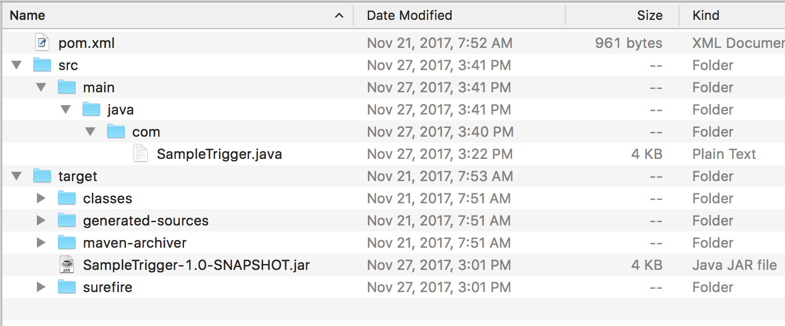

| **[Monthly Articles - 2022](../../README.md)** | **[Monthly Articles - 2021](../../2021/README.md)** | **[Monthly Articles - 2020](../../2020/README.md)** | **[Monthly Articles - 2019](../../2019/README.md)** | **[Monthly Articles - 2018](../../2018/README.md)** | **[Monthly Articles - 2017](../../2017/README.md)** | **[Data Downloads](../../downloads/README.md)** |
|-------------------------|-------------------------|-------------------------|-------------------------|-------------------------|-------------------------|-------------------------|

[Back to 2018 archive](../README.md)
[Download original PDF](../DDN_2018_13_AdvRep.pdf)
[Companion asset: DDN_2018_13_AdvRep.tar](../DDN_2018_13_AdvRep.tar)

## From The Archive

2018 January - -

>Customer: My company is investigating using the DataStax advanced replication feature to
>move data between data centers. Can you help ?
>
>Daniel:
>Excellent question ! In this document we overview DataStax Enterprise (DSE) data replication,
>advanced replication, and even recovery and diagnosis from failure of each of these sub-systems.
>Also, since advanced replication falls into an area of DataStax Enterprise titled, ‘advanced
>functionality’, we overview this topic as well.
>
>Just to be excessively chatty, we also detail DataStax Enterprise triggers and create yet
>another user defined function (UDF). (UDFs were a topic we covered in last month’s edition of
>this document.)
>
>[Read article online](./README.md).
>
>[Resource kit](../DDN_2018_13_AdvRep.tar),
>all of the programs and data used in this edition in Tar format.
>


---

# DDN 2018 13 AdvRep

## Chapter 13. January 2018

DataStax Developer’s Notebook -- January 2018 V1.31

Welcome to the January 2018 edition of DataStax Developer’s Notebook (DDN). This month we answer the following question(s); My company is investigating using the DataStax advanced replication feature to move data between data centers. Can you help ? Excellent question ! In this document we overview DataStax Enterprise (DSE) data replication, advanced replication, and even recovery and diagnosis from failure of each of these sub-systems. Also, since advanced replication falls into an area of DataStax Enterprise titled, ‘advanced functionality’, we overview this topic as well. Just to be excessively chatty, we also detail DataStax Enterprise triggers and create yet another user defined function (UDF). (UDFs were a topic we covered in last month’s edition of this document.)

## Software versions

The primary DataStax software component used in this edition of DDN is DataStax Enterprise (DSE), currently release 5.1. All of the steps outlined below can be run on one laptop with 16 GB of RAM, or if you prefer, run these steps on Amazon Web Services (AWS), Microsoft Azure, or similar, to allow yourself a bit more resource.

For isolation and (simplicity), we develop and test all systems inside virtual machines using a hypervisor (Oracle Virtual Box, VMWare Fusion version 8.5, or similar). The guest operating system we use is CentOS version 7.0, 64 bit.

DataStax Developer’s Notebook -- January 2018 V1.31

## 13.1 Terms and core concepts

As stated above, ultimately the end goal is to understand DataStax Enterprise (DSE) advanced replication. This Url from the DSE 5.1 Administrator’s Guide,

```text
http://docs.datastax.com/en/dse/5.1/dse-admin/datastax_enterprise/us
ingDSEtoc.html
```

produces the image as displayed in Figure 13-1. A code review follows.


*Figure 13-1 Given page from the DSE on line documentation.*

Relative to Figure 13-1, the following is offered:

- The entirety of the DataStax Enterprise (DSE) server sits atop DSE Core. (DSE Core is sometimes abbreviated C*. DSE Core is not displayed in image Figure 13-1 above.) DSE Core is the portion of DSE that delivers time constant lookups, network partition fault tolerance, and more. There is no means to operate a DSE node without DSE Core being present and active.

DataStax Developer’s Notebook -- January 2018 V1.31

- DSE Analytics, DSE Search, and DSE Graph are all optional subsystems (optional functional areas) to DSE. A DSE node may optionally be started to run with zero, one, two, or all of these optional subsystems. The primary reason to not enable (not turn on) these three optional subsystems is to avoid performance impact to DSE Core. A large (parallel) DSE Analytics job will compete for CPU, RAM and disk with DSE Core, and possibly impact required DSE Core end user service level agreements.

> Note: This entire overview of DSE Core, Analytics, Search and Graph is detailed in the October/2017 edition of this same document.

You might choose the opinion that DSE Analytics, Search and Graph operate inside DSE, meaning; they are end user functional sub-systems. All of the other entries in Figure 13-1 are more administrative (outside of DSE) functional sub-systems.

> Note: How we isolate load between DSE Core and other optional subsystems is to operate one DSE cluster, with two or more datacenters. One datacenter is configured to support only DSE Core (mission critical, online transaction processing (OLTP) style work), and the second datacenter is configured to support analytics/other (online analytics processing (OLAP) style work).

DSE datacenters are a logical construct, used to isolate load.

DSE datacenters are also used to deliver data locality; E.g., put German data in Germany, French data in France, and some data everywhere, for example.

- DSE Core delivers data replication capability within one DSE cluster. DSE advanced replication delivers data replication capability between DSE clusters.

- And just to complete an overview of the remainder of this list: • DSE management services, include four or more (agents) running inside DSE Core to gather capacity and performance metrics, and take steps to correct entropy.

DataStax Developer’s Notebook -- January 2018 V1.31

> Note: Entropy, defined as a gradual decline into disorder, is a natural tendency that exists for multi-node data bearing systems. In effect, global database systems with normal network latencies and expected node failures are likely to become out of sync.

DataStax Enterprise dedicates a good percentage of program code and operations to repair these inconsistencies on an ongoing basis.

• DSE in-memory, is the ability for DSE to operate a number of datacenters without the need to persist data. You might configure a single DSE cluster with two datacenters; one in-memory and the other configured as default, persisting data to disk. A (datacenter) not persisting data to disk (using in-memory) has shorter operational code paths, and is expected to run just a bit faster than a (datacenter) persisting to disk. The second datacenter (the one persisting to disk), which is optional, can be used to re-seed the in-memory datacenter in the event of catastrophic failure. • DSE multi-instance, is the ability for DSE to operate multiple DSE nodes per a single (operating system node). You can operate multiple DSE nodes per (operating system node) without using DSE multi-instance, however; each DSE node assumes it is effectively the only software running on the box. DSE multi-instance aids in configuration and sharing of operating system resources when on a single node.

> Note: Another means to accomplish nearly this same goal is to use Linux containers, or virtual machines.

• DSE tiered storage, is the ability for DSE to manage data across higher and lower performing (and higher and lower cost) disk drives. A classic use case might be a hotel central reservations system: you care most about data arriving in the last 90 days, and keep all data online for seven years for legal or other requirements.

## 13.1.1 DSE data replication, intra-cluster (within one DSE cluster)

This section of this document details the data replication that comes with DataStax Enterprise (DSE) Core, and delivers data replication within one DSE

DataStax Developer’s Notebook -- January 2018 V1.31

cluster. For data replication between two or more DSE clusters, we use DSE advanced replication, detailed in another section below.

The DSE terms we need to know in order to master the topic of DSE data replication include:

- A DSE cluster is a logical term, meant to identify one or more DSE nodes. As a logical term, an identifier, a DSE cluster has a name.

- A DSE node is a physical term, most similar to an operating system node; generally, a one to one relationship. A DSE node exists as one Java virtual machine (JVM), and consumes memory, process (Java threads inside the JVM), disk, and network activity.

> Note: All nodes in a DSE cluster are equal, and each node can perform all of the functions of any other DSE node; there are no masters or replicas in a DSE cluster.

- A DSE datacenter is a logical term. By default, all nodes in a DSE cluster belong to one unnamed datacenter. User data is spread across all DSE nodes in the default or named datacenters automatically. You can, and should, have multiple DSE datacenters per DSE cluster; we’ll explain why below. As implied above, each datacenter has a name/identifier.

- A DSE keyspace is a logical term. A keyspace is wholly contained inside one DSE cluster; keyspaces can not span DSE clusters. A keyspace is created to contain one or more DSE datacenters, as well as other data storage related metadata. Multiple keyspaces may be created naming a given datacenter; we’ll explain why below.

DataStax Developer’s Notebook -- January 2018 V1.31

> Note: At this point the object hierarchy is- cluster --(1/default:M)--> datacenter --(1:M)--> node

With the above you have the minimal operating DSE cluster.

To store any user data (kind of the whole point of the thing), you need at least one keyspace- keyspace --(1:M)--> datacenter datacenter --(0:M)--> keyspace

(The zero:many (0:M) above: A datacenter may exist without any referencing keyspaces. Datacenters exist before keyspaces.)

- And DSE (end user) tables are created and wholly contained within one keyspace. Tables inherit the data storage properties from the keyspaces in which they are contained. This is the point of keyspaces; keyspaces define these storage properties once, and are then reused.

> Note: So, the very minimal path to insert, update or delete data from a DSE table is- – Create a DSE cluster. By definition, this cluster will have at least one node. By default, this one node will belong to the default/unnamed datacenter. – Create a keyspace. – Create a table. – (Insert, update, and delete data.)

Files and more, used to configure data replication So again, we are currently detailing DataStax Enterprise (DSE) data replication, that is; data replication within one DSE cluster. DSE advanced replication is data replication across two or more DSE clusters.

Above we detailed the minimal set of terms you must be familiar with to understand (configure and use) data replication. You may configure and use data replication entirely using graphical user interfaces (GUIs). For ease of use (?), we proceed in this section not using GUIs, and instead go directly to the ASCII text configuration files which the GUIs would affect.

DataStax Developer’s Notebook -- January 2018 V1.31

Given a binary distribution of DataStax Enterprise installed in the

```text
/opt/dse/node1
```

directory, the two files we are discussing would be located in,

```text
/opt/dse/node1/resources/cassandra/conf/
```

```text
cassandra.yaml
```

The first file to discuss is titled, . Comments related to

```text
cassandra.yaml
```

:

- This file is 1280 lines long. After you remove comments and blank lines, there are 130 lines of concern. YAML format (key : value, and whitespace sensitive), this file contains identifiers, capacities, and tunables related to DataStax Enterprise (DSE) Core. 130 parameters; experts will state you really only need to master 20 or so to be highly effective using DSE.

> Note: Many of the parameters involve settings for subsystems that many people never use, or tunables with sane defaults minus edge cases.

If you change a value in this file, expect you will have to bounce (restart) the node in order for changes to take effect. In most cases, a graphical user interface (GUI) or command line utility can change the same setting in full multi-user mode (without having to restart the node).

> Note: In the remainder of this section, we detail configuring DSE with one cluster, having two operating system (OS) nodes total, two DSE nodes total, two datacenters total. (One DSE node per OS node. One DSE/OS node per DSE datacenter. Two DSE datacenters in one DSE cluster)

(The above is not optimal from a high availability stand point, but it fits on our 16GB RAM laptop.)

> Note: As we have laid it out, the cassandra.yaml file will be unique for each node in the DSE cluster. This is especially true when running multiple DSE clusters on one operating system node (our laptop).

The second file we edit, cassandra-topology.yaml, can be the same across all nodes in the DSE cluster.

```text
– cluster_name: 'my_cluster'
```

DataStax Developer’s Notebook -- January 2018 V1.31

Every node in a DSE cluster must share the same value above, the name of the DSE cluster. Purely superstition, we always change from the default value of ‘Test Cluster’, lest any stray nodes (nodes in error) try to join our cluster.

- (Data directories.) There are four or more fully qualified directory path names, where DSE will place the persistent data files that DSE maintains. • The location of data files proper,

```text
data_file_directories:
- /opt/dse/node1/data/data
```

This entry is different than those that follow in that DSE allows you may enter one or more (end user) data directory path names, so that you may spread load across multiple hard disk drives and hard disk controllers. The remaining data structures are largely accessed serially, thus; one directory pathname per setting.

> Note: The directory path names we are entering here are somewhat superfluous to a discussion of data replication.

We detail these settings because if they are not correct, or you try to run two DSE nodes on one operating system (OS) node with some duplicate settings, you will encounter errors.

• Hints-

```text
hints_directory: /opt/dse/node1/data/hints
```

Hints are a whole other topic to data replication. In short, say you have a three node cluster and data is supposed to be written to node-2, and node-2 is down. DSE will write this data to another (functioning) node as a ‘hint’, and when node-2 becomes functional, DSE will complete the write. This is the default behavior, which you can modify including turning this capability off. This setting is the data directory where these writes are stored until completion. • Commit log-

```text
commitlog_directory: /opt/dse/node1/data/commitlog
```

Is the expected transaction log file, common to most database servers.

DataStax Developer’s Notebook -- January 2018 V1.31

• Caches-

```text
saved_caches_directory: /opt/dse/node1/data/saved_caches
```

Is the cached data directory. DSE will forward cache between nodes, and use cache for, among other things, improving the restart time of failed nodes.

- (Nodes finding one another.) DataStax Enterprise (DSE) nodes operate on separate operating system (OS) nodes in a potentially large corporate network. In order that nodes may initially find one another, a number of settings prevail-

```text
seed_provider:
- class_name:
org.apache.cassandra.locator.SimpleSeedProvider
parameters:
- seeds: "172.16.119.132"
cassandra.yaml
```

In the example above, the node holding this copy of the file is configured to ping IP address 172.16.119.132 to find this and other nodes in this same DSE cluster. The 172.16.119.132 node would be configured to ping another address, perhaps 172.16.119.131.

> Note: In other words, under most circumstances nodes should not be configured to seed from their own IP address.

```text
– listen_address: 172.16.119.131
```

The listen address is that IP address to which client sessions would connect and operate.

> Note: There is/was a legacy set of settings for this capability generally titled RPC (using the Thrift protocol). That functionality is being deprecated.

```text
– endpoint_snitch: org.apache.cassandra.locator.PropertyFileSnitch
```

The default value here is:

```text
endpoint_snitch: com.datastax.bdp.snitch.DseSimpleSnitch
```

The on line documentation page related to snitches is located here,

```text
https://docs.datastax.com/en/cassandra/2.1/cassandra/architect
ure/architectureSnitchesAbout_c.html
```

• The expert recommendation here is:

DataStax Developer’s Notebook -- January 2018 V1.31

For any production system, always use PropertyFileSnitch (PFS). PFS allows you to identify nodes with datacenters, thus implying nodes are in different cities. Using this information, DSE can place copies of data in different cities to prevent a single point of failure; E.g., what if an entire city goes away- • DSE SimpleSnitch (SS) does not have the ability to further identify nodes as being in different cities, etcetera. In effect DSE will use a less intelligent placement of any second and subsequent copies of data.

DataStax Developer’s Notebook -- January 2018 V1.31

> Note: Which end point snitch setting to use-

When would you ever use DSE SimpleSnitch (SS) ?

Never in production, and rarely if ever in test. In test, SS gives you one less parameter file to have to edit (with 1-3 settings total), producing a one time 2-4 minute time savings on your part.

What about all of the other endpoint snitch options, including those that generate node (geographic) awareness when on cloud platforms like Amazon Web Services (AWS), Google Compute Engine (GCE), etcetera ?

The expert recommendation is to not use these, and to continue to use PropertyFileSnitch (PFS). Why ? All nodes in a DSE cluster must use the same end point snitch, and changing the snitch setting is painful.

- Changing the snitch setting may mean that all of the data on the affected nodes have to move to other nodes. Doable, but painful from a resource consumption stand point.

- Why does the end point snitch setting have to match across nodes ? The end point snitch (in conjunction with the cassandra.yaml file partitioner setting) determines data placement; E.g., which node stores this given primary key value ? It would be possible from a product stand point to allow nodes to have different snitch values, but it would create an unnecessarily (?) complex environment. If you use a (cloud provider specific) snitch setting (placing your data off premise, in the cloud), and then wish to add nodes that are on premise (not in the cloud, but on your gear), you will have a problem. You will have an incorrect end point snitch setting, a setting that will fail for on premise nodes. A shorter version to the above is: PFS is immediately hybrid cloud ready; what more do you need ? For more detail see,

```text
https://docs.datastax.com/en/cassandra/2.1/cassandra/operations
/ops_switch_snitch.html
```

> Note: At this point we are done editing cassandra.yaml, and are ready to move to the second and final requisite file titled, cassandra-topology.properties.

DataStax Developer’s Notebook -- January 2018 V1.31

```text
cassandra-topology.properties
```

The second file to discuss is titled, . This is a tiny file compared to cassandra.yaml. Example 13-1 displays the entirety of the sample file we use in this example. A code review follows.

### Example 13-1 Sample cassandra-topology.properties file.

```text
# Licensed to the Apache Software Foundation (ASF) under one
# or more contributor license agreements. See the NOTICE file
# distributed with this work for additional information
# regarding copyright ownership. The ASF licenses this file
# to you under the Apache License, Version 2.0 (the
# "License"); you may not use this file except in compliance
# with the License. You may obtain a copy of the License at
#
# http://www.apache.org/licenses/LICENSE-2.0
#
# Unless required by applicable law or agreed to in writing, software
# distributed under the License is distributed on an "AS IS" BASIS,
# WITHOUT WARRANTIES OR CONDITIONS OF ANY KIND, either express or implied.
# See the License for the specific language governing permissions and
# limitations under the License.
```

```text
# Cassandra Node IP=Data Center:Rack
172.16.119.131=DC1:RAC1
172.16.119.132=DC2:RAC1
```

```text
# default for unknown nodes
default=DCn:RACn
```

```text
# Native IPv6 is supported, however you must escape the colon in the IPv6
Address
# Also be sure to comment out JVM_OPTS="$JVM_OPTS
-Djava.net.preferIPv4Stack=true"
# in cassandra-env.sh
fe80\:0\:0\:0\:202\:b3ff\:fe1e\:8329=DCm:RACm
```

Relative to Example 13-1, the following is offered:

- We are continuing with the example of creating a single DSE cluster with two nodes, each node in its own DSE datacenter.

- We really only need to edit the two lines with the IP addresses. These entries inform DSE that the node with IP address 172.16.119.131 is in DC1, and the node with IP address 172.16.119.132 is in DC2.

DataStax Developer’s Notebook -- January 2018 V1.31

> Note: Beneath the DSE datacenter designation is another, further level of detail setting titled, rack ; a setting we have previously ignored in this document.

Where a DSE datacenter is used to inform DSE that a given node is in another city, a rack is used to inform DSE that a given node is on a specific hardware frame (rack).

Why ? Well first to define a rack- A rack is that physical, refrigerator size metal frame in the computer room the delivers power and more to a given operating system node. While much redundancy exists in a rack (dual power supplies, other), a rack is still a logical grouping of nodes, and considered a grouping of nodes that may fail in their entirety. Unlikely, but possible. The improved and final hierarchy becomes: cluster --(1/default:M)--> datacenter --(1:M)--> rack --(1:M)--> node

Given three DSE nodes in one datacenter, two nodes on one rack and one node on a second rack, DSE will work to ensure that data spans racks, eliminating a potential additional single point of failure.

- In Example 13-1 we have two nodes, one per datacenter. Thus, there is no need to further identify each/any node as being on different racks.

At this point, we are ready to boot DSE- In this continuing example, we have edited cassandra.yaml and cassandra-topology.properties in order to support the operation of a two node DSE cluster, each node being identified as existing in a separate DSE datacenter.

Why ? Having at least two datacenters allow us to demonstrate creating DSE keyspaces that span datacenters.

To boot the two separate DSE nodes, we would run a command line statement similar to,

```text
dse cassandra -f -R
```

on each node. The “-f” argument calls to run DataStax Enterprise (DSE) in the foreground, and the “-R” argument allows us to run the above command as the root user.

DataStax Developer’s Notebook -- January 2018 V1.31

If everything worked according to plan, the following command would verify we are up and running with two datacenters. Example as displayed in Figure 13-2. A code review follows.


*Figure 13-2 Output from “*

” command line utility.

```text
dsetool status
```

Relative to Figure 13-2, the following is offered:

```text
dsetool status
```

- We ran the “ ” command from either of the two DSE nodes.

```text
dsetool status
```

As displayed, we ran this command from node-1. The “ ” command is non-destructive, read only, and makes no change to the DSE cluster.

- From the display, we see we have two datacenters, DC1 and DC2, and both are up and running.

Making a keyspace, table, and adding data If you wish to take this example to the fullest extent (creating a keyspace, creating a table, adding data, and then failing (killing) nodes and determining the impact of same ), this sequence is covered in detail in the October/2017 edition of this document. E.g., proving that data replication inside one DSE cluster actually works.

DataStax Developer’s Notebook -- January 2018 V1.31

For now, we will detail how to create each of two replication strategies for keyspaces, and creating a table in each. (Tables are always wholly contained within a single keyspace.) Example 13-2 displays a NetworkTopologyStrategy keyspace replication strategy, with a code review that follows.

### Example 13-2 Example NetworkTopologyStrategy keyspace.

```text
create keyspace ks_13d WITH replication =
{'class': 'NetworkTopologyStrategy',
'DC1' : 1, 'DC2' : 1 } AND durable_writes = 'true';
```

```text
use ks_13d;
```

```text
create table t1
(
col1 int,
col2 int,
col3 int,
primary key ((col1), col2)
);
```

```text
insert into t1 (col1, col2, col3) values (1,1,1);
insert into t1 (col1, col2, col3) values (2,2,2);
insert into t1 (col1, col2, col3) values (3,3,3);
insert into t1 (col1, col2, col3) values (4,4,4);
```

```text
select * from t1;
```

Relative to Example 13-2, the following is offered:

- From our work in configuring/booting DSE, we have a single DSE cluster with two nodes, each node identified as being in its own datacenter.

```text
cqlsh
```

- We run the commands in Example 13-2 inside , an interactive DSE CQL (SQL) command shell.

- The first command creates a keyspace titled, ks_13d. In and of itself, this command serves one purpose; to allow us to create member table which will inherit the storage and replication settings from this keyspace. We specify that this keyspace is to span two datacenters titled; DC1 and DC2. If there were not two datacenters with these names, this command would fail.

DataStax Developer’s Notebook -- January 2018 V1.31

> Note: Each datacenter has only one node, thus; the numeric argument “1” that follows was our only choice. This argument of “1” is called the replication factor , (a count of replicas for a given datacenter).

```text
“ ‘dc2’ : 3 “
```

If, for example, DC2 had 10 nodes, we could then specify , calling for us to have three copies of data of any row placed, in any table in keyspace ‘ks_13d’, as it pertains to the DC2 datacenter.

DC1 could/would have its own replication factor.

Why and why ?

- In this case, we have two datacenters to prevent a single point of failure. The datacenters in this case are presumably representing cities (distinct geographic locations); place data in downtown Manhattan (DC1), and should Manhattan flood and become underwater, have a second copy in Milwaukee (DC2). A NetworkTopologyStrategy keyspace replication strategy informs DSE to make use of (presumably) multiple DSE datacenters, replicating data across each, to prevent a single point of failure.

- And then within Milwaukee itself, have multiple copies of the data. This in the event that one of the nodes in Milwaukee goes down. Fun fact: the word ‘Milwaukee’ comes from the Algonquian Indian word Milli oke, meaning ‘many rivers’. Thus, Milwaukee would never flood. Perhaps a grand family vacation there ? These copies of data within one datacenter are configured by using the replication factor, a numeric argument per DSE datacenter.

From this example we have two copies of all data placed in any table in this keyspace: one copy in DC1, and one copy in DC2.

- The remainder of Example 13-2 just makes a table, data, and queries same.

> Note: Could we create the keyspace above listing a single or subset of the available DSE datacenters ?

Yes. And this would deliver data locality using DSE keyspaces.

If you create a DSE keyspace just listing DC2/Milwaukee, then data will be located only in DC2. The use case here is data privacy, data locality.

DataStax Developer’s Notebook -- January 2018 V1.31

Example 13-3 displays our second example. A code review follows.

### Example 13-3 Example SimpleStrategy keyspace.

```text
create keyspace ks_13e with replication = {
'class' : 'SimpleStrategy',
'replication_factor' : 2};
```

```text
use ks_13e;
```

```text
create table t1
(
col1 text,
col2 text,
col3 text,
primary key (col1)
);
```

```text
insert into t1 (col1, col2, col3) values ('a', 'a', 'a');
insert into t1 (col1, col2, col3) values ('b', 'b', 'b');
select * from t1;
```

Relative to Example 13-3, the following is offered:

- In this example, a SimpleStrategy effectively ignores the fact that DSE nodes have been organized into two distinct DSE datacenters. Data as it is created and then accessed, will be spread across all available nodes. Since we have already informed DSE that we have two datacenters, there really is not a use case for using SimpleStrategy.

> Note: Using SimpleStrategy would be your only logical keyspace replication strategy when operating in a DSE cluster with a DSE SimpleSnitch end point snitch setting.

- Having two DSE nodes and a replication factor of two means that data will exist in their entirety on both DC1 and DC2, that is; given 100 rows in a table in this keyspace, all 100 rows will exist on DC1 and also on DC2. As such, each datacenter can satisfy all reads and writes individually. Contrast this to the following conditions and results: • Given one DSE cluster with 2 datacenters, DC1 with 2 nodes and DC2 with 3 nodes, 5 nodes total- • A SimpleStrategy keyspace with a replication factor of one would place one-fifth of the data on each node.

DataStax Developer’s Notebook -- January 2018 V1.31

• A SimpleStrategy keyspaces with a replication factor of two would place two-fifths of the data on each node. • In each of the two points above, there would be no coordination of what data goes where, in this case; no datacenter awareness.

## 13.1.2 DSE advanced replication, inter-cluster (between DSE

clusters)

To this point in this document we have detailed data replication within one DSE cluster. As a topic, DSE advanced replication refers to data replication between two or more DSE clusters.

If DSE data replication is so functional, what then are the use cases for DSE advanced replication ?

- Instead of operating one DSE cluster, you are tasked with running two or more DSE clusters for business reasons. E.g., two database administrator teams with separate corporate reporting hierarchies versus one. Yet, these two clusters share all or part of the same data set and need to pass data between themselves.

- You have two or more DSE clusters with irregular or intermittent connectivity. This is the more likely use case for DSE advanced replication. An example might be a large container ship at sea running DSE and accumulating Internet-of-things (IOT) style data; 1000s of sensors reporting every second on temperature and seismic sensitive cargo and such. Only when the ship passes a land mass, or every 12 or more hours via satellite is connectivity restored, and then data be pushed to another DSE cluster.

DataStax Developer’s Notebook -- January 2018 V1.31

> Note: While the on line documentation for DSE advanced replication (AR) states that AR is bidirectional (it is), this doesn’t mean you can operate two tables in two DSE clusters and read/write bidirectionally between the ( same two tables ). More simply: AR should not be used to create the same simultaneous writable data set in two DSE locations (in two DSE clusters). AR will not function in this manner.

AR is designed to push data from point-A to point-B. E.g., from edge sensors to a central reporting/monitoring cluster, or from a central configuration/control cluster to edge systems.

AR is not designed to push data from point-A to point-B, and back again to point-A, (allowing for a single synchronized copy of data between clusters). DSE data replication can do this inside one DSE cluster, but not DSE advanced replication.

Why ?

DSE data replication operates in one DSE cluster with one clock and any associated time stamping as deep as the column level. Here DSE can and will work to consolidate writes that might have happened simultaneously to the same piece of data but on other sides of the globe.

DSE advanced replication (AR) from point-A to point-B is effectively an advanced Java client program from point-A writing into point-B, as this is effectively the level of integration between two DSE clusters. (Currently two DSE clusters are unrelated, not capable of sharing the data and metadata necessary to support bidirectional data replication on the same data set .)

Back to files, configuring advanced replication When configuring DSE data replication (one DSE cluster with two datacenters, one DSE node each per datacenter), we edited two DSE Core configuration files:

```text
cassandra.yaml
cassandra-topology.properties
```

and .

Given a binary distribution of DataStax Enterprise installed in the

```text
/opt/dse/node1
```

directory, the two files we are edited were located under,

```text
/opt/dse/node1/resources/cassandra/conf/
```

All DataStax Enterprise (DSE) configuration files are located under,

DataStax Developer’s Notebook -- January 2018 V1.31

```text
{DSE installation directory}/resources/{subsystem name}/conf
```

Because DSE Core (aka Cassandra) is that subsystem that delivers data replication, we were previously under,

```text
./cassandra/conf
```

Portions of DSE advanced replication also use DSE Core, and so we will continue to edit cassandra.yaml. A portion of DSE advanced replication is configured outside of DSE Core, and so we will also want to edit,

```text
/opt/dse/node1/resources/dse/conf/dse.conf
```

Creating two DSE clusters with one node each In order that we may fit this entire setup on one 16GB RAM laptop, we want to create two DSE clusters with one node each; bad because each DSE cluster has a single point of failure, good because it fits on our laptop.

Comments:

- From the edits we previously detailed to cassandra.yaml in “DSE data replication, intra-cluster (within one DSE cluster)” on page 6 above, we need to make some changes. • Instead of configuring to run a two node DSE cluster, we now wish to run two (count) one node clusters. That means our seeds list will change, as there is no second node to discover for either cluster. For each of two nodes and their respective cassandra.yaml, change the seeds entry to equal the IP address of the given box. I.e., on a box with IP address of 172.16.119.131, change seeds to equal this same value. Example as shown,

```text
- seeds: "172.16.119.131"
```

On a second box with IP address 172.16.119.132, change seeds value to equal,

```text
- seeds: "172.16.119.132"
```

DataStax Developer’s Notebook -- January 2018 V1.31

> Note: Every DSE node already maintains a transaction log file (transaction journal) for the purpose of fault tolerance, atomicity guarantees. E.g., if a (transaction) were in process as the node failed, recover from this (partial result) when the node then comes back up.

There are a number of settings to tune the behavior of the transaction log file not related to our discussion of advanced replication; how often to flush the transaction log buffer and under what circumstances, sizings (tunables), other.

To be explicit we must state: the transaction log file has a current and important function, that is to recover from (brief) failures.

If we are going to provide advanced replication between DSE clusters, the natural source of these changes is the transaction log file. But, advanced replication might need to push changes between systems that are hours or days old.

The short version is: DSE is capable and needs to be configured to copy the transaction log file to another destination (one supporting advanced replication) before these transaction changes are lost. These configuration modifications are made within DSE Core, within cassandra.yaml, and are generally titled CDC (change data capture). At this time there really isn’t a use, a consumer, of this CDC (data) other than advanced replication, which is itself configured outside of DSE Core in the dse.yaml file.

• Still in cassandra.yaml and on every source system (nodes from which advanced replication changes will be coming), change the following-

```text
cdc_enabled: true
cdc_raw_directory: /opt/dse/node1/data/cdc_raw
commitlog_compression:
- class_name: LZ4Compressor
```

```text
cdc_enabled
```

turns on the copying of the transaction log file to an area where advanced replication can process it.

```text
cdc_raw_directory
```

is that single directory where this data is kept. And not entirely required, we set a specific compression capability for this data, as it may become large.

DataStax Developer’s Notebook -- January 2018 V1.31

> Note: With these and earlier changes made to cassandra.yaml, DataStax Enterprise (DSE) is configured to support change data capture, which is a prerequisite to support advanced replication.

We were running one DSE cluster with two nodes. In order to transition to running two DSE clusters with one node each, is would be fastest to: Shut down the two DSE nodes, and later/below reboot each. Because each DSE node contains metadata stating they are part of one (count) two node cluster, it would be fastest to delete any files and

```text
./data
```

directories under between shutdown and restart/reboot. You could drop the second node, then re-initialize it as a stand alone node, yadda, but we are stating that that work is beyond the scope of this document, which is just to demonstrate advanced replication.

- And on at least the source node we need to make changes to,

```text
./resources/dse/conf/dse.conf
```

Specifically we need to change,

```text
advanced_replication_options:
enabled: true
advanced_replication_directory:
/opt/dse/node1/data/advrep
```

Enabled or not enabled should be obvious. The additional directory pathname may not be obvious; didn’t we already copy this change data capture information off to the side ? Yes, but there may be many, many consumers of this data (many advanced replication streams out to given destinations), and this data can be (pre-filtered). This (pre-processed prior to the destination data) lands here.

At this point, all of the configuration files are ready. Reboot the now two (count) single node stand alone DSE clusters, and prepare for further configuration.

Create a destination table on one of the clusters We need a place for the replicated data to land. On the second DSE cluster (172.16.119.132 in our continuing example), execute the CQL (SQL) as displayed in Example 13-4. A code review follows.

DataStax Developer’s Notebook -- January 2018 V1.31

### Example 13-4 Sample CQL code to create a destination table.

```text
cqlsh 172.16.119.132
```

```text
create keyspace ks_13 with replication = {
'class' : 'SimpleStrategy',
'replication_factor' : 1 };
```

```text
use ks_13;
```

```text
create table t1
(
col1 text,
col2 text,
col3 text,
col8 text,
primary key (col1, col8)
);
```

```text
insert into t1 (col1, col2, col3, col8) values ('a', 'a', 'a', '_');
insert into t1 (col1, col2, col3, col8) values ('b', 'b', 'b', '_');
```

```text
select * from t1;
```

Relative to Example 13-4, the following is offered:

- This work is done on the destination box (the destination DSE cluster). Minus the fact we are performing this work in order to receive DSE advanced replication changes, there is nothing special about this CQL source code. In other words; this DSE cluster has no idea where the data placed in this table will be coming from.

- We’re using a SimpleStrategy replication strategy keyspace with a replication factor of one. We could have used a (datacenter aware) replication strategy with many replicas per data center (a replication factor greater than one). That’s kind of the beauty of DSE data replication; the client (in this case DSE advanced replication) doesn’t need to know or care how data is written or replicated.

```text
ks_13, t1, col1, col2
```

- All of the identifiers are rather generic; , etcetera.

```text
col8
```

is going to be the column that reflects where this data is sourced from. In effect then, you could have several DSE advanced replication sources writing to the same destination and with the metadata we send (the contents of col8), we can decipher what came from where.

DataStax Developer’s Notebook -- January 2018 V1.31

Create a source table on the other cluster We need a place for the source data to originate from. On the other DSE cluster (172.16.119.131 in our continuing example), execute the CQL (SQL) as displayed in Example 13-5. A code review follows.

### Example 13-5 Sample CQL to create source table.

```text
cqlsh 172.16.119.131
```

```text
create keyspace ks_13 with replication = {
'class' : 'SimpleStrategy',
'replication_factor' : 1 };
```

```text
use ks_13;
```

```text
create table t1
(
col1 text,
col2 text,
col3 text,
primary key (col1)
);
```

```text
insert into t1 (col1, col2, col3) values ('a', 'a', 'a');
insert into t1 (col1, col2, col3) values ('b', 'b', 'b');
```

```text
select * from t1;
```

Relative to Example 13-5, the following is offered:

- The only difference between Example 13-5 and Example 13-4 is the presence of the column titled, col8; the column to store metadata on the destination regarding the source of the (advanced) replicated data. The destination has this column and the source does not.

- Notice from this example that two DSE clusters can have the same cluster name, same keyspace and table names, etcetera. Why wouldn’t they ? They are two unrelated clusters.

Now configure advanced replication proper Every step unto this point has been to prepare a general run time that would allow us to configure and use DSE advanced replication; creating two DSE clusters, creating source and destination tables, etcetera.

DataStax Developer’s Notebook -- January 2018 V1.31

Ad we did with DSE data replication, let us now define the terms (and commands) necessary to understand and use DSE advanced replication:

- We need to understand all of the terms from DSE data replication above, if only to understand general DSE topology and related.

- We configure, test and operate DSE advanced replication using the

```text
dse advrep
dse
```

“ ” command line utility. “ ” is the same command we use to boot DSE from the command line. A number of parameters will follow.

- We should probably already understand the terms source and destination, if only in the general sense.

- There is an officially recognized and created object in DSE titled, destination. A destination contains the metadata to locate and connect with a given remote DSE cluster.

- The following example is one we use to define a destination from

172.16.119.131 to 172.16.119.132. Example as shown in Example 13-6, with a code review to follow.

### Example 13-6 Creating a DSE advanced replication destination.

```text
dse advrep --host 172.16.119.131 --verbose destination create --name my_dest2
--addresses 172.16.119.132 --transmission-enabled true
--driver-consistency-level QUORUM
```

```text
dse advrep --host 172.16.119.131 --verbose destination delete --name my_dest2
```

```text
dse advrep --host 172.16.119.131 destination list-conf
```

Relative to Example 13-6, the following is offered: • That first part (3 lines) separated by white space is all one line of source code, executed at the command line prompt.

```text
dse advrep
```

• The first IP address, 172.16.119.131 is the box to run this “ ” command on.

```text
destination create
```

• “ ” should be obvious; we are creating a DSE advanced replication “destination”.

```text
--name
```

• states we are giving this destination an identifier titled,

```text
my_dest2
```

.

```text
--addresses
```

• specifies the destination host IP address.

```text
--transmission-enabled
```

• means that this destination is currently tethered (connected). The opposite of tethered is, isolated (not connected).

DataStax Developer’s Notebook -- January 2018 V1.31

This value can be toggled on command.

```text
--driver-consistency-level
```

• is that same write consistency level used by all (end user) clients to any DSE cluster.

```text
QUOROM
```

Here we ask for , which means that over half the nodes have to acknowledge receipt of the destination box's change data capture event.

```text
destination delete
```

• The second command, the one with the “ ”, would delete the destination. This second command would undo the first command.

```text
list-conf
```

• And the command lists all destinations emanating from the given DSE cluster. This command is read only, non-destructive,

- At this point we can talk with the destination DSE cluster. Now it’s time to actually start replicating data. Example 13-7 offers sample syntax. A code review follows.

### Example 13-7 Creating a DSE advanced replication channel.

```text
dse advrep --host 172.16.119.131 channel create --source-keyspace ks_13
--source-table t1 --source-id my_source1 --source-id-column col8 --destination
my_dest2 --destination-keyspace ks_13 --destination-table t1
--collection-enabled true --transmission-enabled true --priority 4
```

```text
dse advrep --host 172.16.119.131 channel delete --source-keyspace ks_13
--source-table t1 --destination my_dest2
```

```text
dse advrep --host 172.16.119.131 channel status
```

Relative to Example 13-7, the following is offered: • The first command, separated by white space, displays as four lines due to its length. This command creates a DSE advanced replication channel. • First we specify which host to run this command on, 172.16.119.131. • Then we specify the source keyspace and table names; these two values together (keyspace name and table name) uniquely identify any single table in DSE. • The source system is going to populate a new column on the destination side, to indicate where a given new data record on the destination originated from.

DataStax Developer’s Notebook -- January 2018 V1.31

Why ? Because you might choose to have (n) sources feeding one destination, and you need a means to distinguish all of the newly arriving rows. You could even choose to make this value part of the destination table’s primary key, in order to ensure uniqueness.

```text
--source-id-column
```

is the column name we chose to populate on the destination with this metadata value. We chose to use the column named, col8. This column must exist on the destination side. • And we specify the destination, and destination keyspace and table names.

> Note: There are features to DSE advanced replication that we are not going to detail in this document, most related to throttling, that is; controlling the rate at which data flows from source to destination.

Not surprisingly, this is all well documented at the following Url,

```text
https://docs.datastax.com/en/dse/5.1/dse-admin/datastax_enterpris
e/advReplication/advRepTOC.html
```

• The second command would delete this channel. • And the last command reports, read only, on this channel.

At this point you are replicating data from source to target. Insert data into the source and watch it magically arrive on the target as well. Notice you can delete and update data too.

A few more commands related to DSE advanced replication are listed in Example 13-8. A code review follows.

### Example 13-8 More DSE advanced replication commands.

```text
# wont transmit
dse advrep --host 172.16.119.131 channel pause --source-keyspace ks_13
--source-table t1 --transmission
```

```text
# wont even record need to transmit
dse advrep --host 172.16.119.131 channel pause --source-keyspace ks_13
--source-table t1 --collection
```

```text
dse advrep --host 172.16.119.131 replog count --destination my_dest
--source-keyspace ks_13 --source-table t1
```

DataStax Developer’s Notebook -- January 2018 V1.31

```text
# resume sending
dse advrep --host 172.16.119.131 channel resume --source-keyspace ks_13
--source-table t1 --transmission
```

```text
# Diagnostics
dse advrep --host 172.16.119.131 --port 7199 metrics list
```

Relative to Example 13-8, the following is offered:

- The first command in Example 13-8 calls to pause transmission of changes from source to destination.

- The second command goes further, and will not even record changes to transmit.

- The third command reports on the measure of queued transmissions waiting to occur.

- The fourth command calls to resume sending of changes from source to destination.

- And the last command reports deeper diagnostics.

## 13.1.3 Tracing and diagnostics

While we left off a lot of detail from the discussion of DSE data replication and DSE advanced replication above (security and throttling to name just two large topics), this section offers some amount of detail related to at least tracing and diagnostics.

At the CQLSH (CQL command shell) prompt Inside the CQLSH command shell, you can execute the following CQL commands,

```text
tracing on
tracing off
```

The above will not aid debugging DSE advanced replication so much, since the client activity disengages once any source system write is acknowledged by the single or set of DSE nodes as requested via the write concern level (E.g., QUOROM, more or less). CQLSH tracing will aid DSE data replication though, reporting all of the requested nodes and results for reading and writing.

Tracing is documented at the following Url,

DataStax Developer’s Notebook -- January 2018 V1.31

```text
https://docs.datastax.com/en/cql/3.3/cql/cql_reference/cqlshTracing.
html
```

Diagnostic data that tracing generates outputs to standard out, and to a number of system tables, namely,

```text
system_traces.events
system_traces.sessions
```

As (regular) system tables, do not forget you can query these tables, and may choose to occasionally truncate and clear snapshot same. E.g.,

```text
nodetool clearsnapshot system_traces.events
nodetool clearsnapshot system_traces.sessions
```

You can also manage trace levels server wide while using the nodetool command.

```text
nodetool settraceprobability 1 # trace all, VERY costly
nodetool settraceprobability 0 # trace none, off
nodetool settraceprobability 0.001 # trace little, a better number
nodetool gettraceprobability # report current/effective setting
```

> Note: When setting traces server wide (versus in the foreground using cqlsh),

```text
system_traces
```

you would definitely need to access the keyspace tables.

DSE slow query log

```text
system_traces
```

While the entries in the keyspace tables contain CQL SELECTs, INSERTS and related, another, possibly more selective means exists to gather this same or better data, the DataStax Enterprise (DSE) slow query log.

The DSE slow query log is detailed at the following Url,

```text
https://docs.datastax.com/en/dse/5.1/dse-admin/datastax_enterprise/m
gmtServices/performance/collectingSlowQueries.html
```

```text
dsetool
```

Example 13-9 displays a number of commands to affect the slow query log. A code review follows.

### Example 13-9 Using the DSE slow query log

```text
dsetool perf cqlslowlog disable
```

```text
dsetool perf cqlslowlog skip_writing_to_db
dsetool perf cqlslowlog write_to_db
```

DataStax Developer’s Notebook -- January 2018 V1.31

```text
dsetool perf cqlslowlog set_num_slowest_queries 50
```

```text
dsetool perf cqlslowlog 1.0
dsetool perf cqlslowlog 95.0
#
dsetool perf cqlslowlog 0.0
```

```text
dsetool perf cqlslowlog recent_slowest_queries
```

```text
Executing on node: node1
```

```text
Showing N=5 most recent CQL queries slower than 0.0 ms
---------------------------------------------
[ {
"tables" : "[ks_13.t1]",
"sourceIp" : "/172.16.119.131",
"username" : "anonymous",
"startTimeUUID" : "febb3c20-d93f-11e7-bee9-2f189f569049",
"duration" : 2,
"cqlStrings" : "[select * from t1;]",
"tracingSessionId" : "febb1510-d93f-11e7-bee9-2f189f569049"
} ]
```

Relative to Example 13-9, the following is offered:

- The first command in Example 13-9 turns off the DSE slow query log.

- Slow query log records can be written to disk or maintained in memory. These next two commands toggle that behavior. When writing to memory, the number of records to keep in memory defaults to 5. To set the number higher or lower, use the fourth command which set the number of commands to store equal to 50.

- The next three commands determine the percentage of slow queries to sample and then store (as part of this 50). A value of zero stores all records. A value of 25 stores 75%.

```text
recent_slowest_queries
```

- The last command ( ) calls to output and empty the in memory structure containing accumulated records. We had run only one query, and output is received as shown.

DataStax Developer’s Notebook -- January 2018 V1.31

> Note: Should you choose to write this data to the database, then this same

```text
dse_perf
node_slow_log
```

data is available in the keyspace, in a table titled, .

As a DSE table, you can run queries against this table, and use the CQL COPY command to unload same.

> Note: All of the settings and more detailed above related to the DSE slow query log, may be set permanently in the dse.yaml file.

Getting the internal timestamp off rows and columns In the October/2017 edition of this document we detailed an exercise with the following conditions:

- A single DSE cluster with two datacenters, and a NetworkTopologyStrategy replication strategy keyspace spanning these two datacenters, was then further configured using Linux utilities to create a five second communication delay between these two DSE nodes.

- With the luxury of this five second delay, we then executed simultaneous updates on the two DSE nodes against the same piece of data (the same single data row on two different DSE nodes). On one DSE node we updated one column, and on the other DSE node we updated a different column.

- What we observed was that DSE created a single best version of these two changes, creating a single version of the record on both DSE nodes, with both of the updated columns. Very cool.

But how does DSE deliver this functionality ?

The short version answer is:

- Every DSE node in a DSE cluster is configured to share a common timestamp.

- As each row and column is updated, a timestamp accompanies each value in each row and each column. DSE uses these timestamps to preserve the best/most-accurate version of any data record that may have been updated in multiple locations simultaneously.

But how can you view this timestamp ? (We might use this timestamp to debug DSE advanced replication; see when or if rows are being updated.)

DataStax Developer’s Notebook -- January 2018 V1.31

We can use a user defined function. Comments include:

- The December/2017 edition of this document we detailed how to create and use user defined functions using DSE.

- In effect you must change to the entry in cassandra.yaml as shown below,

```text
enable_user_defined_functions: true
```

- Then create the user defined function as listed in Example 13-10. A code review follows.

### Example 13-10 DSE UDF to view row and column timestamps.

```text
CREATE OR REPLACE FUNCTION my_time( i_time bigint )
RETURNS NULL ON NULL INPUT
RETURNS text
LANGUAGE java AS $$
```

```text
String r_date = new java.text.SimpleDateFormat("MM/dd/yyyy
HH:mm:ss").format(new java.util.Date (i_time / 1000));
```

```text
return r_date;
```

```text
$$ ;
```

```text
SELECT my_time(writetime(col2)), col2FROM t1;
```

```text
ks_13.my_time(writetime(col2)) | col2
--------------------------------+------
12/04/2017 09:30:12 | a
12/04/2017 13:30:46 | d
```

```text
(2 rows)
```

Relative to Example 13-10, the following is offered:

- After the CQL CREATE FUNCTION statement, written in Java, we see the CQL SELECT to invoke same.

- The DSE timestamp on col2 is returned as a user readable wall clock time. Again, useful for debugging.

## 13.1.4 DSE Triggers

In the relational database era, database servers had triggers before they had data replication or advanced data replication. Triggers offer the ability to run

DataStax Developer’s Notebook -- January 2018 V1.31

server side program code in the event of database server insert, update or delete. Use cases for triggers included:

- Creating an audit log for a table.

- Creating data replication on a table.

- Other.

> Note: From the work performed thus far in this document, here is the current state of our DSE data replication and DSE advanced replication knowledge: – DSE data replication offers bidirectional data replication on the same table, the same data set. DSE advanced replication can be bidirectional, but not on the same data set. – Both will delete data on the destination system when data is deleted from the source. – The finest granularity for each is at the table level. There is currently no ability to say for example; 50 states in the United States, replicate all data in one table except Texas.

Triggers can be costly and thus, should not be used without extreme care and consideration. Further:

- The on line documentation page for triggers is located here,

```text
https://docs.datastax.com/en/cql/3.3/cql/cql_reference/cqlCrea
teTrigger.html
```

The original announcement for triggers is here,

```text
https://www.datastax.com/dev/blog/whats-new-in-cassandra-2-0-p
rototype-triggers-support
```

And the most complete example of a trigger is available on GitHub here,

```text
https://github.com/apache/cassandra/tree/trunk/examples/trigge
rs
```

- When creating a DataStax Enterprise (DSE) user defined function, we could supply source code to DSE in Java, Scala, or Python, and the DSE server would handle it. (You could also supply a JAR.) For DSE triggers, you have to supply a JAR.

- In the November/2017 edition of this document on machine learning, we detailed how to compile a Scala program. In this edition of this document, we will detail how to compile Java; how to compile Java source code in order to supply a JAR to DSE.

DataStax Developer’s Notebook -- January 2018 V1.31

- The DSE trigger (Java) interface will not allow you to prevent the triggering event from occurring, that is; the source data record insert, update or delete will always occur. You can, however, program what you want to happen as the result of the source event. For example: • You don’t have to delete in the destination table. You could chose to append all inserts, updates, and deletes to a running log of events. (Kind of like business intelligence type of slowly changing dimension.) • You can programmatically do nothing; E.g., filter and do not replicate Texas from the 50 US states.

- You can’t (shouldn’t) go too crazy. The JAR you supply will run in the same address space (same JVM) as DSE Core. You do not need to (and wouldn’t want to for performance and other reasons) create a database server connection handle.

> Note: As such, you can replicate data locally, within one DSE cluster.

If you want DSE advanced replication type functionality (data replication between two or more DSE clusters), you would first trigger locally to capture the event, then have another unrelated agent (a client program you provide and operate) to process this log of events and do whatever with them; push them remotely if you so chose.

How to compile a Java program In the November/2017 edition of this document, we used Apache Gradle to build a Scala program, which then acted as a client to DataStax Enterprise (DSE). Apache Gradle is overviewed here,

```text
https://en.wikipedia.org/wiki/Gradle
```

In this edition of this document, we will use Apache Maven to build our JAR file containing a trigger, which we will supply to DSE. Apache Maven is detailed here,

```text
https://en.wikipedia.org/wiki/Apache_Maven
```

Apache Maven (Maven) expects a given source code directory structure as displayed in Figure 13-3. A code review follows.

DataStax Developer’s Notebook -- January 2018 V1.31



*Figure 13-3 Directory structure to support using the Maven build tool.*

Relative to Figure 13-3, the following is offered:

- If we used a graphical interactive development environment (IDE), all of this work would be done for us. On our Linux box, Apache Maven was already installed for us (the binary program name titled, mvn). We manually had to create the following directories:

```text
./src
./src/main/java/com
./target
```

- Our source module was packaged as “com”, and the source file was

```text
SampleTrigger.java
```

named, . When we successfully compile using Maven (there are no source code errors preventing compile), Maven will automatically output the JAR file

```text
./target
```

under .

```text
pom.xml
```

- We need to supply a Maven formatted , which is detailed next.

```text
pom.xml
```

Maven requires a file as displayed in Example 13-11. A code review follows.

### Example 13-11 Our sample

```text
pom.xml
```

file.

```text
<?xml version="1.0" encoding="UTF-8"?>
```

```text
<project xmlns="http://maven.apache.org/POM/4.0.0"
```

DataStax Developer’s Notebook -- January 2018 V1.31

```text
xmlns:xsi="http://www.w3.org/2001/XMLSchema-instance"
xsi:schemaLocation="http://maven.apache.org/POM/4.0.0
http://maven.apache.org/xsd/maven-4.0.0.xsd">
<modelVersion>4.0.0</modelVersion>
```

```text
<groupId>com</groupId>
<artifactId>SampleTrigger</artifactId>
<version>1.0-SNAPSHOT</version>
```

```text
<properties>
<project.build.sourceEncoding>UTF-8</project.build.sourceEncoding>
<maven.compiler.source>1.8</maven.compiler.source>
<maven.compiler.target>1.8</maven.compiler.target>
</properties>
```

```text
<dependencies>
<dependency>
<groupId>org.apache.cassandra</groupId>
<artifactId>cassandra-all</artifactId>
<version>3.11.0</version>
</dependency>
</dependencies>
```

```text
</project>
```

Relative to Example 13-11, the following is offered:

- The groupId, artifactId, and version all tell Maven how to output our JAR, including the naming convention of same. Maven inherently knows how to compile Java, and no further instruction is required on that topic.

- The dependencies section tells Maven where to locate any libraries we make reference to in our source code. As configured, this means we will need Internet connectivity to pull given library files from the central (on line) Maven repository. If your company does not allow Internet connectivity, that’s fine. You will then need to configure a local Maven repository.

- As you add non-standard libraries (non-standard to your Java runtime environment (JRE) ), you will need to add additional entries to this dependencies section; standard when operating Maven.

- With everything in place (the pom.xml, and the directory structure listed above), you would compile your source code via a, From the parent directory containing the pom.xml file, execute a-

DataStax Developer’s Notebook -- January 2018 V1.31

```text
mvn build
```

If you had no Java syntax errors, a new JAR file should be created. If you have Java syntax errors, Maven will output the line and column number with some sort of comment; go back and correct your mistake.

Java syntax for the DSE trigger we are creating Example 13-12 contains the Java source code for the DSE trigger we are creating. A code review follows.

### Example 13-12 The DSE Java trigger we are creating.

```text
package com;
```

```text
import org.apache.cassandra.config.Schema;
import org.apache.cassandra.config.CFMetaData;
import org.apache.cassandra.config.ColumnDefinition;
//
import org.apache.cassandra.db.Mutation;
import org.apache.cassandra.db.Clustering;
//
import org.apache.cassandra.db.partitions.Partition;
import org.apache.cassandra.db.partitions.PartitionUpdate;
//
import org.apache.cassandra.db.rows.UnfilteredRowIterator;
import org.apache.cassandra.db.rows.Unfiltered;
import org.apache.cassandra.db.rows.Cell;
//
import org.apache.cassandra.triggers.ITrigger;
//
import java.util.Collection;
import java.util.Collections;
import java.util.Iterator;
//
import java.lang.StringBuffer;
//
import org.apache.cassandra.utils.UUIDGen;
```

```text
public class SampleTrigger implements ITrigger {
```

```text
public Collection<Mutation> augment(Partition i_partition) {
```

```text
String l_dest_ks = "ks_13b" ;
String l_dest_tb = "my_audit";
```

DataStax Developer’s Notebook -- January 2018 V1.31

```text
//
String l_srce_ks = i_partition.metadata().ksName;
String l_srce_tb = i_partition.metadata().cfName;
//
String l_srce_pk = i_partition.metadata().getKeyValidator().
getString(i_partition.partitionKey().getKey());
```

```text
//
// Deletions will have an entry similar to,
//
// deletedAt=1511809909210445, localDeletion=1511809909
// deletedAt=1511809919795488, localDeletion=1511809919
// deletedAt=1511809962879741, localDeletion=1511809962
//
// Inserts/Updates will have an entry similar to,
//
// deletedAt=-9223372036854775808, localDeletion=2147483647
// deletedAt=-9223372036854775808, localDeletion=2147483647
// deletedAt=-9223372036854775808, localDeletion=2147483647
//
String l_srce_type = i_partition.partitionLevelDeletion().toString();
```

```text
//
// Needs work; robust enough for our simple example
//
UnfilteredRowIterator l_rows = i_partition.unfilteredIterator();
//
StringBuffer l_srce_data = new StringBuffer(1024);
//
// Loop through all rows
//
while (l_rows.hasNext()) {
Unfiltered l_row = l_rows.next();
Clustering l_rowClust = (Clustering) l_row.clustering();
Iterator<Cell> l_cells = i_partition.getRow(
l_rowClust).cells().iterator();
Iterator<ColumnDefinition> l_cols = i_partition.getRow(
l_rowClust).columns().iterator();
//
// Loop through all cols
//
while(l_cells.hasNext())
{
Cell l_cell = l_cells.next();
ColumnDefinition l_col = l_cols.next();
//
l_srce_data.append(l_col + ":");
l_srce_data.append(new String(l_cell.value().array()) + ",");
```

DataStax Developer’s Notebook -- January 2018 V1.31

```text
}
}
```

```text
//
// Setup our new/copy row
//
CFMetaData l_metadata = Schema.instance.getCFMetaData(
l_dest_ks, l_dest_tb);
```

```text
//
// Add a timestamp primary key
//
PartitionUpdate.SimpleBuilder l_audit = PartitionUpdate.
simpleBuilder(l_metadata, UUIDGen.getTimeUUID());
```

```text
//
// Add remaining columns
//
l_audit.row()
.add("source_ks" , l_srce_ks )
.add("source_tb" , l_srce_tb )
.add("source_pk" , l_srce_pk )
.add("source_data" , l_srce_data.toString())
.add("source_type" , l_srce_type );
```

```text
return Collections.singletonList(l_audit.buildAsMutation());
}
```

```text
}
```

Relative to Example 13-12, the following is offered:

- This example is almost a direct copy from the one posted on line and on GitHub at,

```text
https://github.com/apache/cassandra/tree/trunk/examples/trigge
rs
```

- 120 lines, most of it standard Java boiler plate; library includes and such. There is also a bit of bulk to dynamically processing the data record columns that arrived as an input value to this (method); we did not hard code the expected input column names.

DataStax Developer’s Notebook -- January 2018 V1.31

- After the imports, the primary method is titled, augment, which accepts a collection of one or more input rows, and their associated timestamps and metadata values.

```text
public Collection<Mutation> augment(Partition i_partition)
```

A partition is an object type for a data row, along with associated methods we use below. This (input) partition contains data and metadata. This metadata can be used to tell us where this record came from (which source keyspace and table), and if this row resulted from an update/insert or delete.

> Note: Recall from the October/2017 edition of this document- – By default, DataStax Enterprise (DSE) will convert an update to an insert, should the row to update be found not to exist. Similarly and by default, an insert on an existing row will be converted to an update. You can overcome this behavior; a topic we will not expand further upon here. – But deletes are pretty obvious.

- We hard code the ‘destination’, that is; where we will want to record these

```text
ks_13b
```

trigger events. We hard coded the keyspace and table names, and

```text
my_audit
```

.

- We dynamically discover the input keyspace and table names, and input primary key value using-

```text
String l_srce_ks = i_partition.metadata().ksName;
String l_srce_tb = i_partition.metadata().cfName;
```

```text
String l_srce_pk = i_partition.metadata().getKeyValidator().
getString(i_partition.partitionKey().getKey());
```

The program code above worked for our simple example; a table with a single column primary key. Consider developing this code further before you move to compound primary keys, and/or primary keys with clustering columns.

- There is no direct/obvious indicator (no flag, or “op code”) as to whether the input (partition) is the result of an insert/update or deletion. On this line,

```text
String l_srce_type = i_partition.partitionLevelDeletion().toString();
```

DataStax Developer’s Notebook -- January 2018 V1.31

look at the associated value to determine same. The comments in the Java code details that deletes have a positive timestamp, where insert/updates do not.

- And then a nested loop structure- The outer loop loops through what could be multiple (rows, partitions) sent to our trigger function. The inner loop loops through the columns for any given/single row.

> Note: If you need/want to advance the code here (handle greater width query use cases), this is standard code used to discover any query processing.

Any DSE fetch code example you can find on line or in the documentation will serve here.

```text
SimpleBuilder
```

Our purpose at this point in the code is to use/construct a object, which becomes the return value to DSE Core, and affects what is then done as the result of this trigger event. E.g., do we do a further insert or delete.

Preparing the run time At this point in this example we have:

- Created the ability to compile Java.

- Detailed the Java source code for a DSE trigger.

Before we can install (and operate) the trigger, we need source and target tables. Example 13-13 offers the CQL (SQL) syntax to make these tables. A code review follows.

### Example 13-13 Source and target tables to support our trigger.

```text
CREATE KEYSPACE ks_13a WITH REPLICATION =
{ 'class' : 'SimpleStrategy', 'replication_factor' : '1' };
```

```text
USE ks_13a;
```

```text
CREATE TABLE test
(
key text,
value1 text,
value2 text,
value3 text,
value4 text,
PRIMARY KEY(key)
);
```

DataStax Developer’s Notebook -- January 2018 V1.31

```text
CREATE KEYSPACE ks_13b WITH REPLICATION =
{ 'class' : 'SimpleStrategy', 'replication_factor' : '1' };
```

```text
USE ks_13b;
```

```text
CREATE TABLE my_audit
(
key timeuuid,
source_ks text,
source_tb text,
source_pk text,
source_data text,
source_type text,
PRIMARY KEY(key)
);
```

Relative to Example 13-13, the following is offered:

- We use two different keyspaces for source and target, largely just to prove that we can.

- On the destination side, we place a concatenation of the source data

```text
source_data
```

columns into a single column titled, .

Installing and testing the trigger To first install the trigger, we must copy the outputted compilation JAR file to a given location. Comments include:

- Given a DataStax Enterprise (DSE) binary file (product file) installation directory of,

```text
/opt/dse/node1
```

and when sitting in the parent directory where the Java trigger was compiled, execute the following,

```text
cp target/SampleTrigger-1.0-SNAPSHOT.jar
/opt/dse/node1/resources/cassandra/conf/triggers/SampleJava.ja
r
nodetool reloadtriggers
```

There are two commands listed above. The first copies the JAR file to a new directory where DSE trigger JAR files must be located.

DataStax Developer’s Notebook -- January 2018 V1.31

And the second command instructs DSE to check for and reload (new) trigger JAR files. If this command worked properly, you will see an entry in the DSE message log file similar to,

```text
INFO [RMI TCP Connection(2)-127.0.0.1] 2017-12-05 09:23:37,741
CustomClassLoader.java:89 - Loading new jar
/opt/dse/node1/resources/cassandra/conf/triggers/SampleJava.ja
r
```

- At the CQLSH (CQL command shell) prompt, enter the following code as displayed in Example 13-14. A code review follows.

### Example 13-14 Installing the DSE trigger.

```text
CREATE TRIGGER test1 ON ks_13a.test USING 'com.SampleTrigger';
```

```text
DROP TRIGGER test1 ON test;
```

```text
SELECT * FROM ks_13a.test;
SELECT * FROM ks_13b.my_audit;
```

```text
INSERT INTO ks_13a.test (key, value1, value2, value3, value4)
VALUES ('a', 'a1', 'a2', 'a3', 'a4');
INSERT INTO ks_13a.test (key, value1, value2, value3, value4)
VALUES ('b', 'b1', 'b2', 'b3', 'b4');
INSERT INTO ks_13a.test (key, value1, value2, value3, value4)
VALUES ('c', 'c1', 'c2', 'c3', 'c4');
INSERT INTO ks_13a.test (key, value1, value2, value3, value4)
VALUES ('d', 'd1', 'd2', 'd3', 'd4');
```

Relative to Example 13-14, the following is offered:

- The first command creates the DSE trigger. Notice we reference the fully

```text
com.SimpleTrigger
```

qualified Java class name, .

- The next command would drop the trigger.

- The two selects could be used for testing; ks_13a.test is the source table, and ks_13b.my_audit is the destination table.

- And then four inserts for testing. You should, all things having worked successfully, see four new data records in the destination table.

DataStax Developer’s Notebook -- January 2018 V1.31

## 13.2 Complete the following

At this point in this document we have completed a lengthy discussion of DataStax Enterprise (DSE) data replication, advanced data replication, and triggers. We also detailed an amount of diagnostic capabilities inside DSE.

Since the original problem statement was to detail advanced replication, the logical next step is to create a run time to deliver and test that. You would:

- Create at least two production sized DataStax Enterprise (DSE) clusters, with latent network connectivity.

- Create production sized data volumes on the source system, and a reproducible sized harness to drive new data volumes. Frequency, concurrency and spread; you should test volume and also the number of DSE source and destination tables and clusters.

- Drive load and see if DSE advanced replication meets your needs; use tunables and other in the on line documentation to address any issues.

## 13.3 In this document, we reviewed or created:

This month and in this document we detailed the following:

- How to create multiple DataStax Enterprise (DSE) clusters, and single (count) multi datacenter clusters.

- How to implement and test DSE data replication, advanced replication and triggers.

- Used an amount of DSE diagnostics and tracing utilities.

### Persons who help this month.

Jim “is my hero” Hatcher, and Kiyu Gabriel.

### Additional resources:

Free DataStax Enterprise training courses,

```text
https://academy.datastax.com/courses/
```

DataStax Developer’s Notebook -- January 2018 V1.31

Take any class, any time, for free. If you complete every class on DataStax Academy, you will actually have achieved a pretty good mastery of DataStax Enterprise, Apache Spark, Apache Solr, Apache TinkerPop, and even some programming.

This document is located here,

```text
https://github.com/farrell0/DataStax-Developers-Notebook
```

DataStax Developer’s Notebook -- January 2018 V1.31
