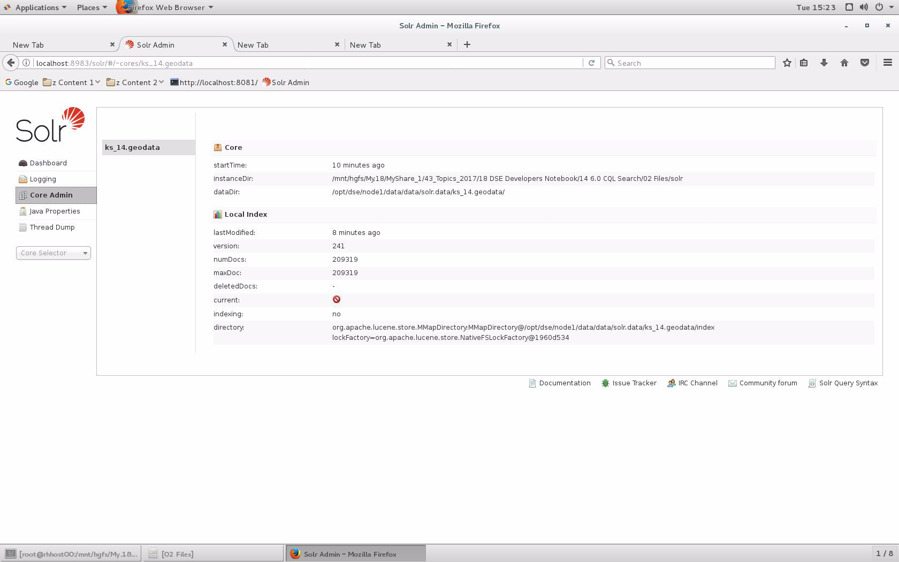

| **[Monthly Articles - 2022](../../README.md)** | **[Monthly Articles - 2021](../../2021/README.md)** | **[Monthly Articles - 2020](../../2020/README.md)** | **[Monthly Articles - 2019](../../2019/README.md)** | **[Monthly Articles - 2018](../../2018/README.md)** | **[Monthly Articles - 2017](../../2017/README.md)** | **[Data Downloads](../../downloads/README.md)** |
|-------------------------|-------------------------|-------------------------|-------------------------|-------------------------|-------------------------|-------------------------|

[Back to 2018 archive](../README.md)
[Download original PDF](../DDN_2018_14_CQL-Search.pdf)

## From The Archive

2018 February - -

>Customer: My company was invited to participate in the DataStax Enterprise (DSE) 6.0 early
>release program. From discussions with DataStax, we learned there are a number of changes
>related to CQL native processing of DSE Search commands. Can you help us understand what
>this means ?
>
>Daniel: Excellent question ! On February 1, 2018, DataStax began accepting self nominations
>to the DSE release 6.0 Early Access Process (EAP) at the following Url,
>
>https://academy.datastax.com/eap?destination=eap
>
>When your nomination is accepted, you receive early access to the DSE version 6.0 software
>and documentation. In return, you are asked to formally test this release and participate
>in feedback relative to your experiences. The 6.0 release is huge, with many topics far
>larger than CQL native processing of DSE Search commands; this is a very cool, and strategic
>release.
>
>In this document, we detail the DSE Core and DSE Search areas of functionality, their intent,
>how they work pre release 6.0, and are planned to work in the 6.0 release. Further, we detail:
>
>• The four functional areas of DSE, including DSE Core with its network partition fault tolerance and time constant lookups.
>
>• We detail B-Tree+ and hash lookups, and which scale and why.
>
>• We define the DSE primary key, including its partitioning key and clustering key parts.
>
>• We detail what makes a query a DSE Core query versus a DSE Search query.
>
>• We highlight the new CQL native processing of DSE Search commands.
>
>• We overview DSE materialized views, and secondary indexes.
>
>• We detail how to add and drop table columns, and inform DSE Search indexes of same.
>
>• And we overview how to observe asynchronous/background index builds.
>
>[Read article online](./README.md)
>


---

# DDN 2018 14 CQL-Search

## Chapter 14. February 2018

DataStax Developer’s Notebook -- February 2018 V1.3

Welcome to the February 2018 edition of DataStax Developer’s Notebook (DDN). This month we answer the following question(s); My company was invited to participate in the DataStax Enterprise (DSE) 6.0 early release program. From discussions with DataStax, we learned there are a number of changes related to CQL native processing of DSE Search commands. Can you help us understand what this means ? Excellent question ! On February 1, 2018, DataStax began accepting self nominations to the DSE release 6.0 Early Access Process (EAP) at the following Url,

```text
https://academy.datastax.com/eap?destination=eap
```

When your nomination is accepted, you receive early access to the DSE version 6.0 software and documentation. In return, you are asked to formally test this release and participate in feedback relative to your experiences. The

6.0 release is huge, with many topics far larger than CQL native processing of DSE Search commands; this is a very cool, and strategic release. In this document, we detail the DSE Core and DSE Search areas of functionality, their intent, how they work pre release 6.0, and are planned to work in the 6.0 release.

## Software versions

The primary DataStax software component used in this edition of DDN is DataStax Enterprise (DSE), currently early release 6.0. All of the steps outlined below can be run on one laptop with 16 GB of RAM, or if you prefer, run these steps on Amazon Web Services (AWS), Microsoft Azure, or similar, to allow yourself a bit more resource.

For isolation and (simplicity), we develop and test all systems inside virtual machines using a hypervisor (Oracle Virtual Box, VMWare Fusion version 8.5, or similar). The guest operating system we use is CentOS version 7.0, 64 bit.

DataStax Developer’s Notebook -- February 2018 V1.3

## 14.1 Terms and core concepts

As stated above, we are detailing a very small piece of a future, large and strategic new release of DataStax Enterprise (DSE). You are going to enjoy this release greatly. As early access (pre-release) software, all comments below are subject to change.

Four functional areas of DSE In section 10.1.8 of the October/2017 edition of this document (DataStax Developer’s Notebook: DDN), we detailed the four major functional areas of DataStax Enterprise (DSE), namely:

- DSE Core (often denoted as, C*, powered by Apache Cassandra).

- Search (powered by Apache Lucene / Apache Solr).

- Analytics (powered by Apache Spark).

- Graph (powered by Apache TinkerPop, and Apache Gremlin).

Scalability, time constant lookups Two of these functional areas are relevant to our current discussion of CQL native processing of DSE Search commands: DSE Core, and DSE Search. Regarding DSE Core, recall the following:

- DSE Core is that area of DSE that provides network partition fault tolerance, that is; always on, all nodes are capable of accepting writes, even if the ultimate/final destination of that data is not currently available. The write always succeeds and is preserved, even if only one of many nodes are operating. Should the same (single data row) be written to on two separate nodes concurrently, DSE will automatically (merge) these separate writes into one best surviving version of this (single data row).

- And DSE Core also provides time constant lookups, that is; DSE Core is based on two seminal industry white papers, one from Google (Google BigTable), and one from Amazon (Amazon DynamoDB). The purpose of this over arching design is to serve data at Web scale in an always-on manner. All database servers claim to scale horizontally without end. Almost none do. At the heart of most database servers are sequential scans and/or B-Tree+ style indexes. We state as common knowledge that sequential scans do not scale linearly, as data volumes grow. Less commonly known is that B-Tree+ styles indexes also do not scale linearly.

DataStax Developer’s Notebook -- February 2018 V1.3

> Note: From the Wikipedia.com articles on B-Tree+ style indexes, and logarithmic time, available here,

```text
https://en.wikipedia.org/wiki/B-tree
https://en.wikipedia.org/wiki/Time_complexity#Logarithmic_time
```

“In computer science, a B-tree is a self-balancing tree data structure that keeps data sorted and allows searches, sequential access, insertions, and deletions in logarithmic time .

```text
T(n) = O(log n)
```

“An algorithm is said to take logarithmic time if . ... An

```text
O(log n)
```

algorithm is considered highly efficient, as the ratio of the number of operations to the size of the input decreases, and tends to zero when n increases .

DSE Core, based on the seminal Google BigTable white paper, does not use B-Tree+ style indexes. This white paper is available here,

```text
https://static.googleusercontent.com/media/research.google.com
/en//archive/bigtable-osdi06.pdf
```

> Note: The other seminal paper we refer to above (Amazon : Amazon DynamoDB), is available here, http://www.allthingsdistributed.com/files/amazon-dynamo-sosp20 07.pdf

Instead, DSE Core makes use of a hash based storage algorithm.

> Note: From the Wikipedia.com article on hash tables available here,

```text
https://en.wikipedia.org/wiki/Hash_table
```

“In a well-dimensioned hash table, the average cost (number of instructions) for each lookup is independent of the number of elements stored in the table . Many hash table designs also allow arbitrary insertions and deletions of key-value pairs, at (amortized[2]) constant average cost per operation .

So we’re done right, make everything a hash ? No, not unless you only need a key/value store. If you also need a general purpose database server, you need more.

DataStax Developer’s Notebook -- February 2018 V1.3

As a stand alone technology, hash indexes can only effectively serve equalities on the whole of the (primary key) to the data row. Hash indexes suffer when serving key ranges, partial key searches, fuzzy searches, etcetera.

And this is why there are three other major functional areas to DataStax Enterprise (DSE). The DSE Search component to DSE provides:

- Additional indexes; Range queries and sorts, complex relational query predicates along the lines of SQL.

- Text analytics; text search, fuzzy search, highlighting, spell checking, synonyms, other.

- Spatial analytics; point, line, polygons, and more, nearness, intersects, other.

- Time series

- Faceting, clustering, grouping

- Other

Defining the term ‘DSE primary key’ Before we can go farther, we need to define the term primary key as it relates to DataStax Enterprise (DSE). Consider:

- A DSE primary key has a mandatory part called the partitioning key , and an optional part called the clustering key . Both the mandatory and optional parts may be composed of one or more columns. A concatenation of the partitioning key and clustering key together form the primary key. As a rule, there can not be two rows in the same table with the same primary key, and primary keys are immutable.

> Note: Generally we state: – As an industry term, primary key commonly denotes the unique identifier of a given data row. It is not industry standard for the primary key to also affect the (storage location) of the given data row. – With DataStax Enterprise (DSE), the primary key denotes data row uniqueness, and affects (storage location). – Only the partitioning key portion of the primary key determines which node a given data row is located on. The clustering key portion of the primary key determines sort order on a given node.

- The partitioning key value uniquely places a given data row on a given (single) node.

DataStax Developer’s Notebook -- February 2018 V1.3

> Note: This is the role and unique value of the partitioning key; by querying an equality of the whole of the partitioning key, you can limit execution of the query to just one node. This operation can scale linearly. Why do we say ‘can scale linearly’, and not say ‘will scale linearly’ ? You could write a poor implementation of a (hash lookup) that does not scale linearly for other reasons; global write locks (MUTEXES), blocking operations in critical sections of the server (product) code, other.

If you lose the whole of the partitioning key of the primary key (use only a subset of columns from the partitioning key, or use a relational operator other than equality, like range, or wildcard text, other), then you can not be certain you can limit the execution of the query to just one node. This operation will likely not scale linearly; when you need to span nodes, you are not likely to scale linearly. Why do we say ‘likely not to scale linearly’ ? It is not multiple nodes that prevent scaling linearly; multiple nodes can scale linearly. It is how rows are identified (uniquely) that scales, or does not scale. When an operation fails to use the whole of the partitioning key, then you are likely performing a scatter/gather query, or a range or sequential scan; these do not scale linearly.

Difference between a DSE Core query and DSE Search (query)

```text
solr_query =
```

Short version: it is/was the presence of a “ ” predicate.

Limiting this discussion to DSE Core, and DSE Search, and to just CQL native processing of DSE Search commands, the following is offered:

- Like SQL, DSE queries rely on a SELECT statement with multiple optional clauses for query predicates (a WHERE clause), an ORDER BY, other. While there are minor exceptions, a DSE Core query (a time constant lookup), is expected to be on the whole of the partitioning key using an equality. What minor exceptions ? Minimally, there is an optional ‘ALLOW FILTERING” clause to a DSE Core SELECT, which can allow a scatter/gather query when using DSE Core. We say ‘can allow’, because these style of queries could effectively call to sequentially scan the entirety of a multi-node, multi-terabyte table. With default DSE server settings, DSE Core queries of this type will likely be shut down (experience a time out) by the DSE server.

- How do DSE Core queries and DSE Search queries differ ?

DataStax Developer’s Notebook -- February 2018 V1.3

DSE Core queries have a query predicate (WHERE clause) similar to,

```text
/ Partitioning key is on col1
```

/

```text
SELECT * FROM t1
WHERE col1 = 10;
// Partitioning key is on two cols; col1 and col2
SELECT * FROM t1
WHERE col1 = 10 AND col2 = 20;
// Partitoning key is on col1 and col2, a clustering key is on
col3
SELECT * FROM t1
WHERE col1 = 10 AND col2 = 20 and col3 > 30;
// Partitoning key is on col1 and col2, a clustering key is on
col3
SELECT * FROM t1
WHERE col1 = 10 and col2 = 20
ORDER BY col3;
= ”
```

DSE Search queries will have a “solr_query predicate,

```text
SELECT name FROM t1
WHERE solr_query =
'{ "q" : "(name:D* OR name:DAVE~1^8)
AND
gender:M AND century:2000" }';
```

```text
solr_query =
```

Only the “ “ predicate makes the above a DSE Search query. The remainder of that text is a Solr query expression . In effect, that string calls to: • In a column titled “name”, return rows that start with the letter “D” (“D*”), OR equal the word “DAVE”, with up to 1 character misspelled at any location in the “DAVE” string literal; “DOVE”, “DAVES”, other. This second portion of the OR clause is given a greater weight when prioritizing which results to return, meaning; DAVES will be returned before choosing to return DON. • The remaining columns are returned based on equalities.

DataStax Developer’s Notebook -- February 2018 V1.3

> Note: As a DSE Search (query), the gender and century predicates could be configured as exact match, or as (weighted near matches).

E.g., This search should return a “gender = M”, but could also return a “gender = F”, if the other predicates are a strong enough match.

This is the difference between query and search.

What changes in DSE version 6.0 ? As stated, the DataStax Enterprise (DSE) 6.0 release is huge. In just the area of CQL native processing of DSE Search commands, we state:

```text
“solr_query = ”
```

- Some queries which were previously written with a predicate, can now be written without same. Syntactic sugar if you will, but also very cool. Instead of having to write DSE Core queries using CQL/SELECT, and DSE Search queries using

```text
”solr_query = “
“solr_query = “
```

CQL/SELECT/ , you can now drop the clause for an initial, and expectedly growing number of queries.

- DataStax Enterprise (DSE) is a multi-model database; DSE Core offering a wide column store, DSE Graph offering graph (a directed acyclic graph store, networked and relationship data), DSE Analytics offering in-memory/streaming, other. The direction is stated to be supporting these models, without forcing the user to write specific query and other syntax for each model type; it’s just a better, more productive integration.

Examples of new syntax Below we display a number of examples to the syntax new found in release 6.0 of DataStax Enterprise (DSE). All examples are written in Python using the open source Cassandra/DSE client side driver.

Example 14-1 begins these examples. A code review follows.

### Example 14-1 Python program to create a table and insert data.

```text
from dse.cluster import Cluster
```

```text
import time
```

```text
l_cluster = Cluster(
contact_points=['127.0.0.1']
)
```

DataStax Developer’s Notebook -- February 2018 V1.3

```text
l_session = l_cluster.connect()
```

```text
l_stmt = \
"DROP KEYSPACE IF EXISTS ks_14; "
#
l_resu = l_session.execute(l_stmt)
```

```text
l_stmt = \
"CREATE KEYSPACE ks_14 WITH REPLICATION = " + \
"{'class': 'SimpleStrategy', " + \
" 'replication_factor': 1}; "
#
l_resu = l_session.execute(l_stmt)
```

```text
l_stmt = \
"DROP TABLE IF EXISTS ks_14.my_table; "
#
l_resu = l_session.execute(l_stmt)
```

```text
l_stmt = \
"CREATE TABLE ks_14.my_table " + \
" ( " + \
" col1 TEXT, " + \
" col2 TEXT, " + \
" col3 TEXT, " + \
" col4 TEXT, " + \
" col8 SET<TEXT>, " + \
" PRIMARY KEY (col1) " + \
" ); "
#
l_resu = l_session.execute(l_stmt)
```

```text
l_stmt = \
"INSERT INTO ks_14.my_table " + \
" (col1, col2, col3, col4, col8) " + \
"VALUES ( %s, %s, %s, %s, %s); "
```

```text
s_col1 = "aaa"
s_col2 = "aaa"
s_col3 = "aaa"
s_col4 = "aaa"
#
s_col8 = { "aaa", "bbb"}
```

DataStax Developer’s Notebook -- February 2018 V1.3

```text
l_session.execute(l_stmt, ( s_col1, s_col2, s_col3, s_col4, s_col8))
```

Relative to Example 14-1, the following is offered:

- This Python client program connects to a local DSE server, creates a keyspace, table, and adds data.

- Every part of this program is supported by DSE Core functionality. Thus, DSE could have been booted without the optional DSE Search functional area. E.g.,

```text
dse cassandra -f -R
```

Run DSE Core in the foreground (“-f”), and allow it to be run as root (“-R”).

- “col8” is one of the three DataSTax Enterprise collection types (array types). Collection types are documented here,

```text
https://docs.datastax.com/en/cql/3.1/cql/ddl/ddl_collection_co
lumns_c.html
```

Adding to the bottom of the code from Example 14-1, we see the following in Example 14-2. A code review follows.

### Example 14-2 Adding more code to the bottom of the previous example.

```text
l_stmt = \
"SELECT * FROM ks_14.my_table " + \
"WHERE col3 IS NOT NULL; "
#
try:
l_rows = l_session.execute(l_stmt)
#
for l_row in l_rows:
print l_row
print "passed on 1."
print "this is not normal."
except:
print "failed on 1."
print "this is normal."
```

```text
print ""
```

Relative to Example 14-2, the following is offered:

DataStax Developer’s Notebook -- February 2018 V1.3

- This example asks for an inequality on a column that is not part of the primary key, not part of the partitioning key, to this table. With our current runtime configuration, that request will fail with a,

```text
dse.InvalidRequest: Error from server: code=2200 [Invalid
query] message="Unsupported restriction: col3 IS NOT NULL
```

Our server is currently booted with just DSE Core running. If we add DSE Search to the operation of this server,

```text
dse cassandra -f -R -s
```

Then the above operation will still fail, because we have not created a DSE Search index to support this query.

- We need to boot our server with support for DSE Search, and add the appropriate DSE Search index. Example as shown in Example 14-3, with a code review that follows.

### Example 14-3 Creating the necessary DSE Search index.

```text
l_stmt = \
"CREATE SEARCH INDEX ON ks_14.my_table " + \
"WITH CONFIG " + \
"{ realtime:true } AND OPTIONS { reindex:true }; "
#
l_resu = l_session.execute(l_stmt)
#
time.sleep(5)
```

Relative to Example 14-3, the following if offered:

- If we try to create the index without DSE Search being turned on, we receive the error below,

```text
dse.InvalidRequest: Error from server: code=2200 [Invalid
query] message="Search statements are not supported on this
node”
```

With DSE Search enabled, the above statement succeeds.

- The sleep command is entirely optional. As our program executes in batch, top to bottom, the index build would not be complete if we immediately were to fetch/query data. Our fetch statement would succeed, but not return the complete result set as expected.

Example 14-4 displays the continuation of our example. A code review follows.

DataStax Developer’s Notebook -- February 2018 V1.3

### Example 14-4 Index built, running the actual queries.

```text
try:
l_stmt = \
"SELECT * FROM ks_14.my_table " + \
"WHERE col3 IS NOT NULL; "
#
l_rows = l_session.execute(l_stmt)
#
for l_row in l_rows:
print l_row
print "passed on 2."
print "this is normal."
except:
print "failed on 2."
print "this is not normal."
```

```text
print ""
```

```text
try:
l_stmt = \
"SELECT * FROM ks_14.my_table " + \
"WHERE col3 IS NULL; "
#
l_rows = l_session.execute(l_stmt)
#
for l_row in l_rows:
print l_row
print "passed on 3."
print "this is not normal."
except:
print "failed on 3."
print "this is normal."
```

Relative to Example 14-4, the following is offered:

- The first SELECT succeeds, and the second fails. IS NOT NULL, is one of the new CQL native processing of DSE Search commands. IS NULL is not. (The expectation being that IS NULL will arrive at some near and future time.)

```text
“solr_query = “
```

Either of these two queries could still be written using .

- Does there always need to be a Search index on the column referred to in the query predicate (when the predicate is not on the primary key) ?

DataStax Developer’s Notebook -- February 2018 V1.3

Yes. Without an index, the requested operation would require a sequential scan of potentially millions of rows, on hundreds of nodes; really not something you want to do.

DSE Indexes (and materialized views) In effect, there are three (or four) DSE index topics.

Thus far we have detailed that DSE Core stores data in a specific physical manner, based on a hash of the primary key; the partitioning key part of the primary key determines the node/location of the data, and the clustering key part of the primary key determines sort order on a node (within a given partition). The physical ordering/placement of the primary key acts as an index of sorts. (It provides a file (table) access method, which is exactly what indexes do.)

And DSE Core supports materialized views , similar to Oracle or other relational database server materialized views. DSE Core materialized views were originally called (DSE Core) global indexes . DSE Core materialized views are detailed at the following Url,

```text
http://docs.datastax.com/en/cql/3.3/cql/cql_reference/cqlCreateMater
ializedView.html
```

Example 14-5 offers a materialized view. A code review follows.

### Example 14-5 Example materialized view.

```text
CREATE TABLE t1
(
col1 TEXT,
col2 TEXT,
col3 TEXT,
col4 TEXT,
col5 TEXT,
col6 TEXT,
col7 TEXT,
col8 TEXT,
PRIMARY KEY ((col1, col2), col3, col4)
);
```

```text
// This next statement will fail
CREATE MATERIALIZED VIEW mv1
AS
SELECT col1, col2, col3, col4, col5, col6, col7, col8
FROM t1
WHERE col7 IS NOT NULL AND col8 IS NOT NULL
PRIMARY KEY (col7, col8)
WITH caching = { 'keys' : 'ALL',
```

DataStax Developer’s Notebook -- February 2018 V1.3

```text
'rows_per_partition' : '100' }
AND comment = 'yadda' ;
```

```text
// This statement will succeed
CREATE MATERIALIZED VIEW mv1
AS
SELECT col1, col2, col3, col4, col5, col6, col7, col8
FROM t1
WHERE col1 IS NOT NULL AND col2 IS NOT NULL AND
col3 IS NOT NULL AND col4 is NOT NULL AND
col7 IS NOT NULL
PRIMARY KEY (col1, col2, col3, col4, col7)
WITH caching = { 'keys' : 'ALL',
'rows_per_partition' : '100' }
AND comment = 'yadda' ;
```

Relative to Example 14-5, the following is offered:

- After the create table statement, the first materialized view statement will fail with a,

```text
InvalidRequest: Error from server: code=2200 [Invalid query]
message="Cannot create Materialized View mv1 without primary
key columns from base t1 (col1,col3,col2,col4)"
```

In effect, a materialized view can extend the primary key constraint from its base table, but it can not (replace) the primary key constraint. Huh ? You can change the ordering of the rows within the existing partition (partitioning key), but not change the partitioning key itself. This does have value; you could specify a base table with a primary key (partitioning key), then have a number of materialized views that offer differing ORDER BY support. And, these would be queries that support time constant look ups. This seems restrictive; why is this a good thing ? Well first off, sorting is blocking operation; you can not return any rows from a sort until all rows have been received. What if the first row that should have been returned was the last row processed- Further, no sort operation scales linearly. The best sort operations sort algorithmically. The ORDER BY support we are discussing here has the rows pre-sorted on disk before any request for SQL processing. That is how this (sort) can scale linearly.

- By materialized in the phrase materialized view, we mean to say that this data is stored on disk, just like a regular table. As the base table is

DataStax Developer’s Notebook -- February 2018 V1.3

updated/deleted/other, all dependent materialized views are automatically and asynchronously (updated).

- The second materialized view statement succeeds.

And before we get to DSE Search indexes, there is another/third index topic with DSE Core we should detail; SASI (Secondary Attached Storage Indexes), also known as secondary indexes. Example as shown in Example 14-6. A code review follows.

### Example 14-6 Secondary index example.

```text
create index i2 on t1 (col6);
select * from t1 where col6 = 'a';
```

```text
col1 | col2 | col3 | col4 | col5 | col6 | col7 | col8
------+------+------+------+------+------+------+------
a | a | a | a | a | a | a | a
```

```text
(1 rows)
```

Relative to Example 14-6, the following is offered:

- DSE Core secondary indexes are most common to the same named secondary indexes in standard relational databases; standard, except that DSE is most commonly a multi-nodal database. Where the DSE Core primary key value determines node location, the secondary index does not (can not). DSE Core secondary index data is stored inside DSE, adjacent to the (normal/standard) data to a table. But, the secondary index is not anchored by the partition key, and as such a query relying on a secondary index may observe a scatter/gather behavior. Like a relational database, this index data is automatically updated as you would expect.

- A further syntax exists for multi-column secondary indexes, detailed here,

```text
https://docs.datastax.com/en/dse/5.1/cql/cql/cql_reference/cql
_commands/cqlCreateCustomIndex.html
```

When you successfully create a SASI Custom index, you will receive the following warning,

```text
SASI index was enabled for 'ks_14.t1'. SASI is still in beta,
take extra caution when using it in production.
```

DataStax Developer’s Notebook -- February 2018 V1.3

- When DSE Core secondary indexes first arrived in version 0.7, they received much bad press. It is very likely this bad press was due to the scatter/gather behavior of a non-anchored retrieval, and nothing more.

Finally, Search indexes When we made the DSE Search index above, we followed this operation with a sleep statement. This is not required. We included the sleep because of the batch nature of our sample/test program above; make an index, and immediately query a data row using this index.

The creation of a new DSE Search index, and even the (insert) of a new data record (into that index) is an asynchronous operation. With no sleep in our batch/test program, its likely our query would not return our single sample data record as expected.

> Note: Many tunables and many diagnostics are available here. We’ll cover some of the diagnostics now, and plan to cover the tunables in a future edition of this document.

Covering tunables involves detailing many more DSE Search index pre-requisite topics than we plan to cover here; a full DSE search index topic treatment is a large discussion. Stay tuned.

As a CQL command, ‘describe table’ tells us what indexes are in place on a table and more. Example as shown in Example 14-7. A code review follows.

### Example 14-7 CQL command describe table.

```text
describe table t1;
```

```text
CREATE TABLE ks_14.t1 (
col1 text,
col2 text,
col3 text,
col4 text,
col5 text,
col6 text,
col7 text,
col8 text,
PRIMARY KEY ((col1, col2), col3, col4)
) WITH CLUSTERING ORDER BY (col3 ASC, col4 ASC)
AND bloom_filter_fp_chance = 0.01
AND caching = {'keys': 'ALL', 'rows_per_partition': 'NONE'}
AND comment = ''
```

DataStax Developer’s Notebook -- February 2018 V1.3

```text
AND compaction = {'class':
'org.apache.cassandra.db.compaction.SizeTieredCompactionStrategy',
'max_threshold': '32', 'min_threshold': '4'}
AND compression = {'chunk_length_in_kb': '64', 'class':
'org.apache.cassandra.io.compress.LZ4Compressor'}
AND crc_check_chance = 1.0
AND dclocal_read_repair_chance = 0.1
AND default_time_to_live = 0
AND gc_grace_seconds = 864000
AND max_index_interval = 2048
AND memtable_flush_period_in_ms = 0
AND min_index_interval = 128
AND read_repair_chance = 0.0
AND speculative_retry = '99PERCENTILE';
CREATE CUSTOM INDEX i4 ON ks_14.t1 (col7) USING
'org.apache.cassandra.index.sasi.SASIIndex';
```

Relative to Example 14-7, the following is offered:

- At the bottom of the display, we see the SASI index we created on this table. All indexes would be displayed here.

- And we see all (including the default) settings in place when creating this table.

- A DSE Search index would display as,

```text
CREATE CUSTOM INDEX ks_14_my_table_solr_query_index ON
ks_14.my_table (solr_query) USING
'com.datastax.bdp.search.solr.Cql3SolrSecondaryIndex';
```

As stated above, index build occurs asynchronously in the background. To

```text
dsetool
```

determine whether the index build is complete, we can run a command. Example as shown as Example 14-8. A code review follows.

### Example 14-8 Sample dsetool checking index build.

```text
// CQL command
CREATE SEARCH INDEX ON ks_14.my_table WITH CONFIG
{ realtime:true } AND OPTIONS { reindex:true };
```

```text
Warnings :
Please remember this operation is DC specific and should be repeated on each
desired DC.
```

```text
// Command line utility
#dsetool core_indexing_status ks_14.my_table
```

DataStax Developer’s Notebook -- February 2018 V1.3

```text
[ks_14.my_table]: INDEXING, 84% complete, ETA 18081 milliseconds (18 seconds)
# dsetool core_indexing_status ks_14.my_table
[ks_14.my_table]: INDEXING, 98% complete, ETA 2118 milliseconds (2 seconds)
# dsetool core_indexing_status ks_14.my_table
[ks_14.my_table]: FINISHED
```

Relative to Example 14-8, the following is offered:

- The index created above was on a 14MB dataset with 200,000 rows. As stated in the introduction to this document, this work was done on a laptop virtual machine with 8GB of RAM. And we were indexing everything; all columns in all rows. This is the default behavior, per the CREATE SEARCH INDEX statement we detailed above in Example 14-3. You can, of course, deviate from the defaults (index fewer columns, and with less search capable behavior).

- While the index is being built, there is no blocking; all end user queries return. If the index build is not completed, the query results may not be complete.

Another set of diagnostics is available via the Solr Administration Web screen, available at,

```text
http://IP-address:8983/solr
```

Where ‘IP-address’ is the address of the node hosting any DSE Search function. Example as displayed in Figure 14-1.

DataStax Developer’s Notebook -- February 2018 V1.3



*Figure 14-1 Solr Admin screen, IP-address:8983/solr*

And lastly tracing; tracing is an ability through the CQL command shell. Example as displayed in Example 14-9. A code review follows.

### Example 14-9 Using tracing in the CQL command shell.

```text
# select * from my_table;
#
# col1 | col2 | col3 | col4 | solr_query
# ------+------+------+------+------------
# aaa | aaa | aaa | aaa | null
#
# (1 rows)
#
# Tracing session: 48af6660-052a-11e8-be54-4b5b3cf8ae6e
#
# activity
| timestamp | source | source_elapsed | client
#
-------------------------------------------------------------------------------
---------------------------------+----------------------------+-----------+----
------------+-----------
```

DataStax Developer’s Notebook -- February 2018 V1.3

```text
#
Execute CQL3 query | 2018-01-29 12:26:20.105000 | 127.0.0.1 | 0 |
127.0.0.1
# Parsing
select * from my_table; [CoreThread-2] | 2018-01-29 12:26:20.108000 | 127.0.0.1
| 3772 | 127.0.0.1
#
Preparing statement [CoreThread-2] | 2018-01-29 12:26:20.108000 | 127.0.0.1 |
4241 | 127.0.0.1
#
Computing ranges to query [CoreThread-2] | 2018-01-29 12:26:20.109000 |
127.0.0.1 | 4744 | 127.0.0.1
# Submitting range requests on 2 ranges with a concurrency of 2 (0.675 rows
per range expected) [CoreThread-2] | 2018-01-29 12:26:20.109000 | 127.0.0.1 |
5118 | 127.0.0.1
# Submitted 1
concurrent range requests [CoreThread-2] | 2018-01-29 12:26:20.110000 |
127.0.0.1 | 6224 | 127.0.0.1
# Executing seq scan across 1 sstables for (min(-9223372036854775808),
min(-9223372036854775808)] [CoreThread-1] | 2018-01-29 12:26:20.110000 |
127.0.0.1 | 6466 | 127.0.0.1
# Read 1 live
and 0 tombstone cells [CoreThread-1] | 2018-01-29 12:26:20.111000 | 127.0.0.1 |
6945 | 127.0.0.1
#
Request complete | 2018-01-29 12:26:20.114322 | 127.0.0.1 | 9322 |
127.0.0.1
```

```text
# select * from my_table where col3 is not null;
#
# col1 | col2 | col3 | col4 | solr_query
# ------+------+------+------+------------
# aaa | aaa | aaa | aaa | null
#
# (1 rows)
#
# Tracing session: 7bd08ab0-052a-11e8-be54-4b5b3cf8ae6e
#
#
# activity
| timestamp | source | source_elapsed | client
#
-------------------------------------------------------------------------------
-------------------------------------------------------------------------------
-------------------------------------------+----------------------------+------
-----+----------------+-----------
#
Execute CQL3 query | 2018-01-29 12:27:45.883000 | 127.0.0.1 | 0 |
127.0.0.1
```

DataStax Developer’s Notebook -- February 2018 V1.3

```text
#
Parsing select * from my_table where col3 is not null; [CoreThread-2] |
2018-01-29 12:27:45.884000 | 127.0.0.1 | 324 | 127.0.0.1
#
Preparing statement [CoreThread-2] | 2018-01-29 12:27:45.884000 | 127.0.0.1 |
715 | 127.0.0.1
# Processed response from shard 127.0.0.1:8609/solr/ks_14.my_table: numFound:
1, maxScore: 1.0, elapsed time: 4 ms, token ranges:
[(-9223372036854775808,-9223372036854775808]] [Solr CQL query thread-0] |
2018-01-29 12:27:45.890000 | 127.0.0.1 | 7147 | 127.0.0.1
#
Executing single-partition query on my_table [CoreThread-1] | 2018-01-29
12:27:45.896000 | 127.0.0.1 | 325 | 127.0.0.1
#
Acquiring sstable references [CoreThread-1] | 2018-01-29 12:27:45.896000 |
127.0.0.1 | 434 | 127.0.0.1
#
Merging data from sstable 1 [CoreThread-1] | 2018-01-29 12:27:45.896000 |
127.0.0.1 | 539 | 127.0.0.1
#
Merged data from memtables and 1 sstables [CoreThread-1] | 2018-01-29
12:27:45.896000 | 127.0.0.1 | 819 | 127.0.0.1
#
Read 1 live and 0 tombstone cells [CoreThread-1] | 2018-01-29 12:27:45.896000 |
127.0.0.1 | 891 | 127.0.0.1
#
Request complete | 2018-01-29 12:27:45.896887 | 127.0.0.1 | 13887 |
127.0.0.1
#
```

```text
#######################################################
```

```text
#
# tracing off
#
```

Relative to Example 14-9, the following is offered:

- DSE Search queries will have a tracing line similar to,

```text
Processed response from shard
127.0.0.1:8609/solr/ks_14.my_table: numFound: 1,
:
maxScore
11.846154, elapsed time: 1621 ms, token ranges:
[(-9223372036854775808,-9223372036854775808]] [Solr CQL query
```

DataStax Developer’s Notebook -- February 2018 V1.3

```text
thread-0] | 2018-01-30 15:52:25.103000 | 127.0.0.1 |
2445916 | 127.0.0.1
```

In other words, you will see a score. Recall that search queries may return near matches , and thus have an associated score. (DSE Core) queries return only exact matches . and thus do not need a score.

```text
tracing on
tracing off
```

- Both the and commands are shown.

- Why was this a single partition query ? We were running this on our laptop with only one node.

What if you add columns to the table after creating the index DSE Search and DSE Search indexes are a huge, huge topic, and we plan a future edition of this document to cover same.

The (default) CREATE SEARCH INDEX statement we executed above called to index all columns; very likely this is not what you need, and instead you wish to index only a smaller number of columns. Further, text strings are indexed by token (delineated by white space). So, if you index a single text column with the value, “I like DSE Search.”, four index entries are created; one for each word. This is done to serve the query for just the word “DSE”, just the word “like”, and all combinations therein. If you do not need to serve that (advanced) query, you can call to create the index in a different (less resource consumptive) manner. Again, much of this is beyond scope for this document.

But, what if you create another column in the table after creating the default (all columns at the time) index ? You will have to add this new column to the index, else queries against this new column will fail.

Example as shown in Example 14-10. A code review follows.

### Example 14-10 Adding a column to a table, DSE Search index

```text
alter table my_table add col6 text;
```

```text
select * from my_table where col6 > 'ddd';
```

```text
InvalidRequest: Error from server: code=2200 [Invalid query] message="Cannot
execute this query as it might involve data filtering and thus may have
unpredictable performance. If you want to execute this query despite the
performance unpredictability, use ALLOW FILTERING"
```

```text
ALTER SEARCH INDEX SCHEMA ON my_table ADD FIELD col6;
```

```text
select * from my_table where col6 = 'g';
```

DataStax Developer’s Notebook -- February 2018 V1.3

```text
InvalidRequest: Error from server: code=2200 [Invalid query] message="Cannot
execute this query as it might involve data filtering and thus may have
unpredictable performance. If you want to execute this query despite the
performance unpredictability, use ALLOW FILTERING"
```

```text
RELOAD SEARCH INDEX ON my_table;
```

```text
Warnings :
Please remember this operation is DC specific and should be repeated on each
desired DC.
```

```text
select * from my_table where col6 = 'g';
```

```text
col1 | col2 | col3 | col4 | col6 | col8 | solr_query
------+------+------+------+------+------+------------
```

```text
(0 rows)
```

```text
alter table my_table drop col4;
#
# InvalidRequest: Error from server: code=2200 [Invalid query] message="Cannot
drop column col4 because it has dependent secondary indexes
(ks_14_my_table_solr_query_index)"
#
```

```text
ALTER SEARCH INDEX SCHEMA ON my_table DROP field col4;
```

```text
select * from my_table where col4 = 'g';
```

```text
col1 | col2 | col3 | col4 | col6 | col8 | solr_query
------+------+------+------+------+------+------------
g | g | g | g | g | null | null
```

```text
(1 rows)
```

```text
RELOAD SEARCH INDEX ON my_table;
```

```text
Warnings :
Please remember this operation is DC specific and should be repeated on each
desired DC.
```

```text
select * from my_table where col4 = 'aaa';
InvalidRequest: Error from server: code=2200 [Invalid query] message="Cannot
execute this query as it might involve data filtering and thus may have
unpredictable performance. If you want to execute this query despite the
performance unpredictability, use ALLOW FILTERING"
```

DataStax Developer’s Notebook -- February 2018 V1.3

Relative to Example 14-10, the following is offered:

- First we add a new column to the table titled, col6. The ALTER TABLE command is detailed here,

```text
https://docs.datastax.com/en/cql/3.1/cql/cql_reference/alter_t
able_r.html
```

- The next statement attempts to query with a predicate on this new column. This operation fails, as there is no available index ready to serve this query.

- The ALTER SEARCH INDEX statement succeeds; this new column is now known to the index from a schema perspective (a data definition perspective). The ALTER SEARCH INDEX command is detailed here,

```text
https://docs.datastax.com/en/dse/6.0/cql/cql/cql_reference/cql
_commands/cqlAlterSearchIndexSchema.html
```

- The next select referencing this new column in the predicate still fails. It is fine that the index knows about this column, but no index data has yet been loaded. This operation is performed with the RELOAD SEARCH INDEX command, detailed here,

```text
https://docs.datastax.com/en/dse/5.1/dse-dev/datastax_enterpri
se/search/reloadSearchCore.html
```

Actually, there is a RELOAD (index) command and a REBUILD (index) command; each differ, and each are important. For now, we only need the RELOAD command. Notice that these commands are reported as being local to one data center; data center is a DSE node grouping concept not discussed further here.

- And finally the SELECT statement succeeds.

- If we attempt to drop a column that is part of a usable index, this operation fails. We must first drop the column from the index, then drop it from the table. Example as shown. The index data is still present on the dropped column until we call to RELOAD the index.

More new syntax (continued from above) Thus far in this document we detailed the new IS NOT NULL operator. Other operators include:

- All of the algebraic operators: < > >= <= = !=

- IN

DataStax Developer’s Notebook -- February 2018 V1.3

- CONTAINS

- LIKE

Examples for most follow in Example 14-10. A code review follows.

### Example 14-11 More examples of the new query operators

```text
select * from my_table;
```

```text
col1 | col2 | col3 | col4 | solr_query
------+------+------+------+------------
aaa | aaa | aaa | aaa | null
```

```text
(1 rows)
```

```text
select * from my_table where col3 <= 'ccc';
```

```text
col1 | col2 | col3 | col4 | solr_query
------+------+------+------+------------
aaa | aaa | aaa | aaa | null
```

```text
(1 rows)
```

```text
select * from my_table where col3 > 'ccc';
```

```text
col1 | col2 | col3 | col4 | solr_query
------+------+------+------+------------
```

```text
(0 rows)
```

```text
select * from my_table where col3 in ('bbb', 'ccc');
```

```text
col1 | col2 | col3 | col4 | solr_query
------+------+------+------+------------
```

```text
(0 rows)
```

```text
select * from my_table where col3 in ('bbb', 'ccc', 'aaa');
```

```text
col1 | col2 | col3 | col4 | solr_query
------+------+------+------+------------
aaa | aaa | aaa | aaa | null
```

DataStax Developer’s Notebook -- February 2018 V1.3

```text
(1 rows)
```

```text
select * from my_table where col3 contains ( 'eee', 'bbb');
```

```text
InvalidRequest: Error from server: code=2200 [Invalid query] message="Cannot
use CONTAINS on non-collection column col3"
```

```text
select * from my_table where col8 contains ( 'eee', 'bbb');
```

```text
InvalidRequest: Error from server: code=2200 [Invalid query] message="Invalid
tuple type literal for value(col8) of type text"
```

```text
select * from my_table where col8 contains 'eee';
```

```text
col1 | col2 | col3 | col4 | col8 | solr_query
------+------+------+------+------+------------
```

```text
(0 rows)
```

```text
select * from my_table where col8 contains 'bbb';
```

```text
col1 | col2 | col3 | col4 | col8 | solr_query
------+------+------+------+----------------+------------
aaa | aaa | aaa | aaa | {'aaa', 'bbb'} | null
```

```text
(1 rows)
```

```text
SELECT * FROM my_table where col3 != 'ddd';
```

```text
col1 | col2 | col3 | col4 | col8 | solr_query
------+------+------+------+----------------+------------
aaa | aaa | aaa | aaa | {'aaa', 'bbb'} | null
```

```text
(1 rows)
```

```text
SELECT * FROM my_table where col3 = 'ddd';
```

```text
col1 | col2 | col3 | col4 | col8 | solr_query
------+------+------+------+------+------------
```

```text
(0 rows)
```

DataStax Developer’s Notebook -- February 2018 V1.3

```text
SELECT * FROM my_table where col3 LIKE 'aa%';
```

```text
col1 | col2 | col3 | col4 | col8 | solr_query
------+------+------+------+----------------+------------
aaa | aaa | aaa | aaa | {'aaa', 'bbb'} | null
```

```text
(1 rows)
```

```text
SELECT json * FROM my_table where col3 LIKE 'aa%';
```

```text
[json]
```

```text
-------------------------------------------------------------------------------
---------------------------
{"col1": "aaa", "col2": "aaa", "col3": "aaa", "col4": "aaa", "col8": ["aaa",
"bbb"], "solr_query": null}
```

```text
(1 rows)
```

Relative to Example 14-10, the following is offered:

- The first SELECT (ALL) will succeed on small sized data sets, and may fail on larger sized data sets. As a scatter/gather query (query all nodes), this DSE Core query may time out. A common work around is to execute the above query as a DSE Search query. Example as shown,

```text
SELECT count(*) FROM my_table WHERE solr_query = '{"q":"*:*"}';
```

If DSE Search is enabled, the above query will always succeed.

- The second and third queries with the “<=” and “>” operators against col3 will succeed. As stated above and throughout this document, there exists a requirement that col3 carry a DSE Search index.

- The query with the IN operator compares a list of literals to a given (non array) DSE column type. Contrast this with the later query with the CONTAINS operator, which compares a single/scalar literal to a DSE array column type. Array column types (officially named collection column types), include: set, list, map. Set, list and map are detailed here,

DataStax Developer’s Notebook -- February 2018 V1.3

```text
https://docs.datastax.com/en/cql/3.1/cql/ddl/ddl_collection_co
lumns_c.html
```

Recall how col8 was defined in the CREATE TABLE statement in Example 14-1,

```text
col8 SET<TEXT>
```

It is this collection type that supports the CONTAINS operator.

- The NOT EQUALS (“ != “)operator is supported, as is EQUALS (“ = “).

- And finally, the last two SELECTs display support of the LIKE operator.

- The json modifier, as displayed, is not directly related to CQL native processing of DSE Search commands, however; the json modifier doesn’t get enough love, and we take the opportunity to highlight it here. The json modifier calls to JSON format query results; super handy when developing Web and mobile applications.

> Note: With a sharp eye, you will notice there was no mention of a DSE Core CQL (OR) modifier.

```text
“solr_search = “
```

There is full support for OR using DSE Search query expression.

## 14.2 Complete the following

At this point in this document we have completed a general overview of the changes to release 6.0 of DataStax Enterprise (DSE), specifically as they relate to the new CQL native processing of DSE Search commands.

While we provided details regarding DSE Search commands, we did not give much detail about tuning, nor detail any specific configuration of the indexes created. A large topic, this will have to wait for another day.

At the point you are enabled to apply to the DataStax Enterprise (DSE) early access program (EAP), get the software, install it, and test the new commands detailed above. We tend to use a number of custom scripts to automate install and configuration of single and multi-node DSE installs. All of our scripts worked with version 6.0 without change. Yes, some settings in cassnadra.yaml and similar were removed, some added, but generally release 6.0 is very backwards compatible. Cool.

Get the software, read the documentation, and test it using the commands above.

DataStax Developer’s Notebook -- February 2018 V1.3

## 14.3 In this document, we reviewed or created:

This month and in this document we detailed the following:

- The four functional areas of DSE, including DSE Core with its network partition fault tolerance and time constant lookups.

- We detailed B-Tree+ and hash lookups, and which scale and why.

- We defined the DSE primary key, including its partitioning key and clustering key parts.

- We detailed what makes a query a DSE Core query versus a DSE Search query.

- We highlighted the new CQL native processing of DSE Search commands.

- We over viewed DSE materialized views, and secondary indexes.

- We detailed how to add and drop table columns, and inform DSE Search indexes of same.

- And we over viewed how to observe asynchronous/background index builds.

### Persons who help this month.

Kiyu Gabriel, Matt Atwater, and Jim Hatcher.

### Additional resources:

Free DataStax Enterprise training courses,

```text
https://academy.datastax.com/courses/
```

Take any class, any time, for free. If you complete every class on DataStax Academy, you will actually have achieved a pretty good mastery of DataStax Enterprise, Apache Spark, Apache Solr, Apache TinkerPop, and even some programming.

This document is located here,

```text
https://github.com/farrell0/DataStax-Developers-Notebook
```
