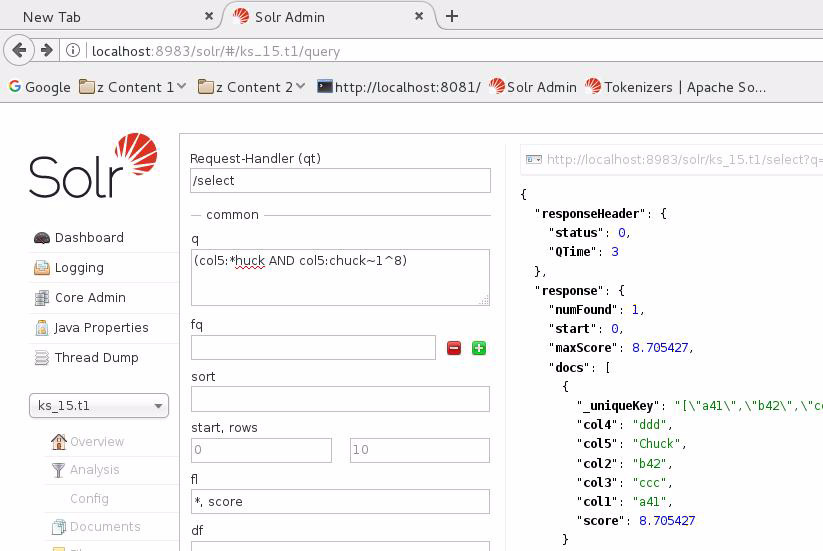
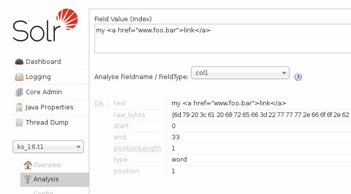
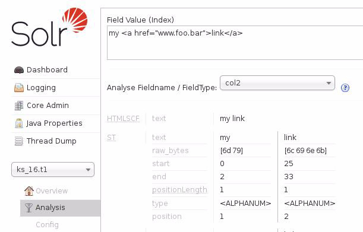
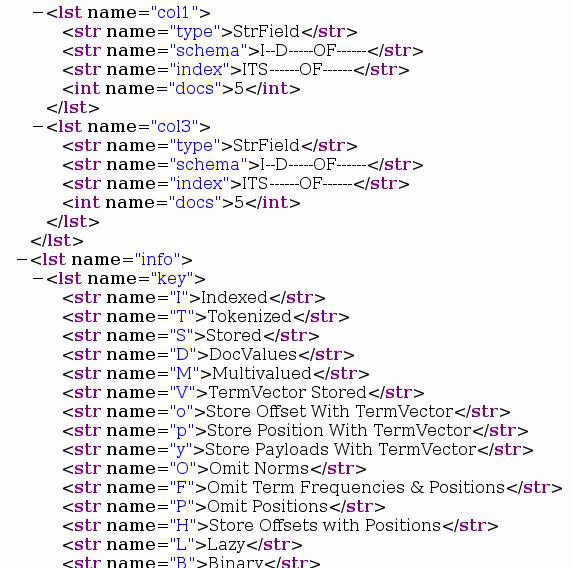

| **[Monthly Articles - 2022](../../README.md)** | **[Monthly Articles - 2021](../../2021/README.md)** | **[Monthly Articles - 2020](../../2020/README.md)** | **[Monthly Articles - 2019](../../2019/README.md)** | **[Monthly Articles - 2018](../../2018/README.md)** | **[Monthly Articles - 2017](../../2017/README.md)** | **[Data Downloads](../../downloads/README.md)** |
|-------------------------|-------------------------|-------------------------|-------------------------|-------------------------|-------------------------|-------------------------|

[Back to 2018 archive](../README.md)
[Download original PDF](../DDN_2018_15_SearchPrimer.pdf)

## From The Archive

2018 March - -

>Customer: My company wants to use the secondary indexes, part of DataStax Enterprise (DSE)
>Search, more specfically the (first name) synonym and Soundex style features to aid in
>customer call center record lookup. Can you help ?
>
>Daniel: Excellent question ! DataStax Enterprise (DSE) Search is one of the four primary
>functional areas inside DSE; the others being DSE Core, DSE Analytics, and DSE Graph.
>Built atop Apache Solr, DSE Search is a large topic. As such, we will detail the programming
>(use) of DSE Search, and let this document serve as a primer of sorts.
>
>We plan follow up editions of this document to cover not just programming, but capacity
>planning of DSE Search, and tuning of DSE Search.
>
>**Mar 21 - This document was heavily revised: 30 new pages of content, 2 errors corrected.**
>
>[Read article online](./README.md)
>


---

# DDN 2018 15 SearchPrimer

## Chapter 15. March 2018

DataStax Developer’s Notebook -- March 2018 V1.4

Welcome to the March 2018 edition of DataStax Developer’s Notebook (DDN). This month we answer the following question(s); My company wants to use the secondary indexes, part of DataStax Enterprise (DSE) Search, more specfically the (first name) synonym and Soundex style features to aid in customer call center record lookup. Can you help ? Excellent question ! DataStax Enterprise (DSE) Search is one of the four primary functional areas inside DSE; the others being DSE Core, DSE Analytics, and DSE Graph. Built atop Apache Solr / Apache Lucene, DSE Search is a large topic. As such, we will detail the programming (use) of DSE Search, and let this document serve as a primer of sorts. We plan follow up editions of this document to cover not just programming, but capacity planning of DSE Search, and tuning of DSE Search.

## Software versions

The primary DataStax software component used in this edition of DDN is DataStax Enterprise (DSE), currently Early Access Program (EAP) release 6.0. All of the steps outlined below can be run on one laptop with 16 GB of RAM, or if you prefer, run these steps on Amazon Web Services (AWS), Microsoft Azure, or similar, to allow yourself a bit more resource.

For isolation and (simplicity), we develop and test all systems inside virtual machines using a hypervisor (Oracle Virtual Box, VMWare Fusion version 8.5, or similar). The guest operating system we use is CentOS version 7.0, 64 bit.

DataStax Developer’s Notebook -- March 2018 V1.4

## 15.1 Terms and core concepts

As stated above, ultimately the end goal is to deliver DataStax Enterprise (DSE) Search capability for end user queries using synonyms (first name Bob, Robert, Bobby, other), and Soundex (cranberries, The Cranberries, Kranbury, other).

DSE Search is a large topic, and as such this document will cover programming of these types of end user queries, and not cover the topics of capacity planning or tuning of same. Why ? This series of documents (DataStax Developer’s Notebook, DDN) has not yet covered capacity planning or tuning to any area of DSE. Capacity planning and tuning are large topics unto themselves; detailing the various internal processes of the DSE server, and then how and why resources are consumed and coordinate their activities with other areas of the DSE server.

The Four Functional Areas of DSE, in the context of Search In at least two previous editions of DataStax Developer’s Notebook (DDN October/2017: DataStax Enterprise Primer, and DDN February/2018: DSE CQL Search queries), we detailed the four primary functional areas of DataStax Enterprise (DSE). Comments:

- The four primary functional areas of DSE include: DSE Core, DSE Search, DSE Analytics, and DSE Graph.

- You could choose to view the DSE functional areas of DSE Core, and DSE Search as the indexing and query processing areas of DSE. • DSE Core provides many things, including time constant lookups. Data is stored on disk in a manner that supports efficient (time constant) retrieval. The index technology here is largely hash, and as such DSE Core supports the query predicates it supports. • DSE Search provides an index technology other than hash. DSE Search supplies a term frequency - inverse document frequency index (a Tf-Idf index), a form of bitmap index. (We detailed this topic quite a bit in the October/2017 edition of this document.) As a different (new) type of index to DSE, DSE Search then supplies new types of query syntax and query execution (query processing).

- DSE Analytics, built atop Apache Spark, provides no inherit new index technology to DSE. As a programmable, parallel, server side (end user application) framework, DSE Analytics could be used to write a new index capability in Java or similar, but the point is, none is inherently present. (There’s no new index technology inside the box.) DSE Analytics automatically uses the DSE Core and DSE Search indexes, when present.

DataStax Developer’s Notebook -- March 2018 V1.4

- And DSE Graph, powered by Apache TinkerPop and Apache Gremlin, is definitely a query processing component, but includes no new index technology by itself. DSE Graph automatically uses the DSE Core and DSE Search indexes, when present.

DSE CQL (Search) It used to be so easy (hard ?). In the last edition of this document (February/2018) we detailed the following:

- Prior to DSE release 6.x, DSE Search queries had to have a “solr_query” predicate, and DSE Core queries did not; DSE Core queries did not have a solr_query predicate. Example as shown,

```text
SELECT .. WHERE
= ..” ;
solr_query
```

- To simplify any required SQL/CQL syntax, and make DSE faster and easier to use, many DSE Search queries no longer require the “solr_query” predicate, and may often be written using a historical/common SQL/CQL like syntax. Example as shown:

```text
SELECT * FROM t1 WHERE col1 = 'Al' AND col2 = 'Madden';
SELECT * FROM t1 WHERE col5 = 'Chuck';
```

> Note: The first query above is executed by DSE Core, and the second query is executed by DSE Search. But, how would you know this ?

The short answer is: expertise.

The longer answer is:

- By turning cqlsh (DSE Core query language, command shell) “tracing on”, you would again depend on expertise, and evaluate the tracing output which differs for DSE Core and DSE Search queries. A DSE Search query will have a , and a DSE Core query will not. maxScore

- Also, DSE Core queries rely on all of the partitioning columns of the primary key. DSE Search queries rely on a secondary index, a DSE Search index. When predicate and index key columns conditions are met, a query will use either DSE Core or DSE Search or a combination thereof. Again, we covered most or all of this in the last edition of this document.

DataStax Developer’s Notebook -- March 2018 V1.4

Runtime requirements and syntax DataStax Enterprise (DSE) is expected to host a large, global, always-on database server application. As such, there are many operations common to a small relational database that you would not want to perform when using DSE.

For example; you would not want to sequentially scan a large (multiple terabytes) multi-node table, and DSE wants to help you prevent that from occurring. There is an ALLOW FILTERING (allow sequential scans) SQL/CQL SELECT clause available, however; under many circumstances said query will still time out and not complete, due to other DSE server (safety) settings.

Expect the following:

- By definition, a DSE table will have a single , which must have primary key a minimum, single column . Optionally, this same table may partitioning key have multiple columns in the partitioning key, and zero or more columns in the . clustering key By definition, it is the combination (concatenation) of the partitioning key and clustering key that form the primary key. The primary key to a DSE table determines the DSE Core queries that may be executed. (DSE Core queries are dependent on, make use of, the primary key.)

- In order to run any DSE Search syntax queries, a secondary index must exist on the table in the form of a DSE Search index. And in order to create and maintain DSE Search indexes on a given DSE node, the DSE node(s) must have the DSE Search capability enabled, most commonly a server boot time argument.

By default (the result of the minimum CREATE SEARCH INDEX syntax,

> Note: no specific column names specified), the DSE Search index will include every column found in the table.

Unless you actually reference said indexed column(s) in a query predicate (refer to the column in a WHERE clause), or query ORDER BY clause, the given columns should not be indexed. There is a cost to indexing, and if there is to be no benefit then the given columns should not be indexed.

Further, based on the indexed column’s data type (integer, string, other), there are zero to 10 or more adjectives (modifiers) that further define the index storage and functional properties for a given column. If you do not need these properties, again, you are advised against calling for these (resources) to be created and maintained.

More detail on this topic is offered below.

DataStax Developer’s Notebook -- March 2018 V1.4

CREATE/ALTER SEARCH INDEX In the prior edition of this document (DataStax Developer’s Notebook, February/2018), we detailed two CREATE SEARCH INDEX statements, and one ALTER SEARCH INDEX statement.

The following is offered:

- The two example CREATE SEARCH INDEX statements in last month’s document failed to identify specific columns in the table, thus all columns were indexed by default. In the call out above, this is discussed as being non-optimal from a performance and resource consumption stand point. Further, there are adjectives (modifiers) to any given column that affect storage and functional behavior.

- Minimally, there are five or six SQL/CQL data definition language (DDL) statements used in a coordinated manner when (configuring / programming) DSE Search. • An obvious DROP SEARCH INDEX statement exists.

> Note: DSE Search indexes exist per table (are identified as a table level resource), not per column. (You create the DSE Search index on one or more named columns, but the index itself is identified per table.)

To drop a single/given column from a remaining DSE table DSE Search index, you use the ALTER SEARCH INDEX statement, with a DROP (column) clause.

You can not drop a column from the DSE table proper, if an existing DSE Search index is in place on said column.

> Note: DSE Search indexes do not span tables, and the index data itself is stored inside DSE Core just like normal data.

DSE Search index data is co-located with it’s (member data), that is; the DSE Search index is partitioned in the same manner as the DSE table proper.

• In all cases, a CREATE SEARCH INDEX statement must be executed first.

DataStax Developer’s Notebook -- March 2018 V1.4

> Note: ALTER SEARCH INDEX currently offers a super set of the functionality provided by CREATE SEARCH INDEX. Thus, in a percentage of cases you will execute a CREATE SEARCH INDEX only to allow a (more complete, necessary) ALTER SEARCH INDEX statement.

More detail on this topic is offered below.

• A minimum CREATE SEARCH INDEX statement (one used only to permit access to a necessary/following ALTER SEARCH INDEX statement), you might choose to create is a DSE Search index on the leading or set of primary key columns. For example; given a table with columns named col[1-8], and with a partitioning key on col1 and col2, you might execute the following CREATE SEARCH INDEX statement:

```text
CREATE SEARCH INDEX ON ks_15.t1 WITH COLUMNS col1, * { excluded
: true };
```

In the statement above, a call is made to create a DSE Search index on just col1. Upon receipt, the DSE runtime will detect all columns that are members of the primary key (partitioning key and clustering key both), and create DSE Search indexes on all, a requirement. • DSE Search index creation occurs in the background and in a non-blocking fashion. When the index build is complete, newly received SQL/CQL queries will automatically make use of same.

> Note: You can determine if any new index build (or similar) is complete using the command,

```text
# dsetool core_indexing_status ks_15.t1
[ks_15.t1]: INDEXING, 84% complete, ETA 18081 milliseconds (18
seconds)
# dsetool core_indexing_status ks_15.t1
[ks_15.t1]: INDEXING, 98% complete, ETA 2118 milliseconds (2
seconds)
# dsetool core_indexing_status ks_15.t1
[ks_15.t1]: FINISHED
```

where ks_15 is the name of your keyspace, and t1 is the name of your table.

There are other means to determine index build progress. This topic is not expanded upon further here.

DataStax Developer’s Notebook -- March 2018 V1.4

Further, DSE offers the concept of (versioning); you may execute several ALTER SEARCH INDEX statements or similar, then call for the index to be (deployed in one step, versus many incremental steps). To implement DSE Search index changes, use the commands,

```text
RELOAD SEARCH INDEX ON ks_15.t1;
REBUILD SEARCH INDEX ON ks_15.t1;
```

where ks_15 is the name of your keyspace, and t1 is the name of your table.

The SQL/CQL RELOAD | REBUILD SEARCH INDEX statement

> Note: operates datacenter by datacenter. (A datacenter being an identifier for a single or set of DSE nodes.)

There is a means to RELOAD | REBUILD DSE Search indexes cluster wide. This topic is not expanded upon further here.

• Further, to track the effect of any CREATE SEARCH INDEX, ALTER SEARCH INDEX activities above, you may use the following commands,

```text
DESCRIBE PENDING SEARCH INDEX SCHEMA ON ks_15.t1;
DESCRIBE ACTIVE SEARCH INDEX SCHEMA ON ks_15.t1;
DESCRIBE PENDING SEARCH INDEX CONFIG ON ks_15.t1;
DESCRIBE ACTIVE SEARCH INDEX CONFIG ON ks_15.t1;
```

where ks_15 is the name of your keyspace, and t1 is the name of your table. The difference between these two commands (PENDING | ACTIVE) is the report of planned changes, versus (changes) already in place.

DataStax Developer’s Notebook -- March 2018 V1.4

> Note: SCHEMA reports on the specific columns, data types, and other conditions relative to DSE Search storage and configured functionality. CONFIG generally reports on DSE Search system tunables and capacities. (You could also think of SCHEMA as needing to be table by table, and some CONFIG settings as datacenter wide. Using CREATE | ALTER SEARCH INDEX, CONFIG settings are specified table by table.)

Apache Solr, and legacy use of DSE Search made use of at least 2 XML encoded files, generally referred to as; solrconfig.xml, and schema.xml, or similar names. These legacy files directly relate to CONFIG and SCHEMA above.

If you Google, and find legacy instructions or capabilities associated with these two legacy XML encoded files, there is likely an equal capability using CREATE SEARCH INDEX and/or ALTER SEARCH INDEX.

You can still use the legacy XML files certainly, but a better pattern might be to not use them. This topic is not expanded upon further here.

• Do not forget there is also the following command,

```text
DESCRIBE TABLE ks_15.t1;
```

where ks_15 is the name of your keyspace, and t1 is the name of your table. With this command you can gather the full schema of the table (not just DSE Search indexed columns) to include the column types, primary key specification, and presence of any indexes. • Lastly, in this document we are detailing programming (use) of DSE Search indexes, and don’t really address the capacity planning or tuning of DSE Search indexes. As such, we are not defining the read or write path of DSE data, nor specifically reading and writing as it involves the DSE Search index. Why do we mention this ? An additional command exists that you may use in your program development and testing. That is,

```text
COMMIT SEARCH INDEX ON ks_16.t1;
```

As a largely asynchronous operating piece of software, there is a normal and tunable lag in the time that data may be written to a DSE table proper, and before that same data arrives and is indexed by DSE Search.

```text
COMMIT SEARCH INDEX
```

The command is documented here,

DataStax Developer’s Notebook -- March 2018 V1.4

```text
https://docs.datastax.com/en/dse/6.0/cql/cql/cql_reference/cql
_commands/cqlCommitSearchIndex.html
```

In effect you can programmatically call to (flush) data to the DSE Search index (process), to aid in your development and testing.

Sample DESCRIBE .. SEARCH INDEX statement Example 15-1 offers a number of statements including DESCRIBE ACTIVE SEARCH INDEX. A code review follows.

### Example 15-1 Base table and data used throughout this document/examples.

```text
CREATE KEYSPACE ks_15 WITH REPLICATION =
{'class': 'SimpleStrategy', 'replication_factor': 1};
```

```text
CREATE TABLE ks_15.t1
(
col1 TEXT,
col2 TEXT,
col3 TEXT,
col4 TEXT,
col5 TEXT,
col6 TEXT,
col7 TEXT,
col8 TEXT,
PRIMARY KEY ((col1, col2), col3, col4)
);
```

```text
INSERT INTO ks_15.t1
(col1, col2, col3, col4, col5, col6, col7, col8)
VALUES
(
'a11' , 'b12' , 'ccc' , 'ddd' ,
'eee' ,
'ff 12-15-1980 ff ff expiration ff ff' ,
'ggg' ,
'hhh'
);
INSERT INTO ks_15.t1
(col1, col2, col3, col4, col5, col6, col7, col8)
VALUES
(
'a21' , 'b22' , 'ccc' , 'ddd' ,
'eee' ,
'ff 12/20/1980 ff ff ff ff expiration ff' ,
'ggg' ,
'hhh'
);
INSERT INTO ks_15.t1
```

DataStax Developer’s Notebook -- March 2018 V1.4

```text
(col1, col2, col3, col4, col5, col6, col7, col8)
VALUES
(
'a31' , 'b32' , 'ccc' , 'ddd' ,
'eee' ,
'ff expiration ff ff date' ,
'ggg' ,
'hhh'
);
INSERT INTO ks_15.t1
(col1, col2, col3, col4, col5, col6, col7, col8)
VALUES
(
'a41' , 'b42' , 'ccc' , 'ddd' ,
'Chuck' ,
'David' ,
'Todd' ,
'Cranberries'
);
```

```text
CREATE SEARCH INDEX ON ks_15.t1 WITH COLUMNS col5,
* { excluded : true };
//
DESCRIBE ACTIVE SEARCH INDEX SCHEMA ON ks_15.t1;
<?xml version="1.0" encoding="UTF-8" standalone="no"?>
<schema name="autoSolrSchema" version="1.5">
<types>
<fieldType class="org.apache.solr.schema.StrField" name="StrField"/>
</types>
<fields>
<field indexed="true" multiValued="false"
name="col1" stored="true" type="StrField"/>
<field indexed="true" multiValued="false"
name="col3" stored="true" type="StrField"/>
<field indexed="true" multiValued="false"
name="col2" stored="true" type="StrField"/>
<field indexed="true" multiValued="false"
name="col4" stored="true" type="StrField"/>
<field indexed="true" multiValued="false"
name="col5" stored="true" type="StrField"/>
</fields>
<uniqueKey>(col1,col2,col3,col4)</uniqueKey>
</schema>
//
DESCRIBE PENDING SEARCH INDEX SCHEMA ON ks_15.t1;
(same as above)
```

DataStax Developer’s Notebook -- March 2018 V1.4

Relative to Example 15-1, the following is offered:

- First we make a keyspace and table, and insert four rows. All DSE table column data types are character (TEXT).

- Then we make a call to CREATE SEARCH INDEX on just col5. As our first/only DSE Search index on this table, the DSE runtime creates a DSE Search index on the primary key to this table (col[1-4]), and the named column, col5.

- A DESCRIBE ACTIVE SEARCH INDEX displays that this index is (ready, available for use). A CREATE SEARCH INDEX has a default RELOAD | REBUILD SEARCH INDEX condition.

> Note: A default CREATE SEARCH INDEX will build the index immediately, asynchronously. There is an optional CREATE SEARCH INDEX syntax to defer this index build.

When a DSE Search index is already in place, and you call to ALTER or add to said index, the new index will be built asynchronously, and then replace the prior index in place with no interruption in service to the end user.

In our example we had four rows in the table and the new index was built almost instantaneously. In the real world, a real table with millions of rows might take seconds or longer to build.

In the output to this DESCRIBE ACTIVE SEARCH INDEX, we see: • fieldType, StrField- In short, there are Apache Solr StrField and Solr TextField column types (and other column types). TextField offers a superset of functionality over StrField, and as such can cost more resource to store and maintain. At present, DSE Search will make all DSE column types of TEXT and similar to be of type Solr StrField. You can change these columns (ALTER SEARCH INDEX) to be type Solr TextField.

> Note: This is a change in behavior between version 5.x and version 6.x of DataStax Enterprise (DSE). In DSE 5.x, TEXT fields were generated as Solr TextField. In DSE 6.x, TEXT fields are generated as Solr StrField.

DataStax Developer’s Notebook -- March 2018 V1.4

> Note: What can a Solr TextField do that Solr StrField can not do ?

There is no short answer here. In effect, the answer involves most of the objects and capabilities that are part of DSE Search, Apache Solr. From a 2012 public post located here,

```text
http://lucene.472066.n3.nabble.com/Difference-between-textfield-a
nd-strfield-td3986916.html
```

“A text field is a sequence of terms that has been tokenized while a string field is a single term (although it can also be multivalued). “Punctuation and spacing is ignored for text fields. Text tends to be lowercased, stemmed, and even stop words removed. You tend to search text using a handful of keywords whose exact order is not required, although quoted phrases can be used as well. Fuzzy queries can be done on individual terms (words). Wild cards as well. “String fields are literal character strings with all punctuation, spacing, and case preserved. Anything other than exact match is done using wild cards, although (a fuzzy query is also supported). “String fields are useful for facets and filter queries or display. Text fields are useful for keyword search. “Synonyms are a token filtering, which applies to text fields, not string fields. “A fuzzy query would not work properly for a synonym expansion in which some of the terms are phrases, but should otherwise work for a text field term.

We will seek to explain most or all of the above on the pages that follow.

• And then we enter a block where cols[1-4] and col5 are defined. cols[1-4] are defined because they were discovered to be part of the primary key to this table. col5 was defined because we directly asked for it to be indexed as the result of our CREATE SEARCH INDEX statement. • Finally, the primary key is listed at the end of this display. The DSE Search index must include the DSE table primary key, so that the remainder of DSE table columns may be returned after a DSE Search index retrieval.

DataStax Developer’s Notebook -- March 2018 V1.4

> Note: What are “name”, “stored”, and “multiValued” ?

“name” is the name of the column in the DSE table to which these DSE Search properties and capabilities apply. (In the context of this document we have referred to these properties as adjectives, or also index modifiers.)

“stored” indicates whether the value from this DSE table column is made part of a DSE Search index. When would a column be made known to DSE Search, but then not actually indexed or stored ? One use case would be to copy the first name, middle initial, and last name to a new (index only) column, and allow searches against the whole value (of name). E.g., is Thomas the first name or last name, I don’t know. So allow searches against all (columns). So, we need to make first name, etcetera known to DSE Search (stored=false), and not index it (indexed=false). Using an additional technique/keyword titled, copyField, we complete this use case. More information on this specific use case is below.

And then “multiValued”- In a previous call out we detailed how a TextField is tokenized into multiple word values, with each value being an entry in the index. This is a completely different topic than multiValued. multiValued commonly applies to the DSE table column collection (array) data types of Set and List. Each of these values receives a separate index entry; it’s effectively an array of column values, each indexed separately. multiValued can also apply when using copyField, a topic we expand upon below.

DataStax Developer’s Notebook -- March 2018 V1.4

> Note: Similar to “stored”, and “multiValued”, there is “docValues”, (not contained in this example).

“docValues” is another in a list of index modifiers, and a very common modifier at that. Specifically “docValues=true” adds support for SQL/CQL ORDER BY clauses, and use of faceting on said column. Without this modifier, you can not use the given column to ORDER BY or facet.

The following Urls lists a number of these modifiers, and their associated use cases,

```text
https://lucene.apache.org/solr/guide/6_6/field-properties-by-use-
case.html
https://lucene.apache.org/solr/guide/6_6/defining-fields.html
```

We discuss docValues more in some of the use cases below. For now, be advised that not every DSE Search column type or configuration supports docValues; not every column type can be configured to ORDER BY or faceted upon.

- The above was the result of a DESCRIBE ACTIVE SEARCH INDEX SCHEMA. This schema was active (current) because the CREATE SEARCH INDEX statement executed immediately, per its default syntax. In this case the DESCRIBE PENDING statement returns the exact same output, because no ALTER SEARCH INDEX statements have since been executed, and then not put into effect via a REBUILD | RELOAD SEARCH INDEX.

Entering a solr_query predicate, syntax At this point in this document, we have detailed a basic round trip of creating, examining, and using a DSE Search index. The syntax following the keyword(s)

```text
SELECT .. WHERE solr_query = ..
```

is titled the Solr predicate , similar to any expression (predicate) in the WHERE clause to a SQL/CQL query. A Solr predicate may be entered in plain text, or JSON formatted text. Details are offered here,

```text
https://docs.datastax.com/en/datastax_enterprise/4.8/datastax_enterp
rise/srch/srchJSON.html
https://docs.datastax.com/en/datastax_enterprise/4.8/datastax_enterp
rise/srch/srchCql.html
```

DataStax Developer’s Notebook -- March 2018 V1.4

Generally, plain text is easier to read and write. Generally, JSON formatted text allows access to some of the more complex/capable DSE Search functions like faceting. JSON offers a superset to the functionality of plain text Solr predicates. Examples of each will follow. In each of the following examples, assume the presence of the DSE table and data created in Example 15-1.

More concepts and terms before our first use case We are nearly ready to detail programming and use of our first use case, case insensitive text searching. Before we do that, however, there are just a few more concepts and terms we wish to define.

Earlier we defined a progression of SQL/CQL commands in the programming and use of DSE Search indexes:

```text
DROP SEARCH INDEX ...
CREATE SEARCH INDEX ...
ALTER SEARCH INDEX SCHEMA ...
ALTER SEARCH INDEX CONFIG ...
RELOAD SEARCH INDEX ...
REBUILD SEARCH INDEX ...
COMMIT SEARCH INDEX ...
//
DESCRIBE PENDING SEARCH INDEX SCHEMA ...
DESCRIBE ACTIVE SEARCH INDEX SCHEMA ...
DESCRIBE PENDING SEARCH INDEX CONFIG ...
DESCRIBE ACTIVE SEARCH INDEX CONFIG ...
//
DESCRIBE TABLE ...
```

Hopefully at this point, each of the above makes some sense.

In general we state that DSE Search programming and use involves one or more of three (functional areas). These are:

- Search/Index on scalars While we commonly think of DSE Search as relating only to text, DSE Search is also the means by which we index dates, integers, decimals, and more. We can index for equality predicates, ranges, sorting, faceting, and more.

- Text search

DataStax Developer’s Notebook -- March 2018 V1.4

This is the area of DSE Search for fuzzy matching, synonyms, phonetic matching, and more. Per the original problem statement at the top of this document, this is where we spend the bulk of our discussion this month; programming and using case insensitive and synonym text analytics.

- Spatial search DSE Search also provides distance from point, intersection or exclusion from polygons, and much more. This is likely to be the topic of next month’s edition of this document.

In addition to the above, there is also a common / central object hierarchy to DSE Search. That is:

- Analyzer- As DSE Search provides (text analytics), it shouldn’t be surprising that an object titled, analyzer, is a core/primary object. An analyzer is associated with a DSE field, and is applied to a column value when inserting or updating data. The analyzer is also applied to the query predicate being used to examine a field. You may have the same analyzer for both (indexing and querying), or you may have different analyzers for each. An analyzer is either unchained (uncommon), or chained (common).

- Unchained analyzer- Is a (Java, DSE Search) object unto itself. Largely (functionally) though, you could imagine an unchained analyzer as a pre-packaged chained analyzer. (Chained analyzers are detailed just below.) There is nothing an unchained analyzer can do that you couldn’t replace with a chained analyzer. A list of unchained (actually all) analyzers is located here,

```text
http://www.solr-start.com/info/analyzers/
```

- Chained analyzer- Is not a (Java, DSE Search) object unto itself. A chained analyzer is a logical identification of the (objects) detailed below. A chained analyzer is composed, in order, of the following physical objects: • One optional char (character) filter The presence/use of a char filter is not common. DSE Search provides 8 or more char filters, and a list of available char filters is located here,

DataStax Developer’s Notebook -- March 2018 V1.4

```text
https://lucene.apache.org/solr/guide/6_6/charfilterfactories.h
tml
```

Two of the many use cases for char filters include: -- Remove HTML/XML (formatting) tags from a column value before further processing (indexing, querying). -- Fold foreign character tildes, diacritics and more into a standard ASCII character set. The are multiple means to process foreign character sets, and using a char filter is one such means, (albeit a bit heuristic in effect). Char filters output, suppress, or replace the output of characters from the (database table column value, or query predicate value). • One mandatory tokenizer Every chained analyzer has one tokenizer; not zero tokenizers, not two or more tokenizers. The duty of the tokenizer is to take the column value and output or discard one or more tokens (words). A common tokenizing scheme is to break on whitespace, and to discard most/all punctuation. DSE Search provides ten or more tokenizers, and a list of Solr tokenizers is located here,

```text
https://lucene.apache.org/solr/guide/6_6/tokenizers.html
```

DataStax Developer’s Notebook -- March 2018 V1.4

> Note: Recall the earlier discussion of StrField versus TextField-

A StrField is not tokenized, and is instead indexed and searched upon as a single string value. As such, a StrField is not associated with an analyzer. You can sort, facet, etcetera on StrField columns.

A TextField is associated with an analyzer, and is stored as a single or set of tokens, whatever its associated analyzer produces. You can not sort, facet, etcetera on TextField columns. Why ? Consider the column value, “The Quick Brown Fox”. If you store this value as a single string (StrField), you can sort it, etcetera. This string sorts under T’s/The. If you store this value as the tokens, [ “quick”, “brown”, “fox” ], how do you sort it ? Why would you assume you can sort on quick ? Why not fox ? -- StrField is for equalities, sorting, other. TextField is for word and character matching, other. That is why TextField is tokenized, so you can look for non-anchored words, in this case, brown and fox.

• Zero or more filter(s) A tokenizer accepts the column value from the char filter or column proper as a character stream, and outputs tokens. A filter takes a single or set of tokens and modifies the token stream, outputting zero or more tokens. DSE Search supplied 40 or more filters, and a list of Solr filters is located here,

```text
https://lucene.apache.org/solr/guide/6_6/filter-descriptions.h
tml
```

If there appears to be some overlap in naming or function of filters to tokenizers (the list of filters is a superset to the list of tokenizers), there is. A filter must follow the one tokenizer. Thus, when you really want the function of two or more tokenizers, you use a tokenizer and then a filter similar to a second, third, etcetera, tokenizer.

DataStax Developer’s Notebook -- March 2018 V1.4

> Note: One or more of the tokenizer/filter objects output tokens on (character string length). E.g., split the column value into 1, 2, 3, 4, etcetera, byte long additional tokens by (length).

How could that possibly be useful (that seems so arbitrary) ?

In this document we largely detail text analytics.

You can also analyze integers, decimals, other. If you split (tokenize) the integer value, 32767, into the tokens (32767, 327(00), 32(000), other), you can more efficiently index ranges and proximity of values. These (character string length) tokenizers are useful for several use cases:

- Facet available products for sale into groups of $0-100, $100-200, $200-1000, other.

- Show me Starbuck’s locations within 5 miles, 10 miles, other.

Why this works (why this is faster during processing)- In effect, you are pre-indexing ranges (various precisions) of numerics and dates versus calculating ranges during query processing.

Case insensitive, part 1 We are finally ready to program and use our first working text analytics example.

Our problem statement for this document is to deliver DSE Search for end user queries using synonyms (first name Bob, Robert, Bobby, other), and Soundex (cranberries, The Cranberries, Kranbury, other). This sounds simple, but there is a bit more to delivering a superior/effective end user experience. Comments:

- What if the first name we are searching for is entered in mixed case ? (Bob, BOB, bob).

- cranberries is entered in lower case, but “The Cranberries” is in uppercase and is preceded by the word “the”. “the” is commonly referred to as a stop word, and removed via a process titled, stemming; (E.g., remove: the, a, as, and, [other].)

- And what if any of the words are entered as singular, plural, past tense, or even mis-spelled ?

Example 15-2 displays code relevant to this solution. A code review follows.

DataStax Developer’s Notebook -- March 2018 V1.4

### Example 15-2 Beginning of delivering a case insensitive search.

```text
DROP SEARCH INDEX ON ks_15.t1 ;
//
CREATE SEARCH INDEX ON ks_15.t1 WITH COLUMNS col1 { indexed : true };
//
ALTER SEARCH INDEX SCHEMA ON ks_15.t1 SET
types.fieldtype[@class='org.apache.solr.schema.TextField']@name='TextField';
//
DESCRIBE PENDING SEARCH INDEX SCHEMA ON ks_15.t1;
DESCRIBE ACTIVE SEARCH INDEX SCHEMA ON ks_15.t1;
Returns
<?xml version="1.0" encoding="UTF-8" standalone="no"?>
<schema name="autoSolrSchema" version="1.5">
<types>
<fieldType class="org.apache.solr.schema.StrField" name="StrField"/>
<fieldtype class="org.apache.solr.schema.TextField"
name="TextField"/>
</types>
<fields>
<field indexed="true" multiValued="false" name="col1" stored="true"
type="StrField"/>
<field indexed="true" multiValued="false" name="col3" stored="true"
type="StrField"/>
<field indexed="true" multiValued="false" name="col2" stored="true"
type="StrField"/>
<field indexed="true" multiValued="false" name="col4" stored="true"
type="StrField"/>
</fields>
<uniqueKey>(col1,col2,col3,col4)</uniqueKey>
</schema>
```

Relative to Example 15-2, the following is offered:

- First we call to drop any previously created DSE Search indexes. This is purely a development only, safety step; start from a point of known consistency example over example. In production we would not drop an index so heuristically, without thought.

- Then we execute our minimum CREATE SEARCH INDEX. We execute this statement to get to our goal of running a ALTER SEARCH INDEX statement.

- And then the ALTER SEARCH INDEX statement. The net difference of this command includes:

DataStax Developer’s Notebook -- March 2018 V1.4

• We had not yet seen a useful ALTER SEARCH INDEX statement. This specific invocation is to add the DSE Search TextField column data type to our table; make this data type available/known to this table. Why ? Because DSE Search, Apache Solr is extensible. As such, only the data types you are currently using (have explicitly defined, are in scope). • Is anything actually using this new column data type yet ? No. This is a preparatory step. A subsequent step would have to call to add or alter a column in the table as being this type of DSE Search indexed column.

- And then the two DESCRIBE statements. The first statement asks to describe pending, and the second to describe active. What will differ between these two outputs ? Until the execution of any RELOAD or REBUILD commands, the new TextField column data type will be pending only. This is fine. There are currently no actual column or columns making reference to this data type.

We continue with Example 15-3. A code review follows.

### Example 15-3 Actually using the new TextField data type.

```text
ALTER SEARCH INDEX SCHEMA ON ks_15.t1 ADD fields.field[@name='col5',
@type='TextField', @indexed='true', @multiValued='false', @stored='true'];
```

```text
SELECT * FROM ks_15.t1 WHERE col5 = 'Chuck' ;
InvalidRequest: Error from server: code=2200 [Invalid query] message="Cannot
execute this
query as it might involve data filtering and thus may have unpredictable
performance. If
you want to execute this query despite the performance unpredictability, use
ALLOW FILTERING"
//
RELOAD SEARCH INDEX ON ks_15.t1;
REBUILD SEARCH INDEX ON ks_15.t1;
// #
SELECT * FROM ks_15.t1 WHERE col5 = 'Chuck' ;
InvalidRequest: Error from server: code=2200 [Invalid query]
message="Tokenized text only
supports LIKE and IS NOT NULL operators. Offeding field: col5 for operator:
="
//
SELECT * FROM ks_15.t1 WHERE col5 LIKE 'Chuck' ;
Finds row.
SELECT * FROM ks_15.t1 WHERE col5 LIKE 'chuck' ;
Does not find row.
```

DataStax Developer’s Notebook -- March 2018 V1.4

```text
SELECT * FROM ks_15.t1 WHERE solr_query = '{ "q" : "(col5:*huck AND
col5:chuck~1^8)" }' ;
Finds row.
SELECT * FROM ks_15.t1 WHERE solr_query = '{ "q" : "(col5:chuck)" }' ;
Does not find row.
```

Relative to Example 15-3, the following is offered:

- The first statement executed is an ALTER SEARCH INDEX command. • As configured, this command calls to ADD (field) to the DSE Search index. • Modifiers identify/name the column in play, col5. • This column is of column data type, TextField, which means this column would allow queries over and above those supported by a standard StrField data typed column. • This column is indexed=true, which is most common. The use case listed above for a column indexed=false, would be in conjunction with a source column(s) to a copyField. Use of a copyField is discussed below. • mutliValued was covered above; used for DSE table column collection types (array) of Set and List, or likely copyField; not in play here. • And stored=true, is one of the very few inherit Apache Solr features that bubble up through DSE Search, and is effectively meaningless. All indexed values must be stored, and no non-indexed values need to be stored.

- The first SQL/CQL statements fails. Why ? While we (added) the column titled, col5, to the DSE Search index (via the ALTER SEARCH INDEX command), we didn’t (deploy it). After execution of the RELOAD | REBUILD command pair, this SQL/CQL SELECT statement will work.

- The second SQL/CQL SELECT statement fails on syntax. As a DSE Search TextField (as tokenized text), there are multiple words in this string value. Thus, you must run a LIKE query operator, and not an equality. It may sound like semantics, but what is an equality on multiple tokens ? Think of this as being to similar to the SQL/CQL condition where you can not say, WHERE column = NULL, and must say, WHERE column IS NULL.

DataStax Developer’s Notebook -- March 2018 V1.4

> Note: The above is one example of differences between Solr StrField and Solr TextField.

If this column was indexed as StrField, then the equal operator would work.

Also with a StrField, the LIKE operator would also work on an equality; “Chuck”. LIKE also supports wild cards for single and multiple characters, See,

```text
https://lucene.apache.org/solr/guide/7_0/the-standard-query-parse
r.html
http://lucene.apache.org/core/6_5_1/queryparser/org/apache/lucene
/queryparser/classic/package-summary.html#Escaping_Special_Charac
ters
http://www.solrtutorial.com/solr-query-syntax.html
```

- The third SELECT works as expected.

- The fourth SELECT (works), but fails to find a row. There is no row with a key value of “chuck”. We cover the case insensitive search below.

- The fifth SELECT is the first in this series using JSON formatting. By default, two or more predicates listed in a solr_query predicate expression form an OR condition, and we must explicitly call for an AND when that is our intent. The first query predicate looks for the string with any number of characters (*), and ending in “huck”. The second query predicate looks for the string “chuck”, with only one character out of sequence or mis-spelled (~1). Thus, Chuck qualifies as a correct response on both halves of the AND.

DataStax Developer’s Notebook -- March 2018 V1.4

> Note: In the fifth SELECT there is an additional query predicate metadata expression, (^8). This introduces the DSE Search concepts of boosting and scoring .

In short:

- There are DSE Core queries, DSE Search queries, and there are DSE Search searches, and all arrive via the SQL/CQL SELECT statement.

- DSE Core queries produce an exact match; the rows returned to the client either fully qualify for the query criteria, or they do not. All DSE Core SQL/CQL SELECTs are queries.

- DSE Search queries using an equals operator on StrField(s) are queries. Again, rows either fully qualify, or they do not.

- DSE Search (queries) using LIKE, or query predicate metadata expressions (we had two; ~1, and ^8), are searches; a row may strongly qualify for the query criteria. A row may weakly qualify. The match may qualify with a high score, or a really poor score, based on what you program and configure for.

A DSE Search search may not return an exact match, but may return a near match; consider a mis-spelled token, or a token that qualifies via a Soundex algorithm. (It sounds right. It sounds close enough.)

DSE Search results are each associated with a given score; how certain is DSE Search that this is the right answer ? The DSE SQL/CQL command interface can not return the DSE Search score. To retrieve the DSE Search score, you must access the included Solr Admin (Web form), available by default at,

```text
http://localhost:8983/solr/#/ks_15.t1/query
```

The Solr Admin screen (Web form) is enabled by default on all DSE Search nodes, on port 8983. You may turn this feature off. The remainder of the Url encodes the keyspace and table name (ks_15.t1).

The (~1) query predicate metadata expression is covered above. The (^8) query predicate metadata expression is titled a boost , that is; if this (half) of the total query predicate is found true, weigh this match 8 times more important than the match from the other side of the AND expression. This number could be 8, or another number based on your needs,

Figure 15-1 displays the Solr Admin (Web form). A code review follows.

DataStax Developer’s Notebook -- March 2018 V1.4



*Figure 15-1 Solr Admin screen, getting a score for a result set.*

Relative to Figure 15-1, the following is offered:

- So again, this is the Solr Admin (Web form), available by default on port 8983 on all nodes supporting DSE Search. You may turn this feature off.

- In Figure 15-1 we navigated through the left panel in the following manner: • A drop down list box displays entries for each DSE table that contains a DSE Search index. As we’ve been working on the keyspace titled, ks_15, and the table titled, t1, we selected the drop value titled, ks_15.t1. • After the drop down list box selection, an additional number of menu items appear in the left panel, including one titled, Query, which we selected. This action produces the display in the main (frame) of our Web form displayed in Figure 15-1.

- In the main (frame) of the (Web form), we entered the query predicate equal to a previous example SQL/CQL query, in the text entry field titled, “q” (query).

- In the text entry field titled, “fl” (field list), we entered the value, “*, score”. “*” calls to return all columns from the source DSE table, and “score” is a

DataStax Developer’s Notebook -- March 2018 V1.4

DSE Search virtual column which returns the DSE Search query match score .

- After each of these steps we clicked the button titled, Execute Query (not displayed). This action produces our one resultant data row.

The last SQL/CQL SELECT in Example 15-3 merely repeats display of the fact that we are not currently executing a case insensitive search.

Case insensitive, part 2 Thus far in our example, we are building towards a case insensitive search. Example 15-4 delivers the final piece of the case insensitive search. A code review follows.

### Example 15-4 Continuing example, a case insensitive search.

```text
DROP SEARCH INDEX ON ks_15.t1 ;
//
CREATE SEARCH INDEX ON ks_15.t1 WITH COLUMNS col1 { indexed : true };
//
ALTER SEARCH INDEX SCHEMA ON ks_15.t1 SET
types.fieldtype[@class='org.apache.solr.schema.TextField']@name='TextField';
//
ALTER SEARCH INDEX SCHEMA ON ks_15.t1 ADD
fieldType[@name='TextField44',@class='solr.TextField'] WITH
'{"analyzer":{"tokenizer":{"class":"solr.StandardTokenizerFactory"},
"filter":{"class":"solr.LowerCaseFilterFactory"}}}';
//
ALTER SEARCH INDEX SCHEMA ON ks_15.t1 ADD fields.field[@name='col5',
@type='TextField44', @indexed='true', @multiValued='false', @stored='true'];
//
RELOAD SEARCH INDEX ON ks_15.t1;
REBUILD SEARCH INDEX ON ks_15.t1;
//
DESCRIBE PENDING SEARCH INDEX SCHEMA ON ks_15.t1;
//
SELECT * FROM ks_15.t1 WHERE solr_query = '{ "q" : "(col5:chuck)" }' ;
// Finds row. Need to wait for index to build.
```

```text
col1 | col2 | col3 | col4 | col5 | col6 | col7 | col8 |
solr_query
------+------+------+------+-------+-------+------+-------------+------------
a41 | b42 | ccc | ddd | Chuck | David | Todd | Cranberries |
null
```

```text
(1 rows)
```

DataStax Developer’s Notebook -- March 2018 V1.4

Relative to Example 15-4, the following is offered:

- First we drop the existing DSE Search index on this table, and recreate a minimum form of it (just the primary key columns).

- The first ALTER SEARCH INDEX statement adds the DSE Search TextField column data type to our table. We have detailed this statement previously.

- The second ALTER SEARCH INDEX statement is entirely new to our discussion. Comments: • All DSE Search TextField(s) are associated with an analyzer , which has a single minimum component of a tokenizer . The tokenizer we chose is titled, StandardTokenizer, Apache Solr Java class name, StandardTokenizerFactory. The StandardTokenizer is described as, This tokenizer splits the text field into tokens, treating whitespace and punctuation as delimiters. Delimiter characters are discarded, with the following exceptions: -- Periods (dots) that are not followed by whitespace are kept as part of the token, including Internet domain names. -- The "@" character is among the set of token-splitting punctuation, so email addresses are not preserved as single tokens. -- Note that words are split at hyphens.

> Note: Each unchained analyzer, char filter, tokenizer, or filter will have a description similar in construct to the description of StandardTokenizer above.

Using this description is how you choose which tokenizer, etcetera you need.

We haven’t seen this syntax or step previously in this document, because we were relying on the default tokenizer for DSE Search TextField(s) titled, KeywordTokenizer. (KeywordTokenizer has the Apache Solr Java class name, KeywordTokenizerFactory). Example as shown in Example 15-4.

DataStax Developer’s Notebook -- March 2018 V1.4

> Note: DSE Search (Apache Solr) tokenizers are detailed here,

```text
https://lucene.apache.org/solr/guide/6_6/tokenizers.html
```

There are at least ten tokenizers that ship with DSE Search, each with a different intent. There is a tokenizer just to parse (tokenize) the various standard parts of a email address.

As your DSE Search needs increase, you may choose to study and become familiar with the various tokenizers beyond KeywordTokenizer.

• After the tokenizer component to the analyzer, you may then specify zero of more filters . Filters are just like tokenizers, except that the input to a filter, is the output from a tokenizer. Tokenizers receive their input from the (DSE Search document; which is the given, single data row, column value being examined). This is to say: you must start with one and only one tokenizer from the list of valid tokenizers. And you may optionally list zero or more filters, which are very similar to tokenizers. The tokenizer may be preceded by a char filter, which is not common. • The filter in our example Example 15-4 is titled, LowerCaseFilter, with a Java class name of, LowerCaseFilterFactory. The LowerCaseFilter is described as, Converts any uppercase letters in a token to the equivalent lowercase token. All other characters are left unchanged.

DataStax Developer’s Notebook -- March 2018 V1.4

> Note: Just to be verbose-

It is most common to see an analyzer that is composed of a single/mandatory tokenizer, with zero of more filters. The most complete identifier for these types of analyzers would be, . chained analyzers

There are unchained analyzers that just offer a single Java class name (for analyzer), and do not have any char filter, tokenizer or filter class values. See http://www.solr-start.com/info/analyzers/

When using a chained analyzer, there is an entity that can appear before the tokenizer titled, char (character) filter. Char filters can add, modify or replace characters in the (character stream) before reaching the tokenizer.

In addition to processing foreign character sets, a common use case for char filters is HTML/XML; remove HTML/XML formatting tags before extracting (human readable) text.

DSE Search (Apache Solr) filters are detailed here,

> Note:

```text
https://lucene.apache.org/solr/guide/6_6/filter-descriptions.html
```

There are at least 40 filters that ship with DSE Search, each with a different intent. Although, for simple needs, two or more filters may provide you with the same result. There are several filters for Soundex like functionality, which differ slightly in the languages supported, and search results output. There are also several filters to support synonyms.

We detail both Soundex and synonyms below.

As your DSE Search needs increase, you may choose to study and become familiar with the various filters beyond LowerCaseFilter.

With this second ALTER SEARCH INDEX statement in Example 15-4, you have everything you need to experiment with chaining tokenizers and multiple filters.

DataStax Developer’s Notebook -- March 2018 V1.4

> Note: In Example 15-4, notice we first added the TextField DSE Search column data type, and named it, TextField.

Then we added a TextField with a specific tokenizer and specific non-default filter, and named it something other than TextField; we named this modified TextField, “TextField44”.

Why ?

Because we might have many TextField(s), each with different tokenizer and/or filter needs. Each of these differently analyzed TextField(s) (column types) requires a distinct name for later reference (when the column type is actually applied to a DSE table column).

- After the first ALTER SEARCH INDEX to add TextField, and the second ALTER SEARCH INDEX to add a specifically configured (modified) TextField, we add a DSE table column titled, col5, of this modified DSE Search column data type. (Titled per this example: TextField44).

- We then RELOAD | REBUILD, and then run our query to deliver a case insensitive search. Cool.

Stemming, part 1 Thus far in this document, we can deliver a case insensitive search. This ability adds to delivering a superior/effective end user experience; always a good thing.

Now we wish to add stemming. Stemming is that ability where we remove unimportant/common words from a string like: a, as, and, the, (other). Stemming also translates common plural forms of words into the singular, and past tense words into the current tense.

On Amazon.com, you can search for “mobile phone cases” and receive entries titled, “mobile phone case”; always a good thing. (And shouldn’t your search also return products titled, “cell phone case”. We’ll detail this capability too.)

Example 15-5 begins our delivery of Stemming to our query. A code review follows.

### Example 15-5 Part 1 of Stemming

```text
DROP SEARCH INDEX ON ks_15.t1 ;
//
CREATE SEARCH INDEX ON ks_15.t1 WITH COLUMNS col1 { indexed : true };
//
```

DataStax Developer’s Notebook -- March 2018 V1.4

```text
ALTER SEARCH INDEX SCHEMA ON ks_15.t1 SET
types.fieldtype[@class='org.apache.solr.schema.TextField']@name='TextField';
//
ALTER SEARCH INDEX SCHEMA ON ks_15.t1 ADD fields.field[@name='col8',
@type='TextField', @indexed='true', @multiValued='false', @stored='true'];
//
RELOAD SEARCH INDEX ON ks_15.t1;
REBUILD SEARCH INDEX ON ks_15.t1;
//
DESCRIBE PENDING SEARCH INDEX SCHEMA ON ks_15.t1;
//
SELECT * FROM ks_15.t1 WHERE solr_query = '{ "q" : "(col8:Cranberries)" }' ;
Finds row.
SELECT * FROM ks_15.t1 WHERE solr_query = '{ "q" : "(col8:Cranberry)" }' ;
Does not find row.
```

Relative to Example 15-5, the following is offered:

- First we drop and recreate the minimum DSE Search index.

- The first ALTER SEARCH INDEX adds the DSE Search TextField column data type to our DSE table.

- The second ALTER SEARCH INDEX adds the DSE table column titled, col8, to our DSE Search index. The default analyzer (with the default tokenizer) supports this TextField. The default tokenizer does not stem.

- The DSE Search index is (deployed).

- The first SQL/CQL SELECT find the expected row.

- The second SQL/CQL SELECT does not find its row because the value in the DSE table is plural, and was not stored in the DSE Search index as a stemmed (in this case, singular) value.

Stemming, part 2 Example 15-6 continues our stemming example. A code review follows.

### Example 15-6 Continuation of stemming example.

```text
DROP SEARCH INDEX ON ks_15.t1 ;
//
CREATE SEARCH INDEX ON ks_15.t1 WITH COLUMNS col1 { indexed : true };
//
ALTER SEARCH INDEX SCHEMA ON ks_15.t1 ADD
fieldType[@name='TextField45',@class='solr.TextField'] WITH
'{"analyzer":{"tokenizer":{"class":"solr.StandardTokenizerFactory"},
```

DataStax Developer’s Notebook -- March 2018 V1.4

```text
"filter":[{"class":"solr.LowerCaseFilterFactory"},
{"class":"solr.EnglishMinimalStemFilterFactory"}]}}';
//
ALTER SEARCH INDEX SCHEMA ON ks_15.t1 ADD fields.field[@name='col8',
@type='TextField45', @indexed='true', @multiValued='false', @stored='true'];
//
RELOAD SEARCH INDEX ON ks_15.t1;
REBUILD SEARCH INDEX ON ks_15.t1;
//
DESCRIBE PENDING SEARCH INDEX SCHEMA ON ks_15.t1;
//
SELECT * FROM ks_15.t1 WHERE solr_query = '{ "q" : "(col8:Cranberries)" }' ;
Finds row.
SELECT * FROM ks_15.t1 WHERE solr_query = '{ "q" : "(col8:Cranberry)" }' ;
Finds row.
SELECT * FROM ks_15.t1 WHERE solr_query = '{ "q" : "(col8:cranberry)" }' ;
Finds row.
```

Relative to Example 15-6, the following is offered:

- First we drop and recreate the minimum DSE Search index.

- The first ALTER SEARCH INDEX adds the DSE Search TextField column data type, while instantly adding this column data type with an analyzer with a StandardTokenizer tokenizer, and then two (count) filters; LowerCaseFilter (LowerCaseFilterFactory), and then EnglishMinimalStemFilter (EnglishMinimalStemFilterFactory). Why does the second filter contain the word, English ? Rules of plural and similar word modifiers are, of course, language specific.

> Note: The ALTER SEARCH INDEX example above demonstrates how to chain filters (use multiple filters in sequence) as part of the analyzer.

- Then we call to (deploy) the DSE Search index.

- All 3 SQL/CQL queries find their row. Cool.

> Note: Analyzers are applied to a field type. A DSE table column (field) is then specified as being of that field type, inheriting the analyzer settings.

There are field modifiers that apply to a field types, and separately to fields.

DataStax Developer’s Notebook -- March 2018 V1.4

A quick aside: saving disk and memory space A very cool (useful) Web article details how to save space when creating and maintaining DSE Search indexes. This article is available at,

```text
http://www.sestevez.com/solr-space-saving-profile/
```

We have not detailed using the DSE Search capability titled, highlighting. Use of this feature is not common. Similar to the DSE Search index modifiers titled, multiValued and docValues, are the additional index modifiers titled; termVectors, termPositions, termOffsets.

If you are not using the DSE Search feature titled, highlighting, you can set each of the three (term) settings listed above to false.

We did detail boosting, above. If you are not using boosting, you can set the term modifier titled, omitNorms to true. (omitNorms is a negation, so it is set to true to disable.)

Example as shown:

```text
ALTER SEARCH INDEX SCHEMA ON ks_15.t1 ADD
fieldType[@name='TextField46',@class='solr.TextField',@termVectors=
'false',@termPositions='false',@termOffsets='false',@omitNorms=
'true'];
```

Previously in this document, we detailed use of the DSE Search column data types titled, StrField and TextField. All of the DSE Search column data types are available at,

```text
https://lucene.apache.org/solr/guide/6_6/field-types-included-with-s
olr.html
```

A number of the column data types begin with the string constant, Trie. Generally we state: the Trie fields are sortable values. Each of the Trie fields offers a term modified titled, precisionStep. A high precisionStep value will significantly decrease the index size on disk; however, this same high value will also decrease performance by a small amount.

While we’ve detailed adding a new column data type, we’ve never listed

> Note: the on line documentation page for this command. The on line documentation page is located here,

```text
https://docs.datastax.com/en/dse/5.1/dse-dev/datastax_enterprise/
search/addFieldType.html
```

DataStax Developer’s Notebook -- March 2018 V1.4

DSE Search, Joins Relational databases have the ability to (join) records from one table, to records in another table; in fact, relational databases are highly dependent on this capability. NoSQL databases generally expect to scale horizontally, across dozens and hundreds of commodity servers (nodes).

Joining records in a database than spans multiple nodes can be prohibitive. If the keys shared between two or more tables are not co-located (are not previously residing on the same nodes by key value before the call to join), then the inter-nodal network communication traffic can most negatively impact required service level agreements. Joining is also CPU, memory, and disk intensive.

This is one of the many reasons NoSQL databases feature data redundancy, and instead commonly model pre-joined tables.

DataStax Enterprise (DSE) can join records from two or more tables. DSE can not (join) records using the major functional components titled; DSE Core, or DSE Search. DSE would join records using the major functional component titled, DSE Analytics. (This topic of performing SQL style joining is not expanded upon further here.)

DSE Search inherits a capability from Apache Solr titled joining, that does not equal SQL style joining. This topic is detailed here,

```text
https://wiki.apache.org/solr/Join
```

In effect this Apache Solr search statement,

```text
/solr/collection1/select ? fl=xxx,yyy & q = { ! join from = inner_id
to = outer_id } zzz:vvv
```

would equal the legacy SQL SELECT statement,

```text
SELECT xxx, yyy
FROM collection1
WHERE outer_id IN (SELECT inner_id FROM collection1 where zzz =
"vvv";
```

The above is not a SQL join, and would instead be better identified as a (SQL) nested select .

Example 15-7 offers an example DSE Search that provides a SQL style nested select capability. A code review follows.

### Example 15-7 DSE Search joins (nested selects)

```text
CREATE TABLE IF NOT EXISTS ks_15.states
(
```

DataStax Developer’s Notebook -- March 2018 V1.4

```text
st_abbr TEXT,
st_name TEXT,
PRIMARY KEY(st_abbr)
);
CREATE SEARCH INDEX ON ks_15.states;
```

```text
INSERT INTO ks_15.states (st_abbr, st_name)
VALUES ('CO', 'Colorado' );
INSERT INTO ks_15.states (st_abbr, st_name)
VALUES ('WI', 'Wisconsin' );
```

```text
CREATE TABLE IF NOT EXISTS ks_15.customers
(
cust_name TEXT,
addr1 TEXT,
addr2 TEXT,
city TEXT,
state TEXT,
PRIMARY KEY(cust_name)
);
CREATE SEARCH INDEX ON ks_15.customers;
```

```text
INSERT INTO ks_15.customers (cust_name, addr1, addr2, city, state)
VALUES ('JC Penney' , 'Burleigh Ave' , '', 'Milwaukee' ,
'WI');
INSERT INTO ks_15.customers (cust_name, addr1, addr2, city, state)
VALUES ('Pizza Works' , 'Hwy 24' , '', 'Buena Vista' ,
'CO');
INSERT INTO ks_15.customers (cust_name, addr1, addr2, city, state)
VALUES ('Summit High School' , 'Hwy 9' , '', 'Breckenrdige' ,
'CO');
INSERT INTO ks_15.customers (cust_name, addr1, addr2, city, state)
VALUES ('Little Bear, The' , 'Main St' , '', 'Evergreen' ,
'CO');
INSERT INTO ks_15.customers (cust_name, addr1, addr2, city, state)
VALUES ('Schulte Gravel' , 'Amherst Ave' , '', 'Dallas' ,
'TX');
```

```text
SELECT * FROM ks_15.customers
WHERE solr_query='{"q":"*:*", "fq":"{!join from=st_abbr to=state force=true
fromIndex=ks_15.states}st_abbr:CO"}';
cust_name | addr1 | addr2 | city | solr_query | state
```

```text
--------------------+---------+-------+--------------+------------+-------
Pizza Works | Hwy 24 | | Buena Vista | null | CO
Little Bear, The | Main St | | Evergreen | null | CO
Summit High School | Hwy 9 | | Breckenrdige | null | CO
```

DataStax Developer’s Notebook -- March 2018 V1.4

```text
(3 rows)
```

```text
SELECT * FROM ks_15.customers
WHERE solr_query='{"q":"*:*", "fq":"{!join from=st_abbr to=state force=true
fromIndex=ks_15.states} *:* "}';
cust_name | addr1 | addr2 | city | solr_query |
state
```

```text
--------------------+--------------+-------+--------------+------------+-------
Pizza Works | Hwy 24 | | Buena Vista | null |
CO
JC Penney | Burleigh Ave | | Milwaukee | null |
WI
Little Bear, The | Main St | | Evergreen | null |
CO
Summit High School | Hwy 9 | | Breckenrdige | null |
CO
```

```text
(4 rows)
```

Relative to Example 15-7, the following is offered:

- First we make the classic two table Customers -> M:1 -> States, common to relational databases, and add associated data.

- The first SQL/CQL SELECT uses a JSON formatted DSE Search query. The DSE Search predicate calls to (join, actually inner select) Customers to States, on a single column equality between States.st_abbr and Customers.state. Results are filtered/limited to States.st_abbr equal to “CO”, (Colorado).

DataStax Developer’s Notebook -- March 2018 V1.4

> Note: “q” and “fq”-

These are the first DSE Search queries in this document that demonstrate the “fq” (filtered query) operator, as opposed to the “q” (query) operator we have used throughout.

Several Urls detail this specific topic,

```text
https://stackoverflow.com/questions/20988516/difference-between-q
-and-fq-in-solr
Just costs,
https://prismoskills.appspot.com/lessons/Solr/Chapter_23_-_Query_
and_Filter-Query.jsp
https://javadeveloperzone.com/solr/main-query-vs-filter-query-q-v
s-fq
```

/

The net of this becomes:

- “fq” supports the same general functional capability as “q”, but “fq” adds a call to cache the DSE Search index data processed in the service of a given query. If you expect to run a given query numerous times, then cache is a good thing.

- Use of “fq” disables document (match) scoring.

- But, beware. An easy and common way that users of DSE experience memory shortages (OOM errors, other), is when calling to cache DSE queries, and not sizing their system correctly.

- The second SQL/CQL SELECT removes the States.st_abbr filter criteria, and calls to return all rows for which there is the equality relationship (join). Note that more records are returned compared to the first query, but no rows are returned for Customers from TX, as you would expect from the presence of an (inner select).

(Derived indexed fields), part 1 copyField is a super handy feature inside DSE Search (Apache Solr), and one of a few means that we derive data on the server side that is stored inside a DSE Search index. The most common use case for copyField is:

- You have a text field, and need to be able to search against it in multiple ways- Allow user directed phonetic searches or exact match, case insensitive searches or exact match, mis-spelled searches or not, etcetera.

DataStax Developer’s Notebook -- March 2018 V1.4

- How you accomplish this is- • In all cases, the source data originates from a single DSE table column value. • (Using ALTER SEARCH INDEX) you create a new field in the DSE Search index of a given field type, associated with a given analyzer. • You create a copyField using ALTER SEARCH INDEX that instructs DSE Search to propagate the DSE table column value into the new destination DSE search index field. • Not a complete code fragment, and one that uses StrField, is offered below-

```text
ALTER SEARCH INDEX SCHEMA ON ks_16.t1 ADD
fields.field[@name='col44', @type='StrField', @indexed='true',
@multiValued='false', @stored='true'];
//
ALTER SEARCH INDEX SCHEMA ON ks_16.t1 ADD
copyField[@source='col5', @dest='col44'];
```

Per the code fragment above: -- col5 is a DSE table column. Anytime data is inserted, updated, or deleted from col5, that same data is propagated to col44. -- col44 does not exist in the DSE table, and is a DSE Search index column only. -- While this example is brief, and uses StrField for simplicity, a real world example would have had col44 as a TextField with a given (useful) analyzer (tokenizer and filter(s)). -- You might need a col44, col45, whatever, and as many as you need to support the given, variable DSE search capabilities.

DataStax Developer’s Notebook -- March 2018 V1.4

> Note: The above is the cleanest, most common and most proper use case for copyField.

However, we have also been discussing a table model and use case that includes:

- Your data model has separate fields for (customer) first name, middle, name, and last name, and you wish to allow a query for full name. Whether you wish to support case insensitivity, or phonetics is superfluous to the conversation at this point.

- You could model this as having first name, middle name, last name, and full name all in the DSE table, and populate the full name value in the client application. The advantage here is that you can fully control the assembly and formatting of full name easily; you control it with client Java, Python, etcetera code, and put that data in the database table.

- You can also use copyField- • Apache Solr will allow you to copyField multiple source fields into one (single value) destination field, but please don’t do that. Apache Solr is kind of allowing this function by accident. Certainly you can not be guaranteed of the formatting, or the sequence in which the multiple column values are written to one destination column. Again: please don’t do that . • If you still wish to use copyField, you can copy multiple source fields into a multiValued=true, single destination field. This is permissible, but may not yield what the end users ultimately want or need.

Per this construct, the first, middle, and last names will become tokens (an array of values) in a single destination field. As such, you will lose the ability to query for the exact phrase “Marie Skłodowska Curie”, and will see results returned for “Curie Sklodowska Marie”, etcetera. As tokenized text, you could do a word proximity search , but can not perform an exact (ordered) phrase query .

The net/net of this becomes: what do your users actually need ? (Did they actually know Marie Curie’s middle name ?)

DataStax Developer’s Notebook -- March 2018 V1.4

Continuing with this use case- Your data is modeled as having separate fields for customer first name, middle name, and last name (or address line 1, address line 2, other). You wish to run a query on any portion of the customer’s name. I.e., I have the data “Thomas”, but is that a first or last name. To solve this use case, we can use a copyField; Copy first name, middle and last into a new (index only) field, and (index it).

> Note: This Apache Solr article implies that copyField is not designed for field concatenation, but rather to allow the application of different/multiple analyzers-

```text
https://lucene.apache.org/solr/guide/6_6/copying-fields.html
```

“You might want to interpret some document fields in more than one way. Solr has a mechanism for making copies of fields so that you can apply several distinct field types to a single piece of incoming information.

Comments related to copyField:

- We shouldn’t try to copy (n) strings into one final string. You can do this using client side program code, or DSE Search; you do not provide this functionality using copyField. (We discuss another, advanced technique far below.) Why can’t copyField copy (n) strings into one final string ? Basically; field order, delimiters or formatting. How would DSE Search know exactly how to create the exact final string value in order-

- When copying multiple fields into one (field), you should use multiValued=true.

First we will show you what not to do-

> Note:

Example 15-8 displays code to deliver (bad) example of a derived index column. A code review follows.

### Example 15-8 Derived index columns, copyField

```text
//
// Bad example, do not use
//
```

```text
DROP SEARCH INDEX ON ks_15.t1 ;
```

DataStax Developer’s Notebook -- March 2018 V1.4

```text
//
CREATE SEARCH INDEX ON ks_15.t1 WITH COLUMNS col1 { indexed : true };
//
ALTER SEARCH INDEX SCHEMA ON ks_15.t1 ADD fields.field[@name='col5',
@type='StrField', @indexed='false', @multiValued='false', @stored='false'];
ALTER SEARCH INDEX SCHEMA ON ks_15.t1 ADD fields.field[@name='col6',
@type='StrField', @indexed='false', @multiValued='false', @stored='false'];
ALTER SEARCH INDEX SCHEMA ON ks_15.t1 ADD fields.field[@name='col7',
@type='StrField', @indexed='false', @multiValued='false', @stored='false'];
//
ALTER SEARCH INDEX SCHEMA ON ks_15.t1 ADD fields.field[@name='col44',
@type='StrField', @indexed='true', @multiValued='false', @stored='true'];
//
ALTER SEARCH INDEX SCHEMA ON ks_15.t1 ADD copyField[@source='col5',
@dest='col44'];
ALTER SEARCH INDEX SCHEMA ON ks_15.t1 ADD copyField[@source='col6',
@dest='col44'];
ALTER SEARCH INDEX SCHEMA ON ks_15.t1 ADD copyField[@source='col7',
@dest='col44'];
//
RELOAD SEARCH INDEX ON ks_15.t1;
REBUILD SEARCH INDEX ON ks_15.t1;
//
DESCRIBE PENDING SEARCH INDEX SCHEMA ON ks_15.t1;
DESCRIBE ACTIVE SEARCH INDEX SCHEMA ON ks_15.t1;
```

```text
SELECT * FROM ks_15.t1 WHERE solr_query = '{ "q" : "col44:Chuck*" }' ;
SELECT * FROM ks_15.t1 WHERE solr_query = '{ "q" : "col44:*David*" }' ;
SELECT * FROM ks_15.t1 WHERE solr_query = '{ "q" : "col44:*Todd" }' ;
```

```text
SELECT * FROM ks_15.t1 WHERE solr_query = '{ "q" : "col44:(Chuck David Todd)"
}' ;
```

```text
SELECT * FROM ks_15.t1 WHERE solr_query = '{ "q" : "col44:(*David*)" }' ;
```

```text
// Each query above returns the same row.
col1 | col2 | col3 | col4 | col5 | col6 | col7 | col8 | solr_query
------+------+------+------+-------+-------+------+-------------+------------
a41 | b42 | ccc | ddd | Chuck | David | Todd | Cranberries | null
```

```text
(1 rows)
```

Relative to Example 15-8, the following is offered:

- Again, this is a (bad) example; do not use.

DataStax Developer’s Notebook -- March 2018 V1.4

- Standard to all of these examples, we call to drop any existing/previous DSE Search index, and then call to create the minimum DSE Search index to begin.

- In three separate calls we add col5, col6, and col7 to the DSE Search schema. We add these columns so that we may refer to them in order to populate the copyField yet to come. Each of these columns is defined as: • StrField, we don’t need to tokenize anything. • indexed=false, we aren’t searching on this column. • multiValued, false, this isn’t an array data type. • stored=false, we don't need to keep this value in the index. This value is already in the table and we aren’t searching on it anyway.

- The next ALTER SEARCH INDEX statement adds a net new, never before existing column to the index named, col44. This col is of type StrField (not tokenized). It is not an array type (multiValued), but it is indexed and stored.

- The next three ALTER SEARCH INDEX statement call to copy col5, col6, col7 into col44. This action will now automatically occur on data insert, update and delete.

- We (deploy) these changes via RELOAD | REBUILD.

- And then we run 5 queries, each of which return the same data row.

Part of why the (bad) example above seems to work is the following:

- There are many query parsers to DSE Search- • The query parser’s role is to take your query string (your list of query predicates (WHERE x = 7 AND y = 12, etcetera)), and interpret it. • The three most common DSE Search query parsers are titled: standard query parser (which is the default query parser), dismax query parser, and edismax (extended dismax) query parser. See,

```text
https://lucene.apache.org/solr/guide/6_6/the-standard-query-pa
rser.html
https://lucene.apache.org/solr/guide/6_6/the-dismax-query-pars
er.html
https://lucene.apache.org/solr/guide/6_6/the-extended-dismax-q
uery-parser.html
```

Other query parsers are detailed here,

DataStax Developer’s Notebook -- March 2018 V1.4

```text
https://lucene.apache.org/solr/guide/6_6/other-parsers.html
```

• The relevance to our current discussion is- -- Our query predicate was,

```text
solr_query = '{ "q" : "col44:(Chuck David
Todd)" }'
```

Which the query parser interpreted as ( OR conditions ): WHERE col44 contains Chuck OR David OR Todd. • Now by the nature of our query and our data, a row containing Chuck AND David AND Todd will score highest, and appear at the top of our result set.

> Note: Again, we are currently in a (bad) example. Still, we can put to rest the OR/AND discussion-

Using the default query processor, you can call for ANDs instead of ORs using a number of variant syntaxes:

```text
SELECT * FROM ks_16.t1 WHERE solr_query = '{ "q" : "col44:(Chuck
AND David AND Todd)" }';
SELECT * FROM ks_16.t1 WHERE solr_query = '{ "q" : "col44:(Chuck +
David + Todd)" }' ;
```

But, we are in an (bad) example we don’t want to use. More discussion follows.

Continuing with our (bad) example, we state:

- What we want to get closer to in our query is an exact phrase match; multiple tokens are submitted as a query predicate using double quotes, a phrase.

- The easiest means to support this query (an exact phrase match query) is to specify a default (query) field. Example 15-9 below delivers a default query field, and continues from the code we began above. A code review follows.

### Example 15-9 Code fragment continuing from above-

```text
ALTER SEARCH INDEX CONFIG ON ks_16.t1 SET defaultQueryField = 'col44' ;
```

```text
RELOAD SEARCH INDEX ON ks_16.t1;
REBUILD SEARCH INDEX ON ks_16.t1;
COMMIT SEARCH INDEX ON ks_16.t1;
```

DataStax Developer’s Notebook -- March 2018 V1.4

```text
SELECT * FROM t1 WHERE solr_query='"Chuck David Todd"';
SELECT * FROM t1 WHERE solr_query='"Chuck"';
SELECT * FROM t1 WHERE solr_query='"David"';
```

```text
SELECT * FROM t1 WHERE solr_query='"Chuck + David + Todd"';
```

Relative to Example 15-9, the following is offered:

- Really we are just offering this example because we thought we should document that you can specify a default query field. Using a default query field is the easiest means to support queries with an exact phrase match, “Chuck David Todd”.

- Consistently, however; we have stated that this precise use (configuration) of copyField is bad, unreliable; we can’t be certain how the data in col44 is formatted or ordered.

At this point, copyField We used this example (starting with copyField) to demonstrate the choices you face, and the result of those choices. Is the data tokenized, and what then is the impact to your query predicate; AND versus OR, exact string versus tokens.

In the area of copyField-

> Note:

If you need to support the exact phrase match query for full name, you likely want to store full name as a StrField, and you will want to have assembled that value on the client side, or use another technique far below.

More commonly, if you need a product catalog or similar, you likely want the multiValued=true. You want to support queries for “red bicycle”, “bicycle red”, etcetera.

Numerous documented examples exist on this topic, and are located here,

```text
https://docs.datastax.com/en/datastax_enterprise/5.0/datastax_ent
erprise/srch/storedFalseCopyField.html
https://docs.datastax.com/en/datastax_enterprise/5.0/datastax_ent
erprise/srch/copyFieldDocValueExample.html
https://docs.datastax.com/en/dse/5.1/cql/cql/cql_reference/cql_co
mmands/cqlAlterSearchIndexSchema.html
```

DataStax Developer’s Notebook -- March 2018 V1.4

Fixing our copyField example Enough (bad) examples. If your use case supports copyField into a tokenized list (multiValued=true), Example 15-10 demonstrates this.

A code review follows.

### Example 15-10 copyField with multiValued=true

```text
DROP KEYSPACE IF EXISTS ks_16;
```

```text
CREATE KEYSPACE ks_16 WITH REPLICATION =
{'class': 'SimpleStrategy', 'replication_factor': 1};
```

```text
USE ks_16;
```

```text
CREATE TABLE ks_16.t1
(
col1 TEXT,
col2 TEXT,
col3 TEXT,
col4 TEXT,
col5 TEXT,
col6 TEXT,
col7 TEXT,
col8 TEXT,
PRIMARY KEY (col1)
);
```

```text
INSERT INTO ks_16.t1 (col1, col2, col3, col4, col5, col6, col7, col8)
VALUES ('a41', 'b42', 'ccc', 'ddd', 'Chuck', 'David', 'Todd' ,
'Cranberries');
INSERT INTO ks_16.t1 (col1, col2, col3, col4, col5, col6, col7, col8)
VALUES ('a42', 'b42', 'ccc', 'ddd', 'Chuck', 'Mary' , 'Todd' ,
'Cranberries');
INSERT INTO ks_16.t1 (col1, col2, col3, col4, col5, col6, col7, col8)
VALUES ('a43', 'b42', 'ccc', 'ddd', 'Chuck', 'Chuck', 'Todd' ,
'Cranberries');
INSERT INTO ks_16.t1 (col1, col2, col3, col4, col5, col6, col7, col8)
VALUES ('a44', 'b42', 'ccc', 'ddd', 'Chuck', 'David Evan', 'Todd',
'Cranberries');
INSERT INTO ks_16.t1 (col1, col2, col3, col4, col5, col6, col7, col8)
VALUES ('a45', 'b42', 'ccc', 'ddd', 'David', 'Todd' , 'Chuck' ,
'Cranberries');
```

```text
CREATE SEARCH INDEX ON ks_16.t1 WITH COLUMNS col1, * { excluded : true };
```

```text
ALTER SEARCH INDEX SCHEMA ON ks_16.t1 ADD fields.field[@name='col5',
@type='StrField', @indexed='false', @multiValued='false', @stored='false'];
```

DataStax Developer’s Notebook -- March 2018 V1.4

```text
ALTER SEARCH INDEX SCHEMA ON ks_16.t1 ADD fields.field[@name='col6',
@type='StrField', @indexed='false', @multiValued='false', @stored='false'];
ALTER SEARCH INDEX SCHEMA ON ks_16.t1 ADD fields.field[@name='col7',
@type='StrField', @indexed='false', @multiValued='false', @stored='false'];
//
ALTER SEARCH INDEX SCHEMA ON ks_16.t1 ADD fields.field[@name='col44',
@type='StrField', @indexed='true', @multiValued='true', @stored='true'];
//
ALTER SEARCH INDEX SCHEMA ON ks_16.t1 ADD copyField[@source='col5',
@dest='col44'];
ALTER SEARCH INDEX SCHEMA ON ks_16.t1 ADD copyField[@source='col6',
@dest='col44'];
ALTER SEARCH INDEX SCHEMA ON ks_16.t1 ADD copyField[@source='col7',
@dest='col44'];
//
RELOAD SEARCH INDEX ON ks_16.t1;
REBUILD SEARCH INDEX ON ks_16.t1;
COMMIT SEARCH INDEX ON ks_16.t1;
```

```text
SELECT * FROM ks_16.t1 WHERE solr_query = '{ "q" : "col44:(Chuck David Todd)"
}' ; // 5
```

```text
SELECT * FROM ks_16.t1 WHERE solr_query = '{ "q" : "col44:(Chuck David Todd
Evan)" }' ; // 5
```

```text
SELECT * FROM ks_16.t1 WHERE solr_query = '{ "q" : "col44:(Chuck David)"
}' ; // 5
```

```text
SELECT * FROM ks_16.t1 WHERE solr_query = '{ "q" : "col44:(Chuck)"
}' ; // 5
```

```text
SELECT * FROM ks_16.t1 WHERE solr_query = '{ "q" : "col44:(Chuck AND David AND
Todd)" }' ; // 2
```

```text
ALTER SEARCH INDEX CONFIG ON ks_16.t1 SET defaultQueryField = 'col44' ;
```

```text
RELOAD SEARCH INDEX ON ks_16.t1;
REBUILD SEARCH INDEX ON ks_16.t1;
COMMIT SEARCH INDEX ON ks_16.t1;
```

```text
SELECT * FROM t1 WHERE solr_query='"Chuck David Todd"'; // 0
SELECT * FROM t1 WHERE solr_query='"Chuck"'; // 5
SELECT * FROM t1 WHERE solr_query='"David"'; // 2
```

Relative to Example 15-10, the following is offered:

DataStax Developer’s Notebook -- March 2018 V1.4

- Notice we’ve changed our sample data a bit; we added one row with a two word (token) middle name.

- After the initial CREATE SEARCH INDEX, we add notice of the three source DSE table columns titled, col5, col6, col7.

- Then we add the field titled, col44. This field is of type StrField, but is multiValued=true.

- And we copyField, sourcing from col5, col6, col7 into col44.

- RELOAD and REBUILD. the COMMIT SEARCH INDEX is in this case, superfluous.

- The first SELECT finds five rows. This query predicate is interpreted by the query parser as an OR of 3 tokens; Chuck, David, Todd.

- The second SELECT finds five rows; again, because of the OR condition.

- The third and fourth SELECT find five rows; because of the OR condition, and because the last query is on a single token found in five rows.

- The fifth query finds two rows because it is written as an AND. “David Evan” does not qualify because this is a StrField, and “David Evan” was never tokenized.

- After the fifth query, we add a default query field to allow for easier syntax; to allow for an exact phrase match.

- The sixth query (first of the second group of queries) finds zero rows. This is because no single token exists with the value, “Chuck David Todd”. You need a single token to match this exact phrase match. There are individual tokens each with Chuck and David and Todd, but not a single token.

- And the last two queries find four and one rows respectively.

(Derived indexed fields), part 2 In the example above, we generated (derived) data, that was then indexed. And we detailed a meaningful use case for same.

One of our favorite all time use cases involves the Apache Http server activity logs. A single sample line from this log file is listed below, with a code review that follows.

```text
323.81.303.680 - - [25/Oct/2011:01:41:00 -0500] "GET
/download/download6.zip HTTP/1.1" 200 0 "-" "Mozilla/5.0 (Windows;
U; Windows NT 5.1; en-US; rv:1.9.0.19) Gecko/2010031422
Firefox/3.0.19"
```

Relative to the single (but wrapped) data line above, the following is offered:

DataStax Developer’s Notebook -- March 2018 V1.4

- There are eight or so standard fields at the start of that data line; albeit, they are not cleanly formatted by a single delimiter or similar. There is the client requesting IP address. This is followed by the client ID and user name (if available), the request time with time zone, the GET or POST method, access Url, result, and many more fields.

- At some point in the data, we arrive at the “user agent”, which is kind of like the Wild, Wild West of semi-formatted data. In effect, each (Web browser) determines what it will send the Web server as far as identifying itself. From this string you can determine the end user’s operating system, operating system major and minor version, the actual Web browser (FireFox, Chrome, or 150 others), and so on.

- The point is: there is a ton of useful data and value here, both individually, and also collectively.

How is this related to DSE Search ?

At least twice in this series of documents we have detailed how you can write custom Java code, and extend the functionality of DataStax Enterprise (DSE). We detailed writing User Defined Aggregates (UDFs, UDAs), and we detailed writing triggers, the very near equivalent to a standard relational database server trigger.

Using DSE Search field transformers, you can again write Java code to extend the capability of DSE. Comments:

- Field transformers are documented here,

```text
https://www.datastax.com/dev/blog/dse-field-transformers
```

An eleven page article written using Java and Maven, this article walks you through the complete set of steps to design and implement.

- In effect, we can take the Apache Http server activity log entries, store them in a DSE table, and upon insert/update (and delete), apply a (custom parser), pick out the specific and distinct data elements, and DSE Search index them. There are only two Java classes you have to extend, FieldInputTransformer, and FieldOutputTransformer. Standard Java, and much of this Java code is boilerplate.

- In the example detailed in the reference document, a JSON record is parsed, and indexed by JSON key value. From the original (blob of text, JSON), you can run targeted DSE Search queries against distinct keys.

DataStax Developer’s Notebook -- March 2018 V1.4

Synonyms Finally ! With our original problem statement to search against synonyms and Soundex of (key values), we took a number of stops along the way so that we could deliver a superior end user experience; allowing a case insensitive, stem corrected, stop word removed search capability. Useful too because we have at this point witnessed nearly every keyword and technique we will ever use when using DSE Search.

Now we finally detail delivering a synonym search. Example 15-11 displays our synonyms data file. A code review follows.

### Example 15-11 Our synonyms data file titled, 47_my_synonyms.txt

```text
#
# My synonyms file !!
#
Robert, Bob, Bobbie
Dave, David, Davie, Dava Roonie
Charles, Chuck, Charlie, Barkley
```

Relative to Example 15-11, the following is offered:

- This file is created using ASCII text.

- Comments begin with a pound sign, and are ignored.

- Each of the left most words are the single word that we (translate any synonyms into), meaning; translate Bob to Robert, translate Bobbie to Robert.

- The “Dava Roonie” element displays that synonyms can be multiple words.

Example 15-12 displays a mixture of SQL/CQL code and command line utilities run to deliver synonym capability. A code review follows.

### Example 15-12 DSE Search synonym example.

```text
DROP SEARCH INDEX ON ks_15.t1 ;
//
CREATE SEARCH INDEX ON ks_15.t1 WITH COLUMNS col1 { indexed : true };
```

```text
// dsetool write_resource ks_15.t1 name=47_my_synonyms.txt
file=47_my_synonyms.txt
```

```text
ALTER SEARCH INDEX SCHEMA ON ks_15.t1 ADD
types.fieldType[@name='TextField60',@class='solr.TextField'] with
```

DataStax Developer’s Notebook -- March 2018 V1.4

```text
'{"analyzer":{"tokenizer":{"class":"solr.StandardTokenizerFactory"},"filter":{"
class":"solr.SynonymFilterFactory","synonyms":"47_my_synonyms.txt"}}}';
```

```text
ALTER SEARCH INDEX SCHEMA ON ks_15.t1 ADD fields.field[@name='col6',
@type='TextField60', @indexed='true', @multiValued='false', @stored='true'];
```

```text
RELOAD SEARCH INDEX ON ks_15.t1;
REBUILD SEARCH INDEX ON ks_15.t1;
```

```text
DESCRIBE PENDING SEARCH INDEX SCHEMA ON ks_15.t1;
DESCRIBE ACTIVE SEARCH INDEX SCHEMA ON ks_15.t1;
```

```text
SELECT * FROM ks_15.t1 WHERE solr_query = '{ "q" : "col6:Dave" }' ;
```

```text
SELECT * FROM ks_15.t1 WHERE solr_query = '{ "q" : "col6:(Dava Rooney)" }' ;
```

```text
col1 | col2 | col3 | col4 | col5 | col6 | col7 | col8 | solr_query
------+------+------+------+-------+-------+------+-------------+------------
a41 | b42 | ccc | ddd | Chuck | David | Todd | Cranberries | null
```

```text
(1 rows)
```

Relative to Example 15-12, the following is offered:

- Standard to these examples, we drop and recreate any previous DSE Search index.

- The third line is a command line utility, but, must be run in sequence. This resource file will be dropped when the DSE Search index is dropped, and this resource file must exist when the next line (an ALTER SEARCH INDEX) statement is run. The effect of the “dsetool write_resource” command is to load this resource file to a place (directory) where it is known by DSE.

- The first ALTER SEARCH INDEX line is detailed as such: • We add the DSE Search column data type TextField with a specific analyzer; the StandardTokenizer, and a filter of type SynonymFilter. • This is the first filter example we have had that requires properties, in this case the property is the name of the synonym data file. So, now we have an example of how to do that.

- The second ALTER SEARCH INDEX example actually adds the DSE table column to the index of the given DSE Search column data type.

DataStax Developer’s Notebook -- March 2018 V1.4

- We RELOAD | REBUILD the index, and run sample queries. Data as shown.

The example we use here is (customer) first name. We’ve seen

> Note: examples where we chained filters; specifically, we should filter first to fold text to lowercase.

To keep the introduction of the synonym brief, we left the lowercase folding off of this example, but in production, it should be part of the final deployment.

Soundex As defined by Wikipedia.com,

```text
https://en.wikipedia.org/wiki/Soundex
```

Soundex is a “phonetic algorithm for indexing names by sound, as pronounced in English”. We are overloading the term Soundex to represent a category of algorithms for different languages, and using different distinct implementations.

Example 15-13 details the delivery of Soundex using DSE Search. A code review follows.

### Example 15-13 Soundex using DSE Search

```text
DROP SEARCH INDEX ON ks_15.t1 ;
//
CREATE SEARCH INDEX ON ks_15.t1 WITH COLUMNS col1 { indexed : true };
```

```text
ALTER SEARCH INDEX SCHEMA ON ks_15.t1 ADD
types.fieldType[@name='TextField61',@class='solr.TextField'] with
'{"analyzer":{"tokenizer":{"class":"solr.StandardTokenizerFactory"},"filter":{"
class":"solr.BeiderMorseFilterFactory","nameType":"GENERIC",
"ruleType":"APPROX", "concat":"true", "languageSet":"auto"}}}';
```

```text
ALTER SEARCH INDEX SCHEMA ON ks_15.t1 ADD fields.field[@name='col8',
@type='TextField61', @indexed='true', @multiValued='false', @stored='true'];
```

```text
RELOAD SEARCH INDEX ON ks_15.t1;
REBUILD SEARCH INDEX ON ks_15.t1;
```

```text
SELECT * FROM ks_15.t1 WHERE solr_query = '{ "q" : "col8:Cranberries" }' ;
```

```text
SELECT * FROM ks_15.t1 WHERE solr_query = '{ "q" : "col8:kranberies" }' ;
```

DataStax Developer’s Notebook -- March 2018 V1.4

Relative to Example 15-13, the following is offered:

- Beider Morse is one of many Soundex like algorithms supported by DSE Search and is documented here,

```text
https://lucene.apache.org/solr/guide/6_6/phonetic-matching.htm
l
```

- We execute an ALTER SEARCH INDEX with a StandardTokenizer, and a BeiderMorseFilter, with four attributes.

- We add col8 to the DSE Search index using this specific TextField data column type.

- And we run two sample queries to test.

As stated above for other examples, there are likely other filters we might add for production use. Phonetic filters are generally case unawares though.

DSE Search dynamicField DSE Search dynamicField(s) are required when using DSE Search spatial queries. As such, it is looking more and more like next month’s edition of this document will cover (spatial queries).

Upon reading the DSE Search and/or Apache Solr dynamicField documentation, there is a discussion of schema-less implementations of (text analytics). You might be left with the impression that you can configure to automatically (DSE Search) index any newly arriving table columns, and that is not the case.

Example as shown in Example 15-14, with a code review that follows.

### Example 15-14 Using DSE Search dynamicField

```text
DROP KEYSPACE IF EXISTS ks_16;
```

```text
CREATE KEYSPACE ks_16 WITH REPLICATION =
{'class': 'SimpleStrategy', 'replication_factor': 1};
```

```text
USE ks_16;
```

```text
CREATE TABLE ks_16.t1
(
col1 TEXT,
col2 TEXT,
PRIMARY KEY ((col1))
);
```

```text
INSERT INTO t1 (col1, col2) VALUES ('A', 'A');
INSERT INTO t1 (col1, col2) VALUES ('B', 'B');
INSERT INTO t1 (col1, col2) VALUES ('C', 'C');
```

DataStax Developer’s Notebook -- March 2018 V1.4

```text
CREATE SEARCH INDEX ON ks_16.t1 WITH COLUMNS col1 ;
```

```text
ALTER SEARCH INDEX SCHEMA ON ks_16.t1 ADD dynamicField[@name='*_new',
@type='StrField', @indexed='true', @stored='true'];
```

```text
RELOAD SEARCH INDEX ON ks_16.t1;
REBUILD SEARCH INDEX ON ks_16.t1;
```

```text
DESCRIBE ACTIVE SEARCH INDEX SCHEMA ON ks_16.t1;
//
// <?xml version="1.0" encoding="UTF-8" standalone="no"?>
// <schema name="autoSolrSchema" version="1.5">
// <types>
// <fieldType class="org.apache.solr.schema.StrField" name="StrField"/>
// </types>
// <fields>
// <field indexed="true" multiValued="false" name="col1"
type="StrField"/>
// </fields>
// <uniqueKey>col1</uniqueKey>
// <dynamicField indexed="true" name="*_new" stored="true"
type="StrField"/>
// </schema>
```

```text
SELECT * FROM t1;
//
// col1 | col2 | solr_query
// ------+------+------------
// C | C | null
// B | B | null
// A | A | null
//
// (3 rows)
```

```text
// --------------------------------------
```

```text
ALTER TABLE t1 ADD col6_new TEXT;
```

```text
INSERT INTO t1 (col1, col2, col6_new) VALUES ('D', 'D', 'D');
```

```text
DESCRIBE TABLE t1;
//
// CREATE TABLE ks_16.t1 (
// col1 text PRIMARY KEY,
// col2 text,
// col6_new text,
// solr_query text
// ) WITH bloom_filter_fp_chance = 0.01
```

DataStax Developer’s Notebook -- March 2018 V1.4

```text
// AND caching = {'keys': 'ALL', 'rows_per_partition': 'NONE'}
// AND comment = ''
// AND compaction = {'class':
'org.apache.cassandra.db.compaction.SizeTieredCompactionStrategy',
'max_threshold': '32', 'min_threshold': '4'}
// AND compression = {'chunk_length_in_kb': '64', 'class':
'org.apache.cassandra.io.compress.LZ4Compressor'}
// AND crc_check_chance = 1.0
// AND dclocal_read_repair_chance = 0.1
// AND default_time_to_live = 0
// AND gc_grace_seconds = 864000
// AND max_index_interval = 2048
// AND memtable_flush_period_in_ms = 0
// AND min_index_interval = 128
// AND read_repair_chance = 0.0
// AND speculative_retry = '99PERCENTILE';
// CREATE CUSTOM INDEX ks_16_t1_solr_query_index ON ks_16.t1 (solr_query)
USING 'com.datastax.bdp.search.solr.Cql3SolrSecondaryIndex';
```

```text
DESCRIBE PENDING SEARCH INDEX SCHEMA ON ks_16.t1;
DESCRIBE ACTIVE SEARCH INDEX SCHEMA ON ks_16.t1;
//
// <?xml version="1.0" encoding="UTF-8" standalone="no"?>
// <schema name="autoSolrSchema" version="1.5">
// <types>
// <fieldType class="org.apache.solr.schema.StrField" name="StrField"/>
// </types>
// <fields>
// <field indexed="true" multiValued="false" name="col1"
type="StrField"/>
// </fields>
// <uniqueKey>col1</uniqueKey>
// <dynamicField indexed="true" name="*_new" stored="true"
type="StrField"/>
// </schema>
```

```text
RELOAD SEARCH INDEX ON ks_16.t1;
REBUILD SEARCH INDEX ON ks_16.t1;
```

```text
DESCRIBE PENDING SEARCH INDEX SCHEMA ON ks_16.t1;
DESCRIBE ACTIVE SEARCH INDEX SCHEMA ON ks_16.t1;
//
// <?xml version="1.0" encoding="UTF-8" standalone="no"?>
// <schema name="autoSolrSchema" version="1.5">
// <types>
// <fieldType class="org.apache.solr.schema.StrField" name="StrField"/>
// </types>
// <fields>
```

DataStax Developer’s Notebook -- March 2018 V1.4

```text
// <field indexed="true" multiValued="false" name="col1"
type="StrField"/>
// </fields>
// <uniqueKey>col1</uniqueKey>
// <dynamicField indexed="true" name="*_new" stored="true"
type="StrField"/>
// </schema>
```

Relative to Example 15-14, the following is offered:

- dynamicField is documented at,

```text
https://docs.datastax.com/en/dse/5.1/dse-dev/datastax_enterpri
se/search/usingDynamicFields.html
```

- Initially we create the table with 3 columns.

- We CREATE SEARCH INDEX on just col1, the primary key.

- Then we add the dynamicField; any name equal to “*_new”, type StrField, indexed and stored.

- We RELOAD | REBUILD, and DESCRIBE ACTIVE.

- Then we call to add a new column to the table with the requisite column name suffix, col6_new, “*_new”.

- We insert a row that uses the new table schema, and DESCRIBE the table to confirm all is well.

- We RELOAD | REBUILD, and the DSE Search index is unaffected. Just as well: probably best that we explicitly create our DSE Search index as needed, given the impact of resource in millions/billions or rows.

Word proximity (and defaultQueryField) Word proximity is that ability to query, for example, two or more words (tokens) within a given distance (token range) from one another. For example, you might want to look for a date value near the word, “mortgage”.

When searching for word proximity, it is useful to enable the default search column capability, so we cover this topic at this time also.

Example 15-15 offers our solution to word proximity searching. A code review follows.

DataStax Developer’s Notebook -- March 2018 V1.4

### Example 15-15 Word proximity searching, using defaultQueryField

```text
DROP KEYSPACE IF EXISTS ks_16;
```

```text
CREATE KEYSPACE ks_16 WITH REPLICATION =
{'class': 'SimpleStrategy', 'replication_factor': 1};
```

```text
USE ks_16;
```

```text
CREATE TABLE ks_16.t1
(
col1 TEXT PRIMARY KEY,
col2 TEXT,
col3 TEXT
);
```

```text
INSERT INTO t1 (col1, col2, col3) VALUES ('aaa', 'test space'
, 'test');
INSERT INTO t1 (col1, col2, col3) VALUES ('bbb', 'space test'
, 'test');
INSERT INTO t1 (col1, col2, col3) VALUES ('ccc', 'test one two space'
, 'test');
INSERT INTO t1 (col1, col2, col3) VALUES ('ddd', 'test one two three space'
, 'test');
INSERT INTO t1 (col1, col2, col3) VALUES ('eee', 'test one two three four
space', 'test');
```

```text
CREATE SEARCH INDEX ON ks_16.t1 WITH COLUMNS col1, * { excluded : true };
```

```text
// Choose one of the two commands below
//
// The first supports word prox, the second does not
ALTER SEARCH INDEX SCHEMA ON ks_16.t1 ADD
types.fieldType[@name='TextField3000',
@class='solr.TextField'] WITH
$${"analyzer":{"tokenizer":{"class":"solr.StandardTokenizerFactory"}}}$$;
```

```text
ALTER SEARCH INDEX SCHEMA ON ks_16.t1 SET
types.fieldtype[@class='org.apache.solr.schema.TextField']@name='TextField3000'
;
```

```text
DESCRIBE PENDING SEARCH INDEX SCHEMA ON ks_16.t1;
DESCRIBE ACTIVE SEARCH INDEX SCHEMA ON ks_16.t1;
```

```text
ALTER SEARCH INDEX SCHEMA ON ks_16.t1 ADD fields.field[@name='col2',
@type='TextField3000', @default='true'];
```

DataStax Developer’s Notebook -- March 2018 V1.4

```text
RELOAD SEARCH INDEX ON ks_16.t1;
REBUILD SEARCH INDEX ON ks_16.t1;
```

```text
SELECT * FROM t1 WHERE solr_query='col2:"test space"~10';
SELECT * FROM t1 WHERE solr_query='col2:"test space"~2';
```

```text
// InvalidRequest: Error from server: code=2200 [Invalid query] message="no
field name specified in query and no default specified via 'df' param"
//
// Fixed in attempt 2
//
SELECT * FROM t1 WHERE solr_query='"test space"~2';
```

```text
//
// Attempt 2
//
```

```text
DROP KEYSPACE IF EXISTS ks_16;
```

```text
CREATE KEYSPACE ks_16 WITH REPLICATION =
{'class': 'SimpleStrategy', 'replication_factor': 1};
```

```text
USE ks_16;
```

```text
CREATE TABLE ks_16.t1
(
col1 TEXT PRIMARY KEY,
col2 TEXT,
col3 TEXT
);
```

```text
INSERT INTO t1 (col1, col2, col3) VALUES ('aaa', 'test space'
, 'test');
INSERT INTO t1 (col1, col2, col3) VALUES ('bbb', 'space test'
, 'test');
INSERT INTO t1 (col1, col2, col3) VALUES ('ccc', 'test one two space'
, 'test');
INSERT INTO t1 (col1, col2, col3) VALUES ('ddd', 'test one two three space'
, 'test');
INSERT INTO t1 (col1, col2, col3) VALUES ('eee', 'test one two three four
space', 'test');
```

```text
CREATE SEARCH INDEX ON ks_16.t1 WITH COLUMNS col1, * { excluded : true };
```

```text
ALTER SEARCH INDEX SCHEMA ON ks_16.t1 ADD types.fieldType[@name='TextField70',
@class='solr.TextField'] WITH
$${"analyzer":{"tokenizer":{"class":"solr.StandardTokenizerFactory"}}}$$;
```

DataStax Developer’s Notebook -- March 2018 V1.4

```text
ALTER SEARCH INDEX SCHEMA ON ks_16.t1 ADD fields.field[@name='col2',
@type='TextField70'];
```

```text
ALTER SEARCH INDEX CONFIG ON ks_16.t1 SET defaultQueryField = 'col2' ;
```

```text
RELOAD SEARCH INDEX ON ks_16.t1;
REBUILD SEARCH INDEX ON ks_16.t1;
```

```text
SELECT * FROM t1 WHERE solr_query='"test space"~2';
```

Relative to Example 15-15, the following is offered:

- We create a three column table and add five data rows. The primary key is on one column titled, col1. A DSE Search index is created on the primary key.

- The inline program comments state we should choose from one of the two ALTER SEARCH INDEX statements that follow, and that the first statement will support word proximity queries and the second statement will not. Why is this true ? • The analyzer for the second ALTER SEARCH INDEX is not specified, thus, we receive the default of, KeywordTokenizer. The documentation for KeywordTokenizer is located here,

```text
https://lucene.apache.org/solr/guide/6_6/tokenizers.html
```

and states, “This tokenizer treats the entire text field as a single token.” In effect then, there will not be multiple words (tokens) to be in proximity to one another in this column value. • The analyzer for the first ALTER SEARCH INDEX is of type, StandardTokenizer. We detailed above what the StandardTokenizer outputs and suppresses. This command adds a field type of type, TextField. This field type allows us to specify an analyzer. We titled this field type, TextField3000.

> Note: This serves as our first example of an unchained analyzer; so now we have syntax for that.

DataStax Developer’s Notebook -- March 2018 V1.4

- The next ALTER SEARCH INDEX command adds the DSE Table column titled, col2, to the DSE Search index of field type, TextField3000.

- RELOAD | REBUILD, and then two queries. • Using the analyzer with StandardTokenizer, the first query finds five rows, the second query two rows. The tilde two (~2) says within two words spaces, ~10, within ten word spaces. • Using KeywordTokenizer, both queries return one row; the row with the value, “test space”. An anomaly, and certainly not what we wanted, a word proximity search.

- After the inline comments say, “attempt 2”, we continue we a (DROP) and recreate and repopulate the table with data.

- Next we create the analyzer with, StandardTokenizer, add the field, and specify a defaultQueryField.

- The last SELECT displays the shortest word proximity query syntax. Each query, ~2, ~1, ~10, gives us the results we expect.

Example with char filter Example 15-16 displays a char filter. A code review follows.

### Example 15-16 Example with char filter

```text
DROP KEYSPACE IF EXISTS ks_16;
```

```text
CREATE KEYSPACE ks_16 WITH REPLICATION =
{'class': 'SimpleStrategy', 'replication_factor': 1};
```

```text
USE ks_16;
```

```text
CREATE TABLE ks_16.t1
(
col1 TEXT PRIMARY KEY,
col2 TEXT,
col3 TEXT
);
```

```text
INSERT INTO t1 (col1, col2, col3) VALUES ('jjj', 'my <a
href="www.foo.bar">link</a>', 'test');
```

```text
CREATE SEARCH INDEX ON ks_16.t1 WITH COLUMNS col1, * { excluded : true };
```

```text
ALTER SEARCH INDEX SCHEMA ON ks_16.t1 ADD fieldType[@name='TextField54',
@class='solr.TextField'] WITH '{ "analyzer" : { "charFilter" :
```

DataStax Developer’s Notebook -- March 2018 V1.4

```text
{ "class" : "solr.HTMLStripCharFilterFactory" }, "tokenizer" :
{ "class" : "solr.StandardTokenizerFactory" }, "filter" :
{ "class" : "solr.LowerCaseFilterFactory" }}}';
```

```text
ALTER SEARCH INDEX SCHEMA ON ks_16.t1 ADD fields.field[@name='col2',
@type='TextField54'];
```

```text
RELOAD SEARCH INDEX ON ks_16.t1;
REBUILD SEARCH INDEX ON ks_16.t1;
COMMIT SEARCH INDEX ON ks_16.t1;
```

```text
SELECT * FROM t1 WHERE solr_query='col2:"my link"';
```

```text
SELECT * FROM t1 WHERE solr_query='col2:"my <a href=\www.foo.bar\>link</a>"';
```

```text
SELECT * FROM t1 WHERE solr_query='col2:"<bold>my link</bold>"';
```

Relative to Example 15-16, the following is offered:

- Again, the online documentation page for char filter is located here,

```text
https://lucene.apache.org/solr/guide/6_6/charfilterfactories.h
tml
```

- We create a table with 3 columns and add one row of data. The significant data is entered as,

```text
my <a href=\www.foo.bar\>link</a>
```

- An ALTER SEARCH INDEX statement specifies an analyzer with a char filter, tokenizer, and a filters. • Now we have sample syntax for the most complete form of chained analyzer, with all three elements to same. • The char filter is that which strips HTML/XML tags, then StandardTokenizer, then a LowerCaseFilter.

- RELOAD and REBUILD, then three queries: All three queries return the same one row. Why ?

```text
<analyzer type="index"> )
```

• Recall there is an analyzer for indexing (

```text
<analyzer type="query">
```

and for the query predicate ( ). If you don’t specify either, then you have the same analyzer for both index and query (predicate). • The value indexed is, “my link”.

DataStax Developer’s Notebook -- March 2018 V1.4

• The first query predicate doesn’t need HTML/HTML stripping, and returns a match. • The second query is stripped to, “my link”, and returns a match. • The third query is stripped to, “my link”, and returns a match.

Debugging, part 1 At some point you will master this material. Still, fuzzy matching might not always lead to intuitive results. What tools exist then to aid you in developing and using these capabilities ?

The first debugging tool takes us back to the Solr Admin (Web form). Example as shown in Figure 15-2.

A code review follows.



*Figure 15-2 Solr Admin Web form testing column col1*

Relative to Figure 15-2, the following is offered:

- The Solr Admin (Web form) is available via Web browser at the following Url,

```text
http://localhost:8983/solr/#/
```

- In the left panel, use the drop down list box to select the DSE Search index for out target keyspace and table titled, ks_16.t1.

DataStax Developer’s Notebook -- March 2018 V1.4

After this selection, additional menu items will appear in the left panel.

- Select the Analysis TAB.

- Then, in the drop down list box titled, “Analyze Fieldname / FieldType”, select the value titled, col1. col1 has no analyzer, no DSE Search settings.

- Paste our DSE Search predicate in the text entry field titled, Field Entry (Index),

```text
my <a href="www.foo.bar">link</a>
```

- Click the button on the right titled, Analyze Values. Notice that the value output is unaltered,

```text
my <a href="www.foo.bar">link</a>
```

The reason this value is unaltered is that there is no (DSE Search) programming on the field.

- Repeat all of the above steps, then select col2. Notice the different output, as displays below in Figure 15-3.



*Figure 15-3 Solr Admin Web form testing column col2*

DataStax Developer’s Notebook -- March 2018 V1.4

There are many other debug and analysis activities we can perform on the Solr Admin (Web form). A good documentation Url on this topic is located here,

```text
https://lucene.apache.org/solr/guide/6_6/running-your-analyzer.html
```

Just below the Analysis TAB in the left panel is another TAB titled,

> Note: Config.

This control leads to the ability to see the same/similar output as,

```text
DESCRIBE ACTIVE SEARCH INDEX SCHEMA | CONFIG ..
```

We say ACTIVE, since the Solr Admin screen can only see DSE Search active settings.

Using this screen is a good means to confirm that the changes you are making to DSE Search, are actually making it to the Apache Solr libraries operating beneath DSE.

Can I return the actual value from the exact entry in the DSE Search

> Note: index proper ?

No. Just like a relational database:

- We can edit (INSERT, UPDATE, DELETE) the data in the table proper.

- The only means to approximate viewing the data in the index proper is to run distinct queries to validate the key values in the index.

Although, the analysis screen we just detailed in the Solr Admin (Web form) is pretty tight.

Sorting, and sorting on multiple columns DSE Search supports equalities, ranges, fuzzy search, faceting, and much more. DSE Search also supports sorting outputted results.

Generally, DSE Search is already sorting the rows that are output; returned rows are sorted by the strength of the match. (Remember term frequency, inverse document frequency ?) You can, however, override or augment the default sorting of outputted rows in favor of an explicit sort, most similar to a relational database sort.

Example 15-17 offers a DSE Search data sorting code example. A code review follows.

DataStax Developer’s Notebook -- March 2018 V1.4

### Example 15-17 Sorting with DSE Search

```text
DROP KEYSPACE IF EXISTS ks_16;
```

```text
CREATE KEYSPACE ks_16 WITH REPLICATION =
{'class': 'SimpleStrategy', 'replication_factor': 1};
```

```text
USE ks_16;
```

```text
CREATE TABLE ks_16.t1
(
col1 TEXT PRIMARY KEY,
col2 TEXT,
col3 TEXT
);
```

```text
INSERT INTO t1 (col1, col2, col3) VALUES ('aaa', 'test space'
, 'test2');
INSERT INTO t1 (col1, col2, col3) VALUES ('bbb', 'space test'
, 'test1');
INSERT INTO t1 (col1, col2, col3) VALUES ('ccc', 'test one two space'
, 'test5');
INSERT INTO t1 (col1, col2, col3) VALUES ('ddd', 'test one two three space'
, 'test5');
INSERT INTO t1 (col1, col2, col3) VALUES ('eee', 'test one two three four
space', 'test5');
```

```text
CREATE SEARCH INDEX ON ks_16.t1 WITH COLUMNS col1, * { excluded : true };
```

```text
//
// Using Luke .. docValues is a field property not a fieldType property
//
// ALTER SEARCH INDEX SCHEMA ON ks_16.t1 SET
types.fieldtype[@class='org.apache.solr.schema.StrField']@name='TextField90';
//
// ALTER SEARCH INDEX SCHEMA ON ks_16.t1 SET
types.fieldtype[@class='org.apache.solr.schema.StrField' ,
@docValues='true']@name='TextField90';
// ALTER SEARCH INDEX SCHEMA ON ks_16.t1 SET
types.fieldtype[@class='org.apache.solr.schema.TextField' ,
@docValues='true']@name='TextField90';
//
// ALTER SEARCH INDEX SCHEMA ON ks_16.t1 ADD fields.field[@name='col3',
@type='TextField90', @docValues='true'];
```

```text
ALTER SEARCH INDEX SCHEMA ON ks_16.t1 ADD fields.field[@name='col3',
@type='StrField', @docValues='true'];
```

DataStax Developer’s Notebook -- March 2018 V1.4

```text
RELOAD SEARCH INDEX ON ks_16.t1;
REBUILD SEARCH INDEX ON ks_16.t1;
//
COMMIT SEARCH INDEX ON ks_16.t1;
```

```text
SELECT * FROM ks_16.t1 WHERE solr_query = '{"q":"*:*", "sort":"col3 asc"}';
```

```text
//
```

```text
ALTER SEARCH INDEX SCHEMA ON ks_16.t1 ADD fields.field[@name='col2',
@type='StrField', @docValues='true'];
```

```text
RELOAD SEARCH INDEX ON ks_16.t1;
REBUILD SEARCH INDEX ON ks_16.t1;
//
COMMIT SEARCH INDEX ON ks_16.t1;
```

```text
SELECT * FROM ks_16.t1 WHERE solr_query = '{"q":"*:*", "sort":"col2 asc"}';
SELECT * FROM ks_16.t1 WHERE solr_query = '{"q":"*:*", "sort":"col3 asc"}';
```

```text
SELECT * FROM ks_16.t1 WHERE solr_query = '{"q":"*:*", "sort":"col3 asc, col2
asc"}';
```

Relative to Example 15-17, the following is offered:

- First we create a table with 3 columns, and 5 data rows.

- Then we issue the minimum CREATE SEARCH INDEX statement.

- Then we enter a large block of inline comments: • The gist of this block becomes; we are going to introduce another debugging tool in the next section of this document titled, Luke. Luke is documented here,

```text
https://wiki.apache.org/solr/LukeRequestHandler
```

• This block of comments details adding a property to a field type that is in error, that is ignored. The given property should be added to the field, not the field type. Yet, Apache Solr does not complain. The best means to discover this error is to use Luke. (And also the observed the fact that the given property was not in effect, not working.)

DataStax Developer’s Notebook -- March 2018 V1.4

- The first ALTER SEARCH INDEX executed adds the DSE table column titled, col3, to the DSE Search index. This column is of type, StrField. The optional field property titled, docValues, is set to true; a requirement for supporting a sort operation.

- RELOAD, REBUILD and COMMIT, and then a SELECT. And the SELECT outputs correctly sorted data.

- The above operations are repeated for col2.

- And then we finish with a number of SELECT statements demonstrating sort on single and multiple columns. “asc” is short for ascending. The opposite setting is “desc”, descending.

More on docValues DSE Search docValues are detailed here,

```text
https://lucene.apache.org/solr/guide/6_6/docvalues.html
```

From the above page, it is stated, “docValues are only available for specific field types. The types chosen determine the underlying Lucene docValues type that will be used. The available Solr field types are: • StrField and UUIDField. If the field is single-valued (i.e., multi-valued is false), Lucene will use the SORTED type. If the field is multi-valued, Lucene will use the SORTED_SET type.

> Note: This is the call out we offered above-

If we are sorting on a StrField, this behavior is very similar to the sort found in a relational database; common, easily understood.

If we were to try and sort on the tokens in a (long sentence); What is that ? What value does that have ? What sense does this make ? And this is why we can not sort a set of tokens from a column value.

We can, however, sort the multiple values (multiValued=true) from a list of StrField(s). This operation is most similar to just sorting an array; that makes sense.

• Any Trie* numeric fields, date fields and EnumField. • Boolean fields.

DataStax Developer’s Notebook -- March 2018 V1.4

• Int, Long, Float, Double, Date, and PointField.

And recall that docValues supports more than sorting. docValues also supports faceting, and more.

Debugging, part 2 In this section we detail another means to debug DSE Search activities. There exists another (Web form) in the Apache Solr runtime titled, Luke, (the Lucene Index Browser). Documentation related to Luke is available here,

```text
https://wiki.apache.org/solr/LukeRequestHandler
```

Given a DSE table titled t1, in the DSE keyspace titled, ks_16, enter this Url in your Web browser,

```text
http://localhost:8983/solr/ks_16.t1/admin/luke
http://localhost:8983/solr/ks_16.t1/admin/luke?id=aaa
http://localhost:8983/solr/ks_16.t1/admin/luke?docid=1
```

Relative to the above commands:

- The first Url above offers the DSE Search (Apache Solr) schema to the referenced keyspace / table name (ks_16.t1). Output from the first Url is displayed in Figure 15-4 below. A code review follows.

DataStax Developer’s Notebook -- March 2018 V1.4



*Figure 15-4 Output from Luke (Web form)*

Relative to Figure 15-4, the following is offered:

- For each DSE table column (col1, col3), is an encoded string which indicates which properties are in effect on said column.

- From the diagram above we can detect that col3 carries a value of: • I, the field is indexed. • D, docValues=true, cool, we expected that. We can sort and facet on this column value. • O, omitNorms=true. Who/what set this ? The point is, using Luke, we can determine that this property is set. fyi: This property was set because our column type is, StrField. StrField does not support tokenization and thus, does not support (token/term) frequencies and related. • F, (Term frequencies and values, detailed above and elsewhere).

DataStax Developer’s Notebook -- March 2018 V1.4

> Note: Why are we sot hot on Luke ?

In the section of this document related to sorting, above, we discuss setting docValues.

You can accidently set docValues on a field type, and Apache Solr will not complain, not error. Yet, docValues is not a property for field type and as such, docValues is/was not set.

You can only set docValues on the field proper, and even then only for certain field types.

Using Luke, you could discover this error.

Topics not previously covered At this point in this document we have provided a reasonably complete primer on the topic of DSE Search programming (use). Still, there remain a number of topics not previously covered, which include:

- The release notes to DataStax Enterprise (DSE) detail what version of Apache Solr a given release of DSE includes. Apache Solr version 7.2.1 is available. Per the DSE release 4.x release notes,

```text
https://docs.datastax.com/en/datastax_enterprise/4.8/datastax_
enterprise/RNdse.html
```

DSE release 4.x is based on Apache Solr release 4.10.3.1.1982. Per the DSE release 5.x release notes,

```text
https://docs.datastax.com/en/dse/5.1/dse-dev/datastax_enterpri
se/releaseNotes/RNdse.html
```

DSE release 5.x is based on Apache Solr release 6.0.1.0.2139. Per the DSE release 6.x release notes,

```text
https://docs.datastax.com/en/dse/6.0/dse-dev/datastax_enterpri
se/releaseNotes/RNdse.html
```

DSE release 6.x is based on Apache Solr release 6.0.1.1.2113.

- The Apache Solr reference guide is available here, https://lucene.apache.org/solr/guide/6_6/index.html

- The DataStax Enterprise (DSE) on line documentation page for the CREATE SEARCH INDEX command is available here,

DataStax Developer’s Notebook -- March 2018 V1.4

```text
https://docs.datastax.com/en/dse/6.0/cql/cql/cql_reference/cql
_commands/cqlCreateSearchIndex.html
```

In effect, the following is held true: • There are four (blocks of options) in the CREATE SEARCH INDEX command. • The first block are those DSE Search column data type modifiers, like docValues, other. Generally these properties are present or not, and then true or false. Each modifier carries a default. • The second block is titled, profile. Profile generally acts as a macro of sorts, for the modifiers above. These settings are referenced at time of index creation, then never referenced again. • The third block is titled, config. Config sets many of those values associated with SEARCH INDEX CONFIG, a topic we have largely ignored in this document. • The fourth and final block is titled, options. Options affects the manner in which the index is built. I.e., whether to build the index immediately upon receipt of the CREATE SEARCH INDEX, or not.

- A really good on line documentation page covering the ALTER SEARCH INDEX command is located here,

```text
https://docs.datastax.com/en/dse/5.1/dse-dev/datastax_enterpri
se/search/siSchemaSyntax.html
```

- There are a number of Apache Solr features that DSE Search does not support, or are not relevant to DSE. This topic is detailed here,

```text
https://docs.datastax.com/en/dse/5.1/dse-dev/datastax_enterpri
se/search/unsupportedSearchFeatures.html
```

- A very complete list of DSE Search column data type modifiers is detailed here,

```text
https://lucene.apache.org/solr/guide/6_6/field-type-definition
s-and-properties.html
```

- Faceting- As much as we talked about the topic of facets, we never delivered it. Comments: • Faceting is that capability you see on Amazon.com when you query, for example, “computer peripheral mice”. Automatically the left panel of the Web forms summarizes and says; (I have blue, red, and green mice, I have USB and wireless mice, etcetera.) • A sample DSE Search faceted search is below-

DataStax Developer’s Notebook -- March 2018 V1.4

```text
DROP SEARCH INDEX ON ks_15.t1 WITH OPTIONS {
deleteResources:true} ;
CREATE SEARCH INDEX ON ks_15.t1 WITH COLUMNS col5 {
docValues:true };
SELECT * FROM ks_15.t1 WHERE solr_query = '{"facet":
{"pivot":"col5"},"q":"*:*"}' ;
```

```text
// Returns in JSON format
Row(facet_pivot=u'{"col5":[{"field":"col5","value":"eee","coun
t":3},{"field":"col5","value":"Chuck","count":1}]}')
```

- We did not offer an example of one of our favorite DSE Search use cases- Regex expression search. If any follow up interest is shown, we’ll offer examples of these at a future time.

- There is a SQL/CQL SELECT means to limit DSE Search queries to specific DSE nodes (search with partition key). This is done for performance reasons.

- A super cool query using DSE Search is,

```text
select count(*) from t1 where solr_query = ' { "q" : "*:*" } ';
```

If you are a nervous or deliberate SQL programmer, the above command is common to you.

- We did not cover READ/WRITE concern when using DSE Search. We consider this a tunable topic, which we avoided in this whole document.

- “More on “fq”- While we introduced that “fq” causes cache, we did not explore this topic further. Consider the following:

```text
• “fq” : “fname:john AND lname:doe”
```

Will join both sides of the query predicate and cache as one piece of data; useful if these two predicate halves are always used together. • Contrast with,

```text
fq” : “name:Bob” AND “fq” : “zip:53120”
```

“ Where these two column do not share any real relationship; a search row may qualify for either half, and/or these predicates may be used independently in other searches.

DataStax Developer’s Notebook -- March 2018 V1.4

## 15.2 Complete the following

At this point in this document we have completed a lengthy primer on DataStax Enterprise (DSE) DSE Search, its object hierarchy, history, use, operating conventions, configuration files, and more. 70 pages or so, the above covers mostly programming (use), and not capacity planning or tuning. Sorry.

A number of the examples were complete, but not entirely full. For example, should every DSE Search search be case insensitive ? Perhaps yes.

Take any of the above examples and build the complete filter chain to support your application needs. And, test on a real sized data set.

## 15.3 In this document, we reviewed or created:

This month and in this document we detailed the following:

- A rather complete primer to DataStax Enterprise (DSE) Search. We detailed DSE Search object hierarchy, history, use, operating conventions, configuration files, and more.

- We detailed creation and use of synonyms and Soundex, and case insensitive search.

- We also looked at many DSE Core queries and DSE Search searches, and various syntax options.

### Persons who help this month.

Kiyu Gabriel, Matt Atwater, Jim Hatcher, Caleb Rackliffe, Berenguer Blasi, Jason Rutherglen, Brad Vernon, Ryan Svihla, Nick Panahi, Sebastian Estevez, Matt Stump, Rich Rein, and Wei Deng.

### Additional resources:

Free DataStax Enterprise training courses,

```text
https://academy.datastax.com/courses/
```

Take any class, any time, for free. If you complete every class on DataStax Academy, you will actually have achieved a pretty good mastery of DataStax

DataStax Developer’s Notebook -- March 2018 V1.4

Enterprise, Apache Spark, Apache Solr, Apache TinkerPop, and even some programming.

This document is located here,

```text
https://github.com/farrell0/DataStax-Developers-Notebook
https://tinyurl.com/ddn3000
```

DataStax Developer’s Notebook -- March 2018 V1.4
