| **[Monthly Articles - 2022](../../README.md)** | **[Monthly Articles - 2021](../../2021/README.md)** | **[Monthly Articles - 2020](../../2020/README.md)** | **[Monthly Articles - 2019](../../2019/README.md)** | **[Monthly Articles - 2018](../../2018/README.md)** | **[Monthly Articles - 2017](../../2017/README.md)** | **[Data Downloads](../../downloads/README.md)** |
|-------------------------|-------------------------|-------------------------|-------------------------|-------------------------|-------------------------|-------------------------|

[Back to 2018 archive](../README.md)
[Download original PDF](../DDN_2018_16_Spatial.pdf)
[Companion asset: DDN_2018_16_Spatial.tar.gz](../DDN_2018_16_Spatial.tar.gz)

---

# DDN 2018 16 Spatial

## Chapter 16. April 2018

DataStax Developer’s Notebook -- April 2018 V1.2

Welcome to the April 2018 edition of DataStax Developer’s Notebook (DDN). This month we answer the following question(s); My company really enjoyed the last two documents in this series on the topic of DSE Search, however; our application also needs to include geo-spatial queries, specifically- • Find all points within a distance from a given point, including a compound Text Search. • Find all points within a polygon. • And while we’re at it; what is the best means to do end user testing of geo-spatial queries- Can you help ? Excellent question ! In this document we will: • Review DSE Search, overview the main points from last month’s edition of this document. • Deliver the two DSE Search geo-spatial queries you detail above. • Deliver a graphical (custom) application you could use for end user testing. Let’s get started !

## Software versions

The primary DataStax software component used in this edition of DDN is DataStax Enterprise (DSE), currently release 6.0 EAP 3. All of the steps outlined below can be run on one laptop with 16 GB of RAM, or if you prefer, run these steps on Amazon Web Services (AWS), Microsoft Azure, or similar, to allow yourself a bit more resource.

For isolation and (simplicity), we develop and test all systems inside virtual machines using a hypervisor (Oracle Virtual Box, VMWare Fusion version 8.5, or similar). The guest operating system we use is CentOS version 7.0, 64 bit.

DataStax Developer’s Notebook -- April 2018 V1.2

## 16.1 Terms and core concepts

As stated above, ultimately the end goal is to deliver two geo-spatial queries using DataStax Enterprise (DSE) Search. The problem statement also lists end user testing, so we’re also going to deliver a custom, single page Web application you can use. This application will use the Google Maps API for visualization, which will require you to register for a free/development key number.

> Note: This Google Maps API free/development license key is for (developers): there is a limit to the amount of traffic you can submit. (We’ve never hit that limit ourselves.)

Google Maps is not required to use DSE Search.

The Google Maps piece just allows us to have a nice Web form with a smooth scrolling street map, yadda.

Two Minute Review of DSE Search In last month’s edition of this same document (DataStax Developer’s Notebook (DDN): March/2018, DSE Search Primer), we detailed the following over 70+ pages:

- DataStax Enterprise (DSE) Search is one of four primary functional areas to DSE. DSE Search is one of two index, and query processing elements to DSE.

- The three primary areas of indexing and query processing provided by DSE Search include: • Scalars; indexing numerics, dates, other. • Text analytics; sounds-like, wild-card queries, synonyms, stemming, word proximity, other.

> Note: We spent most of our time in last month’s edition of this document on text analytics.

• And Spatial/Geo-spatial analytics- Last month we really didn't cover spatial; this month we address that omission.

- The general DSE Search DDL/DML command progression is, CREATE SEARCH INDEX ... ALTER SEARCH INDEX ...

DataStax Developer’s Notebook -- April 2018 V1.2

ALTER SEARCH INDEX ... ... DESCRIBE SEARCH INDEX ... RELOAD SEARCH INDEX ... REBUILD SEARCH INDEX ... SELECT ...

- And lastly, analyzer(s)- The heart of analytics and DSE Search is the analyzer, of which there are two types: • Unchained analyzers ; are essentially a pre-packaged chained analyzer. Chained analyzers are overviewed below. • Chained analyzers ; are composed in order of, -- Zero or one char filters ; strip HTML/XML formatting, covert diacritics, and more. DSE Search comes with 8 or more char filters. -- One mandatory tokenizer ; break documents into tokens based on variable rules. DSE Search comes with 10 or more tokenizers. -- Zero or more filters ; similar to tokenizers but always following a tokenizer. DSE Search comes with 40 or more filters.

> Note: How many chained analyzers does DSE Search come with ?

Chained analyzers are created via the combination of zero or one char filters, one (of ten or more) tokenizers, and zero or more of the 40 or more filters.

So, do the math.

Through analyzers we can specify field type modifiers and field modifiers, which dictate storage and resource requirements, and define function. E.g., if you’re not needing to sort via a given field, why then cause storage and resource consumption for said field-

- All of the above are (ingredients, to use a metaphor). In last month’s edition of this document, the (recipes) we detailed included: • Case insensitive search • Stemming • (Joins), SQL style inner selects • Derived fields; copyField, dynamicField (more in this document), and field transformers

DataStax Developer’s Notebook -- April 2018 V1.2

• Synonyms • Sounds-like (Soundex) • Word proximity, and default query field • Sorting

DSE Search, spatial / geo-spatial Figure 16-1 below may help display the difference between spatial and geo-spatial. A code review follows.

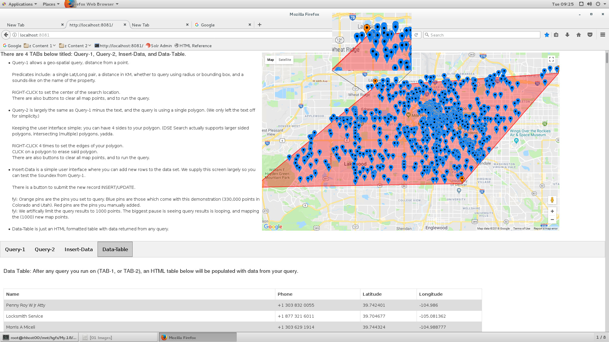

*Figure 16-1 Spatial versus geo-spatial*

Relative to Figure 16-1, the following is offered:

- This image is a screen shot from the sample (end user testing) Web program we will detail building in this document. In this image, we ran a geo-spatial polygon query against a set of 330,000 geo-points. The (polygon) is displayed in red, and the returned points in blue. (The corners of the polygon are in orange.)

- If you look closely, a small number of the returned points fall outside the polygon. Why ? Well, there could be several reasons-

DataStax Developer’s Notebook -- April 2018 V1.2

• DSE Search spatial queries are either spatial, or geo-spatial, as determined by the DSE Search field types you make use of, the subsequent DSE Search query parsers that are available, other. Geo-spatial queries use a spherical mathematical model, that is; points sit atop the Earth (or other sphere). Distance must be calculated relative to the curvature of the Earth. Spatial queries use a Cartesian, two-dimensional mathematical model, that is; points sit on a flat plane. Distance would be, for example, how far products are from one another on different sides of a brick and mortar warehouse.

> Note: DSE Search also uses spatial queries for time series analysis. Commonly the (x) coordinate axis value is start time, and the (y) coordinate axis value is the end time. Whether the unit of time is seconds, days, other, is determined by DSE Search index configuration and use.

So, points in Figure 16-1 might appear outside the polygon because we used a geo-spatial (3D) data set against a spatial (2D) polygon. Or- • A given relational database product might have B-Tree+ indexes, hash indexes, other. B-Tree+ indexes better handle volatile data, range predicates, and possibly sorting, (when compared to hash indexes). Hash indexes are much faster on equalities using the whole of the primary key. Relational databases face choices when using indexes. Spatial/geo-spatial analytics systems also face choices, which we title, spatial strategies - -- If it was more important that you query on distance from a point, it might be more efficient to write your spatial/geo-spatial analytics system using given algorithms. (Or using different DSE Search objects from the list of available objects.) -- If it was more important that your system be efficient when you query on intersection of boundaries of geometric shapes, and sort the results by distance from a reference point, you might use different algorithms. (Again, different objects from those available.)

DataStax Developer’s Notebook -- April 2018 V1.2

> Note: What is the relevance of this discussion as to whether the points returned by our query in Figure 16-1 fall inside the polygon or not ?

distErrPct, and distErr-

In short, one algorithm used to support geo-spatial queries could loosely be described as:

- Take the Earth, and divide it into 32 equal sized rectangles.

- Take each of the rectangles above, and divide those into 32 (further, sub) rectangles.

- After you iterate the above cycle 4 or more times, you have divided the Earth into distinct regions as accurate as 8-10 meters.

- By storing a unique string only 5 characters long, and an array of whatever items are located in this distinct (20 meter square region of the Earth), you can serve a lot of geo-spatial queries quickly and easily. Further, if you also index not only the 5 character string, but all substrings of the 5 character string, you have many highly performant choices. E.g., if a 5 character string that tells us that Boston/MA/USA equates to the string constant, DRY2Y, we should also index the sub-strings of DRY2Y, those being; D, DR, DRY, DRY2 (DRY2Y already being indexed). When we need to find all points within 100 miles of the point, DRY2Y, we need only look for the equality, DRY (or whatever the actual accuracy is). Cool, huh ? Highly performant too.

DataStax Developer’s Notebook -- April 2018 V1.2

> Note: The above is a high level, and slightly coarse description of the geohash algorithm described on Wikipedia at,

```text
https://en.wikipedia.org/wiki/Geohash
```

DSE Search spatial/geo-spatial uses geohash, or also quadtree. Quadtree is described on Wikipedia at,

```text
https://en.wikipedia.org/wiki/Quadtree
```

For now we state:

- DSE Search uses geohash for geodetic data only (geo-spatial only).

- DSE Search uses quadtree for either geo-spatial or spatial data, including temporal data (time series data).

> Note: DSE Search is built upon Apache Solr, a full integration with all pieces running in the same Java virtual machine. Apache Solr is built upon Apache Lucene.

The array of (geo-points) associated with the geohash key above ? It’s a Lucene TermsEnum; a ridiculously performant object allowing iterations, set operands (unions, intersections, other), other.

> Note: Remember the DSE Search filter titled, (left edge) n-gram filter ?

```text
https://lucene.apache.org/solr/guide/6_6/filter-descriptions.html
```

Now you know the use case for that filter: break a token like DRY2Y into further tokens, D, DR, DRY, DRY2.

By pre-indexing (indexing) each of the sub-elements of the token (DRY2Y), you allow for fast filtering of ranges.

- But we still haven’t answered the (why are some points returned by the query in Figure 16-1outside the polygon) question- It could be accuracy (distErrPct, distErr). In short, you define the (maximum) level of accuracy you wish to support at the DSE Search field type level, and can override the requested accuracy (request lesser accuracy) at the DSE Search query level. Why wouldn’t you always configure for absolute (zero distErr) accuracy ? On at least spatial queries (time series, other), you can.

DataStax Developer’s Notebook -- April 2018 V1.2

On geo-spatial queries, there can be minute errors in calculations related to the curvature of the Earth (plus the Earth is not perfectly spherical). But the final answer is cost; disk, processing (CPU), memory, other. It is easier (less costly) to determine if a point is inside one of four regions of the Earth (accuracy 20,000 miles), than it is to determine if a point is within one of 700,000,000 regions of the Earth (a 10 foot accuracy, or whatever the math is).

- And lastly from Figure 16-1; why some of the returned query points fall outside the polygon could be that we flattened the map image of the Earth from 3D, to a 2D computer screen.

A primer and brief history of (spatial, geo-spatial) At a coarse level, Apache Lucene could be described as a set of libraries used to deliver text and spatial/geo-spatial analytics, other. Wikipedia details Apache Lucene at,

```text
https://en.wikipedia.org/wiki/Apache_Lucene
```

Also at a coarse level, it could be stated the Apache Solr exists as a server to ease the adoption of Lucene. (Not just libraries, Solr boots and serves basic CRUD (create/insert, read, update, delete) requests including text and spatial analytics.) Wikipedia details Apache Solr at,

```text
https://en.wikipedia.org/wiki/Apache_Solr
```

> Note: DSE/DSE-Search release 6.0 embeds/integrates Apache Solr version 6.x.

But why are you well served to know the release history of Apache Solr ?

Documentation.

As you Google looking for DSE Search (Apache Solr) examples and solutions, some of the results will come from DataStax (on line documentation, and blogs, other), but many more by volume, will come from third party sources; some vetted, some not, some current, some old. Some of the results will involve Apache Solr objects that have been deprecated, or in extreme cases, solutions that no longer work.

Our favorite Apache Solr book is displayed in Figure 16-2 and available on Amazon.com at,

```text
https://www.amazon.com/Apache-Search-Patterns-Jayant-Kumar/dp/178398
1849
```

DataStax Developer’s Notebook -- April 2018 V1.2

This book details some of the Apache Solr file storage details, tunables, other, and includes a good introductory treatment on spatial analytics.

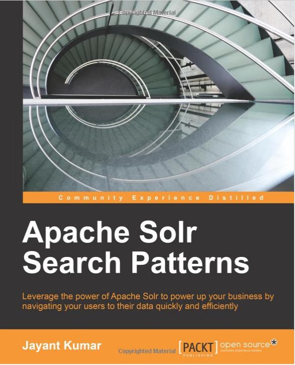

*Figure 16-2 Our favorite Apache Solr book, 2015*

And a really, really good video and slide deck from David Smiley at MITRE on Apache Solr spatial/geo-spatial is available at,

```text
https://www.youtube.com/watch?v=L2cUGv0Rebs
https://www.slideshare.net/lucenerevolution/lucene-solr-4-spatial-ex
tended-deep-dive
```

We consider the above video and slide deck to be a must read/watch on the topic of spatial/geo-spatial, and this document uses a number of the images and statements from same. Both are from 2013, and some facts are now wrong/different, but still a good primer.

Random points related to the history of Apache Solr, and as derived from the presentation above:

- The seminal (DSE Search, Apache Solr) spatial/geo-spatial use case is- • Index a latitude/longitude pair.

DataStax Developer’s Notebook -- April 2018 V1.2

• Search for rows within a point-radius (circle), or bounding box. (Its is measurably more efficient to look for a point within a box, versus a circle, should your use case allow this.) • Sort results by distance from said point.

- Numerous, numerous open source projects and package names have filed through the history of Apache Solr; some have been deprecated, some exist as options to other names/choices, other. In short, you could give focus to just Apache Solr version 3, version 4, and also post release 4. (There are Apache Solr versions 6 and 7, but most of the object/package names you will encounter come from release 3 or 4.) Further, you will see the terms: • Spatial4j- Is largely just geometric shapes. There is a lot of program code necessary to define and make use of circles, polygons, other; given a set of points, calculate whether one shape intersects/other another shape. Imagine writing the code to determine the distance between a circle and a rectangle- There is a lot of complexity to that problem. And, you assumed writing the solution to that problem on a 2D coordinate plane; try writing it for a spherical model. Spatial4j includes support for geodetic/sphere and Cartesian (2D) shapes.

> Note: For a long period of time, the amount of program code for Spatial4j was measurably larger than the whole of Apache Lucene spatial.

Folks will state that perhaps a better name to Spatial4j would be, Shape4j.

DataStax Developer’s Notebook -- April 2018 V1.2

> Note: Additionally, for geo-spatial-

You have to calculate the above for shapes that cross the Earth’s international date line. Some points in the nation of Fiji would appear from their coordinates points to be very far apart (Fiji itself crosses the international dateline), when actually these points are nearly adjacent.

And then there are the Earth’s poles- At the Earth’s poles, a rectangle may be defined where all four of the rectangle’s points are contained within a circle, but the rectangles sides may extend outside the circle.

• Spatial/geo-spatial query predicates may include- -- INTERSECTS, do two shapes overlap -- DISJOINT, do two shapes not overlap -- WITHIN, CONTAINS, are different because of object reference, but similar; is one item wholly located within another-

> Note: Some spatial systems also contain predicates titled, equals (do two objects fully and equally overlay one another), and/or touches .

Apache Solr, and thus, DSE Search, do not support these predicates.

• Shape types generally include- -- Point -- Line, LineString, (BufferedLineString) a common use case being vehicle path, vehicle tracking -- Rectangle -- Circle -- (Other) -- Polygons

DataStax Developer’s Notebook -- April 2018 V1.2

> Note: In versions 6.0 and earlier of DSE Search / Apache Solr, use of polygons requires the installation of the Apache JTS (Java Topology Suite).

JTS is detailed on Wikipedia at,

```text
https://en.wikipedia.org/wiki/JTS_Topology_Suite
```

You can download the Java Jar (which is how JTS arrives) from,

```text
http://central.maven.org/maven2/com/vividsolutions/jts/1.13/
```

DSE Search 6.0 supports JTS version 1.13. To install JTS, copy the Java Jar file to,

```text
/opt/dse/node1/resources/solr/lib
```

when DSE is installed in,

```text
/opt/dse/node1
```

A rolling restart would allow DSE to see and make use of JTS.

• Well Known Text (WTK), and Well Known (text) Binary (WTB)- Again, we reference Wikipedia which has an article on the topic of WTK available at,

```text
https://en.wikipedia.org/wiki/Well-known_text
```

WTB is the standard for the binary representation of WTK data. This is useful because WTB data can be stored inside a DSE Search docValues index. More on the docValues subtopic below.

- And finally, Apache Solr version 3/3.1- Solr 3/3.1 arrived circa 2011, and was the first version to have built in spatial support. (Prior to this release, spatial was always an extension/plugin to Solr.) Solr 3.x was dominated by: • FieldType- -- LatLonType, geodetic, deprecated -- PointType, Cartesian • Query parsers- -- geofilt, distance from a point (using a circle) Mandatory parameters; point p, sfield, and d (distance)

DataStax Developer’s Notebook -- April 2018 V1.2

-- bbox, similar to geofilt above, but using a box (for efficiency) • The distance function titled, geodist, used directly in sorting results.

> Note: So this is why we are in this section, documentation-

Most of your first Google results will detail LatLonType, and sorting using the derived value from, geodist.

With Solr version 4.x and later, you are encouraged to not use LatLonType, and to sort via a slightly different means. Some documentation states that geodist went away, and that documentation was correct for a period of time, but is incorrect in present day versions of the software. (geodist is one/common current day means to sort by distance.)

Using current documentation, not only will you not be using deprecated objects, but your routines will be measurably more performant.

- Apache Solr version 4.x arrived circa 2012- By the time version 4.x arrives, most of the (core objects) are in place. (Even though there are Solr releases 6.x and 7.x, most or all of the documentation and objects from version 4.x are current.) The spatial strategies offered with version 4.x and higher of Solr include: • PointVectorStrategy -- Similar to PointType and LatLonType from version 3.x of Solr. The field types to use, however, are titled, LatLonPointSpatialField, BBoxField, or SpatialRecursivePrefixTreeFieldType. (A mouthful, abbreviated, or commonly referred to as, RPT.) -- X and Y Trie fields, 2 doubles. -- Points only -- No multiValued fields -- Query by circle and rectangle only (circle, or bounding box for performance) --Intersects or Within predicates only -- Based on version, distance sort uses FieldCache. More on this subtopic below.

DataStax Developer’s Notebook -- April 2018 V1.2

> Note: The high level procedure to implement you will use here is: – You will create a type text or similar column in your DSE table, which is where you will store your coordinate pair. The data is commonly entered as, “40.012, -44.41”, for example. – You will define a DSE Search index field type of type, SpatialRecursivePrefixTreeFieldType (RPT). – You will define a DSE Search index field type of type, TrieDoubleField. – And you will add a DSE Search index dynamicField, that references the double above.

When you insert/update/delete data from the DSE table proper, the DSE Search index runtime will automatically tokenize the text column value, and place it in the two double fields, and spatial index appropriately.

The above is really quite similar to how text analytics is indexed/configured. The only real difference is the presence/automatic-use of the dynamicField.

Many of the specifics (are you using geohash or quadtree indexing), are determined by field type modifiers and field modifiers, just like text .

• BBoxStrategy -- 4 Doubles and 1 boolean (the boolean is for world/dateline wrap) -- Rectangles only -- No multiValued fields -- All predicates; Intersects, Within, Contains, .. -- Distance sort from; box center, area overlap, percentage of overlap, other. Uses FieldCache for sorting. • JtsGeoStrategy -- Requires JTS -- JTS geometry using Lucene 4 docValues (highly performant) -- No sorting -- Query by any shape -- Yes, multiValued -- All predicates; Intersects, Within, Contains, .. -- Version 4.x was considered a “work in progress”

DataStax Developer’s Notebook -- April 2018 V1.2

• RecursivePrefixTreeStrategy (RPT) (and TermQueryPrefixTreeStrategy) -- Geohash or quadtree -- (Break the world down into grids; sorted strings, big to smaller grids) -- Index all shapes -- All shapes approximated (not meter level precision) -- All predicates -- New in Lucene 4.3

RecursivePrefixTree (RPT) As a term, RecursivePrefixTree (RPT) might sound scary or dangerously complex, It is not.

RPT is centered on a recursive descent algorithm . We detailed a recursive descent algorithm above, when we discussed geohash (Boston, DRY2Y). In fact, RPT in DSE Search / Apache Solr is delivered using geohash or quadtree.

Figure 16-2 displays a geohash of the northwest coast of France, a recursive descent algorithm. (Source: David Smiley, MITRE.)

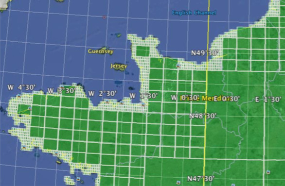

*Figure 16-3 Geohashing the NW coast of France, a recursive descent algorithm*

DataStax Developer’s Notebook -- April 2018 V1.2

DSE Search geo-spatial source code Example 16-1 below displays the DSE Search / Solr 3 version of column types and sorting that should not be employed. A code review follows.

### Example 16-1 Solr 3 syntax, do not use

```text
DROP KEYSPACE IF EXISTS ks_16;
```

```text
CREATE KEYSPACE ks_16 WITH REPLICATION = {'class': 'SimpleStrategy',
'replication_factor': 1};
```

```text
DROP TABLE IF EXISTS ks_16.my_mapData;
```

```text
CREATE TABLE ks_16.my_mapData
(
md_pk TEXT,
md_latLng TEXT,
PRIMARY KEY (md_pk)
);
```

```text
INSERT INTO ks_16.my_mapData (md_pk, md_latLng) VALUES ('1', '10,10');
INSERT INTO ks_16.my_mapData (md_pk, md_latLng) VALUES ('2', '11,11');
INSERT INTO ks_16.my_mapData (md_pk, md_latLng) VALUES ('3', '12,12');
INSERT INTO ks_16.my_mapData (md_pk, md_latLng) VALUES ('4', '13,13');
```

```text
CREATE SEARCH INDEX ON ks_16.my_mapData WITH COLUMNS md_pk, * {excluded : true
} ;
ALTER SEARCH INDEX SCHEMA ON ks_16.my_mapData ADD
types.fieldType[@name='ft_latlng',@class='solr.LatLonType',
@subFieldSuffix='_coord'];
```

```text
ALTER SEARCH INDEX SCHEMA ON ks_16.my_mapData ADD
types.fieldType[@name='ft_double',@class='solr.TrieDoubleField'];
```

```text
ALTER SEARCH INDEX SCHEMA ON ks_16.my_mapData ADD dynamicField[@name='*_coord',
@type='ft_double', @indexed='true', @stored='false'];
```

```text
ALTER SEARCH INDEX SCHEMA ON ks_16.my_mapData ADD
fields.field[@name='md_latlng', @type='ft_latlng', @indexed='true',
@multiValued='false', @stored='true'];
```

```text
RELOAD SEARCH INDEX ON ks_16.my_mapData;
REBUILD SEARCH INDEX ON ks_16.my_mapData;
//
COMMIT SEARCH INDEX ON ks_16.my_mapData;
```

```text
SELECT count(*) FROM ks_16.my_mapData WHERE solr_query = '{ "q" : "*:*"}';
```

DataStax Developer’s Notebook -- April 2018 V1.2

Relative to Example 16-1, the following is offered:

- A Linux Tar ball is available for download at the same location as this document. In addition to application program code to a single page Web application, this Tar ball contains two datasets available to load: • 330,000 geo-points in the USA states of Colorado and Utah. Basically these are businesses across the two states, and this data is about 10 years old. (Some businesses you will see, no longer exist.) • 6,000 Starbucks locations across the USA. In 2017, Starbucks had 17,000 locations across the USA, so again, this data set is a bit old.

- But, the code fragment above uses a two column subset of the larger/wider DSE table contained in the Tar ball, and we manually insert four rows.

> Note: This discussion assumes you are familiar with terms and concepts presented in the prior month’s edition of this document, where we presented a primer on DSE Search.

- The first statement of real interest is the ALTER SEARCH INDEX statement- Here we add a field type of type, solr.LatLonType. This is the field type deprecated with Solr version 4. As part of the field type being, LatLonType, the DSE Search index runtime expects to tokenize a text column value into two double values. As such, we supply the wildcard name of a, subFieldSuffix. These doubles are placed in dynamicField field types defined below.

- Then we define the double field type; the second ALTER SEARCH INDEX statement.

- The third ALTER SEARCH INDEX statement defines the destination field type of the double values that will come from our DSE table text column.

- And finally, the fourth ALTER SEARCH INDEX statement adds this field to the DSE Search index.

- RELOAD, REBUILD, and run a test SELECT.

The following SQL/CQL SELECT statements are offered in Example 16-2. A code review follows.

DataStax Developer’s Notebook -- April 2018 V1.2

### Example 16-2 Using the Solr 3 spatial index

```text
//
// BV: 38.86,-106.21
//
// geofilt, circle
//
SELECT * FROM ks_16.my_mapData WHERE solr_query = '{ "q" : "*:*", "fq" :
"{!geofilt pt=38.86,-106.21 sfield=md_latlng d=10}" }';
SELECT * FROM ks_16.my_mapData WHERE solr_query = '{ "q" : "*:*", "fq" :
"{!geofilt pt=38.86,-106.21 sfield=md_latlng d=1}" }';
SELECT count(*) FROM ks_16.my_mapData WHERE solr_query = '{ "q" : "*:*", "fq" :
"{!geofilt pt=38.86,-106.21 sfield=md_latlng d=.1}" }';
//
// geofilt, bbox
//
SELECT * FROM ks_16.my_mapData WHERE solr_query = '{ "q" : "*:*", "fq" :
"{!bbox pt=38.86,-106.21 sfield=md_latlng d=10}" }';
SELECT * FROM ks_16.my_mapData WHERE solr_query = '{ "q" : "*:*", "fq" :
"{!bbox pt=38.86,-106.21 sfield=md_latlng d=1}" }';
//
// rectangle
//
SELECT * FROM ks_16.my_mapData WHERE solr_query = '{ "q" : "*:*", "fq" :
"md_latlng:[38,-107 TO 39,-106]" }';
//
// and with sort using geodist
//
SELECT * FROM ks_16.my_mapData WHERE solr_query = '{"q":"*:*", "fq": "{!geofilt
sfield=md_latlng pt=38.86,-106.21 d=30}",
"sort":"geodist(md_latlng,38.86,-106.21) asc"}';
SELECT * FROM ks_16.my_mapData WHERE solr_query = '{"q":"*:*", "fq": "{!geofilt
sfield=md_latlng pt=38.86,-106.21 d=30}",
"sort":"geodist(md_latlng,38.86,-106.21) desc"}';
```

Relative to Example 16-2, the following is offered:

- Recall, this example uses solr.LatLonType, which has been deprecated, and the geodist() function, has slightly different syntax. So, don’t use this code. We offer this code as an example of what you may see when Googling, that is old.

- And this is where this and the following examples will deviate a bit. The sample data that comes with the Tar ball has 330,000 geo-points in the USA states or Colorado and Utah. The 4 samples lines of data are for points (10,10), (11,11), etcetera.

DataStax Developer’s Notebook -- April 2018 V1.2

So, to see results from the code in Example 16-2 and beyond, you must either load the sample data from the Tar ball, or edit the latitude/longitude pairs that follow.

- The first three SQL/CQL SELECTs query a given distance from a point. As a result of the geodist predicate, the distance is calculated using a circle. Distance unit of measurement may be in radians, degrees, or kilometers based on the objects you use, and the settings you enforce. In this case, the default distance unit of measurement is kilometers. Whether you use spatial or geo-spatial, effects what units of measurement may be available for choosing. The only difference in the first three SELECTs is the distance requested.

- The next two SQL/CQL SELECTs do not use geofilt, and instead use bbox; otherwise these two groups of SELECTs are the same. Where geofilt returns a circle, bbox returns a square (an equal sided rectangle). Using bbox is more efficient, as there is much less math and calculations to perform when producing the query result set.

- The next SQL/CQL SELECT displays querying a rectangle.

- And the last group of SQL/CQL SELECTS displays how to sort results using geodist. Again, geodist syntax changes slightly after Solr 3.

Preferred syntax for point and distance, without polygon As stated relative to Example 16-2, there is some code above that gets deprecated after Sol version 3. This example, Example 16-3, shows Solr version 4, and current syntax. A code review follows.

### Example 16-3 Solr 4 syntax, the correct code to use

```text
DROP SEARCH INDEX ON ks_16.my_mapData;
```

```text
CREATE SEARCH INDEX ON ks_16.my_mapData WITH COLUMNS md_pk, * {excluded : true
} ;
```

```text
ALTER SEARCH INDEX SCHEMA ON ks_16.my_mapData ADD
types.fieldType[@name='ft_latlng',@class='solr.SpatialRecursivePrefixTreeFieldT
ype', @distErrPct='0.025', @maxDistErr='0.000009', @units='degrees'];
```

```text
ALTER SEARCH INDEX SCHEMA ON ks_16.my_mapData ADD
types.fieldType[@name='ft_double',@class='solr.TrieDoubleField'];
```

```text
ALTER SEARCH INDEX SCHEMA ON ks_16.my_mapData ADD dynamicField[@name='*_coord',
@type='ft_double', @indexed='true', @stored='false'];
```

DataStax Developer’s Notebook -- April 2018 V1.2

```text
ALTER SEARCH INDEX SCHEMA ON ks_16.my_mapData ADD
fields.field[@name='md_latlng', @type='ft_latlng', @indexed='true',
@multiValued='false', @stored='true', @docValues='true'];
```

```text
RELOAD SEARCH INDEX ON ks_16.my_mapData;
REBUILD SEARCH INDEX ON ks_16.my_mapData;
COMMIT SEARCH INDEX ON ks_16.my_mapData;
```

```text
//
// Partial SELECT group from above will work
//
SELECT * FROM ks_16.my_mapData WHERE solr_query = '{ "q" : "*:*", "fq" :
"{!geofilt pt=39.73,-105.002 sfield=md_latlng d=10}" }';
SELECT count(*) FROM ks_16.my_mapData WHERE solr_query = '{ "q" : "*:*", "fq" :
"{!geofilt pt=39.73,-105.002 sfield=md_latlng d=10}" }';
SELECT * FROM ks_16.my_mapData WHERE solr_query = '{ "q" : "*:*", "fq" :
"{!bbox pt=39.73,-105.002 sfield=md_latlng d=10}" }';
SELECT * FROM ks_16.my_mapData WHERE solr_query = '{ "q" : "*:*", "fq" :
"{!bbox pt=39.73,-105.002 sfield=md_latlng d=1}" }';
SELECT * FROM ks_16.my_mapData WHERE solr_query = '{ "q" : "*:*", "fq" :
"md_latlng:[39,-106 TO 40,-104]" }';
//
// How to sort now ..
//
SELECT * FROM ks_16.my_mapData WHERE solr_query = '{"q":"*:*", "fq": "{!geofilt
sfield=md_latlng pt=39.73,-105.002 d=30 score=distance}&sort=score asc"}';
SELECT * FROM ks_16.my_mapData WHERE solr_query = '{"q":"*:*", "fq": "{!geofilt
sfield=md_latlng pt=39.73,-105.002 d=30 score=distance}&sort=score desc"}';
```

Relative to Example 16-3, the following is offered:

- The block of code in Example 16-3 uses the preferred, solr.SpatialRecursivePrefixTreeFieldType. Otherwise this example is the same as Example 16-1 and Example 16-2.

- The last two SQL/CQL SELECTs display one replacement of geodist(), namely; score and sort.

- As configured, Example 16-3, does not require JTS, and does not support polygon queries. Example 16-4 below takes us into polygons. A code review follows.

### Example 16-4 JTS, and polygons

```text
DROP SEARCH INDEX ON ks_16.my_mapData;
```

DataStax Developer’s Notebook -- April 2018 V1.2

```text
CREATE SEARCH INDEX ON ks_16.my_mapData WITH COLUMNS md_pk, * {excluded : true
} ;
```

```text
ALTER SEARCH INDEX SCHEMA ON ks_16.my_mapData ADD
types.fieldType[@name='ft_latlng',@class='solr.SpatialRecursivePrefixTreeFieldT
ype',
@spatialContextFactory='org.locationtech.spatial4j.context.jts.JtsSpatialContex
tFactory', @autoIndex='true', @validationRule='repairBuffer0',
@distErrPct='0.025', @maxDistErr='0.001', @distanceUnits='kilometers'];
```

```text
ALTER SEARCH INDEX SCHEMA ON ks_16.my_mapData ADD
types.fieldType[@name='ft_double',@class='solr.TrieDoubleField'];
```

```text
ALTER SEARCH INDEX SCHEMA ON ks_16.my_mapData ADD dynamicField[@name='*_coord',
@type='ft_double', @indexed='true', @stored='false'];
```

```text
ALTER SEARCH INDEX SCHEMA ON ks_16.my_mapData ADD
fields.field[@name='md_latlng', @type='ft_latlng', @indexed='true',
@multiValued='false', @stored='true', @docValues='true'];
```

```text
RELOAD SEARCH INDEX ON ks_16.my_mapData;
REBUILD SEARCH INDEX ON ks_16.my_mapData;
```

```text
//
// Partial SELECT group from above will work
//
SELECT * FROM ks_16.my_mapData WHERE solr_query = '{ "q" : "*:*", "fq" :
"{!geofilt pt=39.73,-105.002 sfield=md_latlng d=10}" }';
SELECT count(*) FROM ks_16.my_mapData WHERE solr_query = '{ "q" : "*:*", "fq" :
"{!geofilt pt=39.73,-105.002 sfield=md_latlng d=10}" }';
SELECT * FROM ks_16.my_mapData WHERE solr_query = '{ "q" : "*:*", "fq" :
"{!bbox pt=39.73,-105.002 sfield=md_latlng d=10}" }';
SELECT * FROM ks_16.my_mapData WHERE solr_query = '{ "q" : "*:*", "fq" :
"{!bbox pt=39.73,-105.002 sfield=md_latlng d=1}" }';
SELECT * FROM ks_16.my_mapData WHERE solr_query = '{ "q" : "*:*", "fq" :
"md_latlng:[39,-106 TO 40,-104]" }';
```

```text
//
// And these work
//
SELECT * FROM ks_16.my_mapData WHERE solr_query = '{ "q" : "*:*", "fq" :
"{!field f=md_latlng}Intersects(POLYGON((-107 39, -107 30, -100 30, -100 39,
-107 39)))" }';
```

DataStax Developer’s Notebook -- April 2018 V1.2

```text
SELECT * FROM ks_16.my_mapdata WHERE solr_query = '{ "q" : "*:*", "fq" :
"{!field f=md_latlng}Intersects(POLYGON((-107 39, -107 30, -100 30, -100 39,
-107 39)))" }' LIMIT 1;
```

Relative to Example 16-4, the following is offered:

- This example requires that JTS be loaded, a topic we covered above.

- We have the typical 4 ALTER SEARCH INDEX statements; differing slightly only for the new field type titled, SpatialRecursivePrefixTreeFieldType (RPT, for short). Note the spatialContextFactory, which allows JTS and polygons. The remainder of this block is unchanged.

- The standard SQL/CQL SELECTs we have been using work.

- The last block of SELECTs display polygon and Intersects. Intersects is accompanied by WITHIN, CONTAINS, other.

> Note: That the order of the latitude and longitude values are reversed inside a polygon definition.

And why is the polygon value set inside double parenthesis ? Technically, a polygon can have a hole in its center (like a doughnut). This hole can be specified in the outer parenthesis set. We did not test this feature, and it’s use is grossly uncommon.

> Note: The demonstration program we provide below allows you to draw polygons, and we do not check the accuracy of the polygon you draw. (Too much client side code for a demonstration program.)

In the demonstration program you can draw a polygon whose sides intersect (imagine two triangles atop one another). Technically, this is not a valid polygon; a polygon's sides may not intersect.

What does DSE Search / Apache Solr do upon receiving this type of invalid polygon ?

It returns points for the first (intersecting triangle) only. We don’t know that we would come to depend on that behavior.

DataStax Developer’s Notebook -- April 2018 V1.2

Another mention of docValues The earliest releases of Apache Solr spatial/geo-spatial could not sort results. Further releases of Solr would return results using filterCache (memory resident) and a sort package; programming code being executed inside the Apache Lucene libraries. This capability is still present.

In the very latest releases of Solr, data can be presorted using docValues. (docValues are written at time of data input: INSERT/UPDATE/DELETE.)

Keep in mind though; not every field type, or combination of field and field type modifiers supports sorting, especially when using polygons.

And please avoid screen barf- Around Figure 16-1 above, we state that the sample end user testing program we create (and supply in the Linux Tar ball) limits the number of points returned to

1000. We allow 1000 points, because this program is expected to be used for end user testing only.

We are always surprised when the application requirements specify a result set returned to the end user of 40 or more records, or that we page over 100s of records. Generally we expect this is the result of a historical end user experience (and thus, a set of historically not-great end user expectations); that the end user is not allowed, or not able to request a more specific/targeted query.

Is it really productive to have or allow the end user to sift over dozens or records ?

Please use aggregates (when using DSE Search: use facets), and engineer for better, more targeted end user queries.

And if you have to display so many map points, please use heat maps or similar user interface objects. Example as displayed in the bottom half of Figure 16-4; each heat zone then would allow access to a drill down style query.

DataStax Developer’s Notebook -- April 2018 V1.2

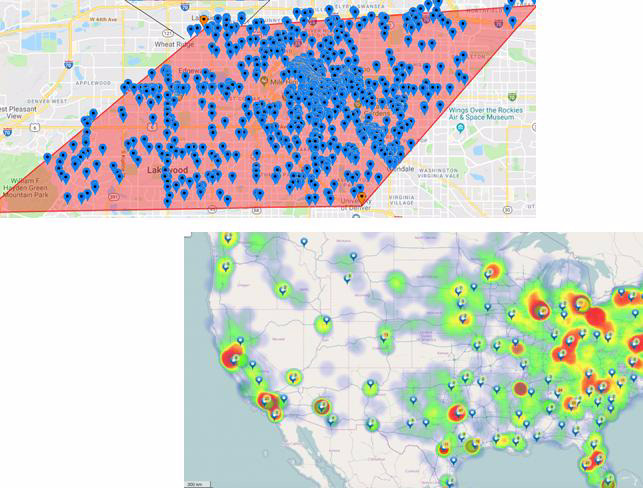

*Figure 16-4 Avoiding “screen barf”.*

## 16.2 Complete the following

At this point in this document we have completed an overview, including code, of DSE Search spatial/geo-spatial.

At the same download location as this document (

```text
http://tinyurl.com/ddn3000
```

), there is a Linux Tarball file with sample data, and program code to run all of a sample Web application; the Web application first displayed above in Figure 16-1.

Random comments:

- Pre-requisites/assumptions- Before you may successfully run the demonstration program below, the following is expected to be in place. (These steps/assumptions were tested on CentOS Linux version 7.) • That a local DataStax Enterprise (DSE) is operating on localhost.

DataStax Developer’s Notebook -- April 2018 V1.2

The October/2017 edition of this document details how to install and operate DSE in such a manner. • The DSE instance should be booted with support for DSE Search. E.g., boot with the -s command line parameter. • The sample Web program uses the Python packages titled; flask, and dse-driver. Install each as such,

```text
pip install flask
pip install dse-driver
```

• That the Java Topology Suite (JTS) Jar file is installed as detailed above.

- Figure 16-5 displays a directory listing of the parent of the Linux Tarball, wherever you extract these files. A code review follows.


*Figure 16-5 Directory listing of parent, extra files present*

Relative to Figure 16-5, the following is offered: • This is a parent directory listing of the contents of the Linux Tarball, wherever you extract these files.

DataStax Developer’s Notebook -- April 2018 V1.2

There are extra files displayed in the image that are not included in the Tarball. Any files you find missing from the Tarball were of no consequence. • The files titled, 23* and 24*, are data files loaded by the file titled, 33*. The 23* file is geojson formatted, although we had to load it from JSON to get decent results. This file contains 330,000 geo-points from the USA states of Colorado and Utah. The Web demonstration program opens on a small town in Colorado. Perhaps a nice vacation spot ? The 24* file was labeled CSV (comma separated values), but the formatting of that file is messy. Regardless; the next file (33*) loads both input data files discussed here. • The file titled, 33* should be run via,

```text
clear ; python 33*
```

Upon success, you should see output similar to that as shown in Figure 16-6 and Figure 16-7. A code review follows.

DataStax Developer’s Notebook -- April 2018 V1.2

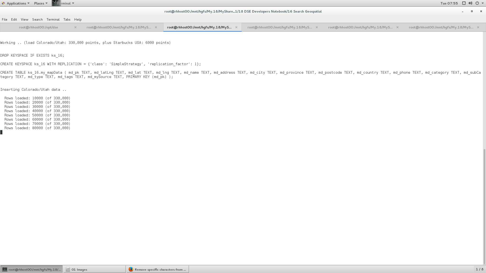

*Figure 16-6 Running the custom data loader, part 1*

DataStax Developer’s Notebook -- April 2018 V1.2


*Figure 16-7 Running the custom data loader, part 2*

Relative to Figure 16-6 and Figure 16-7, the following is offered: • This custom loader program creates a keyspace and table, and loads same. • Upon successful completion, your table is ready with 330,000+ rows of data. All of the data is 10 or so years old, and lists businesses in the USA states or Colorado and Utah, and 6000 Starbucks throughout the whole of the USA.

• The file titled, 34* should be run via,

```text
clear ; python 34*
```

Upon success, you should see output similar to that as shown in Figure 16-8, Figure 16-9, Figure 16-10 and Figure 16-11. A code review follows.

DataStax Developer’s Notebook -- April 2018 V1.2


*Figure 16-8 Indexing the data, part 1*

DataStax Developer’s Notebook -- April 2018 V1.2


*Figure 16-9 Indexing the data, part 2*

DataStax Developer’s Notebook -- April 2018 V1.2


*Figure 16-10 Indexing the data, part 3*

DataStax Developer’s Notebook -- April 2018 V1.2


*Figure 16-11 Indexing the data, part 4*

Relative to the four images above (Figure 16-8 through Figure 16-11), the following is offered: • The first index built is just on the primary key to this table,

```text
DROP SEARCH INDEX ON ks_16.my_mapData;
CREATE SEARCH INDEX ON ks_16.my_mapData WITH COLUMNS md_pk, *
{excluded : true } ;
```

On our laptop/virtual machine; 8 GB RAM, 2 virtual cores, 336,000 rows, the operation above took 126 seconds. • The second index built is the geo-spatial index,

```text
ALTER SEARCH INDEX SCHEMA ON ks_16.my_mapdata ADD
types.fieldType[@name='ft_latlng',
@class='solr.SpatialRecursivePrefixTreeFieldType',
@spatialContextFactory=
'org.locationtech.spatial4j.context.jts.JtsSpatialContextFacto
ry', @autoIndex='true', @validationRule='repairBuffer0',
```

DataStax Developer’s Notebook -- April 2018 V1.2

```text
@distErrPct='0.025', @maxDistErr='0.001',
@distanceUnits='kilometers'];
ALTER SEARCH INDEX SCHEMA ON ks_16.my_mapData ADD
types.fieldType[@name='ft_double',
@class='solr.TrieDoubleField'];
ALTER SEARCH INDEX SCHEMA ON ks_16.my_mapData ADD
dynamicField[@name='*_coord', @type='ft_double',
@indexed='true', @stored='false'];
ALTER SEARCH INDEX SCHEMA ON ks_16.my_mapdata ADD
fields.field[@name='md_latlng', @type='ft_latlng',
@indexed='true', @multiValued='false', @stored='true',
@docValues='true'];
RELOAD SEARCH INDEX ON ks_16.my_mapData;
REBUILD SEARCH INDEX ON ks_16.my_mapData;
COMMIT SEARCH INDEX ON ks_16.my_mapData;
```

On our laptop/virtual machine; 8 GB RAM, 2 virtual cores, 336,000 rows, the operation above took 151 seconds. • The third index built is to support wildcard lookups on the name of the establishment being queried,

```text
ALTER SEARCH INDEX SCHEMA ON ks_16.my_mapData ADD
types.fieldType[@name='TextField61', @class='solr.TextField']
with '{"analyzer":{"tokenizer":{"class":
"solr.StandardTokenizerFactory"},"filter":
{"class":"solr.BeiderMorseFilterFactory",
"nameType":"GENERIC", "ruleType":"APPROX", "concat":"true",
"languageSet":"auto"}}}';
ALTER SEARCH INDEX SCHEMA ON ks_16.my_mapData ADD
fields.field[@name='md_name', @type='TextField61',
@indexed='true', @multiValued='false', @stored='true'];
RELOAD SEARCH INDEX ON ks_16.my_mapData;
REBUILD SEARCH INDEX ON ks_16.my_mapData;
```

On our laptop/virtual machine; 8 GB RAM, 2 virtual cores, 336,000 rows, the operation above took 330 seconds.

Running the Web/demonstration program proper We’re now ready to run the final program, the Web application proper. This Web application uses the Google Maps API, and you will need a free developer key in order to do so.

DataStax Developer’s Notebook -- April 2018 V1.2

Comments:

- The Google Maps API is available in JavaScript, and other languages. For JavaScript, you can run the Google Maps API on the server side, or client side. We found better/quick/first examples for the client side, and we chose to run Google Maps there. For a real application (not a demo application), we’d likely work harder and work to run Google Maps server side. There seems to be a version 2 and then version 3 of Google Maps JavaScript for the client, and they seem pretty different; buyer beware. We chose to use version 3. If we were starting fresh, we’d likely use the Google Earth API, since the presentation and launch looks way cooler.

- To use the Google Maps API, you need a free developer key. Instructions to get this key and more are located here, • Documentation for GoogleMaps API is here,

```text
https://developers.google.com/maps/documentation/javascript/ex
amples/map-simple
```

• How to draw a polygon on a Google Map is here,

```text
https://developers.google.com/maps/documentation/javascript/ex
amples/polygon-simple
```

• Getting the necessary GoogleMaps API key is here,

```text
https://developers.google.com/maps/documentation/geocoding/get
-api-key
```

• Documentation on removing markers (map points) is here,

```text
https://developers.google.com/maps/documentation/javascript/ex
amples/marker-remove
```

Run the Web program via a,

```text
clear ; python 60*
```

Diagnostic information, including the DSE Search queries run, will appear in this window. The demonstration Web program is available at the following Url,

```text
localhost:8081
```

Web/demonstration program, overview, first steps Figure 16-12 displays the initial splash of our Web demonstration program. A code review follows.

DataStax Developer’s Notebook -- April 2018 V1.2

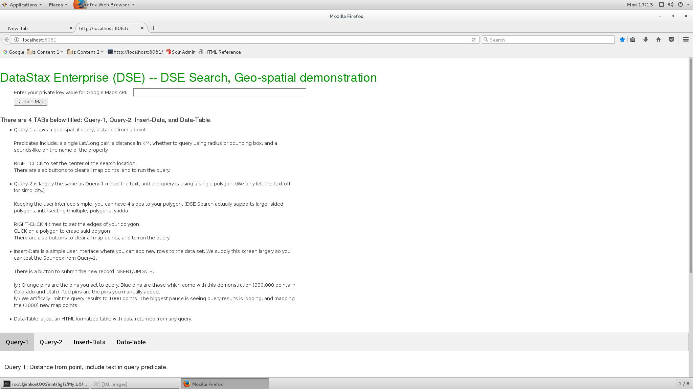

*Figure 16-12 Initial splash of Web program*

Relative to Figure 16-12, the following is offered:

- Paste your Google Maps API key in the text entry field titled, “Enter your private key value”. Then CLICK the button titled, “Launch Map”.

- The display should change to equal that as displayed in Figure 16-13. A code review follows.

DataStax Developer’s Notebook -- April 2018 V1.2

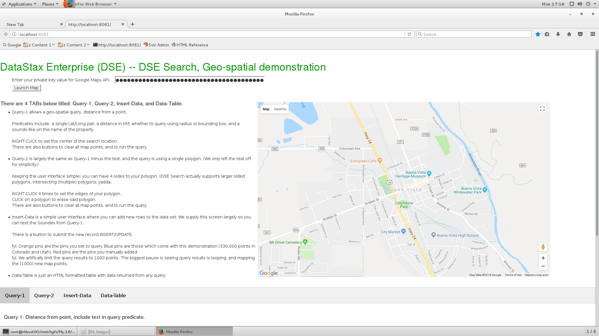

*Figure 16-13 Web program, after entering Google Maps API key*

Relative to Figure 16-13, the following is offered:

- If you don’t see the map as displayed above, most likely your Google Maps API key is bad. It’s likely you will have to terminate and relaunch the 60* file hosting the Web application; don’t know, didn’t test that.

- Again, 336,000 total map points sitting in the database; 330,000 in just Colorado and Utah, and 6000 Starbucks across the USA. Although this data is old, it was real at one point. The town we open up on in Colorado (Buena Vista, CO) used to have a Pizza Hut.

- This is a single page Web app, meaning; all of the HTML, CSS, and JavaScript is already loaded. The only future traffic between the client and the server will be data. The terminal window hosting the Web application will display all queries run, and query parameters sent to and from.

- The upper portion of the Web window remains present, displaying the map. Below (the grey menu bar), are four TABs. Comments:

DataStax Developer’s Notebook -- April 2018 V1.2

• TAB 1 is titled, Query-1, and supports the geo-spatial query with a sounds-like on business name. Displayed in Figure 16-14, a code review follows.

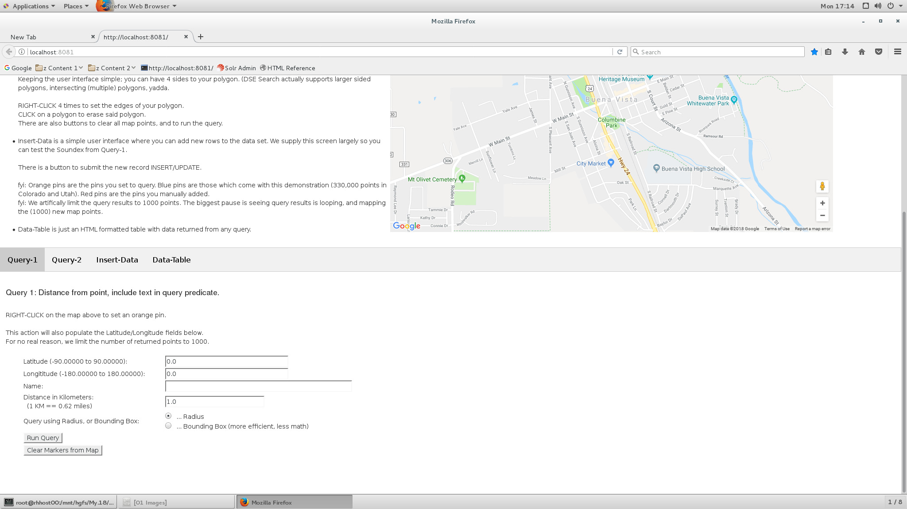

*Figure 16-14 TAB 1 of Web form*

Relative to Figure 16-14, the follow is offered: • The basic operation of this TAB is as follows- -- This is a Google Maps map; you can scroll, zoom, change to street view, whatever. -- RIGHT-CLICK anywhere on the map to set one orange pin. This action will set a latitude/longitude pair value in the two read-only text entry fields. -- CLICK the button titled, Run Query, to see returned results.

DataStax Developer’s Notebook -- April 2018 V1.2

> Note: Blue pins on the map are those that came from the 336,000 total geo-points loaded into the database.

Red pins are those new geo-points you enter on TAB 3 of this Web form.

Orange pins mark the corners of a polygon, or center point of a circle or bounding box.

-- CLICK the button titled, Clear Markers from Map.

-- Repeat using various forms of query- Enter a business name in the text entry field titled, Name, or not. -- The Radio Button titled, Radius/Bounding Box varies the query from geofilt to bbox, and back again.

> Note: As you run each query, return to the terminal window hosting this Web application and look at the diagnostic information that is output, including the DSE Search query syntax.

> Note: When you run a (circle/geofilt) query, or bounding box, you may notice that the points returned form a circle or square.

You may need to move to Denver/CO where there are a denser set of points to observe.

• TAB 2 is titled, Query-2, and is displayed in Figure 16-15. A code review follows.

DataStax Developer’s Notebook -- April 2018 V1.2

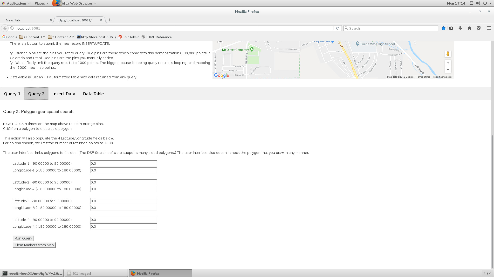

*Figure 16-15 TAB 2 of Web form*

Relative to Figure 16-15, the follow is offered: • Same basic operation as TAB 1, you should CLICK to clear the map, then RIGHT-CLICK 4 times on the map to set the corners of a polygon. Neither the Web application nor the server program check for the validity of your drawn polygon. Just saying. If you need/want more data, move the map to Denver/CO. • To clear any previously drawn polygons, CLICK on the polygon displayed in the map.

The DSE Search software supports more than 4 sided polygons. Our

> Note: Web interface does not support higher sided polygons for simplicity.

• TAB 3 is titled, Insert-Data, and is displayed in Figure 16-16. A code review follows.

DataStax Developer’s Notebook -- April 2018 V1.2

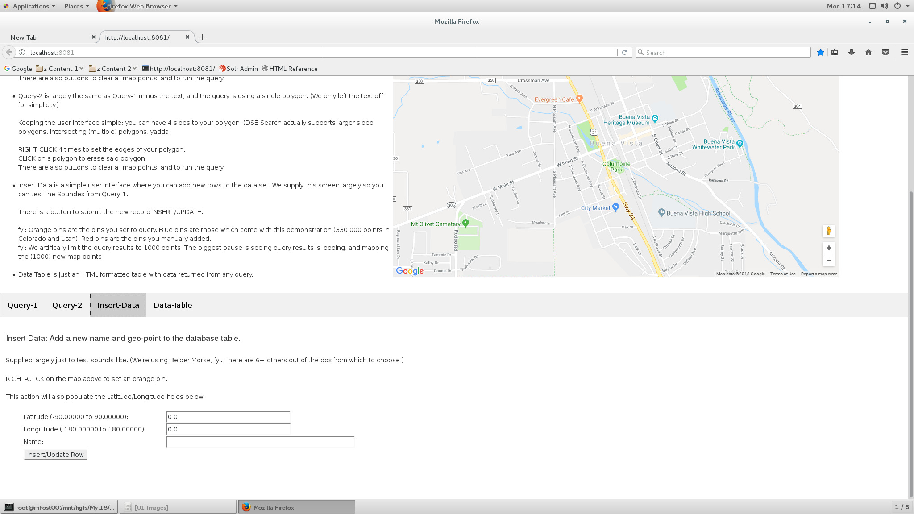

*Figure 16-16 TAB 3 of Web form*

Relative to Figure 16-16, the following is offered: • The purpose of this TAB is to allow you to easily add new points to the existing data set. Points plotted on the map from the existing data set are set with blue pins. The points you add and later return via query display as red pins. • The text query on TAB 1 is actually running sounds-like. Add a new business titled, Cranberries something, then query Kranbury and see if you find your newly added map point.

• TAB 4 is titled, Data-Table, and is displayed in Figure 16-17. A code review follows.

DataStax Developer’s Notebook -- April 2018 V1.2

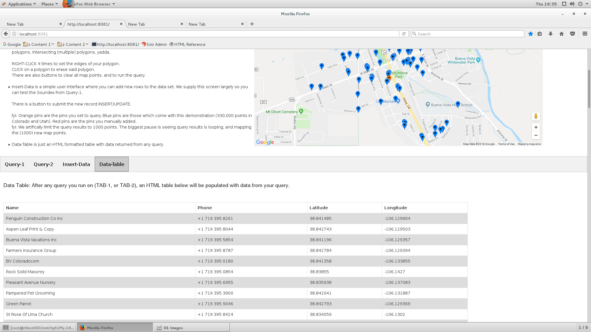

*Figure 16-17 TAB 4 of Web form*

Relative to Figure 16-17, the follow is offered: • This TAB displays a read-only HTML table of the data you have queried. • You can not click on the map while on this TAB.

You have all of the source code, or .. You have all of the source code to the queries in the file that runs the Web site, file 60*. Or, each query, as it is received by the Web server, is output to the terminal window running file 60*.

There is no DSE Search specific code in any of the HTML, CSS, or JavaScript source code files.

Sorry if you don’t like our source code; it is commented heavily, but is not production quality. We write (fat, and easy to understand) versus (tight, efficient, and bomb proof) source code.

DataStax Developer’s Notebook -- April 2018 V1.2

## 16.3 In this document, we reviewed or created:

This month and in this document we detailed the following:

- A good sized primer to DataStax Enterprise (DSE) spatial and geo-spatial analytics. We detailed DSE object hierarchy, history, use, operating conventions, configuration files, and more.

- We made a keyspace, table, inserted 336,000 data records, and selected data using geo-spatial predicated and sounds-like on text.

- And we had a little fun with Google Maps.

### Persons who help this month.

Kiyu Gabriel, Matt Atwater, Jim Hatcher, Caleb Rackliffe, Berenguer Blasi, Jason Rutherglen, Brad Vernon, Ryan Svihla, Nick Panahi, Sebastian Estevez, Matt Stump, Rich Rein, and Wei Deng.

### Additional resources:

Free DataStax Enterprise training courses,

```text
https://academy.datastax.com/courses/
```

Take any class, any time, for free. If you complete every class on DataStax Academy, you will actually have achieved a pretty good mastery of DataStax Enterprise, Apache Spark, Apache Solr, Apache TinkerPop, and even some programming.

This document is located here,

```text
https://github.com/farrell0/DataStax-Developers-Notebook
https://tinyurl.com/ddn3000
```
