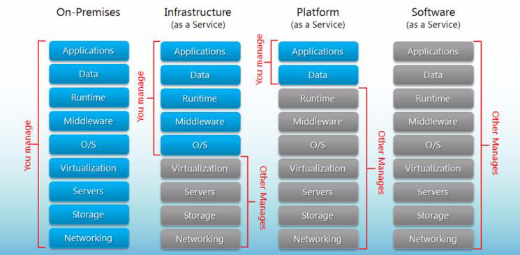
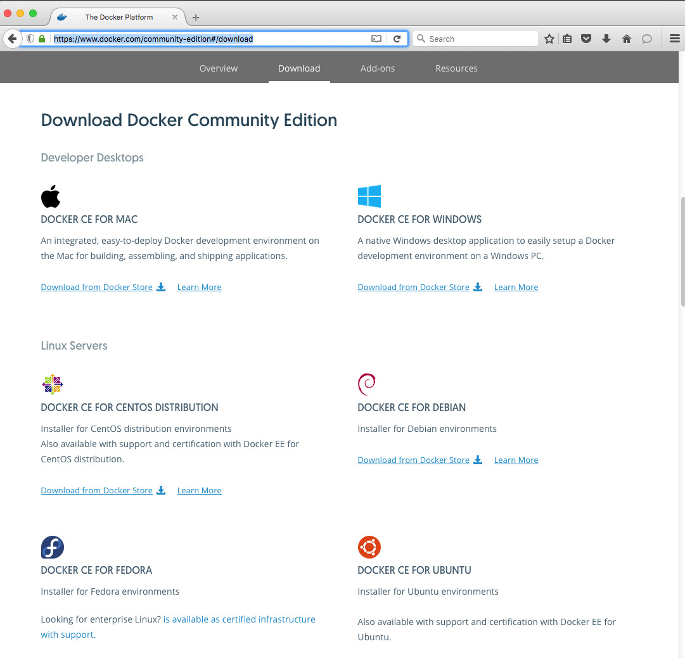
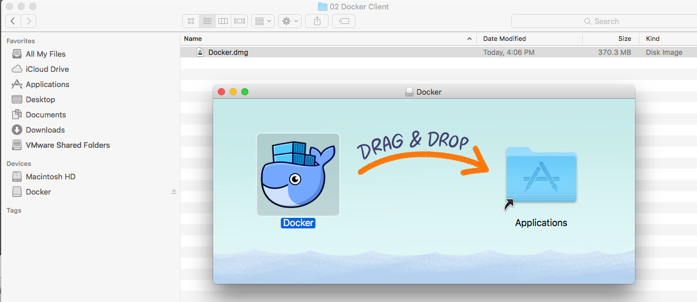
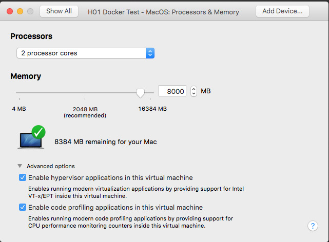
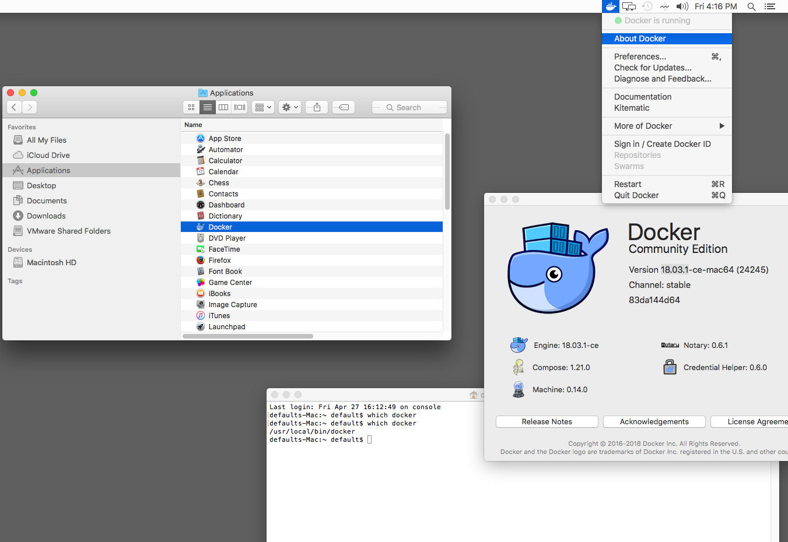
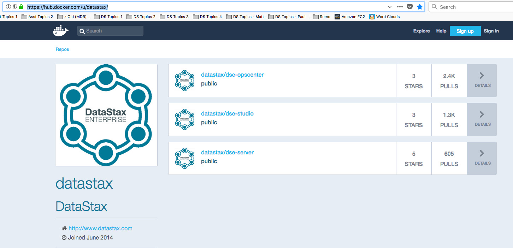
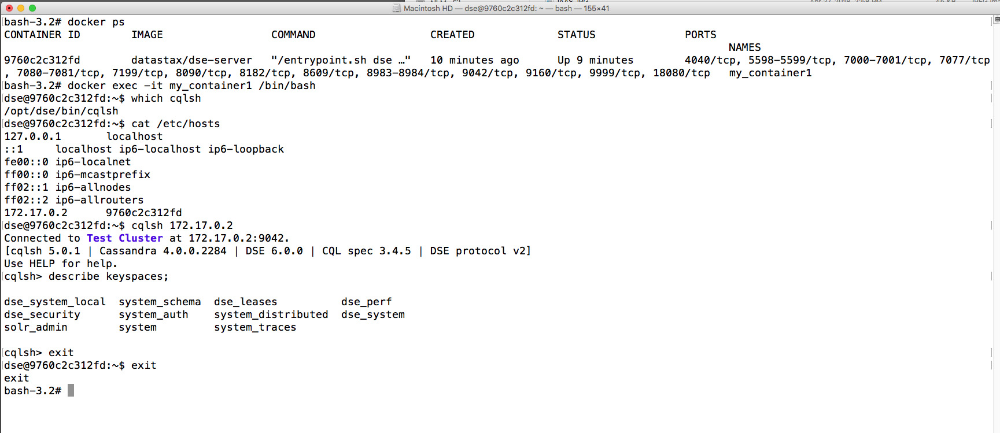
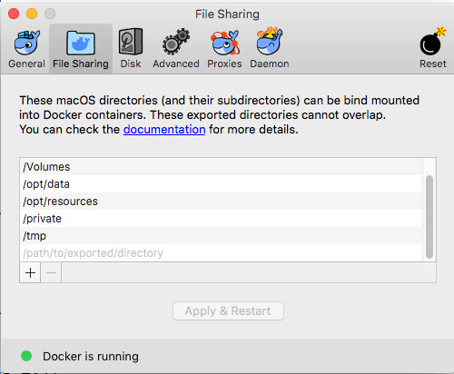

| **[Monthly Articles - 2022](../../README.md)** | **[Monthly Articles - 2021](../../2021/README.md)** | **[Monthly Articles - 2020](../../2020/README.md)** | **[Monthly Articles - 2019](../../2019/README.md)** | **[Monthly Articles - 2018](../../2018/README.md)** | **[Monthly Articles - 2017](../../2017/README.md)** | **[Data Downloads](../../downloads/README.md)** |
|-------------------------|-------------------------|-------------------------|-------------------------|-------------------------|-------------------------|-------------------------|

[Back to 2018 archive](../README.md)
[Download original PDF](../DDN_2018_17_Docker.pdf)

## From The Archive

2018 May - -

>Customer: My company is investigating using the cloud, containers including micro-services,
>automated deployment tools (continuous innovation / continuous deployment), and more. Can you
>help ?
>
>Daniel: Excellent question ! Huge and far ranging topics, obviously; we’ll offer a history
>and primer on many of these pieces, a Cloud-101 if you will. Then, to offer some amount of
>actionable content, we’ll delve a bit deeper into one container option, namely; Docker.
>
>[Read article online](./README.md)
>


---

# DDN 2018 17 Docker

## Chapter 17. May 2018

DataStax Developer’s Notebook -- May 2018 V1.2

Welcome to the May 2018 edition of DataStax Developer’s Notebook (DDN). This month we answer the following question(s); My company is investigating using the cloud, containers including micro-services, automated deployment tools (continuous innovation / continuous deployment), and more. Can you help ? Excellent question ! Huge and far ranging topics, obviously; we’ll offer a history and primer on many of these pieces, a Cloud-101 if you will. Then, to offer some amount of actionable content, we’ll delve a bit deeper into one container option, namely; Docker.

## Software versions

The primary DataStax software component used in this edition of DDN is DataStax Enterprise (DSE), currently release 6.0. All of the steps outlined below can be run on one laptop with 16 GB of RAM, or if you prefer, run these steps on Amazon Web Services (AWS), Microsoft Azure, or similar, to allow yourself a bit more resource.

For isolation and (simplicity), we develop and test all systems inside virtual machines using a hypervisor (Oracle Virtual Box, VMWare Fusion version 8.5, or similar). The guest operating system we use is CentOS version 7.0, 64 bit.

DataStax Developer’s Notebook -- May 2018 V1.2

## 17.1 Terms and core concepts

One hundred years ago, the author of this document was delivering business application systems using a Microsoft distribution of Unix, and a relational database system. One of the challenges at that time was that the end user might find sneaky ways to bang out of the menu system, or similar program, and gain access to a raw Unix prompt. This created a security and support exposure, and was also just uncool.

At the time, the Unix operating system had 1000+ directories, and many more files. There was tons of mayhem the end user could create if they were set loose via a Unix prompt.

By accident, the author found a command titled, chroot(C). Memory, process, and disk, the chroot command would (reset) the user’s visible (effective) root directory. In effect, if you launched the user from a child directory titled,

```text
/opt/program_1/bin
```

, the user could never see any contents from the Unix hard disk above or outside said child directory. If any new command was not at or

```text
/opt/program_1/bin
```

below, , the user could not see or access it. Very cool.

> Note: chroot still exists ! A brief history of chroot is located on Wikipedia at,

```text
https://en.wikipedia.org/wiki/Chroot
```

chroot did not isolate the user from any direct system memory or processes (it wasn’t for example, a resource governor), however; with the effect being that the user was limited to a small, nearly empty directory, they were quite locked down. This was shocking. More than just (file) permissions, this was nearly a game changer; instant end user isolation, safety, other.

Nothing really changes: resource governors After the arrival of chroot, nothing really changes for ten or more years. Relational database management systems and similar programs attempted at delivering resource governors, with little real success. Related comments:

- At the time (1990 ?), relational database management systems were largely dedicated to OLTP style workloads (online transaction processing), with required service level agreements (SLAs). That is; given routines were expected to always complete within given/small time windows. To allow for mixed workloads, the database would try to isolate wide ranging (ad-hoc) queries (possibly online analytic processing, OLAP) queries from the older, more critical OLTP style queries.

- If the database server had its own thread scheduling, the database might be reasonably effective at slowing down the OLAP queries so that the

DataStax Developer’s Notebook -- May 2018 V1.2

OLTP queries could function with minimal negative impact (process, CPU). If the database server had its own thread scheduling, it likely also had its own memory management. The database could then isolate OLAP memory wants from OLTP memory needs.

- About the only remaining area that the database was exposed was disk; a wide ranging query (OLAP) just has to read large, sweeping portions of the disk. This is unavoidable. Thus, if the operating system request queue for a given disk became (polluted) with OLAP requests versus the more important OLTP requests, OLTP performance would suffer. There was little means to overcome this limitation.

- If the database did not have its own thread scheduling, then you were left with the Unix nice(C) command to control program priority, which was largely ineffective at the micro level.

Virtual Machines Circa 1996, there was a given (USA) state wide hospital system (health care provider), that had more business application servers (by count) than it had patient beds. We’re talking hundreds of servers, and that seems wrong. This (hospital) bought all of the applications it needed to run its business. At the time, each application vendor required that its given application operated on its own physical server, lest any second/unknown application interfere with the operation of said/primary application. Since these two or more applications were not tested to run side by side (on the same physical server), this requirement was reasonable at the time.

This hospital had (server rooms) underneath stairwells, and all sorts of unexpected places. Each server room had electricity, and complex cooling and humidity needs, drainage (to dispel the collected humidity), other.

> Note: Wikipedia offers a history and introduction to virtual machines here,

```text
https://en.wikipedia.org/wiki/Virtual_machine
```

Over the course of four years, this hospital was able to consolidate many hundreds of physical servers into a number somewhere less than 150 physical servers. Using virtual machines , the hospital could reliably isolate distinct applications onto what each application believed was its own dedicated physical server. (It wasn’t; the application was operating inside a virtual machine.) Related comments:

- The cost savings to the hospital was huge; just the hardware support contract cost savings of reducing (by count) 400+ physical servers to 150 is huge. Add also the electricity, human labor, other, and it adds up to millions of dollars.

DataStax Developer’s Notebook -- May 2018 V1.2

- The market and thought leader in the virtual machine space is VMWare, which recorded revenues of nearly $8B US in (2017). Source:

```text
http://ir.vmware.com/overview/press-releases/press-release-detail
s/2018/VMware-Reports-Fourth-Quarter-and-Fiscal-Year-2018-Results
/default.aspx
```

- Virtual machine management systems arrive as a , either type-1 hypervisor or type-2. The hypervisor either sits atop an operating system (type-2) or bare metal (no operating system, type-1). Any programs (applications) operating inside a virtual machine have zero idea they are not running on their own dedicated (physical server, bare metal). The hypervisor effectively resource governs adjacent virtual machines (those located on the same physical server). There is little concern for noisy neighbors, that is; an application inside a virtual machine negatively impacting any unrelated application operating inside a virtual machine on the same physical server.

> Note: Just as the application program Microsoft Word operates on a DOC file (a specific/different document), a hypervisor operates on a single or set of (data files) which represent a stand alone copy of an operating system.

Using a hypervisor, one physical server may effectively operate dozens of virtual machines (virtual servers) concurrently, in parallel.

The first copy of the VMWare Workstation hypervisor we installed and used was only 55MB in size. At that same time, Microsoft Office was over 600MB.

> Note: We should design and deliver business applications for one of three reasons; to save money for the organization, to make money for the organization, or to be regulatory compliant.

The earliest business benefit of hypervisors (virtual machines) was to save money through reduced hardware costs.

Because hypervisors also allow you to provision (make available) new (virtual) servers more quickly (faster than physically unpacking, racking and wiring/other physical servers), hypervisors (virtual machines) also allow for a faster time to , that is; on some level you can also deliver new applications more quickly. value Comments include:

DataStax Developer’s Notebook -- May 2018 V1.2

- Even though a physical server can host multiple concurrent virtual machines (using a hypervisor), each virtual machine is still a stand alone copy of a full operating system. Each virtual machine still takes 30 or more seconds to boot and become fully operational, just like an operating system sitting atop bare metal (not sitting atop a hypervisor).

The hypervisor can allow each virtual machine to run a different

> Note: operating system (Linux, Windows, other), or different versions (release levels) of any operating system.

This aids in system and unit testing (of new applications); another time to value savings.

> Note: Hypervisors, virtual machines, aren’t entirely free -

Holistically we offer; We were running a 2014 Hadoop benchmark on a given hardware vendor’s premier hardware server, and the customer wanted to run inside virtual machines for the benefits stated thus far. The hardware vendor refused to benchmark inside virtual machines, because privately they knew their (proprietary) implementation of their hypervisor would cause the Hadoop benchmark to perform up to 60% slower than bare metal. Again, holistically; a good hypervisor might be 5% slower than bare metal.

- Using a hypervisor you can, to an extent, over provision the physical server, giving the collection of virtual machines more memory and CPU than is actually present on the physical server. This is another obvious savings. By the nature of running multiple concurrent copies of an operating system (multiple concurrent virtual machines), there is still some inefficiency though. (Each virtual machine operates as a stand alone from other virtual machines; which is both good and bad.) Before we get to though (containers: an improvement over containers virtual machines), we have to define one more concept.

Model-View-Controller Model-view-controller (MVC) is the predominant design pattern present when creating business applications. MVC arrived in a book circa 1995, available here,

DataStax Developer’s Notebook -- May 2018 V1.2

```text
https://www.amazon.com/Design-Patterns-Elements-Reusable-Object-Orie
nted/dp/0201633612
```

Related comments:

- MVC would state that to become the next Amazon.com, you might need to design and create one million new lines of application source code, with one-third of the code by volume being , one-third being , and view controller one-third being (the data model, or database). model

- The view, or user interface, would presumably be written in HTML, CSS, JavaScript), other, and operate inside the end user’s Web browser (or mobile device).

- The (data) model is that set of routines (queries) that persist data, generally; insert, update, delete and (select). Notably, this is the only of the three tiers in MVC that preserves (persists) data, the only tier that is non-volatile. The model could be written in whatever; Java, Python, or many other choices. The model exists as a number of data access objects (DAOs), that access a database server of some sort.

- And the controller is that portion of the overall application that ties end user initiated events (button clicks, menu selections, other, these arriving from the view) to those specific actions served from the model tier. The controller sits between the view and the model. The controller could be written in whatever; Java, Python, or many other choices. The controller is expected to be hosted inside an application server of some sort.

> Note: Since we mentioned a Web application (and thus HTTP), recall that HTTP communications are stateless , that is; every time you talk to the Web (HTTP) server, the server forgets about you; like it’s never seen you before or since. This allows your Web requests to route to any available (server / controller). But wait, my Web requests do have state, for example, preservation of the contents of my shopping cart ?

There are several techniques the controller tier uses to mimic/provide state:

- Keep the shopping cart contents in variables stored in the Web browser, send an asynchronous/background change notices to the controller when necessary, immediately preserve these same (variables) to the model.

- Other.

DataStax Developer’s Notebook -- May 2018 V1.2

> Note: Why do we care about state ? – Mimicing state allows for a better end user experience, higher shopping/conversion rates. – Having a stateless controller tier allows for greater scalability at this tier; load balancing, all requests (first and subsequent) can be routed to any/next-available controller. – Cows, not puppies- If the controller tier is stateless, then the controller can fail and be restarted without interruption in service. Or, the controller can be killed and migrated to another (more responsive) server. This point is key to the topic of controllers-

Containers, container management systems Containers, also known as Linux cgroups , arrived circa 2006, and are overviewed well at the following Urls,

```text
https://blog.aquasec.com/a-brief-history-of-containers-from-1970s-ch
root-to-docker-2016
https://en.wikipedia.org/wiki/Linux_containers
```

Related comments:

- Where a virtual machine is a complete copy of an operating system, a container (Linux cgroup, cgroup), is partitioned off from the base/host operating system. It is as though the resource governor finally arrived; the operating system can partition off the memory, process, and disk from the base/host operating system, and truly avoid noisy neighbor conditions.

- Where an operating system can take 30 or more seconds to boot, a container can be instantiated in zero to a few number of seconds.

DataStax Developer’s Notebook -- May 2018 V1.2

> Note: The cgroup (boot / instantiate) time is actually very significant-

When unit or system testing an application, you can instantiate a container, run any tests in a virgin/known-point-of-consistency (container), and then destroy the container (prepare to iterate, start over).

If you are doing this testing in virtual machines versus containers, this could be the difference between a 40 minute complete unit/system set of tests (containers), versus 48 hours or more of testing (virtual machines). That’s a big deal.

If you can effectively test your entire application in 40 minutes versus 48 hours, you can choose to deploy your application multiple times each day, versus 1-3 times per week.

Having this ability allows for greater A/B unit testing (which advert has a higher conversion rate), greater responsiveness to the market, etcetera.

While Linux cgroups arrived circa 2006, commercial (and even open source) container management systems arrived years later; 2010, or later. Having a container management system allows for easier adoption of container use; think C-ISAM (raw data file I/O), versus a relational database management system (transaction integrity, security, backup and recovery, more).

Container management system market leaders Which container management system is a market or thought leader is a very hot and volatile topic. We found this Url which at least inventories many of the popular choices,

```text
https://www.g2crowd.com/categories/container-management
```

To compare and contrast at least two options, we offer:

- Pivotal Cloud Foundry- • Cloud Foundry is open source (CloudFoundry.org), and Cloud Foundry is available from Pivotal, IBM, and others. Circa 2015-2016 however, 85% or more of the core of Cloud Foundry was created by Pivotal.

Since 2016, Google has put a good amount of resource (commiters)

> Note: behind open source Cloud Foundry.

Pivotal IPO’d in 2018, and announced annual revenues in the $500M/year range. With majority ownership by Dell, Pivotal and thus, Cloud Foundry, is not likely to disappear.

DataStax Developer’s Notebook -- May 2018 V1.2

• Cloud Foundry differentiates itself in that you submit an application deployment artifact to Cloud Foundry (for example, a Java WAR file, a Web application), and Cloud Foundry automatically knows how to deploy and manage said application.

With Docker, another container management system, you have to

> Note: create (scripts; Chef, Puppet, other) that know how to deploy your application; a very manual, and possibly error prone set of activities.

The entity within Cloud Foundry that knows how to automatically deploy applications is titled, buildpack, and a list of the open source buildpacks is available here,

```text
https://docs.cloudfoundry.org/buildpacks/
```

• Like a database has fault tolerance, logging, security, indexing, extensibility (user defined procedures, aggregates, other), and 30 or more other major features, Cloud Foundry is also a platform, and a full discussion of the capabilities delivered by Cloud Foundry is beyond scope for this document. Suffice it to say; Cloud Foundry is huge, and hugely capable. The minimum runtime foot print is 23 virtual machines, 60+ CPUs, etcetera. • As the first of the true container management systems (automatic application deployment, automatic application scaling and restart, centralized logging and configuration management, other), Cloud Foundry introduced the concept of , defined here, 12 factor applications

```text
https://12factor.net/
```

> Note: The point is; originally Cloud Foundry rigidly enforced / required / promoted, stateless containers .

By having only stateless containers, containers can fail and restart without concern (a good thing), or migrate across physical and virtual hosts (also a good thing; load balancing, other).

Since databases are inherently stateful (they must be), 12 factor applications do not wish to put database servers inside a container. Databases can not migrate nodes easily, since the call to migrate might call to move many terabytes of associated data.

The only databases we placed in containers were for testing controllers, since these test-databases were small and easily/quickly instantiated and then destroyed.

DataStax Developer’s Notebook -- May 2018 V1.2

- Docker, and/or Kubernetes- Where Cloud Foundry was the Porsche 911 Turbo, Docker was the (Toyota Camry, Honda Accord, and Ford Taurus) rolled together; Docker is everywhere measured by installation count. Perhaps Docker’s early adoption rate was aided by its low barrier to entry; you can easily Install and run Docker on a laptop in 3 minutes, and the central Docker repository contained hundreds of useful artifacts (pre-built containers; Docker images).

> Note: We’ve never installed Cloud Foundry in under 50 minutes, not to include its significant runtime prerequisites.

There are of course, commercial support offerings and advancement for Docker/Kubernetes. But, there still exists a free / open-course client with which you can create / operate / other, containers of various capabilities using Docker.

Figure 17-1 displays an extremely common graphic in the discussion of containers, and more. A code review follows.



*Figure 17-1 IaaS, PaaS, other*

Relative to Figure 17-1, the following is offered:

- Image source Url,

```text
http://www.hostingadvice.com/how-to/iaas-vs-paas-vs-saas/
```

DataStax Developer’s Notebook -- May 2018 V1.2

Although, the above image and the concepts contained are nearly universal.

- From left to right, we move from bare metal (no hypervisor) to virtual machines, to containers, and more.

- On the left most column, every piece of software in the application stack is installed manually.

- On the second left most column, the operating system (OS) and below exist inside a virtual machine; infrastructure as a service (IaaS). And, you might be leasing this virtual machine off premise from some third party vendor; Amazon, Microsoft, other. You can, of course, run the virtual machine, on premise.

- On the third left most column, the application specific artifact (controller) and perhaps the model (data model), exist inside containers; Cloud Foundry, Docker, other, platform as a service (PaaS).

- And on the right most column, no software is hosted by the consumer; software as a service (SaaS), has a (third party application provider) providing all application services via a static end point. E.g., your application lives entirely in the cloud.

DataStax Developer’s Notebook -- May 2018 V1.2

> Note: So if container should be stateless; How did we ever solve the database (stateful) in a container problem ? Database servers exist to serve data, and any given request for data might call to examine thousands of rows. By example, let’s say each singleton data row extract might take zero to two milliseconds to locate and serve. (the hard disk addressable on the same bus as Locally attached storage the CPU and memory where the database server is operating, bare metal), will offer best performance; zero to two milliseconds. When we start to use virtual machines, we might also start to use (not-locally-attached-storage) virtual storage , like a storage area network (SAN). With a SAN, the data that the database server needs is not addressable via the bus, and is instead accessible via a very fast network call; 4 to 60 milliseconds, or more. Thousands of database calls at two milliseconds, versus thousands of calls at 60 milliseconds, adds up (is noticeable). But, the business advantage of virtual machines and containers is real and significant.

Stateful in a container; the database server can usually be configured to not use the virtual storage that arrives with the virtual machine or container, and instead use persistent storage (likely on a SAN), that is expected to survive across the container lifecycle (instantiation and later destruction). The above is if you wish/need to preserve the data. If you’re doing unit and system testing, you might not wish to preserve the data from the container, and instead always start from a point of known consistency (start with a fresh/no data set for the purposes of test).

A few more final terms

- On-premise, cloud, hybrid-cloud- • On premise would be running your application as before, on bare metal. Or, at least the application artifacts you run exist within your four walls, within your firewall, not off premise, not in the cloud, even if you are in fact using virtual machines and/or containers. • Cloud would be to run your application entirely off premise, on some other company’s IaaS or higher stack. • And hybrid-cloud is a mixture thereof; partially on site and partially in the cloud.

DataStax Developer’s Notebook -- May 2018 V1.2

A cool use case here would be to run your application on premise, and then only on seasonal peak (year end, other), expand into IaaS resources you lease briefly.

is an overloaded term, certainly.

> Note: Cloud

However, if someone you meet thinks cloud only means IaaS, or off-premise, run away.

Cloud should imply a container strategy, and/or automated deployment and management, and/or the ability to deploy continuously or certainly more frequently than every few weeks.

- Micro-services- A refinement to model-view-controller; now that we have container and (automated) container management, we can break the once monolithic multi-megabyte application into smaller, more manageable chunks. Instead of the monolithic order-management application with one million lines of code, we might create 200 (count) sub/deployable units (micro-services). Instead of the once quarterly application deployment cycles, we can deploy daily or hourly.

> Note: One of those 200 deployable pieces of code might be the code that decides what adverts to display to a user during the buyer journey; users who bought (x) also bought (y).

Why ? As a smaller/concise application artifact, we can test and deploy easily, perhaps multiple times each day. Using micro-services, we can enter a continuous innovation / continuous deployment (CI/CD) model. Expectedly, this ability makes our company more competitive; faster time to revenue.

## 17.2 Complete the following

At this point in this document we have completed a brief primer on virtual machines, container and container management systems, Cloud Foundry, Docker, and more.

In this section of this document we detail how to:

- Download and install the free (open source) Docker client.

DataStax Developer’s Notebook -- May 2018 V1.2

> Note: It is beyond scope for this document to detail how to install, configure, other, our own private Docker repository (and how to create our own containers from scratch; recommended), and then allow a means for developers to browse, select, and run their own containers; in test, manually or automated, other.

We will run a stand alone Docker (free, open source) client, and pull at least one container from the on line (standard) Docker repository.

- Download and operate one of three DataStax maintained Docker images- These images include: • A Docker image (container) containing a Datastax Enterprise (DSE) server. • A Docker image containing DataStax Enterprise Operations Manager (DSE Ops Mgr). • A Docker image containing DataStax Studio (the thin Web client that allows you to run CQL/DDL-DML, graph queries, and Spark/SQL).

## 17.2.1 Download and Install Docker Community Edition

All of the following were executed on MacOS version 10.x, operating inside a virtual machine. (Using the virtual machine is not necessary; we just always run all tasks in a virtual machine to avoid polluting our base operating system. You can run all of these steps on your base MacOS, or with little effort, on a base Windows or Linux.)

> Note: As a local Docker client (not a hosted Docker solution), you will optionally (Windows) have to learn how to turn on and off the embedded operating system hypervisor; Windows especially will require this step.

Inside Windows, the steps you need to perform will be similar in topic to those as displayed in Figure 17-4, below.

Download the Docker Community Edition (command line, non-graphical) client from,

```text
https://www.docker.com/community-edition#/download
```

Example as shown in Figure 17-2. A code review follows.

DataStax Developer’s Notebook -- May 2018 V1.2



*Figure 17-2 Downloading the Docker Community Edition client.*

Relative to Figure 17-2, the following is offered:

- Free (open source) Docker clients exist for most operating systems. We happen to be performing these steps on MacOS version 10x.

- The MacOS version of the Docker client arrives as a DMG file. Using MacOS Finder, double-click the DMG file, where ever you placed it. Example as show in Figure 17-3.

DataStax Developer’s Notebook -- May 2018 V1.2



*Figure 17-3 Installing the Docker client.*

Relative to Figure 17-3, the following is offered:

- After double-clicking the Docker.DMG file, a dialog box is produced as displayed in Figure 17-3.

- Drag and drop the Docker icon to the Applications folder.

From either your BIOS settings on your laptop (or in our actual case, we are operating inside a virtual machine), ensure the hypervisor capabilities are turned on for your (CPU). This step is measurably different on Windows.

Example as shown in Figure 17-4 when using a hypervisor.

DataStax Developer’s Notebook -- May 2018 V1.2



*Figure 17-4 Ensuring (BIOS) settings.*

The Docker client operates as a daemon (a service). Double-click the Docker icon in the Applications folder. Docker will display as in the MacOS starting system tray. After the Docker daemon has started, you may run a small amount of Docker (commands) from the system tray, as displayed in Figure 17-5.

A code review follows.

We hate polluting our hard disk (landing large, anonymous files) without

> Note: specific control and direction-

Under the Docker Client menu displayed in Figure 17-5, you can control whether Docker reboots automatically, where Docker images are stored on the hard disk, and more. You can also control the maximum amount of memory a Docker container can operate with.

We made many changes here, including changing the maximum Docker container memory amount to 4 GB.

DataStax Developer’s Notebook -- May 2018 V1.2



*Figure 17-5 Starting the Docker daemon.*

Relative to Figure 17-5, the following is offered:

- Once started, Docker will appear in the MacOS system tray. We call to start the Docker daemon by double-clicking it in the Applications folder.

- From this point forward, we run all Docker commands inside a terminal window. There are free, graphical third party Docker clients; a topic we do not expand upon further here.

- To further install-verify Docker, we run the following inside the terminal window,

```text
docker --version
Docker version 18.03.1-ce, build 9ee9f403
```

## 17.2.2 Download a DataStax supplied Docker image

Still in the terminal window, execute the following:

```text
docker search datastax | wc -l
```

DataStax Developer’s Notebook -- May 2018 V1.2

```text
26
```

```text
docker search datastax | grep "^datastax\/"
```

```text
datastax/dse-server The best distribution of Apache Cassandra™
datastax/dse-opscenter The web-based visual management and monitor
datastax/dse-studio An interactive developer tool for DataStax
```

Comments include:

- “docker search” calls to query the standard/hosted/online Docker repository, which provides for download, Docker container images .

> Note: While it has gotten better, as recently as 2015, well over half of the container images in the standard Docker repository were found to have critical vulnerabilities or even viruses.

Net/net:

- Only download Docker images from well known, trusted sources.

- Or, if you’re really serious about safety, download nothing. Work to host your own, internal Docker repository containing only container images you’ve made yourself using known, safely sourced software.

Here we did a Docker search for any container images containing the literal string, datastax. At the time of this writing, 26 (count) container images were found. Not knowing where these container images actually came from, we chose to download nothing.

- The second command searches for container images that are believed to come directly from DataStax. Unless the Docker repository has been hacked, these images are likely safe. The DataStax Docker image repository is available at,

```text
https://hub.docker.com/u/datastax/
```

Example as displayed in Figure 17-6.

DataStax Developer’s Notebook -- May 2018 V1.2



*Figure 17-6 DataStax Docker images on Docker.com*

> Note: Moving forward in this example, we choose to complete steps that allow us to operate a Docker container containing DataStax Enterprise version 6.

In the terminal window, execute the following command:

```text
docker pull datastax/dse-server
```

Example as displayed in Figure 17-7 and Figure 17-8.

DataStax Developer’s Notebook -- May 2018 V1.2


*Figure 17-7 Pulling the DataStax dse-server Docker container from the repository*


*Figure 17-8 Pulling the Docker container, complete*

You can view whatever past Docker containers you have downloaded via a,

```text
docker image ls -a
```

DataStax Developer’s Notebook -- May 2018 V1.2

Example as displayed in Figure 17-9.

There are Docker , and Docker .

> Note: images containers

Images are those entities on disk that you instantiate in order to have a running Docker container. You could instantiate multiple containers from one image.

This point is; you can status, remove, (other), both images and containers.


*Figure 17-9 Docker image list*

## 17.2.3 Instantiate (start) the image containing DSE

Now that we have the Docker image containing DataStax Enterprise (DSE) downloaded, we can call to start it via a,

```text
docker run -e DS_LICENSE=accept --name my_container1 -d
datastax/dse-server
```

Example as displayed in Figure 17-10. A code review follows.


*Figure 17-10 Starting the Docker container with an embedded DSE*

Relative to Figure 17-10, the following is offered:

DataStax Developer’s Notebook -- May 2018 V1.2

```text
docker run
```

- The main command is, It is important to note: • There are Docker , and Docker . images containers The image is the binary distribution of a Docker container we produced

```text
docker pull
```

as the result of the “ ” command above. • The first time we call to instantiate a container from said image, we call

```text
docker run
```

to “ ”, and give the container an identifier; above we labeled

```text
my_container1
```

our container, .

```text
docker
```

Once you’ve run a container from an image, you can call to “

```text
stop
docker start
```

”, and “ ” said container. • Generally, state be preserved in the container between restarts. can That is to say; the disk (inside) a container should be viewed as ephemeral, non-changing, read-only (stateless). We made a brief (non-actionable) reference above that a container can have, in effect, what in the Linux world would be referred to as (network mounted drives). These drive spaces (directories, filesystems) exist outside of the container, but are writable by same. More on this topic below-

```text
docker rm
docker rmi
```

• You can call to “ ” Docker containers, and “ ” Docker images.

- The “-e” calls to pass an environment variable titled, DS_LICENSE, setting

```text
entrypoint.sh
```

to the ( ) command file. In effect: • From the discussion above, we know what a Docker image is. • A Docker image is created from a resource, an ASCII text file titled, Dockerfile. You create a Dockerfile, then run a single or set of commands, and you produce a Docker image. Dockerfile(s), their use and creation, are detailed here,

```text
https://docs.docker.com/engine/reference/builder/#usage
```

• You may not have access to the (source, originating) Dockerfile when you download a Docker image. There are means to recreate a subset of the Dockerfile, a topic we do not expand upon further here.

```text
ENTRYPOINT[ ]
```

• One setting in the Dockerfile is the “ ”. In effect, the ENTRYPOINT tells Docker what single or set of commands to run when the container is started.

DataStax Developer’s Notebook -- May 2018 V1.2

Since most Docker images are Linux based, the ENTRYPOINT file is most commonly a Linux Bash(C) script, but this file could be written in any language, named anything, and placed in any directory or folder.

The accompanying documentation to a given Docker image should

> Note: identify (document) where and what the ENTRYPOINT file is.

Or, to ease adoption of a given Docker image, the ENTRYPOINT file is normally easy to find, and obviously named.

```text
datastax/dse-server
```

In our Docker image, the ENTRYPOINT file is in the root

```text
entrypoint.sh
```

directory and titled, , a common location and naming convention.

```text
datastax/dse-server
entrypoint.sh
```

In the Docker image, the file is 99 lines long, with tons of comments. In effect, most or all of the parameters used to configure a brand new DataStax Enterprise (DSE) server can be passed into ENTRYPOINT as (Linux) environment variables.

> Note: In incomplete list of supported environment variables is offered here: (for the remainder of supported environment variables, check the

```text
entrypoint.sh
```

file.)

```text
– DS_LICENSE | accept
– LISTEN_ADDRESS | IP_address
– BROADCAST_ADDRESS | IP_address
– NATIVE_TRANSPORT_ADDRESS | IP_address
– NATIVE_TRANSPORT_BROADCAST_ADDRESS| IP_address
– SEEDS | IP_address
– START_RPC | true
– CLUSTER_NAME | (default: Test Cluster)
– NUM_TOKENS | (default: 8)
– DC | (default: Cassandra)
– RACK |
– OPSCENTER_IP |
– JVM_EXTRA_OPTS | (Will use: -Xmx and -Xms)
– LANG |
– SNITCH |
```

DataStax Developer’s Notebook -- May 2018 V1.2

• DSE is commercial, licensed, software. As such, we have to accept the license terms and conditions.

```text
DS_LICENSE=accept
```

How we accept the license is to pass the, “ ” argument on the command line.

```text
entrypoint.sh
```

If the file does not receive this argument, the container will fail to start.

```text
-d
```

• “ ” was followed by the name of the Docker image to source from; in our case, we are calling to use the Docker image titled,

```text
datastax/dse-server
```

.

```text
-d
```

The “ ” calls to run this Docker container in the background, as a daemon.

```text
-s -k -g
```

• We commented out the “ ” arguments, as we weren’t using those major functional components to DSE today (DSE Search, DSE Analytics, DSE Graph), however; you see from this example how

```text
entrypoint.sh,
```

adding them makes them available to as command line parameters.

## 17.2.4 Do something with this container/DSE

At this point we have an operating DataStax Enterprise (DSE) server. There are many paths to proceed. Here is one:

- To confirm that the requested Docker container is active run,

```text
docker ps # display running containers
#add “-a” to include non-running containers
docker stats
```

As displayed in Figure 17-11 and Figure 17-12. A code review follows.


*Figure 17-11 “docker ps” command output*

DataStax Developer’s Notebook -- May 2018 V1.2


*Figure 17-12 “docker stats” command*

```text
docker ps
docker stats
```

“ ” will output to standard out, whereas “ ” will refresh the screen (the terminal display is in raw I/O mode until you INTERRUPT, press CONTROL-C). Either command can be used to confirm that the Docker container is running.

- Login to the Docker container via a, docker exec -it my_container1 /bin/bash Example as shown in Figure 17-13. A code review follows.



*Figure 17-13 Logging in to the Docker container*

In Figure 17-13 we see the following:

DataStax Developer’s Notebook -- May 2018 V1.2

```text
docker exec -it
```

• “ ” allows us to run a command in the named container.

```text
/bin/bash
```

We chose to run , the fully qualified pathname to the Bash(C) command shell.

```text
cat /etc/hosts
```

• Now inside the Docker container, we ran a “ ”, the last line of which gives us our operating IP address. There are other means to capture the IP address of this container; this

```text
172.17.0.2
```

is one. The IP address is observed to be;

> Note: In short, (virtual) IP addresses: – Whatever server is hosting the virtual machine or Docker container has its own IP address. – Whatever virtual machine or Docker container you create on said host, can share the IP address of the host; this is called networking. bridged Some corporate networks will disable any server (network interface card) discovered to be using bridged networking, since this behavior resembles IP address spoofing. Why do virtual machines or containers need an IP address ? All (servers) need an IP address so that you may route to them, make a request from them. – Network address translation (NAT) is a larger topic than just virtual machines and Docker containers. In this context: • Whatever hypervisor (virtual machine manager) or container management system (we’re using Docker) in place creates a virtual network router, so that there is an entity to assign unique IP addresses to (whatever virtual machine or Docker container) is created on this host server. • Our virtual router (created and managed through the Docker software), defaulted to a class-C network with the subnet, 172.17.0.1. This is configurable through Docker, although for our purposes, we require no changes.

• We are logged into the Docker container, and there is expected to be an operating DataStax Enterprise (DSE). In production systems, it is most common for DSE to not be listening on localhost, and instead only listen on an internal or external IP address. The (external IP address) of this Docker container was discovered to be, 172.17.0.2. So, we next run a,

DataStax Developer’s Notebook -- May 2018 V1.2

```text
cqlsh 172.17.0.2
```

and we receive a DSE CQL command prompt. Just to doubly confirm we are where we want to be, we also run a common DSE command titled,

```text
DESCRIBE KEYSPACES;
```

> Note: From the host server (not inside the Docker container), you can also run a,

```text
docker exec -it my_container4 cqlsh 172.17.0.2
```

```text
my_container4
```

Where is the name of the active container, and 172.* is the IP address of the container.

• What Linux is this ? We are running whatever Linux and version of same the creator/designer of this Docker image chose. Inside the Docker container you can run a, cat /etc/issue # Ubuntu 16.04.4 LTS To see we are running a stripped (compact, small) Ubuntu Linux, version 16; a common and good choice for Docker containers.

```text
exit
```

• To exit the Docker container, enter the command, “ ”, twice; once to

```text
cqlsh
```

exit . and a second to exit Bash(C).

> Note: If you have cqlsh or similar installed on the host, this DSE instance is also routable there, as the result of the Docker virtual router.

Some what unrelated; you can also activate port forwarding using the docker command. For example: To forward port 9042 (the default, non-secure port for DSE client communications), to the same numbered port on the host (the server running the Docker client), add a,

```text
-p 9042:9042
docker run
```

to the “ ” command.

DataStax Developer’s Notebook -- May 2018 V1.2

## 17.2.5 Instantiate/use a container with non-ephemeral disk

```text
docker ps
```

A “ ” command displays running Docker containers. To display running

```text
docker ps -a
```

and non-running containers, run a “ ”.

At this point in the instructions, and to allow for cleanup, run the following,

```text
docker ps -a
# “docker stop ... “ all running containers
# “docker rm ... “ all containers
```

The goal in this section is to preserve any data files created/maintained by the DataStax Enterprise (DSE) database server to a location outside of the container, and to copy in any DSE specific configuration files we author into the

```text
docker
```

container. Both objectives are achieved by using the “-v” argument on the “

```text
run
```

” command line.

The following is offered:

```text
datastax/dse-server
```

- As the Docker image is created, data files go in,

```text
/var/lib/cassandra/data
/var/lib/cassandra/commit_logs
/var/lib/cassandra/saved_caches
/var/lib/spark
/var/log/cassandra
/var/log/spark
(Others)
```

We can call to copy out, each of the above from the Docker container to the host server.

- As the Docker container is created, all configuration files go under,

```text
/opt/dse/resources
/config,
```

. But, a special directory titled, symbolically links to same. So, you copy whatever custom configuration files you wish

```text
cassandra.yaml
/config
```

( ?) into , and the DSE boot process will ingest same. Examples/instructions below-

Start a new Docker container with the DSE server as displayed in Figure 17-14. A code review follows.

DataStax Developer’s Notebook -- May 2018 V1.2


*Figure 17-14 Getting the default DSE cluster_name*

Relative to Figure 17-14, the following is offered:

```text
datastax/dse-server
```

- First we create an instance of the Docker image

```text
my_container4
```

using the Docker container name, .

- Then we Bash(C) into this Docker container.

- As stated above, the DSE server configuration files are located under,

```text
/opt/dse/resources
```

, and we want to examine,

```text
./cassandra/conf/cassandra.yaml
```

.

```text
cluster_name
cluster_name
```

- We grep for , and see that the effective/current

```text
Test Cluster
```

has the default value of, “ ”.

- We exit and stop/remove everything.

```text
cluster_name
```

We need a new copy of cassandra.yaml, one with a different equal

```text
cassandra.yaml
```

to, “My Cluster”; edit to make this change.

> Note: If you do not have a handy copy of cassandra.yaml, you can copy this file out of the Docker container (when the container is running) via a,

```text
docker cp
my_container4:/opt/dse/resources/cassandra/conf/cassandra.yaml
/opt/cassandra.yaml
```

(That is one line above; line wrap is displayed because the line is so long.)

The format is the above command is essentially;

```text
docker cp (source) (target)
```

DataStax Developer’s Notebook -- May 2018 V1.2

```text
cassandra.yaml
```

After making edits to the , place this file in,

```text
/opt/resources
```

```text
/opt/data.
```

And create an additional empty directory on the host server titled,

```text
/opt/data
```

Both (to allow data files to be copied out of the docker container), and

```text
/opt/resources
```

(to allow copying in of configuration files specific to DSE), need to be allowed/configured within the Docker client program. This change will cause the Docker daemon on the host server to restart.

Example as displayed in Figure 17-15. A code review follows.



*Figure 17-15 Adding “volumes” to the Docker client program.*

Relative to Figure 17-15, the following is offered:

- We clicked the (Plus) symbol, and navigated to /opt/resources and /opt/data, and clicked, Open.

- And changes in this dialog box will force the Docker daemon to restart. These volumes are now available to be shared between the Docker container and the host server.

DataStax Developer’s Notebook -- May 2018 V1.2

- The other directories displayed in Figure 17-15 were there before we arrived, and we chose not to delete them.

Execute a new “docker run” command and more as displayed in Figure 17-6. A code review follows.


*Figure 17-16 Confirming our changes.*

Relative to Figure 17-6, the following is offered:

```text
pwd
```

- The first command run is, , which confirms we are in the host server

```text
/opt
```

directory titled, .

```text
ls -lR
cassandra.yaml
```

- Then we run a “ ’, which displays that the is in

```text
/opt/resources
/opt/data
```

, and is empty.

```text
docker run
```

- Then we execute a “ ” command. The only new arguments over past examples are a,

```text
-v /opt/resources:/config
```

The argument order is ( host server, then container ). In this case then, we

```text
/config
```

call to copy any (configuration files) from the host server into the directory inside the Docker container.

DataStax Developer’s Notebook -- May 2018 V1.2

```text
cassandra.yaml
```

is a specially recognized file name, and the runtime

```text
/opt/dse/resources/cassandra/conf
```

knows to copy this file into, .

```text
-v
```

The next “ ” argument is,

```text
-v /opt/data:/var/lib/cassandra/data
/var/lib/cassandra/data
```

In this case, the runtime recognizes the value as a special directory that contains DSE data within the Docker container. This argument calls to link these data files out to the host server.

```text
/opt/data
```

- The next command displays that the host server directory is in fact populated.

> Note: When you’re testing this, do not forget that it takes DSE a few moments

```text
/var/lib/cassandra/data
```

to boot, and populate , and related.

```text
cluster_name
```

- And the last set of arguments displays that in fact, the DSE was changed via our (custom) cassandra.yaml file.

```text
cluster_name
```

> Note: We chose to change the since it’s simple, well known.

```text
cluster_name
```

You can also change the via an environment variable.

## 17.3 In this document, we reviewed or created:

This month and in this document we detailed the following:

- A reasonably sized primer related to Cloud-101; virtual machines, containers, IaaS, PaaS, other.

- We installed a free, open source Docker client program.

- And we downloaded and operated the DataStax provided DataStax Enterprise (DSE) Docker image.

### Persons who help this month.

Kiyu Gabriel, Matt Atwater, Tony Wong, and Donnie Roberson.

### Additional resources:

Free DataStax Enterprise training courses,

DataStax Developer’s Notebook -- May 2018 V1.2

```text
https://academy.datastax.com/courses/
```

Take any class, any time, for free. If you complete every class on DataStax Academy, you will actually have achieved a pretty good mastery of DataStax Enterprise, Apache Spark, Apache Solr, Apache TinkerPop, and even some programming.

This document is located here,

```text
https://github.com/farrell0/DataStax-Developers-Notebook
https://tinyurl.com/ddn3000
```
