| **[Monthly Articles - 2022](../../README.md)** | **[Monthly Articles - 2021](../../2021/README.md)** | **[Monthly Articles - 2020](../../2020/README.md)** | **[Monthly Articles - 2019](../../2019/README.md)** | **[Monthly Articles - 2018](../../2018/README.md)** | **[Monthly Articles - 2017](../../2017/README.md)** | **[Data Downloads](../../downloads/README.md)** |
|-------------------------|-------------------------|-------------------------|-------------------------|-------------------------|-------------------------|-------------------------|

[Back to 2018 archive](../README.md)
[Download original PDF](../DDN_2018_18_Studio.pdf)

---

# DDN 2018 18 Studio

## Chapter 18. June 2018

DataStax Developer’s Notebook -- June 2018 V1.2

Welcome to the June 2018 edition of DataStax Developer’s Notebook (DDN). This month we answer the following question(s); Developer’s tools; DataStax has DevCenter, Studio, a graph loader, a bulk loader, drivers, other. I can’t make sense of it. Can you help ? Excellent question ! In this document we overview each of the options listed above, and detail the install and use of DataStax Studio.

## Software versions

The primary DataStax software component used in this edition of DDN is DataStax Enterprise (DSE), currently release 6.0. All of the steps outlined below can be run on one laptop with 16 GB of RAM, or if you prefer, run these steps on Amazon Web Services (AWS), Microsoft Azure, or similar, to allow yourself a bit more resource.

For isolation and (simplicity), we develop and test all systems inside virtual machines using a hypervisor (Oracle Virtual Box, VMWare Fusion version 8.5, or similar). The guest operating system we use is CentOS version 7.0, 64 bit.

DataStax Developer’s Notebook -- June 2018 V1.2

## 18.1 Terms and core concepts

As a database server, DataStax Enterprise (DSE) has client side drivers; software that enables an end user facing client side program to interact with DSE. (Think Java and the JDBC driver to connect to Oracle.) Some of the drivers listed on the download page are open source (community), and are listed largely to make them easy to find. Assuming you own DSE, it would be preferred that you use the commercial drivers, since they are supported by DataStax, and support extensions allowing integration with DSE Graph, other.

All DSE software is available for download from,

```text
https://academy.datastax.com/downloads
```

Example as shown in Figure 18-1.

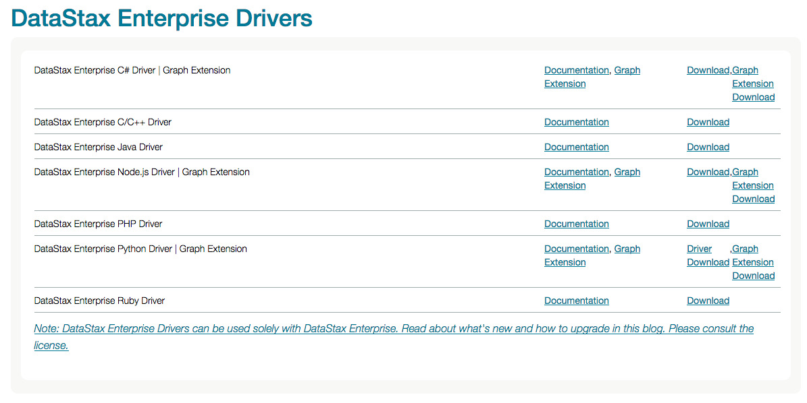

*Figure 18-1 DataStax Academy software download page.*

In addition to client side drivers, the download page also displays two (data loaders). Comments:

- DataStax Enterprise (DSE) is a true multi-model database; • DSE Core, based on Apache Cassandra, is officially titled a wide column store; think relational, without the costly distributed database joins. • DSE Graph, based on Apache TinkerPop and Apache Gremlin, is a graph database.

DataStax Developer’s Notebook -- June 2018 V1.2

In a graph database, you can query your database without specifying relationships between (tables). For example, given a standard ERP system (customer order entry), you could ask- Houston, TX is flooded and likely to see disrupted service; What parts of my business will be impacted ? (Customers, employees, trucks, planes, yadda.)

- The DSE Graph Loader is specifically designed to load graph data, and is detailed here,

```text
https://docs.datastax.com/en/dse/6.0/dse-dev/datastax_enterpri
se/graph/dgl/dglOverview.html
```

Where (standard relational databases, including in this case, DSE Core) are modeled and loaded as two dimensional (row and column) tables, graph is modeled differently. Thus, graph currently has its own loader.

- The DSE Bulk Loader can load data into the remainder of DSE, and is detailed here,

```text
https://docs.datastax.com/en/dse/6.0/dse-admin/datastax_enterp
rise/tools/dsbulk/dsbulkTOC.html
```

Example as shown in Figure 18-2.

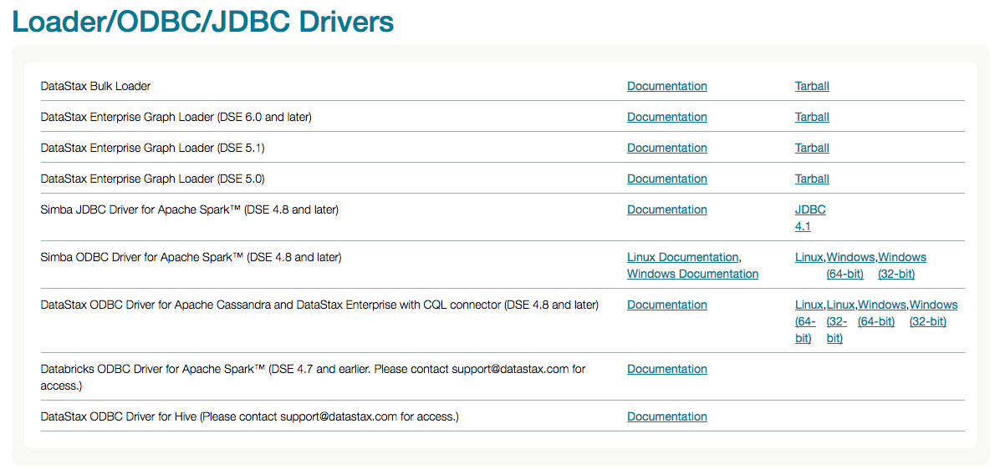

*Figure 18-2 DataStax Academy software download page, loaders.*

DSE DevCenter and DSE Studio DSE DevCenter exists as a plugin to the open source Eclipse developer’s workbench. At one point in history, Eclipse was the world’s most successful open source project, with more than one million downloads; an open source, extensible, extremely capable, developer’s workbench. But, Eclipse is a fat client,

DataStax Developer’s Notebook -- June 2018 V1.2

meaning; it’s a multi-hundred megabyte install, configure, yadda. Further, Eclipse was not an Apache project, and does not carry the familiar Apache license.

Apache Eclipse is detailed here,

```text
https://en.wikipedia.org/wiki/Eclipse_(software)
```

According the following Url,

```text
https://academy.datastax.com/downloads
```

DSE DevCenter is being deprecated; “It is recommended that developers use DSE Studio instead of DevCenter in order to take advantage of new DSE and development functionality. DevCenter is supported for DSE versions earlier than 5.0.

DSE Studio is Web based, and provides an interface similar to Apache Zeppelin. Apache Zeppelin is detailed here,

```text
https://en.wikipedia.org/wiki/Notebook_interface
https://zeppelin.apache.org/
```

And DSE Studio is detailed here,

```text
https://www.datastax.com/products/datastax-studio-and-development-to
ols
```

Example as shown in Figure 18-3.

DataStax Developer’s Notebook -- June 2018 V1.2

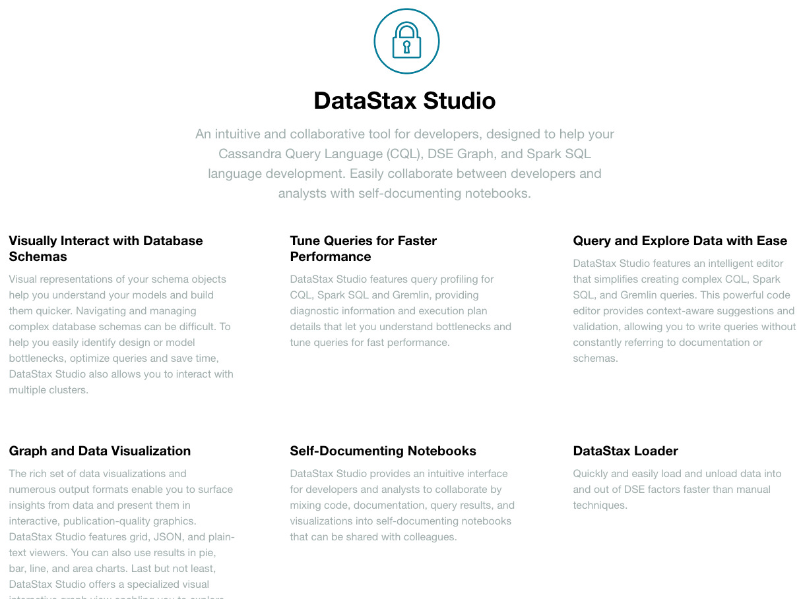

*Figure 18-3 DataStax Studio documentation page.*

A brief compare and contrast between DSE Studio and CQLSH:

- Where CQLSH can run CQL and a small number of (CQLSH control/directive) statements), Studio can run CQL, Spark/SQL, and Gremlin (the TinkerPop graph traversal language).

- Studio can also display end user created markdown (to document a workbook’s contents), and be shared with or without result sets (the output from any/all queries).

- CQLSH is command line, and Studio is graphical, a thin client Web based. The query result set in Studio is context aware, and will offer up to 8 or more graphical charting capabilities so that the end user can better understand the results.

- A graphical schema explorer comes with Studio, super handy for exploring graphs.

In the remainder of this document, we detail install and use of DSE Studio.

DataStax Developer’s Notebook -- June 2018 V1.2

## 18.2 Complete the following

At this point in this document we proceed with an install and configure of DataStax (DSE) Studio, and run a number of queries.

## 18.2.1 Download, install, and start DSE Studio

DSE Studio is available for download from the following Urls, Documentation page, including installation instructions,

```text
https://docs.datastax.com/en/dse/6.0/dse-dev/datastax_enterprise/stu
dio/studioToc.html
```

Download page proper,

```text
https://academy.datastax.com/all-downloads
```

Example as shown in Figure 18-4.

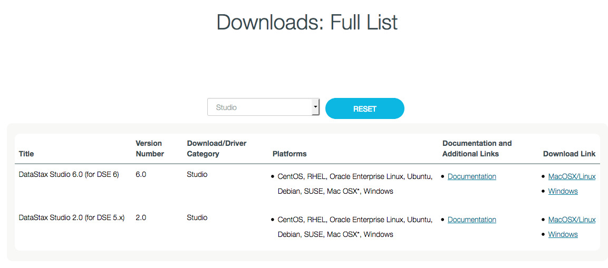

*Figure 18-4 DSE Studio download page.*

On MAC and Linux, the above distribution arrives as a Tar ball; unpack in a given

```text
/opt/studio
```

parent directory. We unpacked ours in .

A standard Linux filesystem (sub) structure;

```text
bin, conf, lib, logs,
```

other. While there is a

```text
configuration.yaml
```

under

```text
./conf
```

, DSE Studio will operate fine in many cases with no edits to same.

Under the

```text
./bin
```

directory, execute a, ./server.sh

```text
CONTROL-C
```

This command will cause DSE Studio to run in the foreground; use to terminate DSE Studio.

DataStax Developer’s Notebook -- June 2018 V1.2

DSE Studio will take moments to start. A completed (and successful) boot process is displayed in Example 18-1.

### Example 18-1 DSE Studio boot process, terminal window

```text
# ./server.sh
Starting Studio. This may take a few minutes. You will be notified here when
Studio is ready.
```

```text
SLF4J: Class path contains multiple SLF4J bindings.
SLF4J: Found binding in
[jar:file:/opt/studio/lib/log4j-slf4j-impl-2.9.0.jar!/org/slf4j/impl/StaticLogg
erBinder.class]
SLF4J: Found binding in
[jar:file:/opt/studio/tomcat.9091/webapps/api/WEB-INF/lib/log4j-slf4j-impl-2.9.
0.jar!/org/slf4j/impl/StaticLoggerBinder.class]
SLF4J: See http://www.slf4j.org/codes.html#multiple_bindings for an
explanation.
SLF4J: Actual binding is of type [org.apache.logging.slf4j.Log4jLoggerFactory]
```

```text
Studio is now running at: http://localhost:9091
```

```text
NOTE: Studio by default will only be accessible on this machine since it is
bound to localhost.
Studio is intended to be used as a desktop application. To allow remote
connections(which can be a security risk)
modify the httpBindAddress setting in configuration.yaml to either a publicly
accessible address or 0.0.0.0
```

```text
Please visit
https://docs.datastax.com/en/dse/6.0/dse-dev/datastax_enterprise/studio/configS
tudio.html for more information on configuration
```

As displayed in Example 18-1 above, DSE Studio is now available on localhost, port 9091. You can change the listening IP address and port. DSE Studio can connect to any active DSE server instance that you have permission and connectivity to.

DSE Studio, first steps Launching DSE Studio in a Web browser produces the display as shown in Figure 18-5. A code review follows.

DataStax Developer’s Notebook -- June 2018 V1.2

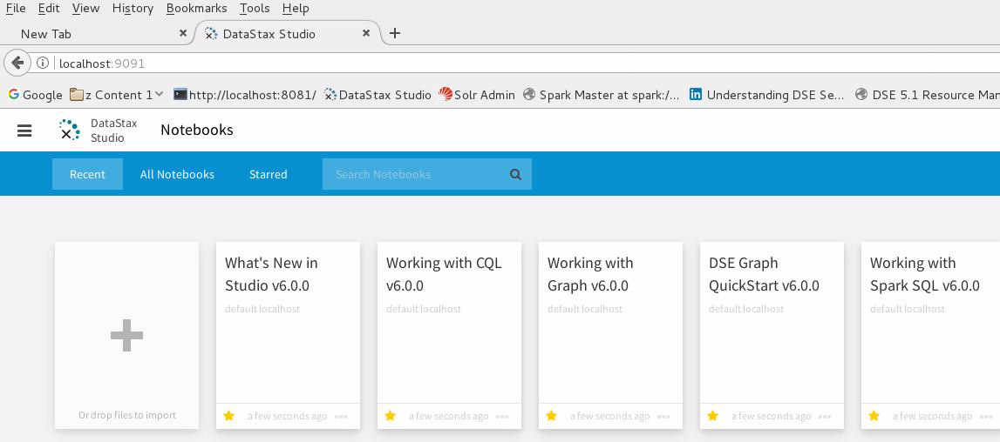

*Figure 18-5 Initial screen inside DSE Studio*

Relative to Figure 18-5, the following is offered:

- In the (main content area) are 5 training notebooks that ship with Studio, and a large plus (+) symbol. • This (main content area) will become a palette, once a notebook is open; the area on the screen where notebooks proper are edited and operated. • To import notebooks created on other machines or by other users, drag and drop the (new) notebook onto this area of the screen, when this area of the screen is current (on display). Exported notebooks arrive as a Zip file, previously created by DSE Studio.

- Above the blue menu bar, is the tool bar, with a number of icons. Left to right, these icons include: The (three line) menu button offers 3 further choices- • Notebooks, which is this current display. You can use this option to return to this (current) screen when inside a notebook, other. • Connections, which offers the ability to Add, Delete, and Update a set of metadata (a connection) to a DSE server instance.

DataStax Developer’s Notebook -- June 2018 V1.2

> Note: While connections are reusable across notebooks (connections exist as their own top level object with DSE Studio), each notebook is also associated with a current (default) connection.

Thus, when you re-open a notebook, it will know how to connect to its associated DSE server instance.

• Import Notebook, which is another means to import previously created DSE Studio notebooks. (Based on the current context within DSE Studio, this menu option may not always display.)

## 18.2.2 Create a new (CQL) notebook

To create a new (CQL) notebook, click the (+) symbol from the notebook display. Comments:

- Give the notebook a name.

- In the Connection / Select a Connection, drop down list box, select Add New Connection. Example as displayed in Figure 18-6. A code review follows.

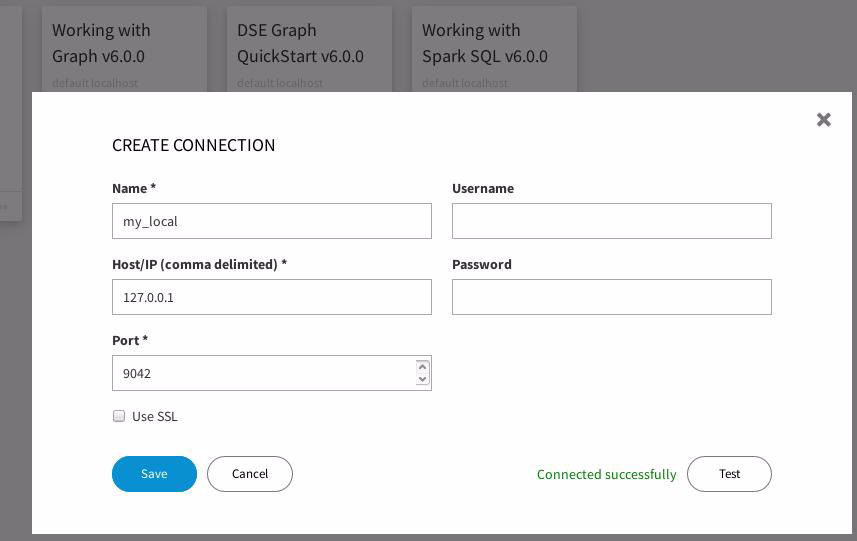

*Figure 18-6 DSE Studio, creating a new connection*

DataStax Developer’s Notebook -- June 2018 V1.2

Relative to Figure 18-6, the following is offered:

- We named our new connection,

```text
my_local
```

.

- And we targeted an operating DSE server on localhost, and at the default port of 9042.

- This DSE server instance used no authentication, so we had no need to enter a username/password pair, though such is supported.

- Lastly we clicked, Test, and Save.

- The step above return us to, Create Notebook, and we clicked, Create. This action produces the display as shown in Figure 18-7.

DSE Studio, CQL Figure 18-7 displays first steps after the creation of a new notebook. A code review follows.

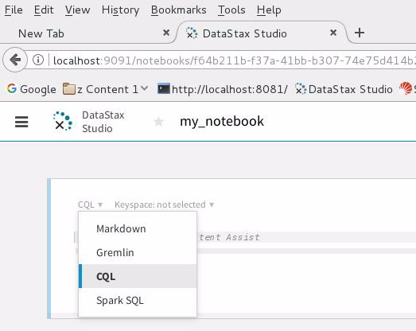

*Figure 18-7 First steps within a new notebook*

Relative to Figure 18-7, the following is offered:

- The palette area is that area of the screen below the white tool bar. This area displays and allows interaction with the workbook proper.

- Each (block / frame) on the palette it referred to as a, cell. You can add, drop, and edit cells using the plus symbol on the bottom-middle of any existing cell, or the ellipsis button on the top-right of each cell.

DataStax Developer’s Notebook -- June 2018 V1.2

- A cell is currently and exclusively one of four types, as listed in the drop down list box: • Markdown allows free form edit of comments, end user created documentation, other. A cell of this type accepts markdown formatting meta characters.

```text
GitHub
```

A good markdown language cheat sheet is available on at,

```text
https://guides.github.com/pdfs/markdown-cheatsheet-online.pdf
```

• CQL allows CQL syntax commands; CREATE KEYSPACE, CREATE TABLE, yadda. • Spark SQL allows the execution of Spark SQL (very compatible with HiveQL version 1.1). • And Gremlin allows the execution of Gremlin, the graph traversal language to TinkerPop.

Figure 18-8 displays the first CQL code example. A code review follows.

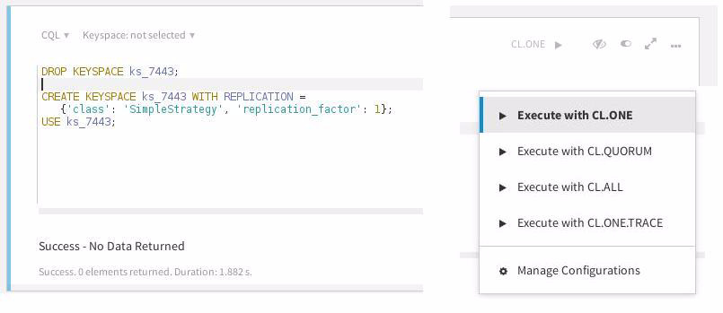

*Figure 18-8 First example, running CQL-*

Relative to Figure 18-8, the following is offered:

- In the top-left area of this image, you can see that no DSE keyspace is associated with this cell. This is kind of an odd, a first time use condition. Normally a cell is associated with a keyspace. Any new cells created that follow will inherit the keyspace setting. Of course, being able to change keyspace per cell allows for easy testing against small, then possibly larger data sets.

DataStax Developer’s Notebook -- June 2018 V1.2

- This cell runs a CREATE KEYSPACE statement.

- In the top-right of this display is the (run) button. The original button label is/was, CL.ONE, which stands for (consistency level, one). Other options are listed in the drop down list box.

- As a command that returns true or false, no data is returned.

Figure 18-9 displays a CQL CREATE TABLE. A code review follows.

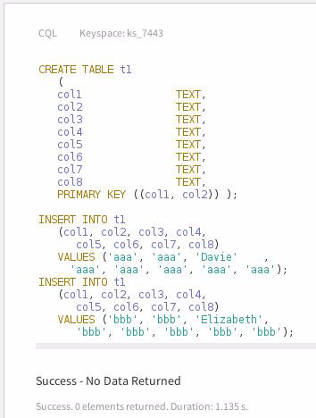

*Figure 18-9 CREATE TABLE, insert data*

Relative to Figure 18-9, the following is offered:

- We added this new cell but clicking the plus symbol on the center-bottom of an existing cell. New cells can be added anywhere in the existing list of cells; top, bottom, middle.

- Here the drop down list box to select an active keyspace has select the keyspace titled, ks_7443, which is specific to our application.

- This cell creates a new DSE table, and adds two rows of data. Again, no data is returned, since no data was called for.

DataStax Developer’s Notebook -- June 2018 V1.2

Figure 18-10 finally displays a SELECT. A code review follows.

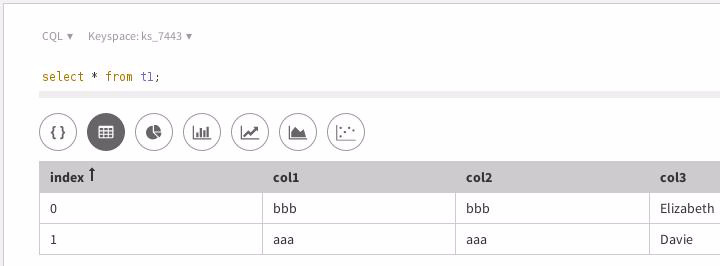

*Figure 18-10 Selecting data, chart types*

Relative to Figure 18-9, the following is offered:

- This is the first cell that produced data.

- Contextually, a number of chart types are available to affect how the result set is displayed. This ability is super handy when working with graph data, as the last chart type is specifically designed to visualize graph data.

Figure 18-11 displays another context aware chart type, and the result of a DESCRIBE TABLE.

DataStax Developer’s Notebook -- June 2018 V1.2

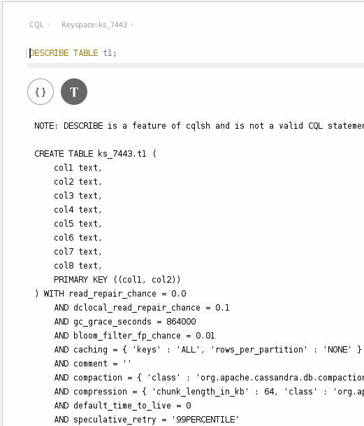

*Figure 18-11 Output of DESCRIBE TABLE*

Figure 18-12 displays the schema explorer. A code review follows.

DataStax Developer’s Notebook -- June 2018 V1.2

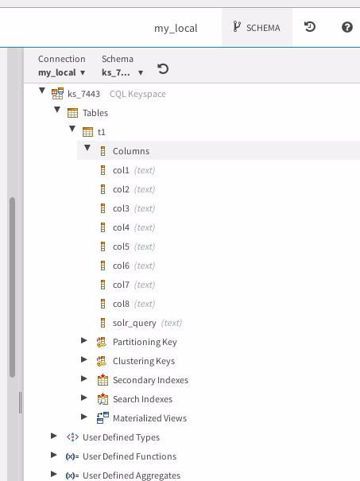

*Figure 18-12 Schema explorer view*

Relative to Figure 18-12, the following is offered:

- The schema explorer view is toggled on/off by clicking the schema button in the tool bar.

- This view remains open, and can be repositioned to move to the bottom of the screen via the multi-pane icon in the upper-right of the display.

Of course, DSE Studio is subject to the limitations of the underlying DSE Server. E.g., is DSE was booted without support for DSE Search, then Studio can not run DSE Search commands. The same is true for Spark/SQL and/or graph.

DataStax Developer’s Notebook -- June 2018 V1.2

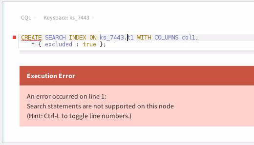

*Figure 18-13 Error when DSE Search is not active*

## 18.2.3 Running Spark/SQL

Any DSE Studio notebook can run Spark/SQL, given that any underlying DSE server nodes are configured to support DSE Analytics. Comments:

- As stated, the DSE Server must be configured to support DSE Analytics.

- An additional setting must be made to the

```text
dse.yaml
```

configuration file. Namely,

```text
alwayson_sql_options:
enabled: true
```

DataStax Developer’s Notebook -- June 2018 V1.2

> Note: The above form the minimal settings to allow DSE Studio to run Spark/SQL.

As always, when changing a YAML file, a node restart is required.

If, you are on a really small virtual machine or similar, you may have to adjust multiple settings in the

```text
dse.yaml
```

, namely;

```text
resource_manager_options:
worker_options:
cores_total: 0.7
memory_total: 0.8
workpools:
- name: alwayson_sql
cores: 0.50
memory: 0.75
workpool: alwayson_sql
```

Figure 18-14 displays the error you will observe when DSE is not ready to support spark/SQL executed through DSE Studio.

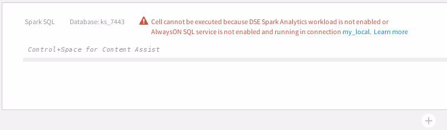

*Figure 18-14 DSE not configured to support Spark/SQL and same through Studio*

Figure 18-15 displays a Spark/SQL SELECT statement with GROUP BY run through DSE Studio.

DataStax Developer’s Notebook -- June 2018 V1.2

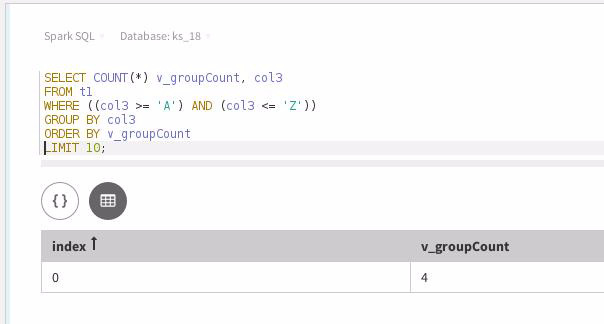

*Figure 18-15 Spark/SQL run through DSE Studio*

## 18.2.4 Running Gremlin (Graph)

DSE Studio can also run Gremlin, the TinkerPop graph traversal language. (Gremlin is to TinkerPop what SQL/DML-DDL-DCL is to a relational database.)

You can run any of the sample graph notebooks that ship with DSE Studio.

Until this document series offers a graph primer, we will not expand further on this topic at this time.

## 18.3 In this document, we reviewed or created:

This month and in this document we detailed the following:

- An install, configuration, and use of DataStax Enterprise (DSE) Studio, a thin Web client interactive query environment aimed at programmers and administrators.

- We ran CQL, and Spark/SQL commands, used the schema explorer and more.

We did not detail importing or exporting notebooks, as these functions are readily available from the graphical menu. We also did not detail Gremlin queries using DSE Studio, until a time that we overview graph as a whole.

DataStax Developer’s Notebook -- June 2018 V1.2

### Persons who help this month.

Kiyu Gabriel, Matt Atwater, and Anthony Wong.

### Additional resources:

Free DataStax Enterprise training courses,

```text
https://academy.datastax.com/courses/
```

Take any class, any time, for free. If you complete every class on DataStax Academy, you will actually have achieved a pretty good mastery of DataStax Enterprise, Apache Spark, Apache Solr, Apache TinkerPop, and even some programming.

This document is located here,

```text
https://github.com/farrell0/DataStax-Developers-Notebook
https://tinyurl.com/ddn3000
```
