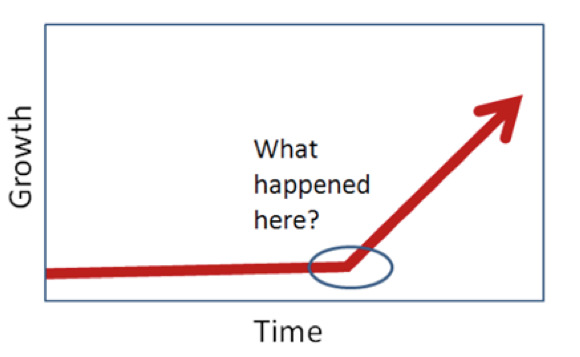
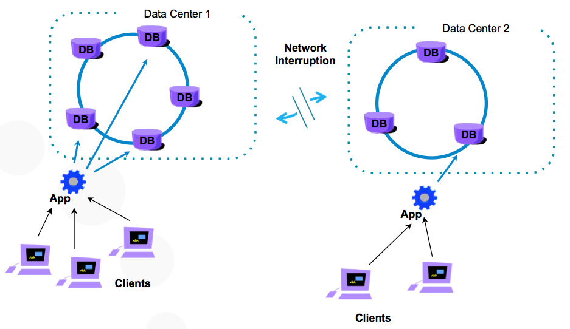
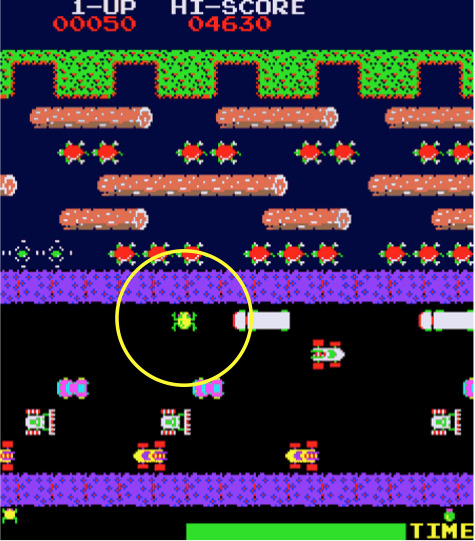
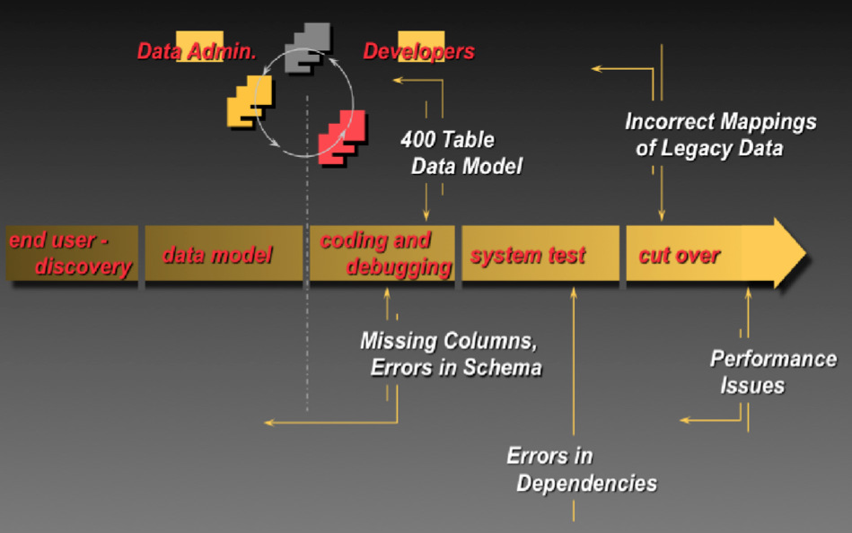
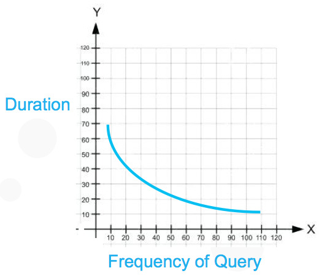

| **[Monthly Articles - 2022](../../README.md)** | **[Monthly Articles - 2021](../../2021/README.md)** | **[Monthly Articles - 2020](../../2020/README.md)** | **[Monthly Articles - 2019](../../2019/README.md)** | **[Monthly Articles - 2018](../../2018/README.md)** | **[Monthly Articles - 2017](../../2017/README.md)** | **[Data Downloads](../../downloads/README.md)** |
|-------------------------|-------------------------|-------------------------|-------------------------|-------------------------|-------------------------|-------------------------|

[Back to 2018 archive](../README.md)
[Download original PDF](../DDN_2018_19_QueryHarness.pdf)

## From The Archive

2018 July - -

>Customer: I inherited an existing DataStax Enterprise (DSE) server system, and users are
>complaining about performance. I know nothing about DSE, and need to make the users happy.
>Can you help ?
>
>Daniel: Excellent question ! Based on your timeline (how quickly and safely does this problem
>need to be solved), you should probably contact DataStax for assistance. If you were already
>trained/capable on DSE and wanted to solve this problem, this document will cover introductory
>topics related to that goal.
>
>In short, this document discusses building a query harness; capturing and then executing a
>representative set of queries to measure your system performance against, how and why-
>
>[Read article online](./README.md)
>


---

# DDN 2018 19 QueryHarness

## Chapter 19. July 2018

DataStax Developer’s Notebook -- July 2018 V1.2

Welcome to the July 2018 edition of DataStax Developer’s Notebook (DDN). This month we answer the following question(s); I inherited an existing DataStax Enterprise (DSE) server system, and users are complaining about performance. I know nothing about DSE, and need to make the users happy. Can you help ? Excellent question ! Based on your timeline (how quickly and safely does this problem need to be solved), you should probably contact DataStax for assistance. If you were already trained/capable on DSE and wanted to solve this problem, this document will cover introductory topics related to that goal. In short, this document discusses building a query harness; capturing and then executing a representative set of queries to measure your system performance against, how and why-

## Software versions

The primary DataStax software component used in this edition of DDN is DataStax Enterprise (DSE), currently release 6.0. All of the steps outlined below can be run on one laptop with 16 GB of RAM, or if you prefer, run these steps on Amazon Web Services (AWS), Microsoft Azure, or similar, to allow yourself a bit more resource.

For isolation and (simplicity), we develop and test all systems inside virtual machines using a hypervisor (Oracle Virtual Box, VMWare Fusion version 8.5, or similar). The guest operating system we use is CentOS version 7.0, 64 bit.

DataStax Developer’s Notebook -- July 2018 V1.2

## 19.1 Terms and core concepts

We state that in the area of database server performance tuning, there is system tuning, and there is statement tuning :

- System tuning involves tuning the operating system or container; • Are the hard disk controllers and drives balanced, or are we bottle necked on a small subset of these resources. What is the latency and/or sustained throughput to the drives; do these measures rate at or near the capacity for this type of hardware and configuration- • Are we swapping, or is some inordinate amount of memory blocked for use by some competing (non DataStax Enterprise) resource. • What is the percent wait and busy of the CPUs/threads- • Network, similar; wait time, errors, percent busy, sustained throughput-

- And system tuning involves the four primary areas of software server architecture ; memory, disk, process, and network. A necessary exercise using any database server is to find each configuration file, then: • Walk through each file and each setting; is a given setting an identifier, a capacity, or a tunable. Know how each setting is validated; is it too high or too low, for both peak and average use. • Check log files for errors, especially time-outs or warnings or resource inadequacies.



*Figure 19-1 Gradual, or overnight change in performance.*

DataStax Developer’s Notebook -- July 2018 V1.2

• And then as depicted in Figure 19-1, determine if the change in performance happened gradually overtime, or overnight.

> Note: Making this determination is hard without proper data, and we discuss a strategy to collect this data below when discussing a query harness. If the change in performance happened gradually, is the problem related to (normal) growth in data volumes; can we archive (delete) data to an analytics or similar style system- If the change in performance happened suddenly, what changed; was there a bulk load or operation of some type, is there a system failure ongoing, other-

• And server specific settings- For example, with DataStax Enterprise (DSE), you can isolate workload by groups of nodes called data centers. Example as shown in Figure 19-2.



*Figure 19-2 Multiple data centers using DSE; separation by workload*

Using DSE data centers (Figure 19-2), we can configure it such that: -- Critical low latency routines (OLTP style routines) run only in data center one, while potentially spiky routines (OLAP style routines) run only in data center two. -- Data centers are just one form of resource governor built into DSE.

DataStax Developer’s Notebook -- July 2018 V1.2

> Note: Heuristically and without proof, we state: – Unless you worked really hard to get it initially wrong, you are likely to only be able to recover 5-30% performance by system tuning. – Most of the big performance recovery comes through statement tuning, which is why we cover this topic at large in this document. With statement tuning, you could recover 2x, 8x, or higher performance gains.

- And then statement tuning- Statements are those end user routines executed in the normal operation of the end user application; queries. End user (queries) run with an expected frequency, concurrency, and spread, comparable to the 1981 Atari video game titled, Frogger.



*Figure 19-3 Frogger, 1981, Atari*

DataStax Developer’s Notebook -- July 2018 V1.2

Each of the (obstacles) above has a concurrency; how many are on a point in the road at a given time. Obstacles repeat (frequency). And obstacles have a spread (time before they repeat execution, and duration).

> Note: Relational databases are modeled using entity/relationship modeling (3rd normal form, Codd and Date), or dimensional modeling.

In either case, most errors occur here via incorrect indexing; the (programmer) not knowing the rules of index negation, common (bad) query forms (like OR-topped queries), other. A common system tuning error here is failure to maintain accurate query optimizer statistics, but we digress.

DSE is modeled by query access pattern; common to most NoSQL (post relational) database servers, you model to the queries you need to serve.

When using DSE, a bad data model is normally at the heart of 70% or so of the performance issues. Producing and using a query harness, will help us avoid having a bad data model, or to uncover one later in the software lifecycle.

Develop the application at scale, test at scale Figure 19-4 displays a common end user application software development lifecycle. A code review follows.

DataStax Developer’s Notebook -- July 2018 V1.2



*Figure 19-4 Software development lifecycle*

Relative to Figure 19-4, the following is offered:

- The assumption is made that most new end user application systems are replacing some pre-existing legacy system, and that (legacy) data already exists is some electronic form. By porting that legacy data into the new system as early as possible, you uncover: • Mapping errors; the legacy columns did not contain the data you though they did (domains, ranges, formatting, other). • You find missing columns or requirements, necessitating a change in the new system’s data model.

> Note: Changing the new system’s data model now, before application code is written is much cheaper (time wise) than after any application code is already written, and needs to be refactored.

• Errors in the user interface; did the programmer test with 4 rows of data, when 1000’s of rows of data will exist in production. What happens when you accidently try to put 1000’s of elements in a drop down list box-

DataStax Developer’s Notebook -- July 2018 V1.2

> Note: By developing and testing an application with representative hardware and data volumes, an endless number of good things happen.

- Before writing any end user application program code, the data model should be validated: • Run the expected INSERTs, UPDATES, DELETES, and SELECTS with the expected frequency, concurrency, and spread.

> Note: Look for performance issues. It is at this time, and after this work that you can accurately predict if this new application will meet performance expectations, or you will need to go back and redesign; redesign the data model, redesign the hardware configuration, other.

You do not need to write any application code to accurately determine that the application will perform or scale.

• The above forms your query harness; a test suite that represents what the application does and how it needs to perform. This artifact (the query harness) should have been created early in the development of the initial release of the application, else, you have to reverse engineer the query harness later. Expect too to update and maintain thew query harness over time as end user usage patterns change.

Creating the query harness If you are creating the query harness as part of creating a new end user application, you:

- Interview the stake holders- What underlying database routines (INSERT, UPDATE, ..) sit behind each end user interface button click, menu option, other. How often are these routines run; frequency, concurrency, and spread.

- Run the above routines against the expected data model and production sized data; capture performance numbers for each (and compare these numbers over time; is performance gradually changing).

If you need to reverse engineer the query harness; it was never created or is in danger of being incorrect, out of date: DSE has a means to report end user activity to you from a live system-

- Enable the CQL slow query log

DataStax Developer’s Notebook -- July 2018 V1.2

- Enable the DSE Search (Solr) slow query log

- Use the audit secure subsystem to capture these routines

- Access the correct JMS query metrics MBean

- Other

Figure 19-5 displays the most common graph of the query harness (end user activity). A code review follows.



*Figure 19-5 Graph of end user activity, normally a parabolic curve*

Relative to Figure 19-5, the following is offered:

- The query harness exists as a list of end user initiated distinct database server routines, and plots most commonly as a parabolic curve; some routines happen frequently, some only monthly or yearly. Some routines execute in 0-2 milliseconds, some take several seconds.

- You needn’t tune every routine; start with those that happen most frequently, or take much too long to complete.

DataStax Developer’s Notebook -- July 2018 V1.2

How you capture the query harness using the CQL slow query log, or DSE Search (Solr) slow query log, is the topic of the next section.

## 19.2 Complete the following

Previously in this document we defined a query harness, and what role this asset plays in tuning (and maintaining) database server systems. In this section of this document, we discuss two means to attempt to reverse engineer the query harness; should you not possess same, of if the query harness was not maintained, is out of date.

CQL Slow Query Log The CQL slow query log is detailed here,

```text
https://docs.datastax.com/en/dse/6.0/dse-admin/datastax_enterprise/m
gmtServices/performance/collectingSlowQueries.html
```

A number of settings related to the CQL slow query log are below-

```text
cql_slow_log_options:
enabled: true
threshold: 200.0
minimum_samples: 100
ttl_seconds: 259200
skip_writing_to_db: true
num_slowest_queries: 5
```

Comments related to the above:

- In all cases, this data is available from the DSE table titled,

```text
dse_perf.node_slow_log
dsetool
```

Or this same/near data is available from a given command (listed below).

- Whether this data stays in memory, or is actually written to a (real table) is configurable.

> Note: Writing all queries to a real table could cause an obvious and severe performance load.

Best practice: start small. Collect only really slow queries, and keep this data in memory. Read this in memory table via a client program, and persist to file.

DataStax Developer’s Notebook -- July 2018 V1.2

- The CQL slow query log can be enabled via DSE.yaml (requiring a node restart), or via a,

```text
dsetool perf cqlslowlog enable
dsetool perf cqlslowlog 2
dsetool perf cqlslowlog recent_slowest_queries
```

(Other, more)

- All times are in milliseconds

```text
dse_perf.node_slow_log
```

After enabling the CQL slow query log, SELECT from

```text
recent_slowest_queries
```

(or the near equivalent option above). Example as shown-

```text
node_ip | date | start_time
| commands
| duration | parameters | source_ip | table_names |
tracing_session_id | username
-----------+---------------------------------+----------------------
----------------+---------------------------------------------------
--------------------------------------------------------------------
---------------------------+----------+------------+-----------+----
------------------+--------------------+-----------
127.0.0.1 | 2018-06-12 00:00:00.000000+0000 |
9981ae50-6e97-11e8-9100-279ebaec0185 |
['select count(*) from my_mapdata;'] | 4029 | null |
127.0.0.1 | {'ks_16.my_mapdata'} | null | anonymous
127.0.0.1 | 2018-06-12 00:00:00.000000+0000 |
8ce7f910-6e97-11e8-9100-279ebaec0185 | ['CREATE SEARCH INDEX ON
ks_16.my_mapData WITH COLUMNS md_pk, *
{excluded : true } ; '] | 896 |
null | 127.0.0.1 | null | null | anonymous
127.0.0.1 | 2018-06-12 00:00:00.000000+0000 |
8ca830f0-6e97-11e8-9100-279ebaec0185 |
['DROP SEARCH INDEX ON ks_16.my_mapData;
'] | 383 | null | 127.0.0.1 | null |
null | anonymous
127.0.0.1 | 2018-06-12 00:00:00.000000+0000 |
5cc5bce0-6e97-11e8-9100-279ebaec0185 |
['select count(*) from my_mapdata;'] | 3572 | null |
127.0.0.1 | {'ks_16.my_mapdata'} | null | anonymous
```

DataStax Developer’s Notebook -- July 2018 V1.2

```text
(4 rows)
```

```text
dsetool perf cqlslowlog recent_slowest_queries
Showing N=5000 most recent CQL queries slower than 2.0 ms
---------------------------------------------
[ {
"tables" : "[ks_16.my_mapdata]",
"sourceIp" : "/127.0.0.1",
"username" : "anonymous",
"startTimeUUID" : "9981ae50-6e97-11e8-9100-279ebaec0185",
"duration" : 4029,
"cqlStrings" : "[select count(*) from my_mapdata;]",
"tracingSessionId" : ""
}, {
"tables" : "[ks_16.my_mapdata]",
"sourceIp" : "/127.0.0.1",
"username" : "anonymous",
"startTimeUUID" : "5cc5bce0-6e97-11e8-9100-279ebaec0185",
"duration" : 3572,
"cqlStrings" : "[select count(*) from my_mapdata;]",
"tracingSessionId" : ""
}, {
"tables" : "[ks_16.null]",
"sourceIp" : "/127.0.0.1",
"username" : "anonymous",
"startTimeUUID" : "8ce7f910-6e97-11e8-9100-279ebaec0185",
"duration" : 896,
"cqlStrings" : "[CREATE SEARCH INDEX ON ks_16.my_mapData
WITH COLUMNS md_pk, * {excluded : true } ;
]",
"tracingSessionId" : ""
```

DataStax Developer’s Notebook -- July 2018 V1.2

```text
}, {
"tables" : "[ks_16.null]",
"sourceIp" : "/127.0.0.1",
"username" : "anonymous",
"startTimeUUID" : "8ca830f0-6e97-11e8-9100-279ebaec0185",
"duration" : 383,
"cqlStrings" : "[DROP SEARCH INDEX ON ks_16.my_mapData;
]",
"tracingSessionId" : ""
} ]
```

DSE Search (Solr) Slow Query Log The DSE Search (Solr) slow query log operates nearly identically to the CQL slow query log, and is documented here,

```text
https://docs.datastax.com/en/dse/6.0/dse-admin/datastax_enterprise/m
gmtServices/searchPerformance/collectingSlowSolrQueries.html
```

A number of settings related to the DSE Search (Solr) slow query log are below-

```text
solr_slow_sub_query_log_options:
enabled:true
ttl_seconds: 604800
async_writers: 1
threshold_ms: 100
```

Or set using these and other commands,

```text
dsetool perf solrslowlog enable
dsetool perf solrindexstats enable
dsetool perf solrcachestats enable
dsetool perf solrlatencysnapshots enable
```

```text
dse_perf
```

There are also a larger number of related tables in the keyspaces, the

```text
solr_slow_sub_query_log
```

main one being, .

```text
cqlsh:dse_perf> describe tables;
```

DataStax Developer’s Notebook -- July 2018 V1.2

```text
solr_update_latency_snapshot solr_filter_cache_stats
solr_query_latency_snapshot solr_slow_sub_query_log
node_slow_log solr_index_stats
solr_result_cache_stats solr_commit_latency_snapshot
solr_merge_latency_snapshot
select * from solr_slow_sub_query_log;
```

```text
core | date | coordinator_ip
| query_id | node_ip |
component_prepare_millis
| component_process_millis
| elapsed_millis | num_docs_found | parameters
| start_time
------------------+---------------------------------+---------------
-+--------------------------------------+-----------+---------------
--------------------------------------------------------------------
--------------------------------------------------------------------
--------------------------------+-----------------------------------
--------------------------------------------------------------------
--------------------------------------------------------------------
-------------+----------------+----------------+--------------------
--------------------------------------------------------------------
--------------------------------------------------------------------
--------------------------------------------------------------------
--------------------------------------------------------------------
--------------------------------------------------------------------
--------------------------------------------------------------------
--------------------------------------------------------------------
--------------------------------------------------------------------
--------------------------------------------------------------------
--------------------------------------------------------------------
--------------------------------------------------------------------
-------------+---------------------------------
ks_16.my_mapdata | 2018-06-12 00:00:00.000000+0000 | 127.0.0.1
| 9b76a3da-6e9b-11e8-ae55-525400725776 | 127.0.0.1 |
{'com.datastax.bdp.search.solr.handler.component.CqlQueryComponent':
3, 'org.apache.solr.handler.component.DebugComponent': 0,
'org.apache.solr.handler.component.FacetComponent': 0} |
{'com.datastax.bdp.search.solr.handler.component.CqlQueryComponent':
99, 'org.apache.solr.handler.component.DebugComponent': 0,
```

DataStax Developer’s Notebook -- July 2018 V1.2

```text
'org.apache.solr.handler.component.FacetComponent': 0} |
102 | 5867 | {'ForceShardHandler': '["true"]', 'NOW':
'["1528847524186"]', 'ShardRouter.SHARD_COORDINATOR_ID':
'["9b76a3da-6e9b-11e8-ae55-525400725776"]',
'ShardRouter.SHARD_COORDINATOR_IP': '["127.0.0.1"]', 'debug':
'["timing", "false"]', 'debugQuery': '["false"]', 'distrib':
'["false"]', 'fl': '["score", "md_pk"]', 'fq': '["-_parent_:F",
"{!geofilt pt=39.739136378189905,-104.99378413406362
sfield=md_latlng d=1.0}"]', 'fsv': '["true"]', 'isShard':
'["true"]', 'q': '["*:*"]', 'qt': '["solr_query"]', 'rows':
'["1000"]', 'shard.ranges/127.0.0.1:8609/solr/ks_16.my_mapdata':
'["~ALL"]', 'shard.url': '["127.0.0.1:8609/solr/ks_16.my_mapdata"]',
'shards.purpose': '["4"]', 'shards.qt': '["solr_query"]',
'skip_token_filter': '["true"]', 'start': '["0"]', 'useFieldCache':
'["true", "true"]'} | 2018-06-12 23:52:04.286000+0000
```

```text
(1 rows)
```

```text
select * from node_slow_log;
```

```text
node_ip | date | start_time
| commands
| duration | parameters | source_ip | table_names |
tracing_session_id | username
-----------+---------------------------------+----------------------
----------------+---------------------------------------------------
--------------------------------------------------------------------
--------------------------------------------------------------------
--------------------------------------------------------------------
--------------------------------------------------------------------
-------------------------------+----------+------------+-----------+
----------------------+--------------------+-----------
127.0.0.1 | 2018-06-12 00:00:00.000000+0000 |
9b67fdb0-6e9b-11e8-9100-279ebaec0185 | ['SELECT md_lat, md_lng,
md_name, md_mysource, md_phone
FROM ks_16.my_mapdata WHERE solr_query =
''{ "q" : "*:*", "fq" : "{!geofilt
pt=39.739136378189905,-104.99378413406362 sfield=md_latlng d=1.0}"
}'' LIMIT 1000; '] | 749 | null
| 127.0.0.1 | {'ks_16.my_mapdata'} | null | anonymous
```

DataStax Developer’s Notebook -- July 2018 V1.2

```text
(1 rows)
```

The goal, above, is to capture each unique query (SELECT, INSERT, UPDATE, DELETE), and aggregate (as stated); the observed frequency, concurrency, and spread.

Using an open source load generator, program same to execute these statements in a representative pattern, and record execution times.

## 19.3 In this document, we reviewed or created:

This month and in this document we detailed the following:

- System tuning and (end user) statement tuning

- How to reverse engineer a query harness, and what this asset is best used for; enabling the CQL slow query log, and DSE Search (Solr) slow query log

- A bit about optimizing a software development lifecycle

### Persons who help this month.

Kiyu Gabriel, Matt Atwater, and Anthony Wong.

### Additional resources:

Free DataStax Enterprise training courses,

```text
https://academy.datastax.com/courses/
```

Take any class, any time, for free. If you complete every class on DataStax Academy, you will actually have achieved a pretty good mastery of DataStax Enterprise, Apache Spark, Apache Solr, Apache TinkerPop, and even some programming.

This document is located here,

```text
https://github.com/farrell0/DataStax-Developers-Notebook
```

DataStax Developer’s Notebook -- July 2018 V1.2

```text
https://tinyurl.com/ddn3000
```

DataStax Developer’s Notebook -- July 2018 V1.2
