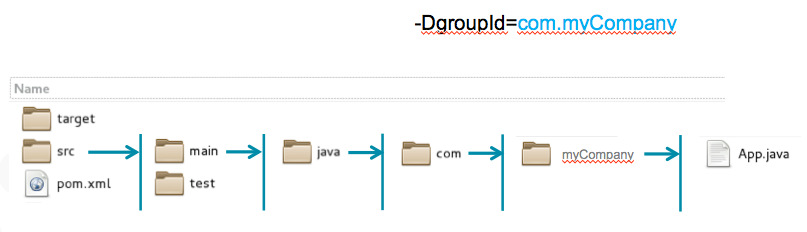

| **[Monthly Articles - 2022](../../README.md)** | **[Monthly Articles - 2021](../../2021/README.md)** | **[Monthly Articles - 2020](../../2020/README.md)** | **[Monthly Articles - 2019](../../2019/README.md)** | **[Monthly Articles - 2018](../../2018/README.md)** | **[Monthly Articles - 2017](../../2017/README.md)** | **[Data Downloads](../../downloads/README.md)** |
|-------------------------|-------------------------|-------------------------|-------------------------|-------------------------|-------------------------|-------------------------|

[Back to 2018 archive](../README.md)
[Download original PDF](../DDN_2018_22_ClientSideDriver.pdf)

---

# DDN 2018 22 ClientSideDriver

## Chapter 22. October 2018

DataStax Developer’s Notebook -- October 2018 V1.2

Welcome to the October 2018 edition of DataStax Developer’s Notebook (DDN). This month we answer the following question(s); My company is investigating using DataStax for our new Customer/360 system in our customer call center. I am tasked with getting a simple (Hello World style) Java program running against the DataStax server in a small Linux command line capable Docker container. Can you help ? Excellent question ! In the May/2018 edition of this document, we detailed how and where to download a DataStax sponsored Docker container which includes the DataStax Enterprise (DSE) server; boot and operate DSE. In the October/2017 edition of this document, we detailed a DSE introduction, including table create, new data insert and query, and more. So, the only piece we are missing is the Java client program compile that targets DSE. To aid in our compiling, we will document using the Apache Maven build automation tool. Inherently, a given (any given) Java library will need other Java libraries, that themselves need more Java libraries, rinse and repeat. It is best to automate resolution of this condition. We will install and configure all of the above, access the DSE server, and go home.

## Software versions

The primary DataStax software component used in this edition of DDN is DataStax Enterprise (DSE), currently release 6.0.2. All of the steps outlined below can be run on one laptop with 16 GB of RAM, or if you prefer, run these steps on Amazon Web Services (AWS), Microsoft Azure, or similar, to allow yourself a bit more resource.

For isolation and (simplicity), we develop and test all systems inside virtual machines using a hypervisor (Oracle Virtual Box, VMWare Fusion version 8.5, or similar). The guest operating system we use is CentOS version 7.0, 64 bit.

DataStax Developer’s Notebook -- October 2018 V1.2

## 22.1 Terms and core concepts

As stated above, ultimately the end goal is to compile and run a Java program that accesses DataStax Enterprise (DSE) server. Whenever you are programming in Java, you want to use an automated build tool. Comments:

- Once you get past Hello World, and start pulling in libraries (Jar files), those libraries will need additional libraries, which themselves will need additional libraries, and so on. For a simple but useful Java program, you might quickly find yourself needing 50 such files; better to automate identifying these files, downloading, other.

> Note: What is an automated build tool ?

Think yum(C) or apt-get(C), but for Java programs.

- And, each of those libraries (above) will have specific versions required, other.

A bit of a religious war, you might chose to use the Maven (automated build tool), Gradle, SBT (Simple Build Tool), other. Comments:

- You need only choose one above, not multiple.

- In the case of Maven, an online central repository (

```text
https://search.maven.org/search?q=datastax
```

) offers downloadable, trusted versions of most Jar files and related you might need.

- Each Maven project is associated with an XML encoded ASCII text file, titled pom.xml, which instructs Maven how to compile your (program). Pom is short for, property object model. A sample pom.xml is listed in Example 22-1. A code review follows.

### Example 22-1 Sample pom.xml for DataStax

```text
<project xmlns="http://maven.apache.org/POM/4.0.0"
xmlns:xsi="http://www.w3.org/2001/XMLSchema-instance"
xsi:schemaLocation="http://maven.apache.org/POM/4.0.0
http://maven.apache.org/maven-v4_0_0.xsd">
```

```text
<modelVersion>4.0.0</modelVersion>
<groupId>com.datastax.enablement.bootcamp</groupId>
<artifactId>my-app</artifactId>
<packaging>jar</packaging>
<version>1.0-SNAPSHOT</version>
<name>my-app</name>
```

DataStax Developer’s Notebook -- October 2018 V1.2

```text
<url>http://maven.apache.org</url>
```

```text
<dependencies>
```

```text
<dependency>
<groupId>com.datastax.dse</groupId>
<artifactId>dse-java-driver-core</artifactId>
<version>1.6.7</version>
</dependency>
```

```text
<dependency>
<groupId>junit</groupId>
<artifactId>junit</artifactId>
<version>3.8.1</version>
<scope>test</scope>
</dependency>
```

```text
</dependencies>
```

```text
</project>
```

Relative to Example 22-1, the following is offered:

- As part of the functionality of the Maven automated build tool, the file above can be generated.

- The only part we needed to add in order to compile and run a Java client that accesses DSE is the first dependency block, shown in bold. This block tells Maven which library (Jar file) we want, and which version.

- Unless you need to add new libraries (new Jars), you generally edit the pom.xml one time, after which you are done.

> Note: Maven supports programming in at least; Java, Scala, Ruby, C/C++, and more.

See,

```text
https://en.wikipedia.org/wiki/Apache_Maven
https://maven.apache.org/guides/getting-started/maven-in-five-min
utes.html
```

DataStax Developer’s Notebook -- October 2018 V1.2

## 22.2 Complete the following

At this point in this document, we have overviewed the Apache Maven automated build tool, and the minimum DataStax Enterprise (DSE) Java client program you might want. Now it’s time to start programming.

## 22.2.1 Confirm, or install Maven

To confirm or deny the presence of the Maven automated build tool, enter the following at the command line prompt,

```text
mvn --version
```

You should either receive “mvn not found”, or a version number response. If Maven is not found, download Maven from the following Urls,

```text
https://maven.apache.org/download.cgi
https://maven.apache.org/install.html
```

Version 3.5.4 of Maven arrives as a Tar ball, 8MB in size. Unpack, and place in your PATH. Version 3.5.4 of Maven requires a Java version 8 JDK be installed.

To confirm, rerun, “

```text
mvn --version
```

”.

## 22.2.2 Initialize a new Java/DSE client project

To avoid any potential conflict, create and enter a new directory.

```text
mkdir /opt
cd /opt
```

Call to generate a new Maven Java project, example as shown in Example 22-2. A code review follows.

### Example 22-2 Generating a new Maven Java project

```text
mvn archetype:generate
```

```text
-DgroupId=com.myCompany
```

```text
-DarchetypeArtifactId=maven-archetype-quickstart
```

```text
-DinteractiveMode=false
```

```text
-DartifactId=my-app
```

DataStax Developer’s Notebook -- October 2018 V1.2

Relative to Example 22-2, the following is offered:

- Everything in this example is entered on one line; the display wraps because of line length.

- The value for DgroupId becomes the Java package name.

- The value for DartifactId becomes our Java project name.

- All other settings are standard; a call to generate a project of the type we require, Maven, Java.

- The single command above create a project filesystem structure and more, as introduced in Figure 22-1. A code review follows.



*Figure 22-1 Product of “mvn generate” command.*

Relative to Example 22-1, the following is offered:

- The one “

```text
mvn generate
```

” command generated a standard (expected) filesystem structure, and a pom.xml, and a stub Java program, App.java.

- This generated App.java will actually compile and run, (and say, Hello World.)

- A package name to App.java, is generated from the groupIp mentioned above.

- For our purposes, the pom.xml is functional, but needs reference to DataStax Enterprise added.

- The generated App.java is listed in Example 22-3. A code review follows.

### Example 22-3 Generated App.java

```text
package com.myCompany;
```

DataStax Developer’s Notebook -- October 2018 V1.2

```text
public class App
```

```text
{
```

```text
public static void main( String[] args )
```

```text
{
```

```text
System.out.println( "Hello World!" );
```

```text
}
```

```text
}
```

Relative to Example 22-3, the following is offered:

- While simple, the program above will compile and run.

- The next step would be to add the DSE specific client side program code.

## 22.2.3 Compile and run

Previously we generated this Maven Java project from /opt, with a DartifactId of, my-app. Following this example, all further commands are run from, /opt/my-app.

To compile, execute a,

```text
mvn package
```

To generate the Java CLASSPATH (necessary to run), execute a,

```text
mvn dependency:build-classpath -Dmdep.outputFile=cp.txt
# CLASSPATH will be written to cp.txt
```

To run the program, execute a,

```text
java -cp target/my-app-1.0-SNAPSHOT.jar:`cat cp.txt`
com.datastax.enablement.bootcamp.App
```

The above is one command line, wrapped due to length.

## 22.2.4 Change the pom.xml to support DSE client side programs

In order to locate, download, other, the package(s) (Java Jar files) that support DataStax Enterprise (DSE) Java client side programs, we need to add the following block to the pom.xml file, in the dependencies block.

DataStax Developer’s Notebook -- October 2018 V1.2

```text
<dependencies>
<dependency>
<groupId>com.datastax.dse</groupId>
<artifactId>dse-java-driver-core</artifactId>
<version>1.6.7</version>
</dependency>
</dependencies>
```

## 22.2.5 Add DSE client side code

Everything is now in place in order for the this Java client side program to interact with DSE. Time now to add specific Java code to accomplish same.

Example 22-4 displays the complete Java program we intend to run. A code review follows.

### Example 22-4 Complete and final Java program that accesses DSE.

```text
package com.myCompany;
import com.datastax.driver.dse.DseCluster;
import com.datastax.driver.dse.DseSession;
import com.datastax.driver.core.Row;
public class App
{
public static void main( String[] args )
{
DseCluster my_cluster = null;
try {
my_cluster = DseCluster.builder()
.addContactPoint("127.0.0.1")
.build();
DseSession my_session = my_cluster.connect();
Row my_row = my_session.execute("select * from
system.local").one();
System.out.println("DSE release version: " +
```

DataStax Developer’s Notebook -- October 2018 V1.2

```text
my_row.getString("dse_version") );
} finally {
if (my_cluster != null) my_cluster.close();
}
}
}
```

Relative to Example 22-4, the following is offered:

- The three import statements allow reference to the DSE specific objects we make use of in this program. –

```text
DSECluster.builder
```

is used to create a connection handle to the DSE cluster expected to be at

```text
localhost
```

(127.0.0.1).

```text
DSESession
```

– gives us a command stream into DSE.

- The SELECT makes reference to a table titled, system.local, which must be present. A (

```text
execute.one()
```

) calls to return only one row; as such, we do not need to iterate over a result set.

```text
dse_version
```

- And returns the software version for this operating DSE cluster.

Compile and run as detailed above.

## 22.3 In this document, we reviewed or created:

This month and in this document we detailed the following:

- Automated build tools, specifically, Maven on a Java project.

- The minimum settings and code to compile and run a simple Java client program that accesses DSE.

### Persons who help this month.

DataStax Developer’s Notebook -- October 2018 V1.2

Kiyu Gabriel, and Jim Hatcher.

### Additional resources:

Free DataStax Enterprise training courses,

```text
https://academy.datastax.com/courses/
```

Take any class, any time, for free. If you complete every class on DataStax Academy, you will actually have achieved a pretty good mastery of DataStax Enterprise, Apache Spark, Apache Solr, Apache TinkerPop, and even some programming.

This document is located here,

```text
https://github.com/farrell0/DataStax-Developers-Notebook
https://tinyurl.com/ddn3000
```
