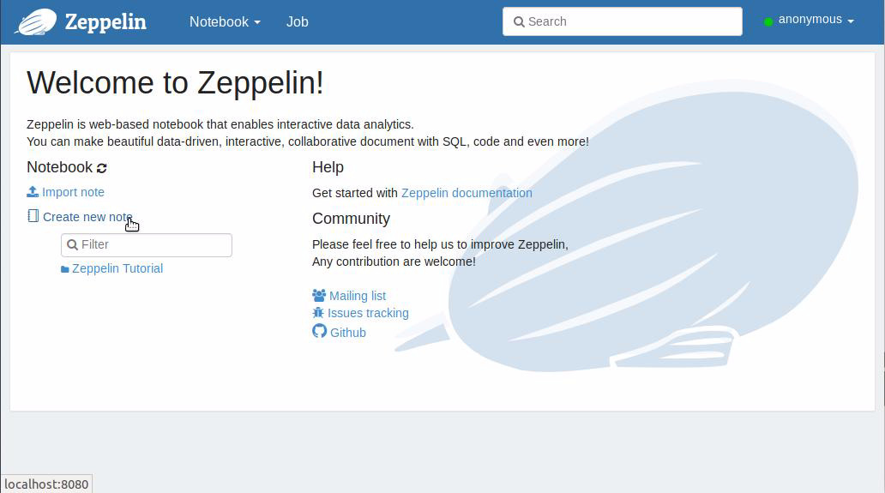
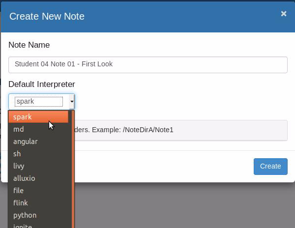
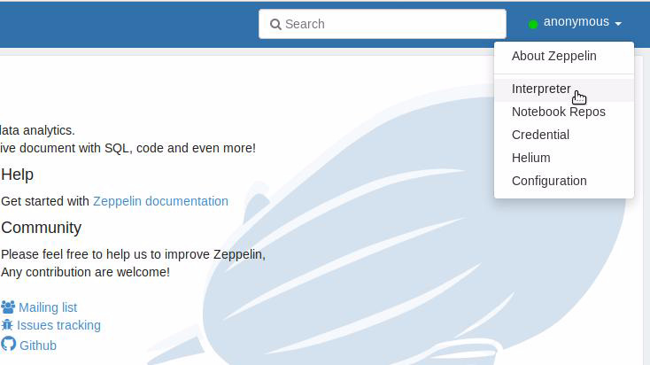
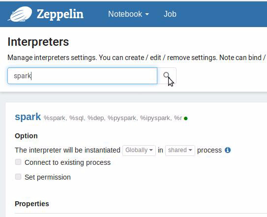
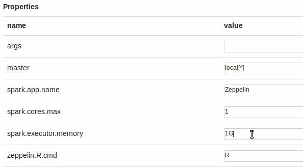
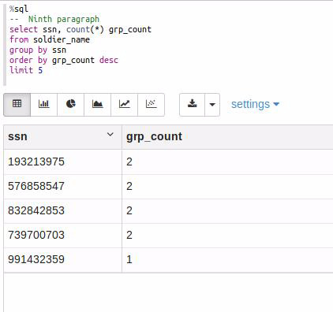
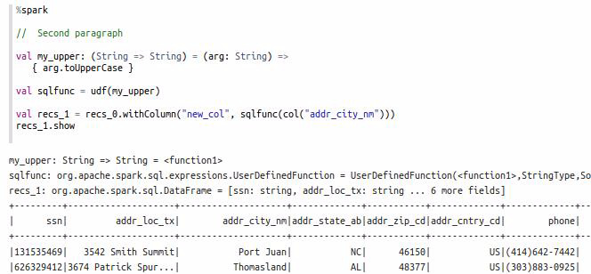
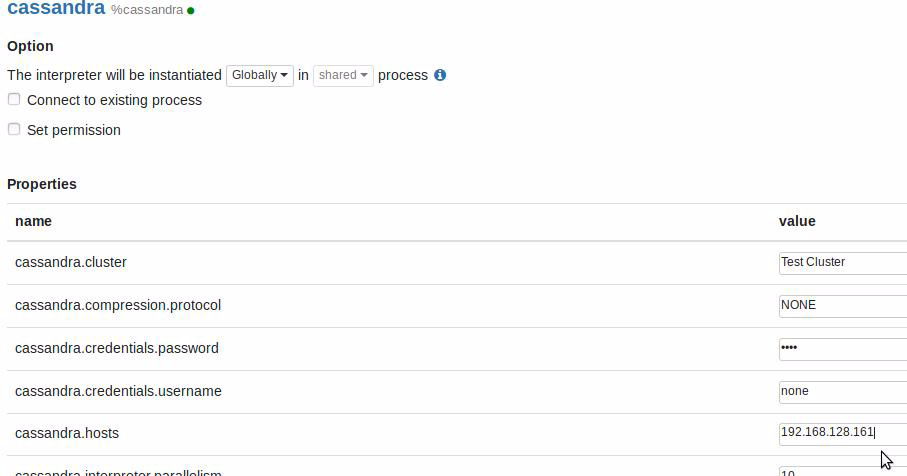
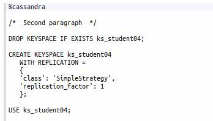

| **[Monthly Articles - 2022](../../README.md)** | **[Monthly Articles - 2021](../../2021/README.md)** | **[Monthly Articles - 2020](../../2020/README.md)** | **[Monthly Articles - 2019](../../2019/README.md)** | **[Monthly Articles - 2018](../../2018/README.md)** | **[Monthly Articles - 2017](../../2017/README.md)** | **[Data Downloads](../../downloads/README.md)** |
|-------------------------|-------------------------|-------------------------|-------------------------|-------------------------|-------------------------|-------------------------|

[Back to 2018 archive](../README.md)
[Download original PDF](../DDN_2018_24_Zeppelin.pdf)

---

# DDN 2018 24 Zeppelin

## Chapter 24. December 2018

DataStax Developer’s Notebook -- December 2018 V1.2

Welcome to the December 2018 edition of DataStax Developer’s Notebook (DDN). This month we answer the following question(s); My developers want a quick and easy way to prototype Spark Scala and Spark Python, and related. I know there are the Spark (Scala) and Python REPLs (read, evaluate, print and loop; command prompts) that ship with DSE, but we want something more. Can you help ? Excellent question ! There are a number of free/open-source options here. In this document we’ll install and use Apache Zeppelin to address this need. DSE Studio, based on Apache Zeppelin, ships with interpreters for; markdown, Spark/SQL, Gremlin, and CQL. Apache Zeppelin ships with 20 or more interpreters, including Spark (Scala), Python, Shell, and more.

## Software versions

The primary DataStax software component used in this edition of DDN is DataStax Enterprise (DSE), currently release 6.7. All of the steps outlined below can be run on one laptop with 16 GB of RAM, or if you prefer, run these steps on Amazon Web Services (AWS), Microsoft Azure, or similar, to allow yourself a bit more resource.

For isolation and (simplicity), we develop and test all systems inside virtual machines using a hypervisor (Oracle Virtual Box, VMWare Fusion version 8.5, or similar). The guest operating system we use is Ubuntu version 18.0, 64 bit.

DataStax Developer’s Notebook -- December 2018 V1.2

## 24.1 Terms and core concepts

Apache Zeppelin (Zeppelin) if a free and open source Web UI with 20 or more command interpreters to run Spark (Scala), Python, Shell, Cassandra, and more. DataStax Studio (Studio) is based on Apache Zeppelin; if you know Studio, you can learn Zeppelin in under 5 minutes.

Zeppelin can operate in server mode, or (single user mode), also referred to as; command mode, or interpreter mode. DataStax Enterprise (DSE) server has a wrapper that sets the relevant environment variables for tools like Apache Zeppelin. If you are operating on a laptop with a DSE serving on localhost,

127.0.0.1, you would be done with configuration. If DSE is serving on a real IP address, small/quick changes are required to find the DSE on the proper IP address.

Zeppelin is downloadable from,

```text
http://zeppelin.apache.org/
http://zeppelin.apache.org/download.html
```

```text
./bin, ./lib,
```

Zeppelin arrives as a Tar ball, and unpacks with a standard,

```text
./conf,
```

etcetera, file system structure. To launch Zeppelin targeting DSE, run a,

```text
cd
( directory containing the Zeppelin distribution )
dse exec ./bin/zeppelin.sh
```

By default, Zeppelin will be available at, localhost:8080. the Zeppelin home page displays similar to that as shown in Figure 24-1.

DataStax Developer’s Notebook -- December 2018 V1.2



*Figure 24-1 Home page, Apache Zeppelin*

In Figure 24-1, the cursor (pointer) is near the link titled, Create new note. Clicking this link produces the dialog box as shown in Figure 24-2.

DataStax Developer’s Notebook -- December 2018 V1.2



*Figure 24-2 Creating first Zeppelin note.*

In Figure 24-2, you can select the default interpreter for the to be newly created Zeppelin note. Comments:

- Zeppelin notes equate to DSE Studio documents. Within a note are paragraphs, which equate to Studio cells. Again; DSE Studio is based on Apache Zeppelin.

- Each paragraph has a single interpreter, in effect; where are these command sent when a paragraph is run. The interpreter is set on the first line of the paragraph with a percent sign tag. For example: •

```text
%sh for
```

Linux Shell

```text
%spark for
```

• Scala •

```text
%cassandra fo
```

r the open source Cassandra Java driver • (Many others)

- As an open source product, Zeppelin ships with the open source Cassandra driver, and not the DSE enterprise driver.

DataStax Developer’s Notebook -- December 2018 V1.2

What this means is that out of the box, you wont be able to run DSE Search queries, or similar. That’s okay; we can run DSE Studio for those.

> Note: You also can not run Gremlin in Zeppelin, but you can run Spark configured to target DSE, including (Spark) GraphFrames).

In a Spark paragraph, you can run any number of imports to bring these libraries into scope.

In Figure 24-3, we access the Zeppelin menu where we can configure any of the interpreters.



*Figure 24-3 Configuring interpreters*

With 20+ interpreters shipping along with Zeppelin, you can scroll through the list of settings for all, or Search. Figure 24-4 displays searching for just Spark (Scala) related settings.

DataStax Developer’s Notebook -- December 2018 V1.2



*Figure 24-4 Searching for just settings related to Spark (Scala)*

Click, Edit, make changes, and then Click, Save. Example as shown in Figure 24-5.

DataStax Developer’s Notebook -- December 2018 V1.2



*Figure 24-5 Setting cores and RAM when running Spark against DSE*

In Figure 24-5, we set the requested number of cores and RAM used when running end user spark jobs against DSE. (The, Save, button is at the very bottom of the display; not pictured.)

You can also run DSE Spark/SQL using Zeppelin. Example as shown in Figure 24-6. This statement will run entirely as Spark, and does not require that DSE Always-on SQL be (running or) configured.

In order for the (SQL table) in Figure 24-6 to be in scope, a DataFrame must be created and then registered via a,

```text
my_dataFrame.registerTempTable("soldier_name")
```

or similar command.

DataStax Developer’s Notebook -- December 2018 V1.2



*Figure 24-6 Running Spark/SQL against DSE*

Figure 24-7 displays running straight up Scala; oddly, the Scala interpreter is

```text
%spark
```

labeled, Spark ( ).

DataStax Developer’s Notebook -- December 2018 V1.2



*Figure 24-7 Accessing the Scala interpreter via Zeppelin*

If DSE is running on localhost, Zeppelin will find it by default. If DSE is operating on another IP address, you will need to configure the Cassandra interpreter.

Example as shown in Figure 24-8.



*Figure 24-8 Setting the Cassandra (DSE) connection IP address.*

DataStax Developer’s Notebook -- December 2018 V1.2

Figure 24-9 displays running Cassandra commands. Again; Zeppelin ships with the open source Cassandra Java driver; you wont be able to run DSE Search or similar (enterprise driver required) DSE commands.



*Figure 24-9 Running Cassandra commands*

## 24.2 Complete the following:

Install Apache Zeppelin.

the worst part is the distribution size; the Zeppelin software on disk is larger the DSE software on disk.

Run;

```text
%sh, %cassandra, %spark
```

, and more.

## 24.3 In this document, we reviewed or created:

This month and in this document we detailed the following:

- We detailed install and use of Apache Zeppelin.

DataStax Developer’s Notebook -- December 2018 V1.2

### Persons who help this month.

Kiyu Gabriel, Jim Hatcher, Alex Ott, and Caleb Rackliffe.

### Additional resources:

Free DataStax Enterprise training courses,

```text
https://academy.datastax.com/courses/
```

Take any class, any time, for free. If you complete every class on DataStax Academy, you will actually have achieved a pretty good mastery of DataStax Enterprise, Apache Spark, Apache Solr, Apache TinkerPop, and even some programming.

This document is located here,

```text
https://github.com/farrell0/DataStax-Developers-Notebook
https://tinyurl.com/ddn3000
```
