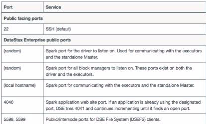
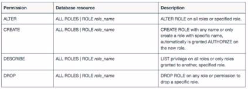
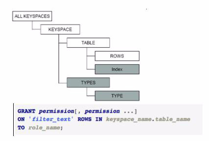

| **[Monthly Articles - 2022](../../README.md)** | **[Monthly Articles - 2021](../../2021/README.md)** | **[Monthly Articles - 2020](../../2020/README.md)** | **[Monthly Articles - 2019](../../2019/README.md)** | **[Monthly Articles - 2018](../../2018/README.md)** | **[Monthly Articles - 2017](../../2017/README.md)** | **[Data Downloads](../../downloads/README.md)** |
|-------------------------|-------------------------|-------------------------|-------------------------|-------------------------|-------------------------|-------------------------|

[Back to 2019 archive](../README.md)
[Download original PDF](../DDN_2019_27_Security.pdf)

## From The Archive

2019 March - -

>Customer: My company was using application server tiered security, and now needs to implement
>database tier level security. Can you help ?
>
>Daniel: Excellent question ! Obviously security is a broad topic; OS level security (the OS
>hosting DSE), database level security, data in flight, data at rest, and more.
>
>Minimally we’ll overview DSE security, and detail how to implement password protection of same.
>
>[Read article online](./README.md)


---

# DDN 2019 27 Security

## Chapter 27. March 2019

DataStax Developer’s Notebook -- March 2019 V1.2

Welcome to the March 2019 edition of DataStax Developer’s Notebook (DDN). This month we answer the following question(s); My company was using application server tiered security, and now needs to implement database tier level security. Can you help ? Excellent question ! Obviously security is a broad topic; OS level security (the OS hosting DSE), database level security, data in flight, data at rest, and more. Minimally we’ll overview DSE security, and detail how to implement password protection of same.

## Software versions

The primary DataStax software component used in this edition of DDN is DataStax Enterprise (DSE), currently release 6.7. All of the steps outlined below can be run on one laptop with 16 GB of RAM, or if you prefer, run these steps on Amazon Web Services (AWS), Microsoft Azure, or similar, to allow yourself a bit more resource.

For isolation and (simplicity), we develop and test all systems inside virtual machines using a hypervisor (Oracle Virtual Box, VMWare Fusion version 8.5, or similar). The guest operating system we use is Ubuntu Desktop version 18.04, 64 bit.

DataStax Developer’s Notebook -- March 2019 V1.2

## 27.1 Terms and core concepts

As stated above, ultimately the end goal is to secure the database server. Topics include:

- Securing the operating system (pre DSE)

- Securing DSE- • Database connections, end user • Data in flight (encryption on the line) • Data at rest (encryption at the disk level) • Securing files; configuration and temporary files • Auditing (was I breached, when, how) • (Other)

Based on whatever source you reference, an average cost for a breach of 1,000 records generally cost between $52,000 and $87,000 US; source Verizon, year

2015.

Minimally, this document details how to implement DSE server level authentication and authorization:

- Authentication, Are you who you say you are

- Authorization, and now that I know who you are, what are you allowed to do

Figure 27-1overviews given security capabilities for given functional areas within DSE. A code review follows.

DataStax Developer’s Notebook -- March 2019 V1.2


*Figure 27-1 Overview of security in DSE 6.0, check for updates-*

Relative to Figure 27-1, the following is offered:

- This chart was produced from the DSE version 6.0 documentation. Obviously there is now release 6.7 of DSE, and even point releases to 6.7. So, check the documentation for your specific release.

- To overcome any (security short comings) in version 6.0, you could of course, limit available data (a subset of data) to a given data center, other. Or, you could implement, for example, data encryption at the operating system level for Apache Spark, other.

DSE Security: Authentication DataStax Enterprise (DSE) inter-nodal communication (gossip, other) authentication is achieved using SSL certificates, which we will say is beyond scope for this document.

Database connections (client to node, tools and applications), is afforded via DSE “unified authentication”, which means;

- Internal to DSE authentication, we detail delivering this below-

- Kerberos • PKI, public key infrastructure • KMIP, key management interoperability protocol

While this document details how to enable the DSE internal authentication, we list a number of Urls on the internal (and external) authentication subsystem configurations-

DataStax Developer’s Notebook -- March 2019 V1.2

- DSE inter-nodal traffic is authenticated using SSL, and the communication can be encrypted. Reference Url, Securing internal transactional node connections

```text
https://docs.datastax.com/en/dse/6.0/dse-admin/datastax_enterp
rise/security/secInternodeSsl.html
```

- Setting up Kerberos Reference Url,

```text
https://docs.datastax.com/en/dse/6.0/dse-admin/datastax_enterp
rise/security/secKerberosTOC.html
```

- Setting up LDAP (LDAP v3 compatible servers) Reference Url,

```text
https://docs.datastax.com/en/dse/6.0/dse-admin/datastax_enterp
rise/security/secLDAPScheme.html
```

Microsoft Active Directory: Windows 2008, Windows 2012, OpenLDAP

2.4.x, Oracle Directory Server Enterprise Edition 11.1.1.7.0

- JConsole, as a client, has special requirements Reference Url, Setting up SSL for jconsole (JMX)

```text
https://docs.datastax.com/en/dse/6.0/dse-admin/datastax_enterp
rise/security/secureJconsoleSSL.html
```

- Client to server communication can be encrypted. Reference Url, Securing client to cluster connections

```text
https://docs.datastax.com/en/dse/6.0/dse-admin/datastax_enterp
rise/security/encryptClientNodeSSL.html
```

- Specific to DSE Search DSE Search (Apache Solr) Solr Admin UI is pre-integrated with Kerberos. DataStax recommends using Kerberos authentication with the Solr Admin UI and when running commands with cURL using the SolrJ API. To authenticate DSE Search clients with Kerberos authentication, use Simple and Protected GSSAPI Negotiation Mechanism (SPNEGO). To use the SolrJ API against DSE Search clusters with Kerberos authentication, client applications must use the SolrJ-Auth library and the DataStax Enterprise SolrJ component as described in the solrj-auth-README.md file. Define Accessing search indexes from Solr Admin UI (deprecated). (Perform index management tasks with the CQL shell using Enabling DSE Unified Authentication.)

DataStax Developer’s Notebook -- March 2019 V1.2

- Specific to DSE Analytics DataStax recommends the following security practices: • Enable client-to-node encryption using SSL. • Spark ports for internode communications should run within a secured network without exposure to outside traffic. • Distinct secrets for internode and per application, see Configuring Spark nodes. • Native authentication for users of each application executor (run as) and isolation of related data, see Configuring Spark nodes. • Spark UI internal or LDAP authentication, see Monitoring Spark with the web interface. • User authentication for Spark jobs. DataStax Enterprise supports internal, LDAP, and Kerberos authentication for Spark. Internal and LDAP: For DataStax Enterprise Spark applications and tools, use the Spark authentication commands to provide the authentication credentials, see Running spark-submit job with internal authentication. Kerberos: Defining a Kerberos scheme applies to connecting Spark to DSE database, not authenticating Spark components between each other. The Spark Web UI is not secured, so some parameters passed to the executor in the command line might be visible. However, the DSE username, password, and delegation token are hidden. By default, when Kerberos is the only authentication scheme, the Spark UI is inaccessible, so UI authorization must be disabled.

- Specific to DSE Graph DataStax Enterprise supports secure enterprise graph-database operations. DSE Graph data is completely or partially secured by using DataStax Enterprise security features: Allow only authenticated users to access DSE Graph data by enabling DSE Unified Authentication on the transactional database and configure credentials in the DSE Graph remote.yaml.

DSE Security: Authorization Role based access control (RBAC) is available using DSe, when authentication is enabled.

Using the internal authentication, there is a 1 to 1 mapping of user name to roles. Using LDAP, there is a one to many mapping, user assigned roles that match groups in LDAP.

More on authorization:

DataStax Developer’s Notebook -- March 2019 V1.2

- Specific to DSE Search Reference Urls, Managing search index permissions

```text
https://docs.datastax.com/en/dse/6.0/dse-admin/datastax_enterp
rise/security/secSearchIndexPermissions.html
```

Setting row-level permissions with row-level access control (RLAC) is not supported for use with DSE Search or DSE Graph.

- Specific to DSE Analytics Data pulled from the database for Spark jobs and access control for Spark application submissions is protected by role-based access control (RBAC). The user running the request must have permission to access the data through their role assignment. No authorization for the Spark UI master and workers is available.

- Specific to DSE Graph Reference Urls, Managing access to DSE Graph keyspaces

```text
https://docs.datastax.com/en/dse/6.0/dse-admin/datastax_enterp
rise/security/secRbacGraph.html
```

Limit access to graph data by defining roles for DSE Graph keyspaces and tables, see Managing access to DSE Graph keyspaces. RBAC does not apply to cached data. Setting row-level permissions with row-level access control (RLAC) is not supported for use with DSE Search or DSE Graph. Grant execute permissions for the DseGraphRpc object to the defined roles.

- Graph Sandbox- Enabled by default, the Graph sandbox can be configured to allow or disallow execution of Java packages, super-classes, and types, see,

```text
https://docs.datastax.com/en/dse/6.0/dse-admin/datastax_enterp
rise/graph/config/configGraphSandbox.html
```

DSE: Encryption of data in flight SSL encryption of data in flight is available for the following DSE functional areas:

- DSE transactional nodes

- DSE Search (Apache Solr)

- DSE Analytics (Apache Spark)

- DSE Graph

- DSE tools

DataStax Developer’s Notebook -- March 2019 V1.2

- DSE drivers

- DSE OpsCenter

More:

- Reference Urls,

```text
https://docs.datastax.com/en/dse/6.0/dse-admin/datastax_enterp
rise/security/secSslTOC.html
```

- Using CQL shell (cqlsh) with SSL,

```text
https://docs.datastax.com/en/dse/6.0/dse-admin/datastax_enterp
rise/security/usingCqlshSslAndKerberos.html
```

- Setting up SSL for nodetool, dsetool, and dse advrep

```text
https://docs.datastax.com/en/dse/6.0/dse-admin/datastax_enterp
rise/security/secureToolSSL.html
```

- Setting up SSL for jconsole (JMX)

```text
https://docs.datastax.com/en/dse/6.0/dse-admin/datastax_enterp
rise/security/secureJconsoleSSL.html
```

- Connecting sstableloader to a secured cluster

```text
https://docs.datastax.com/en/dse/6.0/dse-admin/datastax_enterp
rise/security/secSstableloaderSsl.html
```

- Other loaders, other- See documentation specific to each

DSE: Encryption at rest Relative to DataStax Enterprise (DSE) “transparent data encryption” (TDE), the following is offered: You can encrypt,

- Entire tables (except for partition keys which are always stored in plain text).

- SSTables containing data, including system tables (such as system.batchlog and system.paxos)

- Search indexes

- File-based Hints (in DSE 5.0 and later)

- Commit logs

- Sensitive properties in dse.yaml and cassandra.yam

DataStax Developer’s Notebook -- March 2019 V1.2

You may not encrypt using DSE,

- TDE only applies to data stored in the database. DSE does not support encrypting data that is used by Spark and stored in DSEFS or local temporary directories.

- Graph: Cached data is not encrypted. Encryption may slightly impact performance.

Reference Urls,

```text
https://docs.datastax.com/en/dse/6.0/dse-admin/datastax_enterprise/s
ecurity/secEncryptTDE.html
```

Encrypting Search indexes,

```text
https://docs.datastax.com/en/dse/6.0/dse-admin/datastax_enterprise/s
ecurity/secEncryptSearch.html
```

DSE: Securing ports, temporary directories (JNA) Figure 27-2 displays the first of 30 or more ports in use by DSE. A code review follows.



*Figure 27-2 Ports needing security attention using DSE*

Relative to Figure 27-2, the following is offered:

- The above is a screen capture of a documentation page available at,

DataStax Developer’s Notebook -- March 2019 V1.2

```text
https://docs.datastax.com/en/dse/6.0/dse-admin/datastax_enterp
rise/security/secFirewallPorts.html
```

- Securing any temporary directories using JNA is documented at,

```text
https://docs.datastax.com/en/dse/6.0/dse-admin/datastax_enterp
rise/security/secTmp.html
```

DSE: Role based access control (RBAC) Role based access control (RBAC) using DSE is similar to the same feature in most RDBMS(s). Sample syntax as displayed in Figure 27-3. A code review follows.



*Figure 27-3 RBAC using DSE*

Relative to Figure 27-3, the following is offered:

- The diagram above is captured from,

```text
https://docs.datastax.com/en/dse/6.0/dse-admin/datastax_enterp
rise/security/secRBAC.html
```

- Additionally, to better serve multi-tenancy, DSE can suppress display of keyspace names- • In the cassandra.yaml file, set system_keyspaces_filtering to true • To view a keyspace, the user/role needs DESCRIBE permission on a keyspace.

DSE object hierarchy for permissions, RLAC Figure 27-4 displays the object hierarchy for row level access control (RLAC). A code review follows.

DataStax Developer’s Notebook -- March 2019 V1.2



*Figure 27-4 DSE object hierarchy*

Relative to Figure 27-4, the following is offered:

- The diagram above was produced from information posted at,

```text
https://docs.datastax.com/en/dse/6.0/dse-admin/datastax_enterp
rise/security/secDataResourcesAbout.html
```

- RLAC is disabled by default. To enable, set allow_row_level_security to true in the dse.yaml file.

DSE audit secure subsystem DataStax Enterprise (DSE) supports capturing database activity to a log file or table. the audit logger also captures queries and prepared statements submitted by DataStax drivers which use the CQL binary protocol.

Use cases include:

- Security logging, separation of duties

- Tuning, capacity planning

Reference Urls,

```text
– https://docs.datastax.com/en/dse/6.0/dse-admin/datastax_enterprise/
security/secAuditTOC.html
```

- Log formats

DataStax Developer’s Notebook -- March 2019 V1.2

```text
https://docs.datastax.com/en/dse/6.0/dse-admin/datastax_enterp
rise/security/secAuditLogFormat.html
```

- Viewing events

```text
https://docs.datastax.com/en/dse/6.0/dse-admin/datastax_enterp
rise/security/secAuditTableColumns.html
```

## 27.2 Complete the following

In this section of this document, we enable and test DSE authentication and authorization using the internal DSE (password mechanism).

Comments:

- Instructions are provided for a single node DSE cluster, and all work as demonstrated as the root user. Generally though, the procedures are similar to multi-node, other.

- With a multi-node system, no downtime is required to make this change.

> Note: Implementing authorization/authentication can be done without downtime.

Client programs are rolled out using the TRANSITIONAL client side driver switch. See,

```text
https://docs.datastax.com/en/dse/5.1/dse-admin/datastax_enterpris
e/security/Auth/secProductionEnvironment.html
```

Server side, not server outage is achieved using a rolling restart.

- And instructions are provided for testing at the command prompt using CQLSH.

In the real world, you should change the replication strategy and

> Note: replication factor on a number of system keyspaces (specifically those that store password information).

See,

```text
https://docs.datastax.com/en/dse/5.1/dse-admin/datastax_enterpris
e/security/secSystemKeyspace.html
```

Specifically we want to change;

```text
system_auth
```

and

```text
dse_security
```

DataStax Developer’s Notebook -- March 2019 V1.2

> Note: Follow changes to replication strategy and replication factor with a “nodetool repair” similar to,

```text
nodetool repair --full system_auth
nodetool repair --full dse_security
```

Create a keyspace for later use Example 27-1 creates a keyspace, table and data for continued use in this section.

### Example 27-1 Creating a keyspace

```text
DROP KEYSPACE IF EXISTS ks_6221;
```

```text
CREATE KEYSPACE ks_6221
WITH REPLICATION =
{'class': 'SimpleStrategy',
'replication_factor': 1};
```

```text
USE ks_6221;
```

```text
DROP TABLE IF EXISTS cust_orders;
```

```text
CREATE TABLE cust_orders
(
region TEXT,
cust_name TEXT,
ord_num INT,
other TEXT,
PRIMARY KEY ((region, cust_name),
ord_num)
);
```

```text
INSERT INTO cust_orders
(region, cust_name, ord_num, other)
VALUES ('EMEA', 'IKEA' , 101, 'Shoes' );
...
VALUES ('NA' , 'SEARS' , 101, 'Shoes, Washer');
VALUES ('NA' , 'SEARS' , 102, 'Oranges' );
VALUES ('NA' , 'MACYS' , 101, 'Dress, Tie' );
```

```text
DROP TABLE IF EXISTS cust_payments;
```

```text
CREATE TABLE cust_payments
(
cust_name TEXT,
```

DataStax Developer’s Notebook -- March 2019 V1.2

```text
payment_num INT,
other TEXT,
PRIMARY KEY ((cust_name, payment_num))
);
INSERT INTO cust_payments (cust_name,
payment_num, other)
VALUES ('SEARS' , 101, '$100');
...
VALUES ('MACYS' , 101, '$200');
```

Affect these changes in cassandra.yaml, dse.yaml In the cassandra.yaml file, confirm, set or eventually tune the following:

- Confirm the default settings are in place,

```text
authenticator:
com.datastax.bdp.cassandra.auth.DseAuthenticator
role_manager: com.datastax.bdp.cassandra.auth.DseRoleManager
```

- If doing RLAC (we are), eventually consider tuning the following,

```text
# Uncomment any that are commented
# permissions_cache_max_entries not present in 6.0
permissions_validity_in_ms: 2000
permissions_uddate_interval_in_ms: 2000
permissions_cache_max_entries: 1000
```

- Documentation to the above,

```text
https://docs.datastax.com/en/dse/5.1/dse-admin/datastax_enterp
rise/security/secRlac.html
https://docs.datastax.com/en/dse/5.1/dse-admin/datastax_enterp
rise/security/secAuthCacheSettings.html#secAuthCacheSettings__
cache
```

In the dse.yaml file, confirm, or set the following,

```text
# Uncomment all
# Set, enabled: true
# Ensure, default_scheme: internal
authentication_options:
enabled: true
```

DataStax Developer’s Notebook -- March 2019 V1.2

```text
default_scheme: internal
other_schemes:
scheme_permissions: false
allow_digest_with_kerberos: true
plain_text_without_ssl: warn
transitional_mode: disabled
# Uncomment
role_management_options:
mode: internal
# Uncomment
# Set, enabled: true
authorization_options:
enabled: true
transitional_mode: disabled
allow_row_level_security: true
```

DSE Security: reboot DSE Rebooting is not required for production systems, but is easier and does involve fewer steps. And, in production you could do a rolling restart of multiple nodes to prevent any outage.

Check the boot screen/log for error messages.

Actually implementing ROLES, other Example 27-2 creates the roles, other. A code review follows.

### Example 27-2 Creating the roles, other

```text
DROP ROLE IF EXISTS bob ;
DROP ROLE IF EXISTS nancy ;
DROP ROLE IF EXISTS dirk ;
```

```text
DROP ROLE IF EXISTS senior_operator;
DROP ROLE IF EXISTS operator ;
DROP ROLE IF EXISTS operator_na ;
```

```text
CREATE ROLE bob WITH LOGIN = true AND PASSWORD = 'password';
GRANT EXECUTE on INTERNAL SCHEME to bob ;
```

DataStax Developer’s Notebook -- March 2019 V1.2

```text
CREATE ROLE nancy WITH LOGIN = true AND PASSWORD = 'password';
GRANT EXECUTE on INTERNAL SCHEME to nancy;
CREATE ROLE dirk WITH LOGIN = true AND PASSWORD = 'password';
GRANT EXECUTE on INTERNAL SCHEME to dirk ;
```

```text
CREATE ROLE senior_operator;
```

```text
// INSERT, UPDATE, DELETE and TRUNCATE rows in
// any table in the specified keyspace.
// ADD SELECT
GRANT MODIFY, SELECT ON KEYSPACE ks_6221 TO senior_operator;
GRANT senior_operator to nancy;
```

```text
CREATE ROLE operator;
```

```text
GRANT MODIFY,SELECT ON TABLE ks_6221.cust_orders TO operator;
GRANT SELECT ON TABLE ks_6221.cust_payments TO operator;
```

```text
GRANT operator to bob;
```

```text
CREATE ROLE operator_na;
```

```text
// RESTRICT ROWS ON ks_6221.cust_orders USING other;
// InvalidRequest: Error from server: code=2200 [Invalid query]
// message="Restrict Rows Statement must be for a Primary Key
// or a Partition Key column"
```

```text
RESTRICT ROWS ON ks_6221.cust_orders USING region;
RESTRICT ROWS ON ks_6221.cust_orders USING cust_name;
// DESCRIBE TABLE shows cust_name only
```

```text
RESTRICT ROWS ON ks_6221.cust_orders USING region;
```

```text
GRANT SELECT ON 'NA' ROWS IN ks_6221.cust_orders TO operator_na;
GRANT operator_na to dirk;
```

Relative to Example 27-2, the following is offered:

- The first CREATE ROLE / GRANT pair details how to add a user titled, “bob”, with password valued as “password”. This block repeats for two additional users. Using internal DSE authentication, this is how users are created.

DataStax Developer’s Notebook -- March 2019 V1.2

- Then we create a ROLE which will be used by a group of users titled, “senior_operator”. This role is given; MODIFY and SELECT. And we give this role to “nancy”.

- And we create the ROLE titled, “operator”.

- The ROLE titled, “operator_na”, is associated with a RESTRICT modifier, so that it can (view) a given subset of records in the table as a whole.

- And this ROLE is given to “dirk”.

> Note: The error messages displayed (and commented out), detail that the RESTRICT is partition in scope.

Test using CQLSH Logon to DSE using CQLSH for each of the three users as shown,

```text
cqlsh -u nancy -p password
cqlsh -u bob -p password
cqlsh -u dirk -p password
```

```text
use ks_6221;
```

```text
select * from cust_orders;
select * from cust_payments;
```

Dirk should only be able to see a subset of records.

## 27.3 In this document, we reviewed or created:

This month and in this document we detailed the following:

- An overview of security related to DSE.

- We detailed the specific steps to implement row level access control.

### Persons who help this month.

DataStax Developer’s Notebook -- March 2019 V1.2

Kiyu Gabriel, and Jim Hatcher.

### Additional resources:

Free DataStax Enterprise training courses,

```text
https://academy.datastax.com/courses/
```

Take any class, any time, for free. If you complete every class on DataStax Academy, you will actually have achieved a pretty good mastery of DataStax Enterprise, Apache Spark, Apache Solr, Apache TinkerPop, and even some programming.

This document is located here,

```text
https://github.com/farrell0/DataStax-Developers-Notebook
https://tinyurl.com/ddn3000
```
