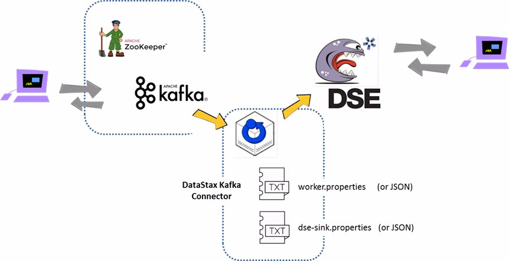

| **[Monthly Articles - 2022](../../README.md)** | **[Monthly Articles - 2021](../../2021/README.md)** | **[Monthly Articles - 2020](../../2020/README.md)** | **[Monthly Articles - 2019](../../2019/README.md)** | **[Monthly Articles - 2018](../../2018/README.md)** | **[Monthly Articles - 2017](../../2017/README.md)** | **[Data Downloads](../../downloads/README.md)** |
|-------------------------|-------------------------|-------------------------|-------------------------|-------------------------|-------------------------|-------------------------|

[Back to 2019 archive](../README.md)
[Download original PDF](../DDN_2019_29_Kafka.pdf)

## From The Archive

2019 May - -

>Customer: As a developer I’ve been using Redis for 6 years, and now my company tells me I have to move
>all of my work to Apache Kafka. Can you help ?
>
>Daniel: Excellent question ! Management, huh ? We say that because Redis and Kafka are not the same.
>In fact, Redis seems to have really re-energized in the past 4 years, with many strategic enhancements.
>Redis has held the number four spot on DB-Engines.com database ranking for some time. Kafka, while
>used by nearly everyone, seems to place 60% of their workloads serving mainframe off loads; guaranteed
>message delivery possibly to multiple consumers. (A scale out of subscribe in publish/subscribe.)
>
>In this document, we’ll install and configure a single node (stand alone) Kafka cluster, learn to write
>and read messages, and install and configure the DataStax Kafka Connector (Kafka Connector). Using the
>Kafka Connector, you can push Kafka messages into DataStax Enterprise and the DataStax Distribution of
>Cassandra (DDAC) without writing any program code. Cool.
>
>[Read article online](./README.md)


---

# DDN 2019 29 Kafka

## Chapter 29. May 2019

DataStax Developer’s Notebook -- May 2019 V1.2

Welcome to the May 2019 edition of DataStax Developer’s Notebook (DDN). This month we answer the following question(s); As a developer I’ve been using Redis for 6 years, and now my company tells me I have to move all of my work to Apache Kafka. Can you help ? Excellent question ! Management, huh ? We say that because Redis and Kafka are not the same. In fact, Redis seems to have really re-energized in the past 4 years, with many strategic enhancements. Redis has held the number four spot on DB-Engines.com database ranking for some time. Kafka, while used by nearly everyone, seems to place 60% of their workloads serving mainframe off loads; guaranteed message delivery possibly to multiple consumers. (A scale out of subscribe in publish/subscribe.) In this document, we’ll install and configure a single node (stand alone) Kafka cluster, learn to write and read messages, and install and configure the DataStax Kafka Connector (Kafka Connector). Using the Kafka Connector, you can push Kafka messages into DataStax Enterprise and the DataStax Distribution of Cassandra (DDAC) without writing any program code. Cool.

## Software versions

The primary DataStax software component used in this edition of DDN is DataStax Enterprise (DSE), currently early release 6.8. All of the steps outlined below can be run on one laptop with 16 GB of RAM, or if you prefer, run these steps on Amazon Web Services (AWS), Microsoft Azure, or similar, to allow yourself a bit more resource.

For isolation and (simplicity), we develop and test all systems inside virtual machines using a hypervisor (Oracle Virtual Box, VMWare Fusion version 8.5, or similar). The guest operating system we use is Ubuntu Desktop version 18.04, 64 bit.

DataStax Developer’s Notebook -- May 2019 V1.2

## 29.1 Terms and core concepts

As stated above, ultimately the end goal is to complete a primer on Kafka for developers, and install and configure the DataStax Kafka Connector, so we may push Kafka messages into DataStax Enterprise (DSE), or the DataStax Distribution of Cassandra (DDAC), without writing any program code.

> Note: In this document we use versions; – Apache Kafka 2.2.1 (matches Scala version 2.12) – DSE 6.8, currently in early release (you can use earlier versions and/or DDAC) – DataStax Kafka Connector version 1.1.0

Figure 29-1displays the software we use in edition of DataStax Developers Notebook (DDN). A code review follows.



*Figure 29-1 Software we use in this document.*

Relative to Figure 29-1, the following is offered:

- All of the software above is Java/Scala based, and requires a Java JRE. We used a Java JDK (which includes a JRE) version 1.8. This document, and this discussion, detail running all of this software on one node, one laptop; developer mode, aka, standalone mode. Of course, in production, all of these services can be distributed, multi-node.

DataStax Developer’s Notebook -- May 2019 V1.2

- Apache Kafka arrives as a Tar ball, and includes a required Apache Zookeeper. Per Wikipedia.com, Kafka is, “a unified, high-throughput, low-latency platform for handling real-time data feeds. Its storage layer is essentially a massively scalable pub/sub message queue designed as a distributed transaction log .. ” Per Wikipedia.com, Zookeeper is, “used to provide a distributed configuration service, synchronization service, and naming registry for large distributed systems .. “ You will start Zookeeper, running in its own JVM, then start Kafka, running in its own JVM. Generally, expect that any associated configuration files (IP address, ports, other), are fine by default; not requiring modification. The purple terminal is meant to display that end user will/can interact with Kafka directly, to publish/subscribe.

- DataStax Enterprise (DSE) is displayed, arriving in its own Tar ball, running in its own JVM, and interacting with users (the purple terminal), doing what DSE does.

- A third new piece, is the DataStax Kafka Connector (Kafka Connector). The Kafka Connector arrives as a Tar ball, and runs in its own JVM. The Kafka Connector will require at least two configuration files, which you must edit. Comments include; • Generally, we will refer to these files as; the “worker properties” file, and the “dse-sink properties” file.

> Note: A “properties” file is ASCII text, and in the format of,

```text
key1=value
key2.subkey1=value
key2.subkey2=value
key3=value
...
```

When using the Kafka Connector in standalone mode, (developer mode, single node), you will use properties files here.

Odd fact; when using the Kafka Connector in distributed mode (production, multi-node mode), you do not use properties files, and instead use the same two functioned files, but in JSON format.

DataStax Developer’s Notebook -- May 2019 V1.2

• In this document, we present the worker properties file and dse-sink file in a one to one relationship, meaning; one source (one worker properties file), one target (one dse-sink properties file), read/used by one Kafka Connector.

> Note: In reality, there’s more you can do here; – One Kafka topic can be written to multiple DSE tables. – Multiple Kafka topics can be written to a single DSE table. – (Other.)

- And there can be multiple converters/serializers . Similar to the Apache Map/Reduce input-reader (and output-writer), Kafka is really just a key/value store. The value served by Kafka is just a byte stream, and the value Kafka provides can be formatted (serialized) using; JSON, AVRO, (simple types; I.e., string), JDBC, other. So, the worker properties file must be told how the incoming data is serialized so that the byte stream can be converted for any downstream consumer; in our case, the Kafka Connector. (If you are familiar with Apache Spark, this conversion is not dissimilar to moving from an opaque RDD, to the schema’d DataFrame.)

This is a primary function of the worker properties file, in effect; describe the source. The dse-sink properties file describes the target; where the data will land inside DSE.

## 29.2 Complete the following

In this section of this document, we will install and configure a single node (standalone) Apache Kafka, which includes the requisite Apache Zookeeper, local to the same node as our DataStax Enterprise (DSE). And we install and configure the DataStax Kafka Connector (Kafka Connector).

DataStax Developer’s Notebook -- May 2019 V1.2

## 29.2.1 Installing, booting Zookeeper and Kafka

Download the Zookeeper and Kafka bundle from,

```text
https://kafka.apache.org/downloads
```

```text
/opt/kafka
```

A Tar ball, unpack the above file. We put ours in , and added

```text
/opt/kafka/bin
```

to our PATH.

```text
export PATH=${PATH}:/opt/kafka/bin
```

Boot Zookeeper, then Kafka.

```text
zookeeper-server-start.sh /opt/kafka/config/zookeeper.properties
kafka-server-start.sh /opt/kafka/config/server.properties
```

The above will run each process, Zookeeper and Kafka, in the foreground, tying up your terminal. This is our preference, since server message will be presented on the screen; easier for debugging, tracing.

> Note: Start Zookeeper first, then Kafka. To shutdown, stop Kafka, then stop Zookeeper.

```text
kafka-server-stop.sh
zookeeper-server-stop.sh
```

If you want to nuke for morbid (start over), delete these two data and configuration subdirectories,

```text
rm -fr /tmp/kafka-logs /tmp/zookeeper
```

At this point, you can publish and subscribe (receive) messages through Kafka. You will need a “topic” first. Example 29-1 details this step and more. A code review follows.

### Example 29-1 Kafka, adding a topic, and install verify

```text
# List topics
kafka-topics.sh --list --zookeeper localhost:2181
```

```text
# Add a topic
kafka-topics.sh --create --zookeeper localhost:2181 --replication-factor 1
--partitions 1 --topic t1
```

```text
# Delete a topic
kafka-topics.sh --zookeeper localhost:2181 --delete --topic t1 --force
```

```text
# Produce a message
sleep 5
```

DataStax Developer’s Notebook -- May 2019 V1.2

```text
echo "Blah blah 1" | kafka-console-producer.sh --broker-list localhost:9092
--topic t1
echo "Blah blah 2" | kafka-console-producer.sh --broker-list localhost:9092
--topic t1
```

```text
# Consume a message [ CONTROL-D ]
kafka-console-consumer.sh --bootstrap-server localhost:9092 --topic t1
--from-beginning
kafka-console-consumer.sh --bootstrap-server localhost:9092 --topic t1
```

Relative to Example 29-1, the following is offered:

- The first command lists any topics existing within Kafka. Initially this command should return no rows.

- Then we create a topic, listing the port to Zookeeper, which is the Kafka configuration manager. If Kafka were multi-node, Zookeeper would propagate this (create topic) command across all Kafka nodes. Our topic name is, t1.

- Delete a topic, so that you have this command.

> Note: Want more ?

This section is basically a shorthand version of the Apache Kafka quick start available at,

```text
http://kafka.apache.org/documentation/#quickstart
```

```text
kafka-console-producer
```

– is a command line utility that allows you to send messages to Kafka. We add a “sleep 5” so you have opportunity to run these commands, then proceed to the next step and see the messages arrive in your client.

```text
kafka-console-consumer
```

– allows you to pull messages from a Kafka topic. Two versions are offered; • Pull messages from the known epoch. • And just pull newly arrived messages.

DataStax Developer’s Notebook -- May 2019 V1.2

> Note: As the example above is presented, we are sending a single text string with no schema to the named Kafka topic. This data would not be appropriate to insert into DSE, as there is no schema. (No column headers, other.)

The above was presented as an install verify; is Kafka working.

## 29.2.2 DataStax Enterprise (DSE)

In this example, we assume an operating DSE local (co-located) to our Kafka instance, and using the DSE server IP address of localhost, 127.0.0.1.

We do need a keyspace and table to receive our Kafka messages, as presented in Example 29-2. No code review is offered.

### Example 29-2 Basic DSE keyspace and table.

```text
DROP KEYSPACE IF EXISTS ks_29;
```

```text
CREATE KEYSPACE ks_29 WITH REPLICATION =
{'class': 'SimpleStrategy', 'replication_factor': 1};
```

```text
USE ks_29;
```

```text
CREATE TABLE dse_t1
(
d_col1 TEXT,
d_col2 TEXT,
d_col3 TEXT,
d_col4 TEXT,
PRIMARY KEY ((d_col1), d_col2)
)
WITH CLUSTERING ORDER BY (d_col2 DESC);
```

```text
SELECT * FROM dse_t1;
```

## 29.2.3 Install, configure and boot of the DataStax Kafka Connector

Somewhat unrelated, let’s first make a new Kafka topic for this Kafka Connector with a,

```text
kafka-topics.sh --create --zookeeper localhost:2181
--replication-factor 1 --partitions 1 --topic kafka_t2
```

DataStax Developer’s Notebook -- May 2019 V1.2

```text
kafka_t2
```

The title of this Kafka topic is, .

Download the DataStax Kafka Connector (Kafka Connector) from,

```text
https://downloads.datastax.com/
```

```text
/opt/kafka_connector
```

A Tar ball, unpack the above file. We put ours in .

To keep this distribution clean, we create a new directory titled,

```text
/opt/kafka_plugins
```

, and do some work there.

```text
mkdir /opt/kafka_plugins
chmod 777 /opt/kafka_plugins
#
cp /opt/kafka_connector/*.jar /opt/kafka_plugins
```

```text
kafka_plugins
```

If effect, everything else will go in the “ ” directory. Totally anal retentive, but that’s how we do things.

Create a “worker properties” file. Example as shown in Example 29-3. A code review follows.

### Example 29-3 worker.properties file

```text
bootstrap.servers=localhost:9092
```

```text
group.id=json-example-group
```

```text
key.converter=org.apache.kafka.connect.storage.StringConverter
value.converter=org.apache.kafka.connect.json.JsonConverter
```

```text
key.converter.schemas.enable=false
value.converter.schemas.enable=false
```

```text
# The internal converter used for offsets, config, and status
# data is configurable and must be specified, but most users
# will always want to use the built-in default. Offset, config,
# and status data is never visible outside of Kafka Connect
# in this format.
internal.key.converter=org.apache.kafka.connect.json.JsonConverter
internal.value.converter=org.apache.kafka.connect.json.JsonConverter
internal.key.converter.schemas.enable=false
internal.value.converter.schemas.enable=false
```

```text
offset.storage.topic=connect-offsets
offset.storage.replication.factor=1
```

DataStax Developer’s Notebook -- May 2019 V1.2

```text
config.storage.topic=connect-configs
config.storage.replication.factor=1
status.storage.topic=connect-status
status.storage.replication.factor=1
```

```text
offset.flush.interval.ms=10000
```

```text
plugin.path=/opt/kafka_plugins/kafka-connect-dse-1.1.0.jar
```

```text
offset.storage.file.filename=/opt/kafka_plugins/file.txt
```

> Note: Again, we use properties files for standalone, single node (developer mode) installs. We use a JSON formatted file of the same purpose, other, when doing multi-node.

Relative to Example 29-3, the following is offered:

- Generally, this file configures the source data side; the Kafka side.

- The first line gives us the Kafka listen port number, 9092, the default.

- Several required, but boiler-plate’ish lines in this entire file. The next important lines are,

```text
key.converter=org.apache.kafka.connect.storage.StringConverter
value.converter=org.apache.kafka.connect.json.JsonConverter
```

Here we state that the Kafka topic has, as its value, a string, and that we should apply a JSON converter as we send this value (downstream).

> Note: The “Blah Blah” values we sent to the Kafka topic titled, t1, earlier ?

This value was not JSON encoded and would fail to convert; this data would never make it to our consumer, a DSE table.

- The next two, required and not default, lines that are required are,

```text
plugin.path=/opt/kafka_plugins/kafka-connect-dse-1.1.0.jar
offset.storage.file.filename=/opt/kafka_plugins/file.txt
plugin.path
```

The value to will be used below to specify the JAR file location of the Kafka Connector. This JAR will be used below.

DataStax Developer’s Notebook -- May 2019 V1.2

```text
offset.storage.file.filename
```

entry is required for standalone configuration only. (It is not required for multi-node, production use. In this example, we do not even use this file.)

Create a dse-sink.properties file. Example as shown in Example 29-4. A code review follows.

### Example 29-4 dse-sink.properties

```text
name=my-sink
```

```text
connector.class=com.datastax.kafkaconnector.DseSinkConnector
```

```text
tasks.max=1
contactPoints=127.0.0.1
loadBalancing.localDc=DC1
```

```text
topics=kafka_t2
```

```text
topic.kafka_t2.ks_29.dse_t1.mapping=d_col1=value.k_col1,d_col2=value.k_col2,d_c
ol3=value.k_col3,d_col4=value.k_col4
```

Relative to Example 29-4, the following is offered:

- The first line in this file names this destination (subscriber, this sink).

```text
connector.class
```

- The is named. In effect, which class to pull from the JAR file specified above.

```text
tasks.max
```

– specifies the number of threads (parallelism) to operate inside the JVM, the Kafka connector process we are about to start.

```text
contactPoints
```

– specifies the listening IP address of our target DSE. And

```text
loadBalancing.localDc
```

specifies the DSE data center within that DSE cluster.

> Note: DC1 is the default DSE data center name. Or, use the DSE command

```text
dsetool ring
```

line utility titled, “ ” to get your available DSE data enter names.

```text
topics
```

– specifies the Kafka topic we wish to subscribe to.

DataStax Developer’s Notebook -- May 2019 V1.2

```text
topic.*.mapping
```

- And then is a key name that specifies the mapping of Kafka columns to DSE table columns.

```text
destination=source
```

• The format is , (repeat) • The first entry,

```text
d_col1=value.k_col1
```

states that the DSE table column titled, d_col1, is to receive the value of the Kafka column titled, k_col1.

```text
value
key
```

While you might always use , another valid entry here is, , as in key (column) name. Entries here are comma delimited.

> Note: Want to learn more ?

The documentation page to the DataStax Kafka connector is at,

```text
https://docs.datastax.com/en/kafka/doc
```

And one of the developers maintains a very thorough GitHub examples page at,

```text
https://github.com/datastax/kafka-examples
```

And start the DataStax Kafka Connector with a,

```text
connect-standalone.sh /opt/kafka_plugins/15_worker.properties
/opt/kafka_plugins/16_my-sink.properties
```

Relative to the above,

- connect-standalone.sh is a Kafka utility to start a worker.

- the first argument is the absolute pathname to the worker properties file.

- The second argument is the absolute pathname to the dse-sink properties file.

## 29.2.4 Testing our work, testing the Kafka Connector

At this point in this document, all is configured and ready for use. Let’s send some messages to Kafka via the lines in Example 29-5. A code review follows.

DataStax Developer’s Notebook -- May 2019 V1.2

### Example 29-5 Testing the Kafka Connector, sample JSON data

```text
echo "{ \"k_col1\" : \"aaa\", \"k_col2\" : \"aaa\", \"k_col3\" : \"aaa\",
\"k_col4\" : \"aaa\"}" | kafka-console-producer.sh --broker-list localhost:9092
--topic kafka_t2
echo "{ \"k_col1\" : \"bbb\", \"k_col2\" : \"bbb\", \"k_col3\" : \"bbb\",
\"k_col4\" : \"bbb\"}" | kafka-console-producer.sh --broker-list localhost:9092
--topic kafka_t2
```

```text
echo "{ \"k_col1\" : \"ccc\", \"k_col2\" : \"ccc\", \"k_col3\" : \"ccc\",
\"k_col4\" : \"ccc\"}" | kafka-console-producer.sh --broker-list localhost:9092
--topic kafka_t2
echo "{ \"k_col1\" : \"ddd\", \"k_col2\" : \"ddd\", \"k_col3\" : \"ddd\",
\"k_col4\" : \"ddd\"}" | kafka-console-producer.sh --broker-list localhost:9092
--topic kafka_t2
```

```text
kafka-console-consumer.sh --bootstrap-server localhost:9092 --topic kafka_t2
--from-beginning
kafka-console-consumer.sh --bootstrap-server localhost:9092 --topic kafka_t2
```

Relative to Example 29-5, the following is offered:

- We use kafka-console-producer.sh, same a before, except that this data is JSON formatted.

- We use kafka-console-consumer.sh to check out work.

Using DSE/CQLSH, we execute a,

```text
USE ks_29;
SELECT * FROM dse_t1;
```

```text
cqlsh:ks_29> SELECT * FROM dse_t1;
```

```text
d_col1 | d_col2 | d_col3 | d_col4
--------+--------+--------+--------
aaa | aaa | aaa | aaa
bbb | bbb | bbb | bbb
ccc | ccc | ccc | ccc
ddd | ddd | ddd | ddd
```

DataStax Developer’s Notebook -- May 2019 V1.2

```text
(4 rows)
```

Correct response as shown above.

> Note: There’s a lot more that the DataStax Connector can do. For example, – Set writeTime, TTL – Use DSE UDTs, other

Hopefully with this primer, you are fully set to learn more.

## 29.3 In this document, we reviewed or created:

This month and in this document we detailed the following:

- A basic primer on installing and using Apache Kafka.

- A basic or medium primer on setting up the DataStax Kafka Connector, no code required !

### Persons who help this month.

Kiyu ‘cruise vacation’ Gabriel, Jim Hatcher, John Smart, and Chris Splinter.

### Additional resources:

Free DataStax Enterprise training courses,

```text
https://academy.datastax.com/courses/
```

Take any class, any time, for free. If you complete every class on DataStax Academy, you will actually have achieved a pretty good mastery of DataStax Enterprise, Apache Spark, Apache Solr, Apache TinkerPop, and even some programming.

This document is located here,

DataStax Developer’s Notebook -- May 2019 V1.2

```text
https://github.com/farrell0/DataStax-Developers-Notebook
https://tinyurl.com/ddn3000
```
