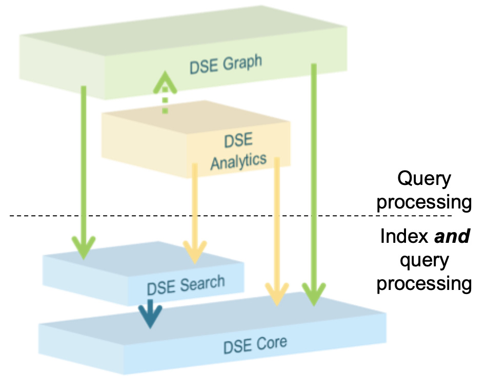
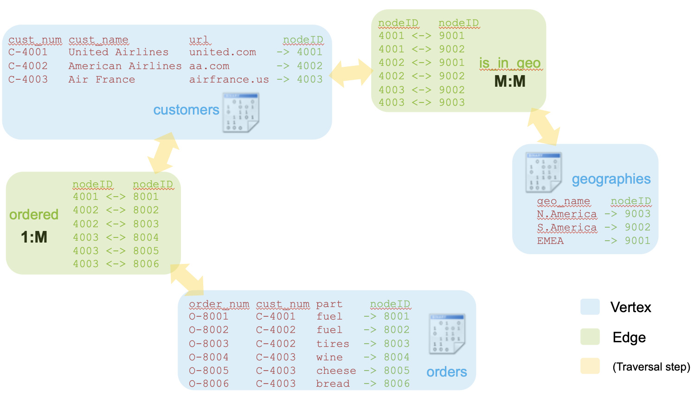
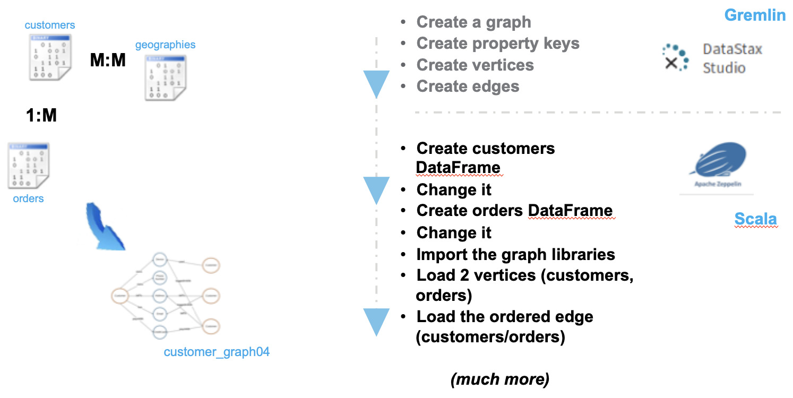

| **[Monthly Articles - 2022](../../README.md)** | **[Monthly Articles - 2021](../../2021/README.md)** | **[Monthly Articles - 2020](../../2020/README.md)** | **[Monthly Articles - 2019](../../2019/README.md)** | **[Monthly Articles - 2018](../../2018/README.md)** | **[Monthly Articles - 2017](../../2017/README.md)** | **[Data Downloads](../../downloads/README.md)** |
|-------------------------|-------------------------|-------------------------|-------------------------|-------------------------|-------------------------|-------------------------|

[Back to 2019 archive](../README.md)
[Download original PDF](../DDN_2019_30_GraphPrimer 68.pdf)

## From The Archive

2019 June - -

>Customer: I saw the January/2019 article where you introduced graph computing using Apache TinkerPop,
>aka, DataStax Enterprise Graph. Now I see that you’ve released an EAP (early access program, preview)
>DataStax Enterprise version 6.8 with significant changes to graph, including a new storage model. I
>figure there’s a bunch of new stuff I need to know. Can you help ?
>
>Daniel: Excellent question ! Yes. In this edition of DataStax Developer’s Notebook (DDN), we’ll update
>the January/2019 document with new version 6.8 DSE capabilities, and do a bit of compare and contrast.
>Keep in mind as an EAP, version 6.8 is proposed, early preview. Version 6.8 may change drastically.
>
>In this document, we detail that you no longer need GraphFrames; inserting using standard DataFrames
>saves a bunch of processing steps, and still performs just as well. We detail the new version 6.8
>storage model, which is also much simpler over version 6.7. (Everything is stored directly in DSE Core
>tables, and directly support DSE Core CQL queries.)
>
>[Read article online](./README.md)


---

# DDN 2019 30 GraphPrimer 68

## Chapter 30. June 2019

DataStax Developer’s Notebook -- June 2019 V1.2

Welcome to the June 2019 edition of DataStax Developer’s Notebook (DDN). This month we answer the following question(s); Graph, graph, graph; what the heck is up with graph- I saw the January/2019 article where you introduced graph computing using Apache TinkerPop, aka, DataStax Enterprise Graph. Now I see that you’ve released an EAP (early access program, preview) DataStax Enterprise version 6.8 with significant changes to graph, including a new storage model. I figure there’s a bunch of new stuff I need to know. Can you help ? Excellent question ! Yes. In this edition of DataStax Developer’s Notebook (DDN), we’ll update the January/2019 document with new version 6.8 DSE capabilities, and do a bit of compare and contrast. Keep in mind as an EAP, version 6.8 is proposed, early preview. Version 6.8 may change drastically.

Sometimes there are nuances when discussing databases; what really is the difference between a data warehouse, data mart, data lake, other ? Why couldn’t you recreate some or most non-relational database function using a standard relational database ? In this edition of DataStax Developer’s Notebook (DDN), we update our January/2019 graph database primer; create a graph, and load it, and compare and contrast version 6.7 and version 6.8. In a future edition of this same document, we will actually have the chance to provide examples where you might determine that graph databases have an advantage over relational databases for certain use cases.

## Software versions

The primary DataStax software component used in this edition of DDN is DataStax Enterprise (DSE), currently release 6.8 EAP. All of the steps outlined below can be run on one laptop with 16 GB of RAM, or if you prefer, run these steps on Amazon Web Services (AWS), Microsoft Azure, or similar, to allow yourself a bit more resource.

For isolation and (simplicity), we develop and test all systems inside virtual machines using a hypervisor (Oracle Virtual Box, VMWare Fusion version 8.5, or similar). The guest operating system we use is Ubuntu version 18.0, 64 bit.

DataStax Developer’s Notebook -- June 2019 V1.2

## 30.1 Terms and core concepts

The problem statement listed above is to articulate why a graph database is advantageous over a relational database, presumably for given individual use cases, and articulate what is different with the new version 6.8 of DataStax Enterprise (DSE) Graph. Recall that DataStax Enterprise Server (DSE) is composed of four primary functional areas. These four areas include:

- DSE Core

- DSE Search

- DSE Analytics

- DSE Graph (aka, graph, aka, apache TinkerPop)

DSE Core DSE Core carries many responsibilities, including that it is the (disk) storage tier to all of DSE. While DSE Search calculates key column values, that data is actually stored in DSE Core. DSE Graph data, is stored in DSE Core.

Compared to common relational databases, DSE Core provides at least two truly unique capabilities. These are:

- Time constant lookups- DSE Core is centered on a hash indexed write ahead log. Effectively, this design does scale linearly regardless of the size of data being hosted. (B-Tree indexes and relational databases scale well, but they do not scale linearly.)

- Network partition fault tolerance Some customers describe DSE as a “multi-write database”, meaning; the same piece of data is writable on two or more nodes simultaneously. This is advantageous for global applications. A single piece of data is writable in, for example; Germany and the USA at the same time. With this capability, DSE can also accept writes when the network between Germany and the USA is down. With users in both countries, a standard relational database would normally prevent reads on one side of the (down network). Most NoSQL databases would at least allow reads. DSE allows reads and writes, and creates a single best surviving (most accurate) record once the network is restored.

DataStax Developer’s Notebook -- June 2019 V1.2



*Figure 30-1 DSE, 4 primary functional areas*

DSE Search, DSE Analytics, DSE Graph Dse Search (aka, Apache Solr/Lucene), gives DSE (and thus DSE Graph), advanced indexes for:

- Spatial and geo-spatial queries, distance from, if in polygon, other

- Time series

- Text analytics; sounds like, mis-spellings, stemming, synonyms, other

- And more

DSE Analytics (aka, Apache Spark), gives DSE (and thus DSE Graph), parallel inserts, updates, deletes, access to Spark/SQL, machine learning, streaming, and Spark DataFrames and GraphFrames.

And of course, DSE Graph itself. As a result of sitting atop DSE Core, the DSE Graph component is network partition fault tolerant, and scales linearly across nodes; generally, both features other graphs fail to deliver.

DataStax Developer’s Notebook -- June 2019 V1.2

DSE Graph object hierarchy Figure 30-2 displays the DSE Graph object hierarchy. A code review follows.


*Figure 30-2 DSE Graph object hierarchy*

Relative to Figure 30-2, the following is offered:

- Logical terms and physical terms; generally, physical terms exist, they have mass. Logical terms generally group, or identify one of more physical terms. Each of the terms in the above diagram are either physical or logical.

- A DSE (graph) is most similar to a relational database (database). A graph contains one or more vertices, and edges, where a relational database contains tables. In version 6.7 DSE, you had to make a distinct graph object. In version 6.8 DSE, you make a keyspace with support for a graph via a distinct clause. E.g.,

```text
DROP KEYSPACE IF EXISTS ks_customer04;
```

```text
CREATE KEYSPACE ks_customer04
WITH replication = {'class': 'SimpleStrategy',
'replication_factor': 1}
AND graph_engine = 'Native';
```

```text
USE ks_customer04;
```

- Unlike a relational database, a version 6.7 DSE graph defines property keys first. Property keys most resemble a relational database column, with

DataStax Developer’s Notebook -- June 2019 V1.2

a data type, null-ability condition, other. Version 6.7 DSE graph property keys form the (columns) inside (tables and indexes), and their properties are global in scope to a graph. In version 6.8 DSE graph, property keys are just columns inside tables (inside vertices and edges). Thus, property keys are no longer defined first, nor are property keys global in scope. In version 6.8 DSE graph, vertices and edges are directly accessible as DSE Core tables, and available via DSE CQL SELECTS and DSE Gremlin traversals.

- In a relational database, the relationships between tables are defined on every SQL SELECT statement. In a graph, the relationships between tables are recorded via edges. On some level, you could view a graph edge as a relational database materialized view; the edge contains the join pairs between vertices, pre-recorded, pre-calculated. This condition makes traversing a graph very fast. In version 6.8 DSE graph, the following is true: • Vertices and Edges are created via DSE Core tables with a distinct clause. E.g.,

```text
CREATE TABLE customers
(
nodeID INT,
cust_num TEXT,
cust_name TEXT,
url TEXT,
PRIMARY KEY ((nodeID))
)
WITH VERTEX LABEL v_customers
;
```

```text
CREATE TABLE orders
(
nodeID INT,
order_num TEXT,
cust_num TEXT,
```

DataStax Developer’s Notebook -- June 2019 V1.2

```text
part TEXT,
PRIMARY KEY ((nodeID))
)
WITH VERTEX LABEL v_orders
;
CREATE TABLE customer_places_order
(
nodeID_c INT,
nodeID_o INT,
PRIMARY KEY((nodeID_c), nodeID_o)
)
WITH EDGE LABEL e_customer_places_order
FROM v_customers(nodeID_c)
TO v_orders(nodeID_o);
```

```text
CREATE MATERIALIZED VIEW order_placed_by_customer
AS SELECT nodeID_c, nodeID_o
FROM customer_places_order
WHERE
nodeID_c IS NOT NULL
AND
nodeID_o IS NOT NULL
PRIMARY KEY (nodeID_o, nodeID_c);
```

Above, vertices and edges are created as DSE Core tables with distinct clauses. In version 6.7 DSE graph, edges were automatically bidirectional. There was a cost to this behavior; in effect, every single edge instance (every record), inserted two rows inside a DSE table. One row with a partition key to support edge traversal in one direction, and a second row with a different partition key to support edge traversal in the other/return direction. That was fine, as long as you benefited from this cost, as long as you actually used the edge bidirectionally.

DataStax Developer’s Notebook -- June 2019 V1.2

In version 6.8 DSE graph, edges are not bidirectional by default (lower cost). In version 6.8 DSE graph, you provide for bidirectional edge traversal by creating a standard DSE Core materialized view that supports the different partition key. Recall the DSE Core materialized views are automatically maintained via all changes to the base table.

> Note: Relational databases define the relationship between rows in every table, on every SQL SELECT, via query predicates in the SQL SELECT WHERE clause. These join relationships can change, and even be ad-hoc (a never before imagined query), on every query.

If the relationships between rows in graph vertices are recorded as join pairs within edges, doesn’t that make graphs and graph queries more rigid (less impactful) than relational database queries ? No. First, consider a standard relational database Customer to Orders relationship; what is the use case to join a Customer with Orders they did not place ? While a graph traversal also has (query predicates), these predicates exist to shape the query, not define the query. E.g., I see a big storm is heading to Houston, TX, and Houston is likely to flood. Show me only high value customers who have any relationship to Houston- The rows returned might be merchandise that is being sourced from a Houston warehouse, or deliveries that are routed through Houston. It could also be that an inspector for any merchandise has a mother who lives in Houston, TX. In a graph query, you effectively ask the database to show you how or if (two rows) are related. In a relational database, you have to know (and specify in the SQL SELECT syntax), exactly how rows are related. Lastly, graph query predicates are much more (programmable). Consider a recursive join on a Persons table- On the first level join, you might specify that the person you know has to be a relative, but on the next level join, the person you know has to be a coach or teacher. Even if you believe you could answer the very same queries using a relational database, you will be writing much more code to answer these types of questions using relational; dense, fragile code, that will likely break when the structure of the database changes.

DataStax Developer’s Notebook -- June 2019 V1.2

- Graph edges also resemble relational database tables, in that edges contain property keys; not only the join pair columns between two vertices, but also property keys proper. I.e., How long has Bob known Dave.

- If you chose to view graph edges metaphorically as indexes, we can live with that; edges do contain the join pair columns from the vertices after all. However, graph vertices can benefit from all of the indexes provided through DSE Core and DSE Search, allowing geo-spatial query predicates, and more.

Example queries, relational and graph Figure 30-3 displays a standard relational database query. A code review follows.


*Figure 30-3 Example Relational Query*

Relative to Figure 30-3, the following is offered:

- A SQL SELECT has up to seven clauses; two mandatory (select column list, from table list), and five optional clauses (group by, having, ..). The clauses, if present, can appear only once and must appear in order.

- An automatic subsystem to the relational database is the query optimizer. The query optimizer determines how to provide your request for SQL Service; which indexes to use, other.

- In the example above-

DataStax Developer’s Notebook -- June 2019 V1.2

• Two query predicates, col4 and col5, both equalities; which can be supported via an index ? • And then table order; whether you read a 100 row table and join into a 1 million row table, or 1 million row table then 100 row table matters. (Tuple arithmetic and resource consumption.) • Generally, the query optimizer will pick the most efficient (index supported) query predicate first (filter), then determine table order based on join conditions (join). Sort most often comes last, as the newly created (table) did not exist until the join and could not have been pre-sorted.

Figure 30-4 displays a Gremlin traversal (similar to a SQL SELECT). A code review follows.


*Figure 30-4 Gremlin traversal, happens to be a recursion*

Relative to Figure 30-4, the following is offered:

- g.V() is the command similar to SQL SELECT. (There are others, this is one.)

- In this example, we call to start at the “user” table, and leave along the relationship titled, “knows”. We filter starting with just the “user_name” valued, “Dave”. We call to repeat two times, so; who does Dave know, and who do those people know.

DataStax Developer’s Notebook -- June 2019 V1.2

- Graph traversals do not have to be recursive, but graph does do recursion really, really well. Each step in the recursion could be based on a different set of query predicates.

- Similar to a relational query, an index on “user_name” would aid performance; as efficiently as possible, reduce the number of “user.user_name” rows that have to be examined. After this predicate, rows are pre-joined and supplied key values come from the graph edge.

- Graph vertices tend to be named after nouns, and graph edges tend to be named after verbs.

An Example using Customer Figure 30-5 displays a simple graph we will use on the next set of pages. A code review follows.



*Figure 30-5 A simple “Customer” graph*

Relative to Figure 30-5, the following is offered:

- Three vertices are displayed in blue; customer, orders, and geographies. Vertices are normally named after nouns.

```text
is_in_geo
```

- Two edges are displayed in green; ordered, and . Edges are normally named after verbs. –

```text
cust_num
```

appears in both customer and orders as a natural key, likely a key we inherited from any legacy system we are now replacing with graph.

DataStax Developer’s Notebook -- June 2019 V1.2

A system generated key also appears in each vertex with the property key name,

```text
nodeID
```

. The data in the edge titled, ordered, could easily be generated via a Spark/SQL SELECT statement similar to that as displayed in Example 30-1.

### Example 30-1 Spark/SQL, run-able as Scala in this example

```text
val ordered = spark.sql(
"select " +
" t1.nodeID as nodeID_C, " +
" t2.nodeID as nodeID_O " +
"from " +
" customers t1, " +
" orders t2 " +
"where " +
" t1.cust_num = t2.cust_num"
)
```

> Note: Example 30-1 is written in Spark/SQL, specifically Scala. This statement would automatically run in parallel across multiple nodes using DSE.

DSE Analytics (Apache Spark) offers a lot of benefit to DSE as a whole; parallel DMLs, SQL syntax, DataFrames and GraphFrames, and more.

- There is no natural key displayed in customer or geo that would populate the edge titled,

```text
is_in_geo
```

. This relationship would have to be generated via data not currently displayed.

> Note: As the original “geo” table arrived, it had a many to many relationship to customer, and was effectively our edge data. It was actually the vertex we derived using a Spark/SQL SELECT DISTINCT.

Figure 30-6 displays the sequence of steps to create and load our example graph with version 6.7 DSE graph. A code review follows.

DataStax Developer’s Notebook -- June 2019 V1.2



*Figure 30-6 Sequence of steps to create and load this graph, version 6.7*

Relative to Figure 30-6, the following is offered:

- While there are many paths to complete these steps, we often choose to use DataStax Studio, and the Gremlin interpreter to create; graphs, property keys, vertices, edges, other.

- While DataStax Enterprise (DSE) ships with a Scala REPL (Python REPL, other), we often choose to use the open source, Apache Zeppelin as a graphical (Web based) Spark (Scala) interpreter. Using Spark, we can load in parallel with a programmable interface, versus say a utility like a bulk data loader, other, which DSE also offers.

In version 6.8 DSE graph You make a DSE Core keyspace with DSE graph support, and you make tables for the graph vertices and edges. (All detailed above.) Bidirectional edges are supported via DSE Core materialized views.

## 30.2 Complete the following:

Above we overviewed the objects and process to create and load a graph using DSE. In this section, we present the actual code. All of the examples below will run on DSE version 6.7, and likely, earlier versions of DSE. As noted in specific areas, the (shorter/better) version 6.8 DSE graph code is also presented.

DataStax Developer’s Notebook -- June 2019 V1.2

Using DataStax Studio (Studio), we call to run the Gremlin interpreter to make the property keys, vertices, and edges. Studio will see we want to run Gremlin, and will prompt to make our graph for us via dialog boxes, not shown.

Example 30-2 displays the Gremlin code we use to make the property keys, and more using DSE version 6.7. A code review follows.

### Example 30-2 Gremlin code to make property key, and more, version 6.7

```text
. Paragraph 01, Studio, Gremlin
--------------------
// Paragraph 01
```

```text
system.graphs()
system.describe()
--------------------
```

```text
. Paragraph 02, Studio, Gremlin
--------------------
// Paragraph 02
```

```text
schema.drop()
schema.config().option('graph.allow_scan').set('true')
--------------------
```

```text
. Paragraph 03, Studio, Gremlin
--------------------
// Paragraph 03
```

```text
// Property keys
```

```text
schema.propertyKey('nodeID' ).Int() .single().create()
//
schema.propertyKey('cust_num' ).Text().single().create()
schema.propertyKey('cust_name').Text().single().create()
schema.propertyKey('url' ).Text().single().create()
schema.propertyKey('order_num').Text().single().create()
schema.propertyKey('part' ).Text().single().create()
schema.propertyKey('geo_name' ).Text().single().create()
--------------------
```

```text
. Paragraph 04, Studio, Gremlin
--------------------
// Paragraph 04
```

```text
// Vertices
```

DataStax Developer’s Notebook -- June 2019 V1.2

```text
schema.vertexLabel("customers").
partitionKey("nodeID").
properties(
'nodeID' ,
'cust_num' ,
'cust_name' ,
'url'
).ifNotExists().create()
```

```text
schema.vertexLabel("orders").
partitionKey("nodeID").
properties(
'nodeID' ,
'order_num' ,
'cust_num' ,
'part'
).ifNotExists().create()
```

```text
schema.vertexLabel("geographies").
partitionKey("nodeID").
properties(
'nodeID' ,
'geo_name'
).ifNotExists().create()
```

```text
// Edges
```

```text
schema.edgeLabel("ordered").
single().
connection("customers", "orders").
ifNotExists().create()
```

```text
schema.edgeLabel("is_in_geo").
single().
connection("customers", "geographies").
ifNotExists().create()
--------------------
```

Relative to Example 30-2, the following is offered:

- DataStax Studio (Studio), like Apache Zeppelin, can organize code into paragraphs. Above, paragraphs are labeled, Paragraph 01, etcetera, and delimited via dashed lines. (Do not enter the dashed lines into Studio.)

DataStax Developer’s Notebook -- June 2019 V1.2

- Paragraph 01, is read-only, a nervous tick of sorts. These commands tell us we can actually connect to DSE Graph, what graphs exist, other.

- Paragraph 02, has two lines- • The first line calls to erase all data and schema objects (property keys, other), from our current graph. We offer this command in the event you cause error, and need to restart this sequence of steps. • The second command is for development only; in the event we call to query (traverse) our graph for testing, and call for a traversal that should require an index, allow sequential scans instead.

> Note: Don’t allow sequential scans in production; don’t use this command in production.

- Paragraph 03, has several lines- • Here we make the property keys, using only two data types; integer and text (string). Obviously DSE graph supports additional data types, and this topic is considered out of scope for our needs today. • The opposite of single, is multiple, which is used for DSE collection types (arrays); set, list, and map. This topic is also beyond scope at the moment.

- Paragraph 04 makes our vertices, then edges. Comments- • Vertices must exist, before edges can refer to them. • Both vertices and edges make use of property keys, although in this example; the edges use property keys for the join keys only. (Edges can have property keys proper, and this condition is not displayed.)

```text
partitionKey
```

• The “ ” is exactly equal to the DSE Core partition key, part of the primary key to each DSE Core table.

```text
partitionKey(s
```

> Note: For a further description of ), we point you to the very first edition of the document in this series, which details DSE Core, and primary keys, partition keys, and clustering columns.

• In edges, the single property could be multiple. In this case a person, for example, could rate a movie multiple times, or similar.

The same example as above, using version 6.8 Example 30-3 presents the same example as above, but using the version 6.8 DSE Graph capabilities. A code review follows.

DataStax Developer’s Notebook -- June 2019 V1.2

### Example 30-3 Same example as above, using version 6.8 of DSE Graph

```text
// Paragraph 03.01
```

```text
DROP KEYSPACE IF EXISTS ks_customer04;
```

```text
CREATE KEYSPACE ks_customer04
WITH replication = {'class': 'SimpleStrategy',
'replication_factor': 1}
AND graph_engine = 'Native';
```

```text
USE ks_customer04;
```

```text
// Paragraph 03.02
```

```text
USE ks_customer04;
```

```text
CREATE TABLE customers
(
nodeID INT,
cust_num TEXT,
cust_name TEXT,
url TEXT,
PRIMARY KEY ((nodeID))
)
WITH VERTEX LABEL v_customers
;
```

```text
CREATE TABLE orders
(
nodeID INT,
order_num TEXT,
cust_num TEXT,
part TEXT,
PRIMARY KEY ((nodeID))
)
WITH VERTEX LABEL v_orders
;
```

```text
CREATE TABLE geographies
(
nodeID INT,
geo_name TEXT,
PRIMARY KEY ((nodeID))
)
WITH VERTEX LABEL v_geographies
;
```

```text
// Paragraph 03.03
```

DataStax Developer’s Notebook -- June 2019 V1.2

```text
USE ks_customer04;
```

```text
CREATE TABLE customer_places_order
(
nodeID_c INT,
nodeID_o INT,
PRIMARY KEY((nodeID_c), nodeID_o)
)
WITH EDGE LABEL e_customer_places_order
FROM v_customers(nodeID_c)
TO v_orders(nodeID_o);
```

```text
CREATE MATERIALIZED VIEW order_placed_by_customer
AS SELECT nodeID_c, nodeID_o
FROM customer_places_order
WHERE
nodeID_c IS NOT NULL
AND
nodeID_o IS NOT NULL
PRIMARY KEY (nodeID_o, nodeID_c);
```

```text
CREATE TABLE customer_in_geo
(
nodeID_c INT,
nodeID_g INT,
PRIMARY KEY((nodeID_c), nodeID_g)
)
WITH EDGE LABEL e_customer_in_geo
FROM v_customers(nodeID_c)
TO v_geographies(nodeID_g);
```

```text
CREATE MATERIALIZED VIEW geo_contains_customer
AS SELECT nodeID_c, nodeID_g
FROM customer_in_geo
WHERE
nodeID_c IS NOT NULL
AND
nodeID_g IS NOT NULL
PRIMARY KEY (nodeID_g, nodeID_c);
```

Relative to Example 30-3, the following is offered:

- So again, the version 6.7 graph object is now made in version 6.8 as a DSE Core keyspace via a distinct clause. Vertices and Edges are made as

DataStax Developer’s Notebook -- June 2019 V1.2

DSE Core tables, also with distinct clauses. Bidirectional edge support is provided via a DSE Core materialized view.

- The advantage to these changes ? Storage model; now we only need to store (graph data) one time, in DSE Core tables. Before we stored data twice, in both graph objects and DSE Core. As a side benefit, by simplifying the storage model, early testing reveals the graph traversals and running 3x to 100x faster than before.

In Example 30-4 and version 6.7, we move to using Spark to load our graph. We could have continued using Gremlin, but the application framework of Spark is so much more powerful than using (Gremlin commands alone, without a language). A code review follows.

### Example 30-4 Loading the graph using Spark (Scala) using version 6.7

```text
. Paragraph 01, Zepp
--------------------
%spark
```

```text
// Paragraph 01
```

```text
import org.apache.spark.sql.functions.{monotonically_increasing_id, col, lit,
concat, max}
```

```text
val customers = sc.parallelize(Array(
("C-4001", "United Airlines" , "united.com" ),
("C-4002", "American Airlines", "aa.com" ),
("C-4003", "Air France" , "airfrance.us")
) )
```

```text
val customers_df = customers.toDF ("cust_num", "cust_name", "url").coalesce(1)
```

```text
val customers_df_nodeID = customers_df.withColumn("nodeID",
monotonically_increasing_id() + 4001)
```

```text
customers_df_nodeID.getClass()
customers_df_nodeID.printSchema()
customers_df_nodeID.count()
customers_df_nodeID.show()
```

```text
customers_df_nodeID.registerTempTable("customers")
--------------------
```

```text
. Paragraph 02, Zepp
--------------------
```

DataStax Developer’s Notebook -- June 2019 V1.2

```text
%spark
```

```text
// Paragraph 02
```

```text
val orders = sc.parallelize(Array(
("O-8001", "C-4001", "fuel" ),
("O-8002", "C-4002", "fuel" ),
("O-8003", "C-4002", "tires" ),
("O-8004", "C-4003", "wine" ),
("O-8005", "C-4003", "cheese" ),
("O-8006", "C-4003", "bread" )
) )
val orders_df = orders.toDF ("order_num", "cust_num", "part").coalesce(1)
```

```text
val orders_df_nodeID = orders_df.withColumn("nodeID",
monotonically_increasing_id() + 8001)
```

```text
orders_df_nodeID.getClass()
orders_df_nodeID.printSchema()
orders_df_nodeID.count()
orders_df_nodeID.show()
```

```text
orders_df_nodeID.registerTempTable("orders")
--------------------
```

```text
. Paragraph 03, Zepp
--------------------
%spark
```

```text
// Paragraph 03
```

```text
val ordered = spark.sql(
"select " +
" t1.nodeID as nodeID_C, " +
" t2.nodeID as nodeID_O " +
"from " +
" customers t1, " +
" orders t2 " +
"where " +
" t1.cust_num = t2.cust_num"
)
```

```text
ordered.getClass()
ordered.printSchema()
ordered.count()
ordered.show()
--------------------
```

DataStax Developer’s Notebook -- June 2019 V1.2

```text
. Paragraph 04, Zepp
--------------------
%spark
```

```text
// Fourth paragraph
```

```text
import com.datastax.bdp.graph.spark.graphframe._
import org.apache.spark.ml.recommendation.ALS
import org.apache.spark.sql.SparkSession
import org.apache.spark.sql.functions._
import org.apache.spark.sql.types._
import org.apache.spark.ml.evaluation.RegressionEvaluator
import org.apache.spark.sql.functions.{monotonically_increasing_id, col, lit,
concat, max}
import java.net.URI
import org.apache.spark.sql.{DataFrame, SaveMode, SparkSession}
import org.apache.hadoop.conf.Configuration
import org.apache.hadoop.fs.{FileSystem, Path}
import com.datastax.spark.connector._
import org.apache.spark.sql.cassandra._
import com.datastax.spark.connector.cql.CassandraConnectorConf
import com.datastax.spark.connector.rdd.ReadConf
import org.apache.spark.sql.expressions.Window
```

```text
val graphName = "customer_graph04"
```

```text
val g = spark.dseGraph(graphName)
--------------------
```

```text
. Paragraph 05, Zepp
--------------------
%spark
```

```text
// Fifth paragraph
```

```text
val customers_V = customers_df_nodeID.withColumn("~label", lit("customers")).
withColumn("nodeID" , col("nodeID") ).
withColumn("cust_num" , col("cust_num") ).
withColumn("cust_name", col("cust_name")).
withColumn("url" , col("url") )
g.updateVertices(customers_V)
```

```text
val orders_V = orders_df_nodeID.withColumn("~label", lit("orders")).
withColumn("nodeID" , col("nodeID") ).
withColumn("order_num", col("order_num")).
withColumn("cust_num" , col("cust_num") ).
withColumn("part" , col("part") )
g.updateVertices(orders_V)
```

DataStax Developer’s Notebook -- June 2019 V1.2

```text
g.V.hasLabel("customers").show()
g.V.hasLabel("orders").show()
--------------------
```

```text
. Paragraph 06, Zepp
--------------------
%spark
```

```text
// Sixth paragraph
```

```text
val orders_L = ordered.
withColumn("srcLabel", lit("customers")).
withColumn("dstLabel", lit("orders")).
withColumn("edgeLabel", lit("ordered")
)
orders_L.show()
```

```text
val ordered_E = orders_L.select(
g.idColumn(col("srcLabel"), col("nodeID_C" )) as "src",
g.idColumn(col("dstLabel"), col("nodeID_O")) as "dst",
col("edgeLabel") as "~label"
)
```

```text
ordered_E.show()
```

```text
g.updateEdges(ordered_E)
--------------------
```

```text
. Paragraph 07, Zepp
--------------------
%spark
```

```text
// Seventh paragraph
```

```text
g.E.hasLabel("ordered").show()
```

```text
g.V().hasLabel("customers").has("url",
"aa.com").out("ordered").valueMap("order_num", "cust_num", "part").show()
--------------------
```

```text
. Paragraph 08, Zepp
--------------------
%spark
```

```text
// Paragraph 08
```

DataStax Developer’s Notebook -- June 2019 V1.2

```text
import org.apache.spark.sql.functions.{monotonically_increasing_id, col, lit,
concat, max}
```

```text
val geographies = sc.parallelize(Array(
("N.America"),
("S.America"),
("EMEA" )
) )
```

```text
val geographies_df = geographies.toDF ("geo_name").coalesce(1)
```

```text
val geographies_df_nodeID = geographies_df.withColumn("nodeID",
monotonically_increasing_id() + 9001)
```

```text
geographies_df_nodeID.getClass()
geographies_df_nodeID.printSchema()
geographies_df_nodeID.count()
geographies_df_nodeID.show()
```

```text
geographies_df_nodeID.registerTempTable("geographies")
--------------------
```

```text
. Paragraph 09, Zepp
--------------------
%spark
```

```text
// Paragraph 09
```

```text
val geographies_V = geographies_df_nodeID.withColumn("~label",
lit("geographies")).
withColumn("nodeID" , col("nodeID") ).
withColumn("geo_name" , col("geo_name"))
g.updateVertices(geographies_V)
```

```text
g.V.hasLabel("geographies").show()
--------------------
```

```text
. Paragraph 10, Zepp
--------------------
%spark
```

```text
// Paragraph 10
```

```text
val is_in_geo = sc.parallelize(Array(
(4001, 9001),
(4001, 9002),
(4002, 9001),
(4002, 9002),
```

DataStax Developer’s Notebook -- June 2019 V1.2

```text
(4003, 9002),
(4003, 9003)
) )
```

```text
val is_in_geo_df = is_in_geo.toDF ("nodeID_C", "nodeID_G").coalesce(1)
```

```text
val geo_L = is_in_geo_df.
withColumn("srcLabel", lit("customers")).
withColumn("dstLabel", lit("geographies")).
withColumn("edgeLabel", lit("is_in_geo")
)
geo_L.show()
```

```text
val geo_E = geo_L.select(
g.idColumn(col("srcLabel"), col("nodeID_C" )) as "src",
g.idColumn(col("dstLabel"), col("nodeID_G")) as "dst",
col("edgeLabel") as "~label"
)
geo_E.show()
```

```text
g.updateEdges(geo_E)
```

```text
g.E.hasLabel("is_in_geo").show()
```

```text
g.V().hasLabel("customers").has("url",
"aa.com").out("is_in_geo").valueMap("geo_name").show()
--------------------
```

Relative to Example 30-4, the following is offered:

- Paragraph 01, • The import allows a SQL expression we use to generate a unique

```text
nodeID
```

system generated key ( ). • The

```text
parallelize
```

gives us 3 rows of data to place into our customers vertex. • The

```text
toDF
```

transforms what was a Spark RDD into a Spark DataFrame. Having a DataFrame allows us to run Spark/SQL against this data.

> Note: Don’t use the coalesce in production, it will force all of our rows to just one node, limiting parallelism.

We do it here, for development, so that our system generated keys are nice and sequential.

DataStax Developer’s Notebook -- June 2019 V1.2

• Starting with

```text
getClass
```

, these 4 commands are diagnostic/debugging only. • The

```text
registerTempTable
```

makes this DataFrame known to Spark/SQL, so that we may run SQL against this data.

- Paragraph 02, • This block of code is identical in function to the paragraph above. Instead of customers, we are now processing orders.

- Paragraph 03, runs Spark SQL- • Here we use the natural keys from customers and orders to generate the join pairs between these two vertices. • Our intent is to populate the edge between these two vertices, later.

- Paragraph 04, imports and opening our graph • There are a lot of common imports we don’t actually need for this example, but would use for a larger, more complex example. All of this code could be pasted into a real Scala program. • The last two lines give us a connection handle to our graph, which we created with DSE Studio, above.

- Paragraph -5, loads the first two vertices; customers, and orders • ordered is our original data DataFrame. We add a new column valued with a literal string constant equal to, “customers”. Adding this literal constant with the name of the vertex is a requirement

```text
updateVertices
```

to the next method titled, . • And we repeat these steps to load orders.

- Paragraph 06 begins the block to load the edge between customers and orders • Similar to the steps to load a vertex, we need to add metadata to the DataFrame containing the (data for the edge proper). •

```text
orders_L
```

adds three columns with string constants; labels required before inserting into the edge. • The second/final transform makes use of the

```text
idColumn
```

method- This method is core to loading an edge. Here we reference the system generated keys, and a label, to generate the (addresses) used inside the edge as join pair keys. • We end with the method titled,

```text
updateEdges
```

.

- Paragraph 07 offers a number of read-only, diagnostic traversals; confirming our work.

DataStax Developer’s Notebook -- June 2019 V1.2

- Paragraph 08 starts a block equal in function to the work performed above (paragraph 08 through 10.). Here we populate the geo vertex, and the

```text
is_in_geo
```

edge, using the same techniques introduced above.

The same example as above, using version 6.8

Example 30-5 presents the same example as above, but using the version 6.8 DSE Graph capabilities. A code review follows.

### Example 30-5 Same example as above, using version 6.8

```text
// Paragraph 03.04
```

```text
USE ks_customer04;
```

```text
INSERT INTO customers (nodeID, cust_num, cust_name, url)
VALUES (4001, 'C-4001', 'United Airlines' , 'united.com' );
INSERT INTO customers (nodeID, cust_num, cust_name, url)
VALUES (4002, 'C-4002', 'American Airlines', 'aa.com' );
INSERT INTO customers (nodeID, cust_num, cust_name, url)
VALUES (4003, 'C-4003', 'Air France' , 'airfrance.us');
```

```text
INSERT INTO orders (nodeID, order_num, cust_num, part)
VALUES (8001, 'O-8001', 'C-4001', 'fuel' );
INSERT INTO orders (nodeID, order_num, cust_num, part)
VALUES (8002, 'O-8002', 'C-4002', 'fuel' );
INSERT INTO orders (nodeID, order_num, cust_num, part)
VALUES (8003, 'O-8003', 'C-4002', 'tires' );
INSERT INTO orders (nodeID, order_num, cust_num, part)
VALUES (8004, 'O-8004', 'C-4003', 'wine' );
INSERT INTO orders (nodeID, order_num, cust_num, part)
VALUES (8005, 'O-8005', 'C-4003', 'cheese' );
INSERT INTO orders (nodeID, order_num, cust_num, part)
VALUES (8006, 'O-8006', 'C-4003', 'bread' );
```

```text
// Paragraph 03.05
```

```text
// Eg., SELECT * FROM customers;
```

```text
g.V().hasLabel("v_customers")
--------------------
```

```text
// Paragraph 03.06
```

```text
USE ks_customer04;
```

DataStax Developer’s Notebook -- June 2019 V1.2

```text
INSERT INTO customer_places_order (nodeID_c, nodeID_o)
VALUES (4001, 8001);
INSERT INTO customer_places_order (nodeID_c, nodeID_o)
VALUES (4002, 8002);
INSERT INTO customer_places_order (nodeID_c, nodeID_o)
VALUES (4002, 8003);
INSERT INTO customer_places_order (nodeID_c, nodeID_o)
VALUES (4003, 8004);
INSERT INTO customer_places_order (nodeID_c, nodeID_o)
VALUES (4003, 8005);
INSERT INTO customer_places_order (nodeID_c, nodeID_o)
VALUES (4003, 8006);
```

```text
// Paragraph 03.07
```

```text
// schema.config().option('graph.allow_scan').set('true')
//
//
https://github.com/riptano/bdp/blob/master/dse-graph-server/src/markdown/Traver
salOptions.md
//
// The tilde is early beta builds only; not required in current release
```

```text
g.V().with('~allow-filtering').
hasLabel("v_customers").
has("url", "aa.com").
out("e_customer_places_order").
valueMap("order_num", "cust_num", "part")
```

```text
// Paragraph 03.08
```

```text
TRUNCATE customers;
TRUNCATE orders;
TRUNCATE geographies;
```

```text
TRUNCATE customer_places_order;
TRUNCATE customer_in_geo;
```

```text
// Paragraph 04.01
```

```text
import org.apache.spark.sql.functions.{
monotonically_increasing_id, col, lit, concat, max}
```

DataStax Developer’s Notebook -- June 2019 V1.2

```text
val customers = sc.parallelize(Array(
("C-4001", "United Airlines" , "united.com" ),
("C-4002", "American Airlines", "aa.com" ),
("C-4003", "Air France" , "airfrance.us")
) )
```

```text
val customers_df = customers.toDF ("cust_num",
"cust_name", "url").coalesce(1)
```

```text
val customers_df_nodeID = customers_df.withColumn(
"nodeID", monotonically_increasing_id() + 4001)
```

```text
customers_df_nodeID.getClass()
customers_df_nodeID.printSchema()
customers_df_nodeID.count()
customers_df_nodeID.show()
```

```text
customers_df_nodeID.registerTempTable("customers")
```

```text
// Paragraph 04.02
```

```text
customers_df_nodeID.printSchema()
```

```text
val customers_df_nodeID_lc = customers_df_nodeID.
toDF(customers_df_nodeID.columns map(_.toLowerCase): _*)
```

```text
customers_df_nodeID_lc.printSchema()
```

```text
customers_df_nodeID_lc.write.
format("org.apache.spark.sql.cassandra").
options(Map( "keyspace" -> "ks_customer04",
"table" -> "customers" )).
mode("append").
save
```

```text
// Paragraph 04.03
```

```text
select * from ks_customer04.customers;
```

```text
// Paragraph 04.04
```

```text
import com.datastax.bdp.graph.spark.graphframe._
import org.apache.spark.ml.recommendation.ALS
import org.apache.spark.sql.SparkSession
import org.apache.spark.sql.functions._
import org.apache.spark.sql.types._
```

DataStax Developer’s Notebook -- June 2019 V1.2

```text
import org.apache.spark.ml.evaluation.RegressionEvaluator
import org.apache.spark.sql.functions.{
monotonically_increasing_id, col, lit, concat, max}
import java.net.URI
import org.apache.spark.sql.{DataFrame, SaveMode, SparkSession}
import org.apache.hadoop.conf.Configuration
import org.apache.hadoop.fs.{FileSystem, Path}
import com.datastax.spark.connector._
import org.apache.spark.sql.cassandra._
import com.datastax.spark.connector.cql.CassandraConnectorConf
import com.datastax.spark.connector.rdd.ReadConf
import org.apache.spark.sql.expressions.Window
```

```text
val graphName = "ks_customer04"
```

```text
val g = spark.dseGraph(graphName)
```

```text
// Paragraph 04.05
```

```text
g.V().hasLabel("v_customers").show()
```

```text
// Paragraph 04.06
```

```text
val orders = sc.parallelize(Array(
("O-8001", "C-4001", "fuel" ),
("O-8002", "C-4002", "fuel" ),
("O-8003", "C-4002", "tires" ),
("O-8004", "C-4003", "wine" ),
("O-8005", "C-4003", "cheese" ),
("O-8006", "C-4003", "bread" )
) )
val orders_df = orders.toDF ("order_num",
"cust_num", "part").coalesce(1)
```

```text
val orders_df_nodeID = orders_df.withColumn(
"nodeID", monotonically_increasing_id() + 8001)
```

```text
orders_df_nodeID.getClass()
orders_df_nodeID.printSchema()
orders_df_nodeID.count()
orders_df_nodeID.show()
```

```text
orders_df_nodeID.registerTempTable("orders")
```

```text
// Paragraph 04.07
```

DataStax Developer’s Notebook -- June 2019 V1.2

```text
orders_df_nodeID.printSchema()
```

```text
val orders_df_nodeID_lc = orders_df_nodeID.
toDF(orders_df_nodeID.columns map(_.toLowerCase): _*)
```

```text
orders_df_nodeID_lc.printSchema()
```

```text
orders_df_nodeID_lc.write.
format("org.apache.spark.sql.cassandra").
options(Map( "keyspace" -> "ks_customer04",
"table" -> "orders" )).
mode("append").
save
```

```text
// Paragraph 04.08
```

```text
select * from ks_customer04.orders;
```

```text
// Paragraph 04.09
```

```text
val customer_places_order = spark.sql(
"select " +
" t1.nodeID as nodeID_C, " +
" t2.nodeID as nodeID_O " +
"from " +
" customers t1, " +
" orders t2 " +
"where " +
" t1.cust_num = t2.cust_num"
)
```

```text
customer_places_order.getClass()
customer_places_order.printSchema()
customer_places_order.count()
customer_places_order.show()
```

```text
// Paragraph 04.10
```

```text
customer_places_order.printSchema()
```

```text
val customer_places_order_lc = customer_places_order.
toDF(customer_places_order.columns map(_.toLowerCase): _*)
```

```text
customer_places_order_lc.printSchema()
```

```text
customer_places_order_lc.write.
```

DataStax Developer’s Notebook -- June 2019 V1.2

```text
format("org.apache.spark.sql.cassandra").
options(Map( "keyspace" -> "ks_customer04",
"table" -> "customer_places_order" )).
mode("append").
save
```

```text
// Paragraph 04.11
```

```text
select * from ks_customer04.customer_places_order;
```

```text
// Paragraph 04.12
```

```text
select * from ks_customer04.order_placed_by_customer;
```

```text
// Paragraph 04.13
```

```text
g.V().hasLabel("v_customers").
has("url", "aa.com").
out("e_customer_places_order").
valueMap("order_num", "cust_num", "part").
show()
```

```text
// Paragraph 04.14
```

```text
import org.apache.spark.sql.functions.{
monotonically_increasing_id, col, lit, concat, max}
```

```text
val geographies = sc.parallelize(Array(
("N.America"),
("S.America"),
("EMEA" )
) )
```

```text
val geographies_df = geographies.toDF (
"geo_name").coalesce(1)
```

```text
val geographies_df_nodeID = geographies_df.
withColumn("nodeID", monotonically_increasing_id() + 9001)
```

```text
geographies_df_nodeID.getClass()
geographies_df_nodeID.printSchema()
geographies_df_nodeID.count()
geographies_df_nodeID.show()
```

```text
geographies_df_nodeID.registerTempTable("geographies")
```

DataStax Developer’s Notebook -- June 2019 V1.2

```text
// Paragraph 04.15
```

```text
geographies_df_nodeID.printSchema()
```

```text
val geographies_df_nodeID_lc = geographies_df_nodeID.
toDF(geographies_df_nodeID.columns map(_.toLowerCase): _*)
```

```text
geographies_df_nodeID_lc.printSchema()
```

```text
geographies_df_nodeID_lc.write.
format("org.apache.spark.sql.cassandra").
options(Map( "keyspace" -> "ks_customer04",
"table" -> "geographies" )).
mode("append").
save
```

```text
// Paragraph 04.16
```

```text
val customer_in_geo = sc.parallelize(Array(
(4001, 9001),
(4001, 9002),
(4002, 9001),
(4002, 9002),
(4003, 9002),
(4003, 9003)
) )
```

```text
val customer_in_geo_df = customer_in_geo.toDF (
"nodeID_C", "nodeID_G").coalesce(1)
```

```text
val customer_in_geo_df_lc = customer_in_geo_df.
toDF(customer_in_geo_df.columns map(_.toLowerCase): _*)
```

```text
customer_in_geo_df_lc.printSchema()
```

```text
customer_in_geo_df_lc.write.
format("org.apache.spark.sql.cassandra").
options(Map( "keyspace" -> "ks_customer04",
"table" -> "customer_in_geo" )).
mode("append").
save
```

```text
// Paragraph 04.17
```

```text
g.V().hasLabel("v_customers").
```

DataStax Developer’s Notebook -- June 2019 V1.2

```text
has("url", "aa.com").
out("e_customer_in_geo").
valueMap("geo_name").
show()
```

Relative to Example 30-5, the following is offered:

- Paragraph 03.04 demonstrates we can now insert/update/delete data into graph vertices and edges using standard DSE Core CQL. While DSE Analytics (Spark) DataFrames are more performant (parallel), having CQL available is super handy.

- Paragraph 03.05 details that a standard DSE GRaph traversal still functions, even though we only inserted into a standard DSE Core table above.

- In Paragraph 03.08, we truncate standard DSE Core tables, before inserting the same data using DSE Analytics (Spark) DataFrames.

- Paragraph 04.01 loads the same Customer data, and makes this data available for Spark/SQL operations.

- Paragraph 04.02 inserts the data into DSE (Graph and Core) using a standard DataFrame save() method; not Spark GraphFrames required. (And thus, less code; no updateVertices(), no updateEdges().)

- Paragraph 04.04 is the standard import set we use to be able to run Gremlin in a Spark/Scala program.

- Paragraph 04.16 details updating an edge. Again, no Spark GraphFrames required, less code, less complex, still performant.

## 30.3 In this document, we reviewed or created:

This month and in this document we detailed the following:

- A graph primer; essentially a round trip to create and load a graph. Updated from January/2019 and version 6.7 DSE version of this same document, we also did a compare and contrast between version 6.7 and

6.8.

- We load the graph using the most capable and performant means possible; Spark DataFrames and/or GraphFrames.

DataStax Developer’s Notebook -- June 2019 V1.2

### Persons who help this month.

Kiyu Gabriel, Jim Hatcher, Alex Ott, and Caleb Rackliffe.

### Additional resources:

Free DataStax Enterprise training courses,

```text
https://academy.datastax.com/courses/
```

Take any class, any time, for free. If you complete every class on DataStax Academy, you will actually have achieved a pretty good mastery of DataStax Enterprise, Apache Spark, Apache Solr, Apache TinkerPop, and even some programming.

This document is located here,

```text
https://github.com/farrell0/DataStax-Developers-Notebook
https://tinyurl.com/ddn3000
```

DataStax Developer’s Notebook -- June 2019 V1.2
