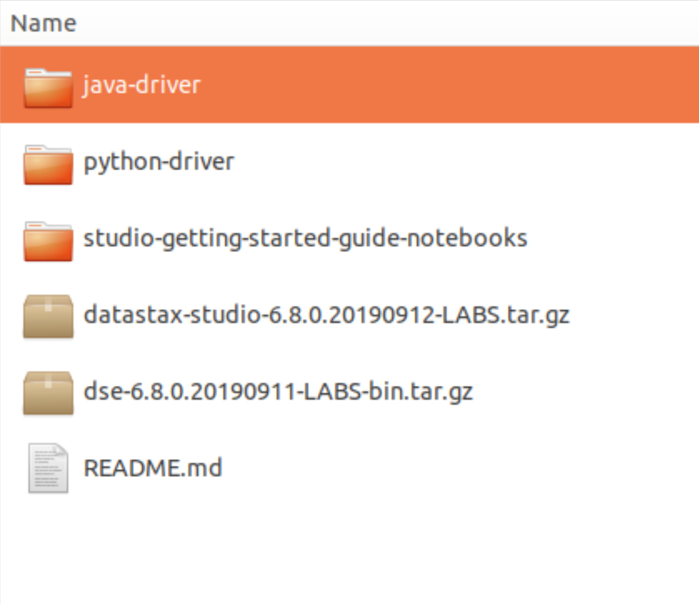
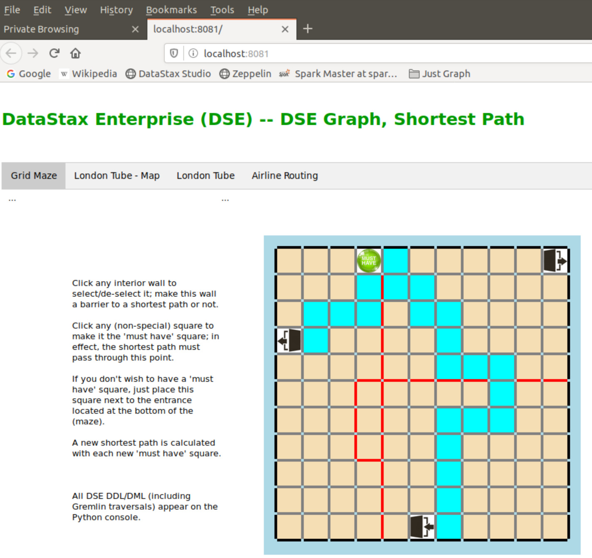

| **[Monthly Articles - 2022](../../README.md)** | **[Monthly Articles - 2021](../../2021/README.md)** | **[Monthly Articles - 2020](../../2020/README.md)** | **[Monthly Articles - 2019](../../2019/README.md)** | **[Monthly Articles - 2018](../../2018/README.md)** | **[Monthly Articles - 2017](../../2017/README.md)** | **[Data Downloads](../../downloads/README.md)** |
|-------------------------|-------------------------|-------------------------|-------------------------|-------------------------|-------------------------|-------------------------|

[Back to 2019 archive](../README.md)
[Download original PDF](../DDN_2019_32_Python68Client.pdf)
[Companion asset: DDN_2019_32_Python68Client.py](../DDN_2019_32_Python68Client.py)

## From The Archive

2019 August - -
>Customer: My company has a number of shortest-path problems, for example; airlines, get me from SFO to
>JFK for passenger and freight routing. I understand graph analytics may be a means to solve this problem.
>Can you help ?
>
>Daniel: Excellent question ! Previously in this document series we have overviewed the topic of graph
>databases (June/2019, updated from January/2019). Also, we have deep dived on the topic of product
>recommendation engines using Apache Spark (DSE Analytics) machine learning, and also DSE Graph,
>performing a compare/contrast of the analytics each environment offers (July/2019).
>
>In this edition of this document, we will address graph analytics, shortest path. While we previously
overviewed graph, we’ve never detailed the graph query language titled, Apache Gremlin. Gremlin is a
>large topic, way larger and more capable than SQL SELECT. Thus, we will, in this document, begin a
>series of at least 3 articles, they being;
>
>  • Setup a DSE (Graph) version 6.8, Python client for both OLTP and OLAP. (This document)
>
>  • Deliver the shortest path solution using DSE Graph with a Python Web client user interface.
>
>  • Deliver a part-1 primer on Apache Gremlin, so that you may better understand the query (Gremlin
>traversal) used to calculate shortest path.
>
>
>[Read article online](./README.md)
>
>[Application program code](../DDN_2019_32_Python68Client.py)


---

# DDN 2019 32 Python68Client

## Chapter 32. August 2019

DataStax Developer’s Notebook -- August 2019 V1.2

Welcome to the August 2019 edition of DataStax Developer’s Notebook (DDN). This month we answer the following question(s); My company has a number of shortest-path problems, for example; airlines, get me from SFO to JFK for passenger and freight routing. I understand graph analytics may be a means to solve this problem. Can you help ? Excellent question ! Previously in this document series we have overviewed the topic of graph databases (June/2019, updated from January/2019). Also, we have deep dived on the topic of product recommendation engines using Apache Spark (DSE Analytics) machine learning, and also DSE Graph, performing a compare/contrast of the analytics each environment offers (July/2019). In this edition of this document, we will address graph analytics, shortest path. While we previously overviewed graph, we’ve never detailed the graph query language titled, Apache Gremlin. Gremlin is a large topic, way larger and more capable than SQL SELECT. Thus, we will, in this document, begin a series of at least 3 articles, they being; • Setup a DSE (Graph) version 6.8, Python client for both OLTP and OLAP. • Deliver the shortest path solution using DSE Graph with a Python Web client user interface. • Deliver a part-1 primer on Apache Gremlin, so that you may better understand the query (Gremlin traversal) used to calculate shortest path.

## Software versions

The primary DataStax software component used in this edition of DDN is DataStax Enterprise (DSE), currently release 6.8 EAP (Early Access Program). All of the steps outlined below can be run on one laptop with 16 GB of RAM, or if you prefer, run these steps on Amazon Web Services (AWS), Microsoft Azure, or similar, to allow yourself a bit more resource.

For isolation and (simplicity), we develop and test all systems inside virtual machines using a hypervisor (Oracle Virtual Box, VMWare Fusion version 8.5, or similar). The guest operating system we use is Ubuntu Desktop version 18.04, 64 bit.

DataStax Developer’s Notebook -- August 2019 V1.2

## 32.1 Terms and core concepts

As stated above, ultimately the end goal is to deliver a shortest path analytics query result set. We can and will drop the query (the Gremlin traversal) on you, and at the same time attempt to detail the larger skill set to get you to the point where you could create and understand this query without assistance. As such, we present 3 documents in this series;

- This document- We’ll do this work using DataStax Enterprise (DSE) version 6.8, currently in an early access program (EAP), and Python version 2.7. We’ll install and use the related Python/DSE version 6.8 client side libraries, as they are not generally available via a public repository and using pip. We’ll detail creating and using a single database connection, that can variably execute OLTP and OLAP style DSE Graph queries (traversals).

- A second document- Here we detail a thin client, single page Web program that allows a user to draw a grid (think rats in a maze). A graph traversal is used to solve the shortest path problem; how exit the grid (maze) using the shortest path.

- A third document- Serves as an introduction to the Apache Gremlin traversal language; effectively, SQL SELECTs, but for graph data/databases. Generally; this is all of the Gremlin language steps you would have learned first, in order to program your own shortest path analytics traversal.

Accessing DSE version 6.8 DataStax Enterprise (DSE) Graph version 6.8 EAP is downloadable from,

```text
https://downloads.datastax.com/#labs
```

You want the DataStax Graph (DSG) distribution. A Zip file, this distribution contains that as shown in Figure 32-1. A code review follows.

DataStax Developer’s Notebook -- August 2019 V1.2



*Figure 32-1 Contents of the DataStax DSG Zip file.*

Relative to Figure 32-1, the following is offered:

- The DataStax Enterprise (DSE) version 6.8 server proper is contained in the file titled, “dse*”. The October/2017 edition of this document details how to boot a brand new, never before existing instance of DSE. If you have this skill set already (booting a never before existing instance of DSE), this work can be completed in 5 minutes. If you don’t have this skill set, this work may take as many as 10-20 minutes. Moving forward in this document, we assume a working DSE version 6.8 server instance is operating at the 127.0.0.1 IP address.

> Note: This DSE server instance should be booted with support for; DSE Search, DSE Analytics, and DSE Graph.

- The file titled, “datastax-studio*” contains a version 6.8 DSE Studio program. A handy tool, certainly, this document does not depend on this piece of software being installed and operating.

DataStax Developer’s Notebook -- August 2019 V1.2

- The “java-driver” and “python-driver” folders contain the DataStax Enterprise Java and Python client side drivers respectively. In this document, we detail install and use of the Python client side driver.

- The “README” file is actually quite useful, and contains the detail we used to install the DSE Python driver ourselves.

Installing the DSE version 6.8 Python client side driver Inside the “python-driver” titled subfolder, install each of the two named files present with a Linux/Python “pip” command. Example as shown,

```text
pip install dse-driver-2.9.0.20190711+labs.tar.gz
pip install dse-graph-1.7.0.20190711+labs.tar.gz
```

The aforementioned README file contains install verification detail, which we do not discuss here. “pip” is the Python (library) install program.

## 32.2 Complete the following

At this point in this document we have installed the DataStax Enterprise (DSE) Python client slide libraries, and we have a working DSE version 6.8 server operating at IP address 127.0.0.1, with DSE Search, DSE Analytics, and DSE Graph enabled.

This document is part of a 3 document series detailing the delivery of shortest path analytics using graph. In this document, we detail a Python client side program with all of the essential moving parts. Ultimately, and in the next document, we move to a thin client Web program (Python) that gives us a user interface to same. Example as shown in Figure 32-2.

DataStax Developer’s Notebook -- August 2019 V1.2



*Figure 32-2 The example program we are building towards*

Relative to Figure 32-2, the following is offered:

- This figure displays the final result we seek; a thin client Web user interface. In this program, we seek to chart a path from a starting point (displayed on the bottom row of the grid as an arrow entering a doorway) to one of two exits (displayed in column one and also row one as arrows exiting a doorway). The end user places walls (displayed in red) which act as barriers to any path. Also, a green circle (a must have space) may be moved which indicates a given point through which the solution shortest path must pass. (For airline routing, this would be like; I want to go from SFO to JFK, but I must pass through Houston, because the food is better there than in Chicago.)

- In graph terminology-

DataStax Developer’s Notebook -- August 2019 V1.2

• Each given square in the grid will be an entity instance (a data row) in a vertex. Per our program and our needs, these (records) will not change.

> Note: As displayed, our grid is 11 rows by 11 columns, or 121 total grid squares. This means there will be 121 total entity instances (data rows) in this vertex.

• Not having a wall between two squares means that you may pass between these two squares via this path, and will be an entity instance in an edge. If you can not pass from one square to another (a wall is in the way), then, in graph terminology, these two entities (squares) do not have a relationship, and there will be no entity instance in the edge, representing a relationship between these two squares.

> Note: Walls come and go, as the user creates barriers to any given path (a wall) and also removes them. As displayed, a grid maze devoid of all walls will have 440 total entity instances (data rows) in the edge.

If the end user adds a wall, they delete a relationship between two vertex entity instances, which would then leave 438 rows in the edge. Why would one wall being added delete two rows in the edge ? Edges are directional; you can go from A to B, or B to A, two total edge records. (Just because you can fly from Eagle/CO to Denver/CO, does not mean you can fly from Denver/CO to Eagle/CO. Eagle/CO, a small, seasonal airport, this condition is sometimes true.)

> Note: The single start and two finish squares in the grid, or even the (single must have) square in the grid-

We could (and should ?) have modeled these as properties to any given square in the vertex, but chose not to. Instead, these (requirements) to any shortest path are simply variables in any graph traversal (query) we execute.

In SQL SELECT, this would be the equivalent to, SELECT .. WHERE ship_date = TODAY;

DataStax Developer’s Notebook -- August 2019 V1.2

Sample Python client program with graph, OLTP and OLAP DataStax Enterprise (DSE) Graph traversals (queries) may be executed using one of two runtime models, which may be loosely referred to as OLTP (on line transaction processing) or OLAP (on line analytics processing). Comments include;

- DSE Graph OLTP traversals are run similar any DSE Core query. Generally these queries are small, and examine and then return very few rows. The default system wide time out on these queries is 30 seconds. Rather then extend the time out on these queries, we do, in practice, place even tighter time restrictions on these queries using steps embedded at given points in each query. E.g., look for an answer for 0-2 seconds and get me the best answer so far.

- DSE Graph OLAP traversals generate and run as DSE Analytics (Apache Spark) jobs. The default time out on these queries is insanely large. Even though this (query runs as a Spark job), you just submit a query; there is no Spark job submission, monitoring, other. It’s rather well integrated.

> Note: You may notice that the first ever (first since DSE server system boot) DSE Graph OLAP traversal takes longer to execute than any subsequent traversals.

Upon receipt of the DSE Graph OLAP traversal, an always-on Spark application is started that then serves any Gremlin traversals that follow. This Spark application will be resident after any given user disconnects from DSE.

DataStax Developer’s Notebook -- August 2019 V1.2

> Note: This document shows you how to run Gremlin traversals using both runtime methods, and from the same, single database server connection.

Be advised; (Spark jobs) are inherently different, running in parallel and across possibly dozens or hundreds of nodes. As such, you may or may not be able to run every step in every query step exactly the same between a Gremlin OLTP versus OLAP traversal. Why is there a difference ? a.) Apache Spark b.) Some of what you may want to ask for in your query, would cause cluster wide locking and updating of instance variables; not something you automatically want to do.

We’re just giving you a heads up; this topic is not really something that negatively impacts your work.

Example 32-1 displays our sample DSE version 6.8 client side program, written in Python. 260 Total lines, a code review follows.

### Example 32-1 Sample Python program

```text
#
#Imports
#
```

```text
from dse.cluster import Cluster, GraphExecutionProfile
from dse.cluster import EXEC_PROFILE_GRAPH_DEFAULT
from dse.cluster import EXEC_PROFILE_GRAPH_ANALYTICS_DEFAULT
#
from dse.graph import GraphOptions, GraphProtocol, graph_graphson3_row_factory
```

```text
############################################################
############################################################
```

```text
#
# Assuming a DSE at localhost with DSE Search and Graph
# are turned on
#
l_graphName = 'ks_32'
```

DataStax Developer’s Notebook -- August 2019 V1.2

```text
l_execProfile1 = GraphExecutionProfile( # OLTP
graph_options=GraphOptions(graph_name=l_graphName,
graph_protocol=GraphProtocol.GRAPHSON_3_0),
row_factory=graph_graphson3_row_factory
)
l_execProfile2 = GraphExecutionProfile( # OLAP
graph_options=GraphOptions(graph_name=l_graphName,
graph_source='a',
graph_protocol=GraphProtocol.GRAPHSON_3_0),
row_factory=graph_graphson3_row_factory
)
```

```text
l_cluster = Cluster(execution_profiles = {
EXEC_PROFILE_GRAPH_DEFAULT: l_execProfile1,
EXEC_PROFILE_GRAPH_ANALYTICS_DEFAULT: l_execProfile2},
contact_points=['127.0.0.1']
)
m_session = l_cluster.connect()
```

```text
############################################################
############################################################
```

```text
#
# Create the DSE server side objects; keyspace, table,
# indexes, ..
#
```

```text
def init_db1():
global m_session
```

```text
print ""
print ""
```

```text
l_stmt = \
"DROP KEYSPACE IF EXISTS ks_32; "
#
l_rows = m_session.execute(l_stmt)
#
print ""
l_stmt2 = ' '.join(l_stmt.split())
print "Drop Keyspace: " + l_stmt2
```

```text
l_stmt = \
"CREATE KEYSPACE ks_32 " + \
" WITH replication = {'class': 'SimpleStrategy', " + \
```

DataStax Developer’s Notebook -- August 2019 V1.2

```text
" 'replication_factor': 1} " + \
" AND graph_engine = 'Core'; " + \
" "
#
l_rows = m_session.execute(l_stmt)
#
print ""
l_stmt2 = ' '.join(l_stmt.split())
print "Create Keyspace: " + l_stmt2
```

```text
l_stmt = \
"CREATE TABLE ks_32.grid_square " + \
" ( " + \
" square_id TEXT, " + \
" PRIMARY KEY((square_id)) " + \
" ) " + \
"WITH VERTEX LABEL grid_square " + \
"; "
#
l_rows = m_session.execute(l_stmt)
#
print ""
l_stmt2 = ' '.join(l_stmt.split())
print "Create Vertex: " + l_stmt2
```

```text
l_stmt = \
"CREATE SEARCH INDEX ON ks_32.grid_square " + \
" WITH COLUMNS square_id { docValues : true }; "
#
l_rows = m_session.execute(l_stmt)
#
print ""
l_stmt2 = ' '.join(l_stmt.split())
print "Create Search Index: " + l_stmt2
```

```text
l_stmt = \
"CREATE TABLE ks_32.connects_to " + \
" ( " + \
" square_id_src TEXT, " + \
" square_id_dst TEXT, " + \
" PRIMARY KEY((square_id_src), square_id_dst) " + \
" ) " + \
"WITH EDGE LABEL connects_to " + \
" FROM grid_square(square_id_src) " + \
" TO grid_square(square_id_dst); "
#
```

DataStax Developer’s Notebook -- August 2019 V1.2

```text
l_rows = m_session.execute(l_stmt)
#
print ""
l_stmt2 = ' '.join(l_stmt.split())
print "Create Edge: " + l_stmt2
```

```text
l_stmt = \
"CREATE MATERIALIZED VIEW ks_32.connects_to_bi " + \
" AS SELECT square_id_src, square_id_dst " + \
" FROM connects_to " + \
" WHERE " + \
" square_id_src IS NOT NULL " + \
" AND " + \
" square_id_dst IS NOT NULL " + \
" PRIMARY KEY ((square_id_dst), square_id_src); "
#
l_rows = m_session.execute(l_stmt)
#
print ""
l_stmt2 = ' '.join(l_stmt.split())
print "Create Bi-direction to Edge: " + l_stmt2
```

```text
############################################################
############################################################
```

```text
#
# Load the Vertex and Edge with starter data
#
```

```text
def init_db2():
global m_session
global m_ins2
```

```text
l_squares = [ 1, 3, 5, 7, 9, 11, 13, 15, 17, 19, 21 ]
```

```text
#
# Insert data into the vertex; ks_32.grid_squares
#
l_ins1 = m_session.prepare(
"INSERT INTO ks_32.grid_square (square_id) VALUES ( ? )"
)
for r in l_squares:
for c in l_squares:
l_data = "x" + str(r) + "-" + str(c)
```

DataStax Developer’s Notebook -- August 2019 V1.2

```text
l_rows = m_session.execute(l_ins1, [ l_data ])
```

```text
#
# Insert data into the edge; ks_32.connects_to
#
for r in l_squares:
for c in l_squares:
#
# Within 1 row; column current <---> column right
#
if (c < 21):
l_left_ = "x" + str(r) + "-" + str(c )
l_right = "x" + str(r) + "-" + str(c + 2)
#
l_rows = m_session.execute(m_ins2, [ l_left_, l_right ] )
l_rows = m_session.execute(m_ins2, [ l_right, l_left_ ] )
```

```text
#
# Within 1 column; row current to row below
#
if (r < 21):
l_above = "x" + str(r ) + "-" + str(c)
l_below = "x" + str(r + 2) + "-" + str(c)
#
l_rows = m_session.execute(m_ins2, [ l_above, l_below ] )
l_rows = m_session.execute(m_ins2, [ l_below, l_above ] )
```

```text
#
# From the loops above, we end up missing the bottom,
# right-most square. Do manually ..
#
l_rows = m_session.execute(m_ins2, [ "x19-21", "x21-21" ] )
l_rows = m_session.execute(m_ins2, [ "x21-21", "x19-21" ] )
l_rows = m_session.execute(m_ins2, [ "x21-19", "x21-21" ] )
l_rows = m_session.execute(m_ins2, [ "x21-21", "x21-19" ] )
```

```text
############################################################
############################################################
```

```text
def run_traversals():
```

```text
l_stmt = "g.V().hasLabel('grid_square')"
```

```text
# OLTP
for l_elem in m_session.execute_graph(l_stmt,
execution_profile=EXEC_PROFILE_GRAPH_DEFAULT ):
```

DataStax Developer’s Notebook -- August 2019 V1.2

```text
print l_elem
```

```text
print ""
print "MMM"
print ""
```

```text
# OLAP
for l_elem in m_session.execute_graph(l_stmt,
execution_profile=EXEC_PROFILE_GRAPH_ANALYTICS_DEFAULT ):
print l_elem
```

```text
############################################################
############################################################
```

```text
#
# Our program proper
#
```

```text
if __name__=='__main__':
```

```text
init_db1()
```

```text
#
# Our prepared INSERT(s) and DELETE(s)
#
m_ins2 = m_session.prepare(
"INSERT INTO ks_32.connects_to (square_id_src, " + \
" square_id_dst) VALUES ( ?, ? ) "
)
m_del1 = m_session.prepare(
"DELETE FROM ks_32.connects_to WHERE " + \
" square_id_src = ? AND square_id_dst = ? "
)
```

```text
init_db2()
```

```text
run_traversals()
```

Relative to Example 32-1, the following is offered:

- Four (count) “from” (aka, import) statements bring into scope the DSE server client side connection object, as well as a number of constants used as parameters to a number of method invocations that follow.

- Two (count) GraphExecutionProfile objects are created.

DataStax Developer’s Notebook -- August 2019 V1.2

These specify the graph name, the traversal source being targeted. In our case, this is the graph titled, “ks_32”. The ‘graph_source=a’ setting on the second GraphExecutionProfile makes this an OLAP enabled (DSE data source).

- The Cluster object allows us to communicate with the DSE server as an end user client program. Cluster.connect() activates this connection handle.

- The user defined method titled, init_db1() creates a number of DSE server resident (tables) and related. • The keyspace is created to support DSE version 6.8 graph capabilities. E.g., ‘graph_engine=Core’. • Two create table statements, the first has a vertex clause, and the second has an edge clause. These two tables are our graph vertex and edge.

> Note: Paths (aka, unbounded tree traversals) are expectedly modeled as a self-joining vertex, as seen here.

• The DSE Search index is not required for any activity used or defined in this document. In the next document in this series, we detail a number of DSE Search query predicates used by DSE Graph traversals. • The DSE Core materialized view statement- Given where we are in our current coverage of the Apache Gremlin traversal language, this statement, and the functional capability it supports, is actually very subtle. Given two squares in our grid maze, there are potentially two entity instances (rows) in our edge. -- First row in the edge; can you get from square A to square B ? -- Second row in the edge; can you get from square B to square A ? Edges are directional, and with it’s primary key index, the edge proper supports answering the question; where can I go from here ? This primary key index, and the traversal it supports, would leave you on the next square; where you went. DSE Core materialized views can serve multiple purposes. One purpose a materialized views can serve is to support (reverse lookups). In this context, a reverse lookup would be; from my current position (my current grid square), where could I go ? (Don’t take me there, but tell me about there.)

DataStax Developer’s Notebook -- August 2019 V1.2

> Note: Because we are modeling shortest path, a recursive join, this point is subtle.

In SQL, we rarely use recursive joins. Further, joins in SQL are always bidirectional. Joins in graph (edge relations) have direction, and may be bidirectional or not- I may like a given song, but songs are incapable of liking persons.

In this, our use case, we plan to start at a point in the grid, and then exit. There’s no reason to go (backwards) in the grid. There’s no current need for the materialized view and the index, the query capability it provides. Why then did we show it ? So you’d have the technique, and an introduction to the topic/capability.

In our current use case, when might you use the materialized view, if at all ? There’s a modifier to shortest path, called weighted edge. In the context of airport routing, • Yes, I can go from SFO to Omaha/NE, to JFK. But SFO to Houston/TX to JFK, goes through a hub. (Houston, and better food.) How do we know Houston/TX is a hub versus Omaha/NE; we count flights going in and out. We look out from SFO to each option and count, but stay on SFO until we make a decision. • For each option out of SFO, we can count the number of connections each option has, then choose only the highest rated option.

We used this technique extensively on our graph product recommendation engine, in this series of documents, July/2019.

- The user defined method titled, init_db2() basically loads our graph.

DataStax Developer’s Notebook -- August 2019 V1.2

> Note: Here we use prepared statements. Why ?

Generally every database server has a multistage back end. Generally these stages include;

- A command parser

- A query optimizer

- A query executor

- (Run time libraries)

The command parser has the task to investigate what you just asked for; did you ask for a CREATE TABLE, a DROP INDEX, a DELETE ROW, whatever. This task, parsing, also includes entitlement; are you allowed to perform this task-

If you are ever going to run any given statement two or more times, it is more efficient to (compile, or register) this statement with the server for later, repetitive execution; save time and effort.

The amount of time saved by using prepared statements is dependent on the (payload length). If you are inserting 16KB records, then proportionately you will spend more time on network communication and serializing/deserializing each record. If you are inserting 10 byte records, then most of your time is spent parsing, when not using prepared statements.

• We load the vertex, then edge. • The if/then/else control blocks inside the loop handle grid squares on the borders of the (maze).

> Note: Kind of an odd nit-

The keyspaces, tables, other, that these prepared statement reference, must exist at the time of statement handle creation; remember entitlement, permissions.

- run_traversals() is a user defined method that runs two (count) DSE Graph traversals; one OLTP, one OLAP, same basic (query), two run time configurations. The prepared statement method signature accepts the traversal proper as a string, then any arguments to the (query) as an array; we saw an example of arguments to a prepared statement in the INSERTs above.

DataStax Developer’s Notebook -- August 2019 V1.2

(These traversals require no arguments, as their predicate values are hard coded.) Lastly in the method signature we see a switch, which calls for a given execution profile; OLTP or OLAP.

> Note: If this OLAP traversal is the very first OLAP traversal ever run on this DSE server, it will take a bit longer to run. For subsequent invocations, an always-on Spark application will have been created, and the traversal will return more quickly.

This query, g.V(), is similar to an SQL, SELECT * FROM t1;

In our content, this traversal will return (and output) every entity instance in the vertex titled, grid_square.

For such a simple query, and small amount of data, the OLTP and OLAP traversals will return in similar times. More data, or more complex queries, and OLAP may be more performant. Or, OLTP may be more performant.

## 32.3 In this document, we reviewed or created:

This month and in this document we detailed the following:

- How to install the DataStax Enterprise (DSE) version 6.8 Python client side libraries.

- How to program a DSE Python client to perform most DSE Core work, as well as DSE Graph traversals using OLTP and OLAP.

### Persons who help this month.

Kiyu Gabriel, Dave Bechberger, Kelly Mondor, and Eduard Tudenhoefner.

### Additional resources:

Free DataStax Enterprise training courses,

```text
https://academy.datastax.com/courses/
```

DataStax Developer’s Notebook -- August 2019 V1.2

Take any class, any time, for free. If you complete every class on DataStax Academy, you will actually have achieved a pretty good mastery of DataStax Enterprise, Apache Spark, Apache Solr, Apache TinkerPop, and even some programming.

This document is located here,

```text
https://github.com/farrell0/DataStax-Developers-Notebook
https://tinyurl.com/ddn3000
```
