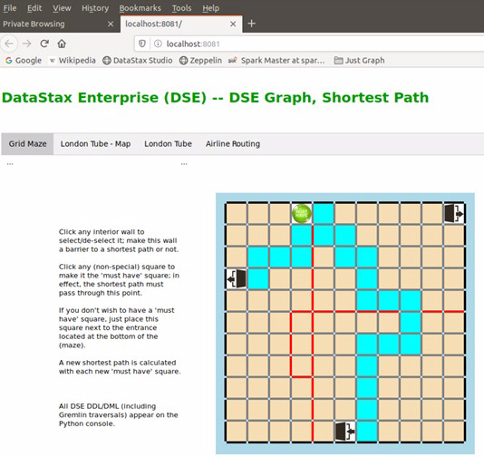
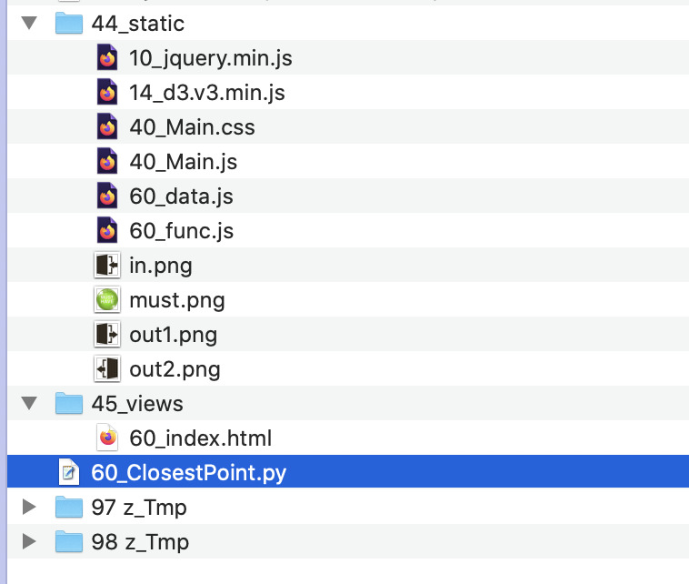
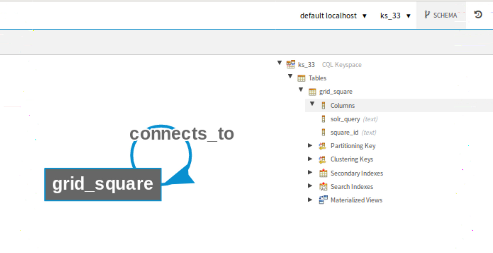
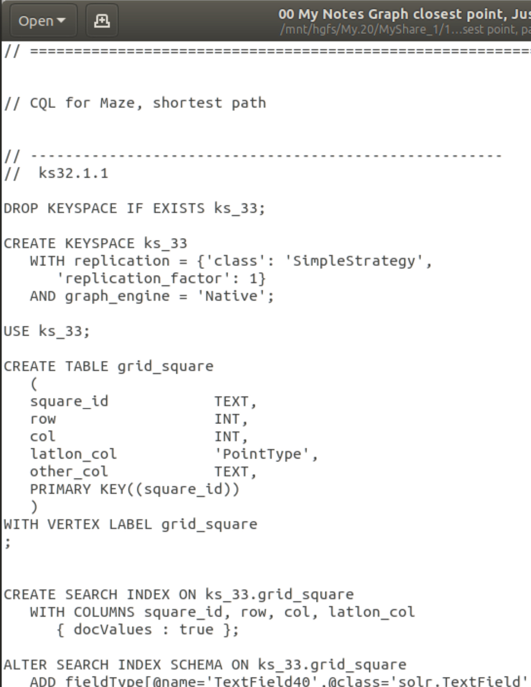
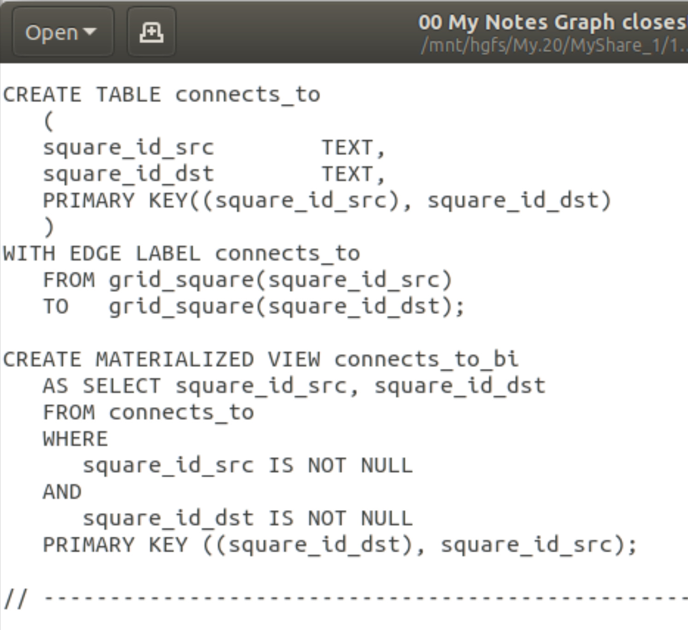
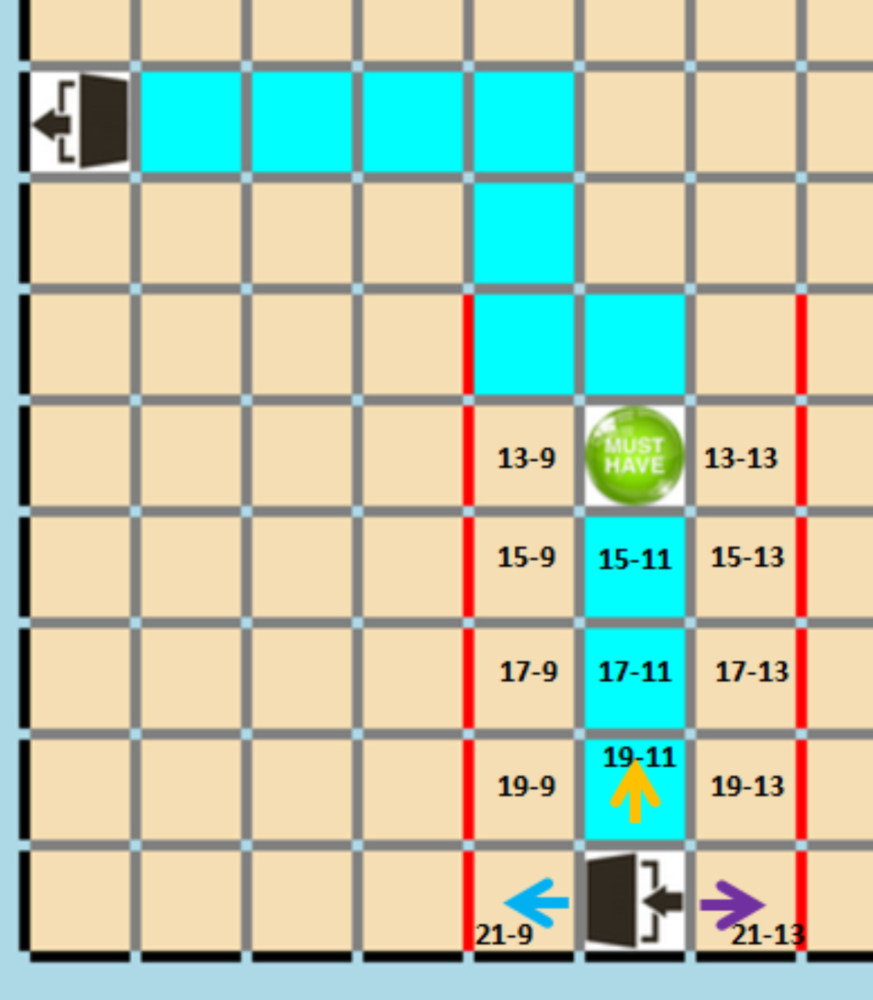

| **[Monthly Articles - 2022](../../README.md)** | **[Monthly Articles - 2021](../../2021/README.md)** | **[Monthly Articles - 2020](../../2020/README.md)** | **[Monthly Articles - 2019](../../2019/README.md)** | **[Monthly Articles - 2018](../../2018/README.md)** | **[Monthly Articles - 2017](../../2017/README.md)** | **[Data Downloads](../../downloads/README.md)** |
|-------------------------|-------------------------|-------------------------|-------------------------|-------------------------|-------------------------|-------------------------|

[Back to 2019 archive](../README.md)
[Download original PDF](../DDN_2019_33_ShortestPoint.pdf)
[Companion asset: DDN_2019_33_ShortestPoint.tar](../DDN_2019_33_ShortestPoint.tar)

## From The Archive

2019 September - -
>Customer: My company has a number of shortest-path problems, for example; airlines, get me from SFO to
>JFK for passenger and freight routing. I understand graph analytics may be a means to solve this problem.
>Can you help ?
>
>Daniel: Excellent question ! This is the second of three documents in a series answering this question.
>In the first document (August/2019), we set up the DataStax Enterprise (DSE) release 6.8 Python client
>side library, and worked with the driver for both OLTP and OLAP style queries. In this second document,
>we deliver a thin client Web user interface that allows us to interact with a (grid maze), prompting
>and then rendering the results to a DSE Graph shortest path query (traversal). In the third and final
>document in this series (October/2019), we will backfill all of the DSE Graph (Apache Gremlin) traversal
>steps you would need to know to write the shortest path query on your own, without aid.
>
>All of the source code to the client program, written in Python, is available below as a Linux Tar ball.
>
>[Read article online](./README.md)
>
>[Application program code](../DDN_2019_33_ShortestPoint.tar)


---

# DDN 2019 33 ShortestPoint

## Chapter 33. September 2019

DataStax Developer’s Notebook -- September 2019 V1.2

Welcome to the September 2019 edition of DataStax Developer’s Notebook (DDN). This month we answer the following question(s); My company has a number of shortest-path problems, for example; airlines, get me from SFO to JFK for passenger and freight routing. I understand graph analytics may be a means to solve this problem. Can you help ? Excellent question ! This is the second of three documents in a series answering this question. In the first document (August/2019), we set up the DataStax Enterprise (DSE) release 6.8 Python client side library, and worked with the driver for both OLTP and OLAP style queries. In this second document, we deliver a thin client Web user interface that allows us to interact with a (grid maze), prompting and then rendering the results to a DSE Graph shortest path query (traversal). In the third and final document in this series (October/2019), we will backfill all of the DSE Graph (Apache Gremlin) traversal steps you would need to know to write the shortest path query on your own, without aid.

## Software versions

The primary DataStax software component used in this edition of DDN is DataStax Enterprise (DSE), currently release 6.8 EAP (Early Access Program). All of the steps outlined below can be run on one laptop with 16 GB of RAM, or if you prefer, run these steps on Amazon Web Services (AWS), Microsoft Azure, or similar, to allow yourself a bit more resource.

For isolation and (simplicity), we develop and test all systems inside virtual machines using a hypervisor (Oracle Virtual Box, VMWare Fusion version 8.5, or similar). The guest operating system we use is Ubuntu Desktop version 18.04, 64 bit.

DataStax Developer’s Notebook -- September 2019 V1.2

## 33.1 Terms and core concepts

As stated above, this is the second in a three part series detailing shortest path queries (traversals) using DataStax Enterprise (DSE) Graph.

- In the first document (August/2019), we detailed using the DSE Python driver.

- In this document, we detail the data model, and traversals (and other DDL) related to shortest path queries.

- In the next document (September/2019), we provide an Apache Gremlin primer; how to get to the point of writing your own shortest part, and similar, queries.

Figure 33-1 displays the thin client Web program we detail in this document. A code review follows.



*Figure 33-1 A display of our thin client Web UI program.*

DataStax Developer’s Notebook -- September 2019 V1.2

Relative to Figure 33-1, the following is offered:

- Generally this Web user interface program works as- • A grid maze, 11 rows by 11 columns (121 total grid squares) is displayed. • One hard coded entrance square (on the bottom row), and two hard coded exit squares (one on the left column, and one on the top row), indicate where the shortest path should start and end. • The end user can place (walls) in the path by clicking on the grey colored lines. These walls are colored red. The end user can also remove these walls by clicking. There are 440 (count) possible grid walls. (There are hundreds of possible shortest paths.) The walls coming and going cause inserts and deletes into a single DataStax Enterprise (DSE) table, which stores the entity elements to our graph edge. Having an edge (record) between two squares means the squares have a relationship; you can pass to and fro. • A single (must have) square (the green circle titled, “Must Have”) is a single, specific grid square that the shortest path must pass through. This program capability is meant to model; I want to fly from SFO to JFK, but I want to pass through Houston/TX. • The blue path, is the shortest path from the entrance to either, shortest exit. The shortest path is recalculated anytime the green (must have) square is moved.

- Any DSE DDL and query statements (traversals) appear on the Python console. For simplicity, we run two traversals; get us from the entrance to the must have square, and then get us from the must have square to the closest exit.

> Note: We will also do a bit of compare and contrast-

The graph traversal to get only the shortest path may be written in one very efficient manner. A graph traversal to get the (n) shortest paths is not a difficult traversal to write, but can be resource consumptive.

Running the Web UI program Figure 33-2 displays the filesystem structure to the Web UI program. A code review follows.

DataStax Developer’s Notebook -- September 2019 V1.2



*Figure 33-2 Filesystem structure to the Web UI program*

Relative to Figure 33-2, the following is offered:

- The filesystem structure displayed above is largely due to this being a Python, Flask, AJAX, thin client Web program.

- Folder “44*” contains our JavaScript, CSS, and images. • We use JQuery (file “10*”) for access to AJAX. • We use D3 (file “14*”) to draw our grid maze, and make items there selectable by the user. • The “40*” files give us the TABbed menu displayed in Figure 33-1. • The “60*” files are ours, and contain both the data to render the grid maze, and helper JavaScript client side functions for mouse hover, select and de-select of grid walls.

- The folder “45*” contains our HTML with Jinja2 embedded Python/Flask/Bottle tags.

- And 60_ClosestPoint.py is our program proper. Just Python/run this program.

DataStax Developer’s Notebook -- September 2019 V1.2

• This program expects a version 6.8 functional DataStax Enterprise (DSE) operating at localhost/127.0.0.1, with all of the following enabled; DSE Core, DSE Search, DSE Analytics, DSE Graph.

A ‘shortest path’ data model Version 6.8 of DataStax Enterprise (DSE) allows all of our DSE Graph vertices and edges to be modeled and interacted with (DDL) as standard DSE Core tables. And this ‘simple path’ model is simple; (grid squares, our single vertex) related to one another through a single edge. Example as shown in a number of images that follow. Code reviews follow each image.



*Figure 33-3 Our simple graph model; one vertex, once edge, a self join*

Relative to Figure 33-3, the following is offered:

- This screen shot comes from DataStax Studio, release 6.8, which is bundled with the DataStax Enterprise (DSE) release 6.8 EAP distribution.

- One vertex, titled, grid_square, and with one real column, titled, square_id. This one column serves as our primary key, obviously. We load this vertex (table) with 121 (count) grid squares, and then never touch this table again. (At least; never change the contents of this table.)

- One edge (table), titled, connects_to, will store our up to 440 (count) relations between the grid squares. • Specifying that grid square “a” connects to grid square “b” will take one record in the connects_to table (edge).

DataStax Developer’s Notebook -- September 2019 V1.2

Graph edges are directional, and thus the relationship (does grid square “b” also connect to grid square “a”) is a different, second record that needs to appear in the edge table.

> Note: Why are we telling you this ?

In our grid maze, in our application, each square “a” to square “b” relationship will be modeled, recorded as bidirectional, and thus, we will insert two rows into the edge table for each single square pair relationship.

Aren’t bidirectional relationships a given ?

No. Off season, I can fly from Vail/CO to Denver/CO 11 AM and later, but I can not also fly from Denver/CO to Vail/CO after 11 AM.

• To reflect that the program may pass from square “a” to square “b”, we will INSERT into the edge table. To reflect that we may not pass as described, we will DELETE from the edge table. In each case; we will INSERT two rows, and DELETE two rows, to reflect the bidirectional edge relationship.

Figure 33-4 displays the CQL (CREATE TABLE statement) for our vertex (table. A code review follows.

DataStax Developer’s Notebook -- September 2019 V1.2



*Figure 33-4 CQL for our vertex (table)*

Relative to Figure 33-4, the following is offered:

- A keyspace is created to support graph. Based on your specific EAP release version, you may see the keyword; Native, or Core. Core is the keyword that will enter the production release.

- Then we create the (standard, DSE Core) table, with a vertex support clause.

DataStax Developer’s Notebook -- September 2019 V1.2

- The columns titled, row, col, latlon_col, and other_col, are not used in this example, nor are any DSE Search indexes.

> Note: We may cover DSE Search indexes and DSE Graph traversals in the next edition of this document series.

Figure 33-5 details our edge (table) creation. A code review follows.



*Figure 33-5 CQL for our edge (table)*

Relative to Figure 33-5, the following is offered:

- Edges also exist as standard DSE (Core) tables, with a small graph specific clause trailing the CREATE TABLE statement proper. In this case, we see a “WITH EDGE LABEL” clause. Comments: • The edge label may be the same value as the table name proper.

DataStax Developer’s Notebook -- September 2019 V1.2

• Edges are directional, and specify a source (or from) vertex, and a destination (or to) vertex.

> Note: Vertices are normally named after nouns, and edges are normally named after verbs.

- Notice the two columns names referenced in the FROM and TO blocks of the edge definition; these column names do not actually exist in the vertex (table). DSE Graph knows to reference the primary key columns from the vertex. Since this is a self-join, a recursive join, we need distinct column names in the edge to differentiate the source (FROM) and destination (TO) columns. Thus; we make names up. It is common to name these columns something_src (for source) and something_dst (for dest, destination).

- Materialized views serve many purposes inside DSE; one purpose for materialized views is to provide an alternate primary key lookup, as is the case here. DSE materialized views are automatically updated (INSERT, DELETE, UPDATE) as its base (source, reference) table gets updated. The materialized view supports referencing the edge in the reverse lookup direction. E.g., Who does Dave know, and who knows Dave.

## 33.2 Complete the following

At this point in this document, let us state the following:

- All previous topics were just background; the data model, how we plan to INSERT and DELETE edge entity instances (rows) to (model) available shortest paths through the grid maze, other.

- Now we begin to drill into the actual DSE Graph traversals (queries) that answer the shortest path question.

Example 33-1 displays the first half of our query; how to get from the starting square (the entrance to the grid maze), to the (must have) square. A code review follows.

### Example 33-1 The first part of our shortest path traversal

```text
#Sample return data format below,
#
# [{'square': 'x19-13'}, {'square': 'x19-15'}, {'square': 'x19-17'}]
```

```text
l_stmt = \
```

DataStax Developer’s Notebook -- September 2019 V1.2

```text
"g.V() " + \
" .has('grid_square', 'square_id', 'x21-11') " + \
" .repeat( " + \
" out('connects_to') " + \
" .dedup() " + \
" ) " + \
" .until( " + \
" has('square_id', '" + l_sq + "') " + \
" ) " + \
" .path() " + \
" .project('path') " + \
" .by( " + \
" unfold() " + \
" .values('square_id') " + \
" .fold() " + \
" ) " + \
" .next() "
```

```text
#... lines deleted in client program
```

```text
try:
l_data = m_session.execute_graph(l_stmt,
execution_profile=EXEC_PROFILE_GRAPH_DEFAULT )[0]
l_arra = l_data["path"]
#
for l_elem in l_arra:
l_dict = { "square" : l_elem.encode('ascii', 'ignore')}
l_returnPath.append(l_dict)
except:
print " (No path found, or traversal timeout reached.)"
```

Relative to Example 33-1, the following is offered:

- A slightly simpler DSE Graph traversal was possible, however; imagine our front end user interface team had very specific data formatting restrictions. A sample of the data, and the data format to be passed to the client program is listed first in Example 33-1, in the Python program comments. If we could just return an array of grid square values in the shortest path, we could drop two or three lines from our traversal. We can’t though, per presumed user interface requirements.

- The traversal starts as, g.V(), meaning, the traversal (query) will start at any/all of the available vertices (available within this graph traversal source). We only have one vertex, titled, grid_square.

DataStax Developer’s Notebook -- September 2019 V1.2

V() is an Apache Gremlin traversal step , normally moving us in the graph, in most cases, from one vertex to a related vertex; related through the associated (connecting) edge. As it stands, this V() reference is merely our starting point in the traversal.

> Note: All DSE Graph (Apache Gremlin traversals start with a g.V(), or a g.E().

g.E() traversals start at a single or set of edges, while g.V() traversals start on a single or set of vertices.

> Note: The Linux hard disk contains thousands of folders, directories. If you are sitting at a Linux shell prompt, you have a current working directory. As you may change directories looking for a specific file, up or down in the filesystem hierarchy, your current working directory will change.

Continuing with the analogy above; each directory would be an entity instance in a vertex containing all directories. The edge entity instances would record the relationships between a parent directory, and its children. Given, 1 parent directory with 3 child directories ? • 4 Entity instances in the vertex; 4 directories total. • 3 Entity instances in the edge; there are 3 relationships, the single parent to each of 3 child directories.

The directories example is interesting, because normally, parent directories drill-down to child directories, and nothing else. Eventually you hit directories that contain only files, and no further sub-directories.

But, Linux also allows links; any (child) directory can be associated with multiple parent directories. Seems like a graph problem.

DataStax Developer’s Notebook -- September 2019 V1.2

> Note: A DSE Graph traversal (a query) will spawn multiple traversers , (logical execution agents). If you start at a vertex, and select 3 entity instances from that vertex, each of these identified/selected entity instances will then get its own traverser. Why ? Each of these 3 entity instances may head off to different areas of the graph (traverse to new vertices or edges, and any distinct entity instances these contain), and each of the distinct entity instances will develop its own context; where is it (where did this choice traverse to), and how did this traverser get here, other.

You can see the many (dozens, hundreds, or more) traversers any given traversal spawns using the profile() step.

- The has() step is an Apache Gremlin filter step , and in this case states, • Only start at the grid_square vertex, which happens to be our only vertex. • And filter (like a SQL SELECT WHERE clause), on the property key (column) titled, square_id, and where’s its value is, x21-11.

> Note: Regarding the value, x21-11 ..

This value also happens to be the identifier of the square we render on the grid maze, using the D3 JavaScript library. D3, and even HTML identifiers can not start with a numbers, and must start with an alpha. We chose the alpha, “x”.

We are rendering both walls and squares. Thus, the rows and columns of (squares) are actually all odd numbered, and the walls are all even numbered, as they appear between the squares. So, the second row of squares will actually be numbered 3. The third row of squares is numbered 5, and so on.

- Then we enter a repeat() step. repeat() is a branching step , like if/then/else, case, or while/do, in imperative programming. repeat() steps are expected to be associated with one of two forms of (conditionals); when or how to exit the repeat() (block). The (conditional) to this repeat() step arrives in the form of an until() step modulator , aka, a step modifier .

DataStax Developer’s Notebook -- September 2019 V1.2

An expression inside the until() step modulator is expected to evaluate to true or false, and thus cause us to exit the repeat() step.

> Note: Based on data inside the graph, or based on programming error (you, in effect, create an endless repeat() loop), the traversal will eventually time out.

For OLTP style traversals, the default system wide time out is 30 seconds. For OLAP style traversals, the default time out is huge.

We covered this time out and OLTP, OLAP topics, in the first article in this 3 part series, dated, (August/2019).

The expression we use is another form of the has() step, which references Python program variable, and looks for the (must have) square.

- We have not covered the dedup() step yet. dedup() is a filter step, and works much the same as SQL SELECT UNIQUE. dedup() is actually very core to how this traversals functions; a topic we expand upon below.

- Everything from the project() step and below is just shaping our results, formatting them. project() is a map step, basically, again; shaping the outputted data.

dedup() step, breadth first, depth first The DSE Graph traversal we are presenting, code reviewing, is the most efficient means to calculate the single, shortest path from “a” to “b”. If you must calculate the (n) shortest paths, you need a different traversal.

Consider the (shortest) path output in Figure 33-6. A code review follows.

DataStax Developer’s Notebook -- September 2019 V1.2



*Figure 33-6 A short consideration of path*

Relative to Figure 33-6, the following is offered:

- From the entrance square (grid square value x21-11), there are already 3 distinct paths we may take; up/yellow/x19-11, left/blue/x21-9, and right/purple/x21-13. And each of these choices themselves offer multiple choices, and so on.

- There is currently no reason the first choice to up arrow, could not be immediately followed by a down arrow; this is a potentially valid shortest path. We don’t know until we get (there).

DataStax Developer’s Notebook -- September 2019 V1.2

Depth first search (DFS) Depth first search (DFS) is the default expected behavior for DSE Graph traversals run using OLTP. To explain what this means, we’ll detail a simpler, examination traversal shown below in Example 33-2. A code review follows.

### Example 33-2 Simpler, examination traversal

```text
g.V()
.has('grid_square', 'square_id', 'x21-11')
.emit()
.repeat(
out('connects_to')
.dedup()
)
.until(
has('square_id', 'x13-11')
)
.path()
.by("square_id")
```

Relative to Example 33-2, the following is offered:

- This traversal is very similar to that from Example 33-1. We hard code the starting square_id, and the exit square_id, both taken from Figure 33-6.

- Without the emit() step, we would receive as output, only the single, shortest path. With the emit() step, we receive output from each iteration of the repeat() step. emit() is a step modulator used only with the repeat() step.

> Note: emit() is commonly used as a debug step when using repeat().

There are many proper use cases for emit() including,

- You’re doing friends of friends, friends of those friends, etcetera; social networks. A recursive join, the basic construct is the repeat() step.

- While you will get from friend “a”, to friend “b”, to “c” and “d”, you are friends with each, presumably. emit() will allow you to output each tuple long the path. Without emit(), you would have to de-couple the returned path programmatically, which is fine too.

DataStax Developer’s Notebook -- September 2019 V1.2

Data output from the traversal displayed in Example 33-2 is displayed in Example 33-3. A code review follows.

### Example 33-3 Data output from the previous traversal

```text
... "objects": [ "x21-11" ] },
```

```text
... "objects": [ "x21-11", "x19-11" ] },
... "objects": [ "x21-11", "x21-13" ] },
... "objects": [ "x21-11", "x21-9" ] },
```

```text
... "objects": [ "x21-11", "x19-11", "x17-11" ] },
... "objects": [ "x21-11", "x19-11", "x19-13" ] },
... "objects": [ "x21-11", "x19-11", "x19-9" ] },
... "objects": [ "x21-11", "x19-11", "x21-11" ] },
```

```text
... "objects": [ "x21-11", "x19-11", "x17-11", "x15-11" ] },
... "objects": [ "x21-11", "x19-11", "x17-11", "x15-11", "x13-11" ] },
```

```text
... "objects": [ "x21-11", "x19-11", "x17-11", "x17-13" ] },
... "objects": [ "x21-11", "x19-11", "x17-11", "x17-9" ] },
```

```text
... "objects": [ "x21-11", "x19-11", "x17-11", "x15-11", "x15-13" ] },
... "objects": [ "x21-11", "x19-11", "x17-11", "x15-11", "x15-9" ] },
```

```text
... "objects": [ "x21-11", "x19-11", "x17-11", "x15-11", "x15-13", "x13-13" ]
},
```

```text
... "objects": [ "x21-11", "x19-11", "x17-11", "x15-11", "x15-9", "x13-9" ] },
```

```text
... "objects": [ "x21-11", "x19-11", "x17-11", "x15-11", "x15-13", "x13-13",
"x11-13" ] },
// ... lines deleted
```

Relative to Example 33-3, the following is offered:

- All of the data output from this traversal is not shown, and is truncated for length, brevity. All told, the output data lists 121 (count) distinct intermediate paths from the starting point, to the requested end point. Without the emit() step, we would get only the single, shortest path. With the emit() step, we get all distinct and intermediate candidate shortest paths.

- As the traversal is constructed, the first tuple output is our starting grid square, x21-11.

- The next 3 tuples output are; x19-11, x21-13, and x21-9.

DataStax Developer’s Notebook -- September 2019 V1.2

Notice these are string values, and are returned in ASCII collation sequence, as we are accessing these tuples via the primary key index.

- The next 4 tuples are all (off shoots) from x19-11, the first of 3 grid squares retrieved above. The last of these 4 tuples is a double-back to our previous source; x21-11.

- The 2 tuples ending with values (x15-11, x13-11) may initially be misleading- • x15-11 is expected, following our depth first search order. • x13-11 is not actually output from the emit() step preceding our repeat() step/block. x13-11 is output from the path() step that trails the repeat() step.

- Minus (solution grid squares equal to x13-11), all additional outputted grid square follow a depth first search pattern.

> Note: Depth first search (DFS) is the default, expected search order for OLTP style DSE Graph traversals. Having trouble visualizing DFS ? Imagine entering the grid maze and only making left turns. Or imagine a tree, where you only proceed down every left-most branch until its end, at which point you back up and then take the next right branch; rinse, repeat. Or, if you must, run the traversal above, output and (chart, draw) the data.

> Note: As a guidelines we say; OLTP traversals and depth first, and OLAP traversals are breadth first, but there are many exceptions.

Barrier steps (not yet covered) inside an OLTP style traversal will cause the depth first search to become a depth first search (DFS).

Why do you even care ? If you know how the traversal is (walking the graph), you can make significant optimizations to your traversals, and have them complete in much less time. Our single shortest path traversal uses a dedup, and the fact that this traversal is depth first, to run faster and consume much less resource than, for example, a (return the (n) shortest path results traversal). We cover this topic more below.

DataStax Developer’s Notebook -- September 2019 V1.2

Breadth first search (BFS) To demonstrate a breadth first search, we can use nearly the same traversal as above (only the path().by() step is slightly different), and view the outputted data in a similar manner.

Example 33-4 displays the breadth first search traversal. Remember to run this traversal using OLAP; it is running this traversal as OLAP that makes it breadth first.

### Example 33-4 Breadth first traversal, run as OLAP

```text
g.V()
.has('grid_square', 'square_id', 'x21-11')
.emit()
.repeat(
out('connects_to')
.dedup()
)
.until(
has('square_id', 'x13-11')
)
.path()
.by("id")
```

Example 33-5 displays the data output from the traversal above. the data is retrieved in a breadth first manner.

### Example 33-5 Breadth first traversal, data that is output

```text
// ** "grid_square" below shortened to "gs"
```

```text
... "objects": [ "dseg:/gs/x21-11" ] },
```

```text
... "objects": [ "dseg:/gs/x21-11", "dseg:/gs/x21-9" ] },
... "objects": [ "dseg:/gs/x21-11", "dseg:/gs/x21-13" ] },
... "objects": [ "dseg:/gs/x21-11", "dseg:/gs/x19-11" ] },
```

```text
... "objects": [ "dseg:/gs/x21-11", "dseg:/gs/x21-13", "dseg:/gs/x21-11" ] },
... "objects": [ "dseg:/gs/x21-11", "dseg:/gs/x19-11", "dseg:/gs/x17-11" ] },
... "objects": [ "dseg:/gs/x21-11", "dseg:/gs/x21-9", "dseg:/gs/x19-9" ] },
```

```text
... "objects": [ "dseg:/gs/x21-11", "dseg:/gs/x21-13", "dseg:/gs/x19-13" ] },
// seems breadth first until this point
```

DataStax Developer’s Notebook -- September 2019 V1.2

```text
... "objects": [ "dseg:/gs/x21-11", "dseg:/gs/x19-11", "dseg:/gs/x17-11",
"dseg:/gs/x17-9" ] },
... "objects": [ "dseg:/gs/x21-11", "dseg:/gs/x19-11", "dseg:/gs/x17-11",
"dseg:/gs/x17-13" ] },
... "objects": [ "dseg:/gs/x21-11", "dseg:/gs/x19-11", "dseg:/gs/x17-11",
"dseg:/gs/x15-11" ] },
```

```text
... "objects": [ "dseg:/gs/x21-11", "dseg:/gs/x19-11", "dseg:/gs/x17-11",
"dseg:/gs/x15-11", "dseg:/gs/x13-11" ] },
... "objects": [ "dseg:/gs/x21-11", "dseg:/gs/x19-11", "dseg:/gs/x17-11",
"dseg:/gs/x17-13", "dseg:/gs/x15-13" ] },
... "objects": [ "dseg:/gs/x21-11", "dseg:/gs/x19-11", "dseg:/gs/x17-11",
"dseg:/gs/x17-9", "dseg:/gs/x15-9" ] },
... "objects": [ "dseg:/gs/x21-11", "dseg:/gs/x19-11", "dseg:/gs/x17-11",
"dseg:/gs/x17-9", "dseg:/gs/x15-9", "dseg:/gs/x13-9" ] },
... "objects": [ "dseg:/gs/x21-11", "dseg:/gs/x19-11", "dseg:/gs/x17-11",
"dseg:/gs/x17-13", "dseg:/gs/x15-13", "dseg:/gs/x13-13" ] },
... "objects": [ "dseg:/gs/x21-11", "dseg:/gs/x19-11", "dseg:/gs/x17-11",
"dseg:/gs/x17-13", "dseg:/gs/x15-13", "dseg:/gs/x13-13", "dseg:/gs/x11-13" ] },
... "objects": [ "dseg:/gs/x21-11", "dseg:/gs/x19-11", "dseg:/gs/x17-11",
"dseg:/gs/x17-9", "dseg:/gs/x15-9", "dseg:/gs/x13-9", "dseg:/gs/x11-9" ] },
// ... lines deleted
```

Relative to Example 33-5, the following is offered:

- It is the data output in Example 33-3 and Example 33-5 that proves the depth first versus breadth first execution. We compared depth first execution to a (left turn only) style of execution; not entirely accurate, but it gets the point across. Breadth first is best described as (every time you can branch, take 1 steps from the first branch, then 1 step from the second branch, rinse repeat). Breadth first could be viewed as a more balanced execution. Certainly breadth first is more easily parallelized.

- Again; in this case, it was calling for OLTP or OLAP execution via the client side driver that caused this behavior. However; given Apache Gremlin traversal steps can also cause breadth first execution.

A few more thoughts on shortest path-

- The repeat() step will attempt to (go backwards), effectively re-entering a grid square we just exited. Why wouldn’t it ?

DataStax Developer’s Notebook -- September 2019 V1.2

- There are two (count) additional filter steps that we wont detail much here; simplePath(), and cyclicPath(). There is also one step, of type VertexComputing, titled, shortestPath(), that is only available in OLAP run times. In short: • simplePath(), a filter step, will remove any paths which (double back upon themselves). simplePath() is to be considered a high cost filter step, because of the history that must be (stored, aggregated, compared).

> Note: We may, later, use simplePath() to calculate the (n) shortest paths.

• cyclicPath() is nearly the inverse of simplePath(), and does allow paths that (double back upon themselves). Also a higher cost filter step, there is a use case for this. Our grid maze example, is not a use case for cyclicPath().

## 33.3 In this document, we reviewed or created:

This month and in this document we detailed the following:

- How to program DSE Graph (Apache Gremlin) shortest path traversals.

- Differences between depth first versus breadth first traversals, common with shortest path and related topics.

- Perhaps some of the means to construct your traversals for debugging.

### Persons who help this month.

Kiyu Gabriel, Dave Bechberger, and Jim Hatcher.

### Additional resources:

Free DataStax Enterprise training courses,

```text
https://academy.datastax.com/courses/
```

DataStax Developer’s Notebook -- September 2019 V1.2

Take any class, any time, for free. If you complete every class on DataStax Academy, you will actually have achieved a pretty good mastery of DataStax Enterprise, Apache Spark, Apache Solr, Apache TinkerPop, and even some programming.

This document is located here,

```text
https://github.com/farrell0/DataStax-Developers-Notebook
https://tinyurl.com/ddn3000
```

DataStax Developer’s Notebook -- September 2019 V1.2
