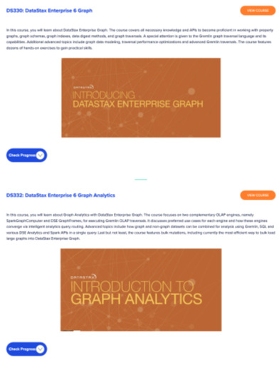
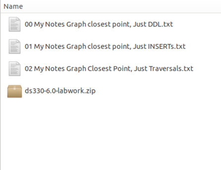
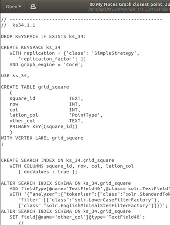
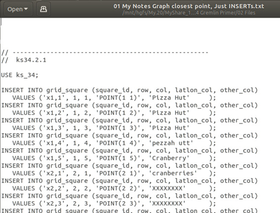
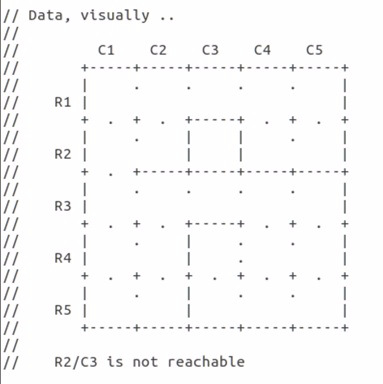
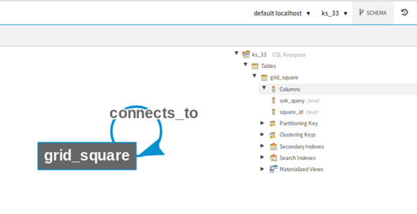

| **[Monthly Articles - 2022](../../README.md)** | **[Monthly Articles - 2021](../../2021/README.md)** | **[Monthly Articles - 2020](../../2020/README.md)** | **[Monthly Articles - 2019](../../2019/README.md)** | **[Monthly Articles - 2018](../../2018/README.md)** | **[Monthly Articles - 2017](../../2017/README.md)** | **[Data Downloads](../../downloads/README.md)** |
|-------------------------|-------------------------|-------------------------|-------------------------|-------------------------|-------------------------|-------------------------|

[Back to 2019 archive](../README.md)
[Download original PDF](../DDN_2019_34_GremlinPrimer.pdf)
[Companion asset: DDN_2019_34_GremlinPrimer.txt](../DDN_2019_34_GremlinPrimer.txt)

---

# DDN 2019 34 GremlinPrimer

## Chapter 34. October 2019

DataStax Developer’s Notebook -- October 2019 V1.2

Welcome to the October 2019 edition of DataStax Developer’s Notebook (DDN). This month we answer the following question(s); My company has a number of shortest-path problems, for example; airlines, get me from SFO to JFK for passenger and freight routing. I understand graph analytics may be a means to solve this problem. Can you help ? Excellent question ! This is the third of three documents in a series answering this question. In the first document (August/2019), we set up the DataStax Enterprise (DSE) release 6.8 Python client side library, and worked with the driver for both OLTP and OLAP style queries. In the second document in this series (September/2019), we delivered a thin client Web user interface that allowed us to interact with a (grid maze), prompting and then rendering the results to a DSE Graph shortest path query (traversal). In this third and final document in this series, we backfill all of the DSE Graph (Apache Gremlin) traversal steps you would need to know to write the shortest path query on your own, without aid.

## Software versions

The primary DataStax software component used in this edition of DDN is DataStax Enterprise (DSE), currently release 6.8 EAP (Early Access Program). All of the steps outlined below can be run on one laptop with 16 GB of RAM, or if you prefer, run these steps on Amazon Web Services (AWS), Microsoft Azure, or similar, to allow yourself a bit more resource.

For isolation and (simplicity), we develop and test all systems inside virtual machines using a hypervisor (Oracle Virtual Box, VMWare Fusion version 8.5, or similar). The guest operating system we use is Ubuntu Desktop version 18.04, 64 bit.

DataStax Developer’s Notebook -- October 2019 V1.2

## 34.1 Terms and core concepts

As stated above, this is the third document in a series. Previously we installed and used the DataStax Enterprise (DSE) version 6.8 Python client side library, and issued OLTP and OLAP style queries (traversals). Previously we also detailed a thin client Web program that gave us a user interface that managed a (grid maze), adding walls, and setting preferred passage through points on the way from an entrance, to one of two (shortest) exits.

Figure 34-1 displays the thin client Web program previously detailed.


*Figure 34-1 Thin client Web UI demonstrating shortest point*

In the previous documents in this series, and in the program above, we detailed the shortest path DSE Graph (Apache Gremlin) traversal. Now, in this document,

DataStax Developer’s Notebook -- October 2019 V1.2

we present an Apache Gremlin primer that would have gotten you to the point of writing the shortest path traversal on your own.

Getting to this point (when learning Apache Gremlin) DataStax Academy, the DataStax free, online training site, has two classes related to Apache TinkerPop/Gremlin (DSE Graph). Comments include:

- DataStax Academy is available at,

```text
https://academy.datastax.com/
https://academy.datastax.com/courses
```

Courses are free, but you do need a validated email address. Many/most classes host a free Slack support channel.



*Figure 34-2 DataStax Academy, DSE Graph classes*

DataStax Developer’s Notebook -- October 2019 V1.2

- DS 330 has 60+ modules at 10 minutes or more each. If you dig into each module, and really seek to accomplish this material, you might take 4 days to complete. DS 330 should be considered a prerequisite to DS 332, below.

- DS 332 has 10 or so modules, and might take 1 day to complete.

- Minimally for each class above, download the ‘Lab File’, which will get you all of the data, schemas and queries.

> Note: To move forward using this document, you should have; a working DataStax Enterprise (DSE) with DSE Search, DSE Analytics, and DSE Graph enabled. You should also have a CQLSH command prompt, and a working DSE Studio instance. All of these should be version 6.8 or higher.

## 34.2 Complete the following

At this point in this document, we expect you have a working DataStax Enterprise (DSE) server, and DSE Studio, both version 6.8 or higher.

Adjacent to the download location for this document,

```text
tinyurl.com/ddn3000
```

(October/2019)

is a link to download the data and command files used in the remainder of this text. Example as shown in Figure 34-3. A code review follows.

DataStax Developer’s Notebook -- October 2019 V1.2



*Figure 34-3 Files/commands used in the remainder of this file*

Relative to Figure 34-3, the following is offered:

- File “00*” contains the CREATE TABLE, and related DDL. You can run this file with a,

```text
cqlsh -f 00*
```

We detailed this significance of the CREATE TABLE, as it related to the creation of the graph data model (vertex and edges), in the August/2019 edition of this document.

> Note: File 00* also creates a number of DSE Search indexes and sample queries, which we may or may not use in this document.

DataStax Developer’s Notebook -- October 2019 V1.2



*Figure 34-4 Sample DDL code in file 00**

- File “01*” creates data for both our vertex and edge, using a number of INSERT statements. Example as shown in Figure 34-5.

DataStax Developer’s Notebook -- October 2019 V1.2



*Figure 34-5 INSERTs into our graph vertex and edge tables*

Previously our (grid maze) was 11 rows by 11 columns, which could produce hundreds of possible shortest paths. To make it much easier to check our work (are traversals returning the results we expect), the data above offers a 5 row by 5 column grid. Additionally; what walls/other should be in placed in our grid- The data above places some standard/finite walls for testing. Example as shown in Figure 34-6.

DataStax Developer’s Notebook -- October 2019 V1.2



*Figure 34-6 Data used in the examples that follow.*

The data in our test grid has grid squares valued, “x1,1”, “x1,2”, for row 1, then columns 1 then 2. Grid square “x2,3” is not reachable via any shortest path.

- And the traversals we detail below all come from file “02*”. All of the traversals (queries) are distinctly numbered, and should be run individually using DSE Studio.

DataStax Developer’s Notebook -- October 2019 V1.2

> Note: From Figure 34-6, and a grid maze 5 squares by 5 squares with no walls - – 4 squares connect to 2 other squares (the 4 corners) – 12 squares connect to 3 other squares (the 12 side squares that are not corners) – 9 squares connect to 4 other squares, the 9 inner-most squares

- The above would equal 80 total connections between squares

The super simple data model used in each of the traversals that follow is displayed in Figure 34-7.



*Figure 34-7 Data model used in these examples, seen from DSE Studio*

DataStax Developer’s Notebook -- October 2019 V1.2

Traversals in block 4 Traversals in block 4 from the “02*” files are displayed in Example 34-1. A code review follows.

### Example 34-1 Traversals from block 4, in the 02* file

```text
// 4.1 "java.lang.Long"
g.V()
.hasLabel("grid_square")
.count()
// 25
```

```text
// 4.2 "java.lang.Long"
g.E()
.hasLabel("connects_to")
.count()
// 60
```

```text
// 4.3 "java.lang.Long"
g.V()
.hasLabel("grid_square")
.out(“connects_to”)
.count()
// 60
```

```text
// 4.4 "java.lang.Long"
g.V()
.hasLabel("grid_square")
.outE(“connects_to”)
.count()
// 60
```

Relative to Example 34-1, the following is offered:

- Each of the four traversals ends with a count() step, and returns a long integer value.

- The first traversal counts our grid squares, and returns the value, 25; 5 rows by 5 columns.

- The second traversal counts the numbers of entity instances in the edge table, and returns the value, 60. Why not 80 ? Some of our grid squares have walls between them, and do not connect.

DataStax Developer’s Notebook -- October 2019 V1.2

> Note: Each of the above are very similar to a SQL, SELECT COUNT(*) FROM t1;

where t1 is a reference to our vertex, and then the edge table.

- The third and fourth traversals display alternate means to execute the second traversal- • The third traversal starts at the table titled, grid_square, and traverses to any connecting grid_square entity instances; a self-join, returning to the same entity table. In effect, this traversal counts the number of entity instances in the edge table. This traversal leave the grid_square vertex, and lands on the grid_square vertex. • The fourth traversal leaves the grid_square vertex, but stays on the connects_to edge table. Again, a count is performed.

> Note: The first and second traversals above didn’t traverse much; they each started on a single vertex or edge, and just counted.

The third and fourth traversals did traverse; they each started on a vertex, then departed (traversed) to another vertex (the same vertex, a self join), or the adjacent (incident) edge.

Traversals in block 5 Traversals in block 5 from the “02*” files are displayed in Example 34-2. A code review follows.

### Example 34-2 Traversals from block 5, in the file 02*

```text
// 5.1
"org.apache.tinkerpop.gremlin.structure.util.reference.ReferenceVertex"
g.V()
.hasLabel("grid_square")
.has("col", 3)
```

DataStax Developer’s Notebook -- October 2019 V1.2

```text
// g.V()
// .has("grid_square", "col", 3)
```

```text
// .next()
// .getClass()
```

```text
// {
// "id": "dseg:/grid_square/x1%2C3",
// "label": "grid_square",
// "type": "vertex",
// "properties": {}
// },
// {
// "id": "dseg:/grid_square/x2%2C3",
// "label": "grid_square",
// "type": "vertex",
// "properties": {}
// },
// {
// "id": "dseg:/grid_square/x3%2C3",
// "label": "grid_square",
// "type": "vertex",
// "properties": {}
// },
// {
// "id": "dseg:/grid_square/x4%2C3",
// "label": "grid_square",
// "type": "vertex",
// "properties": {}
// },
// {
// "id": "dseg:/grid_square/x5%2C3",
// "label": "grid_square",
// "type": "vertex",
// "properties": {}
// }
```

```text
// 5.2 "java.lang.Integer"
g.V()
.has("grid_square", "col", 3)
.values()
```

```text
// "3",
// "Pizza Hut",
// "x1,3",
// "POINT (1 3)",
// "1",
// "3",
```

DataStax Developer’s Notebook -- October 2019 V1.2

```text
// "XXXXXXXX",
// "x2,3",
// "POINT (2 3)",
// "2",
// "3",
// "XXXXXXXX",
// "x3,3",
// "POINT (3 3)",
// "3",
// "3",
// "XXXXXXXX",
// "x4,3",
// "POINT (4 3)",
// "4",
// "3",
// "XXXXXXXX",
// "x5,3",
// "POINT (5 3)",
// "5"
```

```text
// 5.3 "java.util.LinkedHashMap"
g.V()
.has("grid_square", "col", 3)
.valueMap()
```

```text
// {
// "col": "3",
// "other_col": "Pizza Hut",
// "square_id": "x1,3",
// "latlon_col": "POINT (1 3)",
// "row": "1"
// },
// {
// "col": "3",
// "other_col": "XXXXXXXX",
// "square_id": "x2,3",
// "latlon_col": "POINT (2 3)",
// "row": "2"
// },
// {
// "col": "3",
// "other_col": "XXXXXXXX",
// "square_id": "x3,3",
// "latlon_col": "POINT (3 3)",
// "row": "3"
// },
// {
// "col": "3",
```

DataStax Developer’s Notebook -- October 2019 V1.2

```text
// "other_col": "XXXXXXXX",
// "square_id": "x4,3",
// "latlon_col": "POINT (4 3)",
// "row": "4"
// },
// {
// "col": "3",
// "other_col": "XXXXXXXX",
// "square_id": "x5,3",
// "latlon_col": "POINT (5 3)",
// "row": "5"
// }
```

```text
// 5.4 "java.util.LinkedHashMap"
g.V()
.has("grid_square", "col", 3)
.valueMap(true)
```

```text
// {
// "id": "dseg:/grid_square/x1%2C3",
// "label": "grid_square",
// "col": "3",
// "other_col": "Pizza Hut",
// "square_id": "x1,3",
// "latlon_col": "POINT (1 3)",
// "row": "1"
// },
// {
// "id": "dseg:/grid_square/x2%2C3",
// "label": "grid_square",
// "col": "3",
// "other_col": "XXXXXXXX",
// "square_id": "x2,3",
// "latlon_col": "POINT (2 3)",
// "row": "2"
// },
// {
// "id": "dseg:/grid_square/x3%2C3",
// "label": "grid_square",
// "col": "3",
// "other_col": "XXXXXXXX",
// "square_id": "x3,3",
// "latlon_col": "POINT (3 3)",
// "row": "3"
// },
// {
// "id": "dseg:/grid_square/x4%2C3",
// "label": "grid_square",
```

DataStax Developer’s Notebook -- October 2019 V1.2

```text
// "col": "3",
// "other_col": "XXXXXXXX",
// "square_id": "x4,3",
// "latlon_col": "POINT (4 3)",
// "row": "4"
// },
// {
// "id": "dseg:/grid_square/x5%2C3",
// "label": "grid_square",
// "col": "3",
// "other_col": "XXXXXXXX",
// "square_id": "x5,3",
// "latlon_col": "POINT (5 3)",
// "row": "5"
// }
```

```text
// 5.5 "java.util.LinkedHashMap"
g.V()
.has("grid_square", "col", 3)
.valueMap("square_id", "row", "col")
```

```text
// {
// "square_id": "x1,3",
// "row": "1",
// "col": "3"
// },
// {
// "square_id": "x2,3",
// "row": "2",
// "col": "3"
// },
// {
// "square_id": "x3,3",
// "row": "3",
// "col": "3"
// },
// {
// "square_id": "x4,3",
// "row": "4",
// "col": "3"
// },
// {
// "square_id": "x5,3",
// "row": "5",
// "col": "3"
// }
```

DataStax Developer’s Notebook -- October 2019 V1.2

```text
// 5.6 "java.util.LinkedHashMap"
g.V()
.has("grid_square", "col", 3)
.project("square_id")
.by("square_id")
```

```text
// {
// "square_id": "x1,3"
// },
// {
// "square_id": "x2,3"
// },
// {
// "square_id": "x3,3"
// },
// {
// "square_id": "x4,3"
// },
// {
// "square_id": "x5,3"
// }
```

```text
// 5.7 "java.util.LinkedHashMap"
g.V()
.has("grid_square", "col", 3)
.project("square_id", 'col_id') // notice col_id is made up
.by("square_id")
.by(identity())
```

```text
// {
// "square_id": "x1,3",
// "col_id": {
// "id": "dseg:/grid_square/x1%2C3",
// "label": "grid_square",
// "type": "vertex",
// "properties": {}
// }
// },
// {
// "square_id": "x2,3",
// "col_id": {
// "id": "dseg:/grid_square/x2%2C3",
// "label": "grid_square",
// "type": "vertex",
// "properties": {}
// }
// },
// {
```

DataStax Developer’s Notebook -- October 2019 V1.2

```text
// "square_id": "x3,3",
// "col_id": {
// "id": "dseg:/grid_square/x3%2C3",
// "label": "grid_square",
// "type": "vertex",
// "properties": {}
// }
// },
// {
// "square_id": "x4,3",
// "col_id": {
// "id": "dseg:/grid_square/x4%2C3",
// "label": "grid_square",
// "type": "vertex",
// "properties": {}
// }
// },
// {
// "square_id": "x5,3",
// "col_id": {
// "id": "dseg:/grid_square/x5%2C3",
// "label": "grid_square",
// "type": "vertex",
// "properties": {}
// }
// }
```

```text
// 5.8 "org.apache.tinkerpop.gremlin.structure.util.reference.ReferenceEdge"
g.V()
.hasLabel("grid_square")
.outE("connects_to")
```

```text
// {
// "id": "dseg:/grid_square-connects_to-grid_square/x4%2C3/x4%2C4",
// "label": "connects_to",
// "type": "edge",
// "inVLabel": "grid_square",
// "outVLabel": "grid_square",
// "inV": "dseg:/grid_square/x4%2C4",
// "outV": "dseg:/grid_square/x4%2C3"
// },
// {
// "id": "dseg:/grid_square-connects_to-grid_square/x4%2C3/x5%2C3",
// "label": "connects_to",
// "type": "edge",
// "inVLabel": "grid_square",
// "outVLabel": "grid_square",
// "inV": "dseg:/grid_square/x5%2C3",
```

DataStax Developer’s Notebook -- October 2019 V1.2

```text
// "outV": "dseg:/grid_square/x4%2C3"
// },
// ... lines deleted
```

Relative to Example 34-2, the following is offered:

- Where the very first block (block 4) of sample traversals was kind of (Hello World), this block gives focus to shaping data; how we format our results set that is returned to the client program.

> Note: Any traversal can be followed by a,

```text
.next().getClass()
```

to get the data type that is being returned to the calling function (client program).

Why do you need this information ? DSE Graph traversals are inherently different than SQL SELECT statements. Traversals move through the graph , effectively having state. Contrast this to a SQL SELECT which is effectively just lists of tuples being output without state. Know this; there are steps in a traversal ( like count() ) that effectively terminate your ability to traverse. count() outputs a long integer value (a count); how do you continue traversing from a single numeric value ?

Still not getting it ? Certain traversal steps end your ability to continue traversing through the graph.

- Two traversals are listed under “5.1”, and they are semantically equivalent traversals. • hasLabel() is a filter step, and allows you to specify one of more vertex labels (read from this vertex), or edge labels (same, but for edges). • And overloaded form of has() allows you to specify the vertex/edge label, and a query predicate in one method invocation. • When programming an actual traversal in an actual client program, the traversal statement proper would end with a next() or iterate() programming method.

DataStax Developer’s Notebook -- October 2019 V1.2

DSE Studio will effectively add the next()/iterate() method for you. Without an explicit next(), and with an explicit getClass(), the data type returned would be ReferenceVertex. If we terminated on an edge, the return value would be, ReferenceEdge. These return types indicate that we can continue traversing, should we choose • Here we return all entity instances in the vertex titled, grid_square, with a property key value equal to 3, on the property key titled, col.

- The second traversal, “5.2”, takes the above traversal and ends with a values() step. • Here the return value is an array of whatever was produced in the traversal. getClass() would output the first property key value output; in our case, an integer. As an integer, or array of values, we could not continue traversing. • values() outputs an unlabeled array of values. We find valueMap() to be more useful. values() is a labeled as a map step; map, as in mapping, or shaping.

- Traversals 5.3 though 5.5 display various forms of valueMap(). • valueMap() is our go to method for outputting/shaping simple return values to the calling function. valueMap() is also a map/mapping step. • The project() step is more functional than valueMap(), and is covered below.

- Traversal 5.6 displays our first use of the project() step. • project() is a map step, and offers greater functionality over valueMap(). project() can lookup or derive values not generally in scope.

> Note: “not generally in scope”; what does that mean ?

This is a topic we must and will expand upon. For now, Imagine you traverse from the persons vertex to (place, an edge) to orders (the adjacent vertex). By default, the only property keys in scope would be from the orders vertex, and not property keys from persons. You will need techniques (steps), to reference values from persons, or to derive values, other. This is what we are building towards.

DataStax Developer’s Notebook -- October 2019 V1.2

• The effect of traversal 5.6 is no different than what we could have achieved using valueMap(). We could have relabeled the property key titled, square_id using project(), but do not in this example.

> Note: The value inside the project() method (“square_id”), is of our own choosing. We could have put the value, “Dave”, where we put “square_id”.

This value is just a label.

What goes in this (property key, column) labeled square_id, is specified by the by(), step modulator .

And here, in the by() step modulator, we say, output the value of the property key titled, square_id.

A senseless example, perhaps. We continue this example below.

- Traversal 5.7 has two labels in the project() step. • Notice “col_id” is entirely made up, like “Bruce”. What goes in the (derived) property key titled, col_id, is the value output from the method titled, identity(), in the by() modulator step below. identity() outputs values similar to a valueMap(true), detailed above, and as seen in the output that follows this given traversal. • project(“square_id”, ..).by(“square_id”) we have seen before.

- Traversal 5.8 details that you can traverse and land on an edge, and what that output data type is.

> Note: Why would you land on an edge ?

Edges can have property keys themselves, and perhaps you want to output, or in other ways interact with these property keys.

Landing on edges is not required.

Traversals in block 6 Traversals in block 6 from the “02*” files are displayed in Example 34-3. A code review follows.

### Example 34-3 Traversals from block 6, in the file 02

```text
// 6.1 "java.util.LinkedHashMap"
```

DataStax Developer’s Notebook -- October 2019 V1.2

```text
g.V()
.has("grid_square", "square_id", "x2,4")
.out("connects_to")
.out("connects_to")
.valueMap("square_id", "row", "col")
```

```text
// {
// "square_id": "x1,3",
// "row": "1",
// "col": "3"
// },
// {
// "square_id": "x1,5",
// "row": "1",
// "col": "5"
// },
// {
// "square_id": "x1,5",
// "row": "1",
// "col": "5"
// },
// {
// "square_id": "x2,4",
// "row": "2",
// "col": "4"
// },
// {
// "square_id": "x2,4",
// "row": "2",
// "col": "4"
// }
```

```text
g.V()
.has("grid_square", "square_id", "x2,4")
.out("connects_to")
.out("connects_to")
.dedup()
.valueMap("square_id", "row", "col")
```

```text
// {
// "square_id": "x1,5",
// "row": "1",
// "col": "5"
// },
// {
// "square_id": "x2,4",
// "row": "2",
// "col": "4"
```

DataStax Developer’s Notebook -- October 2019 V1.2

```text
// },
// {
// "square_id": "x1,3",
// "row": "1",
// "col": "3"
// }
```

```text
g.V()
.has("grid_square", "square_id", "x2,4")
.out("connects_to")
.out("connects_to")
.dedup()
.by("square_id") // also,
.by(values("square_id"))
.valueMap("square_id", "row", "col")
```

```text
// {
// "square_id": "x1,3",
// "row": "1",
// "col": "3"
// },
// {
// "square_id": "x1,5",
// "row": "1",
// "col": "5"
// },
// {
// "square_id": "x2,4",
// "row": "2",
// "col": "4"
// }
```

```text
g.V()
.has("grid_square", "square_id", "x2,4")
.out("connects_to")
.out("connects_to")
.dedup()
.by(values("square_id", "row"))
.valueMap("square_id", "row", "col")
```

```text
// {
// "square_id": "x1,3",
// "row": "1",
// "col": "3"
// },
// {
// "square_id": "x1,5",
```

DataStax Developer’s Notebook -- October 2019 V1.2

```text
// "row": "1",
// "col": "5"
// },
// {
// "square_id": "x2,4",
// "row": "2",
// "col": "4"
// }
```

```text
// 6.2 "java.util.LinkedHashMap"
```

```text
g.V()
.has("grid_square", "square_id", "x2,4").as("v1")
.out("connects_to").as("v2")
.out("connects_to").as("v3")
.project("v1-c1", "x1-c2", "v2-c1", "v3-c1")
.by(select("v1").values("square_id"))
.by(select("v1").values("row"))
.by(select("v2").values("square_id"))
.by(select("v3").values("square_id"))
// .dedup()
```

```text
// Above; dedup() not required, but will function
```

```text
// {
// "v1-c1": "x2,4",
// "x1-c2": "2",
// "v2-c1": "x2,5",
// "v3-c1": "x1,5"
// },
// {
// "v1-c1": "x2,4",
// "x1-c2": "2",
// "v2-c1": "x2,5",
// "v3-c1": "x2,4"
// },
// {
// "v1-c1": "x2,4",
// "x1-c2": "2",
// "v2-c1": "x1,4",
// "v3-c1": "x1,3"
// },
// {
// "v1-c1": "x2,4",
// "x1-c2": "2",
// "v2-c1": "x1,4",
// "v3-c1": "x1,5"
// },
```

DataStax Developer’s Notebook -- October 2019 V1.2

```text
// {
// "v1-c1": "x2,4",
// "x1-c2": "2",
// "v2-c1": "x1,4",
// "v3-c1": "x2,4"
// }
```

```text
// 6.3 "java.util.LinkedHashMap"
```

```text
g.V()
.has("grid_square", "col", 3)
.as("a")
.project("my_current", "my_neighbors")
.by(select("a").valueMap("square_id", "row", "col"))
.by(__.in().fold())
```

```text
// {
// "my_current": {
// "square_id": "x1,3",
// "row": "1",
// "col": "3"
// },
// "my_neighbors": [
// {
// "id": "dseg:/grid_square/x1%2C2",
// "label": "grid_square",
// "type": "vertex",
// "properties": {}
// },
// {
// "id": "dseg:/grid_square/x1%2C4",
// "label": "grid_square",
// "type": "vertex",
// "properties": {}
// }
// ]
// },
// {
// "my_current": {
// "square_id": "x2,3",
// "row": "2",
// "col": "3"
// },
// "my_neighbors": []
// },
// {
// "my_current": {
// "square_id": "x3,3",
```

DataStax Developer’s Notebook -- October 2019 V1.2

```text
// "row": "3",
// "col": "3"
// },
// "my_neighbors": [
// {
// "id": "dseg:/grid_square/x3%2C2",
// "label": "grid_square",
// "type": "vertex",
// "properties": {}
// },
// {
// "id": "dseg:/grid_square/x3%2C4",
// "label": "grid_square",
// "type": "vertex",
// "properties": {}
// }
// ]
// },
// {
// "my_current": {
// "square_id": "x4,3",
// "row": "4",
// "col": "3"
// },
// "my_neighbors": [
// {
// "id": "dseg:/grid_square/x4%2C4",
// "label": "grid_square",
// "type": "vertex",
// "properties": {}
// },
// {
// "id": "dseg:/grid_square/x5%2C3",
// "label": "grid_square",
// "type": "vertex",
// "properties": {}
// }
// ]
// },
// {
// "my_current": {
// "square_id": "x5,3",
// "row": "5",
// "col": "3"
// },
// "my_neighbors": [
// {
// "id": "dseg:/grid_square/x4%2C3",
// "label": "grid_square",
```

DataStax Developer’s Notebook -- October 2019 V1.2

```text
// "type": "vertex",
// "properties": {}
// },
// {
// "id": "dseg:/grid_square/x5%2C4",
// "label": "grid_square",
// "type": "vertex",
// "properties": {}
// }
// ]
// }
```

Relative to Example 34-3, the following is offered:

- This block of traversals display our first real traversing ; moving from vertex to vertex.

- Traversal 6.1 begins at the grid square valued, “x2,4”, and asks; • Where does this grid square connect ? Then, where do those grid squares connect ? (Sort of; who are my friends, and who are those person’s friends. Friends of friends.) • 5 total grid squares are returned. You can look at Figure 34-6 to confirm or deny. Why 5 ? Recall edges can be bi-directional; you might be friends with Mike, and Mike is also a friend to you.

> Note: The out() step, and nearly 10 more similar named steps ( in(), outE(), etc), are traversal steps ; steps that actually allow you to move throughout (traverse throughout) the graph.

- The first traversal labeled 6.1 is followed by another traversal (also 6.1) that adds a dedup() step. • dedup() is a filter step, like has().

DataStax Developer’s Notebook -- October 2019 V1.2

> Note: Also a super subtle topic right now- From SQL SELECT, we are conditioned to think of (traversals, queries) as single pass, top down, streaming sets of tuples with no context; just a single batch of homogeneous outputted data. Graph traversals may branch. After our first out(), we might have generated two (count) entity instances (rows) in whatever vertex we landed in. Those two rows could have headed in entirely different directions (paths) within our graph, based on what these rows relate to.

We have a a traversal source, which is easy to equate to a single graph. We have a traversal, our query. And we have traversers.

- Every entity instance we land upon in our traversing could branch in an entirely different direction in our graph.

- As such, each of these branches will have a different (history, state, whatever you call it). A traverser is the logical entity that records state as we execute a traversal. If you want to imagine that each branching in the execution of our traversal causes a an execution thread, then you might imagine a traverser as a thread control block (tcb).

• By default, dedup() and the data it operates on, is global to the traversal.

> Note: Huh ?

You will see, as you continue programming and learning graph traversals, that there are times you will want to operate on data as it is global to the (entire) traversal, or operate on data as it is local to a single traverser.

In English ?

SQL SELECT aggregate calculations have a single hierarchy; top down aggregate calculation.

Graph traversals could, for example, calculate the aggregate calculations different for each key value pair found in the result set.

DataStax Developer’s Notebook -- October 2019 V1.2

- The third traversal in the 6.1 block displays how to dedup() by a subset of property keys (a single property key) in the result set.

- The fourth traversal in the 6.1 block has a dedup() on two property keys.

- The 6.2 traversal displays a technique that will be welcome and familiar to SQL SELECT programmers. • Traversing from vertex to vertex (through edges), is effectively SQL joining . However, graph traversals could (traverse) through dozens of vertices as any relationship is explored. To that end, a traversal does not automatically have a tail . That is; unless your call for it, the traverser does not automatically keep a history of how it got to where it got. There are many steps they do call to maintain state (history), but this behavior is not automatic. In this example, we traverse from grid_square to grid_square to grid_square again, and maintain a reference to each of these (hops) using the as() step modulator. the first hop is reference-able as v1, the second as v2, then v3. • And the project() step displays how to recall these (past) values using an embedded select() step.

> Note: The select() step is used heavily with the as() step modulator.

Do not be confused that the as() step modulator precedes the select() step in the traversal.

- Traversal 6.3 displays another net new technique. • The as(“a”) step modulator with its accompanying project().by(select( ... ) is not itself new. The valueMap() step technique is new and cool, granted. • The by(__.in()) is entirely new and way cool.

DataStax Developer’s Notebook -- October 2019 V1.2

> Note: The __.in() step above is called an anonymous traversal .

The double underscore prior to the in() step is a reference to any entity instances (rows) that were produced from the outer/parent step; an iterator reference.

The in() step then produces any related vertex instances.

So an example; If the outer traversal had produced 3 persons, we could via the __in() step pull in an orders each of these persons had placed. And, we remain on the persons vertex.

This might be the first time in this document that you can begin to see how graph traversals are so much more programmable, more capable than SQL SELECT.

Traversals in block 7 Traversals in block 7 from the “02*” files are displayed in Example 34-4. A code review follows.

### Example 34-4 Traversals from block 7, in the file 02

```text
// 7.1 "java.util.LinkedHashMap"
```

```text
g.V()
.has("grid_square", "col", between(2, 4)) // >= then <
.has("row", 4)
.valueMap("square_id", "row", "col")
```

```text
// {
// "square_id": "x4,2",
// "row": "4",
// "col": "2"
// },
// {
// "square_id": "x4,3",
// "row": "4",
// "col": "3"
// }
```

```text
// 7.2 "java.util.LinkedHashMap"
```

DataStax Developer’s Notebook -- October 2019 V1.2

```text
g.V()
.hasLabel("grid_square")
.order()
.by("row", decr) // asc
.by("col", decr)
.limit(6)
.valueMap("square_id", "row", "col")
```

```text
// {
// "square_id": "x5,5",
// "row": "5",
// "col": "5"
// },
// {
// "square_id": "x5,4",
// "row": "5",
// "col": "4"
// },
// {
// "square_id": "x5,3",
// "row": "5",
// "col": "3"
// },
// {
// "square_id": "x5,2",
// "row": "5",
// "col": "2"
// },
// {
// "square_id": "x5,1",
// "row": "5",
// "col": "1"
// },
// {
// "square_id": "x4,5",
// "row": "4",
// "col": "5"
// }
```

```text
// 7.3 "java.util.LinkedHashMap"
```

```text
g.V()
.hasLabel("grid_square")
.groupCount()
.by("row")
.project("my_k", "my_v")
.by(keys)
```

DataStax Developer’s Notebook -- October 2019 V1.2

```text
.by(values)
```

```text
// {
// "my_k": [
// "1",
// "2",
// "3",
// "4",
// "5"
// ],
// "my_v": [
// "5",
// "5",
// "5",
// "5",
// "5"
// ]
// }
```

```text
// 7.4 "java.util.LinkedHashMap"
```

```text
g.V()
.hasLabel("grid_square")
.group()
.by("row") // called the
grouping axis
.by(values("col").count()) // min(), .. // called the
projection axis
.project("my_k", "my_v")
.by(keys)
.by(values)
```

```text
// {
// "my_k": [
// "1",
// "2",
// "3",
// "4",
// "5"
// ],
// "my_v": [
// "5",
// "5",
// "5",
// "5",
// "5"
// ]
// }
```

DataStax Developer’s Notebook -- October 2019 V1.2

```text
-----------------------------
```

```text
// 7.5 "java.util.LinkedHashMap"
```

```text
g.V()
.hasLabel("grid_square")
.and(
has("square_id", without("x2,2", "x2,3", "x2,4",
"x3,2", "x3,3", "x3,4", "x4,3", "x4,4")),
has("row", neq(5))
)
.valueMap("square_id", "row", "col")
```

```text
// 7.6 "java.util.LinkedHashMap"
```

```text
g.V()
.hasLabel("grid_square")
.and(
has("square_id", without("x2,2", "x2,3", "x2,4",
"x3,2", "x3,3", "x3,4", "x4,3", "x4,4")),
has("row", neq(5))
)
.group()
.by("row")
.by(values("col").count())
.order(local)
.by(values, desc)
```

```text
// {
// "square_id": "x1,1",
// "row": "1",
// "col": "1"
// },
// {
// "square_id": "x1,2",
// "row": "1",
// "col": "2"
// },
// {
// "square_id": "x1,3",
// "row": "1",
// "col": "3"
// },
// {
// "square_id": "x1,4",
// "row": "1",
```

DataStax Developer’s Notebook -- October 2019 V1.2

```text
// "col": "4"
// },
// {
// "square_id": "x1,5",
// "row": "1",
// "col": "5"
// },
// {
// "square_id": "x2,1",
// "row": "2",
// "col": "1"
// },
// {
// "square_id": "x2,5",
// "row": "2",
// "col": "5"
// },
// {
// "square_id": "x3,1",
// "row": "3",
// "col": "1"
// },
// {
// "square_id": "x3,5",
// "row": "3",
// "col": "5"
// },
// {
// "square_id": "x4,1",
// "row": "4",
// "col": "1"
// },
// {
// "square_id": "x4,2",
// "row": "4",
// "col": "2"
// },
// {
// "square_id": "x4,5",
// "row": "4",
// "col": "5"
// }
```

```text
// Why local above ..
//
// . The group() returns a "java.util.HashMap", a single object,
// so order() on that object does not work as you wish. The
// 'local' calls to drill down/into the object.
```

DataStax Developer’s Notebook -- October 2019 V1.2

```text
//
// . Would be the same as (unfolding) the group object first, then
// ordering. See below ..
```

```text
g.V()
.hasLabel("grid_square")
.and(
has("square_id", without("x2,2", "x2,3", "x2,4",
"x3,2", "x3,3", "x3,4", "x4,3", "x4,4")),
has("row", neq(5))
)
.group()
.by("row")
.by(values("col").count())
.unfold()
.order()
.by(values, desc)
```

```text
-----------------------------
```

```text
// 7.7
```

```text
g.V()
.hasLabel("grid_square")
.has("col", 4)
.order()
.by(__.in("connects_to").count(), decr)
.valueMap("square_id", "row", "col")
```

```text
// {
// "square_id": "x4,4",
// "row": "4",
// "col": "4"
// },
// {
// "square_id": "x1,4",
// "row": "1",
// "col": "4"
// },
// {
// "square_id": "x3,4",
// "row": "3",
// "col": "4"
// },
// {
// "square_id": "x5,4",
// "row": "5",
// "col": "4"
```

DataStax Developer’s Notebook -- October 2019 V1.2

```text
// },
// {
// "square_id": "x2,4",
// "row": "2",
// "col": "4"
// }
```

```text
g.V()
.hasLabel("grid_square")
.has("col", 4)
.order()
.by(__.in("connects_to").count(), decr)
.project("col1", "col2", "col3", "col4")
.by("square_id")
.by("row")
.by("col")
.by(__.in("connects_to").count())
```

```text
// {
// "col1": "x4,4",
// "col2": "4",
// "col3": "4",
// "col4": "4"
// },
// {
// "col1": "x1,4",
// "col2": "1",
// "col3": "4",
// "col4": "3"
// },
// {
// "col1": "x3,4",
// "col2": "3",
// "col3": "4",
// "col4": "3"
// },
// {
// "col1": "x5,4",
// "col2": "5",
// "col3": "4",
// "col4": "3"
// },
// {
// "col1": "x2,4",
// "col2": "2",
// "col3": "4",
// "col4": "2"
// }
```

DataStax Developer’s Notebook -- October 2019 V1.2

```text
-----------------------------
```

```text
// 7.8 "java.util.LinkedHashMap"
```

```text
g.V()
.hasLabel("grid_square")
.and(
has("square_id", without("x2,2", "x2,3", "x2,4",
"x3,2", "x3,3", "x3,4", "x4,3", "x4,4")),
has("row", neq(5))
)
.group()
.by("row")
.by(values("col").count())
.order(local)
.by(values, desc)
.limit(local, 2)
```

```text
// {
// "1": "5",
// "4": "3"
// }
```

```text
// Why the second local ? Same as above; objects ..
```

```text
g.V()
.hasLabel("grid_square")
.and(
has("square_id", without("x2,2", "x2,3", "x2,4",
"x3,2", "x3,3", "x3,4", "x4,3", "x4,4")),
has("row", neq(5))
)
.group()
.by("row")
.by(values("col").count())
.order(local)
.by(values, desc)
.unfold()
.limit(2)
```

```text
// What would, groupCount().count() output ?
// What would, groupCount().unfold().count() output ?
```

```text
-----------------------------
```

DataStax Developer’s Notebook -- October 2019 V1.2

```text
// 7.9 "java.util.LinkedHashMap"
```

```text
g.V()
.hasLabel("grid_square")
.has("row", 2)
.project("my_sq", "my_joiningSqs")
.by("square_id")
.by(out().valueMap("square_id").fold())
```

```text
// { "my_sq": "x2,1", "my_joiningSqs": [ "x1,1", "x2,2", "x3,1" ] },
// { "my_sq": "x2,2", "my_joiningSqs": [ "x1,2", "x2,1" ] },
// { "my_sq": "x2,3", "my_joiningSqs": [] },
// { "my_sq": "x2,4", "my_joiningSqs": [ "x1,4", "x2,5" ] },
// { "my_sq": "x2,5", "my_joiningSqs": [ "x1,5", "x2,4" ] }
```

```text
// Below, just different
//
// Since the col pair makes for uniq values, the fold()
// does little
//
// g.V()
// .hasLabel("grid_square")
// .has("row", 2)
// .project("my_sq", "my_joiningSqs")
// .by("square_id")
// .by(out().valueMap("square_id", "col").fold())
```

```text
// 7.10 "java.util.LinkedHashMap"
```

```text
g.V()
.hasLabel("grid_square")
.union(
has("row", 2),
has("col", 5)
)
.dedup() // wrong results without dedup()
.order() // Jira created, completed
.by("row", asc)
.by("col", asc)
.valueMap("row", "col")
```

```text
// {
// "row": "1",
// "col": "5"
// },
```

DataStax Developer’s Notebook -- October 2019 V1.2

```text
// {
// "row": "2",
// "col": "1"
// },
// {
// "row": "2",
// "col": "2"
// },
// {
// "row": "2",
// "col": "3"
// },
// {
// "row": "2",
// "col": "4"
// },
// {
// "row": "2",
// "col": "5"
// },
// {
// "row": "3",
// "col": "5"
// },
// {
// "row": "4",
// "col": "5"
// },
// {
// "row": "5",
// "col": "5"
// }
```

```text
// 7.11 "java.lang.String"
```

```text
g.V()
.hasLabel("grid_square")
.values("square_id")
.union(
max(),
min()
)
```

```text
// "x5,5",
// "x1,1"
```

```text
// 7.12 "java.util.LinkedHashMap"
```

DataStax Developer’s Notebook -- October 2019 V1.2

```text
g.V()
.hasLabel("grid_square")
.group()
.by(label)
.unfold()
.project("my_key", "my_max", "my_min")
.by(keys)
.by(select(values).unfold().values("square_id").max())
.by(select(values).unfold().values("square_id").min())
```

```text
// {
// "my_key": "grid_square",
// "my_max": "x5,5",
// "my_min": "x1,1"
// }
```

```text
// 7.13 "java.util.LinkedHashMap"
```

```text
g.V()
.hasLabel("grid_square")
.group()
.by("row")
.unfold()
.project("my_row", "my_max", "my_min")
.by(select(values).unfold().values("row"))
.by(select(values).unfold().values("square_id").max())
.by(select(values).unfold().values("square_id").min())
```

```text
// {
// "my_row": "1",
// "my_max": "x1,5",
// "my_min": "x1,1"
// },
// {
// "my_row": "2",
// "my_max": "x2,5",
// "my_min": "x2,1"
// },
// {
// "my_row": "3",
// "my_max": "x3,5",
// "my_min": "x3,1"
// },
// {
// "my_row": "4",
// "my_max": "x4,5",
// "my_min": "x4,1"
```

DataStax Developer’s Notebook -- October 2019 V1.2

```text
// },
// {
// "my_row": "5",
// "my_max": "x5,5",
// "my_min": "x5,1"
// }
```

```text
// 7.14 Filter on a derived value
//
// "java.util.LinkedHashMap"
```

```text
// SELECT
// grid_square as my_sqaure_id,
// col as my_col,
// COUNT(*) as my_cnt
// FROM
// grid_square t1,
// connects_to t2
// WHERE
// t1.square_id = t2.square_id_src
// AND
// t1.row = 2
// GROUP BY
// square_id
// HAVING COUNT(*) >= 2;
```

```text
g.V()
.has("grid_square", "row", 2)
.project("my_square_id", "my_col", "my_cnt")
.by(values("square_id"))
.by(values("col"))
.by(out("connects_to").count()) // Or, outE()
```

```text
g.V()
.has("grid_square", "row", 2)
.project("my_square_id", "my_col", "my_cnt")
.by(values("square_id"))
.by(values("col"))
.by(outE("connects_to").count())
.where(select("my_cnt").is(gte(2)))
```

```text
// {
// "my_square_id": "x2,1",
// "my_col": "1",
// "my_cnt": "3"
// },
// {
// "my_square_id": "x2,2",
```

DataStax Developer’s Notebook -- October 2019 V1.2

```text
// "my_col": "2",
// "my_cnt": "2"
// },
// {
// "my_square_id": "x2,4",
// "my_col": "4",
// "my_cnt": "2"
// },
// {
// "my_square_id": "x2,5",
// "my_col": "5",
// "my_cnt": "2"
// }
```

```text
// 7.15 Filter on a derived value, also inner select
```

```text
// First, just the inner traversal
```

```text
// "java.util.HashMap"
g.V()
.hasLabel("grid_square")
.in() // Does not return the
zero connected square
.groupCount() // so use the one below
.by("square_id")
```

```text
// "java.util.HashMap"
g.V()
.hasLabel("grid_square")
.project("my_square_id", "my_cnt")
.by(values("square_id"))
.by(outE().count())
```

```text
// "java.util.HashMap"
g.V()
.hasLabel("grid_square")
.project("my_cnt")
.by(outE().count())
```

```text
// { "my_cnt": "3" },
// { "my_cnt": "0" },
// ...
```

```text
// "java.lang.Double"
g.V()
.hasLabel("grid_square")
.project("my_cnt")
```

DataStax Developer’s Notebook -- October 2019 V1.2

```text
.by(outE("connects_to").count())
.as("my_avg")
.select("my_avg")
.by(values)
.unfold()
.mean()
.next() // Need to add this
```

```text
// Alternate to the above
g.V()
.hasLabel("grid_square")
.local(
outE("connects_to").count()
)
.mean()
.next() // Need to add this
// 2.4
```

```text
// Second, the outer traversal
```

```text
g.V()
.hasLabel("grid_square")
.project("my_square_id", "my_cnt")
.by(values("square_id"))
.by(outE("connects_to").count())
.where(select("my_cnt").is(gte(
2.4
)))
```

```text
// {
// "my_square_id": "x4,1",
// "my_cnt": "3"
// },
// {
// "my_square_id": "x4,2",
// "my_cnt": "3"
// },
// {
// "my_square_id": "x3,4",
// "my_cnt": "3"
// },
// {
// "my_square_id": "x3,2",
// "my_cnt": "3"
// },
// {
// "my_square_id": "x2,1",
// "my_cnt": "3"
```

DataStax Developer’s Notebook -- October 2019 V1.2

```text
// },
// {
// "my_square_id": "x3,1",
// "my_cnt": "3"
// },
// {
// "my_square_id": "x4,5",
// "my_cnt": "3"
// },
// {
// "my_square_id": "x4,4",
// "my_cnt": "4"
// },
// {
// "my_square_id": "x1,2",
// "my_cnt": "3"
// },
// {
// "my_square_id": "x5,4",
// "my_cnt": "3"
// },
// {
// "my_square_id": "x1,4",
// "my_cnt": "3"
// }
```

```text
g.V()
.hasLabel("grid_square")
.project("my_square_id", "my_cnt")
.by(values("square_id"))
.by(outE("connects_to").count())
.where(select("my_cnt").is(gte(
```

```text
g.V()
.hasLabel("grid_square") // Embedded, this runs many
times even
.project("my_cnt") // though it is
deterministic; Eg.,
.by(outE("connects_to").count()) // not optimal
.as("my_avg")
.select("my_avg")
.by(values)
.unfold()
.mean()
.next()
```

```text
)))
```

DataStax Developer’s Notebook -- October 2019 V1.2

```text
// {
// "my_square_id": "x4,1",
// "my_cnt": "3"
// },
// {
// "my_square_id": "x4,2",
// "my_cnt": "3"
// },
// {
// "my_square_id": "x3,4",
// "my_cnt": "3"
// },
// {
// "my_square_id": "x3,2",
// "my_cnt": "3"
// },
// {
// "my_square_id": "x2,1",
// "my_cnt": "3"
// },
// {
// "my_square_id": "x3,1",
// "my_cnt": "3"
// },
// {
// "my_square_id": "x4,5",
// "my_cnt": "3"
// },
// {
// "my_square_id": "x4,4",
// "my_cnt": "4"
// },
// {
// "my_square_id": "x1,2",
// "my_cnt": "3"
// },
// {
// "my_square_id": "x5,4",
// "my_cnt": "3"
// },
// {
// "my_square_id": "x1,4",
// "my_cnt": "3"
// }
```

```text
// 7.16 Better method to above
```

```text
def l_avg = g.V()
```

DataStax Developer’s Notebook -- October 2019 V1.2

```text
.hasLabel("grid_square")
.project("my_cnt")
.by(outE().count())
.as("my_avg")
.select("my_avg")
.by(values)
.unfold()
.mean()
.next() // Need to add this
```

```text
g.V()
.hasLabel("grid_square")
.project("my_square_id", "my_cnt")
.by(values("square_id"))
.by(outE().count())
.where(select("my_cnt").is(gte(
l_avg
)))
```

```text
// Kuppitz
```

```text
g.V().hasLabel("grid_square")
.group()
.by(outE("connects_to").count()).as("g")
.select(keys)
.mean(local).as("m")
.select("g")
.unfold()
.where(lt("m"))
.by(keys)
.by()
.select(values)
.unfold()
```

```text
// 7.17 Intersects and (unions)
```

```text
g.V()
.hasLabel("grid_square")
.sideEffect(
has("row", 2)
.aggregate("my_r2")
)
.has("col", 4)
.where(within("my_r2"))
.valueMap("square_id", "row", "col")
```

```text
// {
// "square_id": "x2,4",
```

DataStax Developer’s Notebook -- October 2019 V1.2

```text
// "row": "2",
// "col": "4"
// }
```

```text
g.V()
.hasLabel("grid_square")
.sideEffect(
has("row", 2)
.aggregate("my_r2")
)
.has("col", 4)
.where(without("my_r2"))
.valueMap("square_id", "row", "col")
```

```text
// {
// "square_id": "x3,4",
// "row": "3",
// "col": "4"
// },
// {
// "square_id": "x4,4",
// "row": "4",
// "col": "4"
// },
// {
// "square_id": "x5,4",
// "row": "5",
// "col": "4"
// },
// {
// "square_id": "x1,4",
// "row": "1",
// "col": "4"
// }
```

```text
// 7.18 (case statement)
```

```text
g.V().hasLabel("grid_square")
.has("col", 1).as("a")
.choose(
out("connects_to").count().is(gt(2L)),
constant("more than 2"),
constant("2 or less ")
).as("b")
.select("a","b")
.by("square_id")
.by()
```

DataStax Developer’s Notebook -- October 2019 V1.2

```text
// {
// "a": "x1,1",
// "b": "2 or less "
// },
// {
// "a": "x2,1",
// "b": "more than 2"
// },
// {
// "a": "x3,1",
// "b": "more than 2"
// },
// {
// "a": "x4,1",
// "b": "more than 2"
// },
// {
// "a": "x5,1",
// "b": "2 or less "
// }
```

```text
g.V()
.hasLabel("grid_square")
.has("col", 1)
.choose(values('row'))
.option(1 , constant("top" ))
.option(5 , constant("bottom"))
.option(none, constant("middle"))
```

```text
g.V()
.hasLabel("grid_square")
.has("col", 1).as("a")
.choose(values('row'))
.option(1 , constant("top" ))
.option(5 , constant("bottom"))
.option(none, constant("middle"))
.as("b")
.select("a","b")
.by("square_id")
.by()
```

```text
g.V()
.hasLabel("grid_square")
.has("col", 1).as("a")
.choose(values('row'))
.option(1 , constant("top" ))
.option(5 , constant("bottom"))
```

DataStax Developer’s Notebook -- October 2019 V1.2

```text
.option(none, constant("middle"))
.as("b")
.project("my_square_id", "my_row", "my_col", "my_label")
.by(select("a").values("square_id"))
.by(select("a").values("row"))
.by(select("a").values("col"))
.by()
```

```text
// {
// "my_square_id": "x1,1",
// "my_row": "1",
// "my_col": "1",
// "my_label": "top"
// },
// {
// "my_square_id": "x2,1",
// "my_row": "2",
// "my_col": "1",
// "my_label": "middle"
// },
// {
// "my_square_id": "x3,1",
// "my_row": "3",
// "my_col": "1",
// "my_label": "middle"
// },
// {
// "my_square_id": "x4,1",
// "my_row": "4",
// "my_col": "1",
// "my_label": "middle"
// },
// {
// "my_square_id": "x5,1",
// "my_row": "5",
// "my_col": "1",
// "my_label": "bottom"
// }
```

```text
// 7.19 not() (squares with no connections)
```

```text
g.V()
.hasLabel("grid_square")
.not(bothE("connects_to"))
.valueMap("square_id", "row", "col")
```

```text
// {
// "square_id": "x2,3",
```

DataStax Developer’s Notebook -- October 2019 V1.2

```text
// "row": "2",
// "col": "3"
// }
```

Relative to Example 34-4, the following is offered:

- This document being an Apache Gremlin primer, and it being expected that you likely know and are familiar with SQL SELECT, this block of traversals is meant to knock down (teach) many common SQL SELECT query patterns.

- Traversal 7.1has a range predicate. I.e.,

```text
SELECT ... WHERE col >= 2 and col < 4;
```

> Note: Oddly (who knows why); the Gremlin between() step is inclusive on the beginning range predicate and exclusive on the trailing predicate.

See,

```text
http://tinkerpop.apache.org/docs/3.4.4/reference/#a-note-on-predi
cates
```

- Traversal 7.2 displays an order by on two property keys, and a limit() step. I.e.,

```text
SELECT FIRST 6 ... ORDER BY row, col;
```

- Traversal 7.3 displays a GROUP BY on a single column, with an automatic COUNT(*) aggregation. Note the keys and values expressions (keywords, operators).

- Traversal 7.4 is a more manual replacement to traversal 7.3. Now you have the technique to do more than count; you could max(), min(), other.

- Traversal 7.5 displays predicate grouping; ands and ors type predicate expressions. without() operates on sets of values, obviously.

- Traversal 7.6 mostly combines some of the techniques displayed individually above.

DataStax Developer’s Notebook -- October 2019 V1.2

> Note: Traversal 7.6 displays our first use of the order(local) step.

Without local inside the order() step, this traversal would not function as we intend. Using the .next().getClass() technique detailed far above, we could determine that the group() step outputs a HashMap(); a single object of type HashMap. order() wouldn’t know how to order this single object. We could use another common technique; unfold() the HashMap, then order(), then fold() again. But this is tedious compared to the alternative. This unfold()/fold() technique is detailed after traversal 7.6. order(local) says to order within the contents of the given object; in our case, a HashMap.

As a principle we state; something(local) generally calls to operate inside an object that you have produced in your traversal.

- Traversal 7.7 displays another application of the by() step modulator, that has within it, an anonymous traversal. the by() step modulator in this case, applies to the order() step. The first traversal 7.7 example is followed by a more verbose, similar example.

- Traversal 7.8 is not entirely new, until we get to the limit() step. We’ve had the limit() before. In this example, we are limiting inside a group of key values (limiting local). Imagine a count of cities by country; return only the countries with the two highest count of cities.

- Traversal 7.9 displays a technique the SQL SELECT struggles with. Generally we state- • A SQL SELECT (group by) outputs a single hierarchy aggregate calculation with only key values, and derived values; MAX(), MIN(), etcetera, and any group by (key) columns that accompany them. Generally, with SQL, you lose all other detail. • In traversal 7.9, we see a technique to preserve non key values and non derived values. You can keep the detail. This is done via the project() with an out(), and a fold().

DataStax Developer’s Notebook -- October 2019 V1.2

Bad ass.

- Traversal 7.10 is just a (unioned SELECT) with a dedup() and (order by).

- Traversal 7.11 displays an odd use of min() and max().

- Traversal 7.12 uses some odd constructs as well. • This traversal has no initial filter, and thus, reads the entire contents of its target vertex. • The group().by(label) calls to group contents of the entire table. E.g., produce one aggregate calculation. • We project the keys, and output the min() and max(). So, this traversal is just a detailed replacement to the traversal above. With this code, you can program whatever, single, table wide aggregate calculation you prefer.

- Traversal 7.13 is a bit convoluted from a business use case stand point, is is used merely to demonstrate technique. • First we group by row; row 1, then 2, and so on. • We unfold(), so that we may operate on each of the 5 columns per row. • We project() the key, and we project the max and min square id per row. This turns out to be the left-most and right-most columns in each row. So, this seems useless, right ? (There are easier means to accomplish this seem result.) But, with this construct you could apply whatever query predicates and more.

- Traversal 7.14 displays an accompanying SQL SELECT, for means of explanation. In effect, we want to filter on a derived property key value. • Two traversals; the first listed just calculates the value we will want to filter on, a count of some sort. By function (what does this first traversal do); we calculate the number of squares, each square in row 2 connects to. This derived values is labeled as “my_cnt”. • The second and final traversal is now fully assembled. We add a where() step that filters on the derived value from above.

DataStax Developer’s Notebook -- October 2019 V1.2

> Note: Does it seem like we’ve had (n)/many filter steps so far in Gremlin ?

Yes, it does. For better or worse, Gremlin is very verbose.

- hasLabel() identifies the initial single or set of vertices or edges to begin traversals from.

- has() overloads the above, and can, in this case, add an initial query predicate. has() can also be used later as a filter step. Generally, has() is between a property key, and some constant.

- dedup() is a filter step.

- limit() is a filter step.

- While groupCount() and group() are mapping steps, they also restrict (lessen) the amount of output.

- And now where() where() largely serves two functions, • Filter on derived values. • Perform intersects, differences between data sets; two or more traversals.

- Traversal 7.15 displays the Gremlin traversal techniques, for what SQL SELECT would refer to as an inner select . This traversal is verbose, and perhaps easier to understand. Traversal

7.16 displays a more performant means to deliver this same query. • The first 3 traversals return the number of connects per unique square id. This will be our inner select. Why 3 examples ? As written, the first example fails to (return zero) for any square with zero connections. The second traversal accurately returns zero connection squares. the third example is more compact than the second example; same result. • The fourth traversal calculates the mean (average) number of connections for all squares. That answer is 2.4. • The fifth traversals is a more compact version to traversal 4. • Then we build the outer traversal only, traversal 6, using a hard coded mean value to compare to. (The first traversal in this series with a gte() expression.)

DataStax Developer’s Notebook -- October 2019 V1.2

• This last traversal in this series combines the inner and outer traversals. You’ve never previously seen that a g.V() can be embedded inside another g.V() (or g.E(). This is how we construct embedded (SELECTS).

- Traversal 7.16 offers a better, more performant answer to the traversal above. • The first traversal saves the result of the inner traversal to a program variable. • And the outer traversal (the second traversal offered in this section), makes reference to said program variable. This works, and works efficiently. This is likely the version we’d put into production; performant, easy to read and maintain. • The third and final traversal in this section works efficiently without a program variable. We (select) all of the counts as “g”, and the mean as ”m”. Then we select “g” again and apply a where() step. The unfold() is needed only because of how “g” was packaged; refer to our first local() discussion above.

- Traversal 7.18 displays the SQL SELECT equivalent of a CASE statement. We offer a number of examples in this group; various forms of (CASE).

- Traversal 7.19 displays an alternate form of returning all square ids with zero connections. Really we just wanted an example with the not() step.

Traversals in block 8 Traversals in block 8 from the “02*” files are displayed in Example 34-5. A code review follows.

### Example 34-5 Traversals from block 8, in the file 02

```text
// 8.1
```

```text
g.V()
.hasLabel("grid_square")
.has("square_id", prefix("x2"))
.valueMap("square_id", "row", "col", "other_col")
```

```text
// 8.2
```

```text
g.V()
.hasLabel("grid_square")
```

DataStax Developer’s Notebook -- October 2019 V1.2

```text
.has("square_id", regex("x.,[2-3]"))
.valueMap("square_id", "row", "col", "other_col")
```

Relative to Example 34-5, the following is offered:

- These two traversals displays you can reference DSE Search indexes when performing DSE Graph traversals.

- prefix() looks for a leading string on a DSE Search text field.

- And regex(). Here we are looking for the leading string “x.” followed by a single 2 or 3.

Traversals in block 9 Traversals in block 9 from the “02*” files are displayed in Example 34-6. A code review follows.

### Example 34-6 Traversals from block 9, in the file 02

```text
// 9.1
```

```text
g.V()
.has("grid_square", "square_id", "x4,1")
.out("connects_to")
.valueMap("square_id")
```

```text
// {
// "square_id": "x3,1"
// },
// {
// "square_id": "x4,2"
// },
// {
// "square_id": "x5,1"
// }
```

```text
// 9.2
```

```text
g.V()
.has("grid_square", "square_id", "x4,1")
.out("connects_to")
.out("connects_to")
.valueMap("square_id")
```

```text
// {
// "square_id": "x2,1"
```

DataStax Developer’s Notebook -- October 2019 V1.2

```text
// },
// {
// "square_id": "x3,2"
// },
// {
// "square_id": "x3,2"
// },
// {
// "square_id": "x4,1"
// },
// {
// "square_id": "x4,1"
// },
// {
// "square_id": "x4,1"
// },
// {
// "square_id": "x5,2"
// },
// {
// "square_id": "x5,2"
// }
```

```text
// 9.3
```

```text
g.V()
.has("grid_square", "square_id", "x4,1")
.out("connects_to")
.out("connects_to")
.has("square_id", neq("x4,1"))
.dedup()
.valueMap("square_id")
```

```text
// {
// "square_id": "x3,2"
// },
// {
// "square_id": "x5,2"
// },
// {
// "square_id": "x2,1"
// }
```

```text
// different to above
```

```text
g.V()
.has("grid_square", "square_id", "x4,1")
```

DataStax Developer’s Notebook -- October 2019 V1.2

```text
.repeat(
out("connects_to")
)
.times(2)
.has("square_id", neq("x4,1"))
.dedup()
.valueMap("square_id")
```

```text
// {
// "square_id": "x3,2"
// },
// {
// "square_id": "x5,2"
// },
// {
// "square_id": "x2,1"
// }
```

```text
g.V()
.has("grid_square", "square_id", "x4,1")
.emit()
.repeat(
out("connects_to")
)
.times(2)
.valueMap("square_id", "row", "col")
```

```text
// {
// "square_id": "x4,1",
// "row": "4",
// "col": "1"
// },
// {
// "square_id": "x3,1",
// "row": "3",
// "col": "1"
// },
// {
// "square_id": "x2,1",
// "row": "2",
// "col": "1"
// },
// {
// "square_id": "x3,2",
// "row": "3",
// "col": "2"
// },
// {
```

DataStax Developer’s Notebook -- October 2019 V1.2

```text
// "square_id": "x4,1",
// "row": "4",
// "col": "1"
// },
// {
// "square_id": "x4,2",
// "row": "4",
// "col": "2"
// },
// {
// "square_id": "x3,2",
// "row": "3",
// "col": "2"
// },
// {
// "square_id": "x4,1",
// "row": "4",
// "col": "1"
// },
// {
// "square_id": "x5,2",
// "row": "5",
// "col": "2"
// },
// {
// "square_id": "x5,1",
// "row": "5",
// "col": "1"
// },
// {
// "square_id": "x4,1",
// "row": "4",
// "col": "1"
// },
// {
// "square_id": "x5,2",
// "row": "5",
// "col": "2"
// }
```

```text
// 9.4
```

```text
g.V()
.has("grid_square", "square_id", "x4,1")
.outE("connects_to")
.outV()
.valueMap(true)
```

DataStax Developer’s Notebook -- October 2019 V1.2

```text
// {
// "id": "dseg:/grid_square/x4%2C1",
// "label": "grid_square",
// "col": "1",
// "other_col": "XXXXXXXX",
// "square_id": "x4,1",
// "latlon_col": "POINT (4 1)",
// "row": "4"
// },
// {
// "id": "dseg:/grid_square/x4%2C1",
// "label": "grid_square",
// "col": "1",
// "other_col": "XXXXXXXX",
// "square_id": "x4,1",
// "latlon_col": "POINT (4 1)",
// "row": "4"
// },
// {
// "id": "dseg:/grid_square/x4%2C1",
// "label": "grid_square",
// "col": "1",
// "other_col": "XXXXXXXX",
// "square_id": "x4,1",
// "latlon_col": "POINT (4 1)",
// "row": "4"
// }
```

```text
// 9.5
```

```text
g.V()
.has("grid_square", "square_id", "x4,1").as("v1")
.outE("connects_to").as("e1")
.outV().as("v2")
.select("v1", "e1", "v2")
```

```text
// {
// "v1": {
// "id": "dseg:/grid_square/x4%2C1",
// "label": "grid_square",
// "type": "vertex",
// "properties": {}
// },
// "e1": {
// "id": "dseg:/grid_square-connects_to-grid_square/x4%2C1/x3%2C1",
// "label": "connects_to",
// "type": "edge",
// "inVLabel": "grid_square",
```

DataStax Developer’s Notebook -- October 2019 V1.2

```text
// "outVLabel": "grid_square",
// "inV": "dseg:/grid_square/x3%2C1",
// "outV": "dseg:/grid_square/x4%2C1"
// },
// "v2": {
// "id": "dseg:/grid_square/x4%2C1",
// "label": "grid_square",
// "type": "vertex",
// "properties": {}
// }
// },
// {
// "v1": {
// "id": "dseg:/grid_square/x4%2C1",
// "label": "grid_square",
// "type": "vertex",
// "properties": {}
// },
// "e1": {
// "id": "dseg:/grid_square-connects_to-grid_square/x4%2C1/x4%2C2",
// "label": "connects_to",
// "type": "edge",
// "inVLabel": "grid_square",
// "outVLabel": "grid_square",
// "inV": "dseg:/grid_square/x4%2C2",
// "outV": "dseg:/grid_square/x4%2C1"
// },
// "v2": {
// "id": "dseg:/grid_square/x4%2C1",
// "label": "grid_square",
// "type": "vertex",
// "properties": {}
// }
// },
// {
// "v1": {
// "id": "dseg:/grid_square/x4%2C1",
// "label": "grid_square",
// "type": "vertex",
// "properties": {}
// },
// "e1": {
// "id": "dseg:/grid_square-connects_to-grid_square/x4%2C1/x5%2C1",
// "label": "connects_to",
// "type": "edge",
// "inVLabel": "grid_square",
// "outVLabel": "grid_square",
// "inV": "dseg:/grid_square/x5%2C1",
// "outV": "dseg:/grid_square/x4%2C1"
```

DataStax Developer’s Notebook -- October 2019 V1.2

```text
// },
// "v2": {
// "id": "dseg:/grid_square/x4%2C1",
// "label": "grid_square",
// "type": "vertex",
// "properties": {}
// }
// }
```

```text
// 9.6
```

```text
g.V()
.has("grid_square", "square_id", "x4,1")
.repeat(
out("connects_to")
)
.times(2)
.has("square_id", neq("x4,1"))
.dedup()
.valueMap("square_id")
```

```text
// {
// "square_id": "x2,1"
// },
// {
// "square_id": "x3,2"
// },
// {
// "square_id": "x5,2"
// }
```

Relative to Example 34-6, the following is offered:

- Again, you may wish to refer to the data in Figure 34-6 when reviewing these examples. In this section, we proceed more on the topic of actually traversing our graph.

- The first traversal, 9.1, returns grid squares that grid square 4.1 connects to.

- Traversal 9.2 returns grid squares that grid square 4.1 has a second degree of connection to. (I.e., friends of friends, and not just friends, as detailed above.) This traversal returns (double backs); legal connections, but not likely what we want.

DataStax Developer’s Notebook -- October 2019 V1.2

- Traversal 9.3 removes reference to the starting square id via the neq(), and calls to remove duplicates. The first example in this group, is then replaced with examples using a repeat() step. Why ? You obviously don’t want to have to hard code a good number of out() steps just to perform a self join, a circular join. What would you do when you don’t know how many flights it takes to get from SFO to JFK ?

- Traversal 9.4 is functionally pretty much nonsense, and serves only as an example that you can outE() and outV().

- Traversal 9.5 displays the as() and select() technique discussed above.

- And traversal 9.6 is the final example in this group, and largely the example we will build on below.

Traversals in block 10 Traversals in block 10 from the “02*” files are displayed in Example 34-7. A code review follows.

### Example 34-7 Traversals from block 10, in the file 02

```text
// 10.1
```

```text
def l_cnt = 4
```

```text
g.V()
.hasLabel("grid_square")
.where(
out("connects_to")
.count()
.is( eq(l_cnt) )
)
.order()
.by("square_id")
.valueMap("square_id")
```

```text
// {
// "square_id": "x4,4"
// }
```

```text
// 10.2
```

```text
def l_cnt = 2
```

```text
g.V()
```

DataStax Developer’s Notebook -- October 2019 V1.2

```text
.hasLabel("grid_square")
.where(
out("connects_to")
.count()
.is( eq(l_cnt) )
)
.order()
.by("square_id")
.valueMap("square_id")
```

```text
// {
// "square_id": "x1,1"
// },
// {
// "square_id": "x1,3"
// },
// {
// "square_id": "x1,5"
// },
// {
// "square_id": "x2,2"
// },
// {
// "square_id": "x2,4"
// },
// {
// "square_id": "x2,5"
// },
// {
// "square_id": "x3,3"
// },
// {
// "square_id": "x3,5"
// },
// {
// "square_id": "x4,3"
// },
// {
// "square_id": "x5,1"
// },
// {
// "square_id": "x5,2"
// },
// {
// "square_id": "x5,3"
// },
// {
// "square_id": "x5,5"
// }
```

DataStax Developer’s Notebook -- October 2019 V1.2

```text
// 10.3
```

```text
def l_cnt = 2
```

```text
g.V()
.hasLabel("grid_square")
.where(
out()
.count()
.is( lte(l_cnt) ) // note; lte() not eq()
)
.project("square_id", "count")
.by(values("square_id"))
.by(outE().count())
```

```text
// 10.4
```

```text
def l_cnt = 2
```

```text
g.V()
.hasLabel("grid_square")
.where(
out("connects_to")
.count()
.is( lte(l_cnt) )
)
.project("square_id", "count")
.by(values("square_id"))
.by(outE("connects_to").count())
.order()
.by(select("square_id"))
```

```text
// {
// "square_id": "x4,3",
// "count": "2"
// },
// {
// "square_id": "x2,3",
// "count": "0"
// },
// {
// "square_id": "x3,3",
// "count": "2"
// },
// {
// "square_id": "x5,5",
// "count": "2"
```

DataStax Developer’s Notebook -- October 2019 V1.2

```text
// },
// {
// "square_id": "x3,5",
// "count": "2"
// },
// {
// "square_id": "x5,2",
// "count": "2"
// },
// {
// "square_id": "x1,1",
// "count": "2"
// },
// {
// "square_id": "x2,2",
// "count": "2"
// },
// {
// "square_id": "x1,3",
// "count": "2"
// },
// {
// "square_id": "x5,3",
// "count": "2"
// },
// {
// "square_id": "x2,4",
// "count": "2"
// },
// {
// "square_id": "x5,1",
// "count": "2"
// },
// {
// "square_id": "x1,5",
// "count": "2"
// },
// {
// "square_id": "x2,5",
// "count": "2"
// }
```

Relative to Example 34-7, the following is offered:

- In this block we do more work with counting, and filtering on same.

DataStax Developer’s Notebook -- October 2019 V1.2

- Traversal 10.1 outputs and then sorts grid squares with 4 or more connections.

- Traversal 10.2 does the same, but connections equal to 2.

- Traversal 10.3 is an alternate form to traversal 10.2, and a form we build on below.

- Traversal 10.4 is our final form of filtering on count, then outputting same, and ordering.

Traversals in block 11 Traversals in block 11 from the “02*” files are displayed in Example 34-8. A code review follows.

### Example 34-8 Traversals from block 11, in the file 02

```text
-----------------------------------------
How to get from A to B
```

```text
This query ends on a vertex, and outputs the property keys
that are in scope, that are local to that vertex.
```

```text
That is consistent within Gremlin; makes perfect sense.
Remember as() above
------------------------------------------------------
```

```text
// 11.1 "java.util.LinkedHashMap"
```

```text
g.V()
.has("grid_square", "square_id", "x5,5")
.repeat(
out()
.simplePath()
)
.until(
has("square_id", "x4,2")
)
.valueMap("square_id", "row", "col")
```

```text
// { "square_id": [ "x4,2" ], "row": [ "4" ], "col": [ "2" ] },
// { "square_id": [ "x4,2" ], "row": [ "4" ], "col": [ "2" ] },
// { "square_id": [ "x4,2" ], "row": [ "4" ], "col": [ "2" ] },
// ...
------------------------------------------------------
```

```text
How to get from A to B, add path
```

```text
path() outputs what it outputs; id, label, type, and
```

DataStax Developer’s Notebook -- October 2019 V1.2

```text
a null properties{} set
------------------------------------------------------
```

```text
// 11.2
"org.apache.tinkerpop.gremlin.structure.util.reference.ReferencePath"
```

```text
g.V()
.has("grid_square", "square_id", "x5,5")
.repeat(
out()
.simplePath()
)
.until(
has("square_id", "x4,2")
)
.path()
```

```text
// { "labels": [ [], [], [], [], [], [], [] ],
// "objects": [ { "id": "grid_square:x5,5#40", "label": "grid_square",
"type": "vertex", "properties": {} },
// { "id": "grid_square:x4,5#41", "label": "grid_square", "type": "vertex",
"properties": {} },
// { "id": "grid_square:x4,4#40", "label": "grid_square", "type": "vertex",
"properties": {} },
// { "id": "grid_square:x3,4#47", "label": "grid_square", "type": "vertex",
"properties": {} },
// { "id": "grid_square:x3,3#40", "label": "grid_square", "type": "vertex",
"properties": {} },
// { "id": "grid_square:x3,2#41", "label": "grid_square", "type": "vertex",
"properties": {} },
// { "id": "grid_square:x4,2#46", "label": "grid_square", "type": "vertex",
"properties": {} }
// ] },
// ...
```

```text
------------------------------------------------------
```

```text
Above:
simplePath(), do not repeat paths
cyclicPath(), why ?, and not avail in OLAP
```

```text
How to get from A to B, add path and a 'by' modulator
```

```text
Add, by("square_id") reference to a property key from the vertex.
```

```text
Looking at the output from the query above, you basically get
the metacolumns (id, label, type), and properties is null-
```

DataStax Developer’s Notebook -- October 2019 V1.2

```text
The by("square_id") step modulator brings the named property
in scope, calls to output same.
------------------------------------------------------
```

```text
// 11.3
"org.apache.tinkerpop.gremlin.structure.util.reference.ReferencePath"
```

```text
g.V()
.has("grid_square", "square_id", "x5,5")
.repeat(
out()
.simplePath()
)
.until(
has("square_id", "x4,2")
)
.path()
.by("square_id")
```

```text
// { "labels": [ [], [], [], [], [], [], [] ],
// "objects": [ "x5,5", "x5,4", "x4,4", "x3,4", "x3,3", "x3,2", "x4,2" ] },
// { "labels": [ [], [], [], [], [], [], [] ],
// "objects": [ "x5,5", "x4,5", "x4,4", "x3,4", "x3,3", "x3,2", "x4,2" ] },
```

```text
------------------------------------------------------
```

```text
We drop the by("square_id") step modulator.
And we add project("path")
```

```text
Basically we are adding a (label) to whatever was in scope;
basically we add a (label) to whatever was in scope above
------------------------------------------------------
```

```text
// 11.4 "java.util.LinkedHashMap"
```

```text
g.V()
.has("grid_square", "square_id", "x5,5")
.repeat(
out()
.simplePath()
)
.until(
has("square_id", "x4,2")
)
.path()
.project("path")
```

```text
// { "path": { "labels": [ [], [], [], [], [], [], [] ],
```

DataStax Developer’s Notebook -- October 2019 V1.2

```text
// "objects": [ { "id": "grid_square:x5,5#40", "label": "grid_square",
"type": "vertex", "properties": {} },
// { "id": "grid_square:x5,4#41", "label": "grid_square", "type":
"vertex", "properties": {} },
// { "id": "grid_square:x4,4#40", "label": "grid_square", "type":
"vertex", "properties": {} },
// { "id": "grid_square:x3,4#47", "label": "grid_square", "type":
"vertex", "properties": {} },
// { "id": "grid_square:x3,3#40", "label": "grid_square", "type":
"vertex", "properties": {} },
// { "id": "grid_square:x3,2#41", "label": "grid_square", "type":
"vertex", "properties": {} },
// { "id": "grid_square:x4,2#46", "label": "grid_square", "type":
"vertex", "properties": {} }
// ] } }, {
// ...
```

```text
------------------------------------------------------
```

```text
Shape the output data from above better
```

```text
We unfold(), then values("square_id"), then fold()
This unfold(), fold() drops the null arrays/array elements
```

```text
The values("square_id") acts very much like query ks_34.8.3 above,
and pulls in the property key from the vertex.
------------------------------------------------------
```

```text
// 11.5 "java.util.LinkedHashMap"
```

```text
g.V()
.has("grid_square", "square_id", "x5,5")
.repeat(
out()
.simplePath()
)
.until(
has("square_id", "x4,2")
)
.path()
.project("path")
.by(
unfold()
.values("square_id")
.fold()
)
```

```text
{ "path": [ "x5,5", "x4,5", "x3,5", "x3,4", "x3,3", "x3,2", "x4,2" ] },
```

DataStax Developer’s Notebook -- October 2019 V1.2

```text
{ "path": [ "x5,5", "x5,4", "x4,4", "x3,4", "x3,3", "x3,2", "x4,2" ] },
{ "path": [ "x5,5", "x4,5", "x4,4", "x3,4", "x3,3", "x3,2", "x4,2" ] },
// ...
```

```text
------------------------------------------------------
```

Relative to Example 34-8, the following is offered:

- Prior to this point in this document, we were traversing, applying predicates and more, learning general techniques. Now we move to calculating shortest path, using the path() step, and more.

> Note: Remember our earlier discussion that traversals have no tails ? (No history of the traversing they have performed ?) We did have a means to overcome this behavior using as() and select(), but this was also a bit limited; each (step) had to be manually labeled. With path(), we now have a dynamic method to recall and filter on (traversal history).

- Traversal 11.1 returns to us, all possible paths from grid square 5,5 to grid square 4,2. • To accomplish this, we use a repeat() until(), and the until() has a filter, which is most common. (Otherwise we have an endless loop of sorts; not really, you would eventually expect to run out of possible choices.) • Inside the repeat(), we place a simplePath() step. simplePath() calls to avoid cyclic paths, that is; paths that repeat upon themselves.

- Traversal 11.2 is an alternate form of traversal 11.1, as are traversals 11.3 and 11.4.

- Traversal 11.5 shapes the data in the manner we prefer.

Traversals in block 12 Traversals in block 12 from the “02*” files are displayed in Example 34-9. A code review follows.

### Example 34-9 Traversals from block 12, in the file 02

```text
// 12.1 "java.util.LinkedHashMap"
```

```text
g.V()
```

DataStax Developer’s Notebook -- October 2019 V1.2

```text
.has("grid_square", "square_id", "x5,5")
.repeat(
out()
.simplePath()
)
.until(
has("square_id", "x4,3")
)
.path()
.project("path")
.by(
unfold()
.values("square_id")
.fold()
)
```

```text
// { "path": [ "x5,5", "x5,4", "x5,3", "x4,3" ] },
// { "path": [ "x5,5", "x4,5", "x4,4", "x4,3" ] },
// { "path": [ "x5,5", "x5,4", "x4,4", "x4,3" ] },
// { "path": [ "x5,5", "x4,5", "x3,5", "x3,4", "x4,4", "x4,3" ] },
// { "path": [ "x5,5", "x4,5", "x4,4", "x5,4", "x5,3", "x4,3" ] },
// { "path": [ "x5,5", "x4,5", "x3,5", "x3,4", "x4,4", "x5,4", "x5,3", "x4,3" ]
}
------------------------------------------------------
```

```text
How to get from A to B, what if there's no way
------------------------------------------------------
```

```text
// 12.2
```

```text
g.V()
.has("grid_square", "square_id", "x5,5")
.repeat(
out()
.simplePath()
)
.until(
has("square_id", "x2,3")
)
.path()
.project("path")
.by(
unfold()
.values("square_id")
.fold()
)
```

```text
// Success ! No data returned.
```

DataStax Developer’s Notebook -- October 2019 V1.2

```text
------------------------------------------------------
```

```text
http://tinkerpop.apache.org/docs/current/reference/#timelimit-step
```

```text
Setting a time limit for safety; Same as query ks34.8.1
above, returns 18 rows
```

```text
timeLimit() can be put in other areas below-
------------------------------------------------------
```

```text
// 12.3
```

```text
g.V()
.has("grid_square", "square_id", "x5,5")
.repeat(
timeLimit(40) // 40 will likely return all data
.out() // 1 likely no data
.simplePath() // A number in between; partial
data
) // based on location of
timeLimit()
.until(
has("square_id", "x4,2")
)
.path()
.project("path")
.by(
unfold()
.values("square_id")
.fold()
)
```

```text
// Success ! No data returned.
```

Relative to Example 34-9, the following is offered:

- In this block, we detail timeLimit(), a step to cause our traversal to (time out). Why ? Safety. If you understand (O to the N notation), we will state that some of these traversals scale at O to a factorial power number of possible results. Huh ?

DataStax Developer’s Notebook -- October 2019 V1.2

Some of these traversals seem simple, but actually can generate thousands of possible results. You need a time out.

> Note: In the real world, we might run two traversals; – A traversal that times out very quickly, and gets some result to the screen, to the end user quickly. – Then a longer running traversal, that gets more results, more options.

- Traversal 12.1 serves as our baseless traversal, returning results.

- Traversal 12.2 and 12.3 would return no results, and offer a time out.

Traversals in block 13 Traversals in block 13 from the “02*” files are displayed in Example 34-10. A code review follows.

### Example 34-10 Traversals from block 13, in the file 02

```text
// 13.1 "java.util.LinkedHashMap"
```

```text
g.V()
.has("grid_square", "square_id", "x5,5")
.repeat(
out()
.simplePath()
)
.until(
has("square_id", "x4,3")
)
.path()
.project("path")
.by(
unfold()
.values("square_id")
.fold()
)
```

```text
------------------------------------------------------
```

```text
limit(1); just give us the/a shortest path
------------------------------------------------------
```

```text
// 13.2 "java.util.LinkedHashMap"
```

```text
g.V()
```

DataStax Developer’s Notebook -- October 2019 V1.2

```text
.has("grid_square", "square_id", "x5,5")
.repeat(
out()
.simplePath()
)
.until(
has("square_id", "x4,3")
)
.path()
.project("path")
.by(
unfold()
.values("square_id")
.fold()
)
.limit(1)
```

Relative to Example 34-10, the following is offered:

- Traversal 13.1 is our basic form of a shortest path traversal, the one we ran in the prior edition of this document series.

- Traversal 13.2 just adds a limit() step.

> Note: The unfold(), values() and fold() block ?

Busy work to better shape our results; as our path() exists, we get some empty data elements in our result set that get discarded as the result of the unfold()/fold().

Traversals in block 14 Traversals in block 14 from the “02*” files are displayed in Example 34-11. A code review follows.

### Example 34-11 Traversals from block 14, in the file 02

```text
Path must pass thru point
------------------------------------------------------
```

```text
// 14.1 "java.util.LinkedHashMap"
```

```text
g.V()
.has("grid_square", "square_id", "x5,5")
.repeat(
out()
.simplePath()
```

DataStax Developer’s Notebook -- October 2019 V1.2

```text
)
.until(
has("square_id", "x4,3")
)
.path()
.where(unfold().has("square_id", "x5,3"))
.project("path")
.by(
unfold().values("square_id").fold()
)
```

```text
------------------------------------------------------
```

```text
Path must pass thru multiple points
```

```text
Ps,
within() is a type of predicate
within is like (any)
See,
http://tinkerpop.apache.org/docs/3.0.1-incubating/#a-note-on-predicates
------------------------------------------------------
```

```text
// 14.2 "java.util.LinkedHashMap"
```

```text
g.V()
.has("grid_square", "square_id", "x5,5")
.repeat(
out()
.simplePath()
)
.until(
has("square_id", "x4,3")
)
.path()
.where(unfold().has("square_id", "x5,3"))
.where(unfold().has("square_id", "x3,5"))
.project("path")
.by(
unfold().values("square_id").fold()
)
```

```text
------------------------------------------------------
```

```text
// Sample within() for testing ..
// ( not used)
//
// g.V()
```

DataStax Developer’s Notebook -- October 2019 V1.2

```text
// .has("grid_square", "square_id", "x5,5")
// .repeat(
// out()
// .simplePath()
// )
// .until(
// has("square_id", "x4,3")
// )
// .path()
// .where(unfold().has("square_id", within("x5,3", "x3.5")))
// .project("path")
// .by(
// unfold().values("square_id").fold()
// )
```

```text
Path must not pass thru point
------------------------------------------------------
```

```text
// 14.3 "java.util.LinkedHashMap"
```

```text
g.V()
.has("grid_square", "square_id", "x5,5")
.repeat(
out()
.simplePath()
)
.until(
has("square_id", "x4,3")
)
.path()
.where(unfold().not(has("square_id", "x5,3")))
.project("path")
.by(
unfold().values("square_id").fold()
)
```

```text
------------------------------------------------------
```

```text
Path must pass thru point, how to add derived values,
Start first with a constant
------------------------------------------------------
```

```text
// 14.4 "java.util.LinkedHashMap"
```

```text
g.V()
```

DataStax Developer’s Notebook -- October 2019 V1.2

```text
.has("grid_square", "square_id", "x5,5")
.repeat(
out()
.simplePath()
)
.until(
has("square_id", "x4,3")
)
.path()
.where(unfold().has("square_id", "x5,3"))
.project("path", "length")
.by(
unfold().values("square_id").fold()
)
.by(
constant(99)
)
```

```text
------------------------------------------------------
```

```text
Path must pass thru point, add path length
```

```text
The count(local),
path() is the object in scope
So, counting is done on the elements found in each traverser
------------------------------------------------------
```

```text
// 14.5 "java.util.LinkedHashMap"
```

```text
g.V()
.has("grid_square", "square_id", "x5,5")
.repeat(
out()
.simplePath()
)
.until(
has("square_id", "x4,3")
)
.path()
.where(unfold().has("square_id", "x5,3"))
.project("path", 'length')
.by(
unfold().values("square_id").fold()
)
.by(
count(local)
)
```

DataStax Developer’s Notebook -- October 2019 V1.2

```text
------------------------------------------------------
```

```text
Return only the shortest path thru a point
------------------------------------------------------
```

```text
// 14.6 "java.util.LinkedHashMap"
```

```text
g.V()
.has("grid_square", "square_id", "x5,5")
.repeat(
out()
.simplePath()
)
.until(
has("square_id", "x4,3")
)
.path()
.where(unfold().has("square_id", "x5,3"))
.project("path", 'length')
.by(
unfold().values("square_id").fold()
)
.by(
count(local)
)
.order()
.by(
select("length")
)
.limit(1)
```

```text
------------------------------------------------------
```

Relative to Example 34-11, the following is offered:

- Generally, these traversals add (must pass through point), and (must not pass through point) filters to our shortest pat traversals.

- In traversals 14.5 and later, we add a derived count of the number of segments in each path. Why ? We filter on these later.

DataStax Developer’s Notebook -- October 2019 V1.2

Traversals in block 15 Traversals in block 15 from the “02*” files are displayed in Example 34-12. A code review follows.

### Example 34-12 Traversals from block 15, in the file 02

```text
Go deeper on repeat; start anew with our basic queries
------------------------------------------------------
```

```text
// 15.1
```

```text
g.V()
.has("grid_square", "square_id", "x5,5")
.repeat(
out()
)
.times(2)
.path()
.by("square_id")
```

```text
------------------------------------------------------
```

```text
------------------------------------------------------
```

```text
// 15.2
```

```text
g.V()
.has("grid_square", "square_id", "x5,5")
.repeat(
out()
.simplePath()
)
.until(
has("square_id", "x4,4")
)
.path()
.by("square_id")
```

```text
------------------------------------------------------
```

```text
Dave, Ch 3 ..
```

```text
. The steps inside the repeat() are a traversal
```

```text
. Inside the times(), is an integer.
```

```text
Many steps take a; label, string, integer, ..
```

DataStax Developer’s Notebook -- October 2019 V1.2

```text
. The steps inside the until() are a traversal.
Once this traversal evaluates to true, the repeat()
is exited.
```

```text
Similar to lambda steps.
```

```text
. until() can run forever'ish.
```

```text
Until every path in the graph is exhausted.
This is called an, 'unbounded tree traversal.
```

```text
We detailed timeLimit() above.
```

```text
. If until() comes before repeat(), think of a
while/do. After, think, do/while.
```

```text
do/while will always execute at least once.
```

```text
Using emit(), part 1 of ..
------------------------------------------------------
```

```text
// 15.3
```

```text
g.V()
.has("grid_square", "square_id", "x5,5")
.repeat(
out()
.simplePath()
)
.until(
has("square_id", "x4,3")
)
.values("square_id")
```

```text
------------------------------------------------------
```

```text
------------------------------------------------------
```

```text
// 15.4
```

```text
g.V()
.has("grid_square", "square_id", "x5,5")
.until(
has("square_id", "x4,3")
)
```

DataStax Developer’s Notebook -- October 2019 V1.2

```text
.repeat(
out()
.simplePath()
)
.values("square_id")
```

```text
------------------------------------------------------
```

```text
------------------------------------------------------
```

```text
// 15.5
```

```text
g.V()
.has("grid_square", "square_id", "x5,5")
.repeat(
out()
.simplePath()
)
.until(
has("square_id", "x4,3")
)
.emit().values("square_id")
```

```text
// .count()
//
// 378
```

```text
// .dedup()
// .count()
//
// 23
------------------------------------------------------
```

```text
------------------------------------------------------
```

```text
// 15.6
```

```text
g.V()
.has("grid_square", "square_id", "x5,5")
.until(
has("square_id", "x4,3")
)
.repeat(
out()
.simplePath()
)
```

DataStax Developer’s Notebook -- October 2019 V1.2

```text
.emit().values("square_id")
.dedup()
.count()
```

```text
// .count()
//
// 384
```

```text
// .dedup()
// .count()
//
// 23
------------------------------------------------------
```

Relative to Example 34-12, the following is offered:

- Generally these traversals demonstrate use of the emit() step. We used the emit() step extensively in the prior edition of this document in this series; we used emit() for debugging, one of its two common use cases.

- In this section, you also get a sense of the number of possible paths on a grid maze as small as 5 by 5. Outstanding.

## 34.3 In this document, we reviewed or created:

This month and in this document we detailed the following:

- A rather complete primer on DSE Graph, aka, Apache Gremlin.

### Persons who help this month.

Kiyu Gabriel, Dave Bechberger, and Jim Hatcher.

DataStax Developer’s Notebook -- October 2019 V1.2

### Additional resources:

Free DataStax Enterprise training courses,

```text
https://academy.datastax.com/courses/
```

Take any class, any time, for free. If you complete every class on DataStax Academy, you will actually have achieved a pretty good mastery of DataStax Enterprise, Apache Spark, Apache Solr, Apache TinkerPop, and even some programming.

This document is located here,

```text
https://github.com/farrell0/DataStax-Developers-Notebook
https://tinyurl.com/ddn3000
```
