| **[Monthly Articles - 2022](../../README.md)** | **[Monthly Articles - 2021](../../2021/README.md)** | **[Monthly Articles - 2020](../../2020/README.md)** | **[Monthly Articles - 2019](../../2019/README.md)** | **[Monthly Articles - 2018](../../2018/README.md)** | **[Monthly Articles - 2017](../../2017/README.md)** | **[Data Downloads](../../downloads/README.md)** |
|-------------------------|-------------------------|-------------------------|-------------------------|-------------------------|-------------------------|-------------------------|

[Back to 2019 archive](../README.md)
[Download original PDF](../DDN_2019_35 Desktop.pdf)

## From The Archive

2019 November - -
>Customer: I’m a developer and have little time to learn the complexities of setting up and maintaining
>servers. I get that I can stand up a DatasStax Enterprise server in 2 minutes or less, but I have at
>least 10 of these types of challenges to overcome when getting applications out of the door. Can you help ?
>
>Daniel: Excellent question ! Well obviously you want some automation. DataStax Desktop was introduced
>this year as a means to simply containerize your DataStax Enterpise (DSE) install. A fat client, DataStax
>Desktop runs on Linux, MacOS and Windows, and fronts ends Docker and Kubernetes; really then, standing up
>a new, single or set of DSEs is like a 3 button operation.
>
>[Read article online](./README.md)


---

# DDN 2019 35 Desktop

## Chapter 35. November 2019

DataStax Developer’s Notebook -- November 2019 V1.2

Welcome to the November 2019 edition of DataStax Developer’s Notebook (DDN). This month we answer the following question(s); I’m a developer and have little time to learn the complexities of setting up and maintaining servers. I get that I can stand up a DatasStax Enterprise server in 2 minutes or less, but I have at least 10 of these types of challenges to overcome when getting applications out of the door. Can you help ? Excellent question ! Well obviously you want some automation. DataStax Desktop was introduced this year as a means to simply containerize your DataStax Enterpise (DSE) install. A fat client, DataStax Desktop runs on Linux, MacOS and Windows, and fronts ends Docker and Kubernetes; really then, standing up a new, single or set of DSEs is like a 3 button operation.

## Software versions

The primary DataStax software component used in this edition of DDN is DataStax Enterprise (DSE), currently release 6.8 EAP (Early Access Program). All of the steps outlined below can be run on one laptop with 16 GB of RAM, or if you prefer, run these steps on Amazon Web Services (AWS), Microsoft Azure, or similar, to allow yourself a bit more resource.

For isolation and (simplicity), we develop and test all systems inside virtual machines using a hypervisor (Oracle Virtual Box, VMWare Fusion version 8.5, or similar). The guest operating system we use is Ubuntu Desktop version 18.04, 64 bit.

DataStax Developer’s Notebook -- November 2019 V1.2

## 35.1 Terms and core concepts

As stated above, ultimately the end goal is to introduce a developer to an easy means to stand up DataStax Enterprise (DSE). Figure 35-1 displays DataStax Desktop, version 1.0.2. A code review follows.

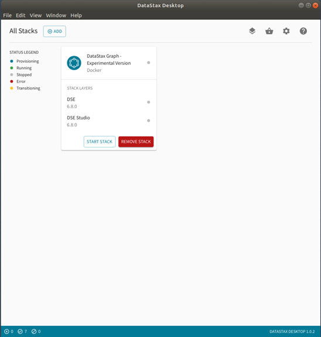

*Figure 35-1 DataStax Desktop version 1.0.2*

Relative to Figure 35-1, the following is offered:

- We ran this exercise on a MacBook Pro, inside an Ubuntu version 18.x with 8 GB of RAM, and initially 2 cores. At some point, DataStax Desktop (Desktop) complained that we needed at least 4 cores to run DataStax Enterprise and DataStax Studio, after which we moved to 4 cores and 8GB of RAM.

- Above, we have one DataStax runtime running (DSE 6.8 with basically everything turned on), and DataStax Studio. Given enough resource, we could run more concurrent systems through Desktop.

- Desktop will notify you of dependencies to run Docker and Kubernetes, and even allow you to manage those resources.

DataStax Developer’s Notebook -- November 2019 V1.2

If you are configured to operate remote Kubernetes instances, then Desktop can even provision DataStax systems in the cloud, other.

Installing Docker, a prerequisite DataStax Desktop will notify you if Docker is not installed and will offer documentation to overcome this dependency.

We were running Ubuntu, and the documentation page to install Docker is located here,

```text
https://docs.docker.com/install/linux/docker-ce/ubuntu/
```

In short, installing Docker is detailed in Example 35-1, a code review follows.

### Example 35-1 Installing Docker

```text
apt-get install \
apt-transport-https \
ca-certificates \
curl \
gnupg-agent \
software-properties-common
```

```text
curl -fsSL https://download.docker.com/linux/ubuntu/gpg | apt-key add -
```

```text
apt-key fingerprint 0EBFCD88
```

```text
add-apt-repository \
"deb [arch=amd64] https://download.docker.com/linux/ubuntu \
$(lsb_release -cs) \
stable"
```

```text
apt-get install docker-ce docker-ce-cli containerd.io
```

Relative to Example 35-1, the following is offered:

- 5 Total commands, the first 4 are just setting up our ability to pull from a software repository for Docker itself.

- The last command above, is the only required to install Docker.

- Docker gives us the ability to run containers; essentially, lightweight virtual machines.

DataStax Developer’s Notebook -- November 2019 V1.2

Installing Kubernetes, a prerequisite While Docker givers us containers, Kubernetes gives us the ability to manage those containers; a layer on top of Docker.

The documentation page to install Kubernetes is located here,

```text
https://kubernetes.io/docs/setup/
```

Example 35-2 lists the steps to install Kubernetes. A code review follows.

### Example 35-2 Installing Kubernetes

```text
>> root@ubuntu:/opt/desktop# which snap
>> /usr/bin/snap
```

```text
snap install lxd
```

```text
>> root@ubuntu:/opt/desktop# which lxd
>> /snap/bin/lxd
```

```text
lxd init
```

```text
>> root@ubuntu:/opt/desktop# lxd init
>> Would you like to use LXD clustering? (yes/no) [default=no]:
>> Do you want to configure a new storage pool? (yes/no) [default=yes]:
>> Name of the new storage pool [default=default]:
>> Name of the storage backend to use (btrfs, ceph, dir, lvm, zfs)
[default=zfs]:
>> Create a new ZFS pool? (yes/no) [default=yes]:
>> Would you like to use an existing block device? (yes/no) [default=no]:
>> Size in GB of the new loop device (1GB minimum) [default=39GB]:
>> Would you like to connect to a MAAS server? (yes/no) [default=no]:
>> Would you like to create a new local network bridge? (yes/no)
[default=yes]:
>> What should the new bridge be called? [default=lxdbr0]:
>> What IPv4 address should be used? (CIDR subnet notation, “auto” or
“none”) [default=auto]:
>> What IPv6 address should be used? (CIDR subnet notation, “auto” or
“none”) [default=auto]:
>> Would you like LXD to be available over the network? (yes/no)
[default=no]:
>> Would you like stale cached images to be updated automatically? (yes/no)
[default=yes]
>> Would you like a YAML "lxd init" preseed to be printed? (yes/no)
[default=no]:
>> root@ubuntu:/opt/desktop#
```

```text
snap install juju --classic
```

DataStax Developer’s Notebook -- November 2019 V1.2

```text
juju bootstrap localhost
```

```text
# If IPV6 is enabled, above will error; run this, then run above again
lxc network set lxdbr0 ipv6.address none
```

```text
juju add-model k8s
```

```text
juju deploy charmed-kubernetes
```

Relative to Example 35-2, the following is offered:

- Step 1 uses “snap”, a cross platform package manager (installer). First we checked to see if snap was installed.

- Using snap, we install “lxd”. lxd is a container manager, and will support Kubernetes in the manner in which we intend; that is, local containers only.

- We “lxd init”, and list the output from that. We chose all default options; again, local install and manage.

- “juju” is another part of our container orchestration stack, and will also give us a local router hosting any services we instantiate into localhost. If IPV6 is enabled, you will get an error; run the make up command as shown.

- Then we add Kubernetes to juju, and deploy same.

All that remains at this point is to install and run DataStax Desktop.

## 35.2 Complete the following

At this point in this document we have installed both Docker and Kubernetes, prerequisites to running DataStax Desktop (Desktop). Desktop is available for download from,

```text
https://downloads.datastax.com/#labs
```

A 70MB fat client written in Node.js and Atom, Desktop is available to Linux, MacOS, and Windows. An AppImage, you run this enclosed binary directly. We were operating as root, and need to add a --no-sandbox, example as shown.

DataStax Developer’s Notebook -- November 2019 V1.2

```text
./”DataStax Desktop-1.0.2.AppImage” --no-sandbox
```

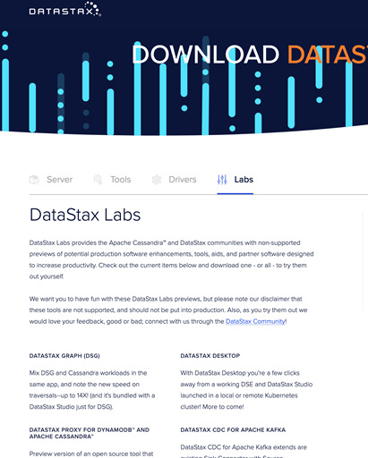

*Figure 35-2 Downloading DataStax Desktop*

DataStax Developer’s Notebook -- November 2019 V1.2

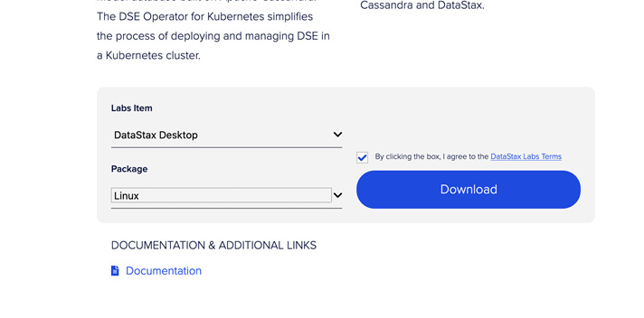

*Figure 35-3 Desktop, choosing a Linux Tarball distribution*

After launching Desktop, we selected, “Choose a Different Stack”.

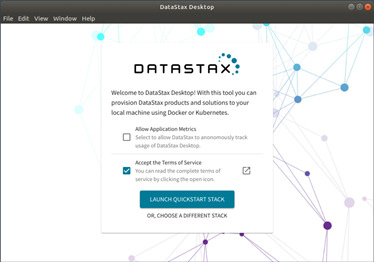

*Figure 35-4 Select, “Choose a Different Stack”*

DataStax Developer’s Notebook -- November 2019 V1.2

> Note: Since we’ve been using a lot of the DataStax Enterprise version 6.8 EAP release (Labs release) lately, we’ll install and use this image in this example.

Figure 35-5 displays the various “stacks” that are available to download and operate. We choose DataStax Enterprise (DSE) version 6.8, which also comes with a DataStax Studio version 6.8.

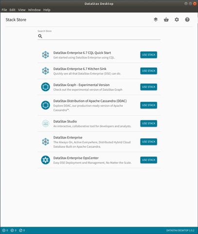

*Figure 35-5 Various runtime configurations available.*

DataStax Developer’s Notebook -- November 2019 V1.2

If you had not previously downloaded, installed, and started Docker, you will receive some form of the error notification below.

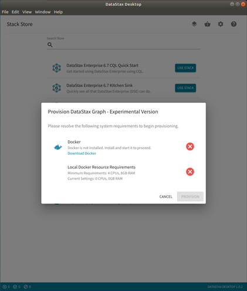

*Figure 35-6 Notice of the Docker prerequisite*

DataStax Developer’s Notebook -- November 2019 V1.2

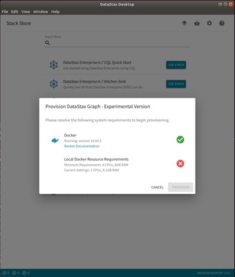

*Figure 35-7 Error notification; insufficient OS resource*

Above is an error notification; our operating system (virtual machine) was initially too small.

You will receive the error below if Kubernetes is not installed.

DataStax Developer’s Notebook -- November 2019 V1.2

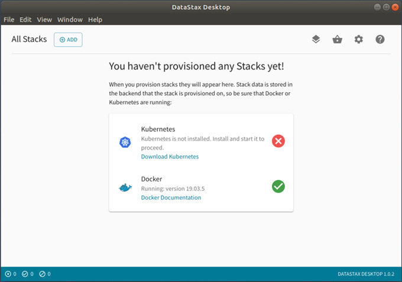

*Figure 35-8 Error if Kubernetes is not installed.*

After all prerequisites are met, you may then choose a specific “stack” to download and operate. We choose DataStax Enterprise version 6.8, currently in EAP.

DataStax Developer’s Notebook -- November 2019 V1.2

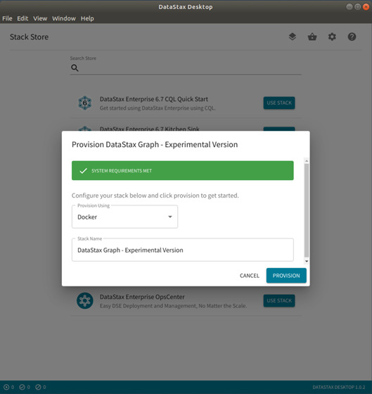

*Figure 35-9 Choosing DSE version 6.8 EAP*

You will see status screen first for download, then initialization. Examples as shown.

DataStax Developer’s Notebook -- November 2019 V1.2

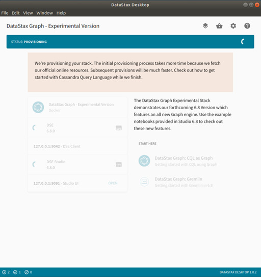

*Figure 35-10 Downloading*

DataStax Developer’s Notebook -- November 2019 V1.2

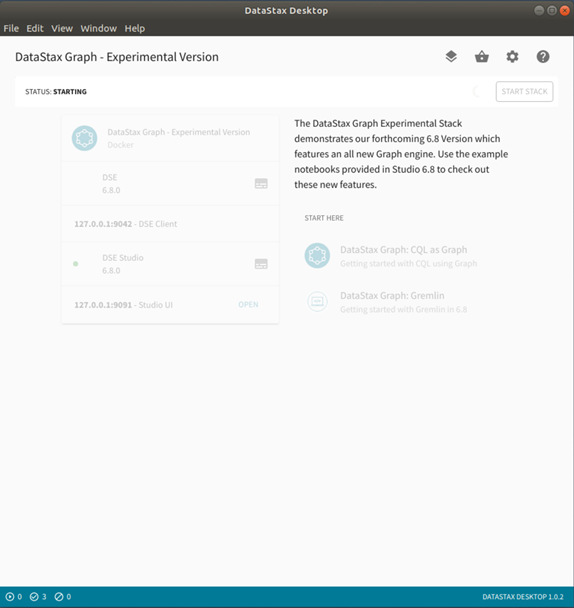

*Figure 35-11 Initializing*

Once everything is up, a link is provided to access, in this case, DataStax Studio version 6.8.

DataStax Developer’s Notebook -- November 2019 V1.2

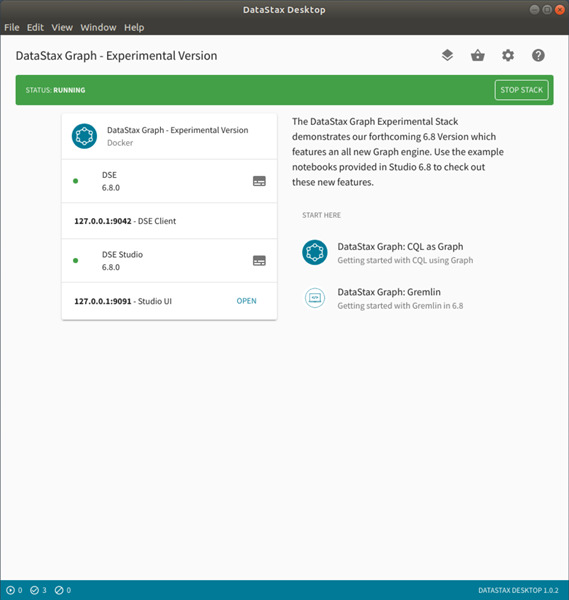

*Figure 35-12 Desktop, main screen for a given stack.*

And then install-verify for the DataStax system we just instantiated.

DataStax Developer’s Notebook -- November 2019 V1.2

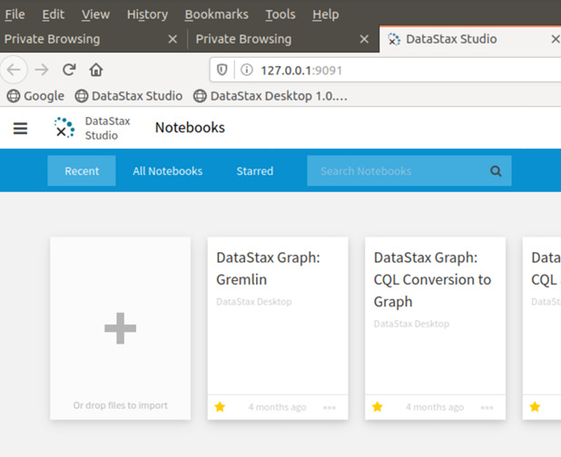

*Figure 35-13 Home page for DataStax Studio.*

DataStax Developer’s Notebook -- November 2019 V1.2


*Figure 35-14 A pre-configured default connection*

As part of the integration with DataStax Desktop, DataStax Studio is pre-configured with a localhost connection.

DataStax Developer’s Notebook -- November 2019 V1.2

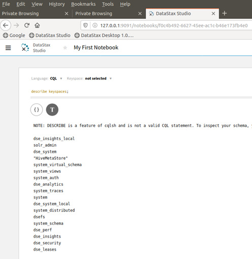

*Figure 35-15 DataStax Studio, install-verify*

For our install-verify of DataStax Studio, we run a CQLSH, DESCRIBE KEYSPACES.

To stop, re-start, or remove this stack, we access the Home Screen within Desktop. You will see multiple stacks here, if you had previously downloaded same.

DataStax Developer’s Notebook -- November 2019 V1.2

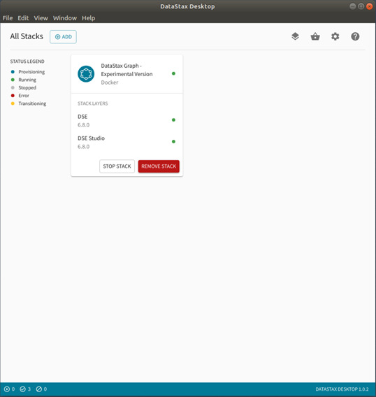

*Figure 35-16 Home (operating) screen within Desktop*

## 35.3 In this document, we reviewed or created:

This month and in this document we detailed the following:

- How to download and operate DataStax Desktop, including the pre-requisites for Docker and Kubernetes.

DataStax Developer’s Notebook -- November 2019 V1.2

### Persons who help this month.

Kiyu Gabriel, Dave Bechberger, Chris Wilhite, and Jim Hatcher.

### Additional resources:

Free DataStax Enterprise training courses,

```text
https://academy.datastax.com/courses/
```

Take any class, any time, for free. If you complete every class on DataStax Academy, you will actually have achieved a pretty good mastery of DataStax Enterprise, Apache Spark, Apache Solr, Apache TinkerPop, and even some programming.

This document is located here,

```text
https://github.com/farrell0/DataStax-Developers-Notebook
https://tinyurl.com/ddn3000
```
