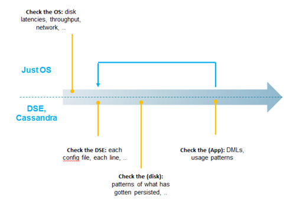
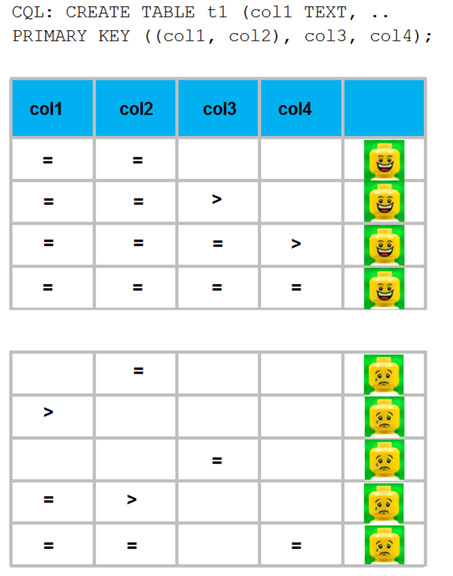
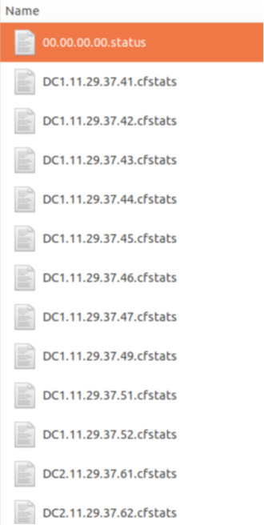

| **[Monthly Articles - 2022](../../README.md)** | **[Monthly Articles - 2021](../../2021/README.md)** | **[Monthly Articles - 2020](../../2020/README.md)** | **[Monthly Articles - 2019](../../2019/README.md)** | **[Monthly Articles - 2018](../../2018/README.md)** | **[Monthly Articles - 2017](../../2017/README.md)** | **[Data Downloads](../../downloads/README.md)** |
|-------------------------|-------------------------|-------------------------|-------------------------|-------------------------|-------------------------|-------------------------|

[Back to 2019 archive](../README.md)
[Download original PDF](../DDN_2019_36_cfstats.pdf)

## From The Archive

2019 December - -
>Customer: My company is getting ready to go into production with our first (Cassandra) application. We’ve
>noticed that one of our nodes contains way more data than the other nodes, and is way more utilized than
>the other nodes. We’ve found “nodetool cfstats”, along with mention of tombstones, read/write latencies,
>and more, and think we have a problem. Can you help ?
>
>Daniel: Excellent question ! You’ve got a lot going on above in this problem statement. Net/net, in this
>document we will; explain cfstats, overview a (production readiness) examination, and more.
>
>[Read article online](./README.md)


---

# DDN 2019 36 cfstats

## Chapter 36. December 2019

DataStax Developer’s Notebook -- December 2019 V1.2

Welcome to the December 2019 edition of DataStax Developer’s Notebook (DDN). This month we answer the following question(s); My company is getting ready to go into production with our first (Cassandra) application. We’ve noticed that one of our nodes contains way more data than the other nodes, and is way more utilized than the other nodes. We’ve found “nodetool cfstats”, along with mention of tombstones, read/write latencies, and more, and think we have a problem. Can you help ? Excellent question ! You’ve got a lot going on above in this problem statement. Net/net, is this document we will; explain cfstats, overview a (production readiness) examination, and more.

## Software versions

The primary DataStax software component used in this edition of DDN is DataStax Enterprise (DSE), currently release 6.8 EAP (Early Access Program). All of the steps outlined below can be run on one laptop with 16 GB of RAM, or if you prefer, run these steps on Amazon Web Services (AWS), Microsoft Azure, or similar, to allow yourself a bit more resource.

For isolation and (simplicity), we develop and test all systems inside virtual machines using a hypervisor (Oracle Virtual Box, VMWare Fusion version 8.5, or similar). The guest operating system we use is Ubuntu Desktop version 18.04, 64 bit.

DataStax Developer’s Notebook -- December 2019 V1.2

## 36.1 Terms and core concepts

As stated above, ultimately the end goal is to perform a (production readiness) examination. In this document we will overview this process, and since “nodetool cfstats” is specifically mentioned, we’ll detail use of this command line utility.

(Tuning DSE/Cassandra), overview of process Tuning (performing a production readiness of) DataStax Enterprise (DSE) or Cassandra is really not hard. In fact, minus the condition that DSE is a multi-node database server, the steps performed are largely the same those performed when tuning MySQL or similar.

Figure 36-1displays an overview of the (tuning) process we use. A code review follows.



*Figure 36-1 Overview of tuning process*

Relative to Figure 36-1, the following is offered:

- Since the original problem statement mentioned Cassandra, and “nodetool cfstats”, we might assume you are using all open source software, and do not have access to the Web user interface program, DataStax Ops (Operations) Center for tuning and related.

DataStax Developer’s Notebook -- December 2019 V1.2

As such, we will discuss performing most or all of these steps from the command line. Especially when you get into the area of many, many nodes, across geographies, you have to automate these steps below; pick your favorite scripting/automation environment. We use Bash(C), since it pretty much has to be installed on any container or virtual machine. It’s also reliable, and easy to get stuff done quickly.

- Step 1, we check the operating system- • Here we check 10 or fewer (conditions/metrics). We run a dd(C) to get disk read and write latencies, and network latencies. First we’re looking for outliers; is any disk or node not performing consistently with all other disk or nodes.

> Note: Another reason to automate all of this ? History.

There’s a huge difference in fixing something that has grown slow over months, versus something that grown slow instantly overnight; two very different problems.

• Spinning disk, solid state drives, or network storage of some form, we compare the numbers above with expected norms. Also; if you’re just needing to read and write globally, it takes time to go under vast oceans.

> Note: DSE/Cassandra supports localized reads and writes, and you should never have to block the end user application to wait for remote operations to complete.

Net/net; with experience (you know what to check, have the commands ready, maybe even have your scripts), this step 1 of 4 could be completed in under 1-3 hours. Why 3 hours ? This is data we use later for comparison, and we want solid (reliable) statistics here.

- Step 2, we check DataStax Enterprise (DSE/Cassandra as a server system- Based on the subsystems of DSE that your end user application is using, there are between 2 and 14 configuration files we check. Point of diminishing return, you can check only the most obvious settings, and initially skip the less impactful settings. Checking just the top 10 settings in just cassandra.yaml can take 2 hours, plus or minus.

DataStax Developer’s Notebook -- December 2019 V1.2

> Note: Generally we state; – These configuration files are formatted in either YAML, or XML. – These configuration files have 3 types of settings; identifiers, capacities, or tunables. Indentifiers just name things. Performance issues may lie in capacities or tunables. There is a means to check each capacity or tunable for correctness. – If you check just the cassandra.yaml file (a very good start), there’s about 10 super obvious settings to check, and up to 40 settings if you enter the intermediate to advanced level of skill. – If you’ve been running an adequate (application test harness), check the (message log file) on each node for errors first, then also warnings.

> Note: What is an “application test harness” ?

As it relates to a database server (DSE/Cassandra), you have;

- Every INSERT, UPDATE, DELETE, (other: DDLs, etcetera).

- The frequency, concurrency and spread with which each is run.

- You have the necessary/expected service level agreement (SLA) each is expected to deliver.

- And you have the means to automate execution of the above against production sized data, 2X production sized data, as well as 8X.

- Lastly: you capture these statistics for historical comparison.

- Step 3, how the data lays upon the disk- Generally we state; • Memory, network, process, and disk; only one of these is persistent across server system reboots. And one is expectedly the most volumous, and the slowest. (Disk.) • For any database server, you can create, and through operation, conditions on the disk that are non-optimal. For example; we used one database server where new disk space allocation could have, for example, two SQL tables (interleave), meaning; if you didn’t pre-allocate the disk space consumption, any

DataStax Developer’s Notebook -- December 2019 V1.2

single table would wind up dozens/hundreds of physical disk segments, versus a more optimal fewer number of physical disk segments. DataStax Enterprise (DSE)/Cassandra uses a WAL (write ahead log, and compact) disk space allocation, but also has its own disk performance behaviors and needs. For example, are your (data rows) evenly distributed across nodes- When using a multi-node server, often you are only as fast as your slowest node. This step can be considered optional if everything above checks out, and for small to medium sized systems. Otherwise, plan for 1-4 hours.

- And step 4, the actual routines that are operated against the database server- I.e.; the application (query) test harness, each of the INSERT, UPDATE, and DELETE statements, and more. Performance issues here could be created by the data model, mis-use of the client side driver, and more. This (query/test) harness should have been created in the application development phase and used throughout for unit and system test. So, time to complete now, prior to production launch, could be 8 to 60 hours.

And then; just nodetool cfstats “nodetool cfstats” was specifically called out in the initial problem statement. A very small, simple output from “nodetool cfstats” is listed in Example 36-1 below.

### Example 36-1 Sample “nodetool cfstats” from a small system.

```text
Total number of tables: 74
----------------
Keyspace : ks_34
Read Count: 85
Read Latency: 0.5449058823529411 ms
Write Count: 145
Write Latency: 1.5516758620689655 ms
Pending Flushes: 0
Table: connects_to
SSTable count: 0
Space used (live): 0
Space used (total): 0
Space used by snapshots (total): 0
Off heap memory used (total): 2260
SSTable Compression Ratio: -1.0
Number of partitions (estimate): 24
Memtable cell count: 60
Memtable data size: 1500
```

DataStax Developer’s Notebook -- December 2019 V1.2

```text
Memtable off heap memory used: 2260
Memtable switch count: 0
Local read count: 60
Local read latency: 0.669 ms
Local write count: 60
Local write latency: 0.096 ms
Pending flushes: 0
Percent repaired: 100.0
Bytes repaired: 0.000KiB
Bytes unrepaired: 0.000KiB
Bytes pending repair: 0.000KiB
Bloom filter false positives: 0
Bloom filter false ratio: 0.00000
Bloom filter space used: 0
Bloom filter off heap memory used: 0
Index summary off heap memory used: 0
Compression metadata off heap memory used: 0
Compacted partition minimum bytes: 0
Compacted partition maximum bytes: 0
Compacted partition mean bytes: 0
Average live cells per slice (last five minutes): 1.0
Maximum live cells per slice (last five minutes): 1
Average tombstones per slice (last five minutes): 1.0
Maximum tombstones per slice (last five minutes): 1
Dropped Mutations: 0
Failed Replication Count: null
```

```text
Table: connects_to_bi
SSTable count: 0
Space used (live): 0
Space used (total): 0
Space used by snapshots (total): 0
Off heap memory used (total): 2260
SSTable Compression Ratio: -1.0
Number of partitions (estimate): 24
Memtable cell count: 60
Memtable data size: 1500
Memtable off heap memory used: 2260
Memtable switch count: 0
Local read count: 0
Local read latency: NaN ms
Local write count: 60
Local write latency: 0.064 ms
Pending flushes: 0
Percent repaired: 100.0
Bytes repaired: 0.000KiB
Bytes unrepaired: 0.000KiB
Bytes pending repair: 0.000KiB
Bloom filter false positives: 0
```

DataStax Developer’s Notebook -- December 2019 V1.2

```text
Bloom filter false ratio: 0.00000
Bloom filter space used: 0
Bloom filter off heap memory used: 0
Index summary off heap memory used: 0
Compression metadata off heap memory used: 0
Compacted partition minimum bytes: 0
Compacted partition maximum bytes: 0
Compacted partition mean bytes: 0
Average live cells per slice (last five minutes): NaN
Maximum live cells per slice (last five minutes): 0
Average tombstones per slice (last five minutes): NaN
Maximum tombstones per slice (last five minutes): 0
Dropped Mutations: 0
Failed Replication Count: null
```

```text
Table: grid_square
SSTable count: 0
Space used (live): 0
Space used (total): 0
Space used by snapshots (total): 0
Off heap memory used (total): 4698
SSTable Compression Ratio: -1.0
Number of partitions (estimate): 25
Memtable cell count: 25
Memtable data size: 3059
Memtable off heap memory used: 4698
Memtable switch count: 2
Local read count: 25
Local read latency: 0.339 ms
Local write count: 25
Local write latency: 9.209 ms
Pending flushes: 0
Percent repaired: 100.0
Bytes repaired: 0.000KiB
Bytes unrepaired: 0.000KiB
Bytes pending repair: 0.000KiB
Bloom filter false positives: 0
Bloom filter false ratio: 0.00000
Bloom filter space used: 0
Bloom filter off heap memory used: 0
Index summary off heap memory used: 0
Compression metadata off heap memory used: 0
Compacted partition minimum bytes: 0
Compacted partition maximum bytes: 0
Compacted partition mean bytes: 0
Average live cells per slice (last five minutes): 1.0
Maximum live cells per slice (last five minutes): 1
Average tombstones per slice (last five minutes): 1.0
Maximum tombstones per slice (last five minutes): 1
```

DataStax Developer’s Notebook -- December 2019 V1.2

```text
Dropped Mutations: 0
Failed Replication Count: null
```

```text
----------------
```

A couple of comments here;

- “nodetool cfstats” (cfstats) is equivalent to “nodetool tablestats”, as DataStax Enterprise (DSE/Cassandra tables where previously referred to as column families.

- cfstats is non-destructive (read only), reasonably low cost, and run node by node. (The data it outputs is local in scope to one node.) There are other switches to “nodetool” which are writable/destructive. This topic is not expanded upon further here.

- There are several areas of statistics delivered via cfstats that seem interesting relative to tuning. These include; • Average tombstones per slice (or similar)- A tombstone is a (marker) that an item has been deleted. DataStax Enterprise (DSE) can store jagged rows, that is; columns with NULL values are not actually stored on disk. If you insert a new row with 10 columns, and 9 of the columns are NULL, you just created 9 tombstones that have to be done away with.

> Note: There is a means to configure the client side driver to not insert NULLs automatically. This topic is not expanded upon further here.

NULLs can also happen normally, as you just INSERT and DELETE rows. So, for example, an IOT application that INSERTs and DELETEs rows at a high rate will just normally crete a high amount of tombstones. So, for this section (tombstones) we state; tombstones can be a topic of concern, in need of tuning, but you really can’t glean any information regarding tombstones here. You need more information; information about the application behavior.

> Note: And what is a “slice” ?

A slide is a result set for a query, local to one node, one table.

DataStax Developer’s Notebook -- December 2019 V1.2

• Read/write latency- Yes, we care about these, but this number itself as presented here is not entirely useful. This number must be compared to the baseline we observed in step-1 above; the bare metal speed. • Dropped mutations- Yes, this is bad. However, again, we need more information. A dropped mutation is an INSERT, DELETE or UPDATE that failed to complete within the default 2 second time window. Generally, the given node is overloaded, but was this a spike (an anomaly), or something else- We would go to the message log file to really understand this condition. • And then, “Number of partitions (estimate):”, which was mentioned in our problem statement. So this is a thing, and this is the report to look at for this. Given 8 nodes, with values here equal to; [ 10, 10, 10, 10, 10, 10, 15 14], there’s nothing much to be concerned about. The standard deviation of this series of numbers is not high. Given 8 nodes with values here equal to, [10, 10, 10, 10, 10, 10, 100, 180], then the standard deviation is odd, off. Consider further study.

About (number of partitions per node)- A little bit about partitions per node, and related;

- The DataStax Enterprise (DSE)/Cassandra primary key is composed of two parts; a partition key (one or more columns), and a clustering key (zero or more columns).

- So, if your partitioning key is (USA 2 character state abbreviation), you will likely have much more data for California, New York, and Texas, than you will for Alaska. This value is likely a poor choice for partitioning key is most cases because data will not be stored evenly across nodes, and you are only as fast as your slowest node.

DataStax Developer’s Notebook -- December 2019 V1.2



*Figure 36-2 Overview of the DSE primary key*

- How should you choose a partitioning key ? The DSE primary-key/partitioning-key serves a special role inside DSE. While there are secondary indexes available inside DSE, the primary key index is that which is guaranteed to scale linearly. As such, this index is a hash index, and has requirements that it be used within an equality against the whole of the partitioning key; not ranges, not subsets of the partitioning key, other. So, if we continue with our USA 2 character state abbreviation example, you likely chose this (partition key) because of a given query you wish to serve.

DataStax Developer’s Notebook -- December 2019 V1.2

• Is this actually your primary key ? Can you add additional columns to this partition key (so that it better balances data across nodes) ? • Should this (single column) be a secondary key instead ? • Other.

## 36.2 Complete the following

A (query/test) harness is a must have for us, when operating any significant database server system. This is a resource that should have been created during the development phase. If you don’t have one, you need to create one.

In addition to the query harness, you should also have an automated set of metrics that are captured over history. One metric in this set of tests would be the “nodetool cfstats”, and specifically the “Number of partitions (estimate):” metric.

We usually create a simple loop across nodes starting from a “nodetool status” output. Example as shown in Example 36-2.

### Example 36-2 Output from “nodetool status”

```text
Datacenter: DC1
===============
Status=Up/Down
|/ State=Normal/Leaving/Joining/Moving
-- Address Load Tokens Owns Host ID
Rack
UN 11.29.37.41 47.33 GB 256 ?
286872d8-036b-48d1-a615-0fMMMMdf704f RAC1
UN 11.29.37.45 52.29 GB 256 ?
6e14cbd9-f559-4040-bc7d-edMMMM293951 RAC1
UN 11.29.37.44 50.98 GB 256 ?
0a898ccd-e25e-45ef-8472-0fMMMMad408f RAC1
UN 11.29.37.43 49.04 GB 256 ?
7b27bf4b-e0ac-42db-ae04-afMMMMf85d88 RAC1
UN 11.29.37.42 48.28 GB 256 ?
20f3700f-a049-4637-b826-c7MMMM8a2ace RAC1
UN 11.29.37.49 51.57 GB 256 ?
26658635-c35e-405c-8054-ceMMMM5dafb6 RAC1
UN 11.29.37.47 48.36 GB 256 ?
092415fd-bd7b-4416-992c-97MMMM4845c6 RAC1
UN 11.29.37.46 49.75 GB 256 ?
c505009c-9d6c-4ca2-8794-7dMMMM656a7e RAC1
UN 11.29.37.52 50.79 GB 256 ?
7ae2f823-b95c-4423-b95a-3cMMMM1a6f94 RAC1
UN 11.29.37.51 48.26 GB 256 ?
e19bc418-f5ff-44d2-b249-3aMMMM0d0203 RAC1
```

DataStax Developer’s Notebook -- December 2019 V1.2

```text
Datacenter: DC2
===============
Status=Up/Down
|/ State=Normal/Leaving/Joining/Moving
-- Address Load Tokens Owns Host ID
Rack
UN 11.29.37.66 76.29 GB 256 ?
ad50fcd5-3967-4413-9130-42MMMM07668e RAC1
UN 11.29.37.61 83.52 GB 256 ?
7e999a35-8de3-4265-abf8-45MMMMd18166 RAC1
UN 11.29.37.65 83.03 GB 256 ?
114d9acf-7f92-4c5d-a864-e9MMMMcf28e5 RAC1
UN 11.29.37.64 25.82 GB 256 ?
e8b2fc55-a527-4bf9-8807-50MMMMe73c45 RAC1
UN 11.29.37.63 88.29 GB 256 ?
c7112c7f-c0a1-4504-bffa-2bMMMMb88508 RAC1
UN 11.29.37.62 87.7 GB 256 ?
f98826dc-ba12-4822-91f1-8fMMMM6558fa RAC1
```

> Note: Non-system keyspaces don't have the same replication settings, effective

```text
ownership information is meaningless
```

While there are other means to get the data above, we are already using nodetool to gather cfstats, so, .. ..

We use the data above to write a script that loops though all nodes in our cluster, and run nodetool specific to each. We capture the output in text files that are named with the source node (IP address), and data enter identification.

> Note: Why do you need the data center ?

For example; when comparing counts per nodes of partition key values, one DC might have 8 nodes, and a second DC has all of the same data on 4 nodes. Numbers on the second DC will be naturally higher.

DataStax Developer’s Notebook -- December 2019 V1.2



*Figure 36-3 Example of how we name our captured files*

Implement at least one data capture routine, perhaps “nodetool cfstats”. Create a system where you can capture and compare history. A super simple script we use to parse cfstats is listed below, along with its sample output.

### Example 36-3 Sample script to parse output from cfstats.

```text
#!/bin/bash
```

```text
#
# count just the number of cfstats files
#
```

DataStax Developer’s Notebook -- December 2019 V1.2

```text
l_numFiles=`ls *\.cfstats | wc -l`
echo "Number of cfstats files: "${l_numFiles}
```

```text
#
# loop thru each file we want to process
#
for t in *\.cfstats
do
```

```text
l_DC=`echo ${t} | awk -F "." '{print $1}'`
l_nodeIP=`echo ${t} | sed 's/DC[0-9].//g' | sed 's/\.cfstats//g' `
```

```text
cat $t | awk -v l_DC=${l_DC} -v l_nodeIP=${l_nodeIP} '
```

```text
################################
```

```text
#
# make an array of DSE system keyspaces.
#
# we use this as a filter below
#
BEGIN {
l_systemKeyspaces=" dse_system_local system_auth \
"HiveMetaStore" dse_insights_local dse_security \
system_views system_distributed dse_system \
solr_admin system system_traces dse_analytics \
dse_leases dse_perf OpsCenter"
split(l_systemKeyspaces, l_systemKeyspacesArrValues, " ")
#
for (i in l_systemKeyspacesArrValues)
{
l_systemKeyspacesKeys[l_systemKeyspacesArrValues[i]] = ""
}
}
```

```text
################################
```

```text
{
```

```text
#
# entering a new keyspace
#
if ($1 == "Keyspace:")
{
if ($2 in l_systemKeyspacesKeys)
{
l_thisKeyspace="system"
}
```

DataStax Developer’s Notebook -- December 2019 V1.2

```text
else
{
l_thisKeyspace=$2
}
}
```

```text
#
# entering a new table
#
if ($1 == "Table:")
{
#
# ignore if this is a 'system' keyspace
#
if (l_thisKeyspace == "system")
{
}
else
{
l_thisTable = $2
}
}
```

```text
#
# actual value we want
#
if (($1 == "Number") && ($2 == "of") && ($3 == "keys") && ($4 ==
"(estimate):") )
{
#
# ignore if this is a 'system' keyspace
#
if (l_thisKeyspace == "system")
{
}
else
{
l_thisValue = $5
#
printf("%s %s %s %s %d\n", l_DC, l_nodeIP, l_thisKeyspace,
l_thisTable, l_thisValue)
}
}
```

```text
}
```

```text
################################
```

```text
'
```

DataStax Developer’s Notebook -- December 2019 V1.2

```text
done | sort | uniq | sort -k 3,4
```

### Example 36-4 Output from the above

```text
Number of cfstats files: 16
```

```text
DC1 11.29.37.41 ks_10 t_14 -1
DC1 11.29.37.42 ks_10 t_14 -1
DC1 11.29.37.43 ks_10 t_14 -1
DC1 11.29.37.44 ks_10 t_14 -1
DC1 11.29.37.45 ks_10 t_14 -1
DC1 11.29.37.46 ks_10 t_14 -1
DC1 11.29.37.47 ks_10 t_14 -1
DC1 11.29.37.49 ks_10 t_14 -1
DC1 11.29.37.51 ks_10 t_14 -1
DC1 11.29.37.52 ks_10 t_14 -1
DC2 11.29.37.61 ks_10 t_14 -1
DC2 11.29.37.62 ks_10 t_14 -1
DC2 11.29.37.63 ks_10 t_14 -1
DC2 11.29.37.64 ks_10 t_14 -1
DC2 11.29.37.65 ks_10 t_14 -1
DC2 11.29.37.66 ks_10 t_14 -1
```

```text
DC1 11.29.37.41 ks_11 t_11 21063
DC1 11.29.37.42 ks_11 t_11 20938
DC1 11.29.37.43 ks_11 t_11 21713
DC1 11.29.37.44 ks_11 t_11 22380
DC1 11.29.37.45 ks_11 t_11 23249
DC1 11.29.37.46 ks_11 t_11 22154
DC1 11.29.37.47 ks_11 t_11 22112
DC1 11.29.37.49 ks_11 t_11 22914
DC1 11.29.37.51 ks_11 t_11 21606
DC1 11.29.37.52 ks_11 t_11 22503
DC2 11.29.37.61 ks_11 t_11 37329
DC2 11.29.37.62 ks_11 t_11 39892
DC2 11.29.37.63 ks_11 t_11 38189
DC2 11.29.37.64 ks_11 t_11 12547
DC2 11.29.37.65 ks_11 t_11 37575
DC2 11.29.37.66 ks_11 t_11 33075
```

```text
DC1 11.29.37.41 ks_12 t_12 232
```

DataStax Developer’s Notebook -- December 2019 V1.2

```text
DC1 11.29.37.42 ks_12 t_12 228
DC1 11.29.37.43 ks_12 t_12 220
DC1 11.29.37.44 ks_12 t_12 232
DC1 11.29.37.45 ks_12 t_12 237
DC1 11.29.37.46 ks_12 t_12 228
DC1 11.29.37.47 ks_12 t_12 217
DC1 11.29.37.49 ks_12 t_12 204
DC1 11.29.37.51 ks_12 t_12 211
DC1 11.29.37.52 ks_12 t_12 226
DC2 11.29.37.61 ks_12 t_12 361
DC2 11.29.37.62 ks_12 t_12 384
DC2 11.29.37.63 ks_12 t_12 400
DC2 11.29.37.64 ks_12 t_12 356
DC2 11.29.37.65 ks_12 t_12 384
DC2 11.29.37.66 ks_12 t_12 350
```

```text
DC1 11.29.37.41 ks_12 t_20 35
DC1 11.29.37.42 ks_12 t_20 38
DC1 11.29.37.43 ks_12 t_20 37
DC1 11.29.37.44 ks_12 t_20 46
DC1 11.29.37.45 ks_12 t_20 43
DC1 11.29.37.46 ks_12 t_20 42
DC1 11.29.37.47 ks_12 t_20 40
DC1 11.29.37.49 ks_12 t_20 43
DC1 11.29.37.51 ks_12 t_20 37
DC1 11.29.37.52 ks_12 t_20 32
DC2 11.29.37.61 ks_12 t_20 63
DC2 11.29.37.62 ks_12 t_20 74
DC2 11.29.37.63 ks_12 t_20 68
DC2 11.29.37.64 ks_12 t_20 64
DC2 11.29.37.65 ks_12 t_20 73
DC2 11.29.37.66 ks_12 t_20 51
```

```text
DC1 11.29.37.41 ks_12 t_21 -1
DC1 11.29.37.41 ks_12 t_21 183
DC1 11.29.37.41 ks_12 t_21 5
DC1 11.29.37.42 ks_12 t_21 -1
DC1 11.29.37.42 ks_12 t_21 185
DC1 11.29.37.42 ks_12 t_21 5
DC1 11.29.37.43 ks_12 t_21 -1
DC1 11.29.37.43 ks_12 t_21 180
DC1 11.29.37.43 ks_12 t_21 5
DC1 11.29.37.44 ks_12 t_21 -1
DC1 11.29.37.44 ks_12 t_21 187
DC1 11.29.37.44 ks_12 t_21 5
DC1 11.29.37.45 ks_12 t_21 -1
DC1 11.29.37.45 ks_12 t_21 188
DC1 11.29.37.45 ks_12 t_21 5
DC1 11.29.37.46 ks_12 t_21 -1
```

DataStax Developer’s Notebook -- December 2019 V1.2

```text
DC1 11.29.37.46 ks_12 t_21 182
DC1 11.29.37.46 ks_12 t_21 5
DC1 11.29.37.47 ks_12 t_21 -1
DC1 11.29.37.47 ks_12 t_21 176
DC1 11.29.37.47 ks_12 t_21 5
DC1 11.29.37.49 ks_12 t_21 -1
DC1 11.29.37.49 ks_12 t_21 168
DC1 11.29.37.49 ks_12 t_21 5
DC1 11.29.37.51 ks_12 t_21 -1
DC1 11.29.37.51 ks_12 t_21 170
DC1 11.29.37.51 ks_12 t_21 5
DC1 11.29.37.52 ks_12 t_21 -1
DC1 11.29.37.52 ks_12 t_21 188
DC1 11.29.37.52 ks_12 t_21 5
DC2 11.29.37.61 ks_12 t_21 -1
DC2 11.29.37.61 ks_12 t_21 251
DC2 11.29.37.61 ks_12 t_21 5
DC2 11.29.37.62 ks_12 t_21 -1
DC2 11.29.37.62 ks_12 t_21 258
DC2 11.29.37.62 ks_12 t_21 5
DC2 11.29.37.63 ks_12 t_21 -1
DC2 11.29.37.63 ks_12 t_21 265
DC2 11.29.37.63 ks_12 t_21 5
DC2 11.29.37.64 ks_12 t_21 -1
DC2 11.29.37.64 ks_12 t_21 251
DC2 11.29.37.64 ks_12 t_21 5
DC2 11.29.37.65 ks_12 t_21 -1
DC2 11.29.37.65 ks_12 t_21 263
DC2 11.29.37.65 ks_12 t_21 5
DC2 11.29.37.66 ks_12 t_21 -1
DC2 11.29.37.66 ks_12 t_21 243
DC2 11.29.37.66 ks_12 t_21 5
```

```text
DC1 11.29.37.41 ks_13 t_16 -1
DC1 11.29.37.42 ks_13 t_16 -1
DC1 11.29.37.43 ks_13 t_16 -1
DC1 11.29.37.44 ks_13 t_16 -1
DC1 11.29.37.45 ks_13 t_16 -1
DC1 11.29.37.46 ks_13 t_16 -1
DC1 11.29.37.47 ks_13 t_16 -1
DC1 11.29.37.49 ks_13 t_16 -1
DC1 11.29.37.51 ks_13 t_16 -1
DC1 11.29.37.52 ks_13 t_16 -1
DC2 11.29.37.61 ks_13 t_16 -1
DC2 11.29.37.62 ks_13 t_16 -1
DC2 11.29.37.63 ks_13 t_16 -1
DC2 11.29.37.64 ks_13 t_16 -1
DC2 11.29.37.65 ks_13 t_16 -1
DC2 11.29.37.66 ks_13 t_16 -1
```

DataStax Developer’s Notebook -- December 2019 V1.2

```text
DC1 11.29.37.41 ks_13 t_17 363086
DC1 11.29.37.42 ks_13 t_17 362469
DC1 11.29.37.43 ks_13 t_17 359496
DC1 11.29.37.44 ks_13 t_17 379549
DC1 11.29.37.45 ks_13 t_17 398952
DC1 11.29.37.46 ks_13 t_17 367610
DC1 11.29.37.47 ks_13 t_17 358956
DC1 11.29.37.49 ks_13 t_17 382392
DC1 11.29.37.51 ks_13 t_17 360606
DC1 11.29.37.52 ks_13 t_17 373271
DC2 11.29.37.61 ks_13 t_17 617323
DC2 11.29.37.62 ks_13 t_17 664759
DC2 11.29.37.63 ks_13 t_17 647784
DC2 11.29.37.64 ks_13 t_17 144028
DC2 11.29.37.65 ks_13 t_17 609730
DC2 11.29.37.66 ks_13 t_17 554319
```

```text
DC1 11.29.37.41 ks_13 t_18 1511204
DC1 11.29.37.42 ks_13 t_18 1570962
DC1 11.29.37.43 ks_13 t_18 1574904
DC1 11.29.37.44 ks_13 t_18 1645367
DC1 11.29.37.45 ks_13 t_18 1690632
DC1 11.29.37.46 ks_13 t_18 1601743
DC1 11.29.37.47 ks_13 t_18 1591130
DC1 11.29.37.49 ks_13 t_18 1651378
DC1 11.29.37.51 ks_13 t_18 1581612
DC1 11.29.37.52 ks_13 t_18 1577767
DC2 11.29.37.61 ks_13 t_18 2688860
DC2 11.29.37.62 ks_13 t_18 2874046
DC2 11.29.37.63 ks_13 t_18 2768992
DC2 11.29.37.64 ks_13 t_18 2046542
DC2 11.29.37.65 ks_13 t_18 2673961
DC2 11.29.37.66 ks_13 t_18 2510660
```

```text
DC1 11.29.37.41 ks_13 t_19 361877
DC1 11.29.37.42 ks_13 t_19 362600
DC1 11.29.37.43 ks_13 t_19 359151
DC1 11.29.37.44 ks_13 t_19 379385
DC1 11.29.37.45 ks_13 t_19 398758
DC1 11.29.37.46 ks_13 t_19 368088
DC1 11.29.37.47 ks_13 t_19 357163
DC1 11.29.37.49 ks_13 t_19 382522
DC1 11.29.37.51 ks_13 t_19 359503
DC1 11.29.37.52 ks_13 t_19 372961
DC2 11.29.37.61 ks_13 t_19 616448
DC2 11.29.37.62 ks_13 t_19 665073
DC2 11.29.37.63 ks_13 t_19 645620
DC2 11.29.37.64 ks_13 t_19 133803
```

DataStax Developer’s Notebook -- December 2019 V1.2

```text
DC2 11.29.37.65 ks_13 t_19 608250
DC2 11.29.37.66 ks_13 t_19 554047
```

```text
DC1 11.29.37.41 ks_13 t_22 356256
DC1 11.29.37.42 ks_13 t_22 355838
DC1 11.29.37.43 ks_13 t_22 352855
DC1 11.29.37.44 ks_13 t_22 373293
DC1 11.29.37.45 ks_13 t_22 392041
DC1 11.29.37.46 ks_13 t_22 359407
DC1 11.29.37.47 ks_13 t_22 351467
DC1 11.29.37.49 ks_13 t_22 374371
DC1 11.29.37.51 ks_13 t_22 353605
DC1 11.29.37.52 ks_13 t_22 366746
DC2 11.29.37.61 ks_13 t_22 603007
DC2 11.29.37.62 ks_13 t_22 650165
DC2 11.29.37.63 ks_13 t_22 636504
DC2 11.29.37.64 ks_13 t_22 142843
DC2 11.29.37.65 ks_13 t_22 599349
DC2 11.29.37.66 ks_13 t_22 544076
```

```text
DC1 11.29.37.41 ks_14 t_13 1
DC1 11.29.37.41 ks_14 t_13 6
DC1 11.29.37.42 ks_14 t_13 1
DC1 11.29.37.43 ks_14 t_13 2
DC1 11.29.37.43 ks_14 t_13 5
DC1 11.29.37.44 ks_14 t_13 3
DC1 11.29.37.44 ks_14 t_13 8
DC1 11.29.37.45 ks_14 t_13 2
DC1 11.29.37.45 ks_14 t_13 3
DC1 11.29.37.46 ks_14 t_13 6
DC1 11.29.37.46 ks_14 t_13 7
DC1 11.29.37.47 ks_14 t_13 -1
DC1 11.29.37.47 ks_14 t_13 2
DC1 11.29.37.49 ks_14 t_13 1
DC1 11.29.37.49 ks_14 t_13 5
DC1 11.29.37.51 ks_14 t_13 1
DC1 11.29.37.51 ks_14 t_13 7
DC1 11.29.37.52 ks_14 t_13 2
DC2 11.29.37.61 ks_14 t_13 3
DC2 11.29.37.61 ks_14 t_13 7
DC2 11.29.37.62 ks_14 t_13 10
DC2 11.29.37.62 ks_14 t_13 3
DC2 11.29.37.63 ks_14 t_13 5
DC2 11.29.37.63 ks_14 t_13 6
DC2 11.29.37.64 ks_14 t_13 13
DC2 11.29.37.64 ks_14 t_13 3
DC2 11.29.37.65 ks_14 t_13 4
DC2 11.29.37.66 ks_14 t_13 4
DC2 11.29.37.66 ks_14 t_13 7
```

DataStax Developer’s Notebook -- December 2019 V1.2

```text
DC1 11.29.37.41 ks_14 t_15 1
DC1 11.29.37.42 ks_14 t_15 1
DC1 11.29.37.43 ks_14 t_15 4
DC1 11.29.37.44 ks_14 t_15 3
DC1 11.29.37.45 ks_14 t_15 3
DC1 11.29.37.46 ks_14 t_15 5
DC1 11.29.37.47 ks_14 t_15 2
DC1 11.29.37.49 ks_14 t_15 1
DC1 11.29.37.51 ks_14 t_15 2
DC1 11.29.37.52 ks_14 t_15 2
DC2 11.29.37.61 ks_14 t_15 3
DC2 11.29.37.62 ks_14 t_15 5
DC2 11.29.37.63 ks_14 t_15 5
DC2 11.29.37.64 ks_14 t_15 7
DC2 11.29.37.65 ks_14 t_15 4
DC2 11.29.37.66 ks_14 t_15 7
```

```text
DC1 11.29.37.41 ks_15 t_21 9
DC1 11.29.37.42 ks_15 t_21 14
DC1 11.29.37.43 ks_15 t_21 8
DC1 11.29.37.44 ks_15 t_21 15
DC1 11.29.37.45 ks_15 t_21 11
DC1 11.29.37.46 ks_15 t_21 11
DC1 11.29.37.47 ks_15 t_21 10
DC1 11.29.37.49 ks_15 t_21 10
DC1 11.29.37.51 ks_15 t_21 10
DC1 11.29.37.52 ks_15 t_21 10
DC2 11.29.37.61 ks_15 t_21 23
DC2 11.29.37.62 ks_15 t_21 22
DC2 11.29.37.63 ks_15 t_21 24
DC2 11.29.37.64 ks_15 t_21 21
DC2 11.29.37.65 ks_15 t_21 17
DC2 11.29.37.66 ks_15 t_21 22
```

## 36.3 In this document, we reviewed or created:

This month and in this document we detailed the following:

DataStax Developer’s Notebook -- December 2019 V1.2

- We gave overview to a pre-production launch system readiness examination. Based on your skill level with DSE/Cassandra, this can take 1 to (n) days. When we sell this activity as a service, we can take 2 to 4 weeks, based on the amount of education we need to provide and the depth o which we look into the application source code for issues.

- And we did a little bit of work with “nodetool cfstats”; what this output may and may not be used for.

### Persons who help this month.

Kiyu Gabriel, Dave Bechberger, Richard Andersen, and Jim Hatcher.

### Additional resources:

Free DataStax Enterprise training courses,

```text
https://academy.datastax.com/courses/
```

Take any class, any time, for free. If you complete every class on DataStax Academy, you will actually have achieved a pretty good mastery of DataStax Enterprise, Apache Spark, Apache Solr, Apache TinkerPop, and even some programming.

This document is located here,

```text
https://github.com/farrell0/DataStax-Developers-Notebook
https://tinyurl.com/ddn3000
```

DataStax Developer’s Notebook -- December 2019 V1.2
