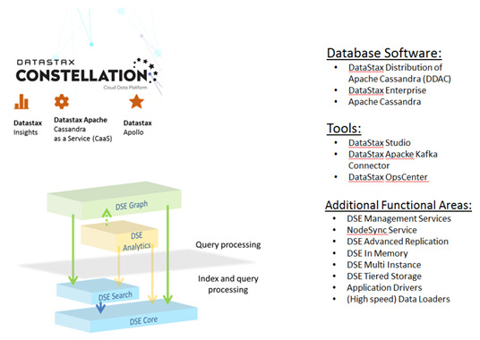
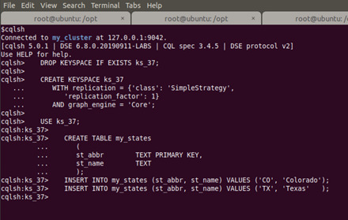
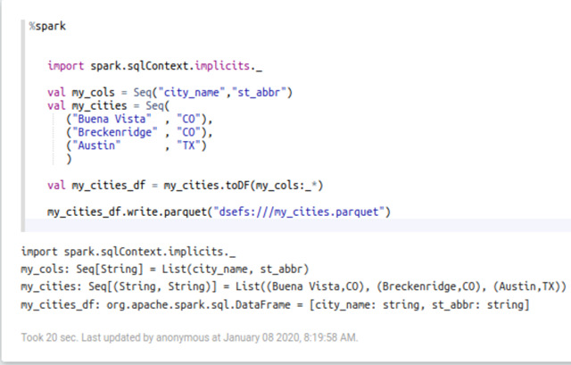
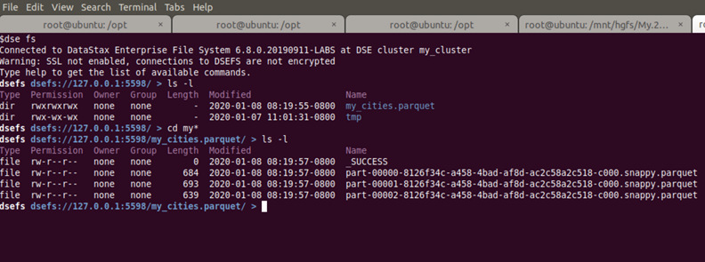
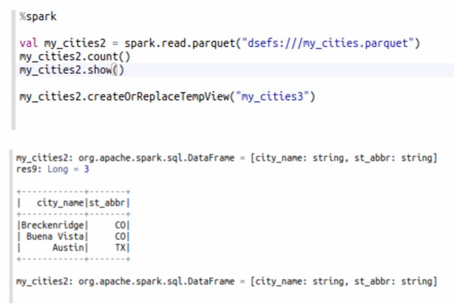
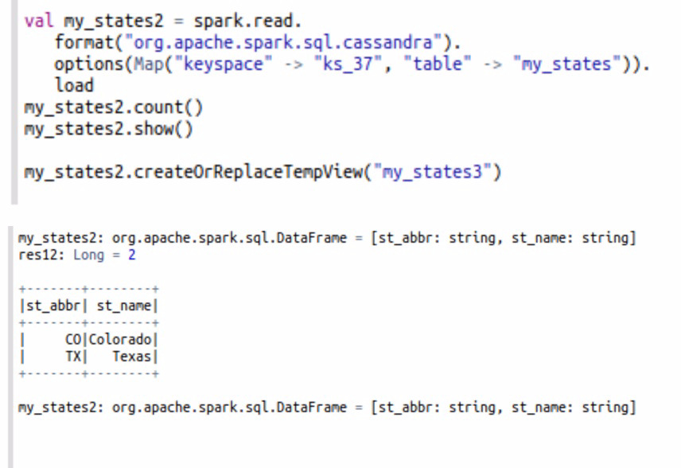
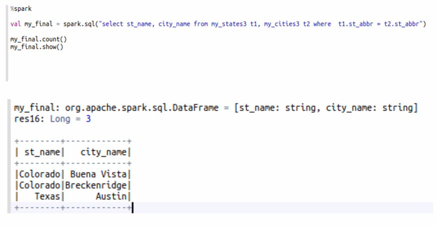

| **[Monthly Articles - 2022](../../README.md)** | **[Monthly Articles - 2021](../../2021/README.md)** | **[Monthly Articles - 2020](../../2020/README.md)** | **[Monthly Articles - 2019](../../2019/README.md)** | **[Monthly Articles - 2018](../../2018/README.md)** | **[Monthly Articles - 2017](../../2017/README.md)** | **[Data Downloads](../../downloads/README.md)** |
|-------------------------|-------------------------|-------------------------|-------------------------|-------------------------|-------------------------|-------------------------|

[Back to 2020 archive](../README.md)
[Download original PDF](../DDN_2020_37_Parquet.pdf)

## From The Archive

January 2020 - -

>Customer: My company maintains a lot of data on Hadoop, in Parquet and other formats, and need to perform integrated
>reporting with data resident inside DataStax. Can you help ?
>
>Daniel: Excellent question ! Yes. This is like a two-liner solution. We’ll detail all of the concepts and code inside
>this document.
>
>[Read article online](./README.md)

---

# DDN 2020 37 Parquet

## Chapter 37. January 2020

DataStax Developer’s Notebook -- January 2020 V1.2

Welcome to the January 2020 edition of DataStax Developer’s Notebook (DDN). This month we answer the following question(s); My company maintains a lot of data on Hadoop, in Parquet and other formats, and need to perform integrated reporting with data resident inside DataStax. Can you help ? Excellent question ! Yes. This is like a two-liner solution. We’ll detail all of the concepts and code inside this document.

## Software versions

The primary DataStax software component used in this edition of DDN is DataStax Enterprise (DSE), currently release 6.8 EAP (Early Access Program). All of the steps outlined below can be run on one laptop with 16 GB of RAM, or if you prefer, run these steps on Amazon Web Services (AWS), Microsoft Azure, or similar, to allow yourself a bit more resource.

For isolation and (simplicity), we develop and test all systems inside virtual machines using a hypervisor (Oracle Virtual Box, VMWare Fusion version 8.5, or similar). The guest operating system we use is Ubuntu Desktop version 18.04, 64 bit.

DataStax Developer’s Notebook -- January 2020 V1.2

## 37.1 Terms and core concepts

As stated above, ultimately the end goal is to perform reporting on data; some of it resident inside DataStax Enterprise (DSE), some of it resident on Hadoop/HDFS, in Parquet format, and presumably without a lift and shift. (E.g., don’t make me have even more copies of the same data.)

Easy peezy.

Recall there are 4 primary functional areas inside DataStax Enterprise (DSE), as displayed in Figure 37-1. A code review follows.



*Figure 37-1 DSE product*

Relative to Figure 37-1, the following is offered:

- The 4 primary functional areas inside DataStax Enterprise (DSE) are located in the bottom left of the graphic above and are titled; DSE Core, DSE Search, DSE Analytics, and DSE Graph.

- DSE Core is largely a hardened version of Apache Cassandra.

- DSE Search gives DSE Core integrated Apache Solr/Lucene indexes and query predicates.

DataStax Developer’s Notebook -- January 2020 V1.2

- DSE Graph is largely Apache TinkerPop/Gremlin.

- And DSE Analytics is largely an integrated Apache Spark, and gives DSE built in Parquet support, as well as joins, as well as query parallelism.

If we’re going to join If we’re going to join data between DSE (Core) and Hadoop/HDFS, we’ll need at least two tables, one resident inside DSE. Figure 37-2 displays the DSE (Core) assets we’ll use. A code review follows.



*Figure 37-2 DSE keyspaces, table, and data*

Relative to Figure 37-2, the following is offered:

- A classic DSE; make keyspaces, make table, insert two rows of data.

- Our data is two rows, US states; Colorado and Texas.

- We’ll make a “cities” data set below, and join to that.

Figure 37-3 displays our “cities” data. A code review follows.

DataStax Developer’s Notebook -- January 2020 V1.2



*Figure 37-3 Our cities data, stored on HDFS in Parquet format*

Relative to Figure 37-3, the following is offered:

- We used the HDFS compatible filesystem that comes with DataStax Enterprise. If your data is resident in HDFS, remotely, you’d need to add a connection string/resource to said system.

- The above is written in Scala. Other languages work too.

- If you use the “Always-On SQL” feature to DSE, the SQL query we run below returns in very sub-second performance.

- The code above- • I can’t actually recall if we needed the import. With any serious SQL, you would need the import. • my_cols basically forms our column header metadata. • my_cities is first a Spark RDD, having been read from a simple Scala data type of Sequence. The toDF() method then casts this data set as an Apache Spark DataFrame, so that we may inherit the write() to Parquet method. • And we write to HDFS in Parquet binary format.

Figure 37-4 displays the method to confirm that we just wrote to HDFS in Parquet format. A code review follows.

DataStax Developer’s Notebook -- January 2020 V1.2



*Figure 37-4 Parquet data on disk, HDFS*

Relative to Figure 37-4, the following is offered:

- Just like when using Hadoop (“hadoop hdfs”), DSE ships with a, “dse fs” command; a shell prompt into this HDFS compatible filesystem.

- Recall that files created from Spark jobs are striped/segmented into multiple physical parts, allowing for placement across nodes. We see 3 physical files were created above.

- Because these are in binary (Parquet) format, we can’t just ‘cat’ the files and see anything of value.

All of our prep is done At this point, we have two data sources; one DSE, USA states data, and one Parquet, USA cities data. We are ready to continue.

Figure 37-5 shows the code to read Parquet from HDFS. A code review follows.

DataStax Developer’s Notebook -- January 2020 V1.2



*Figure 37-5 Reading Parquet from HDFS*

Relative to Figure 37-5, the following is offered:

- Again we wrote in Scala. Other languages work too.

- The count() and show() are just to check our work. We really only need the read(), and then the createOrReplaceTempView() to enable SQL operations.

Figure 37-6 displays enabling SQL reads against our DSE table. A code review follows.

DataStax Developer’s Notebook -- January 2020 V1.2



*Figure 37-6 USA states data inside DSE*

Relative to Figure 37-6, the following is offered:

- Again, don’t need the count() or show(); just checking our work.

- The read() makes this DSE table data available.

- And the createOrReplaceTempView() enables SQL.

Figure 37-7 shows the actual SQL join. A code review follows.

DataStax Developer’s Notebook -- January 2020 V1.2



*Figure 37-7 SQL join; DSE and Parquet*

Relative to Figure 37-7, the following is offered:

- We ran a simple two table SQL join with no other query predicates, but any Apache Hive 1.1 query language syntax is supported.

- Output as shown; data from DSE joined to data from HDFS/Parquet.

## 37.2 Complete the following

At this point in this document we have shown you how to register DataStax Enterprise (DSE) and also HDFS resident data for use inside DSE Analytics (Apache Spark) SQL queries. All valid Hive query language (SQL) syntax is valid; go forth.

Add your own tables, and write your own analytics queries. Save the data on HDFS, or inside DSE.

DataStax Developer’s Notebook -- January 2020 V1.2

## 37.3 In this document, we reviewed or created:

This month and in this document we detailed the following:

- A rather simple primer to join DSE and HDFS/Parquet data, and perform analytics.

- Reading and writing to and from DSE and HDFS.

### Persons who help this month.

Kiyu Gabriel, Dave Bechberger, Alex Ott, and Jim Hatcher.

### Additional resources:

Free DataStax Enterprise training courses,

```text
https://academy.datastax.com/courses/
```

Take any class, any time, for free. If you complete every class on DataStax Academy, you will actually have achieved a pretty good mastery of DataStax Enterprise, Apache Spark, Apache Solr, Apache TinkerPop, and even some programming.

This document is located here,

```text
https://github.com/farrell0/DataStax-Developers-Notebook
https://tinyurl.com/ddn3000
```
