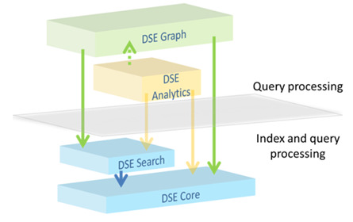
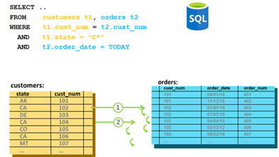
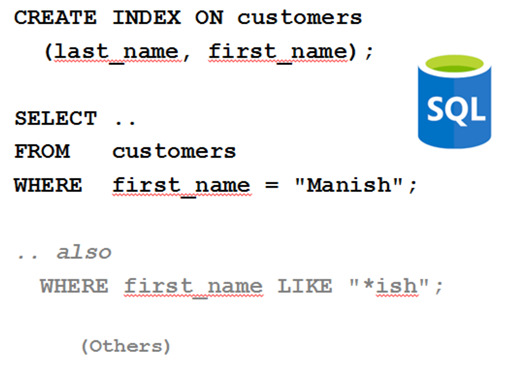
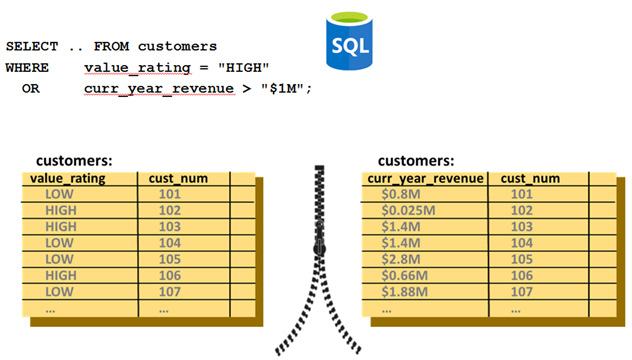
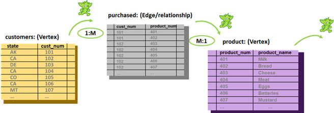
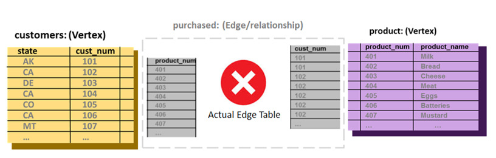

| **[Monthly Articles - 2022](../../README.md)** | **[Monthly Articles - 2021](../../2021/README.md)** | **[Monthly Articles - 2020](../../2020/README.md)** | **[Monthly Articles - 2019](../../2019/README.md)** | **[Monthly Articles - 2018](../../2018/README.md)** | **[Monthly Articles - 2017](../../2017/README.md)** | **[Data Downloads](../../downloads/README.md)** |
|-------------------------|-------------------------|-------------------------|-------------------------|-------------------------|-------------------------|-------------------------|

[Back to 2020 archive](../README.md)
[Download original PDF](../DDN_2020_38_FileMethods.pdf)

## From The Archive

February 2020 - -

>Customer: I’ve read all of the articles and documentation related to DataStax Enterprise (DSE) Graph, but am
>still not certain how these graph queries (traversals) actually execute. To me, this looks much like a SQL
>query processing engine, and I don’t know how or if to index or model this. Can you help ?
>
>Daniel: Excellent question ! In this document we’ll give a brief treatment to graph query processing; how
>graph traversals are actually (executed). For fun, we’ll actually talk a little bit about a close (graph)
>neighbor, Neo4J.
>
>[Read article online](./README.md)


---

# DDN 2020 38 FileMethods

## Chapter 38. February 2020

DataStax Developer’s Notebook -- February 2020 V1.2

Welcome to the February 2020 edition of DataStax Developer’s Notebook (DDN). This month we answer the following question(s); I’ve read all of the articles and documentation related to DataStax Enterprise (DSE) Graph, but am still not certain how these graph queries (traversals) actually execute. To me, this looks much like a SQL query processing engine, and I don’t know how or if to index or model this. Can you help ? Excellent question ! In this document we’ll give a brief treatment to graph query processing; how graph traversals are actually (executed). For fun, we’ll actually talk a little bit about a close (graph) neighbor, Neo4J.

## Software versions

The primary DataStax software component used in this edition of DDN is DataStax Enterprise (DSE), currently release 6.8 EAP (Early Access Program). All of the steps outlined below can be run on one laptop with 16 GB of RAM, or if you prefer, run these steps on Amazon Web Services (AWS), Microsoft Azure, or similar, to allow yourself a bit more resource.

For isolation and (simplicity), we develop and test all systems inside virtual machines using a hypervisor (Oracle Virtual Box, VMWare Fusion version 8.5, or similar). The guest operating system we use is Ubuntu Desktop version 18.04, 64 bit.

DataStax Developer’s Notebook -- February 2020 V1.2

## 38.1 Terms and core concepts

As stated above, ultimately the end goal is to detail graph query processing, which also leads a bit into an indexing discussion. Figure 38-1 displays the four primary functional areas to DataStax Enterprise (DSE). A code review follows.



*Figure 38-1 Four primary functional areas to DSE*

Relative to Figure 38-1, the following is offered:

- The four primary functional components to DataStax Enterprise (DSE) include; • DataStax Core, largely Apache Cassandra • DataStax Search, largely Apache Solr/Lucene • DataStax Analytics, largely Apache Spark • DataStax Graph, large Apache TinkerPop/Gremlin

- DSE Core is the only storage tier, serving the remaining 3 functional areas to DSE. DSE Core, has at its center, a hash index.

- DSE Search provides additional index technology and query predicates for text analytics, scalars, and spatial/geospatial lookup.

- DSE Graph stores its vertices and edges as standard DSE Core tables.

DataStax Developer’s Notebook -- February 2020 V1.2

By example, SQL query processing Figure 38-2 displays a classic/standard SQL 2 table SELECT statement. A code review follows.



*Figure 38-2 SQL 2 table query*

Relative to Figure 38-2, the following is offered:

- We offer this section to use a common denominator; we assume most folks know SQL and SQL SELECTS.

- Above, a standard 2 table SQL SELECT is offered. The 2 tables relate through an equality in the WHERE clause. Also, both tables have a filter predicate.

- Query processing will begin on one of the 2 tables, applying the filter predicate. The filter predicate that should be selected is that which is most selective, returning the smaller number of rows, and supported via a usable index. • There are 50-52 states in the United States, but given enough history, there should be hundreds of unique dates. • Both query predicates are equalities and if both columns are indexed, the first predicate processed should be using order_date in the orders table. • order_date is also an integer (or date), and easier to resolve than a character string for customers.state.

DataStax Developer’s Notebook -- February 2020 V1.2

- If/when we drill into orders.order_date first, the join to customer should be processed and supported by an index on customer.cust_num.

- Given the above, there is no need to index customer.state, since we will have already retrieved the row when performing the join.

> Note: What join method (algorithm) is used to join the two tables ?

The oldest, most common join method is nested-loop-join, that is;

- After finding the first row in the first table, use an index look up to find all matches in the second table. Second row in the first table, repeat, and so on. (A nested loop programming structure.)

- Since the second table is processed and (re-processed) an additional time for each matching row in the first table, nearly all databases will require an index exist on the join columns in the second table. This, lest each (re-processing) of the second table cause a sequential scan, over, and over.

Figure 38-3 displays our next sample query. A code review follows.



*Figure 38-3 Second sample SQL SELECT*

DataStax Developer’s Notebook -- February 2020 V1.2

Relative to Figure 38-3, the following is offered:

- This example is meant to introduce the topic of index-negation, that is; an index is available, waiting to be used, but can not be used. There are generally 3 reasons why an index will not be used. • Non-anchored composite key- From the example above, a composite index exists on last_name, then first_name. You can look up records by just last_name, or last_name and then first_name, but not just first_name alone. Imagine trying to find Dave Letterman in the phone book by just his first name, Dave. You would have to sequentially scan the phone book, since entries in the phone book are not sorted by first name. • Similar, and simpler to non-anchored composite key, is non-initial substring. Try find Dave Letterman in the phone book by just the last 3 letters of his last name; “man”. Again, the phone book is not sorted in this manner. • And then, negation of an index, poor selectivity of a filter. Instead of using an index on gender code, expectedly returning half or so of the entire contents of the table, it should be much more efficient to just sequentially scan the entire table, incurring must less physical I/O.

- How these conditions come into effect when performing graph traversals is column order in a composite key- Recalling the first_name, last_name effect detailed above, we normally need one index to support traversing from vertex to vertex in one direction, and a second index when traversing in the reverse direction.

Figure 38-4 displays our last SQL example. A code review follows.

DataStax Developer’s Notebook -- February 2020 V1.2



*Figure 38-4 Last of 3 SQL examples.*

Relative to Figure 38-4, the following is offered:

- This is a single table SELECT, with 2 filter predicates, topped by an OR clause. If this query had an AND clause, a single composite index would serve this query. From what we detailed above relative to non-anchored composite index negation, the OR condition causes us to need 2 indexes.

- But, if we use one index to serve the first filter predicate, and a second index to serve the second filter predicate, a row might qualify for both filter predicates, and SQL does not let us return the same row twice as the result from one SQL SELECT. So, we could use two indexes, but then would have to- • Sort both lists, merge, and remove duplicate rows. This activity is titled, a sort-merge join. • We use a sort-merge join when both filter predicates are served via indexes, and both predicates are highly selective.

DataStax Developer’s Notebook -- February 2020 V1.2

> Note: A long, long time ago, we (programmers) would manually rewrite this query using an “or union transform”, example as shown;

```text
SELECT * FROM t1 WHERE value_rating = “HIGH”
UNION
SELECT * FROM t1 WHERE curr_year_revenue > “$1m”;
```

With modern database servers, we expect the server software to perform this rewrite for us.

Extra note: SQL UNION automatically calls to remove duplicates. A UNION ALL does not call to remove duplicates. If you are certain that both filter predicates produce unique data sets, consider using a UNION ALL.

How DSE processes graph traversals DataStax Enterprise (DSE) processed queries through the DSE Core functional area, DSE Search (additional index types and query predicates), DSE Analytics (basically full/Hive SQL), and then DSE Graph traversals (queries).

In this section, we discuss graph traversals only. Figure 38-5 displays a graph traversal. A code review follows.



*Figure 38-5 Graph traversal*

Relative to Figure 38-5, the following is offered:

DataStax Developer’s Notebook -- February 2020 V1.2

- We don’t see the Gremlin traversal syntax for this (query). If the traversal terminated on product, a sample Gremlin traversal to support this picture would be. g.V().hasLabel(“customers”).out(“product”)

- With no filter predicate on customers, all rows are returned. Each row in customers would start a new traverser; effectively a single SQL SELECT (from each row), with its own distinct result set; whatever that single row joins to in the edge table titled, purchased. Each row from purchased also starts its own traverser, with its own result set; whatever each single row joins to in the vertex titled, product.

- As such (above), we need no index on customers. If there was a filter predicate on customers, we would need the index to support that.

- As such (above), we need no additional index on purchased. The edge table itself will require a primary key, which will be the join pairs between customers and product.

- And product needs no additional index, since the join is on the primary key to product.

- The (join method) used to process DSE Graph queries, is nested loop join method.

A bit on Neo4J From documentation located at,

```text
https://neo4j.com/graphacademy/online-training/introduction-to-neo4j
/part-2/
```

Neo4J does something interesting, as displayed in Figure 38-6. A code review follows.

DataStax Developer’s Notebook -- February 2020 V1.2



*Figure 38-6 Neo4J storage model*

Relative to Figure 38-6, the following is offered:

- Super cool idea. Neo4J stores the address of the remote key entity instances (rows from the adjoining vertex), directly inside the neat side vertex. This has the promise to reduce physical I/O on reads.

- However, what about writes; every INSERT, UPDATE, DELETE becomes a scalability concern, with a higher than linear scaling need.

## 38.2 Complete the following

Optionally, and if you wish, reconstruct each of the queries and run time conditions discussed above, and run in the various and appropriate functional area inside DSE; DSE Core, DSE Analytics, or DSE Graph.

Work to create the index use or negations, as detailed above. Using profiling (graph, or DSE Core), produce query plan details as discussed above.

## 38.3 In this document, we reviewed or created:

This month and in this document we detailed the following:

- An introductory level discussion to query processing for SQL (DSE Analytics), DSE Core and DSE Graph.

- We discussed SQL query processing operative patterns for Filter/Join/Sort, and index negation.

DataStax Developer’s Notebook -- February 2020 V1.2

### Persons who help this month.

Kiyu Gabriel, Dave Bechberger, and Jim Hatcher.

### Additional resources:

Free DataStax Enterprise training courses,

```text
https://academy.datastax.com/courses/
```

Take any class, any time, for free. If you complete every class on DataStax Academy, you will actually have achieved a pretty good mastery of DataStax Enterprise, Apache Spark, Apache Solr, Apache TinkerPop, and even some programming.

This document is located here,

```text
https://github.com/farrell0/DataStax-Developers-Notebook
https://tinyurl.com/ddn3000
```

DataStax Developer’s Notebook -- February 2020 V1.2
