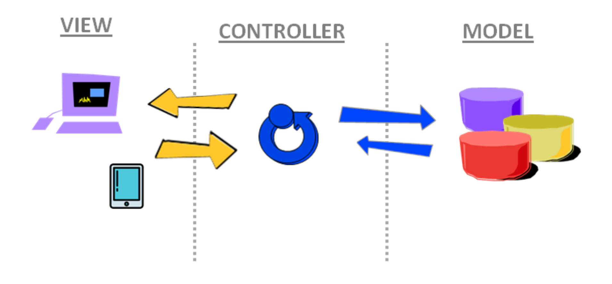
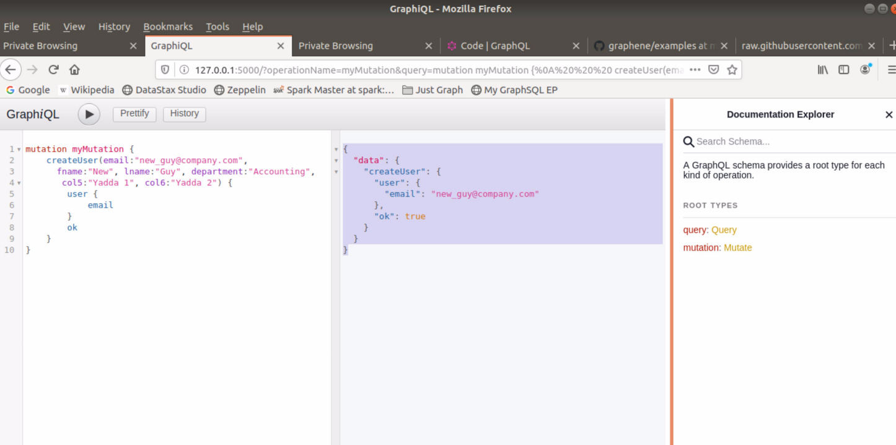

| **[Monthly Articles - 2022](../../README.md)** | **[Monthly Articles - 2021](../../2021/README.md)** | **[Monthly Articles - 2020](../../2020/README.md)** | **[Monthly Articles - 2019](../../2019/README.md)** | **[Monthly Articles - 2018](../../2018/README.md)** | **[Monthly Articles - 2017](../../2017/README.md)** | **[Data Downloads](../../downloads/README.md)** |
|-------------------------|-------------------------|-------------------------|-------------------------|-------------------------|-------------------------|-------------------------|

[Back to 2020 archive](../README.md)
[Download original PDF](../DDN_2020_41_GraphQL.pdf)

## From The Archive

May 2020 - -
>Customer: My company has got to improve its efficiency and time to delivery when creating business applications on
>Apache Cassandra and DataStax Enterprise. Can you help ?
>
>Daniel: Excellent question ! Since you specfically mentioned application development, we will give focus to API
>endpoint programming; a means to more greatly decouple your application from the database, allowing for greater
>flexibility in deployment, and even increasing performance of Web and mobile applications.
>
>While we might briefly mention REST and gRPC, the bulk of this document will center on GraphQL.
>
>[Read article online](./README.md)


---

# DDN 2020 41 GraphQL

## Chapter 41. May 2020

DataStax Developer’s Notebook -- May 2020 V1.2

Welcome to the May 2020 edition of DataStax Developer’s Notebook (DDN). This month we answer the following question(s); My company has got to improve its efficiency and time to delivery when creating business applications on Apache Cassandra and DataStax Enterprise. Can you help ? Excellent question ! Since you specfically mentioned application development, we will give focus to API endpoint programming; a means to more greatly decouple your application from the database, allowing for greater flexibility in deployment, and even increasing performance of Web and mobile applications. While we might briefly mention REST and gRPC, the bulk of this document will center on GraphQL.

## Software versions

The primary DataStax software component used in this edition of DDN is DataStax Enterprise (DSE), currently release 6.8 EAP (Early Access Program). All of the steps outlined below can be run on one laptop with 16 GB of RAM, or if you prefer, run these steps on Amazon Web Services (AWS), Microsoft Azure, or similar, to allow yourself a bit more resource.

For isolation and (simplicity), we develop and test all systems inside virtual machines using a hypervisor (Oracle Virtual Box, VMWare Fusion version 8.5, or similar). The guest operating system we use is Ubuntu Desktop version 18.04, 64 bit.

DataStax Developer’s Notebook -- May 2020 V1.2

## 41.1 Terms and core concepts

Do you recall the first time that you heard that a 4000 plus world-wide location fast food restaurant chain was really a real estate company ? Or do you recall when you first heard that America’s largest brick and mortar retailer, and separately, the largest online retailer, were both primarily logistics companies ? What makes each of these three companies their individual market and innovation leaders, are the narrow margin, yet critical efficiencies they produce in key performance areas.

In the delivery and maintenance of business application software, an emerging key performance area, is API endpoint programming.

In this document, we detail GraphQL API endpoint programming, with brief mention of the traditional, native-driver, command language programming that was the defacto choice for so long. We also briefly mention RESTful API programming and gRPC API endpoint programming.

As stated above, ultimately the end goal is to improve time to delivery in the area of business application creation and delivery. This document will give focus to API endpoint programming, with most of this discussion being on the design and use of GraphQL.

What is an API endpoint



*Figure 41-1 The classic, model-view-controller topic*

In the figure above, API endpoints would be represented by the blue and yellow arrows; GraphQL, and the examples we present below, would specifically be the yellow arrows.

DataStax Developer’s Notebook -- May 2020 V1.2

In 1994, a book was published that centered on what became the predominant design pattern for modern business application development, Model-View-Controller (or, MVC); Design Patterns: Elements of Reusable Object-Oriented Software (Addison-Wesley Professional Computing Series), Addison-Wesley Publishing, 1994,(Erich Gamma, Richard Helm, Ralph Johnson, John Vlissides).

In short, if you were writing one million lines of source code to become the next Amazon.com, you should;

- Organize the source code by (purpose); one-third of the source code separated for the user interface (the View), one-third for the database routines (the Model, the data INSERTs, data UPDATEs, ..), and one-third for the part in the middle that ties end user initiated events (button clicks, mouse events, other), to the need to persist data, the database/model routines, this middle piece being referred to as, the Controller.

- The initial driver for MVC was application source code ?creation and maintenance efficiency ?. When moving your application from one database server to another, you would only have to test one-third of your application, the part that is isolated to touch only the database (the Model). When needing to support new, or new versions of Web and mobile devices, you should only have to test the one-third of your application that delivers the View.

Model-view-controller evolved to become even more encompassing. Ideally, the type of server needed to best host the Model (the database), has distinct performance characteristics versus the server needed to host the Controller. Model-view-controller soon delivered an application where the Model, View and Controller each operated on different computers, different physical tiers. How these 3 different tiers exchange requests for service (and the resultant product sets), is an area titled, API endpoints. In the first iteration of Model-View-Controller, we did organize source code by function, but this source code might still operate on one tier, inside one (business application) program executable. Loose coupling? followed where each of Model, View and Controller executed in separate programs, and eventually on separate tiers. APIs, endpoint programming, is how these separate programs communicate; (the yellow and blue arrows in the diagram above).

GraphQL API endpoint programming At this point in this document, we’ve defined what an API endpoint is, and what role an API endpoint serves in a modern business application. Now we move to the topic of GraphQL API endpoint programming; and similarly, the Why, What and How of this topic.

DataStax Developer’s Notebook -- May 2020 V1.2

Where Apache Cassandra was born from the seminal industry white papers by Amazon and Google (and delivered as software from companies like FaceBook, and many others), GraphQL originated almost exclusively from FaceBook circa 2012, with initial public release circa 2015.

As the FaceBook/GraphQL story has been told at almost innumerable public conferences, in 2012 the FaceBook mobile applications struggled with performance and stability. GraphQL was designed specifically to;

- Reduce the count and complexity of the number of service endpoints that had to be created and maintained. (And indirectly; support issuing a smaller number of physical requests for data service.)

- Reduce the amount of data that was sent from the Controller tier to the View (client, mobile) tier.

Where an average SQL/Relational application might contain 400 tables to store data, the equal/replacement NoSQL hosted application, might contain approximately 60 tables to store the same data. (NoSQL databases denormalize data, and give focus to data usage patterns. NoSQL databases do not model data by a given set of fixed data modeling rules.) Similarly, GraphQL changes the focus of the endpoint design. GraphQL gives focus to the data schema (the model, the objects being served), and includes a declarative language to shape the data, which directly reduces the number of API endpoints that have to be created and maintained. Instead of looking at APIs as a collection of endpoints, you’ll begin looking at them as a collection of (data) types. GraphQL is going to accelerate and simplify your design process.

The specification and reference implementation to GraphQL came out of FaceBook in 2015, made public, and is now managed by the Open Web Foundation (OWF). The reference implementation to GraphQL is in JavaScript, and located at;

```text
http://www.GitHub.com/graphql/graphql-js
```

GraphQL is available for Python, Node.js (JavaScript), Java, and a host of other programming languages. GraphQL is widely adopted by; FaceBook, Twitter, Yelp, TicketMaster, The New York Times, GitHub, and many leading companies.

Basic client interaction with GraphQL How GraphQL allows for a much smaller number of service endpoints, is through its declarative query language. Where SQL’s declarative query language has 2 mandatory clauses and 5 or more optional clauses, GraphQL’s query language begins with one of three simple query command verbs; Query, Mutation, and Subscription. Query reads, Mutation writes, and Subscription supports an

DataStax Developer’s Notebook -- May 2020 V1.2

always-on query capability, and is programmed to return data as it (arrives); a change-data-capture (CDC) like capability.

A simple GraphQL query and result set is listed below in Example 41-1.

### Example 41-1 First GraphQL query

```text
# 'query document', the whole thing
# (column list) 'selection set'
```

```text
# 'query', a GraphQL type, aka a 'root type'
```

```text
query {
user(email:"patrick@company.com") {
fname
lname
department
}
}
```

```text
>>>
```

```text
{
"data": {
"user": {
"fname": "Patrick",
"lname": "Callaghan",
"department": "Engineering"
}
}
}
```

Relative to Example 41-1, the following is offered:

- We call to execute a ‘query’ (a read operation) against a schema type titled, ‘user’. ‘user’ could have three columns or hundreds, but we are requesting only three columns be returned. We program one capability inside the GraphQL system (likely, to support all hundreds of columns), and the GraphQL query and run time reduce the returned payload for us to three columns, as requested.

- As programmed (not shown currently), ‘email’ is a required key to this data source, and must be supplied. The query can be configured to return just one row, or many, and paging for large data sets is also supported.

- The query, and data returned are always formatted in JSON.

DataStax Developer’s Notebook -- May 2020 V1.2

- GraphQL automatically supports introspection, that is; other queries are automatically supported that can tell us the columns found inside ‘user’, or the presence of any other schema types (other ?tables? like user), and any of their columns and column attributes; (think SQL and strong data typing, data integrity/check constraints, and more).

- While GraphQL is transport agnostic, generally GraphQL is configured to use HTTP, and the same query above could have been executed using specific curl(C) syntax.

```text
curl 'http://127.0.0.1:5000/get_user' \
-H 'Content-Type: application/json' \
--data '{ "query": "{ user (email : \"patrick@company.com\"
) { fname lname department } }" }'
```

```text
>>>
```

```text
{"data":{"user":{"fname":"Patrick","lname":"Callaghan","depart
ment":"Engineering"}}}(env)
```

The next example, Example 41-2, shows a (compound) GraphQL query (two or more schema types: tables), and then a GraphQL mutation; each command would have to be run separately, as compound statements must be exclusively (query, mutation, or subscription).

### Example 41-2 Second GraphQL examples, including mutation

```text
# because querying the same table, need aliases ..
```

```text
query {
user1: user (email:"patrick@company.com") {
fname
lname
department
}
user2: user (email:"mary@company.com") {
fname
lname
col5
}
}
```

```text
>>>
```

```text
{
"data": {
```

DataStax Developer’s Notebook -- May 2020 V1.2

```text
"user1": {
"fname": "Patrick",
"lname": "Callaghan",
"department": "Engineering"
},
"user2": {
"fname": "Mary",
"lname": "O-Fitzpatrick",
"col5": "blah blah"
}
}
}
```

```text
mutation {
user(
email: "new_guy@company.com",
fname: "New",
lname: "Guy",
department: "Support",
col5: "Yadda",
col6: "Yadda"
)
{
email
}
}
```

```text
>>>
```

```text
{
"data": {
"createUser": {
"user": {
"email": "new_guy@company.com"
},
"ok": true
}
}
}
```

Relative to Example 41-2, the following is offered:

- The first query is actually compound, specifying two (in this case, or more) distinct queries. This example reads from the same schema type titled, ‘user’, but could have easily been from any two or more schema types. Notice that the two queries request different columns, and produce

DataStax Developer’s Notebook -- May 2020 V1.2

different result set shapes. Because we queried from the same (table) twice, we must alias the (table name), so that the result set that is produced may be distinctly labeled. This example demonstrates how GraphQL can be used to reduce the message traffic between the client (View) tier and the Controller tier. And, this example demonstrates how you can reduce the message size; reduce only the columns and rows you require.

- Not displayed in the example above; there are also unions (think relational database joins), you can perform with GraphQL queries. Briefly, (two) queries are written in a manner such that detail records are embedded in the JSON response, for each parent record. The GraphQL run time will execute each of the two queries, and ?stitch? the result sets together.

- Any GraphQL (query) must be exclusively; query, mutation, or subscription. Per this exclusive type, you can combine multiple operations. (What would have been normally, singleton calls.)

- The last GraphQL (query, a mutation) calls to write a record to whatever data source is programmed behind this GraphQL (query). Some value must be returned, and with each of (query, mutation and subscription), a number of automatically produced/maintained/programmed metadata type columns exist. Where ‘email’ was a column value that was supplied to the call to (write), this value could have been auto-generated on the (server) side and returned.

How GraphQL exists GraphQL is a programming specification, although the standard distribution includes a reference implementation in JavaScript. You (program a GraphQL schema) using the GraphQL schema definition language (GraphQL, SDL). Think of this as a SQL data definition language (SQL DDL) component of a relational database. But GraphQL is transport agnostic (although we usually deliver GraphQL services using HTTP), and also storage agnostic. GraphQL couldn’t read or write from a file on disk, a SQL database, Apache Cassandra, or streaming data service to save its life. Resolvers are that component of a GraphQL system that perform the actual reads and writes, the actual persistence layer in front of GraphQL.

We author the GraphQL SDL, the resolvers (which include file I/O to databases, and similar), and then host this as an application unto itself. This application would likely operate on the Controller tier in an MVC architected application.

DataStax Developer’s Notebook -- May 2020 V1.2

## 41.2 Complete the following

At this point in this document we have detailed most sub-topics related to GraphQL. At this point, an end to end example is in order.

Dozens (hundreds) of GraphQL examples exist in books, and on the Internet, using JavaScript, Java, and other languages. For utmost brevity, we present a complete example below in Python (GraphQL/Python examples are more scarce). We specifically avoid using any accelerators like an equivalent Java Spring Boot, or Java Spring Data, so you see all of the moving parts; no magic behind any curtains.

Below, Example 41-3, contains just the client application code required to call a GraphQL query. A code review follows.

### Example 41-3 Client code to call GraphQL

```text
import requests
```

```text
q = """
{
user(email: "patrick@company.com") {
fname
lname
department
}
}
"""
```

```text
resp = requests.post("http://localhost:5000/", params={'query': q})
print(resp.text)
```

Relative to Example 41-3, the following is offered:

- This client code expects that a Web service is operating on localhost and at port 5000. (This code is below.)

- This service request is the same as our very first GraphQL query above.

Example 41-4 contains one of 3 server side programs; the piece that manages our database connection handle. A code review follows.

DataStax Developer’s Notebook -- May 2020 V1.2

### Example 41-4 Database component of our server side program

```text
from cassandra.cluster import Cluster
```

```text
####################################################
```

```text
db_cluster = Cluster(['localhost'])
db_session = db_cluster.connect('ks_40')
```

Relative to Example 41-4, the following is offered:

- This source code file is titled, server.py, and is imported in other source code files that require reference to the connection handle titled, db_session.

- You could add authentication or other database modifiers as required. Here, we only set the Apache Cassandra keyspace preference.

Example 41-5 displays our Web server code. A code review follows.

### Example 41-5 Web server code.

```text
from flask import Flask
#
from flask_graphql import GraphQLView
from schema import schema
```

```text
from database import db_session
```

```text
####################################################
```

```text
my_app = Flask(__name__)
```

```text
my_app.add_url_rule('/',
view_func=GraphQLView.as_view('graphql',
schema=schema, graphiql=True,
context={'session': db_session})
)
```

```text
if __name__ == "__main__":
my_app.run()
```

DataStax Developer’s Notebook -- May 2020 V1.2

Relative to Example 41-5, the following is offered:

- 2 or 3 lines of code to stand up a Web server and host services; this is much if why we love Python for examples and prototyping.

- The ‘graphiql=True’ clause calls to instantiate/server an automatic, built-in GraphQL IDE (interactive developer’s environment), which defaults to localhost and port, 5000.

- Also above; the ‘context’ clause is how we pass zero or more database connection handles, authorization resources (security tokens), other.

A screen shot of the GraphiQL IDE running our last GraphQL query (a mutation), is below.



*Figure 41-2 GraphiQL Web based IDE*

Example 41-6 contains the bulk of our program. A code review follows.

### Example 41-6 The GraphQL ‘schema’ file, where much of the real work happens

```text
####################################################
```

```text
import graphene
```

DataStax Developer’s Notebook -- May 2020 V1.2

```text
from database import db_session
```

```text
####################################################
```

```text
# Both below helper functions; no GraphQL technology
# here. (Purely Python DAOs.)
```

```text
def user_select(email):
my_query = "SELECT * FROM ks_40.user " + \
"WHERE email = '" + email + "' LIMIT 1; "
my_user = db_session.execute(my_query)
#
return my_user[0]
```

```text
# Cassandra converts inserts and updates to upserts
# as required-
```

```text
def user_add(email, fname, lname, department, col5, col6):
my_query = "INSERT INTO user (email, fname, " + \
"lname, department, col5, col6) VALUES " + \
"(%s, %s, %s, %s, %s, %s); "
my_user = db_session.execute(my_query, (email,
fname, lname, department, col5, col6))
#
return True
```

```text
####################################################
```

```text
class User(graphene.ObjectType):
email = graphene.String(required=True)
fname = graphene.String()
lname = graphene.String()
department = graphene.String()
col5 = graphene.String()
col6 = graphene.String()
```

```text
class Query(graphene.ObjectType):
```

```text
# 'user' becomes a keyword here, referenced in any
# GraphQL Query string, [ and ] in the 'resolve_'
# method below ..
```

```text
user = graphene.Field(User, email=graphene.String())
```

DataStax Developer’s Notebook -- May 2020 V1.2

```text
def resolve_user(self, info, email):
result = user_select(email)
#
return User(
email = email,
fname = result.fname,
lname = result.lname,
department = result.department,
col5 = result.col5,
col6 = result.col6
)
```

```text
class CreateUser(graphene.Mutation):
class Arguments:
email = graphene.String()
fname = graphene.String()
lname = graphene.String()
department = graphene.String()
col5 = graphene.String()
col6 = graphene.String()
```

```text
ok = graphene.Boolean()
user = graphene.Field(lambda: User)
```

```text
def mutate(root, info, email, fname,
lname, department, col5, col6):
#
user_add(email, fname, lname, department, col5, col6)
#
user = User(email=email, fname=fname, lname=lname,
department=department, col5=col5, col6=col6)
ok = True
return CreateUser(user=user, ok=ok)
```

```text
class Mutate(graphene.ObjectType):
create_user = CreateUser.Field()
```

```text
##########################
```

```text
schema = graphene.Schema(query=Query, mutation=Mutate, types=[User])
```

Relative to Example 41-6, the following is offered:

DataStax Developer’s Notebook -- May 2020 V1.2

- 3 Total files, using Python version 3 or higher, run this entire Web service, GraphQL enabled application (server) via a, ‘python server.py’. (the second of 3 files above.)

- graphene is the name of a leading GraphQL library/package for Python.

- The first two functions (‘user_select’, and ‘user_add’) have no relation to GraphQL; these are straight up functions to read and write to any data source we require, and we chose Apache Cassandra.

- Next we have a class titled, ‘User’, of type graphene.ObjectType. GraphQL queries use this data type, while mutations use, graphene.Mutation.

- The next class titled, ‘Query’, is inclusive, and supports everything we need to deliver GraphQL queries against the given schema type (table). • Effectively 2 lines of code to support a GraphQL query, (plus the actual database interaction code from above). • GraphQL will shape any query, as directed by the query proper, as well as supply query predicate expressions, and more.

- Writes are programmed using a minimum of two classes, when using Python; (a Python limitation on class objects, and scope). • The Mutate class invokes the CreateUser class, which invokes the database routine proper. • Recall; Apache Cassandra will execute an (upsert) when an INSERT is received on an existing row, similar to running an (upsert) when an UPDATE is called for a row that does not exist.

## 41.3 In this document, we reviewed or created:

This month and in this document we detailed the following:

- A rather complete primer to GraphQL.

- GraphQL is a general purpose data query and manipulation framework designed to be delivered using APIs. Whatever you can program, you can read and write; files, databases, mainframe data sources, streams, whatever. GraphQL is not specifically a graph database query anything. GraphQL gets the ‘graph’ portion of its name from the shape of the data it returns; hierarchical data, aka, a tree of data, or graph, as displayed above in JSON format.

- GraphQL data is strongly typed, don’t let the JSON fool you, and based on the specific implementation, can be transported in a binary serial format.

- While we demonstrated a native database call above in our GraphQL resolver, you could supply that same (data access object, DAO) itself

DataStax Developer’s Notebook -- May 2020 V1.2

using REST, gRPC, other. This can ease the migration and adoption into GraphQL, from say, REST.

- A common mis-statement against GraphQL is that GraphQL does not support ?versioning? of routines. When your underlying database tables change, other, you will change the underlying GraphQL schema definition, and any related resolvers. Just like you can add or change a column to a relational (or Apache Cassandra) table, any previously authored SQL/CQL SELECTs will still function. You version the GraphQL resolvers, preferably overloading result sets, and use the GraphQL query language to abstract (obfuscate) any version changes. (Largely like well crafted SQL.)

### Persons who help this month.

Kiyu Gabriel, Dave Bechberger, Patrick Callaghan, and Jim Hatcher.

### Additional resources:

Free DataStax Enterprise training courses,

```text
https://academy.datastax.com/courses/
```

Take any class, any time, for free. If you complete every class on DataStax Academy, you will actually have achieved a pretty good mastery of DataStax Enterprise, Apache Spark, Apache Solr, Apache TinkerPop, and even some programming.

This document is located here,

```text
https://github.com/farrell0/DataStax-Developers-Notebook
https://tinyurl.com/ddn3000
```
