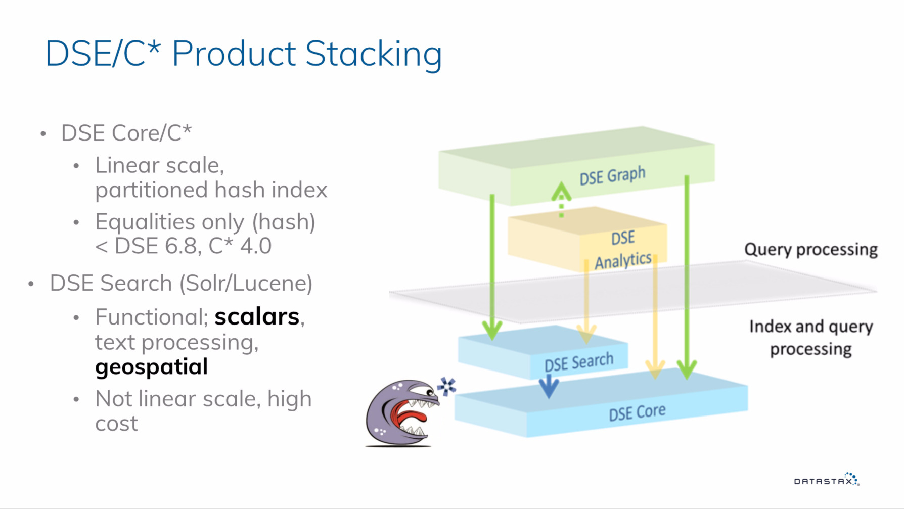
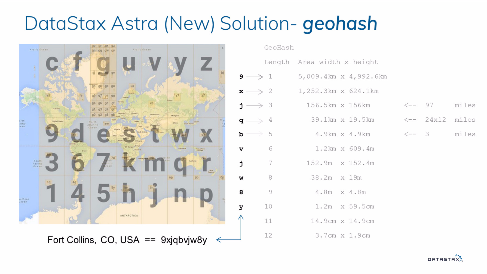
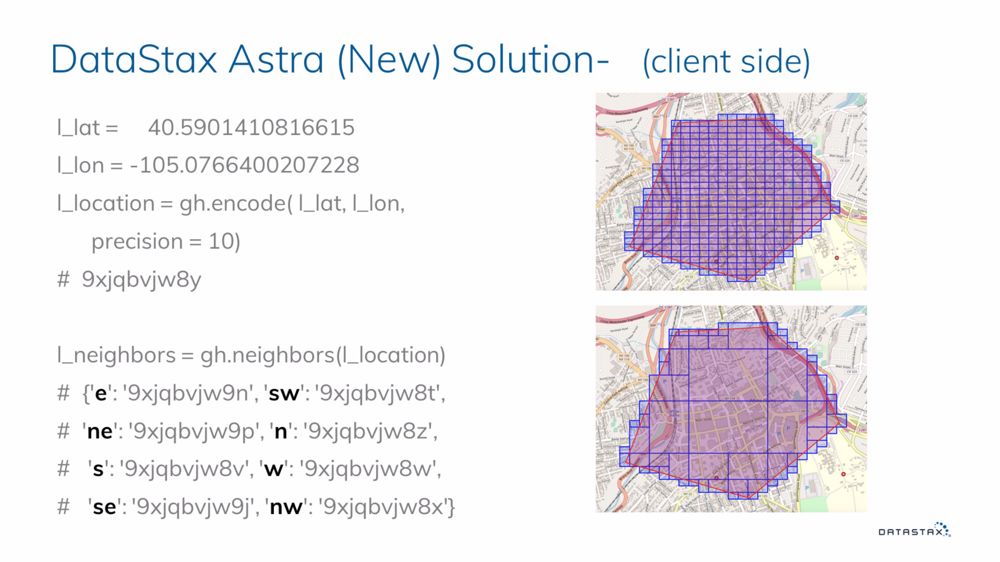
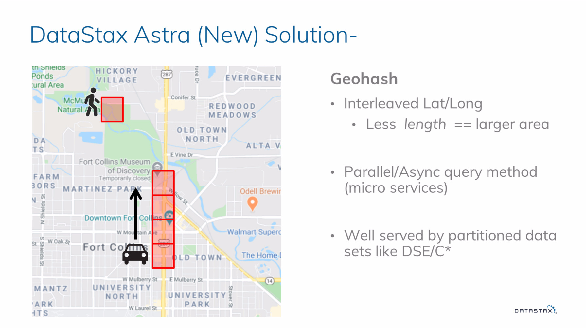
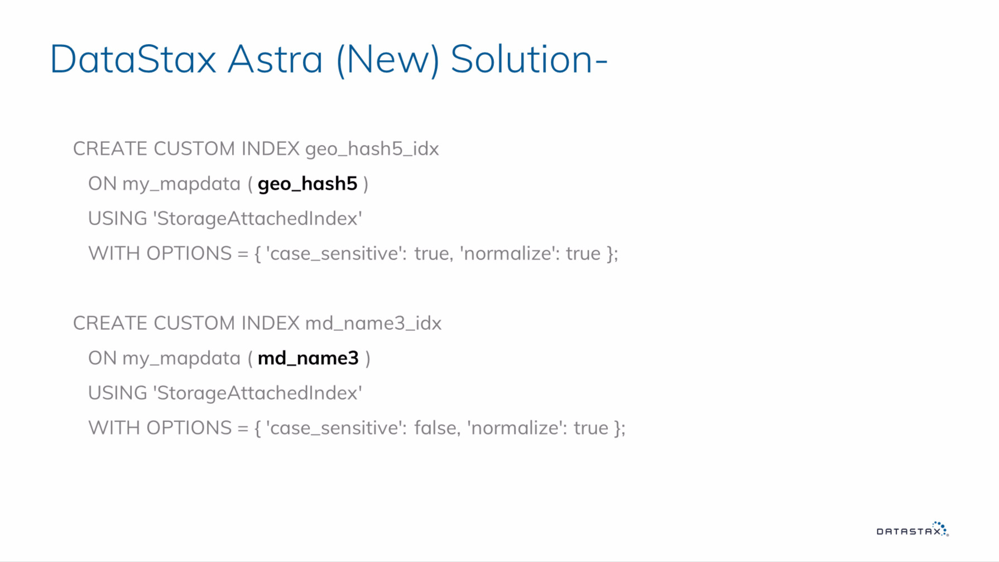
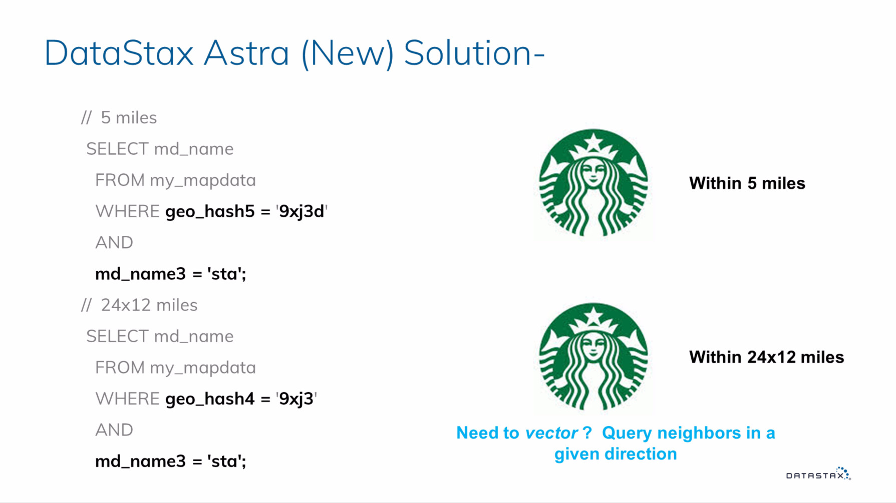
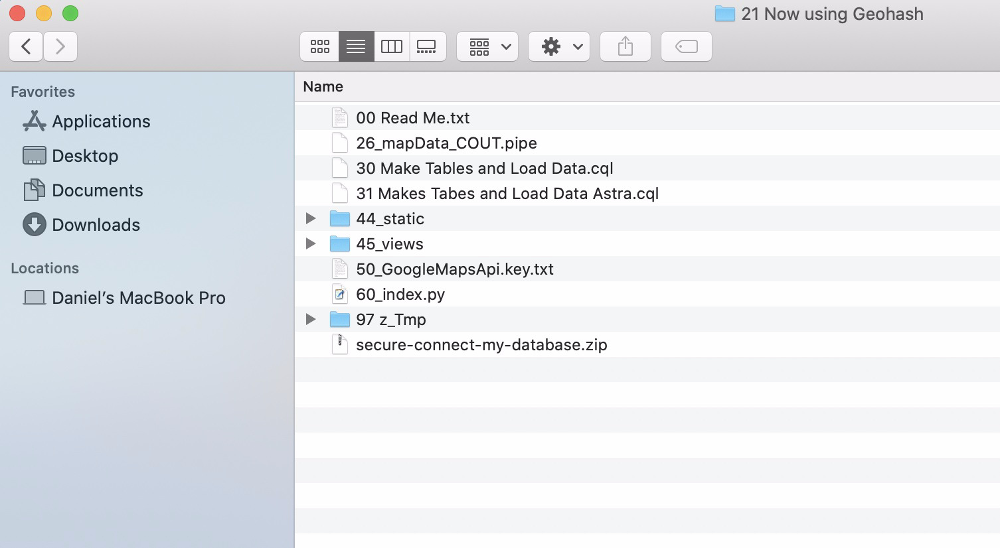
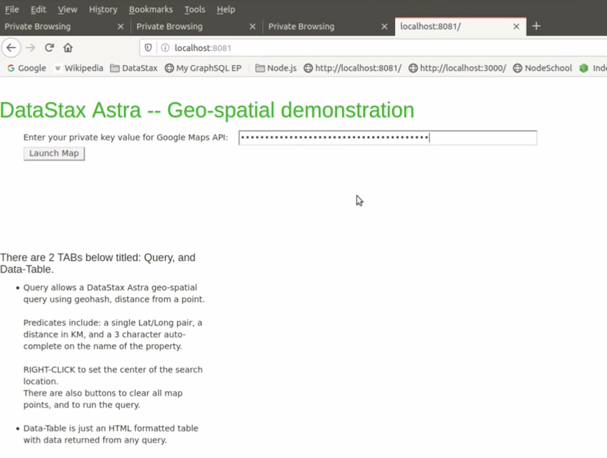
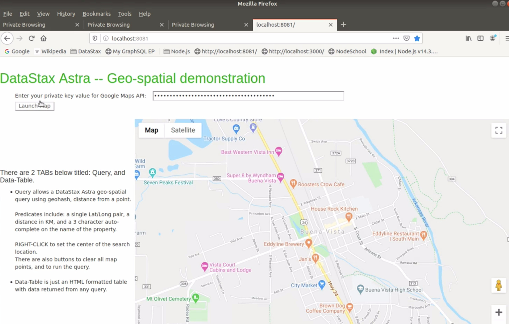
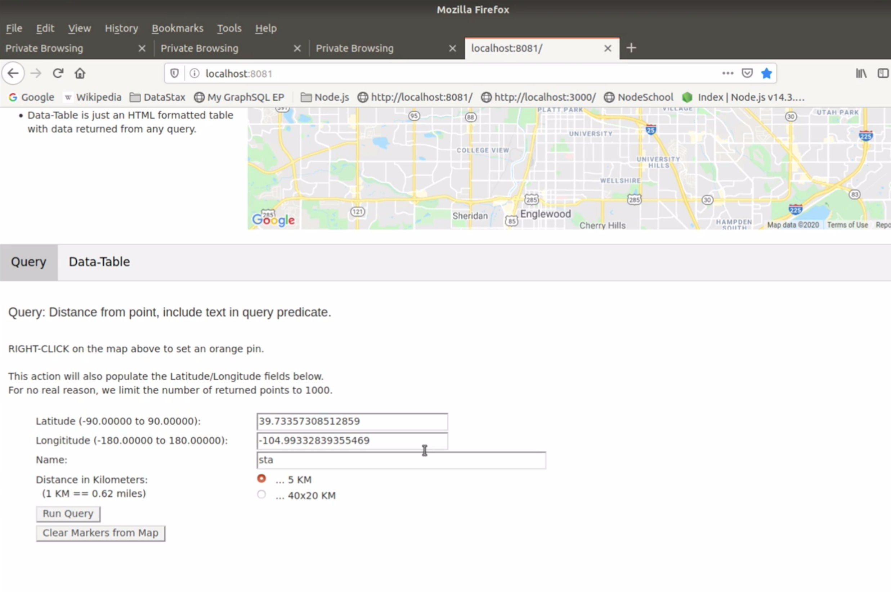

| **[Monthly Articles - 2022](../../README.md)** | **[Monthly Articles - 2021](../../2021/README.md)** | **[Monthly Articles - 2020](../../2020/README.md)** | **[Monthly Articles - 2019](../../2019/README.md)** | **[Monthly Articles - 2018](../../2018/README.md)** | **[Monthly Articles - 2017](../../2017/README.md)** | **[Data Downloads](../../downloads/README.md)** |
|-------------------------|-------------------------|-------------------------|-------------------------|-------------------------|-------------------------|-------------------------|

[Back to 2020 archive](../README.md)
[Download original PDF](../DDN_2020_42_AstraGeohash.pdf)
[Companion asset: DDN_2020_42_AstraGeohash_Data.pipe.gz](../DDN_2020_42_AstraGeohash_Data.pipe.gz)
[Companion asset: DDN_2020_42_AstraGeohash_Programs.tar.gz](../DDN_2020_42_AstraGeohash_Programs.tar.gz)

---

# DDN 2020 42 AstraGeohash

## Chapter 42. June 2020

DataStax Developer’s Notebook -- June 2020 V1.2

Welcome to the June 2020 edition of DataStax Developer’s Notebook (DDN). This month we answer the following question(s); My company is investigating using DataStax database as a service, titled DataStax Astra (Astra), to aid in our application development. I know Astra is exactly equal to Apache Cassandra, which means that the DataStax Enterprise DSE Search component is not present. As such, we lose Solr/Lucene, and any geo-spatial index and query processing support. But, our application needs geospatial query support. Can you help ? Excellent question ! You will be surprised how easy this is to address. In this article we detail how you deliver geospatial queries using DataStax Astra, or just the DataStax Enterprise (DSE) Core functional component, (and not use DSE Search).

## Software versions

The primary DataStax software component used in this edition of DDN is DataStax Enterprise (DSE), currently release 6.8.1, or DataStax Astra (Apache Cassandra version 4.0.0.682), as required. All of the steps outlined below can be run on one laptop with 16 GB of RAM, or if you prefer, run these steps on Amazon Web Services (AWS), Microsoft Azure, DataStax Astra, or similar, to allow yourself a bit more resource.

For isolation and (simplicity), we develop and test all systems inside virtual machines using a hypervisor (Oracle Virtual Box, VMWare Fusion version 8.5, or similar). The guest operating system we use when not using cloud, is Ubuntu Desktop version 18.04, 64 bit.

DataStax Developer’s Notebook -- June 2020 V1.2

## 42.1 Terms and core concepts

As stated above, ultimately the end goal is to deliver geospatial queries using Apache Cassandra, possibly hosted using DataStax Astra, both version 4.x or higher.

Figure 42-1 displays the DataStax Enterprise (DSE) product stack. A code review follows.



*Figure 42-1 DataStax Enterprise product stack*

Relative to Figure 42-1, the following is offered:

- DataStax Enterprise (DSE) has 4 primary functional components; DSE Core (aka Apache Cassandra), DSE Search (largely Apache Solr/Lucene), DSE Analytics (largely Apache Spark), and DSE Graph (largely Apache TinkerPop).

- The likely ‘go to’ most folks use for geospatial query support is found in DSE Search. But, you can also deliver geospatial queries, better and faster, using just DSE Core, just using Apache Cassandra. This means you can deliver geospatial queries using DataStax Astra.

- Prior to release 6.8 of DSE, prior to release 4.x of Apache Cassandra, there was the primary key index, certainly. There was also a secondary index capability, that was considered non-optimal.

DataStax Developer’s Notebook -- June 2020 V1.2

With these releases, a new secondary index type of provided, which is considered optimal, meeting the scale and complexity challenges of a distributed database. You may see this new index type referred to as ‘native database indexing” (NDI, the original project name), or “storage attached index” (SAI, the current and proper project name).

In this document, we detail how to deliver geospatial capability using this new index type.

Introducing Geohash Figure 42-2 details the basic idea behind geo hashing. A code review follows.



*Figure 42-2 Introducing geohash*

Relative to Figure 42-2, the following is offered:

- The basic idea behind geohash is to take planet Earth, and divide it into 26 areas. Then, you divide each of the 26 areas into 26 further area, and so on. After just 12 repetitions of this dividing, you can uniquely identify an area that is just 3 centimeters square (plus or minus), by a 12 character, unique string.

- A 12 character string identifies an area 3 centimeters square. Just the leading 10 characters of this same string identifies an area 1 meter

DataStax Developer’s Notebook -- June 2020 V1.2

square, and the same leading 6 characters is approximately an area 1 kilometer square. All of this from one easily calculated string.

- What you index then, is just the 12 character string, and apply equality query predicates to it. If your query engine supports, generally, a LIKE operand, this may or may not be a bonus. As a trailing substring, you would span partitions (not optimal), but writing the query could be viewed as a bit simpler. The same would be true for IN clauses, or similar. Most optimal ? We choose to uniquely index the leading 5, or 6 character substrings, that support our queries and business needs.

But Solr/Lucene supports radius, boxes, and polygons Generally, Apache Solr/Lucene, and thus DSE Search support 3 top level query (models); radius, bounding box, and polygons. Examples as shown in Figure 42-3. A code review follows.



*Figure 42-3 Polygons and similar with geohash*

Relative to Figure 42-3, the following is offered:

- Geo hash can do radius, bounding box, and polygon queries.

DataStax Developer’s Notebook -- June 2020 V1.2

Where Solr/Lucene used single, monolithic (all in one) queries, a more modern approach is to execute multiple, concurrent and asynchronous, micro service style queries. From the image above, a polygon is achieved by executing numerous (geo hash, box) queries that in total are shaped to equal whatever.

- This micro service approach is more optimal more modern. Why ? For one, through mobile devices/applications, we now know more about the needs of the query. • If you detect that my motion of generally zero to 3 miles per hour, you can assume I am walking, and show me Starbuck’s within my general and brief radius. • If, however, I’m moving 80 miles per hour, you can assume I’m driving, and should only show me Starbuck’s on my current (northern, southern, whatever) trajectory. If I’m moving 80 miles per hour, I very much not interested in going backwards 10 miles to a Starbuck’s.

> Note: While there are many, many geohash libraries, generally all offer a ‘neighbors’ like function or similar. Better libraries will also calculate the ‘polygon’ query for you, and also trajectory queries.

Figure 42-4 displays a single geohash (box) of a given size for a walking query, and a series of boxes for a driving, directional query.

DataStax Developer’s Notebook -- June 2020 V1.2



*Figure 42-4 Queries for direction, or lack of direction.*

Geo hash on Cassandra; index and queries Figure 42-5 displays the new, storage attached index (SAI) syntax, available in Apache Cassandra, and DSE Core. Effectively, this is just a TEXT column index. The fact that we are storing geo hash encoded data is largely unknown to Cassandra.

We create one index for the location data, and a second for the business name.

DataStax Developer’s Notebook -- June 2020 V1.2



*Figure 42-5 CREATE INDEX syntax*

Figure 42-6 displays out SELECT statements; an AND’ed query, with two equality predicates, super simple.



*Figure 42-6 SELECT statement syntax*

DataStax Developer’s Notebook -- June 2020 V1.2

## 42.2 Complete the following

At this point in this document we have detailed how geo hash works; how we calculate the geo hash value, the indexes we put in place, and the query we run.

This month we also provide a sample Web application, sample data and instructions. Comments;

- A Python application, there are Python libraries you will need to install with “pip”. You can read the program documentation in the file named, “60*”, or just run the program, receive the missing library error, resolve, and run again.

- A listing of the files provided is found in Figure 42-7. A code review follows.



*Figure 42-7 Files in this distribution*

Relative to Figure 42-7, the following is offered: • You launch the single page Web program by entering, python 60* on the (Linux) command line. If you provide zero command line arguments, the program will attempt to connect to an Apache Cassandra or DSE Core listening locally, at localhost.

DataStax Developer’s Notebook -- June 2020 V1.2

If you provide any command line arguments, then this program will connect to the DataStax Astra instance specified inside the (connection bundle resource file) located inthe same directory. Visit the DataStax Astra on line documentation for instructions (they’re super easy) to download this file. • The file titled “26*” contains 80-100 MB of 2012 data downloaded from Yelp, and lists business in the United States states of Colorado and Utah. This same file also has USA national Starbuck’s, also dated

2012. • The files titled “30*” and “31*” are CQL command scripts, intended to be run via CQLSH. Pick one file of the other, you don’t need both. The “30*” file expects a local DSE or Apache Cassandra. The “31*” files runs against the free, low powered DataStax Astra tier. Why a special script just for Astra? The free Astra tier is super tiny, and low power; this script throttles inserts to an acceptable, low rate. • The CQL command scrips make a Keyspace, Tables, Indexes, and load data using COPY.

Google Maps, you need a ‘free’ key Prior to 2018, the Google Maps API was free to developers. 2018 and beyond, you need to register a credit card, and get a unique key. If you stay below a given level of activity, then this service is free.

When you first launch the Wb application, you must enter your Google Maps API key into the Web form, then click, Launch. Example as shown in Figure 42-8.

DataStax Developer’s Notebook -- June 2020 V1.2



*Figure 42-8 Entering the Google Maps API key*

And then operating the demo Figure 42-9 and Figure 42-10 display the demonstration program proper. A single page Web application, there are two TABs; a query TAB, and a detail (results) TAB.

DataStax Developer’s Notebook -- June 2020 V1.2



*Figure 42-9 Demonstration program start; the Map is active*



*Figure 42-10 Main operating area to the demonstration program*

DataStax Developer’s Notebook -- June 2020 V1.2

Recall; there is data for Colorado and Utah only, plus nation wide Starbuck’s location, circa 2012.

## 42.3 In this document, we reviewed or created:

This month and in this document we detailed the following:

- A good sized primer on geo hashing; how it works.

- The new ‘storage attached indexed’ found in Apache Cassandra.

- And we provided a sample Web application, and data to demonstrate same.

### Persons who help this month.

Kiyu Gabriel, Dave Bechberger, Jim Hatcher, and Matt Overstreet.

### Additional resources:

Free DataStax Enterprise training courses,

```text
https://academy.datastax.com/courses/
```

Take any class, any time, for free. If you complete every class on DataStax Academy, you will actually have achieved a pretty good mastery of DataStax Enterprise, Apache Spark, Apache Solr, Apache TinkerPop, and even some programming.

This document is located here,

```text
https://github.com/farrell0/DataStax-Developers-Notebook
https://tinyurl.com/ddn3000
```

DataStax Developer’s Notebook -- June 2020 V1.2
