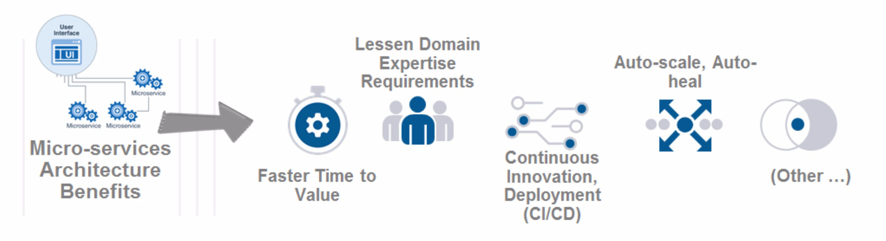
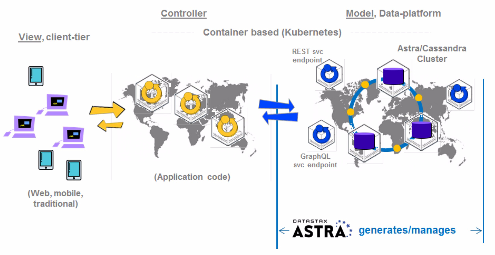
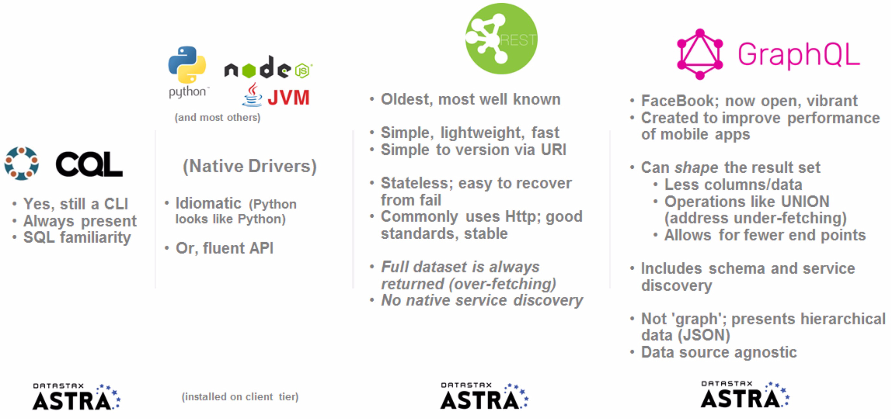
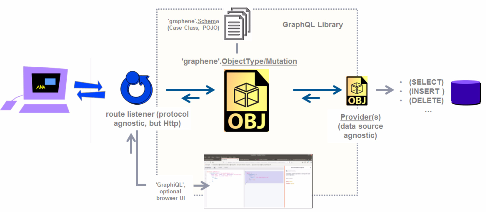
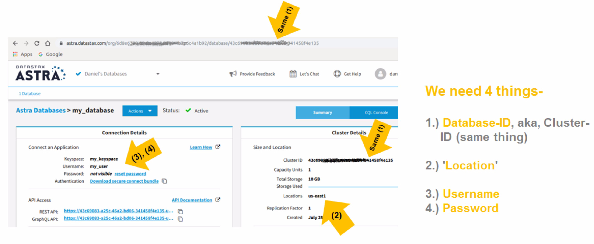
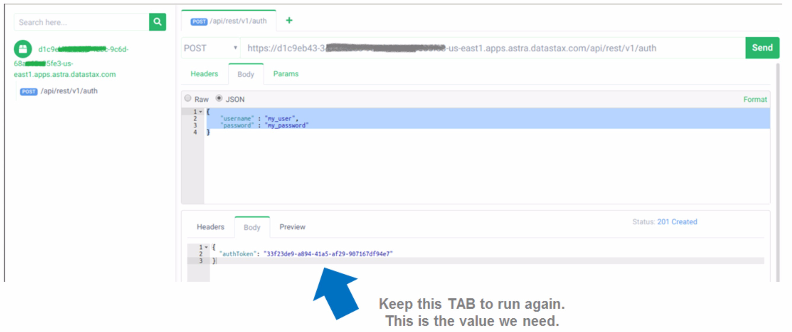
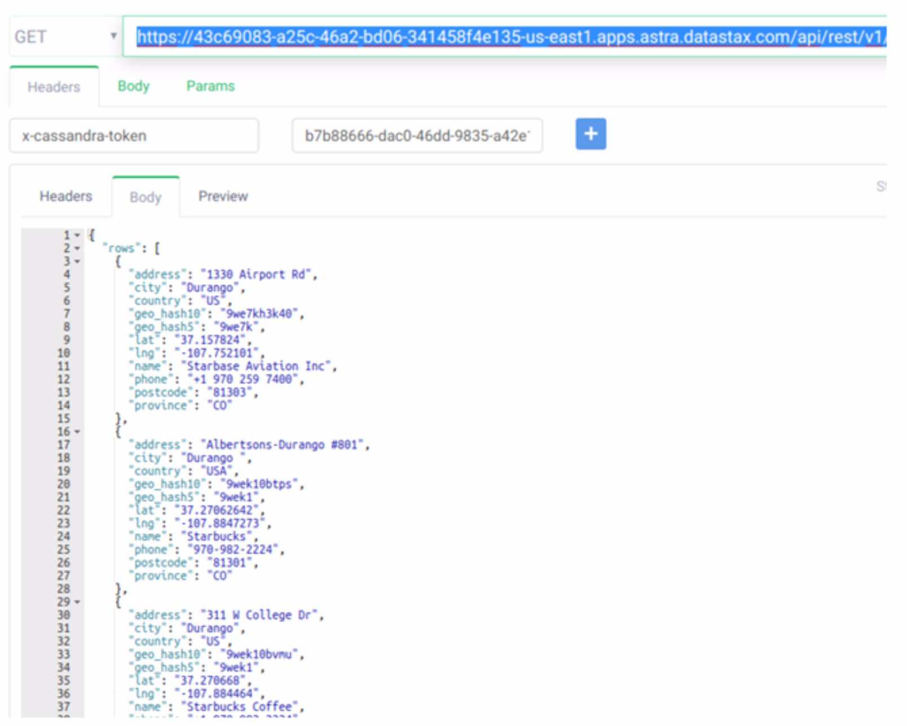

| **[Monthly Articles - 2022](../../README.md)** | **[Monthly Articles - 2021](../../2021/README.md)** | **[Monthly Articles - 2020](../../2020/README.md)** | **[Monthly Articles - 2019](../../2019/README.md)** | **[Monthly Articles - 2018](../../2018/README.md)** | **[Monthly Articles - 2017](../../2017/README.md)** | **[Data Downloads](../../downloads/README.md)** |
|-------------------------|-------------------------|-------------------------|-------------------------|-------------------------|-------------------------|-------------------------|

[Back to 2020 archive](../README.md)
[Download original PDF](../DDN_2020_43_AstraApiProgramming.pdf)
[Companion asset: DDN_2020_43_NoteBook.tar](../DDN_2020_43_NoteBook.tar)

## From The Archive

July 2020 - -
>Customer: Okay, so my company is finally ready to “database as a service (DBaaS)". We also want to move to a micro-services
>architecture, and possibly GraphQL. Can you help ?
>
>Daniel: Excellent question ! In this series we’ve previously covered GraphQL, and previously covered geo-spatial queries
>using the DataStax Cassandra as a service titled, Astra, which also acted as our primer on Astra.
>
>In this article, we specifically cover Astra API programming.
>
>[Read article online](./README.md)
>
>[Application program data](../DDN_2020_43_NoteBook.tar) in the form
>of a DataStax Studio Notebook, in standard TAR file form.


---

# DDN 2020 43 AstraApiProgramming

## Chapter 43. July 2020

DataStax Developer’s Notebook -- July 2020 V1.2

Welcome to the July 2020 edition of DataStax Developer’s Notebook (DDN). This month we answer the following question(s); Okay, so my company is finally ready to “database as a service (DBaaS). We also want to move to a micro-services architecture, and possibly GraphQL. Can you help ? Excellent question ! In this series we’ve previously covered GraphQL, and previously covered geo-spatial queries using the DataStax Cassandra as a service titled, Astra, which also acted as our primer on Astra. In this article, we specifically cover Astra API programming.

## Software versions

The primary DataStax software component used in this edition of DDN is DataStax Enterprise (DSE), currently release 6.9.1, or DataStax Astra (Apache Cassandra version 4.0.0.682), as required. All of the steps outlined below can be run on one laptop with 16 GB of RAM, or if you prefer, run these steps on Amazon Web Services (AWS), Microsoft Azure, or similar, to allow yourself a bit more resource.

For isolation and (simplicity), we develop and test all systems inside virtual machines using a hypervisor (Oracle Virtual Box, VMWare Fusion version 8.5, or similar). The guest operating system we use is Ubuntu Desktop version 18.04, 64 bit.

DataStax Developer’s Notebook -- July 2020 V1.2

## 43.1 Terms and core concepts

As stated above, ultimately the end goal is to get to; mirco-services, database as a service (DBaaS), GraphQL, other. In this article, we offer a primer on using REST API service invocations, and GraphQL API service invocations, using DataStax Astra (Astra), a hosted/managed Cassandra offering. Astra features a free sign up; a valid email address is required, and you get one node, community support, and up to 10 GB of space for data.

In this article, we’ll use the Astra Home Page, with all that that offers, and the Google Chrome Browser, with some new extensions (plug-ins) to support a GUI interface for REST API service invocation, and GraphQL API service invocation.

Why micro-services Micro-services has been a thing for a while. Instead of one monolithic application, you break at least components of the Controller portion (the pervasive Model-View-Controller application design pattern) of the application into smaller units, likely hosted in (Linux) containers.

Why ?

- The (system) hosting these services can be configured to auto-scale (up) any services which become overloaded; and auto scale down too. This same system will know how to ‘heart beat’ these services, and restart them should they hang, or fail.



*Figure 43-1 Why micro-services*

- When creating services using REST, or GraphQL, a subset of the development team will create and maintain these, so that the entire staff does not need to learn whatever service provider lies underneath.

- Continuous integration, continuous deployment makes use of these (container frameworks), so that you can configure a recompile, and execution of tests, upon any application code commits/changes.

DataStax Developer’s Notebook -- July 2020 V1.2

If you wish, you can also configure to publishes changes to the application, with the presumption that a pass of the test suite is all that is required.



*Figure 43-2 API Programming, architecture*

When using Astra When using DataStax Astra, part of this (as a service) offering is to provide not only the database platform, but also the necessary REST API call definitions and hosting, and the same for GraphQL.

What ?

- The REST and GraphQL service end points are automatically generated, hosted, and maintained for you.

- So, given a table with data (and permissions to same), you can immediately query and write to said table.

- These services are co-located in the same Kubernetes pod as the database proper, are automatically integrated with Cassandra security, and automatically and centrally log activity.

The 4 ways to interact with Astra Figure 43-3 displays the 4 ways currently to interact with Astra. A code review follows.

DataStax Developer’s Notebook -- July 2020 V1.2



*Figure 43-3 CLIs into Astra*

Relative to Figure 43-3, the following is offered:

- CQL is the SQL-like call level interface (CLI) that comes with Cassandra. You can still access Astra using CLI. A CQL listening daemon is automatically hosted inside Cassandra, inside Astra.

- Native client side drivers are those Java, Python, or other language specific libraries you install on the client tier, that allow access to, in this case, Cassandra or the hosted Cassandra from DataStax titled, Astra. This software, and this capability, are installed and maintained on the client side, outside of Cassandra or Astra.

- REST, is the oldest, and most widely used, most widely known, remote service invocation (RMI/RSI) in use today. While not bound specifically to an Http communication protocol, Http is the most commonly used. As such, REST API calls are expected to be stateless, and operate in the Controller tier to a 3 tiered application.

- Astra automatically generates, hosts, and maintains all REST service endpoints to all user defined tables; no application coding, other, is required to access Astra using REST.

- And Astra does the same for GraphQL; a service endpoint is automatically generated, hosted and maintained. All you need do is authenticate, and submit a GraphQL encoded service request.

DataStax Developer’s Notebook -- July 2020 V1.2

> Note: GraphQL has no inherit relationship to graph databases. GraphQL gets its name from the fact that result sets are returned using JSON, and is presented in a hierarchical fashion.

Logical object model for GraphQL Like any server or service, GraphQL has an object hierarchy, as presented in Figure 43-4. A code review follows.



*Figure 43-4 GraphQL logical object hierarchy*

Relative to Figure 43-4, the following is offered:

- In this context, GraphQL is a library.

- A service end point, a listener is defined and instantiated to react to services requests at a given IP address, port number, and protocol. This work is separate and agnostic to GraphQL. (Astra automatically generates, hosts and maintains this listener using Http.)

- GraphQL will parse the incoming request, and resolve said request to any number of providers. Providers are written in whatever host language (Python, Java, Other), and themselves interact with an agent like a database server. (Again; Astra does this all automatically.)

- When writing your own GraphQL services, every GraphQL library we’ve seen comes with a free browser application generally titled, GraphiQL, which allows you to browse whatever services and model GraphQL is providing.

DataStax Developer’s Notebook -- July 2020 V1.2

## 43.2 Complete the following

At this point in this document we have a general sense of how Astra API services are generated, hosted and maintained. Given a table with data, hosted inside Astra, we now proceed to design and execute REST and GraphQL service requests. For simplicity, we will not write (custom) client side programs, and instead, will use Google Chrome browser extensions (plug-ins) to give us a free and easy graphical user interface. You can also do this same work using Curl(C) requests from the command line.

Generally the operating model is;

- Get an AUTH token- • For this you need a username, password pair that authenticates with Astra • The Database-ID Cluster-ID of the target Astra system. (So far, Database-ID and Cluster-ID are synonyms for a single Astra database system.) • And you need a ‘location’, I.e., Amazon ‘us-east’. • Assuming you can authenticate, all of this data is available from the DataStax Astra Home Page.



*Figure 43-5 Astra Home Page, data we need*

- AUTH tokens are valid for 30 minutes if you are idle. If you stay active, a given AUTH token is valid for much longer.

- With an AUTH token, you can request service using REST or GraphQL- • You need a Url. this Url will differ whether you are using REST or GraphQL, and based on the type of operation you desire; (generally: read or write).

DataStax Developer’s Notebook -- July 2020 V1.2

• You will need your target keyspace and table names (where does this data reside). And you will need column values; which primary key or similar to return, or which new column values to INSERT, UPDATE, or DELETE. • Generally too, you supply a (command). This is true more for GraphQL. The command is your read or write request proper

To supply a graphical user interface, we use While there are literally dozens of options to choose from, we use Google Chrome and the Google Chrome extensions-

- “REST client APIsHub”, available here; https://chrome.google.com/webstore/detail/rest-client-apishub/dabkfpeebk ikmgdianbkchblbdibbfhl?hl=en-US

- And the “Altair GraphQL client” available here, https://chrome.google.com/webstore/detail/altair-graphql-client/flnheeellpc iglgpaodhkhmapeljopja

- GUI programs, we’ll expect you can figure these programs out, given the brief instructions below-

In some cases you will configure these programs to Http GET. In other cases you will use POST.

First, a sanity check To confirm that the Astra REST API end point if operating, we execute a REST API call using GET. We need to supply the following Url with no other arguments or settings- https:// DATABASE-ID (hyphen) LOCATION.apps.astra.datastax.com/api/rest

Comments on the above-

- Replace the DATABASE-ID with the specific value from the Astra Home Page.

- Replace the LOCATION with the specific value from the Astra Home Page.

- Replace “(hyphen)” with a literal hyphen.

- Remove any extra whitespace.

- Upon success, you should receive a message indicating that the Astra REST API service end point is functioning and healthy.

DataStax Developer’s Notebook -- July 2020 V1.2

Getting an AUTH token To get an AUTH token using REST, a couple of things change:

- The Url changes to, https:// DATABASE-ID (hyphen) LOCATION.apps.astra.datastax.com/api/rest/v1/auth Perform substitutions and similar, as detailed above.

- The Http method changes from GET to POST.

- And we need to set message headers for both “username”, and “password”.

- With a successful invocation, you should receive an AUTH token that looks like a UUID. Keep this value, and the ability to re-invoke this service request; you will need them.



*Figure 43-6 Getting an AUTH token using REST*

Issuing a SELECT using REST Where the last method invocation used a POST (there was data: the username and password), this request sends no data. thus, we return to a GET method invocation. The Url we send includes the key values and other information about the request we wish to complete. https://43c690XXXXXXXa2d06 - us-east1 .apps.astra.datastax.com/api/rest/v1/keyspaces/ my_keyspace /tables/ mapdata /rows/ CO

DataStax Developer’s Notebook -- July 2020 V1.2

- Last time we’ll mention; remove excess whitespace, and perform substitutions where needed-

- After the keyword ‘keyspaces, supply the actual name of the keyspace where your target table resides. IN our example, that keyspace name was, “my_keyspace”.

- This is a primary key SELECT, and out primary key value was “CO” (for Colorado, a state in the USA).

Sample result as displayed below in Figure 43-7.



*Figure 43-7 Result of REST SELECT*

GraphQL API service invocations From the user interface, at least, the GraphQL API service invocation is a tiny amount more involved;

- We still need to send the AUTH token

- We still use a Url

- We still set headers

DataStax Developer’s Notebook -- July 2020 V1.2

- And we will be sending data, which is the query proper

Example 1:

- Url, https://43c690XXXXXXXa2d06 - us-east1 .apps.astra.datastax.com/api/graphql As before, substitute the Database-ID. Otherwise, this Url will be consistent across all of the examples that follow; this Url does not change.

- In the message Header, set a key value titled, X-Cassandra-Token equal to the AUTH key.

- And our first query is, query { q1: mapdata(value: {province: "CO", geoHash10: "dp3rkgkwgs" }) { values { city phone postcode } }}

- The query above is a primary key query, and will return one row, an exact match.

Query 2:

The only thing that changes is our query, the data we send. query { q1: mapdata(value: {province: "CO", geoHash10: "dp3rkgkwgs"}) { values { city phone postcode } } q2: mapdata(value: {province: "MI", geoHash10: "dpdsyhh02f"}) { values {

DataStax Developer’s Notebook -- July 2020 V1.2

address geoHash5 } } }

This example displays what SQL would refer to as a UNIONED SELECT; notice that the column names and count differ. And, we used one table (because we only have one table), but these two tables names could differ.

Example 3: Syntactically nothing is new in this example. We do display, however, that you can easily query secondary indexed columns when using GraphQL. query { q1: mapdata(value: {geoHash5: "9qh10"}) { values { city phone postcode } } }

## 43.3 In this document, we reviewed or created:

This month and in this document we detailed the following:

- A rather general primer on micro-services, and REST and then GraphQL API endpoint programming, when using the DataStax hosted version of Cassandra titled, Astra.

- We also detailed two of our favorite Google Chrome plug-ins for REST and GraphQL programming.

DataStax Developer’s Notebook -- July 2020 V1.2

### Persons who help this month.

Kiyu Gabriel, Dave Bechberger, Jim Hatcher. Matt Kennedy.

### Additional resources:

Free DataStax Enterprise training courses,

```text
https://academy.datastax.com/courses/
```

Take any class, any time, for free. If you complete every class on DataStax Academy, you will actually have achieved a pretty good mastery of DataStax Enterprise, Apache Spark, Apache Solr, Apache TinkerPop, and even some programming.

This document is located here,

```text
https://github.com/farrell0/DataStax-Developers-Notebook
https://tinyurl.com/ddn3000
```

DataStax Developer’s Notebook -- July 2020 V1.2
