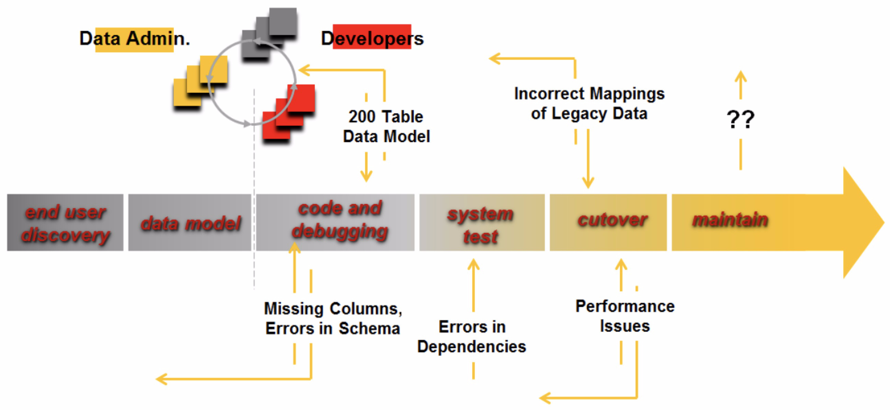
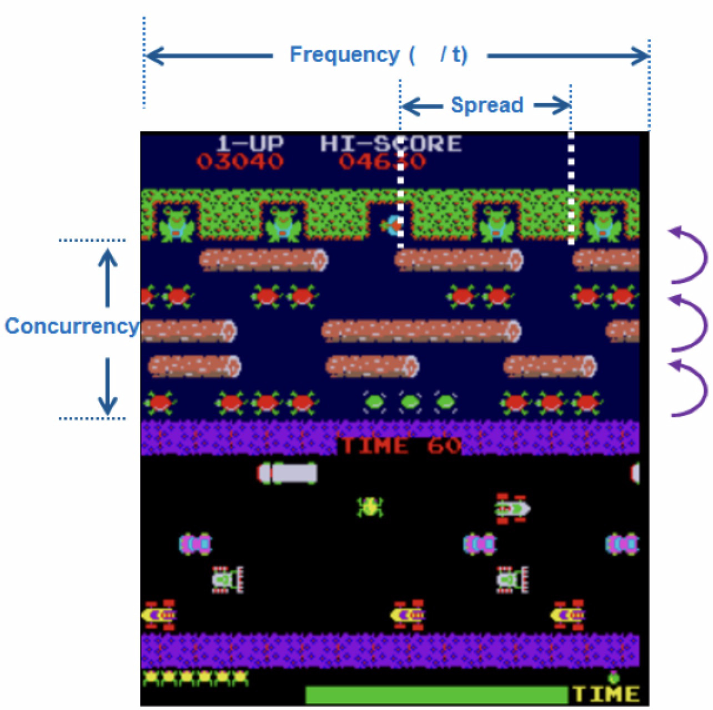
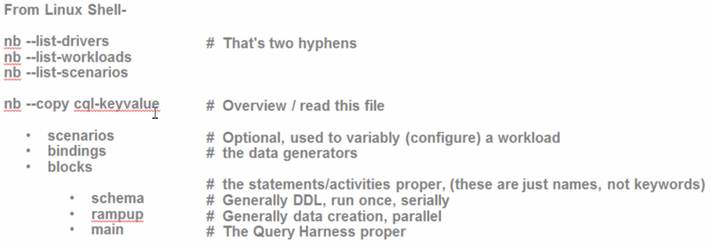

| **[Monthly Articles - 2022](../../README.md)** | **[Monthly Articles - 2021](../../2021/README.md)** | **[Monthly Articles - 2020](../../2020/README.md)** | **[Monthly Articles - 2019](../../2019/README.md)** | **[Monthly Articles - 2018](../../2018/README.md)** | **[Monthly Articles - 2017](../../2017/README.md)** | **[Data Downloads](../../downloads/README.md)** |
|-------------------------|-------------------------|-------------------------|-------------------------|-------------------------|-------------------------|-------------------------|

[Back to 2020 archive](../README.md)
[Download original PDF](../DDN_2020_44_NoSQLBench.pdf)
[Companion asset: DDN_2020_44_NoSQLBench.yaml](../DDN_2020_44_NoSQLBench.yaml)
[Companion asset: DDN_2020_44_NoSQLBench_Slides.pdf](../DDN_2020_44_NoSQLBench_Slides.pdf)

## From The Archive

August 2020 - -
>Customer: My company has diffficulty moving applications into production related to data at scale. E.g., we program then unit
>and system test with 5-15 rows of data, then when we get into production with millions of lines of data, things fail. There
>has to be an easier way to overcome this challenge. Can you help ?
>
>Daniel: Excellent question ! With all of the pressures we face today just to get applications written, unit testing often suffers,
>system testing suffers worse, and then testing applications at scale often never happens. Fortunately, we have an easy solution.
>
>For the past 10 years inside DataStax, we’ve perfected NoSQLBench, our now open source distributed data platform, volume data generation
>and testing tool. In this article we will overview NoSQLBench, enabling you to see if NoSQLBench can meet your needs too.
>
>[Read article online](./README.md)
>
>[PowerPoint(Added detail to the above)](../DDN_2020_44_NoSQLBench_Slides.pdf)
>
>[The final YAML file/solution used in this article](../DDN_2020_44_NoSQLBench.yaml)


---

# DDN 2020 44 NoSQLBench

## Chapter 44. August 2020

DataStax Developer’s Notebook -- August 2020 V1.2

Welcome to the August 2020 edition of DataStax Developer’s Notebook (DDN). This month we answer the following question(s); My company has diffficulty moving applications into production related to data at scale. E.g., we program then unit and system test with 5-15 rows of data, then when we get into production with millions of lines of data, things fail. There has to be an easier way to overcome this challenge. Can you help ? Excellent question ! With all of the pressures we face today just to get applications written, unit testing often suffers, system testing suffers worse, and then testing applications at scale often never happens. Fortunately, we have an easy solution. For the past 10 years inside DataStax, we’ve perfected NoSQLBench, our now open source distributed data platform, volume data generation and testing tool. In this article we will overview NoSQLBench, enabling you to see if NoSQLBench can meet your needs too.

## Software versions

The primary DataStax software component used in this edition of DDN is DataStax Enterprise (DSE), currently release 6.9.1, or DataStax Astra (Apache Cassandra version 4.0.0.682), as required. All of the steps outlined below can be run on one laptop with 16 GB of RAM, or if you prefer, run these steps on Amazon Web Services (AWS), Microsoft Azure, or similar, to allow yourself a bit more resource.

For isolation and (simplicity), we develop and test all systems inside virtual machines using a hypervisor (Oracle Virtual Box, VMWare Fusion version 8.5, or similar). The guest operating system we use is Ubuntu Desktop version 18.04, 64 bit.

DataStax Developer’s Notebook -- August 2020 V1.2

## 44.1 Terms and core concepts

As stated above, ultimately the end goal is to easily test applications at scale. NoSQLBench was designed to answer questions similar to;

- Can I add X% more users ?

- Can I add this new application module ?

- Can I handle the expected/ increased seasonal service load/spike ?

- Can I downsize this system for cost ?

- What will happen to customer satisfaction if I do (YYY) while on line, or on peak ?

- Routine-Z is now slow; Did it grow slow over months, or overnight ? (2 different problems/solutions.)

- How can I improve application development velocity ?

Figure 44-1 displays a common software development lifecycle (SDLC). A code review follows.



*Figure 44-1 Common software development lifecycle (SDLC)*

Relative to Figure 44-1, the following is offered:

- After user interviews, we data model, but; How is the data model validated for accuracy or performance ?

- By the time we get to coding, the data team drops a 200 table data model on the developers, which the developers then have to decode. The coders uncover errors in the data model; omissions, incorrect mappings, other.

DataStax Developer’s Notebook -- August 2020 V1.2

- Post system test, a cut over is performed from the legacy system where even further errors are uncovered; there are often string values in supposedly numeric fields, other.

- And, as is the point of this document, most commonly the first time that this new system is tested with data at scale is late in the development cycle. When we discover here that the data model has elements that under perform, the model must change, which then causes a refactoring of application code pieces; a vicious cycle of push and pull.

NoSQLBench is designed to facilitate testing data at scale.Figure 44-2 introduces the idea of a query harness. A code review follows.



*Figure 44-2 A query harness*

Relative to Figure 44-2, the following is offered:

- A query harness contains every INSERT, UPDATE, DELETE, SELECT, (and similar), along with the frequency, concurrency, and spread of each routine. The query harness also contains the necessary/expected SLA for each routine.

DataStax Developer’s Notebook -- August 2020 V1.2

From a data platform perspective, you can guarantee system performance, other, by being able to run your query harness within necessary parameters.

- The role NoSQLBench fills- • Given the individual INSERTs, other (which come from your data model design), NoSQLBench fills all other roles here. No programming, a simple YAML data file specifies the data generation, and then (frequency, concurrency, and spread) to run said INSERTs, other. • Why is generated data preferred ? Good generated data, the kind produced by NoSQLBench, is both deterministic and statistically significant. Iterative tests perform consistently even given different scales, other. Hosted data (data on disk) is often the limiting factor when testing at scale, as the data must be lifted for use. Also, generating (accurate, representative) data on disk is time consuming, and subject to error. • NoSQLBench is partition aware/capable. Huh ? NoSQLBench knows how to function with partitioned databases; scale, other. • And NoSQLBench automatically generates and maintains a Prometheus/Grafana container to review production statistics graphically.

## 44.2 Complete the following

We complete our coverage of NoSQLBench using examples, and hands on activities.

NoSQLBench install and verify NoSQLBench can be compiled from source code, or for Linux and Windows, downloaded from binary. The download links are,

```text
docs.nosqlbench.io
https://github.com/nosqlbench/nosqlbench/blob/main/DOWNLOADS.md
```

The remainder of our install/verify appears in Figure 44-3. A code review follows.

DataStax Developer’s Notebook -- August 2020 V1.2



*Figure 44-3 NoSQLBench install/verify*

Relative to Figure 44-3, the following is offered:

- An “nb --list-drivers” outputs the current backends supported by NoSQLBench; Cassandra, DSE, MongoDB, Web service invocations, and more. NoSQLBench is extensible, and you can add your own, new service backends.

- An “nb --list-workloads” outputs the included/pre-defined workloads that come with NoSQLBench. Workloads include; IOT, key/value pairs, wide column, and more. A workload is effectively a definition of a unit of work. E.g., when a call center operator on boards a new customer account, they might perform (n) given SELECTs, some number of INSERTs, other. Physically, a workload equates to a given YAML data file.

- An “nb --list-scenarios” outputs the predefined scenarios. With NoSQLBench, there are ‘named scenarios’, and ‘scenarios.’ ‘scenarios’ are when a NoSQLBench workload is run, with any command line options. E.g., a different target system, or different number of (cycles), other. ‘named scenarios’ are optional, and effectively are scenarios defined inside the YAML file, which may still be overridden.

- The ‘copy’ switch to “nb” allows you to (copy) existing workloads to a place of your choosing. A common, early activity would be to copy all existing workloads to a single folder, for later study. Why create any new workload of your own when you can just copy, and save time/effort-

DataStax Developer’s Notebook -- August 2020 V1.2

With thin the YAML file, are a number of blocks, some of which are optional:

- A ‘scenarios’ block is optional, and begins a section of those pre-defined, ‘named scenarios’.

- A ‘bindings’ block is optional, and define what values are generated for any given (output column). Bindings are partition aware, and may be deterministic, or (random). Bindings may also be defined globally (a the scope of the entire YAML), or at a lower, more narrow scope.

- And ‘blocks’ begins the (statements proper). Generally, for a database target system, these would be the INSERTs, other. There is much variableness here; you can alter the frequency, concurrency and spread of routines at the statement level.

Sample YAML; PK versus SAI lookup Example 44-1 offers a complete NoSQLBench ‘workload’ file. A code review follows.

### Example 44-1 Sample NoSQLBench ‘workload’, aka, YAML file

# Run via, # # nb (file_name) # nb (file_name) driver=cql # # nb run workload=(file_name) driver=stdout tags=phase:rampup cycles=10 # # nb run workload=(file_name) driver=stdout tags=name:query1 cycles=10

# Because of the DROP/CREATE KEYSPACE, this file does not run against Astra

scenarios: default: schema: run driver=stdout tags==phase:schema threads==1 cycles==UNDEF

DataStax Developer’s Notebook -- August 2020 V1.2

rampup: run driver=stdout tags==phase:rampup threads==auto cycles=10000000 main: run driver=stdout tags==phase:main threads==auto cycles=100000

bindings: colx: Mod(<<uuidCount:100000000>>L); ToHashedUUID() -> java.util.UUID; ToString() -> String col8: FullNames() -> String

blocks:

- tags: phase: schema params: prepared: false statements:

- drop_keyspace: | DROP KEYSPACE IF EXISTS <<keyspace:ks_44>>; tags: name: drop_keyspace

- create_keyspace: | CREATE KEYSPACE <<keyspace:ks_44>> WITH replication = {'class': 'SimpleStrategy', 'replication_factor': '1'}; tags: name: create_keyspace

- create_table: | CREATE TABLE <<keyspace:ks_44>>.<<table:t1>> ( col1 TEXT PRIMARY KEY,

DataStax Developer’s Notebook -- August 2020 V1.2

col2 TEXT, col3 TEXT, col4 TEXT, col5 TEXT, col6 TEXT, col7 TEXT, col8 TEXT, col9 TEXT, col0 TEXT ); tags: name: create_table

- create_index: | CREATE CUSTOM INDEX col4_idx ON <<keyspace:ks_44>>.<<table:t1>> (col4) USING 'StorageAttachedIndex'; tags: name: create_index

- tags: phase: rampup params: prepared: true statements:

- insert: | INSERT INTO <<keyspace:ks_44>>.<<table:t1>> (col1, col4, col8) VALUES ( {colx}, {colx}, {col8} ); tags: name: insert

- tags: phase: main

DataStax Developer’s Notebook -- August 2020 V1.2

params: prepared: true statements:

- query1: | SELECT * FROM <<keyspace:ks_44>>.<<table:t1>> WHERE col1 = {colx} ; tags: name: query1

- query1: | SELECT * FROM <<keyspace:ks_44>>.<<table:t1>> WHERE col4 = {colx} ; tags: name: query2

Relative to Example 44-1, the following is offered:

- 100 lines, this file begins with the optional ‘(named) scenarios’ block. Minimally, this block allows you to specify fewer arguments on the command line, to set defaults, and other parameters.

- If any named scenarios is named ‘default’, then that is the default scenario; the scenario run, is none is specified on the command line. All other named scenarios must be explicitly invoked on the command line.

- Scenarios, and the workloads themselves, may be ‘run’ or ‘start’(ed). ‘start’ will fork the workload to run in the background; ‘run’ runs in the foreground.

- In this example, the ‘default’ scenario has 3 further/lower identifiers titled; schema, rampup, and main. In effect, these (subsections) to this scenario may be invoked on the command line. In effect; run just 1/3, or 2/3 of this total scenario.

- The driver parameter tells NoSQLBench what to do with these statements. ‘stdout’, can be viewed as a debugging (tool), and merely outputs to the terminal device, command which could have been submitted to Cassandra, or another server.

- ‘threads’ are actual program and operating system threads.

DataStax Developer’s Notebook -- August 2020 V1.2

By convention, schema and SQL DDL style operations are run serially, and synchronously. ‘threads=auto’, generally starts ten times the number of threads, relative to the number of CPUs.

- The number of equal signs in this block are significant- A single equal sign parameter can be over written from the command line. 2 and 3 equal sign parameters may not be over written. How 2 or 3 equal sign parameters differ in behavior is how they respond should you try to over write them; error and fail, or just ignore.

- And cycles is used in a formula that calculates how many times any given statement below is run.

- ‘bindings’ calculate the value output for any given (column expression). Huge topic here, but to net it out; expect that you can generate whatever you need. There are perhaps 80 or more binding function from which to choose. The two listed here include- • FullNames() take data from the most recent USA census data, and outputs names. If, in the most recent census, the name “daniel’ is 10 times more common than the name ‘Eulysees’, you will see that reflected in the data that is output. • The Mod .. ToHashUUID is one of many expressions used to output unique identifiers.

- And then ‘blocks’- • ‘blocks’ leads to our statements proper; expectedly, INSERT, SELECT, other. • The first block is identified with the tag ‘schema’ and the tag/name ‘create_keyspace. Both of these may be used to run just a subset of the total statements in this file. These (names) also appear in any diagnostics that are output. • The params/prepared block calls to not SQL/CQL PREPARE these statements, as is common practice when issuing DDL. • The double angle brackets pairs are also for substitution. the first example, <<keyspace:ks_44>> will submit the value ‘ks_44’, unless another value is passed on the command line; I.e., nb keyspace=Bob. • Lastly, the curly brace pairs is where/how we call for substitution from any bindings generated value, much like you see in Web programming and JavaScript on a client tier.

DataStax Developer’s Notebook -- August 2020 V1.2

Much more we could have covered here; hopefully, this introductory example aids in your adoption of NoSQLBench.

## 44.3 In this document, we reviewed or created:

This month and in this document we detailed the following:

- A light primer to NoSQLBench, maybe equivalent to a 100 level treatment.

- We created one workload, withe one named scenario, and a number of statements to expectedly target CQL/Cassandra.

### Persons who help this month.

Kiyu Gabriel, Dave Bechberger, Jim Hatcher, and Mr. Jonathan Shook.

### Additional resources:

Free DataStax Enterprise training courses,

```text
https://academy.datastax.com/courses/
```

Take any class, any time, for free. If you complete every class on DataStax Academy, you will actually have achieved a pretty good mastery of DataStax Enterprise, Apache Spark, Apache Solr, Apache TinkerPop, and even some programming.

This document is located here,

```text
https://github.com/farrell0/DataStax-Developers-Notebook
https://tinyurl.com/ddn3000
```
