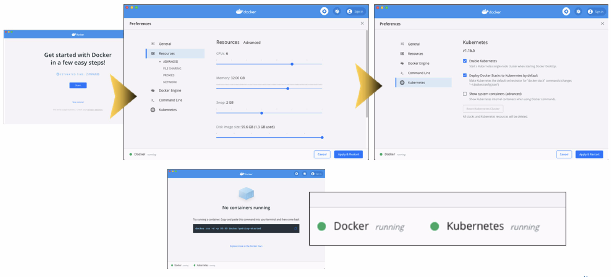

| **[Monthly Articles - 2022](../../README.md)** | **[Monthly Articles - 2021](../../2021/README.md)** | **[Monthly Articles - 2020](../../2020/README.md)** | **[Monthly Articles - 2019](../../2019/README.md)** | **[Monthly Articles - 2018](../../2018/README.md)** | **[Monthly Articles - 2017](../../2017/README.md)** | **[Data Downloads](../../downloads/README.md)** |
|-------------------------|-------------------------|-------------------------|-------------------------|-------------------------|-------------------------|-------------------------|

[Back to 2020 archive](../README.md)
[Download original PDF](../DDN_2020_45_KubernetesOperator.pdf)
[Companion asset: DDN_2020_45_KubernetesOperator.tar](../DDN_2020_45_KubernetesOperator.tar)

## From The Archive

September 2020 - -
>Customer: My company is all in on micro-services, container and cloud for application development, server hosting including databases,
>you name it. We’ve never hosted Cassandra inside containers, and wonder how best to get started. Can you help ?
>
>Daniel: Excellent question ! DataStax recently produced and open sourced its Kubernetes Operator, which will get you all that you need.
>This operator supports open source Cassandra, DataStax Enterprise, and more.
>
>In the real world, expectedly, you’d use this operator to stand up pods hosting Cassandra on GKE or similar. For better learning and
>debugging, this article will actually do this work on our laptop; greater control, greater control to break things for test, other.
>
>[Read article online](./README.md)
>
>[Download YAML files for labs here (TarBall format)](../DDN_2020_45_KubernetesOperator.tar)


---

# DDN 2020 45 KubernetesOperator

## Chapter 45. September 2020

DataStax Developer’s Notebook -- September 2020 V1.2

Welcome to the September 2020 edition of DataStax Developer’s Notebook (DDN). This month we answer the following question(s); My company is all in on micro-services, container and cloud for application development, server hosting including databases, you name it. We’ve never hosted Cassandra inside containers, and wonder how best to get started. Can you help ? Excellent question ! DataStax recently produced and open sourced its Kubernetes Operator, which will get you all that you need. This operator supports open source Cassandra, DataStax Enterprise, and more. In the real world, expectedly, you’d use this operator to stand up pods hosting Cassandra on GKE or similar. For better learning and debugging, this article will actually do this work on our laptop; great control, greater control to break things for test, other.

## Software versions

The primary DataStax software component used in this edition of DDN is DataStax Enterprise (DSE), currently release 6.9.1, or DataStax Astra (Apache Cassandra version 4.0.0.682), as required. All of the steps outlined below can be run on one laptop with 16 GB of RAM, or if you prefer, run these steps on Amazon Web Services (AWS), Microsoft Azure, or similar, to allow yourself a bit more resource.

For isolation and (simplicity), we develop and test all systems inside virtual machines using a hypervisor (Oracle Virtual Box, VMWare Fusion version 8.5, or similar). The guest operating system we use is Ubuntu Desktop version 18.04, 64 bit.

DataStax Developer’s Notebook -- September 2020 V1.2

## 45.1 Terms and core concepts

As stated above, ultimately the end goal is to start using and come to understand the DataStax Kubernetes Operator. Consider the following:

- Container orchestration systems are central to modern application development

- The DataStax Cassandra Kubernetes enables application development teams to stand up and maintain multi-node Cassandra and/or DataStax Enterprise (DSE) clusters within minutes.

- This operator fills the role of a CRD (custom resource definition); all operations are done at the familiar Kubernetes level.

- Expectedly, you’d use this operator on Google GKE, Amazon EKS, Pivotal PKS, or similar. In this document, we’ll do all of this work on our laptop so we are prepared to kill containers, other; task the GKE or similar take issue with us performing.

Using the DataStax Cassandra Kubernetes Operator requires a (working) Kubernetes cluster, version 1.13, or higher. On our laptop, we wont have that by default, so we’ll cover the steps to meet this requirement. This footprint can get large, so we use MacOS inside a virtual machine (for backup and recoverability), and with 32 GB or more of RAM. In less than 20 command, and a few YAML files, we’ll have a working Cassandra cluster.

## 45.2 Complete the following

Within a few minutes, we will have a working Kubernetes cluster, hosting a multi-node Cassandra cluster. Fun. For backup and recoverability, we completed these steps inside a virtual machine, which slows things down a bit; but it all works. You do need MacOS 10.12 or higher, to support Docker Desktop.

Install Docker Desktop Why ? This distribution, available on Windows and MacOS only, gives us all of the Kubernetes pre-requisites we need, and a nice graphical user interface to start, top, and monitor Docker and Kubernetes.

DataStax Developer’s Notebook -- September 2020 V1.2



*Figure 45-1*

Once Docker Desktop is installed, we need to add memory, and enable Kubernetes operations, and start both; example as shown above.

4 YAML files With this document we distribute 4 YAML files; 2 just to get Kubernetes cluster started, one to (provision) the DataStax Cassandra Kubernetes Operator, and a final (brief) YAML file that describes the Cassandra cluster we wish to create. Only the YAML file for the operator is large, and we really do not need to change or interact with this file.

Making a Kubernetes cluster Since we are operating on our laptop, we’ll actually make a Kubernetes cluster inside a Docker container. To do so, we’ll use KinD; (Kubernetes inside Docker).

KinD is install via Curl, as shown,

```text
curl -Lo ./kind https: //github.com/kubernetes-sigs/kind/releases/
download/v0.7.0/kind-$(uname)-amd64
chmod 755 kind
mv kind /usr/local/bin/kind
```

To make a Kubernetes cluster with appropriate storage,

```text
kind create cluster --name cassandra-kub-cluster --config
10-kind-config.yaml
kind get clusters cassandra-kub-cluster
kubectl cluster-info --context kind-cassandra-kub-cluster
```

DataStax Developer’s Notebook -- September 2020 V1.2

```text
kubectl create ns cass-operator
kubectl get storageclass
kubectl describe storageclass standard
kubectl -n cass-operator apply -f 11-storageclass-kind.yaml
kubectl get storageclass
```

All but 3 of the above commands are diagnostic; like install-verify commands. At this point, we have a Kubernetes cluster ready for our work; none of the previous work had anything to do with Cassandra.

Provision the DataStax Cassandra Kubernetes Operator To get the DataStax Cassandra Kubernetes Operator, the following is used,

```text
kubectl -n cass-operator apply -f 12-install-cass-operator-v1.1.yaml
kubectl -n cass-operator get pod
```

```text
kubectl -n cass-operator get pod | tail -n 1 | cut -d " " -f 1
cass-operator-657cb5c695-v96tq
```

```text
kubectl -n cass-operator describe pods $(kubectl -n cass-operator get
pod | \
tail -n 1 | cut -d " " -f 1)
```

```text
Name: cass-operator-657cb5c695-v96tq
Namespace: cass-operator
Priority: 0
Node: cassandra-kub-cluster-worker3/172.18.0.3
Start Time: Sat, 15 Aug 2020 16:18:54 +0000
Labels: name=cass-operator
pod-template-hash=657cb5c695aaa
```

Only the first line above is operational; the remainder are output and further diagnostics.

DataStax Developer’s Notebook -- September 2020 V1.2

And then provision Cassandra With everything in place, Cassandra is provisioned via a single command,

```text
kubectl -n cass-operator apply -f cassandra-cluster.yaml
cassandradatacenter.cassandra.datastax.com/dc1 created
```

```text
kubectl -n cass-operator get pod
```

```text
kubectl -n cass-operator -c cassandra exec -it
cluster1-dc1-default-sts-0 -- nodetool status
```

```text
kubectl -n cass-operator exec -c cassandra -it
cluster1-dc1-default-sts-0 --
/opt/cassandra/bin/cqlsh -u cluster1-superuser -p \
$(kubectl -n cass-operator get secret cluster1-superuser -o yaml |
\
grep password | cut -d " " -f 4 | base64 -d)
```

The first command does all of the work. Provisioning Cassandra is like all provisions; it spools in the background. The last 2 commands run Cassandra nodetool, and CQLSH, respectively.

Changing the Cassandra cluster Changing the Cassandra cluster is as simple as editing the YAML file (file number 13, above), and re-runnings the apply command, at the top of the most recent block above. For example; change size from 1 to 2 (node/pods.)

## 45.3 In this document, we reviewed or created:

This month and in this document we detailed the following:

- A high level primer to using the DataStax Cassandra Kubernetes Operator.

- In this document, we used docker Desktop to make a Kubernetes cluster, after which, we deployed Cassandra inside this cluster.

DataStax Developer’s Notebook -- September 2020 V1.2

### Persons who help this month.

Kiyu Gabriel, Dave Bechberger, and Jim Hatcher.

### Additional resources:

Free DataStax Enterprise training courses,

```text
https://academy.datastax.com/courses/
```

Take any class, any time, for free. If you complete every class on DataStax Academy, you will actually have achieved a pretty good mastery of DataStax Enterprise, Apache Spark, Apache Solr, Apache TinkerPop, and even some programming.

This document is located here,

```text
https://github.com/farrell0/DataStax-Developers-Notebook
https://tinyurl.com/ddn3000
```

DataStax Developer’s Notebook -- September 2020 V1.2
