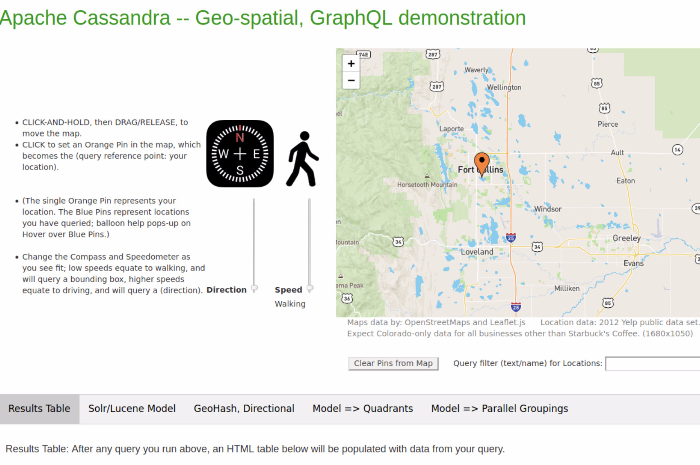

| **[Monthly Articles - 2022](../../README.md)** | **[Monthly Articles - 2021](../../2021/README.md)** | **[Monthly Articles - 2020](../../2020/README.md)** | **[Monthly Articles - 2019](../../2019/README.md)** | **[Monthly Articles - 2018](../../2018/README.md)** | **[Monthly Articles - 2017](../../2017/README.md)** | **[Data Downloads](../../downloads/README.md)** |
|-------------------------|-------------------------|-------------------------|-------------------------|-------------------------|-------------------------|-------------------------|

[Back to 2020 archive](../README.md)
[Download original PDF](../DDN_2020_46_BetterVersOf42.pdf)

---

# DDN 2020 46 BetterVersOf42

## Chapter 46. October 2020

DataStax Developer’s Notebook -- October 2020 V1.2

Welcome to the October 2020 edition of DataStax Developer’s Notebook (DDN). This month we answer the following question(s); I love the GraphQL, Python/Flask, OpenStreetView, geo-spatial discussion this series has had of late. I’m having trouble putting it all together. Any chance you can put it all in one deliverable. Can you help ? Excellent question ! In this article, we assemble all of the pieces we’ve recently discussed, putting them all in one coordinated deliverable. We’ll detail the data format, start up scripts, the program proper, and even any HTML related to OpenStreetView. (Eg., not Google Maps.)

## Software versions

The primary DataStax software component used in this edition of DDN is DataStax Enterprise (DSE), currently release 6.8.5, or DataStax Astra (Apache Cassandra version 4.0.0.682), as required. All of the steps outlined below can be run on one laptop with 16 GB of RAM, or if you prefer, run these steps on Amazon Web Services (AWS), Microsoft Azure, or similar, to allow yourself a bit more resource.

For isolation and (simplicity), we develop and test all systems inside virtual machines using a hypervisor (Oracle Virtual Box, VMWare Fusion version 8.5, or similar). The guest operating system we use is Ubuntu Desktop version 18.04, 64 bit.

DataStax Developer’s Notebook -- October 2020 V1.2

## 46.1 Terms and core concepts

As stated above, ultimately the end goal is to (tie it all together); a Web form, DataStax Astra, GraphQL, geo-spatial, mapping UI, other. We’ve dived into most of these topics over the past few issues in this document series. Here, we’ll do a code review of all of the relevant pieces.

Example 46-1lists the database schema used in these examples. A code review follows.

### Example 46-1 Our Schema File (our DDL file)

```text
1
2
3
4
5 USE my_keyspace;
6
7
8 DROP TABLE IF EXISTS my_mapdata;
9
10 CREATE TABLE my_mapdata
11 (
12 md_pk TEXT PRIMARY KEY,
13 md_lat TEXT,
14 md_lng TEXT,
15 geo_hash10 TEXT,
16 md_name TEXT,
17 md_address TEXT,
18 md_city TEXT,
19 md_province TEXT,
20 md_postcode TEXT,
21 md_phone TEXT,
22 md_category TEXT,
23 md_subcategory TEXT,
24 //
25 geo_hash5 TEXT,
26 geo_hash6 TEXT,
```

DataStax Developer’s Notebook -- October 2020 V1.2

```text
27 geo_hash7 TEXT,
28 name3 TEXT,
29 name5 TEXT,
30 name7 TEXT
31 );
32
33 CONSISTENCY LOCAL_QUORUM
34
35 COPY my_mapdata
36 (
37 md_pk ,
38 md_lat ,
39 md_lng ,
40 geo_hash10 ,
41 md_name ,
42 md_address ,
43 md_city ,
44 md_province ,
45 md_postcode ,
46 md_phone ,
47 md_category ,
48 md_subcategory ,
49 geo_hash5 ,
50 geo_hash6 ,
51 geo_hash7 ,
52 name3 ,
53 name5 ,
54 name7
55 )
56 FROM '26_mapData_CO.pipe'
57 WITH HEADER = TRUE
58 AND DELIMITER = '|'
59 AND MAXBATCHSIZE = 20
60 AND INGESTRATE = 100;
```

DataStax Developer’s Notebook -- October 2020 V1.2

```text
61
62 CREATE CUSTOM INDEX geo_hash5_idx
63 ON my_mapdata
64 (
65 geo_hash5
66 )
67 USING 'StorageAttachedIndex'
68 WITH OPTIONS = { 'case_sensitive': true, 'normalize':
false };
69 //
70 CREATE CUSTOM INDEX geo_hash6_idx
71 ON my_mapdata
72 (
73 geo_hash6
74 )
75 USING 'StorageAttachedIndex'
76 WITH OPTIONS = { 'case_sensitive': true, 'normalize':
false };
77 //
78 CREATE CUSTOM INDEX geo_hash7_idx
79 ON my_mapdata
80 (
81 geo_hash7
82 )
83 USING 'StorageAttachedIndex'
84 WITH OPTIONS = { 'case_sensitive': true, 'normalize':
false };
85
86 CREATE CUSTOM INDEX name3_idx
87 ON my_mapdata
88 (
89 name3
90 )
91 USING 'StorageAttachedIndex'
```

DataStax Developer’s Notebook -- October 2020 V1.2

```text
92 WITH OPTIONS = { 'case_sensitive': false, 'normalize':
true };
93 //
94 CREATE CUSTOM INDEX name5_idx
95 ON my_mapdata
96 (
97 name5
98 )
99 USING 'StorageAttachedIndex'
100 WITH OPTIONS = { 'case_sensitive': false, 'normalize':
true };
101 //
102 CREATE CUSTOM INDEX name7_idx
103 ON my_mapdata
104 (
105 name7
106 )
107 USING 'StorageAttachedIndex'
108 WITH OPTIONS = { 'case_sensitive': false, 'normalize':
true };
109
110
111
112
```

Relative to Example 46-1, the following is offered:

- In this and all of the examples that follow, disregard the line numbers that precede (each line).

- The single table in play is titled, “my_mapdata”.

- For ease of use, we use the CQLSL command shell command titled, “COPY”. If we are using the free tier of DataStax Astra, we limits the ingest rate to 100 rows per second.

- Several indexes, all TEXT;

DataStax Developer’s Notebook -- October 2020 V1.2

We achieve the geo-spatial function of this Web application be encoding (storing) data that is geo-encoded, then performing indexed lookups on equalities.

Example 46-2 details how to run the DDL file from above. A code review follows.

### Example 46-2 Running/installing our schema file.

```text
1
2
3
4
5 echo ""
6 echo "247887 rows, 100/rows/sec, .. .. equals 45 minutes or
so"
7 echo ""
8 echo ""
9
10 cqlsh -u my_user -p my_password -b
secure-connect-my-database.zip -f 31*
11
12
```

Relative to Example 46-2, the following is offered:

- We use the CQLSH command interface to file our previously listed CQL DDL file.

- “-u” and “-p” are for user name and password.

- We also add use of the “secure connection bundle”, which is downloadable from DataStax Astra.

Example 46-3 displays a stand alone, Python, DataStax Astra query client, using GraphQL. A code review follows.

### Example 46-3 Stand alone, Python, GraphQL (test) program

```text
1
2
3 # pip install gql
```

DataStax Developer’s Notebook -- October 2020 V1.2

```text
4
5
6
##############################################################
7
8
9 import requests
10 import json
11 import time
12 #
13 from gql import gql, Client
14 from gql.transport.requests import RequestsHTTPTransport
15
16 import libgeohash as gh
17
18 import urllib3
19 # This line suppresses the Https warnings-
20 #
21
urllib3.disable_warnings(urllib3.exceptions.InsecureRequestWarni
ng)
22
23
24
##############################################################
25
26
27 ASTRA_CLUSTER_ID =
"275553d2-XXXXXXXXXXXXXXXXXXX11378eac"
28 ASTRA_CLUSTER_REGION = "us-east1"
29 ASTRA_DB_USERNAME = "my_user"
30 ASTRA_DB_PASSWORD = "my_passwordXXX"
31
32 ASTRA_KEYSPACE = "my_keyspace"
```

DataStax Developer’s Notebook -- October 2020 V1.2

```text
33 ASTRA_TABLE = "my_mapdata"
34
35 ASTRA_MAXRETRIES = 10
36
37
38
##############################################################
39
40
41 # Get Auth Token
42
43 l_url1 = "https://" + ASTRA_CLUSTER_ID + "-" +
ASTRA_CLUSTER_REGION + \
44 ".apps.astra.datastax.com/api/rest/v1/auth"
45 #
46 l_data1 = '{"username":"' + ASTRA_DB_USERNAME + '",
"password":"' + ASTRA_DB_PASSWORD + '"}'
47
48
49 for _ in range(ASTRA_MAXRETRIES):
50 try:
51 response = requests.post(l_url1,
data=l_data1,headers={"Content-Type": "application/json"})
52 except:
53 # Astra free tier, we get the occasional time outs
54 #
55 time.sleep(0.25)
56 print "NOTICE: Bump 1"
57 continue
58 else:
59 break
60 else:
61 print ""
62 print ""
```

DataStax Developer’s Notebook -- October 2020 V1.2

```text
63 print "ERROR: Failed to connect with Astra instance"
64 print ""
65 print ""
66 exit(3)
67
68 my_authToken = response.json()['authToken']
69
70
71
##############################################################
72
73
74 # Query via GraphQL
75
76
77 url3 = "https://" + ASTRA_CLUSTER_ID + "-" +
ASTRA_CLUSTER_REGION + \
78 ".apps.astra.datastax.com/api/graphql"
79
80 sample_transport=RequestsHTTPTransport(
81 url=url3,
82 use_json=True,
83 headers={
84 "Content-type": "application/json",
85 "X-Cassandra-Token": my_authToken,
86 },
87 verify=False,
88 retries=3,
89 )
90
91 client = Client(
92 transport=sample_transport,
93 fetch_schema_from_transport=True,
94 )
```

DataStax Developer’s Notebook -- October 2020 V1.2

```text
95
96
##############################################################
97
##############################################################
98
99
100 # In my real program, this was a much larger/complex query
101 #
102
103 l_queryString = '''
104 query {
105
106 Q1 : myMapdata(value: { name3: "sta" }, options: {limit:
1} )
107 { values { mdName } }
108
109 Q2 : myMapdata(value: { name3: "nai" }, options: {limit:
1} )
110 { values { mdName } }
111
112 }
113 '''
114
115 l_queryString = gql(l_queryString)
116
117 for _ in range(ASTRA_MAXRETRIES):
118 try:
119 l_result = client.execute(l_queryString)
120 except:
121 # Astra free tier, we get the occasional time outs
122 #
123 time.sleep(0.25)
124 print "NOTICE: Bump 2"
```

DataStax Developer’s Notebook -- October 2020 V1.2

```text
125 continue
126 else:
127 break
128 else:
129 print ""
130 print ""
131 print "ERROR: Failed to connect with Astra instance"
132 print ""
133 print ""
134 exit(4)
135
136 print l_result
137
138
```

Relative to Example 46-3, the following is offered:

- This is a stand alone program; connecting to DataStax Astra, querying using GraphQL.

- This program serves geo-spatial data. We use the standard Python package titled, “libgeohash”, for encoding and decoding.

- This program queries DataStax Astra uses GraphQL. We use the “gql” Python library for this.

- Because DataStax Astra communicates uses Https, and we didn't wish to spend time to set this up, line 21 calls to disable the numerous Https/Http exception warnings we’d normally receive.

- Lines 41 through 68 get an “Authorization Token” from DataStax Astra, using Http REST. We are using the free tier of DataStax Astra, which presents the occasional service request time out error. As such, we loop, and execute the call to receive a token inside a try/except block. If we receive a timeout here, we print “Bump 1” to the terminal window.

- Lines 74 through 95 effectively declare variables used when querying. Nothing here can really fail; these are just variable sets/declarations.

- Lines 100 through 136 run our query proper. As before, we call DataStax Astra using a loop with a try/except block. If we time out, we print “Bump 2” to the terminal window.

DataStax Developer’s Notebook -- October 2020 V1.2

- Lines 103 begins definition of our GraphQL query string.

Example 46-4 presents the entire Python Web application server program. A code review follows.

### Example 46-4 Server program, thin Web client, Python, GraphQL

```text
1
2
3 # Single page Web application written in Python. Displays
geo-
4 # spatial and GraphQL using Astra/C*.
5 #
6 # . Web page will serve at localhost:8082
7 #
8 # There are instructions on this Web page, How this
program
9 # functions.
10 #
11 # . Data comes from Astra/C*. the 'secure connect bundle'
12 # needs to be in the current working directory.
13 #
14 # Also, a number of usernames, other, are hard coded
15 # into this file.
16
17
18
#############################################################
19 ## Imports
##################################################
20
21
22 # Flask is our Python based Web server.
23 #
24 from flask import Flask, render_template, request, jsonify
25
```

DataStax Developer’s Notebook -- October 2020 V1.2

```text
26 # This import allows us to use a directory other than the
27 # default for Flask CSS files and related.
28 #
29 import os
30
31 # Geohash library
32 #
33 import libgeohash as gh
34
35 # Ability to execute queries using GraphQL
36 # pip install gql
37 #
38 import requests
39 import json
40 import urllib3
41 import time
42 #
43 from gql import gql, Client
44 from gql.transport.requests import RequestsHTTPTransport
45
46
urllib3.disable_warnings(urllib3.exceptions.InsecureRequestWarni
ng)
47
48
49
#############################################################
50
#############################################################
51
52
53 # Constants used to connect with database server; Astra/C*
54 #
55
```

DataStax Developer’s Notebook -- October 2020 V1.2

```text
56 ASTRA_CLUSTER_ID =
"275553d2-46XXXXXXXXXXXXXXXXXXXXX8eac"
57 ASTRA_CLUSTER_REGION = "us-east1"
58 ASTRA_DB_USERNAME = "my_user"
59 ASTRA_DB_PASSWORD = "my_passwordXXXXX"
60
61 ASTRA_KEYSPACE = "my_keyspace"
62 ASTRA_TABLE = "my_mapdata"
63
64 ASTRA_MAXRETRIES = 10
65
66
67
#############################################################
68
#############################################################
69
70
71 # Get Authorization Token to be able to speak to Astra/C*
72 #
73
74 l_url1 = "https://" + ASTRA_CLUSTER_ID + "-" +
ASTRA_CLUSTER_REGION + \
75 ".apps.astra.datastax.com/api/rest/v1/auth"
76 #
77 l_data1 = '{"username":"' + ASTRA_DB_USERNAME + '", \
78 "password":"' + ASTRA_DB_PASSWORD + '"}'
79
80 for _ in range(ASTRA_MAXRETRIES):
81 try:
82 response = requests.post(l_url1, data=l_data1,headers=
83 {"Content-Type": "application/json"})
84 except:
85 # Astra free tier, we get the occasional time outs
```

DataStax Developer’s Notebook -- October 2020 V1.2

```text
86 #
87 time.sleep(0.25)
88 print "NOTICE: Bump 1"
89 continue
90 else:
91 break
92 else:
93 print ""
94 print ""
95 print "ERROR (7442): Failed to connect with Astra
instance."
96 print ""
97 print ""
98 exit(3)
99
100 my_authToken = response.json()['authToken']
101 #
102 print "INFO: Got Authorization Token, " + my_authToken
103
104
105
#############################################################
106
#############################################################
107
108
109 # Connection handle, Query below via GraphQL
110 #
111
112 l_url3 = "https://" + ASTRA_CLUSTER_ID + "-" +
ASTRA_CLUSTER_REGION + \
113 ".apps.astra.datastax.com/api/graphql"
114
115 l_transport=RequestsHTTPTransport(
```

DataStax Developer’s Notebook -- October 2020 V1.2

```text
116 url=l_url3,
117 use_json=True,
118 headers={
119 "Content-type": "application/json",
120 "X-Cassandra-Token": my_authToken,
121 },
122 verify=False,
123 retries=3,
124 )
125
126 m_client = Client(
127 transport=l_transport,
128 fetch_schema_from_transport=True,
129 )
130
131
132
#############################################################
133 ## Inits, Opens, and Sets
###################################
134
135
136 # Instantiate Flask object
137 #
138 m_app = Flask(__name__)
139
140
141 # Set flask defaults for locating files
142 #
143 m_templateDir = os.path.abspath("45_views" )
144 m_staticDir = os.path.abspath("44_static")
145 #
146 m_app.template_folder = m_templateDir
147 m_app.static_folder = m_staticDir
```

DataStax Developer’s Notebook -- October 2020 V1.2

```text
148
149
150
#############################################################
151 ## Our Web pages (page handlers)
############################
152
153
154 #
155 # This is our main page.
156 #
157 # This ia a single page Web app; after this page loads,
158 # everything else is just data/AJAX.
159 #
160 @m_app.route('/')
161 def do_servePage():
162 return render_template("60_Index.html")
163
164
165 ###############################################
166
167
168 # This is our query response (page)
169 #
170
171 @m_app.route('/_do_query')
172 def do_query():
173
174 l_lat = request.args.get('h_lat' )
175 l_lng = request.args.get('h_lng' )
176 l_textFilter = request.args.get('h_textFilter' )
177 #
178 l_latLng = gh.encode(float(l_lat), float(l_lng),
precision=5)
```

DataStax Developer’s Notebook -- October 2020 V1.2

```text
179 #
180 print ""
181 print "INFO: Query using (geohash5), " + l_latLng
182 print ""
183
184 l_markers = query_function(l_latLng, l_textFilter)
185 #
186 return jsonify(l_markers)
187
188
189 ###############################################
190
191
192 # sample output from gh.neighbors(),
193 #
194 # {'e': '9xj3v', 'sw': '9xj3e', 'ne': '9xj6j', 'n':
'9xj6h',
195 # 's': '9xj3s', 'w': '9xj3g', 'se': '9xj3t', 'nw':
'9xj65'}
196 #
197
198 def query_function(i_latLng, i_textFilter):
199 global m_client
200
201
202 # 'C0' is our center point, where we query from
203 #
204 # This is also the data set displayed when walking
205 #
206 l_loca_C0 = i_latLng
207
208 # 'neighbors1' are the first set of points just past our
209 # center, the first ring, if you will
210 #
```

DataStax Developer’s Notebook -- October 2020 V1.2

```text
211 # This is also the data set displayed when driving slow
212 #
213 l_neighbors1 = gh.neighbors(l_loca_C0)
214
215 # And anything (2) are our second ring of points, just
216 # past our first ring. Generally displayed when driving
217 # fast.
218 #
219 l_N2 = gh.neighbors(l_neighbors1['n' ])['n' ]
220 l_E2 = gh.neighbors(l_neighbors1['e' ])['e' ]
221 l_S2 = gh.neighbors(l_neighbors1['s' ])['s' ]
222 l_W2 = gh.neighbors(l_neighbors1['w' ])['w' ]
223 #
224 l_NE2 = gh.neighbors(l_neighbors1['ne'])['ne']
225 l_SE2 = gh.neighbors(l_neighbors1['se'])['se']
226 l_SW2 = gh.neighbors(l_neighbors1['sw'])['sw']
227 l_NW2 = gh.neighbors(l_neighbors1['nw'])['nw']
228
229 # Building our query string when a name is specified for
230 # a business.
231 #
232 if (len(i_textFilter) >= 7):
233 l_textFilter = ', name7: "' + i_textFilter[:7] + '"'
234 elif (len(i_textFilter) >= 5):
235 l_textFilter = ', name5: "' + i_textFilter[:5] + '"'
236 elif (len(i_textFilter) >= 3):
237 l_textFilter = ', name3: "' + i_textFilter[:3] + '"'
238 else:
239 l_textFilter = ' '
240 #
241 print len(l_textFilter)
242 print "INFO: Text Filter, " + l_textFilter
243
244 # The column list we return from query
```

DataStax Developer’s Notebook -- October 2020 V1.2

```text
245 #
246 l_columnList = " mdLat mdLng mdName mdAddress mdCity
mdProvince mdPhone mdSubcategory "
247
248
249 # Building the final query string; GraphQL query strings
can get long
250 #
251 l_queryString = '''
252 query {{
253
254 C0 : myMapdata(value: {{ geoHash5: "{0}" {17} }} )
{{ values {{ {18} }} }}
255
256 N1 : myMapdata(value: {{ geoHash5: "{1}" {17} }} )
{{ values {{ {18} }} }}
257 E1 : myMapdata(value: {{ geoHash5: "{2}" {17} }} )
{{ values {{ {18} }} }}
258 S1 : myMapdata(value: {{ geoHash5: "{3}" {17} }} )
{{ values {{ {18} }} }}
259 W1 : myMapdata(value: {{ geoHash5: "{4}" {17} }} )
{{ values {{ {18} }} }}
260
261 NE1 : myMapdata(value: {{ geoHash5: "{5}" {17} }} )
{{ values {{ {18} }} }}
262 SE1 : myMapdata(value: {{ geoHash5: "{6}" {17} }} )
{{ values {{ {18} }} }}
263 SW1 : myMapdata(value: {{ geoHash5: "{7}" {17} }} )
{{ values {{ {18} }} }}
264 NW1 : myMapdata(value: {{ geoHash5: "{8}" {17} }} )
{{ values {{ {18} }} }}
265
266 N2 : myMapdata(value: {{ geoHash5: "{9}" {17} }} )
{{ values {{ {18} }} }}
```

DataStax Developer’s Notebook -- October 2020 V1.2

```text
267 E2 : myMapdata(value: {{ geoHash5: "{10}" {17} }} )
{{ values {{ {18} }} }}
268 S2 : myMapdata(value: {{ geoHash5: "{11}" {17} }} )
{{ values {{ {18} }} }}
269 W2 : myMapdata(value: {{ geoHash5: "{12}" {17} }} )
{{ values {{ {18} }} }}
270
271 NE2 : myMapdata(value: {{ geoHash5: "{13}" {17} }} )
{{ values {{ {18} }} }}
272 SE2 : myMapdata(value: {{ geoHash5: "{14}" {17} }} )
{{ values {{ {18} }} }}
273 SW2 : myMapdata(value: {{ geoHash5: "{15}" {17} }} )
{{ values {{ {18} }} }}
274 NW2 : myMapdata(value: {{ geoHash5: "{16}" {17} }} )
{{ values {{ {18} }} }}
275
276 }}
277 '''
278 #
279 l_queryString = gql(l_queryString.format(l_loca_C0,
l_neighbors1['n'],
280 l_neighbors1['e'], l_neighbors1['s'],
l_neighbors1['w'],
281 l_neighbors1['ne'], l_neighbors1['se'],
l_neighbors1['sw'],
282 l_neighbors1['nw'], l_N2, l_E2, l_S2, l_W2, l_NE2,
l_SE2,
283 l_SW2, l_NW2, l_textFilter, l_columnList ))
284
285 # Retry fetch loop
286 #
287 for _ in range(ASTRA_MAXRETRIES):
288 try:
289 l_result = m_client.execute(l_queryString)
```

DataStax Developer’s Notebook -- October 2020 V1.2

```text
290 except:
291 # Astra free tier, we get the occasional time outs
292 #
293 time.sleep(0.25)
294 print "NOTICE: Bump 2"
295 continue
296 else:
297 break
298 else:
299 print ""
300 print ""
301 print "ERROR (7443): Failed to connect with Astra
instance."
302 print ""
303 print ""
304 exit(3)
305
306 return l_result
307
308
309
#############################################################
310
#############################################################
311
312
313 #
314 # And then running our Web site proper.
315 #
316 if __name__=='__main__':
317
318 m_app.run(host = "localhost", port = int("8082"),
debug=True)
319
```

DataStax Developer’s Notebook -- October 2020 V1.2

```text
320
321
322
323
#############################################################
324
#############################################################
325
326
```

Relative to Example 46-4, the following is offered:

- The ‘guts’ of this program do not differ much from the (stand alone) program detailed above. Any new code is really to operate the single page Web application.

- Nothing prior to line 130 should present itself as new.

- Lines 136 through 149 set values specific to Python/Flask, our Web server; the location of HTML, CSS, and JavaScript files.

- Lines 160 through 162 serve our (index.html) page.

- Lines 168 through 308 form our query listener, and most of this is data. • Lines 174 through 176, we retrieve our query parameters. • h_textFilter is an optional (business name) to query, add as a query predicate. • query_function() acts as our DAO. • Sample output from the GraphQL query is listed on line 194, so you have a sense of what we’ll send to the client; what we need to parse there. • So, we query a radius to a central point; our location on the map, which we label C0. And we query neighbors; the 8 points on a compass, which we label, E, W, N, and so on. And, we query neighbors to those 8 points, which we label, E2, W2, N2, and so on. • Line 232 and thereabouts is checking to see is we did in fact receive a business name to also query predicate on. • Line 251 and beyond build our GraphQL query string; effectively, querying compass points and their neighbors, is similar to running a 20 way SQL UNION query.

DataStax Developer’s Notebook -- October 2020 V1.2

• And line 287 begins out fetch loop; same as before.

- Line 316 launches our Web application listener.

Figure 46-1displays an image of the Web application we are detailing. After this image, we offer the HTML source listing. A code review follows.



*Figure 46-1 Image of the Web application*

Example 46-5 lists the HTML to our Web application. A code review follows.

### Example 46-5 HTML Listing for our Web application

```text
1
2
3 <!--
-----------------------------------------------------------
4
----------------------------------------------------------------
5
6
7 DataStax Astra; Geo-hash. GraphQL demonstration program.
8
```

DataStax Developer’s Notebook -- October 2020 V1.2

```text
9
10
----------------------------------------------------------------
11 ---- -------------------------------------------------------
-->
12
13
14 <!DOCTYPE html>
15 <html>
16
17
18 <!-- -------------------------------------------------------
-->
19 <!-- -------------------------------------------------------
-->
20 <!-- -------------------------------------------------------
-->
21 <!-- -------------------------------------------------------
-->
22
23
24 <head>
25
26 <meta charset="utf-8" />
27 <meta name="viewport" content="width=device-width,
initial-scale=1.0">
28
29 <!--
30 This block required for jQuery, which gives us Ajax
support.
31 -->
32 <script src="{{ url_for('static',
filename='10_jquery.min.js' ) }}">
33 </script>
```

DataStax Developer’s Notebook -- October 2020 V1.2

```text
34 <link rel="stylesheet" type="text/css"
35 href="{{ url_for('static',
filename='11_bootstrap.min.css') }}">
36
37 <!--
38 This block required for the TABbed DIVs.
39 -->
40 <link rel="stylesheet" type="text/css"
41 href="{{ url_for('static',
filename='20_TABbedMenu.css') }}">
42 <script src="{{ url_for('static',
filename='21_TABbedMenu.js') }}">
43 </script>
44
45 <!--
46 This block required for Leaflet, which give us our maps.
47 -->
48 <link rel="stylesheet" type="text/css"
49 href="{{ url_for('static', filename='24_leaflet.css')
}}">
50 <script src="{{ url_for('static',
filename='25_leaflet.js') }}">
51 </script>
52
53 <!--
54 Used for the vertical sliders.
55 -->
56 <style>
57 input.vertical {
58 -webkit-appearance: slider-vertical;
59 writing-mode: bt-lr;
60 }
61 </style>
62
```

DataStax Developer’s Notebook -- October 2020 V1.2

```text
63 </head>
64
65
66 <!-- -------------------------------------------------------
-->
67 <!-- -------------------------------------------------------
-->
68 <!-- -------------------------------------------------------
-->
69 <!-- -------------------------------------------------------
-->
70
71
72 <body>
73
74 <br>
75 <h1>
76 <span style="color:#009900">
77 Apache Cassandra -- Geo-spatial, GraphQL demonstration
78 </span>
79 </h1>
80 <br>
81
82 <table border=0>
83 <tr>
84 <td style="width:600px">
85 <table border=0>
86
87 <td>
88 <!--
--------------------------------------------------------
89 Instructions; How to use this form.
90
--------------------------------------------------------- -->
```

DataStax Developer’s Notebook -- October 2020 V1.2

```text
91 <ul>
92 <li>
93 CLICK-AND-HOLD, then DRAG/RELEASE, to
move the map.
94 </li>
95 <li>
96 CLICK to set an Orange Pin in the map,
which becomes the
97 (query reference point: your location).
98 </li>
99 <br>
100 <br>
101 <li>
102 (The single Orange Pin represents your
location. The Blue
103 Pins represent locations you have
queried; balloon help
104 pops-up on Hover over Blue Pins.)
105 </li>
106 <br>
107 <li>
108 Change the Compass and Speedometer as
you see fit; low
109 speeds equate to walking, and will query
a bounding box,
110 higher speeds equate to driving, and will
query a (direction).
111 </li>
112 </ul>
113 </td>
114
115 <td>
116 <!--
--------------------------------------------------------
```

DataStax Developer’s Notebook -- October 2020 V1.2

```text
117 Visual control for direction
118
--------------------------------------------------------- -->
119 
121 <br>
122 <br>
123 <label
for="slider_compass">Direction</label>
124 <input type="range" min="0" max="360"
value="0" step="45" id="slider_compass"
125 class="vertical" orient="vertical"
oninput="f_updateCompass(value)"
126 list="slider_compass_settings"
onchange="f_onChange1()">
127 <datalist id="slider_compass_settings">
128 <option>0</option>
129 <option>45</option>
130 <option>90</option>
131 <option>135</option>
132 <option>180</option>
133 <option>225</option>
134 <option>270</option>
135 <option>315</option>
136 <option>360</option>
137 </datalist>
138
139 <script>
140 function f_updateCompass(heading) {
141 if (heading == 0 || heading ==360) {
142
document.querySelector('#img_compass').src =
143 "{{ url_for('static',
```

DataStax Developer’s Notebook -- October 2020 V1.2

```text
filename='./images/compass_0.png') }}";
144 } else if (heading == 45) {
145
document.querySelector('#img_compass').src =
146 "{{ url_for('static',
filename='./images/compass_45.png') }}";
147 } else if (heading == 90) {
148
document.querySelector('#img_compass').src =
149 "{{ url_for('static',
filename='./images/compass_90.png') }}";
150 } else if (heading == 135) {
151
document.querySelector('#img_compass').src =
152 "{{ url_for('static',
filename='./images/compass_135.png') }}";
153 } else if (heading == 180) {
154
document.querySelector('#img_compass').src =
155 "{{ url_for('static',
filename='./images/compass_180.png') }}";
156 } else if (heading == 225) {
157
document.querySelector('#img_compass').src =
158 "{{ url_for('static',
filename='./images/compass_225.png') }}";
159 } else if (heading == 270) {
160
document.querySelector('#img_compass').src =
161 "{{ url_for('static',
filename='./images/compass_270.png') }}";
162 } else {
163
document.querySelector('#img_compass').src =
```

DataStax Developer’s Notebook -- October 2020 V1.2

```text
164 "{{ url_for('static',
filename='./images/compass_315.png') }}";
165 }
166 }
167 </script>
168 </td>
169
170 <td>
171 <!--
--------------------------------------------------------
172 Visual control for speed
173
--------------------------------------------------------- -->
174 <br>
175 <br>
176 
178 <br>
179 <br>
180 <label for="slider_speed">Speed</label>
181 <input type="range" min="0" max="80"
value="0" id="slider_speed"
182 step="10" oninput="f_updateSpeed(value)"
onchange="f_onChange1()"
183 class="vertical" orient="vertical"
list="slider_speed_settings">
184 <output for="slider_speed"
id="output_speed_gauge">Walking</output>
185 <datalist id="slider_speed_settings">
186 <option>0</option>
187 <option>10</option>
188 <option>20</option>
```

DataStax Developer’s Notebook -- October 2020 V1.2

```text
189 <option>30</option>
190 <option>40</option>
191 <option>50</option>
192 <option>60</option>
193 <option>70</option>
194 <option>80</option>
195 </datalist>
196
197 <script>
198 function f_updateSpeed(speed) {
199 if (speed < 10) {
200
document.querySelector('#output_speed_gauge').value = "Walking";
201 //
202
document.querySelector('#img_speed').src =
203 "{{ url_for('static',
filename='./images/person.png') }}";
204 } else if (speed < 40) {
205
document.querySelector('#output_speed_gauge').value = "Driving
Slow - " + speed;
206 //
207
document.querySelector('#img_speed').src =
208 "{{ url_for('static',
filename='./images/jeep.png') }}";
209 } else {
210
document.querySelector('#output_speed_gauge').value = "Driving
Fast - " + speed;
211 //
212
document.querySelector('#img_speed').src =
```

DataStax Developer’s Notebook -- October 2020 V1.2

```text
213 "{{ url_for('static',
filename='./images/jeep.png') }}";
214 }
215 }
216 </script>
217 </td>
218
219 </table>
220 </td>
221 <td>
222 <!--
--------------------------------------------------------
223 div for the map proper
224
--------------------------------------------------------- -->
225 <div id="div_map" style="width: 720px; height:
480px;"></div>
226 </div>
227 <p style="color:gray">
228 Maps data by: OpenStreetMaps and Leaflet.js
229 &nbsp&nbsp&nbsp&nbsp
230 Location data: 2012 Yelp public data set.
231 <br>
232 Expect Colorado-only data for all businesses
other than Starbuck's Coffee. (1680x1050)
233 </p>
234 <br>
235 &nbsp&nbsp&nbsp&nbsp
236 <input onclick="f_clearDataPins();" type=button
value="Clear Pins from Map">
237 &nbsp&nbsp&nbsp&nbsp
238 Query filter (text/name) for Locations:
239 <input type="text" id="it_textFilter" size="32"
240 onchange="f_onChange2()">
```

DataStax Developer’s Notebook -- October 2020 V1.2

```text
241 </td>
242 </tr>
243 </table>
244
245
246 <!--
--------------------------------------------------------
247 Script that runs the map
248 ---------------------------------------------------------
-->
249
250 <script>
251
252 var l_mymap = L.map('div_map').setView([40.5259,
-104.9263], 10);
253
254 // l_pinsRefArr[] keeps the blue pins we return and
render from
255 // queries; effecitvely, the (stores) you are looking
for.
256 //
257 // l_locaPin is our reference point/location; where we
are standing
258 // or where our car currently currently sits.
259 //
260 // l_response is whatever answer we got from the
server.
261 //
262 var l_pinsRefArr = [];
263 var l_locaPin = null;
264 var l_response;
265
266 // ///////////////////////////////////////////
267
```

DataStax Developer’s Notebook -- October 2020 V1.2

```text
268
L.tileLayer('https://api.mapbox.com/styles/v1/{id}/tiles/{z}/{x}
/{y}?access_token={access_token}', {
269 maxZoom: 18,
270 id: 'mapbox/streets-v11',
271 access_token:
'pk.eyJ1IjoibWFwYm94IiwXXXXXXXXXXXXXXXXXXXXXXXXXXXXXXXXXXXXXXXXX
XXXXJcFIG214AriISLbB6B5aw',
272 tileSize: 512,
273 zoomOffset: -1
274 }).addTo(l_mymap);
275
276 var PinIcon = L.Icon.extend({
277 options: {
278 iconAnchor: [0, 0],
279 iconSize: [30, 50]
280 }
281 });
282 //
283 var bluePin = new PinIcon({iconUrl: "{{
url_for('static', filename= './images/blue_pin.png') }}" }),
284 orangePin = new PinIcon({iconUrl: "{{
url_for('static', filename= './images/orange_pin.png') }}" });
285
286 // Passing an array, obviously.
287 //
288 // This invocation sets the 'current location' pin, as
we start the program.
289 //
290 f_setLocaPin([40.585258, -105.084419]);
291
292 // ///////////////////////////////////////////
293
294 // 'e' is an event object, with properties for
```

DataStax Developer’s Notebook -- October 2020 V1.2

```text
295 // e.latlng, of type LatLng
296 // e.latlng.lat and
297 // e.latlng.lng of type float
298 //
299 // marker() below will overload, but we always send
an array for debugging
300 //
301 l_mymap.on('click', function(e){
302 f_setLocaPin([e.latlng.lat, e.latlng.lng]);
303 f_runQuery(e.latlng.lat, e.latlng.lng,
304 document.querySelector('#it_textFilter').value);
305 });
306 // Sets our 'current location' pin
307 //
308 function f_setLocaPin(e) {
309 if (l_locaPin !== null) {
310 l_locaPin.remove();
311 }
312 var txt = ("<b>This is your current
location.</b><br>" +
313 "CLICK anywhere else to change your current
location.");
314 l_locaPin = L.marker(e, {icon: orangePin})
315 .bindPopup(txt)
316 .addTo(l_mymap);
317 }
318
319 // ///////////////////////////////////////////
320
321 // Sets all other pins, effectively; our data pins for
the businesses
322 // we return from query
323 //
324 function f_setDataPin(e, txt) {
```

DataStax Developer’s Notebook -- October 2020 V1.2

```text
325 // var strx = e.latlng;
326 // var l_pin = L.marker([strx.lat, strx.lng], {icon:
bluePin}).addTo(l_mymap);
327 var l_pin = L.marker(e, {icon:
bluePin}).addTo(l_mymap);
328 //
329 var l_pin_popup;
330 //
331 l_pin.on('mouseover', function(e) {
332 l_pin_popup = L.popup({ offset: L.point(0,0)});
333 l_pin_popup.setContent(txt);
334 l_pin_popup.setLatLng(e.target.getLatLng());
335 l_pin_popup.openOn(l_mymap);
336 });
337 l_pin.on('mouseout', function(e) {
338 l_mymap.closePopup(l_pin_popup);
339 });
340 //
341 l_pinsRefArr.push(l_pin);
342 }
343
344 // Erase all of the data pins from the map
345 //
346 function f_clearDataPins() {
347 for (var i = 0; i < l_pinsRefArr.length; i++) {
348 l_pinsRefArr[i].remove();
349 }
350 l_pinsRefArr = [];
351 }
352
353 // ///////////////////////////////////////////
354
355 // AJAX function, calls to server to get businesses
close to our
```

DataStax Developer’s Notebook -- October 2020 V1.2

```text
356 // current location
357 //
358 function f_runQuery(i_lat, i_lng, i_textFilter) {
359 $.getJSON(
360 "/_do_query",
361 {
362 h_lat : i_lat ,
363 h_lng : i_lng ,
364 h_textFilter : i_textFilter
365 },
366 function(r_response) {
367 // To just see what is returned,
368 ///
369 // var l_txt1 = JSON.stringify(r_response);
370 // alert(l_txt1);
371
372 l_response = r_response;
373 //
374 f_onChange1();
375 }
376 );
377 };
378
379 // ///////////////////////////////////////////
380
381 // Because we change what is displayed based on
multiple events,
382 // put this in a separate function.
383 //
384 function f_onChange1() {
385
386 f_clearDataPins();
387
388 l_currentSpeed =
```

DataStax Developer’s Notebook -- October 2020 V1.2

```text
document.querySelector('#slider_speed' ).value
389 l_currentCompass =
document.querySelector('#slider_compass').value
390 //
391 if (l_currentSpeed < 10) {
392 l_idx1 = "C0";
393 } else if (l_currentSpeed < 40) {
394 if (l_currentCompass == 0 || l_currentCompass ==
360) {
395 l_idx1 = "N1";
396 } else if (l_currentCompass == 45 ) {
397 l_idx1 = "NE1";
398 } else if (l_currentCompass == 90 ) {
399 l_idx1 = "E1";
400 } else if (l_currentCompass == 135) {
401 l_idx1 = "SE1";
402 } else if (l_currentCompass == 180) {
403 l_idx1 = "S1";
404 } else if (l_currentCompass == 225) {
405 l_idx1 = "SW1";
406 } else if (l_currentCompass == 270) {
407 l_idx1 = "W1";
408 } else {
409 l_idx1 = "NW1";
410 }
411 } else {
412 if (l_currentCompass == 0 || l_currentCompass ==
360) {
413 l_idx1 = "N2";
414 } else if (l_currentCompass == 45 ) {
415 l_idx1 = "NE2";
416 } else if (l_currentCompass == 90 ) {
417 l_idx1 = "E2";
418 } else if (l_currentCompass == 135) {
```

DataStax Developer’s Notebook -- October 2020 V1.2

```text
419 l_idx1 = "SE2";
420 } else if (l_currentCompass == 180) {
421 l_idx1 = "S2";
422 } else if (l_currentCompass == 225) {
423 l_idx1 = "SW2";
424 } else if (l_currentCompass == 270) {
425 l_idx1 = "W2";
426 } else {
427 l_idx1 = "NW2";
428 }
429 }
430
431 // Format what we send to the HTML table builder
differently
432 //
433 var l_sendToHtmlTable = []
434
435 // Parse thru our query results, build balloon help
text
436 //
437 for (i = 0; i < l_response[l_idx1]["values"].length;
i++) {
438 l_latLng = [
parseFloat(l_response[l_idx1]["values"][i]["mdLat"]),
439
parseFloat(l_response[l_idx1]["values"][i]["mdLng"]) ];
440 //
441 l_name =
l_response[l_idx1]["values"][i]["mdName" ];
442 l_subCat =
l_response[l_idx1]["values"][i]["mdSubcategory"];
443 l_addr =
l_response[l_idx1]["values"][i]["mdAddress" ];
444 l_city =
```

DataStax Developer’s Notebook -- October 2020 V1.2

```text
l_response[l_idx1]["values"][i]["mdCity" ];
445 l_province =
l_response[l_idx1]["values"][i]["mdProvince" ];
446 l_phone =
l_response[l_idx1]["values"][i]["mdPhone" ];
447 //
448 l_ballTxt = "<b>" + l_name + "</b><br>" +
449 l_subCat + "<br>" + l_addr + ", " + l_city +
", " +
450 l_province + "<br><br>" + l_phone;
451 //
452 f_setDataPin(l_latLng, l_ballTxt);
453 //
454 l_sendToHtmlTable.push( {h_name: l_name,
h_latLng: l_latLng, h_ballTxt: l_ballTxt} );
455 }
456
457 // Call to render HTML table
458 //
459 f_buildHtmlTable(l_sendToHtmlTable);
460
461 };
462
463 // ///////////////////////////////////////////
464
465 // Called only from the text entry field (filter)
466 //
467 function f_onChange2() {
468
469 f_runQuery(l_locaPin.getLatLng().lat,
l_locaPin.getLatLng().lng,
470
document.querySelector('#it_textFilter').value);
471
```

DataStax Developer’s Notebook -- October 2020 V1.2

```text
472 }
473
474 // ///////////////////////////////////////////
475
476 </script>
477
478
479 <!--
--------------------------------------------------------
480 Start the TABbed divs.
481 ---------------------------------------------------------
-->
482
483 <br>
484 <br>
485
486 <ul class="tab">
487 <li><a href="javascript:void(0)" class="tablinks"
488 onclick="openDiv(event, 'div_1')"
489 id="li_tab1" >Results Table </a></li>
490 <li><a href="javascript:void(0)" class="tablinks"
491 onclick="openDiv(event, 'div_2' )"
492 id="li_tab2" >Solr/Lucene Model </a></li>
493 <li><a href="javascript:void(0)" class="tablinks"
494 onclick="openDiv(event, 'div_3' )"
495 id="li_tab3" >GeoHash, Directional </a></li>
496 <li><a href="javascript:void(0)" class="tablinks"
497 onclick="openDiv(event, 'div_4' )"
498 id="li_tab4" >Model => Quadrants </a></li>
499 <li><a href="javascript:void(0)" class="tablinks"
500 onclick="openDiv(event, 'div_5' )"
501 id="li_tab5" >Model => Parallel
Groupings</a></li>
502 </ul>
```

DataStax Developer’s Notebook -- October 2020 V1.2

```text
503
504
505 <!-- -- DIV 1 -----------------------------------------
-->
506
507
508 <div id="div_1" class="tabcontent">
509 <br>
510 <h4>
511 Results Table: After any query you run above, an
HTML table
512 below will be populated with data from your query.
513 </h4>
514 <br>
515 <br>
516 <table id="t_queryData" class="tab_table"
cellspacing="0"
517 width="80%" align="center">
518 </table>
519 <br>
520 <br>
521 <br>
522 <br>
523 <br>
524 <br>
525 <br>
526 <br>
527 </div>
528
529 <script>
530
531 function f_buildHtmlTable(i_tableData) {
532 //
533
```

DataStax Developer’s Notebook -- October 2020 V1.2

```text
document.getElementById("t_queryData").deleteTHead() ;
534 document.getElementById("t_queryData").innerHTML =
"";
535 //
536 var l_tabl = document.getElementById("t_queryData");
537 var l_head = l_tabl.createTHead();
538 var l_hrow = l_head.insertRow(0);
539 //
540 var l_cell = l_hrow.insertCell(0);
541 l_cell.innerHTML = "<b>" + "Name" + "</b>";
542 var l_cell = l_hrow.insertCell(1);
543 l_cell.innerHTML = "<b>" + "Location" + "</b>";
544 var l_cell = l_hrow.insertCell(2);
545 l_cell.innerHTML = "<b>" + "Description" + "</b>";
546 //
547 for (i = 0; i < i_tableData.length; i++) {
548 //
549 var l_brow = l_tabl.insertRow(i+1);
550 var l_data = i_tableData[i];
551 //
552 var l_cell = l_brow.insertCell(0);
553 var l_col1 = l_data["h_name"];
554 l_cell.innerHTML = l_col1;
555 //
556 var l_cell = l_brow.insertCell(1);
557 var l_col1 = l_data["h_latLng"];
558 l_cell.innerHTML = l_col1;
559 //
560 var l_cell = l_brow.insertCell(2);
561 var l_col2 = l_data["h_ballTxt"];
562 l_cell.innerHTML = l_col2;
563 }
564 };
565
```

DataStax Developer’s Notebook -- October 2020 V1.2

```text
566 </script>
567
568
569 <!-- -- DIV 2 -----------------------------------------
-->
570
571
572 <div id="div_2" class="tabcontent">
573 <br>
574 <br>
575 
577 <br>
578 <br>
579 <br>
580 <br>
581 </div>
582
583
584 <!-- -- DIV 3 -----------------------------------------
-->
585
586
587 <div id="div_3" class="tabcontent">
588 <br>
589 <br>
590 
592 <br>
593 <br>
594 <br>
595 <br>
```

DataStax Developer’s Notebook -- October 2020 V1.2

```text
596 </div>
597
598
599 <!-- -- DIV 4 -----------------------------------------
-->
600
601
602 <div id="div_4" class="tabcontent">
603 <br>
604 <br>
605 
607 <br>
608 <br>
609 <br>
610 <br>
611 </div>
612
613
614 <!-- -- DIV 5 -----------------------------------------
-->
615
616
617 <div id="div_5" class="tabcontent">
618 <br>
619 <br>
620 
622 <br>
623 <br>
624 <br>
625 <br>
```

DataStax Developer’s Notebook -- October 2020 V1.2

```text
626 </div>
627
628
629 <!-- --------------------------------------------------
-->
630
631
632 <!--
633 This code is for the TABbed divs; makes TAB 1 appear on
page load.
634 -->
635 <script type="text/javascript">
636 document.getElementById("li_tab1" ).click();
637 </script>
638
639
640 <!-- --------------------------------------------------
-->
641
642
643 </body>
644
645
646 </html>
647
648
649
650
```

Relative to Example 46-5, the following is offered:

- We use 4JavaScript libraries; • The first is for JQuery, and support for AJAX; asynchronous (query) calls to the server program.

DataStax Developer’s Notebook -- October 2020 V1.2

• The second is to support TABbed divs, shown on the bottom of our screen. • The third is for our mapping library; LeafLet.js, which uses the OpenStreetMap view library. • And lastly, a library for the vertical sliders we use for compass heading and speed.

- Lines 72 through 116 are end user instructions, printed on the HTML form.

- Line 117 begins the code for our compass; which direction are you walking or driving.

- Line 174 begins the code for our speed; are you walking, driving slow, or driving fast. We use these 2 visual controls to impact our queries; do we show points close to ourself (we are standing and hungry), or do we show points near to ourselves and on a vector (we are driving North, slowly), or do we show points on our vector but much farther away (we are driving fast, give me ‘think’ time to choose a destination).

- Line 225 begins the HTML for our map.

- Line 252 starts the map code proper; JavaScript, calling to have a map, first, then setting and clearing pins later.

- Line 358 calls to get data from the server program, from the Cassandra database. Most of this code is reading the HTMP compass and speed indicator, and sending the correct/expected query predicate values.

- Line 480 starts our TABbed divs, which are mostly informational to the end user.

## 46.2 Complete the following

At this point in this document we have done a code review of all assets.

Experiment with running either the stand alone Python/GraphQL client, or running the Web application proper.

DataStax Developer’s Notebook -- October 2020 V1.2

## 46.3 In this document, we reviewed or created:

This month and in this document we detailed the following:

- How to run GraphQL queries against DataStax Astra, using Python.

- How to use LeafLet.js, and the OpenStreetMaps, open source mapping library.

### Persons who help this month.

Kiyu Gabriel, Dave Bechberger, and Jim Hatcher.

### Additional resources:

Free DataStax Enterprise training courses,

```text
https://academy.datastax.com/courses/
```

Take any class, any time, for free. If you complete every class on DataStax Academy, you will actually have achieved a pretty good mastery of DataStax Enterprise, Apache Spark, Apache Solr, Apache TinkerPop, and even some programming.

This document is located here,

```text
https://github.com/farrell0/DataStax-Developers-Notebook
https://tinyurl.com/ddn3000
```

DataStax Developer’s Notebook -- October 2020 V1.2
