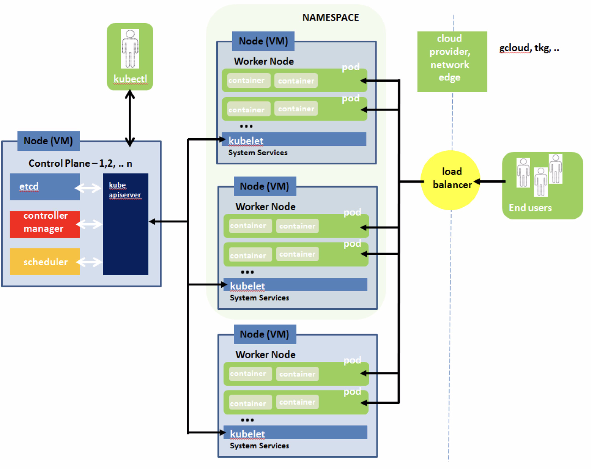

| **[Monthly Articles - 2022](../../README.md)** | **[Monthly Articles - 2021](../../2021/README.md)** | **[Monthly Articles - 2020](../../2020/README.md)** | **[Monthly Articles - 2019](../../2019/README.md)** | **[Monthly Articles - 2018](../../2018/README.md)** | **[Monthly Articles - 2017](../../2017/README.md)** | **[Data Downloads](../../downloads/README.md)** |
|-------------------------|-------------------------|-------------------------|-------------------------|-------------------------|-------------------------|-------------------------|

[Back to 2021 archive](../README.md)
[Download original PDF](../DDN_2021_49_KubernetesPrimer.pdf)

---

# DDN 2021 49 KubernetesPrimer

## Chapter 49. January 2021

DataStax Developer’s Notebook -- January 2021 V1.21

Welcome to the January 2021 edition of DataStax Developer’s Notebook (DDN). This month we answer the following question(s); My company is moving its operations to the cloud, including cloud native computing and Kubernetes. I believe we can run Apache Cassandra on Kubernetes. Can you help ? Excellent question ! Kubernetes, and running Apache Cassandra on Kuberenetes are huge topics. As such, we’ll begin a four part series of articles that cover most of the day one through day seven topics. We wont do a general Kuberentes primer, many other capable Kubernetes primers exist, but will list our favorite resources here and there. This article, one of four, will get Apache Cassandra up and running on Kubernetes. In the remaining articles we cover; recovering from failed Cassandra nodes, Cassandra cluster cloning, and then Kubernetes snapshots in general.

## Software versions

The primary DataStax software component used in this edition of DDN is DataStax Enterprise (DSE), currently release 6.8.*, DataStax Astra (Apache Cassandra version 4.0.0.*), or Kubernetes 1.17/1.18, as required. All of the steps outlined below can be run on one laptop with 16 GB of RAM, or if you prefer, run these steps on Amazon Web Services (AWS), Microsoft Azure, or similar, to allow yourself a bit more resource.

For isolation and (simplicity), we develop and test all systems inside virtual machines using a hypervisor (Oracle Virtual Box, VMWare Fusion version 8.5, or similar). The guest operating system we use is Ubuntu Desktop version 18.04, 64 bit. Or, we’re running on one of the major cloud providers on Kubernetes 1.18.

DataStax Developer’s Notebook -- January 2021 V1.21

## 49.1 Terms and core concepts

As stated above, ultimately the end goal is to run Apache Cassandra on Kubernetes, along with some specific Apache Cassandra day one through day seven operations. Also as stated above, this is article one of four. Comments include;

- In this article, article one, we will get Apache Cassandra running on Kubernetes. We wont do a Kubernetes primer by itself, this topic being covered at length elsewhere. If you do not currently know Kubernetes, we will write this article so that it largely makes sense to beginners, though.

- In article two, we detail what happens when a Cassandra node fails.

- In article three, we will cover Cassandra cluster cloning; a procedure used to accelerate development and quality-assurance efforts.

- And in article four, we will detail a simpler snapshot and recovery discussion; first using just pure Kubernetes objects and techniques.

Why Kubernetes A story told in this series of articles more than once, is of a statewide children’s hospital system that had more computer servers than it had patient beds. Each commercial off the shelf business application they purchased required its own stand alone server, to isolate that application from any other (application) that might interfere with its operation. Moving from (bare metal) to virtual machines (VMs) gave these applications the isolation they wanted, with the benefit of huge savings; fewer physical server maintenance contracts, less cooling, less floor space consumed, less labor to perform backups, and so on. Thus was the allure of ‘virtualization’.

Virtualization though, often led to (snowflakes), as administrators would tweak (repair, other) these virtual machines, to the point we lost track of exactly what was in each of these virtual machines. Virtualization led to virtual machine image sprawl.

Containerization is the response to VM sprawl (and more). Arguably, the leading containerization platform is the Could Native Computing Foundation (CNCF) Kubernetes, container orchestration system. The very earliest (Unix) form of a containers arrived in the form of the chroot(C) command. With (change root), a given Unix/Linux process could have its parent to the root filesystem variably changed, in other words; instead of a given process seeing all 2400 or more folders to the entire operating system, that process could be configured to see only a very few folders. This was an early form of resource governance.

DataStax Developer’s Notebook -- January 2021 V1.21

Consider the following:

- Where a virtual machine (VM) carries a full copy of an operating system, a container is just a single process on an operating system. Where a VM boots in many seconds, a container (boots) in sub-second.

- Where a VM is created through programming (an empirical approach), a container is created via a declarative approach; a YAML file describes what the container should (contain), and how it should operate. Containers are not programmed; they are defined.

- Where you can go in and tweak a VM, containers are immutable. Properly done, the container will shut down and start anew from its original declarative self, should you go in and try to tweak the container.

- Containers arrive with a whole (ecosystem) that defines the means by which containers auto-scale, auto-heal, and more.

- On some level, containers are the version 2.0 of virtualization, taking everything we learned from VMs and (fixing it).

The very minimum Kubernetes object hierarchy We said above that we would not provide a general purpose Kubernetes primer; there are many resources elsewhere that fill that role. Minimally, however, we define the following for our coverage of running Apache Cassandra atop Kubernetes. Comments include:

- The top level object in this hierarchy is a Kubernetes cluster, a set of one or more nodes. If you are running on a major cloud provider (GCP, VMware, NetApp, Azure, other) these nodes most often arrive in the form of virtual machines (VMs).

- While there are Kubernetes cluster level objects that exist to manage the Kubernetes cluster, we are most interested in ‘worker nodes’, where our containers will live and die. On each worker node are the (objects) we create, and Kubernetes management/administrative (objects). Worker nodes host pods. Pods never span nodes.

- A Kubernetes pod, is the atomic (indivisible) level of execution. A single Apache Cassandra node, exists as a single Kubernetes pod.

- A Kubernetes pod may contain one or more containers; Docker containers, or other types of containers.

DataStax Developer’s Notebook -- January 2021 V1.21

> Note: There was news recently that Kubernetes is giving favor to containers other than Docker, for a host of stability and other reasons.

The containers in a pod share a single IP address, ports, IPCs (inter-process communication, aka, shared memory), and more. As such, you can Bash into a pod, and debug/other, any of the containers.

- Pods may die, as the/your (program) operating inside the pod may fail. Generally, the Kubernetes cluster will automatically start a replacement pod of the same (type). This new (replacement) pod may not start on the same Kubernetes worker node as the pod being replaced.

- Generally, pods are ephemeral, that is; as a given pod dies, and a replacement pod is started, any contents of the failed pod are lost. (Anything that was on the hard disk in the pod is lost.) Obviously, this would be bad for any pod hosting a database server. Generally then, expect that a pod can be created to use several types of ‘(persistent) volumes’, (I.e., hard disks). For now, think of a persistent volume as network attached storage; storage that resides outside of a pod, and likely exists/persists across pod restarts.

> Note: Sorry if we keep saying, ‘generally’.

Kubernetes is a robust, and highly configurable application runtime. When we say ‘generally’ we could easily be saying ‘by default’, or ‘in the past’, or any means other than how Apache Cassandra may need to configure and use Kubernetes.

> Note: As stated above, an Apache Cassandra node operates/exists as a Kubernetes pod.

This Kubernetes pod hosting an Apache Cassandra single node will operate two containers;

- One container will operate the Apache Cassandra node in the means with which you are most familiar.

- The second container captures and makes available to report, the Apache Cassandra (message log file); E.g., the ASCII text Apache Cassandra server event file, configured in logback.xml.

DataStax Developer’s Notebook -- January 2021 V1.21

- And lastly (for now), are Kubernetes namespaces. A namespace is a logical object, that is; a namespace groups (encapsulates) one or more physical (objects); pods, other. A namespace may exist across a subset of worker nodes, or all worker nodes. There is a default namespace, and the namespaces you create. On some level, you could view a namespace as something equal to a folder on the Linux hard disk; yes, there are files all over the hard disk, but you can chose to look at (take action upon), only those files in your current folder (your current namespace).

Checkpoint; Kubernetes object hierarchy Figure 49-1displays the items we have discussed so far. A code review follows.



*Figure 49-1 Kubernetes object hierarchy*

Relative to Figure 49-1, the following is offered:

- As stated above, Kubernetes is a big topic. As such, we are going to concern ourselves only with the objects colored green, above.

DataStax Developer’s Notebook -- January 2021 V1.21

- From above, the Kubernetes cluster exists to the left of the vertical dashed line. Your cloud provider, on premise or not, or both (hybrid), provides an interface to create the Kubernetes cluster. While each generally offers a graphical user interface, we prefer CLI (command line interfaces), as they allow us to easily script repeatable (procedures). The Google GCP/GKE CLI program name is, ‘gcloud’. The VMware Tanzu CLI program name is, ‘tkg’. Each cloud provider supplies such a given program, and most are largely very similar.

- Making the Kubernetes cluster will create an original number of worker nodes, which you can then grow or reduce.

- Where ‘gcloud’, ‘tkg’, and others are vendor specific commands to make a cluster, the ‘kubectl’ command is standard to Kubernetes. If you use (gcloud, tkg, other) 1-5% of the time to make the cluster, you will use kubectl the remainder of the time to make, manage, and other (objects) within the cluster. kubectl is like the SQL SELECT of Kubernetes.

- kubectl accesses the ‘control plane’ within Kubernetes, whereas end users access the applications hosted in Kubernetes pods and containers, via whatever IP-address/port/protocol, exposed and supported by said applications.

- 4 nodes are pictured above, with 3 worker nodes. A namespace exists on the top 2 worker nodes.

- Each worker node is displayed with 2 pods, and each pod has 2 containers; a random coincidence.

Cassandra on Kubernetes You could define largely empty pods using the standard Kubernetes declarative programming methods, and manually place Apache Cassandra in those pods, and manage and operate same. But, that would largely be a virtual-machine/virtualization like approach from years past.

On Kubernetes you provision a CRD (custom resource definition) file, that provides a Kubernetes operator . The operator then, instantiates and manages things like a Apache Cassandra clusters. Comments:

- There are CRDs for all sorts of servers and similar; CRDs for MySQL, Kafka, and so on.

- A CRD is like a Java class definition.

DataStax Developer’s Notebook -- January 2021 V1.21

- You provision the CRD to create an operator (in Java: create an object from said class).

- The DataStax Cassandra Kubernetes Operator (DCKO), exists and then creates Cassandra (objects) in a Kubernetes namespace.

> Note: The DataStax Cassandra Kubernetes Operator (DCKO) is currently version 1.5, and comes with a 6000+ line YAML file, which is the (blueprint) for what the operator exposes, what it can do.

The version 1.1 DCKO YAML file was only 600 lines.

As you can imagine then, this operator is moving quickly, which is a good thing.

- The DCKO is very advanced. Using just YAML (declarative programming), you can: • Grow or shrink the Cassandra cluster by number of nodes. • Update the Cassandra software version. • These changes, above, may automatically cause a rolling-restart of the Cassandra cluster, using best practice administrative techniques, to enforce your requested changes. • You can make settings in the cassandra.yaml file, cassandra-env.sh, and more. • Basically, short of SQL DDL, DCL, and DML, every administrative function of Cassandra should be expected to be completed using the operator, and only by writing (declarative) YAML.

A toolkit, then At this point in this document, we could execute a gcloud or tkg command, and make a Kubernetes cluster. Then we’d run a dozen or so kubectl commands, make a Cassandra cluster on that Kubernetes cluster, and more. But, given a little time and experimentation, you’d be running some of those commands dozens and dozens of times.

As part of this document, and this topic, we will supply a hacky little toolkit; a set of scripts, written in Bash, that we use on benchmarks and similar. Being scripts, we seek to keep these lightweight; quick and easy, versus robust and burdensome.

As this is the first in a four part series of documents, we will detail some of the scripts in the toolkit in this document, and defer coverage of other scripts in this toolkit until later documents in this series. Comments include:

DataStax Developer’s Notebook -- January 2021 V1.21

- The numbered files are all program that we run. The alpha named files are data files (YAMLs) used by said programs.

- Files numbered (named) in the 20 range, are sourced by other programs, and contain (settings); settings like our Kubernetes cluster name.

- Files in the 30 range create, destroy, or describe our Kubernetes cluster. Files in this range also provision the DataStax Apache Cassandra Kubernetes Operator.

- Files in the 40 range create pods, mostly for our experimentation.

- Files in the 50 range make and restore backups; (in Kubernetes speak: persistent volumes, persistent volume claims). (These are examples we do not reference until later in this series of documents.)

- The 60 files interact with the pods, allowing CQLSH access, Bash access, and more.

- The 70 files are non-destructive, returning reports and diagnostics.

- The 80 files run load (I/O generators) against the Cassandra cluster.

Again; we should cover all or most of these programs here, and in the remaining documents in this series.

## 49.2 Complete the following

Let’s finally make some stuff. All of the instructions that follow are written for Google GCP/GKE, however; after the (3 count) 30 series of programs, these programs should be cloud provider agnostic. To begin, you will need:

- A billable account on GCP. (We’re doing enough, and for an enough period of time, that we will likely get charged.) Logon to,

```text
console.cloud.google.com
```

to get that part started.

> Note: With a large enough MAC or Linux laptop, you can perform your work there. You will need a means to host a Kubernetes cluster like Docker Desktop, K3s, KinD, or similar.

- All of the remainder of the work we show is done from the Linux command line prompt.

DataStax Developer’s Notebook -- January 2021 V1.21

- We installed the kubectl binary program from,

```text
https://kubernetes.io/docs/tasks/tools/install-kubectl/
```

In the toolkit we are detailing, the following files are in scope here:

- File 30 deletes our Kubernetes cluster.

- File 31 creates our Kubernetes cluster.

- File 70, tells us the state of our Kubernetes cluster; up, not up, version, other.

- File 34 provisions the DataStax Cassandra Kubernetes Operator.

- File 20 specifies default settings used by most files in this entire toolkit.

We’ll begin with file 20.

## 49.2.1 Edit file 20, make settings

Example 49-1 below displays file 20. A code review follows.

### Example 49-1 (Default settings file, source by all other programs.)

```text
#!/bin/bash
```

```text
#
# This file is sourced from most programs in this folder;
# variables used throughout
#
```

```text
alias kc=kubectl
```

```text
GKE_PROJECT=gZZZZZZZev
GKE_ZONE=us-central1-a
#
MY_CLUSTER=farrell-cluster
```

```text
MY_NS_CASS=cass-operator
MY_NS_USER=my-namespace
```

DataStax Developer’s Notebook -- January 2021 V1.21

```text
#
# Which mount point, Eg., /dev/sdb
# is /var/lib/cassandra (the data file directories) mounted on
# in each C* pod.
#
MY_WHICH_FS=/dev/sdb
```

Relative to Example 49-1, the following is offered:

- This program is written in Linux Bash, and is sourced by all or most other programs in this toolkit.

- We alias the kubectl command to kc, to save much typing later.

- GKE_PROJECT and GKE_ZONE are valid values from our Google account; where to make our Kubernetes cluster.

- MY_CLUSTER is the name of the Kubernetes cluster we make, and then interact with.

- We use two Kubernetes namespaces in these programs, in these examples- • MY_NS_CASS is the namespace that the Apache Cassandra operator and then cluster will operate in. This is the default namespace name, that arrive with the DataStax Cassandra Kubernetes operator. To change this value, you would edit file C1. • MY_NS_USER is a second keyspace, where we make pods and more for our own use, and experimentation.

- MY_WHICH_FS is used as a filter in a later report (file 76). The report runs a Linux

```text
“df -k”
```

in our Cassandra pods, to report how full the hard disk is there. The Cassandra (data file directories) are located at or below this filesystem identifier.

Edit file 20 as you need to equal you Google Computing Platform values.

## 49.2.2 Run file 31, make a Kubernetes cluster

Example 49-2 displays file 31, which calls to create our Kubernetes cluster. A code review follows.

DataStax Developer’s Notebook -- January 2021 V1.21

### Example 49-2 Program to make our Kubernetes cluster.

```text
#!/bin/bash
```

```text
# GCP machines types,
#
#
https://cloud.google.com/compute/docs/machine-types#n2_machine_t
ypes
#
# gcloud compute zones list
```

```text
. "./20 Defaults.sh"
```

```text
##############################################################
```

```text
echo ""
echo "Calling 'gcloud' to create K8s cluster ..."
echo ""
echo "** You have 10 seconds to cancel before proceeding."
echo ""
sleep 10
```

```text
# This was my version of this command before I started
testing/using
# snapshots.
#
# gcloud beta container --project ${GKE_PROJECT} \
# clusters create ${MY_CLUSTER} \
# --zone ${GKE_ZONE} \
```

DataStax Developer’s Notebook -- January 2021 V1.21

```text
# --no-enable-basic-auth \
# --cluster-version "1.16.15-gke.4300" \
# --machine-type "n2-standard-8" \
# --image-type "COS" \
# --disk-type "pd-standard" \
# --disk-size "1000" \
# --metadata disable-legacy-endpoints=true \
# --scopes
"https://www.googleapis.com/auth/devstorage.read_only","https://
www.googleapis.com/auth/logging.write","https://www.googleapis.c
om/auth/monitoring","https://www.googleapis.com/auth/servicecont
rol","https://www.googleapis.com/auth/service.management.readonl
y","https://www.googleapis.com/auth/trace.append" \
# --num-nodes "4" \
# --enable-stackdriver-kubernetes \
# --enable-ip-alias \
# --default-max-pods-per-node "110" \
# --no-enable-master-authorized-networks
```

```text
# These lines below add support for snapshots,
#
# --cluster-version "1.17.14-gke.400"
# --addons=GcePersistentDiskCsiDriver
#
```

```text
# For Jaimon test, changed this
# --machine-type "n2-standard-8" # 32 GB RAM
# to
# --machine-type "n2-standard-16" # 64 GB RAM
# --machine-type "n2-standard-32" # 128 GB RAM,
which is past my quota
```

DataStax Developer’s Notebook -- January 2021 V1.21

```text
gcloud beta container --project ${GKE_PROJECT} \
clusters create ${MY_CLUSTER} \
--zone ${GKE_ZONE} \
--no-enable-basic-auth \
--cluster-version "1.17.14-gke.400" \
--addons=GcePersistentDiskCsiDriver \
--machine-type "n2-standard-16" \
--image-type "COS" \
--disk-type "pd-standard" \
--disk-size "1000" \
--metadata disable-legacy-endpoints=true \
--scopes
"https://www.googleapis.com/auth/devstorage.read_only","https://
www.googleapis.com/auth/logging.write","https://www.googleapis.c
om/auth/monitoring","https://www.googleapis.com/auth/servicecont
rol","https://www.googleapis.com/auth/service.management.readonl
y","https://www.googleapis.com/auth/trace.append" \
--num-nodes "4" \
--enable-stackdriver-kubernetes \
--enable-ip-alias \
--default-max-pods-per-node "110" \
--no-enable-master-authorized-networks
```

```text
# Moving to a 'rapid' channel release, K8s 1.18 and higher
#
# From,
#
https://cloud.google.com/kubernetes-engine/docs/how-to/upgrading
-a-cluster
#
# Supported rapid channel versions,
#
```

DataStax Developer’s Notebook -- January 2021 V1.21

```text
https://cloud.google.com/kubernetes-engine/docs/release-notes-ra
pid
#
# echo ""
# gcloud container clusters update farrell-cluster
--release-channel rapid
# gcloud container clusters upgrade -q farrell-cluster --master
--cluster-version "1.18.12-gke.1201"
# gcloud container clusters upgrade -q farrell-cluster
```

```text
echo ""
echo ""
```

```text
# Which versions are avail ?
#
# gcloud container get-server-config --format
"yaml(channels)" --zone ${GKE_ZONE}
# Fetching server config for us-central1-a
# channels:
# - channel: RAPID
# defaultVersion: 1.18.12-gke.1200
# validVersions:
# - 1.18.12-gke.1201
# - 1.18.12-gke.1200
# - channel: REGULAR
# defaultVersion: 1.17.13-gke.2600
# validVersions:
# - 1.17.14-gke.400
# - 1.17.13-gke.2600
# - channel: STABLE
# defaultVersion: 1.16.15-gke.4901
# validVersions:
# - 1.16.15-gke.5500
```

DataStax Developer’s Notebook -- January 2021 V1.21

```text
# - 1.16.15-gke.4901
# - 1.16.15-gke.4301
# - 1.16.15-gke.4300
# - 1.15.12-gke.6002
# - 1.15.12-gke.6001
# - 1.15.12-gke.20
```

Relative to Example 49-2, the following is offered:

- As stated, this program begins by sourcing file 20; our (global) settings/variable file.

- We have some echo(s), and a sleep 10.

> Note: Generally, all of these programs begin with a sleep 10 and a message to the screen.

This gives you the option to CONTROL-C (Cancel), if you ran the wrong program.

- In comments is the first version of gcloud we used to make a Kubernetes version 1.16 cluster. We used the Google GCP/GKE graphical user interface to prototype the command listed, then changed this command to better suit our needs.

> Note: As of the writing of this document; – Version 1.16 of Kubernetes was considered ‘stable’, production ready. – Version 1.17 was readily available, but consider pre-production or similar. – Version 1.18 was available via manual steps as a preview. How to get version 1.18 is listed below, in this program. – Version 1.20 of Kubernetes was just released days ago, and not yet available on Google.

- Our gcloud command calls to create a cluster of version 1.17 of Kubernetes. More: • The line containing,

DataStax Developer’s Notebook -- January 2021 V1.21

```text
--addons=GcePersistentDiskCsiDriver
```

allows for ‘CSI’ type hard disks (volumes), which are required to (backup and restore persistent volumes) on GCP/GKE. Eventually, we expect, CSI disks will be part of standard Kubernetes. • The Kubernetes cluster version we ask for is,

```text
--cluster-version "1.17.14-gke.400"
```

- The GCP machines types (for the worker nodes) we experiment with are listed as,

```text
--machine-type "n2-standard-8" # 32 GB RAM
--machine-type "n2-standard-16" # 64 GB RAM
--machine-type "n2-standard-32" # 128 GB RAM, which
is past my quota
```

- These commands (or similar) would call to upgrade our Kubernetes cluster to version 1.18,

```text
gcloud container clusters update farrell-cluster
--release-channel rapid
gcloud container clusters upgrade -q farrell-cluster --master
--cluster-version "1.18.12-gke.1201"
gcloud container clusters upgrade -q farrell-cluste
```

r

After running this program (file 31), you can check the status of your Kubernetes cluster by running program 70.

Should you need it later, file 30 calls to delete this Kubernetes cluster.

## 49.2.3 Provision the DataStax Cassandra Kubernetes Operator

CRDs and operators extend the functionality of the Kubernetes run time. The DataStax Cassandra Kubernetes Operator (DCKO) exists as program code, plugged into Kubernetes (and something you never see), and a large YAML file, which configures the operator. Generally it is expected that you should never edit this YAML file.

There is an accompanying second YAML file generally associated with the DCKO, where you configure your storage class that is used by Cassandra. We do edit this second YAML. A sample second YAML file is listed below in Example 49-3. A code review follows.

DataStax Developer’s Notebook -- January 2021 V1.21

### Example 49-3 Sample storage class YAML

```text
apiVersion: storage.k8s.io/v1
kind: StorageClass
metadata:
name: server-storage
```

```text
# GCP; the csi provisioner supports snapshots
#
# provisioner: kubernetes.io/gce-pd
provisioner: pd.csi.storage.gke.io
```

```text
parameters:
type: pd-ssd
# type: pd-standard
replication-type: none
```

```text
# AWS;
#
# provisioner: kubernetes.io/aws-ebs
# parameters:
# type: gp2
```

```text
volumeBindingMode: WaitForFirstConsumer
# volumeBindingMode: Immediate
```

```text
# reclaimPolicy: Delete
reclaimPolicy: Retain
```

```text
#
# I added this line, so far, to no effect
#
allowVolumeExpansion: true
```

DataStax Developer’s Notebook -- January 2021 V1.21

Relative to Example 49-3, the following is offered:

- This is file C2, in the toolkit. (File C1 is for the operator proper.) Recall; we aren’t really supposed to edit file C1. We are free to edit file C2. File C2 declares the Kubernetes ‘storage class’ that the operator, and thus, Apache Cassandra will use.

- Mostly we edit file C2 to set the specific type of storage used on the given cloud provider platform. And we set the maximum size for storage on a Cassandra node.

> Note: Recall the virtual machine snowflake (sprawl) problem ? Perhaps overcompensating, most (all) things in Kubernetes are immutable.

What ? So ?

With this release (version 1.5) of the DCKO, you can not later change the size of hard disk (persistent volume) used by a Cassandra node.

No promises; we have to imagine that will change some day.

Today, the official response if you run out of (hard disk) room is to adds nodes to the Cassandra cluster.

If you don’t want to add nodes, but really just want to change the hard disk size, it’s a migration, Cassandra cluster to cluster.

How would you figure this out ?

Try editing the size after you create any persistent volume, and receive the specific/coded error message.

- The default provisioner that comes for GCP/GKE in the sample file of this type, is

```text
kubernetes.io/gce-pd
```

We have changed this value to,

```text
pd.csi.storage.gke.io
```

Why ?

DataStax Developer’s Notebook -- January 2021 V1.21

CSI disks support Kubernetes snapshotting (backup and recovery), where the former disk type did not.

> Note: What is a provisioner, anyway ?

Think, disk driver.

- pd-standard is a spinning disk, where pd-ssd are solid state drives.

- We have some settings for AWS that are commented out, being that we are on GCP.

```text
volumeBindingMode
```

– is left to the default value, which is currently required to support backups and recovery using Kubernetes snapshotting.

- The reclaimPolicy really has no effect on us, given how we plan to use this system.

```text
allowVolumeExpansion
```

- And could have remained false, given the resizing disk call out above.

File 34 calls to provision the DCKO using a kubectl command. File 34 is listed in

Example 49-4. A code review follows.

### Example 49-4 Program to instantiate the operator using kubectl

```text
#!/bin/bash
```

```text
# https://github.com/datastax/cass-operator
#
# Need this level of permission;
# container.roleBindings.create
#
# // gcloud projects add-iam-policy-binding ${GKE_PROJECT}
\
# // --member=user:daniel.farrell@datastax.com \
# // --role=roles/container.admin
# //
# // Without correction above, get a,
# //
# // 40 below errors with
```

DataStax Developer’s Notebook -- January 2021 V1.21

```text
# // namespace/cass-operator created
# // serviceaccount/cass-operator created
# // secret/cass-operator-webhook-config created
# //
customresourcedefinition.apiextensions.k8s.io/cassandradatacente
rs.cassandra.datastax.com created
# // service/cassandradatacenter-webhook-service
created
# // deployment.apps/cass-operator created
# //
validatingwebhookconfiguration.admissionregistration.k8s.io/cass
andradatacenter-webhook-registration created
# // Error from server (Forbidden): error when
creating "40_cass-operator-manifests-v1.16.yaml":
# // clusterroles.rbac.authorization.k8s.io is
forbidden: User "daniel.farrell@datastax.com"
# // cannot create resource "clusterroles" in API
group "rbac.authorization.k8s.io" at the
# // cluster scope: requires one of
["container.clusterRoles.create"] permission(s).
# // ...
```

```text
. "./20 Defaults.sh"
```

```text
##############################################################
```

```text
echo ""
echo "Calling 'kubectl' to provision DataStax Cassandra
Kubernetes Operator version 1.5 ..."
echo " (And make expected storage classes.)"
echo ""
```

DataStax Developer’s Notebook -- January 2021 V1.21

```text
echo "** You have 10 seconds to cancel before proceeding."
echo ""
sleep 10
```

```text
kubectl create -f C1_cass-operator-manifests-v1.17.yaml
echo ""
kubectl create -f C2_storage.yaml
kubectl apply -f C3_CreateVolumeSnapshotClass.yaml
```

```text
echo ""
echo ""
```

Relative to Example 49-4, the following is offered:

- The are comments in this file to the effect of the required Kubernetes permission needed to create a CRD.

- There are 3 kubectl commands • The modifiers create and apply are very similar, and are often used interchangeably. How they differ is related to what you can do to the (created) object later. • The kubectl referencing file C1 provisions the DCKO operator. • C2 makes the storage class. • C3 isn’t required at all. Our C3 is used to makes the classes for backup and recovery, which we discuss in a later document in this series.

- When/if you successfully run this, file 34, you are ready to make Cassandra clusters.

## 49.2.4 Create an Apache Cassandra cluster

The DataStax Cassandra Kubernetes Operator can make Cassandra clusters and DataStax Enterprise clusters. An open source project (the operator is), that code is located here,

DataStax Developer’s Notebook -- January 2021 V1.21

```text
https://github.com/datastax/cass-operator
```

More importantly, perhaps, there are a dozen or more sample YAML files that detail how to make multiple Cassandra clusters, single clusters with multiple DCs, across multiple racks, and more. The Url for those samples is,

```text
https://github.com/datastax/cass-operator/tree/master/tests/testdata
```

Most of your Cassandra network topology questions, when operating atop Kubernetes, can be answered by viewing those files.

Today we will make a simple, single node, Cassandra cluster. the YAML to do this is listed in Example 49-5. A code review follows.

### Example 49-5 YAML to make a single node Cassandra cluster

```text
# Sized to work on 3 k8s workers nodes with 1 core / 4 GB RAM
# See neighboring example-cassdc-full.yaml for docs for each
parameter
```

```text
apiVersion: cassandra.datastax.com/v1beta1
kind: CassandraDatacenter
metadata:
```

```text
# name: dc1
name: system1
```

```text
spec:
clusterName: cluster1
```

```text
serverType: cassandra
serverVersion: "3.11.7"
```

```text
managementApiAuth:
insecure: {}
```

```text
#
# I added this. Effectively; make a folder on the C* Pod
#
```

DataStax Developer’s Notebook -- January 2021 V1.21

```text
initContainers:
- name: backup-setup
image: busybox:latest
command: ['sh', '-c', " mkdir
/var/lib/cassandra/staging_directory", "chmod 777
/var/lib/cassandra/staging_directory"]
```

```text
# size: 3
size: 1
```

```text
# stopped: true
```

```text
storageConfig:
cassandraDataVolumeClaimSpec:
storageClassName: server-storage
accessModes:
- ReadWriteOnce
resources:
requests:
storage: 5Gi
config:
cassandra-yaml:
authenticator:
org.apache.cassandra.auth.PasswordAuthenticator
authorizer: org.apache.cassandra.auth.CassandraAuthorizer
role_manager:
org.apache.cassandra.auth.CassandraRoleManager
```

```text
#
# I added these
#
# backup_service:
# enabled: true
# staging_directory: /var/lib/cassandra/backups_staging
```

DataStax Developer’s Notebook -- January 2021 V1.21

```text
jvm-options:
initial_heap_size: "800M"
max_heap_size: "800M"
additional-jvm-opts:
# As the database comes up for the first time, set system
keyspaces to RF=3
- "-Ddse.system_distributed_replication_dc_names=dc1"
```

```text
# - "-Ddse.system_distributed_replication_per_dc=3"
- "-Ddse.system_distributed_replication_per_dc=1"
```

```text
- "-Dcassandra.ignore_dc=true"
```

Relative to Example 49-5, the following is offered:

- Recall; all of the ‘programs’ in this toolkit start with a number, and all of the data files (YAML files) start with a letter. All of the ‘D’ files, are YAMLs relative to Cassandra clusters of given configurations. D1 starts a single node Cassandra cluster, and D2 shuts that cluster down in a controlled manner.

- The ‘name’ and ‘clusterName’ settings are overloaded from what you might expect. Look at the examples in,

```text
https://github.com/datastax/cass-operator/tree/master/tests/testdata
```

as referenced above. Together, these 2 settings call to create second and subsequent Cassandra clusters, and more. There are more settings, not pictured, to designate Cassandra racks, other. Again; look at the examples from the Url above.

- ‘serverType’ and ‘server’Version’ specify whether we want Cassandra or DataStax Enterprise, and the version. Version 1.5 of this operator does not currently support Cassandra 4.x (which is currently beta). You can get Cassandra 4.x using helm charts; a procedure not documented here.

- ‘initContainers’ is a larger topic-

DataStax Developer’s Notebook -- January 2021 V1.21

Effectively you can affect the contents and thus, operation of the pods in the Cassandra cluster. (In this, and many other ways.) • Here was make and then chmod a given folder that we want to exist in the Cassandra pod. • We keep talking about (backup and recovery)- This (backup) work was for the backup and recovery that DataStax supports, sometimes referred to be the project name, Medusa. You can back up in this manner, or also use pure Kubernetes methods; both have advantages. Later in this series, we detail the pure Kubernetes method.

- ‘size’ equals the number of Cassandra nodes. You can make this number larger or smaller on subsequent (applications of this file), to grow and shrink your Cassandra cluster.

- ‘stopped’ (true|false) can be used to start and stop the Cassandra cluster.

- ‘storageClassName’ uses the value (and inherited settings) we made in file C2.

- The ‘5Gi” is where we specify the size of the volume that hosts the Cassandra (data file directories).

- Under ‘config.cassandra-yaml’ is where we can change default values located in the cassandra.yaml file. This is similar to the ‘jvm-options’ section that follows.

Create an Apache Cassandra cluster You can create the Apache Cassandra cluster via a, kubectl apply -f D1*

or by using the program file numbered 40. File 40 accepts command line parameters, which is the name of the YAML file to apply; D1 (create, start the Cassandra cluster), D2, stop the same cluster, and more.

## 49.2.5 Did the Cassandra cluster come up, and related

In the previous section of this document, we called to create a net new Apache Cassandra cluster. But, did those steps actually work ?

Comments:

- The Cassandra cluster will operate in a namespace titled, cass-operator. To get the status of the Cassandra related pods. execute a,

```text
kubectl -n cass-operator get pods
```

DataStax Developer’s Notebook -- January 2021 V1.21

You should receive a,

```text
NAME READY STATUS RESTARTS AGE
cass-operator-55ddb95c99-k4298 1/1 Running 0 106m
cluster1-system1-default-sts-0 2/2 Running 0 92m
```

One Cassandra node, in a pod, and that pod has two containers. If you create any error that would prevent these pods from starting, you will most likely see them in an ‘Init’ state, forever. Next steps (steps to resolve), would include viewing the Cassandra message log file, a procedure detailed below.

- As stated above, we are detailing Cassandra use atop Kubernetes, and we’re using a toolkit of scripts to aid in that quest. These scripts are numbered, and to get to this point, we’ve already run, • File 31, make the Kubernetes cluster. • File 34, provision the DataStax Cassandra Kubernetes Operator. • File 40, make a Cassandra cluster.

- Continuing now, with files in the 70 range, each if which is generally a report, non-destructive- • File 70 reports on the status of the Kubernetes cluster. • File 71 reports all pods, and their state. • File 72 reports on the worker nodes. • File 73 reports on the Cassandra only pods. • File 74 reports on the CRDs (the operator). • File 75 reports on the storage classes. • File 76 returns the ‘df -k’ from all Cassandra pods. • File 77 gets the Cassandra message log file from a random Cassandra pod. Or, if you pass a logical number (1-N), on the command line to file 77, it returns the message log file from that specific pod. • Files 78 and 79 are used when we discuss snapshots, in a later article in this document series.

> Note: None of the scripts/programs in the 70 range are very large or complex. Consider viewing each to learn how this data was produced.

DataStax Developer’s Notebook -- January 2021 V1.21

## 49.2.6 Next steps-

In this next article in this series we detail fail over from a downed Cassandra node (pod). As such, wee will detail the procedure to run CQLSH against the Cassandra cluster, and much more.

## 49.3 In this document, we reviewed or created:

This month and in this document we detailed the following:

- A rather complete primer to starting Apache Cassandra atop Kubernetes.

- Some of the useful specifics of the YAML (configuration) files in place.

### Persons who help this month.

Kiyu Gabriel, Joshua Norrid, Dave Bechberger, and Jim Hatcher.

### Additional resources:

Free DataStax Enterprise training courses,

```text
https://academy.datastax.com/courses/
```

Take any class, any time, for free. If you complete every class on DataStax Academy, you will actually have achieved a pretty good mastery of DataStax Enterprise, Apache Spark, Apache Solr, Apache TinkerPop, and even some programming.

This document is located here,

```text
https://github.com/farrell0/DataStax-Developers-Notebook
https://tinyurl.com/ddn3000
```

DataStax Developer’s Notebook -- January 2021 V1.21
