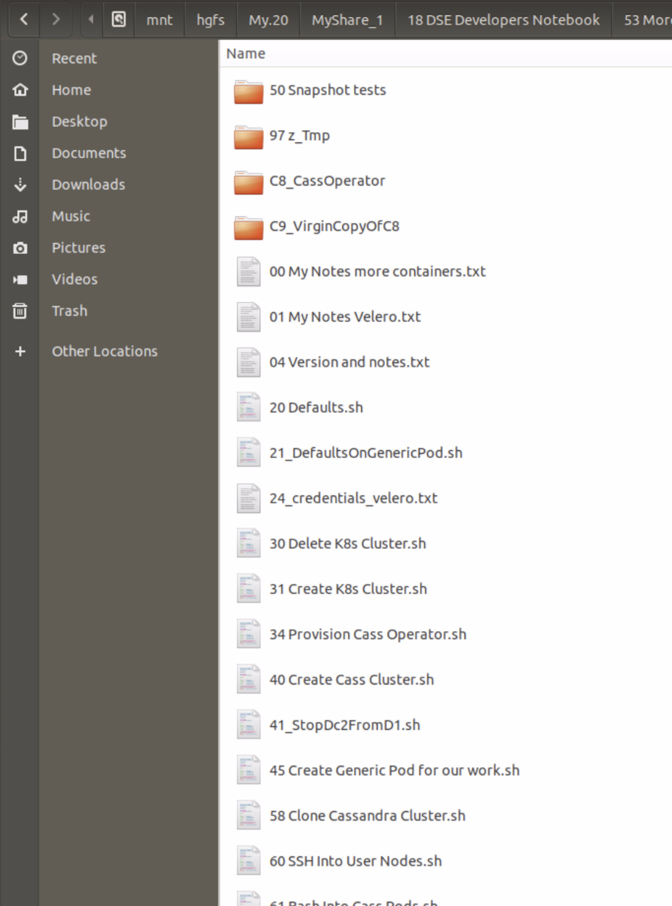
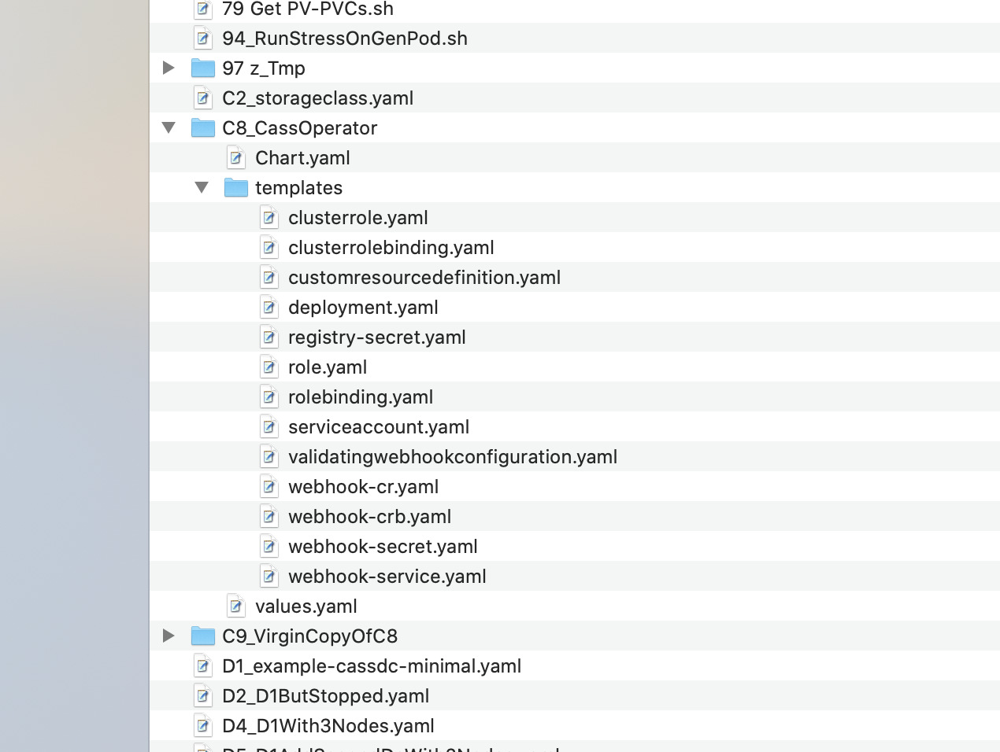

| **[Monthly Articles - 2022](../../README.md)** | **[Monthly Articles - 2021](../../2021/README.md)** | **[Monthly Articles - 2020](../../2020/README.md)** | **[Monthly Articles - 2019](../../2019/README.md)** | **[Monthly Articles - 2018](../../2018/README.md)** | **[Monthly Articles - 2017](../../2017/README.md)** | **[Data Downloads](../../downloads/README.md)** |
|-------------------------|-------------------------|-------------------------|-------------------------|-------------------------|-------------------------|-------------------------|

[Back to 2021 archive](../README.md)
[Download original PDF](../DDN_2021_53_MoreContainersHelm.pdf)
[Companion asset: DDN_2021_53_ToolkitVersion2.tar](../DDN_2021_53_ToolkitVersion2.tar)

---

# DDN 2021 53 MoreContainersHelm

## Chapter 53. May 2021

DataStax Developer’s Notebook -- May 2021 V1.21

Welcome to the May 2021 edition of DataStax Developer’s Notebook (DDN). This month we answer the following question(s); My company enjoyed the series of four articles centered on Cassandra atop Kubernetes. But, you left Cassandra and the Operator limited to just one namespace. We seek to run Cassandra clusters in many concurrent namespaces. Can you help ? Excellent question ! In this edition of this document, we take the work from the previous 4 articles, and move them to a multiple namespace treatment. We’ll detail using the Cassandra Operator across Kubernetes namespaces, and we’ll detail Cassandra cluster cloning across namespaces. Be advised, there are relevant limitations with Kuberenetes version 1.18 and lower as it relates to (cloning) across namespaces. (Everything is do-able, it’s just more steps than you might expect.)

## Software versions

The primary DataStax software component used in this edition of DDN is DataStax Enterprise (DSE), currently release 6.8.*, or DataStax Astra (Apache Cassandra version 4.0.0.*), as required. All of the steps outlined below can be run on one laptop with 16 GB of RAM, or if you prefer, run these steps on Amazon Web Services (AWS), Microsoft Azure, or similar, to allow yourself a bit more resource.

For isolation and (simplicity), we develop and test all systems inside virtual machines using a hypervisor (Oracle Virtual Box, VMWare Fusion version 8.5, or similar). The guest operating system we use is Ubuntu Desktop version 18.04, 64 bit. Or, we’re running on one of the major cloud providers on Kubernetes 1.18.

DataStax Developer’s Notebook -- May 2021 V1.21

## 53.1 Terms and core concepts

As stated above, ultimately the end goal is to expand our Apache Cassandra atop Kubernetes operations into multiple concurrent namespaces. In the previous series of four articles dedicated to Kubernetes, we left the topic of multiple namespaces off the table, as supporting multiple namespaces forces us to introduce the topic of Helm. Helm is fine, of course, but the (previous) series of four articles was pretty large by itself.

The toolkit, and Helm In the previous set of four articles in this series, we began using a toolkit we created for a small benchmark; Shell script, somewhat hacky, but got the job done. (The job being to capture/package steps we’d be running hundreds of times.) With this article moving to support for multiple Kubernetes namespaces, the toolkit changes a great deal.



*Figure 53-1 New version of the toolkit*

DataStax Developer’s Notebook -- May 2021 V1.21

Relative to Figure 53-1, the following is offered:

- As we are on Google Cloud, files 30 and 31 run the GCP CLI titled, gcloud, to create and destroy our Kubernetes cluster. For this article, these two programs are left essentially unchanged. Scripts 40 and higher are generally devoid of any cloud provider specific commands.

- File 34 is our installer post creation of the Kubernetes cluster. In this file we use Helm to install the DataStax Cassandra Kubernetes Operator.

Installing Helm Helm version 2 and version 3, we installed Helm version 3. Helm-3 uses an installer. Example 53-1 offers notes relative to installing Helm. A code review follows.

### Example 53-1 Installing Helm

```text
# https://helm.sh/docs/intro/install/
#
curl -fsSL -o get_helm.sh
https://raw.githubusercontent.com/helm/helm/master/scripts/get-h
elm-3
chmod 777 get*
./get*
```

Relative to Example 53-1, the following is offered:

- This first line lists the Url with documentation related to this process.

- The curl command downloads the Helm installer.

- The get command downloads Helm proper, which installs in

```text
/usr/local/bin
```

> Note: Why use Helm ?

Previously we installed the DataStax Cassandra Kubernetes Operator via a single YAML files and a kubectl apply command. This path caused us to have to accept many defaults related to the operation and use of this operator.

With Helm, we see below, we have more control as to how the operator functions.

DataStax Developer’s Notebook -- May 2021 V1.21

Installing the Operator using Helm Example 53-2 is a program to install the DataStax Cassandra Kubernetes Operator using Helm. A code review follows.

### Example 53-2 File 34, installing the Operator using Helm

```text
#!/bin/bash
```

```text
# From,
# https://github.com/datastax/cass-operator
#
#
```

```text
. "./20 Defaults.sh"
```

```text
##############################################################
```

```text
echo ""
echo ""
echo "Calling 'helm' and 'kubectl' to provision DataStax
Cassandra Kubernetes Operator version 1.5 ..."
echo " (And make/reset expected namespaces, storage classes,
and more.)"
echo ""
echo "** You have 10 seconds to cancel before proceeding."
echo ""
echo ""
sleep 10
```

```text
kubectl delete namespaces ${MY_NS_OPERATOR} 2> /dev/null
# suppress spurious error on
```

DataStax Developer’s Notebook -- May 2021 V1.21

```text
kubectl delete namespaces ${MY_NS_CCLUSTER1} 2> /dev/null
# first run, these ns's will
kubectl delete namespaces ${MY_NS_CCLUSTER2} 2> /dev/null
# not exist
kubectl delete namespaces ${MY_NS_USER1} 2> /dev/null
kubectl delete namespaces ${MY_NS_USER2} 2> /dev/null
echo ""
#
kubectl create namespace ${MY_NS_OPERATOR}
kubectl create namespace ${MY_NS_CCLUSTER1}
kubectl create namespace ${MY_NS_CCLUSTER2}
kubectl create namespace ${MY_NS_USER1}
kubectl create namespace ${MY_NS_USER2}
echo ""
```

```text
[ -d C8_CassOperator ] || {
echo ""
echo ""
echo "Error: This program requires that the DataStax
Cassandra Operator Helm Charts"
echo " are located in a local sub-folder titled,
C8_CassOperator."
echo ""
echo " (We use a local sub-folder, so that we may make
changes to default values.)"
echo ""
echo " This required sub-folder is not present."
echo ""
echo " You can download this chart from;
https://github.com/datastax/cass-operator"
echo " (And then please edit; values.yaml)"
echo ""
echo ""
```

DataStax Developer’s Notebook -- May 2021 V1.21

```text
exit 7
}
```

```text
# Expecting helm version 3.x
helm install --namespace=${MY_NS_OPERATOR} cass-operator
./C8_CassOperator
echo ""
```

```text
kubectl delete storageclass server-storage 2>
/dev/null
kubectl create -f C2_storageclass.yaml
# kubectl delete storageclass server-storage-immediate 2>
/dev/null
# kubectl create -f C3_C2WithImmediate.yaml
```

```text
echo ""
echo ""
```

Relative to Example 53-2, the following is offered:

- We source a file named 20, which contains a number of variable settings we use throughout this toolkit.

- Then we delete and create a number of namespaces, again, that we use throughout this toolkit.

- We check for the presence of a folder titled, C8. This folder contains 10 or more YAMLS, used by Helm, to install and configure the operator. We’ve never had or had access to these files before, which is the benefit of installing via Helm; function and control.

- The we see the Helm install of the operator.

- The remainder of the file is additional (settings) we want for the remainder of this toolkit.

DataStax Developer’s Notebook -- May 2021 V1.21

What’s under C8 ? We created the sub-folder C8. The contents under C8 come from DataStax, for use when installing the operator via Helm.



*Figure 53-2 Contents of the C8 sub-folder.*

Relative to Figure 53-2, the following is offered:

- We made this folder, but the files come from DataStax. We downloaded these files locally, so that we could edit one file in particular.

- These files originated from,

```text
https://github.com/datastax/cass-operator/tree/master/charts/cass
-operator-chart
```

- The only file we need/want to edit is the file titled, values.yaml.

### Example 53-3 Contents of values.yaml

```text
# Default values
```

```text
# clusterWideInstall: false
```

DataStax Developer’s Notebook -- May 2021 V1.21

```text
clusterWideInstall: true
```

```text
serviceAccountName: cass-operator
clusterRoleName: cass-operator-cr
clusterRoleBindingName: cass-operator-crb
roleName: cass-operator
roleBindingName: cass-operator
webhookClusterRoleName: cass-operator-webhook
webhookClusterRoleBindingName: cass-operator-webhook
deploymentName: cass-operator
deploymentReplicas: 1
defaultImage: "datastax/cass-operator:1.5.0"
imagePullPolicy: IfNotPresent
imagePullSecret: ""
```

Relative to Example 53-3, the following is offered:

- One line, the line with,

```text
clusterWideInstall: true
```

is why we are here. This line instructs the operator to look for and manage Cassandra installs across all namespaces in this Kubernetes cluster.

- The Helm command in file 34, installed the operator in another namepsace.

Summary of our current state then A summary of our current state then:

- We have a new version of the toolkit, one that is created/tested to work across multiple namespaces.

- As before: • The numbered files are generally executables. The lettered files are generally data files (YAML), used by the executables. • The 30* files generally install or configure the Kubernetes cluster. File 34 installs the Cassandra operator via Helm, and in a manner where the operator will function across namespaces. We had to edit a file under C8, specifically, values.yaml, to make this last part happen.

DataStax Developer’s Notebook -- May 2021 V1.21

• The 40* files create our Cassandra cluster, and more.

> Note: In addition to adding support for multiple Kubernetes namespaces in this toolkit, we also add support for working with Cassandra cluster with multiple DCs.

File 58 will clone Cassandra clusters within one Kubernetes cluster, from one namespace to a second, and with support for multiple Cassandra DCs.

• The 50* files are related to cloning Cassandra clusters. The 50 subfolder, contains all of the testing we built to achieve Cassandra cluster cloning across namespaces. • The 60* files interact with the Cassandra cluster; CQLSH, and such. • And the 70* files are generally reports.

Cloning Cassandra Clusters Cloning Cassandra clusters is a procedure commonly done during the development and quality-assurance phases. You create a Cassandra cluster with volumous and complex data, then clone it over and over, to better serve unit and system testing.

We had this capability in the previous set of four documents in this series. In this version of the toolkit, we add support to execute this capability across namespaces, and we add support for multiple Cassandra DCs (data centers).

> Note: Cloning Cassandra clusters within one Kubernetes cluster is easy; we can deliver this capability using pure kubectl.

Cloning Cassandra cluster across Kubernetes clusters is also easy. Here though, we need to use the open source project (GitHub) titled, Velero.

```text
https://github.com/vmware-tanzu/velero-plugin-for-gcp#setup
https://github.com/vmware-tanzu/velero
```

We will likely document using Velero in a soon and future article in this series.

Everything we need to discuss is contained in file 58, Example 53-4, and a code review follows.

### Example 53-4 Cloning Cassandra clusters, version 2

```text
#!/bin/bash
```

DataStax Developer’s Notebook -- May 2021 V1.21

```text
. "./20 Defaults.sh"
```

```text
# If a command line argument is passed, use this as a destination
namespace
#
[ ${#} -gt 0 ] && MY_NS_CCLUSTER2 = ${1}
```

```text
##############################################################
##############################################################
```

```text
echo ""
echo ""
echo "Calling 'kubectl' to clone an existing Cassandra cluster
..."
echo ""
echo " . This program will copy all PVs/PVCs from a source
Cassandra cluster, generate"
echo " the YAML for the destination Cassandra cluster, and
call the DataStax Cassandra"
echo " Operator to instantiate this destination/cloned
system. The cloned Cassandra"
echo " cluster will be left in an operating state (CQL
ready)."
echo " . This program is tested to work with multiple node/pod
Cassandra clusters."
echo " . This program will also work with multiple-DC Cassandra
clusters, although"
echo " you may run out of Kubernete worker nodes when cloning
on small Kubernetes"
```

DataStax Developer’s Notebook -- May 2021 V1.21

```text
echo " clusters."
echo " . The (source) Cassandra cluster can be up or down, and
can remain up or down."
echo " . This program calls to 'nodetool flush' the (source)
Cassandra cluster before"
echo " starting the cloning process."
echo " . This/a-demo-program, and we hard code copying from a
given namespace: ${MY_NS_CCLUSTER1}."
echo " . We put the cloned system into the namespace:
${MY_NS_CCLUSTER2}, which is defaulted"
echo " to a given value, or passed as the first argument on
the command line."
echo " . If a Cassandra cluster exists in the destination
namespace, it is deleted first"
echo " without first making any backups of same."
echo " . Also writing less code, a simpler program; we delete
all prior snapshots from"
echo " the source namespace before making any new snapshots
via this program."
echo " . Given that we are potentially cloning many GBs of
data, this program can take"
echo " a while to complete. (As a simple script, this program
does all work in the"
echo " foreground/synchronously. That's not a requirement;
it's just how we do it.)"
echo ""
echo ""
echo "** You have 10 seconds to cancel before proceeding."
echo ""
echo ""
sleep 10
```

```text
##############################################################
```

DataStax Developer’s Notebook -- May 2021 V1.21

```text
##############################################################
```

```text
l_cntr=`kubectl -n ${MY_NS_CCLUSTER1} get CassandraDatacenter
--no-headers | wc -l`
```

```text
[ ${l_cntr} -eq 0 ] && {
```

```text
echo "ERROR: No Cassandra cluster found to exist in the source
namespace, ${MY_NS_CCLUSTER1}"
echo " Program terminating. (Nothing to copy from.)"
echo ""
echo ""
exit 9
}
```

```text
##############################################################
```

```text
echo "Step 01 of 08: Running 'nodetool flush' on all nodes in the
source Cassandra cluster."
echo
"============================================================"
echo ""
```

```text
for l_node in `kubectl get pods -n ${MY_NS_CCLUSTER1}
--no-headers | awk '{print $1}'`
do
echo " Flushing: ${MY_NS_CCLUSTER1}/${l_node}"
kubectl -n ${MY_NS_CCLUSTER1} exec -it -c cassandra ${l_node}
-- nodetool flush
done
```

DataStax Developer’s Notebook -- May 2021 V1.21

```text
echo ""
echo ""
```

```text
##############################################################
##############################################################
```

```text
# If there is a Cassandra cluster in the target namespace,
delete it.
# If the namespace does not exist, create it.
#
# We do a lot of manual work here, so that we may produce a
rolling
# status (constant feedback to the operator).
```

```text
echo "Step 02 of 08: Checking target namespace"
echo
"============================================================"
echo ""
```

```text
l_cntr=`kubectl get ns | grep ${MY_NS_CCLUSTER2} | wc -l`
#
[ ${l_cntr} -eq 0 ] && {
```

```text
echo "Destination namespace does not exist; create it."
echo ""
kubectl create namespace ${MY_NS_CCLUSTER2}
echo ""
```

```text
} || {
```

```text
l_cntr=`kubectl -n ${MY_NS_CCLUSTER2} get CassandraDatacenter
```

DataStax Developer’s Notebook -- May 2021 V1.21

```text
--no-headers 2> /dev/null | wc -l`
```

```text
[ ${l_cntr} -eq 0 ] || {
```

```text
echo "A Cassandra cluster exists in the destination
namespace, and will be deleted."
echo " (Based on sizes, this step can take 2 minutes or
more to complete.)"
echo " (Using 'kubectl', this is an asynchronous operation
which we block on.)"
echo ""
echo ""
#
l_filename=/tmp/cass-cluster-to-delete.${$}.yaml
kubectl -n ${MY_NS_CCLUSTER2} get CassandraDatacenter -o
yaml > ${l_filename}
kubectl -n ${MY_NS_CCLUSTER2} delete -f ${l_filename}
#
rm -f ${l_filename}
```

```text
l_cntr=0
#
while :
do
l_if_ready=`kubectl get pods -n ${MY_NS_CCLUSTER2}
--no-headers 2> /dev/null| wc -l`
#
[ ${l_if_ready} -gt 0 ] && {
l_cntr=$((l_cntr+1))
echo " Cassandra pods remaining (${l_if_ready}) ..
(${l_cntr})"
#
sleep 20
} || {
```

DataStax Developer’s Notebook -- May 2021 V1.21

```text
break
}
done
```

```text
echo " Cassandra cluster deletion .. (complete)"
echo ""
```

```text
echo ""
echo "Deleting any leftover PVs from this now deleted
Cassandra cluster .."
echo ""
#
for l_pv in `kubectl get pv | grep ${MY_NS_CCLUSTER2} | awk
'{print $1}'`
do
echo " Deleting PV: ${l_pv}"
kubectl delete pv ${l_pv} --grace-period=0 --force 2>
/dev/null
done
```

```text
}
```

```text
echo "Done"
}
```

```text
echo ""
echo ""
```

```text
##############################################################
```

```text
echo "Step 03 of 08: Checking for presence of Volume Snaphot
Class"
```

DataStax Developer’s Notebook -- May 2021 V1.21

```text
echo
"============================================================"
echo ""
```

```text
l_cntr=`kubectl get volumesnapshotclass --no-headers 2> /dev/null
| wc -l`
```

```text
[ ${l_cntr} -eq 0 ] && {
```

```text
echo "Creating Volume Snapshot Class .."
kubectl apply -f X5_CreateVolumeSnapshotClass.yaml
```

```text
}
```

```text
echo ""
echo ""
```

```text
##############################################################
```

```text
echo "Step 04 of 08: Deleting any past/existing Volume Snaphots"
echo
"============================================================"
echo ""
```

```text
for l_snap in `kubectl -n ${MY_NS_CCLUSTER1} get volumesnapshots
--no-headers | awk '{print $1}'`
do
kubectl -n ${MY_NS_CCLUSTER1} delete volumesnapshot ${l_snap}
echo ""
done
```

```text
echo ""
```

DataStax Developer’s Notebook -- May 2021 V1.21

```text
echo ""
```

```text
##############################################################
##############################################################
```

```text
# Copying the PVs/PVCs from the source Cassandra clone-
```

```text
# Snaphsots are made from PVCs, and the data looks like this,
# NAME STATUS VOLUME
CAPACITY ACCESS MODES STORAGECLASS AGE
# server-data-cluster1-dc1-default-sts-0 Terminating
pvc-1c93bd8d-466f-46ab-87a8-85ba40fc2397 5Gi RWO
server-storage 59m
#
# Calls to [ complete ] a snapshot are asynchronous, so we block
# on this and wait for the snaphot to complete.
```

```text
# And like all things Kubernetes, this operation needs a YAML,
# which we generate in the loop below-
#
# Generally, though this YAML looks similar to,
# apiVersion: snapshot.storage.k8s.io/v1beta1
# kind: VolumeSnapshot
# metadata:
# name: snapshot-test1
# namespace: ns-cass-sys1
# spec:
# volumeSnapshotClassName: my-snapshot-class
# source:
# persistentVolumeClaimName:
server-data-cluster1-dc1-default-sts-0
```

DataStax Developer’s Notebook -- May 2021 V1.21

```text
# 3 of the values above must change per iteration of our
snapshotting
# loop
```

```text
echo "Step 05 of 08: Making Snapshots of source Cassandra
cluster"
echo
"============================================================"
echo ""
```

```text
l_cntr1=0
#
l_str="""
apiVersion: snapshot.storage.k8s.io/v1beta1
kind: VolumeSnapshot
metadata:
name: snapshot-XXX
namespace: YYY
spec:
volumeSnapshotClassName: my-snapshot-class
source:
persistentVolumeClaimName: XXX
"""
```

```text
for l_pvc in `kubectl -n ${MY_NS_CCLUSTER1} get pvc --no-headers
| awk '{print $1}'`
do
echo "Snapshotting: ${MY_NS_CCLUSTER1}:${l_pvc}"
#
# Make the YAML for this operation
#
l_cntr1=$((l_cntr1+1))
l_filename=/tmp/cass-snapshot-to-create.${$}.${l_cntr1}.yaml
```

DataStax Developer’s Notebook -- May 2021 V1.21

```text
#
echo "${l_str}" | sed "s/XXX/${l_pvc}/" | sed
"s/YYY/${MY_NS_CCLUSTER1}/" > ${l_filename}
#
# Initiate the snapshot
#
kubectl -n ${MY_NS_CCLUSTER1} apply -f ${l_filename}
#
rm -f ${l_filename}
echo ""
done
```

```text
echo ""
echo "** The requested snapshots above operate asynchronously,
but we need them"
echo " to be completed for the next set of steps. So, enter a
blocking wait loop."
echo ""
```

```text
l_cntr2=0
#
while :
do
l_num_ready=`kubectl -n ${MY_NS_CCLUSTER1} describe
volumesnapshots 2> /dev/null| \
grep "Ready To Use:" | grep "true" | wc -l`
#
[ ${l_num_ready} -lt ${l_cntr1} ] && {
l_cntr2=$((l_cntr2+1))
echo " Need (${l_cntr1}) snapshots 'Ready/true', Have
(${l_num_ready}) .. iteration (${l_cntr2})"
#
sleep 20
} || {
```

DataStax Developer’s Notebook -- May 2021 V1.21

```text
break
}
done
```

```text
echo " Done (${l_cntr1}) snaphots are 'Ready/true'."
echo ""
echo ""
```

```text
##############################################################
```

```text
echo "Step 06 of 08: From the Snapshots, generate PVs/PVCs"
echo " (Currently, Kubernetes causes these to be in the source
namespace"
echo " which is not what we want.)"
echo
"============================================================"
echo ""
```

```text
l_str="""
apiVersion: v1
kind: PersistentVolumeClaim
metadata:
name: pvc-snap-XXX
namespace: YYY
spec:
dataSource:
name: ZZZ
kind: VolumeSnapshot
apiGroup: snapshot.storage.k8s.io
storageClassName: server-storage
accessModes:
- ReadWriteOnce
```

DataStax Developer’s Notebook -- May 2021 V1.21

```text
resources:
requests:
storage: 5Gi
"""
```

```text
l_cntr=0
```

```text
for l_pvc in `kubectl -n ${MY_NS_CCLUSTER1} get volumesnapshots
--no-headers | awk '{print $1}'`
do
l_pvc2=`echo ${l_pvc} | sed 's/^snapshot-//'`
#
echo "Creating PV/PVC: ${MY_NS_CCLUSTER1}:${l_pvc2}"
#
# Make the YAML for this operation
#
l_cntr=$((l_cntr+1))
l_filename=/tmp/cass-pvc1-to-create.${$}.${l_cntr}.yaml
#
echo "${l_str}" | sed "s/XXX/${l_pvc2}/" | sed
"s/YYY/${MY_NS_CCLUSTER1}/" | \
sed "s/ZZZ/${l_pvc}/" > ${l_filename}
#
# Create the PVs/PVCs
#
kubectl -n ${MY_NS_CCLUSTER1} apply -f ${l_filename}
#
rm -f ${l_filename}
echo ""
done
```

```text
echo ""
echo "** Similar to many steps above, [ actually populating ]
these PVCs is an"
```

DataStax Developer’s Notebook -- May 2021 V1.21

```text
echo " asynchronous operation. With this version of Kubernetes
(1.17/1.18),"
echo " the best means to finish popluating these PVs/PVCs is to
create a pod"
echo " that targets same. We don't 'need' these pods, we need
their existence"
echo " to force the PVs/PVCs to fill."
echo ""
```

```text
l_str="""
apiVersion: v1
kind: Pod
metadata:
name: pod-snap-YYY
spec:
containers:
- name: nginx
image: nginx:1.19.5
command: ["/bin/bash", "-c"]
args:
- |
sleep infinity & wait
ports:
- containerPort: 80
volumeMounts:
- name: opt4
mountPath: /opt4
dnsPolicy: Default
volumes:
- name: opt4
persistentVolumeClaim:
claimName: XXX
"""
```

DataStax Developer’s Notebook -- May 2021 V1.21

```text
l_cntr2=0
```

```text
for l_targ in `kubectl -n ${MY_NS_CCLUSTER1} get pvc --no-headers
2> /dev/null | grep "^pvc-snap-" | awk '{print $1}'`
do
l_pod=`echo ${l_targ} | sed "s/^pvc-snap-//"`
#
# Make the YAML for this operation
#
l_cntr2=$((l_cntr2+1))
l_filename=/tmp/cass-pod-to-create.${$}.${l_cntr2}.yaml
#
echo "${l_str}" | sed "s/XXX/${l_targ}/" | sed
"s/YYY/${l_pod}/" > ${l_filename}
#
# Create the pods
#
echo "Creating Pod: ${MY_NS_CCLUSTER1}:${l_pod}"
kubectl -n ${MY_NS_CCLUSTER1} apply -f ${l_filename}
echo ""
#
rm -f ${l_filename}
done
```

```text
echo ""
echo "Loop, waiting for these (force PV/PVC content) pods to come
up."
echo ""
```

```text
l_cntr3=0
#
while :
do
l_num_ready=`kubectl -n ${MY_NS_CCLUSTER1} get pods
```

DataStax Developer’s Notebook -- May 2021 V1.21

```text
--no-headers 2> /dev/null| \
grep "^pod-snap-" | grep "1/1" | grep "Running" | wc -l`
#
[ ${l_num_ready} -lt ${l_cntr2} ] && {
l_cntr3=$((l_cntr3+1))
echo " Need (${l_cntr2}) pods 'Running', Have
(${l_num_ready}) .. iteration (${l_cntr3})"
#
sleep 20
} || {
break
}
done
```

```text
echo " Done (${l_cntr1}) pods are 'Running'."
```

```text
echo ""
echo "These pods are running, which means that the PVs/PVCs
contain the data"
echo "we need."
echo ""
echo "Done with these pods, now we delete them."
echo ""
```

```text
for l_pod in `kubectl -n ${MY_NS_CCLUSTER1} get pod --no-headers
2> /dev/null | grep "pod-snap-" | awk '{print $1}'`
do
echo "Deleting Pod: ${MY_NS_CCLUSTER1}:${l_pod}"
kubectl -n ${MY_NS_CCLUSTER1} delete pod ${l_pod} --force
echo ""
done
```

DataStax Developer’s Notebook -- May 2021 V1.21

```text
echo ""
echo ""
```

```text
##############################################################
```

```text
echo "Step 07 of 08: Make PVCs in the destination namespace"
echo
"============================================================"
echo "So, a current limitation of Kubernetes 1.17/1.18 ..."
echo ""
echo " . We were not [ directly ] able to make the PVCs in the
namespace"
echo " we wanted/needed."
echo " . In the last step, we made the PVCs in the source
namespace, so we"
echo " would populate the underlying net new PVs."
echo " . Now/here,"
echo " .. Delete the source namespace PVCs we no longer
need."
echo " .. Unbind those underlying PVs."
echo " .. Create new PVCs in the correct/destination
namespace."
echo ""
```

```text
l_str="""
apiVersion: "v1"
kind: "PersistentVolumeClaim"
metadata:
name: YYY
spec:
storageClassName: server-storage
accessModes:
```

DataStax Developer’s Notebook -- May 2021 V1.21

```text
- ReadWriteOnce
resources:
requests:
storage: "5Gi"
volumeName: XXX
"""
```

```text
for l_target in `kubectl get pv --no-headers 2> /dev/null | awk
'{printf("%s/%s\n",$1, $6)}' | \
grep "${MY_NS_CCLUSTER1}/pvc-snap-"`
do
l_pv=` echo ${l_target} | awk -F "/" '{print $1}'`
l_pvc1=`echo ${l_target} | awk -F "/" '{print $3}'`
l_pvc2=`echo ${l_pvc1} | sed "s/pvc-snap-//"`
#
echo "Delete source PVC: ${l_pvc1}"
kubectl -n ${MY_NS_CCLUSTER1} delete pvc ${l_pvc1} --force 2>
/dev/null
#
echo "Unbind PV: ${l_pv}"
kubectl patch pv ${l_pv} -p '{"spec":{"claimRef": null}}'
#
# Make the YAML for this operation
#
l_cntr=$((l_cntr+1))
l_filename=/tmp/cass-pvc2-to-create.${$}.${l_cntr}.yaml
#
echo "${l_str}" | sed "s/XXX/${l_pv}/" | sed
"s/YYY/${l_pvc2}/" > ${l_filename}
echo "Create destination PVC: ${l_pvc2}"
kubectl -n ${MY_NS_CCLUSTER2} apply -f ${l_filename}
rm -f ${l_filename}
#
echo ""
```

DataStax Developer’s Notebook -- May 2021 V1.21

```text
done
```

```text
echo ""
echo ""
```

```text
##############################################################
```

```text
echo "Step 08 of 08: Generate configuration YAML for destination
Cassandra"
echo " cluster and boot same."
echo
"============================================================"
echo ""
```

```text
l_filename="/tmp/cass-cluster-we-cloned.${$}.yaml"
#
echo "Generating YAML for this cloned Cassandra cluster:
${l_filename}"
#
kubectl -n ${MY_NS_CCLUSTER1} get CassandraDatacenter -o yaml | \
sed "s/${MY_NS_CCLUSTER1}/${MY_NS_CCLUSTER2}/g" | \
sed 's/^ uid: .*/ uid:/' > ${l_filename}
echo " This YAML is available as file: ${l_filename}"
```

```text
echo ""
kubectl -n ${MY_NS_CCLUSTER2} apply -f ${l_filename}
```

```text
echo ""
echo "Waiting for Cassandra cluster to be fully booted. Based on
the"
echo "number of Cassandra nodes, this can take 90 seconds or
```

DataStax Developer’s Notebook -- May 2021 V1.21

```text
longer."
echo ""
```

```text
l_cntr1=`kubectl -n ${MY_NS_CCLUSTER1} get pod --no-headers | wc
-l`
```

```text
l_cntr2=0
#
while :
do
l_num_ready=`kubectl -n ${MY_NS_CCLUSTER2} get pod
--no-headers 2>/dev/null | \
sed "s/ */ /g" | grep '2/2 Running' | wc -l`
#
[ ${l_num_ready} -lt ${l_cntr1} ] && {
l_cntr2=$((l_cntr2+1))
echo " Need (${l_cntr1}) pods 'Running', Have
(${l_num_ready}) .. iteration (${l_cntr2})"
#
sleep 20
} || {
break
}
done
```

```text
echo " Done (${l_cntr1}) pods are 'Running'."
echo " (Cassandra is operational/booted.)"
echo ""
echo "Next steps:"
echo ""
echo " Run program(s) 63* or 64* to CQLSH into a Cassandra
cluster."
echo ""
echo ""
```

DataStax Developer’s Notebook -- May 2021 V1.21

Relative to Example 53-4, the following is offered:

- Two variables, MY_NS_CCLUSTER1 and 2, specify the source and then destination namespaces, where we will copy a Cassandra cluster from, and where we will copy it into. The source Cassandra cluster can be up or down. The destination Cassandra cluster will be booted. You can override the destination namespace on the command line.

- In the first block of code, we check for the presence of the source Cassandra cluster. If none exists, we exit.

- Step 1 of 8 is simple, looping through each of the source Cassandra cluster nodes, and performing a nodetool flush. This steps is not required to cluster clone. Often we make a source Cassandra cluster, fill it with data, then immediately clone. So, the flushing step is just a nice to have.

- Step 2 of 8 calls to delete anything that was in the destination namespace. • If the destination namespace does not exist, we create it. • If there is a CassandraDatacenter object in the destination namespace, we delete that.

> Note: The DataStax Cassandra Kubernetes Operators exists as a Kubernetes CRD; custom resource definition (file).

This CRD create Kubernetes “stateful sets”, once per Cassandra cluster.

You clone Cassandra clusters by copying the CassandraDatacenter object though.

> Note: The ‘kubectl get’ operation on the CassandraDatacenter object allows us to (re)create the YAML that was used to create this Cassandra cluster; super handy technique this is.

• So many operations with Kubernetes are asynchronous. So, we enter a while/true loop to manually delete any of the pods that may have been part of this Cassandra cluster.

DataStax Developer’s Notebook -- May 2021 V1.21

• After the pods are gone, we call to manually delete and persistent volumes that we part of this Cassandra cluster.

- Step 3 of 8, super easy; create the Kubernetes object for volume snapshot class.

- Step 4 of 8, also super easy, delete any previous volume snapshots we may have created.

> Note: As a test/development system for our own personal use, we tend to delete more than we need to keep things clean and small.

- Step 5 of 8, create a snapshot of each of the source persistent volume claims from the source Cassandra cluster. • As with all (?) objects created in Kubernetes, we need a YAML. So we loop and sed(C) to create that. • An asynchronous operation, we while/true loop until the snapshots are all Ready/true.

- Step 6 of 8, the biggest, most complex step-

DataStax Developer’s Notebook -- May 2021 V1.21

> Note: The gist here is; – We have a snapshot, in the same namespace as the source Cassandra cluster. This was a limitation of Kubernetes version 1.17/1.18; we could not make this snapshot in another namespace. – We want a persistent volume from those snapshots. But, you don’t make persistent volumes (PV) from snapshots; you make persistent volume claims (PVC). (This is at least true for dynamically provisioned PVs, which is what we have here.) – Making a PVC from a snapshot is currently limited to the same namespace as the source snapshot. – PVs are a Kubernetes cluster wide resource, where PVCs are namespace in scope. If we can create the new/copied PVC, and cause the PV to be created, we’re done. But, some additional foolishness below. – We can make the PVC, which creates the underlying PV. But .. .. actually putting bits into the PV is deferred. How we cause the PV to actually contains bits ? We create a pod against the PV. We don’t really want these PVCs or pods; they’re in the wrong (source) namespace. We want them in the destination namespace, the PVCs, at least. – So, you’ll see this script make PVCs and pods we don't really need, then delete them, all to force the PVs to be populated. After the new/copied PVs exist and contains bits, we’re largely done.

• First we make the (second/new) PVC in the source namepsace; a limitation of Kubernetes 1.17/1.18. An asynchronous operation, we’ll have to wait for these. Also, our storage class is defined as (WaitForFirstConsumer), which means no real bits have been copied yet.

DataStax Developer’s Notebook -- May 2021 V1.21

> Note: The underlying storage class from source to destination has to match, in order for Cassandra to want to accept these (copies of disks); size, and many other properties.

The storage class you see shipped with the Cassandra operator is, wait for first consumer. You can change that property to, immediate, and a net new Cassandra cluster will boot.

We found that cloned Cassandra clusters somehow did not like ‘immediate’ as a PVC (storage class) property, and would hang on boot.

Oh well, we present the work around here in file 58.

• As stated, after we create the PVCs, we create pods that target each PVC; a one to one relationship. As asynchronous operation, we wait for the pods to come up. Once the pods are up, we know (through testing), that the underlying PVs contains the bits we need; the source bits from the (source) Cassandra cluster. • After the pods are up, we delete them.

- Step 7 of 8, we have all of the bits we need- • Here we will loop through the copied/destination PVs to create the PVCs we need in the destination namespace. • We waited until now to delete the PVCs we used a a tool in the source namespace, since the looping data is the same. • With the destination PVCs, we could stop here. The (state) of a Cassandra cluster is its disks, and we have those copied.

- Step 8 of 8, boot the cloned Cassandra cluster, and wait for its pods to come up. You’re now ready to run CQLSH, or whatever.

DataStax Developer’s Notebook -- May 2021 V1.21

> Note: As stated above, this program is tested and works even when cloning multi-DC Cassandra clusters.

The biggest reason this program fails ? Not enough Kubernetes resource. If you try to clone a 3-node Cassandra cluster that is active, you’ll end up asking for 6-nodes of Cassandra total. If you only have 4 Kubernetes worker nodes, this program will fail.

## 53.2 Complete the following

At this point in this document we have detailed use of multiple namespace within Kubernetes. We installed the DataStax Cassandra Kubernetes Operator with support for same, and we cloned Cassandra clusters across namespaces.

If you wish to clone Kubernetes objects other than Cassandra Datacenters, there is code under the 52 sub-folder where we cloned just regular PVCs and pods across namespaces.

## 53.3 In this document, we reviewed or created:

This month and in this document we detailed the following:

- How to install and operate the DataStax Cassandra Kubernetes operator to support multiple, concurrent namespaces.

- How to clone Apache Cassandra clusters across namespaces within one Kubernetes cluster, using pure kubectl. (Across Kubernetes clusters requires the open source Velero project or similar, and is likely the topic of a future article.)

DataStax Developer’s Notebook -- May 2021 V1.21

### Persons who help this month.

Kiyu Gabriel, Joshua Norrid, Dave Bechberger, and Jim Hatcher.

### Additional resources:

Free DataStax Enterprise training courses,

```text
https://academy.datastax.com/courses/
```

Take any class, any time, for free. If you complete every class on DataStax Academy, you will actually have achieved a pretty good mastery of DataStax Enterprise, Apache Spark, Apache Solr, Apache TinkerPop, and even some programming.

This document is located here,

```text
https://github.com/farrell0/DataStax-Developers-Notebook
https://tinyurl.com/ddn3000
```

DataStax Developer’s Notebook -- May 2021 V1.21
