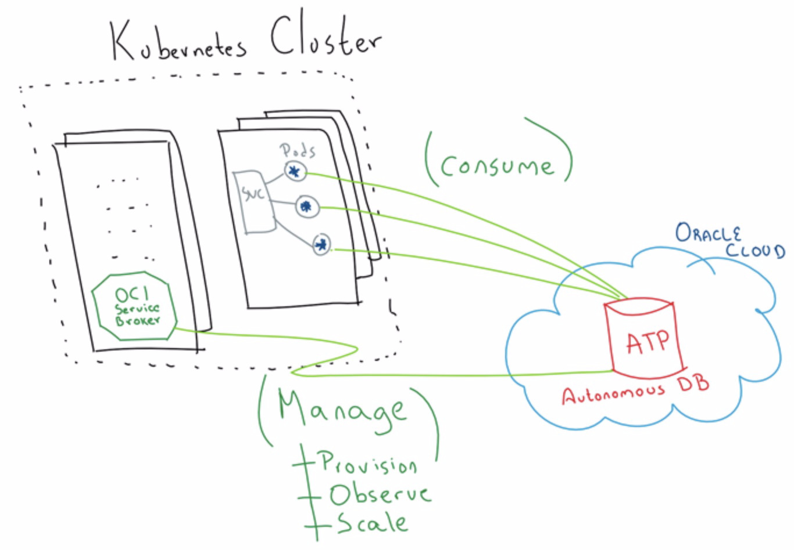

| **[Monthly Articles - 2022](../../README.md)** | **[Monthly Articles - 2021](../../2021/README.md)** | **[Monthly Articles - 2020](../../2020/README.md)** | **[Monthly Articles - 2019](../../2019/README.md)** | **[Monthly Articles - 2018](../../2018/README.md)** | **[Monthly Articles - 2017](../../2017/README.md)** | **[Data Downloads](../../downloads/README.md)** |
|-------------------------|-------------------------|-------------------------|-------------------------|-------------------------|-------------------------|-------------------------|

[Back to 2021 archive](../README.md)
[Download original PDF](../DDN_2021_54_AstraSvcBroker.pdf)

---

# DDN 2021 54 AstraSvcBroker

## Chapter 54. June 2021

DataStax Developer’s Notebook -- June 2021 V1.21

Welcome to the June 2021 edition of DataStax Developer’s Notebook (DDN). This month we answer the following question(s); My company is investigating using the DataStax Atra Service Broker within our Kubernetes systems. Can you help ? Excellent question ! In this document we will install and use most of the early pieces of the DataStax Astra Service broker; install, install verification, connection, yadda.

## Software versions

The primary DataStax software component used in this edition of DDN is DataStax Enterprise (DSE), currently release 6.8.*, or DataStax Astra (Apache Cassandra version 4.0.0.*), as required. All of the steps outlined below can be run on one laptop with 16 GB of RAM, or if you prefer, run these steps on Amazon Web Services (AWS), Microsoft Azure, or similar, to allow yourself a bit more resource.

For isolation and (simplicity), we develop and test all systems inside virtual machines using a hypervisor (Oracle Virtual Box, VMWare Fusion version 8.5, or similar). The guest operating system we use is Ubuntu Desktop version 18.04, 64 bit. Or, we’re running on one of the major cloud providers on Kubernetes 1.18.

DataStax Developer’s Notebook -- June 2021 V1.21

## 54.1 Terms and core concepts

As stated above, ultimately the end goal is to introduce and use the DataStax Astra Service Broker. Figure 54-1displays an image from RedRThunder.blog, and a code review follows.



*Figure 54-1 Cute picture from RedThunder.blog*

Relative to Figure 54-1, the following is offered:

- We stole this picture from RedThunder.blog (result of a random Google query) because it’s cute; we have no idea who these folks are.

- The two key elements of this image are; • You have an existing Kubernetes cluster, presumably hosting an application. • You could host and manage your database server instance inside this same Kubernetes cluster, but for some reason you are not; you think mixing applications and databases inside one Kubernetes cluster is a bad pattern, the application and database are managed by two separate teams across geographies, or whatever.

DataStax Developer’s Notebook -- June 2021 V1.21

In our case, the database is actually a SaaS (or DBaaS). Apache Cassandra is the database, and the SaaS offering from DataStax is titled, DataStax Astra.

> Note: As stated, DataStax Astra is the DataStax managed offering for Apache Cassandra. There are at least 3 (entry points) for any consumer of DataStax Astra: – The API for using (application programming against) Astra at,

```text
https://docs.astra.datastax.com/v1.0/reference#datastax-astra-d
ata-api
```

- The API for managing Astra at,

```text
https://docs.astra.datastax.com/reference#datastax-astra-devops
-api
```

- And anything related to the Astra Service Broker at,

```text
https://docs.astra.datastax.com/docs/astra-service-broker
```

> Note: In this document we use kubectl, Helm, and svcat. Comments include: – Both kubectl and Helm are simple download, and then Tar ball installs. See, https://kubernetes.io/docs/tasks/tools/install-kubectl/ https://helm.sh/docs/helm/ – svcat largely offers syntactic sugar over what you could do with longer and a larger number of kubectl commands. Two parts; there is installing the svcat CLI (command line program), and everything else. In this document, we only need the svcat command. From,

```text
https://svc-cat.io/docs/install/
https://svc-cat.io/docs/walkthrough/
# Just the client program
#
curl -sLO
https://download.svcat.sh/cli/latest/linux/amd64/svcat
chmod 777 svcat
svcat version --client
```

DataStax Developer’s Notebook -- June 2021 V1.21

• A ‘service broker’ is a top level Kubernetes object that allows access to remotely managed resources like databases, or similar. You could just call out from your application to the database using network calls, but going through a service broker is a bit cleaner; the service broker object makes credentials and such much cleaner, easier to maintain. Using a service broker is just a much cleaner pattern.

- In the image above, the service broker is displayed inside the Kubernetes cluster as, “OCI Service Broker”. Generally, expect to see a 3 step progression when using Kubernetes service brokers; • You register the broker • You make a broker service instance • You create a binding

Making the Kubernetes cluster service broker ready Given an operating Kubernetes cluster (in the example below, ours is on GCP/GKE), we install (register) the broker using Helm. Example 54-1displays a number of commands. A code review follows.

### Example 54-1 Registering the Astra service broker inside our Kubernetes cluster

```text
helm repo list
NAME URL
k8ssandrahttps://helm.k8ssandra.io/
traefik https://helm.traefik.io/traefik
stable https://charts.helm.sh/stable
svc-cathttps://kubernetes-sigs.github.io/service-catalog
service-catalog
https://kubernetes-sigs.github.io/service-catalog
```

```text
helm repo remove k8ssandra
helm repo remove traefik
helm repo remove stable
helm repo remove svc-cat
helm repo remove service-catalog
```

DataStax Developer’s Notebook -- June 2021 V1.21

```text
--
```

```text
helm repo add service-catalog
https://kubernetes-sigs.github.io/service-catalog
"service-catalog" has been added to your repositories
```

```text
helm repo update
...Successfully got an update from the "service-catalog"
chart repository
Update Complete. ⎈Happy Helming!⎈
```

```text
helm search repo service-catalog
NAME CHART VERSIONAPP VERSION
DESCRIPTION
service-catalog/catalog 0.3.1
service-catalog webhook server and controller-m...
service-catalog/catalog-v0.20.2.3
service-catalog API server and controller-manag...
service-catalog/healthcheck 0.3.1
HealthCheck monitors the health of Service Catalog
service-catalog/test-broker 0.3.1 test
service-broker deployment Helm chart.
service-catalog/ups-broker 0.3.1
user-provided service-broker deployment Helm ch...
```

```text
--
```

```text
kubectl create namespace ns-myapp1
kubectl delete namespace ns-myapp1
```

```text
helm install catalog service-catalog/catalog --namespace
ns-myapp1
NAME: catalog
LAST DEPLOYED: Wed Jan 27 08:04:40 2021
```

DataStax Developer’s Notebook -- June 2021 V1.21

```text
NAMESPACE: ns-myapp1
STATUS: deployed
REVISION: 1
TEST SUITE: None
```

```text
helm delete catalog service-catalog/catalog --namespace
ns-myapp1
release "catalog" uninstalled
Error: uninstall: Release name is invalid: svc-cat/catalog
```

```text
kubectl get pods -n ns-myapp1
NAME READY
STATUS RESTARTS AGE
catalog-catalog-controller-manager-6896c6f478-qz8hd 1/1
Running 0 7m3s
catalog-catalog-webhook-6c8876b96d-br46m 1/1
Running 0 7m3s
```

Relative to Example 54-1, the following is offered:

- Above there is a mixture of commands, output from commands, other.

- ‘helm repo list’ gives us a status; what online software repositories have we previously made Helm aware of.

- The ‘helm repo remove’ remove an previously added online software repository from Helm’s awareness.

- The ‘helm repo add service-catalog ..’ effectively makes our target Kubernetes cluster ready to work with service brokers. This is our first necessary command in this list.

- In this context, ‘helm repo update’ is required. Adding a repository, than knowing what’s in it, are two distinct steps.

- ‘helm search repo service-catalog’ gives us a (table of contents, versions) of what the service catalog registration gave us.

- We will be putting our service broker assets in a given Kubernetes namespace, so make that.

DataStax Developer’s Notebook -- June 2021 V1.21

- ‘helm install catalog service-catalog/catalog --namespace ns-myapp1’ is our last, real step, and is required. After this step, we are ready to work with Kubernetes service brokers. If you keep reading, you see that there are pods that are now running; service broker capability arrives as a Kubernetes CRD.

We need credentials to work with Astra At this point in the document, our Kubernetes cluster is ready to work with Kubernetes service brokers. We will be using a DataStax Astra service broker, so we need some more things:

- DataStax Astra is the DataStax DBaaS/SaaS for Apache Cassandra. You can make a free account (email verified), with no credit card.

- To keep things clean, we make an ‘organization’, titled ‘my_org’. An organization sets scope for certain objects, similar to a Kubernetes namespace. Under the organization you will enable a ‘service account’, and copy the credentials to same. See,

```text
https://docs.astra.datastax.com/docs/manage-service-account
```

- the credentials here arrive as a JSONM string. To validate that you have this string correctly, we can use a curl(C) command. See Example 54-2, with the code review that follows.

### Example 54-2 Astra service account credentials

```text
# From,
#
https://docs.astra.datastax.com/docs/manage-service-account
#
# Get service account credentials from Astra (under Orgs,
my_org)
# Note; clientName matches the name of the Astra org
#
```

```text
l_creds='{"clientId":"2c4a665XXX8db19","clientName":"my_org","cl
ientSecret":"7ff07609-XXX13941"}'
```

```text
# From,
#
```

DataStax Developer’s Notebook -- June 2021 V1.21

```text
https://docs.astra.datastax.com/docs/authenticating-your-service
-account
#
curl --request POST \
--url
https://api.astra.datastax.com/v2/authenticateServiceAccount \
--header 'accept: application/json' \
--header 'content-type: application/json' \
--data "${l_creds}"
```

Relative to Example 54-2, the following is offered: • All of the (work) here is done through the DataStax Astra graphical/Web user interface. In the user interface we can copy the credentials to a ‘service’ account’, for a given organization. The credentials arrive as a JSON string. • the curl(C) command is just an install/verify steps; do these credentials actually connect to Astra-

- Using the JSON credentials string produced above, we continue- • We continue to use a variable populated with this JSON string, titled, l_creds • We continue running the code in Example 54-3. A code review follows.

### Example 54-3 Creating a Kubernetes secret, our Astra credentials

```text
kubectl create secret generic astra-creds
--from-literal=username=unused --from-literal=password=`echo
${l_creds} | base64 -w 0` -n ns-myapp1
secret/astra-creds created
```

```text
kubectl get secrets -n ns-myapp1
NAME TYPE DATA
AGE
astra-creds Opaque 2
15m
```

DataStax Developer’s Notebook -- June 2021 V1.21

```text
kubectl delete secret astra-creds -n ns-myapp1
secret "astra-creds" deleted
```

```text
kubectl get secret astra-creds -o jsonpath='{.data}' -n
ns-myapp1
```

Relative to Example 54-3, the following is offered: • Here we see how to create Kubernetes secrets, get them (confirm they exist), delete secrets, and how to get a formatted subset of a secret object. • This secret (this set of credentials) are to a management account, on DataStax Astra. Below we use this (account) to make a Cassandra database that is hosted inside Astra.

Creating an Astra Service Broker All of the previous steps were largely preparation; here we begin doing the (work proper) for providing a Kubernetes application access to a hosted (remote) database service instance. All of the work that follows can be completed using a YAML file, and a given kubectl command. We use svcat, because it’s easier and faster (less steps to complete).

Example 54-4 displays our next set of commands. A code review follows.

### Example 54-4 Creating the actual broker

```text
svcat register astra --url https://broker.astra.datastax.com/
--basic-secret astra-creds -n ns-myapp1
Name: astra
Scope: namespace
Namespace: ns-myapp1
URL: https://broker.astra.datastax.com/
Status:
```

```text
svcat deregister astra -n ns-myapp1
```

```text
--
```

DataStax Developer’s Notebook -- June 2021 V1.21

```text
svcat marketplace -n ns-myapp1
CLASS PLANS DESCRIPTION
```

```text
+----------------+-------------+--------------------------------
--------------+
astra-database D20 DataStax Astra, built on
the best distribution of Apache
Cassandraâ„¢, provides the
ability to develop and deploy
data-driven applications
with a cloud-native service,
without the hassles of
database and infrastructure
administration.
```

```text
A10
```

```text
developer
```

```text
D10
```

```text
cloudnative
```

```text
A40
```

```text
A20
```

```text
C20
```

```text
C40
```

```text
A5
```

DataStax Developer’s Notebook -- June 2021 V1.21

```text
D40
```

```text
C10
```

```text
svcat get brokers -n ns-myapp1
NAME NAMESPACE URL
STATUS
```

```text
+-------+-----------+------------------------------------+------
--+
astra ns-myapp1 https://broker.astra.datastax.com/
Ready
```

```text
svcat get plans -n ns-myapp1
NAME NAMESPACE CLASS
DESCRIPTION
```

```text
+-------------+-----------+----------------+--------------------
--------------+
D20 ns-myapp1 astra-database 24 vCPU, 96 GB
DRAM, 1500GB
Storage
```

```text
A10 ns-myapp1 astra-database 6 vCPU, 24GB
DRAM, 20GB
Storage
```

```text
developer ns-myapp1 astra-database Free tier: Try
Astra with
no obligation.
Get 5 GB of
storage, free
```

DataStax Developer’s Notebook -- June 2021 V1.21

```text
forever.
D10 ns-myapp1 astra-database 12 vCPU, 48 GB
DRAM, 1500GB
Storage
```

```text
cloudnative ns-myapp1 astra-database An elastic
database that
scales with your
workload.
A40 ns-myapp1 astra-database 24 vCPU, 96GB
DRAM, 80GB
Storage
```

```text
A20 ns-myapp1 astra-database 12 vCPU, 48GB
DRAM, 40GB
Storage
```

```text
C20 ns-myapp1 astra-database 24 vCPU, 96 GB
DRAM, 500GB
Storage
```

```text
C40 ns-myapp1 astra-database 48 vCPU, 192GB
DRAM, 500GB
Storage
```

```text
A5 ns-myapp1 astra-database 3 vCPU, 12GB
DRAM, 10GB
Storage
```

```text
D40 ns-myapp1 astra-database 48 vCPU, 192GB
DRAM, 1500GB
Storage
```

```text
C10 ns-myapp1 astra-database 12 vCPU, 48 GB
```

DataStax Developer’s Notebook -- June 2021 V1.21

```text
DRAM, 500GB
Storage
```

```text
svcat get instances
NAME NAMESPACE CLASS PLAN STATUS
+------+-----------+-------+------+--------+
```

```text
kubectl -n ns-myapp1 get servicebindings
No resources found in ns-myapp1 namespace.
```

```text
kubectl -n ns-myapp1 get serviceinstances
No resources found in ns-myapp1 namespace.
```

Relative to Example 54-4, the following is offered:

- Minus preparation steps above, you could view this as (step 1 of 3), actually creating (registering) a given broker. Above there are actual, required commands, commands to verify what we’ve created, and commands that will not yet work (they require future objects to be created).

- The first command, ‘svcat register ..’, creates (registers) the actual DataStax Astra service broker. Following, we see the command to delete (or, deregister).

- If the ‘svcat marketplace ..’ command fails, either Astra is down, or most likely, your secret/credentials from above are broken. The most common error is incorrect JSON string handling. The ‘developer’ entry from (marketplace) is what we need to ask for to receive the free tier inside DataStax Astra.

- The svcat (get instances, get servicebindings, get serviceinstances) all fail; we haven’t gotten that far yet. All we have at this moment is registration (awareness) of a given broker (service). We create a service instance next.

Creating an Astra Service Instance This is largely step 2 of 3 total steps; (steps minus and preparation we completed earlier). Having a service broker, now we create a service instance. These steps are presented in Example 54-5. A code review follows.

DataStax Developer’s Notebook -- June 2021 V1.21

### Example 54-5 Creating a service instance

```text
svcat -n ns-myapp1 provision my-svc-db --class astra-database
--plan developer --params-json '{
"cloud_provider": "GCP",
"region": "us-east1",
"capacity_units": 1,
"keyspace": "my_keyspace"
}'
```

```text
# Name: my-svc-db
# Namespace: ns-myapp1
# Status:
# Class:
# Plan:
# Parameters:
# capacity_units: 1
# cloud_provider: GCP
# keyspace: my_keyspace
# region: us-east1
```

```text
svcat -n ns-myapp1 deprovision my-svc-db
```

```text
# This command/status will lag from the Astra GUI
#
# there's a back off lag built into this
#
svcat -n ns-myapp1 get instances
NAME NAMESPACE CLASS PLAN STATUS
+-----------+-----------+-------+------+--------+
my-svc-db ns-myapp1 Ready
```

DataStax Developer’s Notebook -- June 2021 V1.21

```text
kubectl -n ns-myapp1 get serviceinstances
NAME CLASS
PLAN STATUS AGE
my-svc-db ServiceClass/26b3fbZZZb4148
1c9bb5ac-6609ZZZ3cc7f Ready 12m
```

```text
kubectl -n ns-myapp1 get servicebindings
No resources found in ns-myapp1 namespace.
```

Relative to Example 54-5, the following is offered:

- The first command ‘svcat .. provision ..’ has a few options we had to specify- • As a free DataStax Astra tier, we had to choose from a subset of cloud providers. We choose GCP, and a given GCP region. • We specify the name of this broker instance as, my-svc-db, in the named Kubernetes keyspace. • This command will actually make a DataStax Astra database. • And we see the associated deprovision, should we need it someday. This command will not delete the DataStax Astra database.

- The ‘svcat (get instance, serviceinstances) will lag; there is a built in throttling to this (pooling, command). You will see the database create through the Astra user interface before you see it here. Before the next steps (creating a binding from this instance), you need to see a Status/Ready here.

- If you ran an svcat (get servicebindings) here it would fail; we haven’t made that yet.

Last step; Create the Binding Last step; all that remains is to create the service broker, service instance, binding. We display this in Example 54-6. A code review follows.

### Example 54-6 Creating the service binding

```text
svcat -n ns-myapp1 bind my-svc-db
# Name: my-svc-db
# Namespace: ns-myapp1
```

DataStax Developer’s Notebook -- June 2021 V1.21

```text
# Status:
# Secret: my-svc-db
# Instance: my-svc-db
# Parameters:
# No parameters defined
```

```text
svcat -n ns-myapp1 unbind my-svc-db
deleted my-svc-db
```

```text
svcat -n ns-myapp1 get bindings
NAME NAMESPACE INSTANCE STATUS
+-----------+-----------+-----------+--------+
my-svc-db ns-myapp1 my-svc-db Ready
```

```text
kubectl -n ns-myapp1 get servicebindings
NAME SERVICE-INSTANCE SECRET-NAME STATUS AGE
my-svc-db my-svc-db my-svc-db Ready 21s
```

```text
kubectl -n ns-myapp1 get secret my-svc-db
NAME TYPE DATA AGE
my-svc-db Opaque 13 7m38s
```

Relative to Example 54-6, the following is offered:

- So here we finally make the consumable artifact for any application, the service binding.

- We see the creation (verb: bind) and deletion (verb: unbind).

- We detail using this service binding below.

DataStax Developer’s Notebook -- June 2021 V1.21

## 54.2 Complete the following

At this point in this document we have Kubernetes cluster with a planned use of hosting our business application. Inside this cluster we have (reference, a broker service binding) to a remote database server instance. Here we continue by actually consuming this (database).

Example 54-7 details how to use our newly create DataStax Astra service instance. A code review follows.

### Example 54-7 Connecting to this remote Astra database

```text
kubectl -n ns-myapp1 get secret my-svc-db -o json | \
jq -r ".data.encoded_external_bundle" | base64 -d | \
base64 -d > secure-bundle.zip
```

```text
--
```

```text
USER=`kubectl -n ${MY_NS_USER2} get secret ${MY_SVC_DB} -o json |
jq -r ".data.username" | base64 -d `
PASS=`kubectl -n ${MY_NS_USER2} get secret ${MY_SVC_DB} -o json |
jq -r ".data.password" | base64 -d `
```

```text
cqlsh -u $USER -p $PASS -b *.zip
```

Relative to Example 54-7, the following is offered:

- Using the secure connect bundle is one means to connect to a remote DataStax Astra database server.

- In this example we see how to extract the locally maintained credentials, username and password, and more.

- There is an API to also manage these, available at,

```text
https://docs.astra.datastax.com/reference#generatesecurebundleurl
-1
```

- And we show the CQLSH command, to be used here as an install/verify; (is everything wired correctly).

DataStax Developer’s Notebook -- June 2021 V1.21

## 54.3 In this document, we reviewed or created:

This month and in this document we detailed the following:

- How to provision/other a Kubernetes service broker instance that allows a Kubernetes hosted business application access to a remote DBaaS/SaaS, database service instance, specifically, DataStax Astra.

- Along the way, we covered the general, larger topic of Kubernetes service brokers and related.

### Persons who help this month.

Kiyu Gabriel, Joshua Norrid, Dave Bechberger, and Jim Hatcher.

### Additional resources:

Free DataStax Enterprise training courses,

```text
https://academy.datastax.com/courses/
```

Take any class, any time, for free. If you complete every class on DataStax Academy, you will actually have achieved a pretty good mastery of DataStax Enterprise, Apache Spark, Apache Solr, Apache TinkerPop, and even some programming.

This document is located here,

```text
https://github.com/farrell0/DataStax-Developers-Notebook
https://tinyurl.com/ddn3000
```
