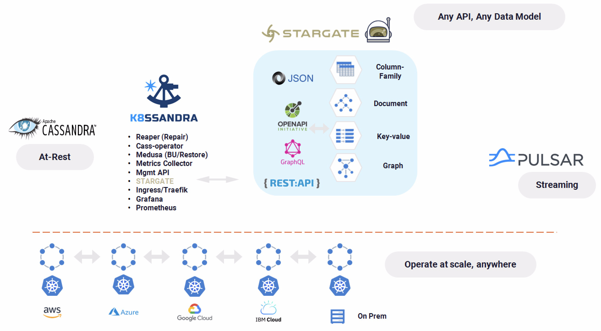

| **[Monthly Articles - 2022](../../README.md)** | **[Monthly Articles - 2021](../../2021/README.md)** | **[Monthly Articles - 2020](../../2020/README.md)** | **[Monthly Articles - 2019](../../2019/README.md)** | **[Monthly Articles - 2018](../../2018/README.md)** | **[Monthly Articles - 2017](../../2017/README.md)** | **[Data Downloads](../../downloads/README.md)** |
|-------------------------|-------------------------|-------------------------|-------------------------|-------------------------|-------------------------|-------------------------|

[Back to 2021 archive](../README.md)
[Download original PDF](../DDN_2021_55_K8ssandra.pdf)

---

# DDN 2021 55 K8ssandra

## Chapter 55. July 2021

DataStax Developer’s Notebook -- July 2021 V1.2

Welcome to the July 2021 edition of DataStax Developer’s Notebook (DDN). This month we answer the following question(s); My company is looking for ways to accelerate our application development, through whatever means. Can you help ? Excellent question ! One of the areas we can look at are programming APIs/gateways. On some level, there are only four things you can do with data; insert, update, delete, and select. As such, why aren’t all means to execute these statements automatically generated, automatically managed and scaled, and more. On February 10, 2021, DataStax released the open source K8ssandra project, which includes these automated functions, and more. In this article, we detail an introduction to K8ssandra; installation and use. In subsequent articles, we dive deeper into REST, GraphQL, and Document API configuration and use.

## Software versions

The primary DataStax software component used in this edition of DDN is DataStax Enterprise (DSE), currently release 6.8.*, or DataStax Astra (Apache Cassandra version 4.0.0.*), as required. When running Kubernetes, we are running Kubernetes version 1.17 locally, or on a major cloud provider. All of the steps outlined below can be run on one laptop with 32GB of RAM, or if you prefer, run these steps on Google GCP/GKE, Amazon Web Services (AWS), Microsoft Azure, or similar, to allow yourself a bit more resource

For isolation and (simplicity), we develop and test all systems inside virtual machines using a hypervisor (Oracle Virtual Box, VMWare Fusion version 8.5, or similar). The guest operating system we use is Ubuntu Desktop version 18.04, 64 bit.

DataStax Developer’s Notebook -- July 2021 V1.2

## 55.1 Terms and core concepts

As stated above, ultimately the end goal in this article is to accelerate application development. Some months ago, DataStax launched Astra, DataStax’s managed/hosted database as a service (DBaaS/Saas), for Apache Cassandra. As part of the Astra offering, are a number of automatically generated, managed and scaled service end points. This capability is available outside of Astra via the open source K8ssandra project. Figure 55-1 displays the functional architecture of K8ssandra, with a code review to follow.



*Figure 55-1 DataStax K8ssandra functional architecture*

Relative to Figure 55-1, the following is offered:

- K8ssandra delivers a number of administrative capabilities, which are we not discussing today; backup and recovery, repair, other. Today we are giving focus to accelerating application development.

- Part of K8ssandra is StarGate. All of this (K8ssandra, and the StarGate piece) are delivered via Kubernetes pods and containers. The StarGate pod provides an automatically generated, managed and scaled set of service endpoints. What does this mean ? With StarGate, you will automatically see; • An authorization service at port 8081. • A data management API Gateway via REST, at port 8081.

DataStax Developer’s Notebook -- July 2021 V1.2

• A GraphQL service endpoint at port 8080. • And a ‘Document API’ at port 8082. Not ‘schemaless’, the Document API allows you to insert, other, JSON formatted data against a polymorphic schema; add columns dynamically, without the need for SQL/CQL data definition language statements (DDL).

A K8ssandra operating installation Example 55-1 displays an operating Kubernetes installation of K8ssandra. A code review follows.

### Example 55-1 Kubernetes installation of K8ssandra

```text
kubectl -n ns-k8s get pods
NAME READY
STATUS RESTARTS AGE
k8ssandra-cass-operator-55df65b4c6-d2b2m 1/1
Running 0 93s
k8ssandra-dc1-default-sts-0 2/2
Running 0 67s
k8ssandra-dc1-stargate-66cc5484f-hhj6k 0/1
Running 0 93s
k8ssandra-grafana-cc5f44749-qt88f 2/2
Running 0 93s
k8ssandra-kube-prometheus-operator-64bf8b7467-bkxpn 1/1
Running 0 93s
k8ssandra-reaper-operator-5769c6c4dc-jlt79 1/1
Running 0 93s
prometheus-k8ssandra-kube-prometheus-prometheus-0 2/2
Running 1 90s
```

Relative to Example 55-1, the following offered:

- The first entry above is the DataStax Cassandra Kubernetes Operator. We’ve written about this operator many times in this series of articles. The Operator manages Cassandra database server clusters operating atop a Kubernetes cluster.

DataStax Developer’s Notebook -- July 2021 V1.2

- The second entry above is a one node/pod Cassandra cluster. This is a production database cluster, meaning; ready for end user data. (As opposed to an internal-use, or other purpose database server.)

- The third entry is where the service end points are created, and maintained; aka, StarGate.

> Note: If you were going to execute CQLSH directly against the Cassandra database server instance, you could target the IP address of the second entry above. (Could, as in there are other options.)

If you were going to use the provisioned and hosted REST service endpoint, GraphQL service endpoint, or the Document API, you would target the IP address of the third entry above.

- The fourth, fifth, and last entry above are related to administrative functions; metrics and reporting.

- The sixth entry, titled Reaper, is also administrative, related to distributed database anti-entropy repair.

> Note: By default, the subsystems that are installed with K8ssandra allow local IP address access only. This is configurable, of course.

To access these system from local CQLSH, or application clients (for testing),

## 55.2 Complete the following

At this point in this document we have a general sense of the operation of DataStax K8ssandra and the embedded DataStax StarGate. In this section of this document, we complete an install of K8ssandra. K8ssandra is installed via Helm. The following is assumed:

- These instructions were tested against an operating Kubernetes cluster hosted on GCP/GKE. As such, the Google CLI titled, gcloud, is installed. We tested with an 8 worker node, 4 CPU and 16GB of RAM per node system. (This is also a system we could host on a single, large MacBook Pro.)

- kubectl, Helm, and svcat are installed.

Installing K8ssandra Example 55-2 displays the command to install K8ssandra, and more. A code review follows.

DataStax Developer’s Notebook -- July 2021 V1.2

### Example 55-2 Installing K8ssandra

```text
kubectl delete namespace ns-k8s
kubectl create namespace ns-k8s
```

```text
helm repo list
#
helm repo remove service-catalog
```

```text
helm repo add k8ssandra https://helm.k8ssandra.io/
helm repo add traefik https://helm.traefik.io/traefik
helm repo update
```

```text
helm search repo k8ssandra
NAME CHART VERSIONAPP VERSION
DESCRIPTION
k8ssandra/k8ssandra 0.42.1 3.11.7
Configures and provisions the full k8ssandra stack
k8ssandra/k8ssandra-cluster0.23.0 3.11.7
Configures and creates a k8ssandra cluster
k8ssandra/k8ssandra-common 0.28.0 1.16.0 A Helm
chart for Kubernetes
k8ssandra/backup 0.26.0 0.1.0 Creates
a CassandraBackup
k8ssandra/cass-operator 0.28.0 1.5.0 A Helm
chart for Kubernetes
k8ssandra/medusa-operator 0.27.0 0.1.0 A Helm
chart for Kubernetes
k8ssandra/reaper-operator 0.29.0 0.1.0 A Helm
chart for Kubernetes
k8ssandra/restore 0.27.0 0.1.0 Creates
a CassandraRestore
```

```text
helm install k8ssandra k8ssandra/k8ssandra -n ns-k8s --set
stargate.enabled=true
```

DataStax Developer’s Notebook -- July 2021 V1.2

```text
#
helm install k8ssandra k8ssandra/k8ssandra -n ns-k8s
NAME: k8ssandra
LAST DEPLOYED: Thu Feb 4 08:10:13 2021
NAMESPACE: ns-k8s
STATUS: deployed
REVISION: 1
```

```text
helm delete k8ssandra k8ssandra/k8ssandra -n ns-k8s
```

Relative to Example 55-2, the following is offered:

- As stated; there are more command here than we need to complete the install. Listed in this example are commands to delete objects, report on their status, other. Execute only the command specifically stated as being needed-

- First we create a target Kubernetes namespace, to host all of our objects.

- Similar to most packages managers, Helm works from a set of repositories. We need to add two repositories; K8ssandra, and traefik. traefik is a leading Kubernetes ingress management package.

- A Helm repo update is required after adding these repositories.

- And then the ‘helm install’ proper with a switch to include StarGate.

- The ‘kubectl get pods’ reports on the state of the K8ssandra. As expected, (booting) 8-10 pods can take 3-4 minutes to complete. The last piece that will be ready are the service endpoints, as they are dependent on a working Cassandra cluster.

Managing the Apache Cassandra database server instance The Apache Cassandra cluster can be managed using kubectl and given YAML control files. This is a topic we’ve covered recently in this series of article. Additionally, a new topic, this Cassandra cluster can be managed using Helm. For example,

```text
helm get manifest k8ssandra
helm get manifest k8ssandra-a | grep size
size: 1
initial_heap_size: "800M"
```

DataStax Developer’s Notebook -- July 2021 V1.2

```text
max_heap_size: "800M"
helm upgrade k8ssandra-a k8ssandra/k8ssandra --set size=3
--reuse-values
```

Above, we call to move the default one node/pod Cassandra cluster to contain 3 nodes, all with best practice steps, as provided for by the Cassandra operator.

Install/Verify, using REST DataStax StarGate support CQL, REST, GraphQL, and Document API service endpoints. We wont document CQL, as there are many paths to complete that goal. GraphQL and Document API use and related are larger topics, and we will detail these in additional documents in this series, that follow. REST works out of the box (right now), with no additional configuration required.

Example 55-3 kubectl commands to establish a tunnel from our local platform into the StarGate pod. A code review follows.

### Example 55-3

```text
l_secret=`kubectl -n ${MY_K8S_NS} get pods --no-headers | awk
'{print $1}' | head -1 | cut -f1,1 -d'-'`-superuser
#
CASS_USER=$(kubectl get secret ${l_secret} -n ${MY_K8S_NS}
-o=jsonpath='{.data.username}' | base64 -d)
CASS_PASS=$(kubectl get secret ${l_secret} -n ${MY_K8S_NS}
-o=jsonpath='{.data.password}' | base64 -d)
#
l_pod=`kubectl -n ${MY_K8S_NS} get pods --no-headers | grep
stargate | awk '{print $1}'`
```

```text
--------------------------------------------
```

```text
kubectl -n ${MY_K8S_NS} port-forward ${l_pod} 8080:8080 &
l_my_pid80=${!}
#
kubectl -n ${MY_K8S_NS} port-forward ${l_pod} 8081:8081 &
l_my_pid81=${!}
#
kubectl -n ${MY_K8S_NS} port-forward ${l_pod} 8082:8082 &
```

DataStax Developer’s Notebook -- July 2021 V1.2

```text
l_my_pid82=${!}
```

```text
# Ps, this url now works/handy
#
# Document,
localhost:8082/swagger-ui
#
# GraphQL,
http://localhost:8080/playground
```

```text
--------------------------------------------
```

```text
kill -15 ${l_my_pid80}
kill -15 ${l_my_pid81}
kill -15 ${l_my_pid82}
```

Relative to Example 55-3, the following is offered:

- The Kubernetes secret is used to regain the username and password that will allow us to get an authorization token, needed to successfully complete REST service calls. This same username/password pair will also authenticate a CQLSH session.

- The ‘l_pod’ line is used to get the name of the pod hosting StarGate, necessary to create a port forwarding tunnel from our local platform (a laptop ?)

- 3 (count) kubectl port forwards makes the K8ssandra installation hosting StarGate appear to be local to our current box. The effect then, that any reference to localhost:8081 hits that same port on the StarGate pod. • Port 8080 supports GraphQL • Port 8081 supports authentication, as well as REST calls. • Port 8082 support Document API calls.

- Two Urls are listed; • The first is for an area to create and execute Document API calls • The second is for GraphQL

- The ‘kill -15’ calls terminate the tunneling.

DataStax Developer’s Notebook -- July 2021 V1.2

Getting an ‘auth token’ When using a standard (old school) client side driver, you must authenticate against the Cassandra cluster using a username/password pair. Similarly, we must authenticate when executing REST, GraphQL, and Document API calls. IN each of these 3 cases, we must get an ‘authorization token’ as detailed below.

```text
l_secret=`kubectl -n ${MY_K8S_NS} get pods --no-headers | awk '{print
$1}' | head -1 | cut -f1,1 -d'-'`-superuser
#
CASS_USER=$(kubectl get secret ${l_secret} -n ${MY_K8S_NS}
-o=jsonpath='{.data.username}' | base64 -d)
CASS_PASS=$(kubectl get secret ${l_secret} -n ${MY_K8S_NS}
-o=jsonpath='{.data.password}' | base64 -d)
```

```text
--------------------------------------------
```

```text
l_token=$(curl -L -X POST 'http://localhost:8081/v1/auth' \
-H 'Content-Type: application/json' \
--data-raw "{ \"username\": \"${CASS_USER}\", \"password\":
\"${CASS_PASS}\" }" | \
jq -r '.authToken')
```

We’ve seen most of this code before; the only real new piece being the curl(C) command. (Single and double-quotes are significant.) the last command in this sequence gives us the ‘auth token’, we need to continue.

Simple/sample REST API service invocation A simple/sample REST service invocation is listed blow-

```text
l_ks=ks1
l_table=t1
```

```text
curl -L -X GET
"http://localhost:8082/v2/keyspaces/${l_ks}/${l_table}?where=\{\"col
1\":\{\"\$in\":\[\"111\",\"222\"\]\}\}" \
-H "X-Cassandra-Token: ${l_token}" \
-H 'Content-Type: application/json'
```

DataStax Developer’s Notebook -- July 2021 V1.2

The service invocation above calls to query against a table in a Cassandra keyspace titled, ‘ks1’, and a table titled, ‘t1’, with a single column partition key titled, ‘col1’. All rows are returned with a key value of ‘111’, or ‘222’.

## 55.3 In this document, we reviewed or created:

This month and in this document we detailed the following:

- A rather complete introduction to K8ssandra, install and initial use. Further documents in this series delve deeper into StarGate, and the GraphQL and Document API programming and use.

- We did complete a small number of steps to issue a REST call for reading data, mostly to install/validate our K8ssandra, StarGate installation.

### Persons who help this month.

Kiyu Gabriel, Jim Hatcher, Joshua Norrid, and Yusuf Abediyeh.

### Additional resources:

Free DataStax Enterprise training courses,

```text
https://academy.datastax.com/courses/
```

Take any class, any time, for free. If you complete every class on DataStax Academy, you will actually have achieved a pretty good mastery of DataStax Enterprise, Apache Spark, Apache Solr, Apache TinkerPop, and even some programming.

This document is located here,

```text
https://github.com/farrell0/DataStax-Developers-Notebook
```

DataStax Developer’s Notebook -- July 2021 V1.2

```text
https://tinyurl.com/ddn3000
```
