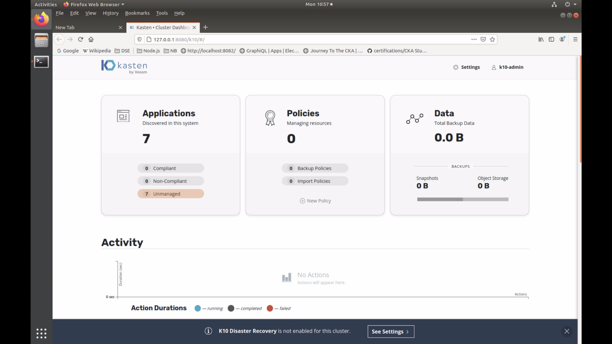

| **[Monthly Articles - 2022](../../README.md)** | **[Monthly Articles - 2021](../../2021/README.md)** | **[Monthly Articles - 2020](../../2020/README.md)** | **[Monthly Articles - 2019](../../2019/README.md)** | **[Monthly Articles - 2018](../../2018/README.md)** | **[Monthly Articles - 2017](../../2017/README.md)** | **[Data Downloads](../../downloads/README.md)** |
|-------------------------|-------------------------|-------------------------|-------------------------|-------------------------|-------------------------|-------------------------|

[Back to 2021 archive](../README.md)
[Download original PDF](../DDN_2021_58_KastenVeeam.pdf)

---

# DDN 2021 58 KastenVeeam

## Chapter 58. October 2021

DataStax Developer’s Notebook -- October 2021 V1.2

Welcome to the October 2021 edition of DataStax Developer’s Notebook (DDN). This month we answer the following question(s); My company is investigating a backup and recovery solution for all of our applications running atop Kubernetes. Can you help ? Excellent question ! In the past we’ve referenced the open source Velero project from a VMware acquisition, and we’ve mentioned NetApp Astra (a SaaS). This month we detail installation of use of Kasten/Veeam K10. With (Kasten) you can backup and restore databases, applications, and not only backup and restore, but also clone to aid your development efforts.

## Software versions

The primary DataStax software component used in this edition of DDN is DataStax Enterprise (DSE), currently release 6.8.*, or DataStax Astra (Apache Cassandra version 4.0.0.*), as required. When running Kubernetes, we are running Kubernetes version 1.17 locally, or on a major cloud provider. All of the steps outlined below can be run on one laptop with 32GB of RAM, or if you prefer, run these steps on Google GCP/GKE, Amazon Web Services (AWS), Microsoft Azure, or similar, to allow yourself a bit more resource

For isolation and (simplicity), we develop and test all systems inside virtual machines using a hypervisor (Oracle Virtual Box, VMWare Fusion version 8.5, or similar). The guest operating system we use is Ubuntu Desktop version 18.04, 64 bit.

DataStax Developer’s Notebook -- October 2021 V1.2

## 58.1 Terms and core concepts

As stated above, we are going to detail installation and use of Kasten/Veeam K10. While we are only beginner-level on (Kasten), it checked all of our boxes;

- Free for up to 10 worker nodes.

- Simple, 5-10 minute install.

- Cloud, or on premise.

- Excellent/clear Quick Start instructions and documentation.

- Excellent Web/UI that also lists the equivalent command line instructions.

In this article we will;

- Install Kasten K10, the DataStax Kubernetes Operator for Apache Cassandra, and DataStax K8ssandra.

- Detail restore/clone ‘recipes’. A default K8ssandra installation has 96 top level objects. Which subset do you restore when, for example, cloning the embedded Cassandra cluster contained within ?

Installing Kasten/Veeam K10 The documentation page for Kasten/Veeam (Kasten) is located at,

```text
https://docs.kasten.io/latest/install/index.html
```

At this point, it is assumed you have a working Kubernetes cluster. We start by adding the Helm chart repository and adding a namespace,

```text
helm repo add kasten https://charts.kasten.io/
kubectl create namespace kasten-io
```

We need a storage class of a given type,

```text
kubectl apply -f X6_CreateKastenVolumeSnapshotClass.yaml
```

Below are the contents of the X6 file, Example 58-1.

### Example 58-1 Snapshot class for Kasten

```text
apiVersion: snapshot.storage.k8s.io/v1beta1
```

```text
driver: pd.csi.storage.gke.io
kind: VolumeSnapshotClass
```

```text
metadata:
```

DataStax Developer’s Notebook -- October 2021 V1.2

```text
annotations:
k10.kasten.io/is-snapshot-class: "true"
name: csi-hostpath-snapclass
```

```text
deletionPolicy: Retain
```

The biggest thing we need above, besides the object itself, is the annotation.

Kasten has a ‘pre-flight check’, to ensure you are ready to provision their operator and related.

```text
curl https://docs.kasten.io/tools/k10_primer.sh | bash
```

Output from a successful Kasten pre-flight check is listed in Example 58-2. About the only way we’ve seen this fail is if you forget to create the storage class, or you lack permissions on your Kubernetes clusters to create roles.

### Example 58-2 Successful output from Kasten pre-flight check

```text
% Total % Received % Xferd Average Speed Time Time Time Current
Dload Upload Total Spent Left Speed
100 6072 100 6072 0 0 19337 0 --:--:-- --:--:-- --:--:-- 19337
Namespace option not provided, using default namespace
Checking for tools
--> Found kubectl
--> Found helm
Checking if the Kasten Helm repo is present
--> The Kasten Helm repo was found
Checking for required Helm version (>= v3.0.0)
--> No Tiller needed with Helm v3.4.2
K10Primer image
--> Using Image (gcr.io/kasten-images/k10tools:3.0.10) to run test
Checking access to the Kubernetes context
gke_gke-launcher-dev_us-central1-f_farrell-cluster
--> Able to access the default Kubernetes namespace
```

```text
Running K10Primer Job in cluster with command-
./k10tools primer
serviceaccount/k10-primer created
clusterrolebinding.rbac.authorization.k8s.io/k10-primer created
job.batch/k10primer created
Waiting for pod k10primer-pcbhd to be ready - ContainerCreating
Waiting for pod k10primer-pcbhd to be ready - ContainerCreating
Waiting for pod k10primer-pcbhd to be ready - ContainerCreating
Waiting for pod k10primer-pcbhd to be ready -
```

DataStax Developer’s Notebook -- October 2021 V1.2

```text
Pod Ready!
```

```text
Kubernetes Version Check:
Valid kubernetes version (v1.17.17-gke.1101) - OK
```

```text
RBAC Check:
Kubernetes RBAC is enabled - OK
```

```text
Aggregated Layer Check:
The Kubernetes Aggregated Layer is enabled - OK
```

```text
CSI Capabilities Check:
Using CSI GroupVersion snapshot.storage.k8s.io/v1beta1 - OK
```

```text
Validating Provisioners:
pd.csi.storage.gke.io:
Is a CSI Provisioner - OK
Storage Classes:
premium-rwo
Valid Storage Class - OK
standard-rwo
Valid Storage Class - OK
Volume Snapshot Classes:
csi-hostpath-snapclass
Has k10.kasten.io/is-snapshot-class annotation set to true - OK
Has deletionPolicy 'Retain' - OK
```

```text
kubernetes.io/gce-pd:
Storage Classes:
standard
Valid Storage Class - OK
```

```text
Validate Generic Volume Snapshot:
Pod Created successfully - OK
GVS Backup command executed successfully - OK
Pod deleted successfully - OK
```

```text
serviceaccount "k10-primer" deleted
clusterrolebinding.rbac.authorization.k8s.io "k10-primer" deleted
job.batch "k10primer" deleted
```

And here is the remainder of the install in Example 58-3. A code review follows.

### Example 58-3 Remainder of Kasten install

```text
# svc accts
#
```

DataStax Developer’s Notebook -- October 2021 V1.2

```text
myproject=$(gcloud config get-value core/project)
gcloud iam service-accounts create k10-test-sa --display-name "K10 Service
Account" # harmless fail on repetitive execution
k10saemail=$(gcloud iam service-accounts list --filter "k10-test-sa"
--format="value(email)")
gcloud iam service-accounts keys create --iam-account=${k10saemail}
Y2_k10-sa-key.json
gcloud projects add-iam-policy-binding ${myproject} --member
serviceAccount:${k10saemail} --role roles/compute.storageAdmin
```

```text
------------------------------------------
```

```text
sa_key=$(base64 -w0 Y2_k10-sa-key.json)
helm install k10 kasten/k10 --namespace=kasten-io --set
secrets.googleApiKey=$sa_key
```

```text
watch kubectl get pods -n kasten-io
kubectl get pods -n kasten-io
```

```text
kubectl --namespace kasten-io port-forward service/gateway 8080:8000
#
# The Kasten dashboard will be available at:
http://127.0.0.1:8080/k10/#/
```

Relative to Example 58-3, the following is offered:

- Above is a mixture of code and comments; sorry.

- The first block of 5 commands set up of permissions and service accounts. Here we are running atop GCP/GKE.

- This is followed by a Helm install of Kasten. Small, but it does have a number of small pods; Kasten can take 1-3 minutes to fully come up. As such, a watch kubectl command is listed,

```text
watch kubectl get pods -n kasten-io
```

When all pods are up, you are good to go.

- Embedded within Kasten is an administrative Web UI; super well done. We port forward from inside the Kubernetes cluster to our laptop,

```text
kubectl --namespace kasten-io port-forward service/gateway
8080:8000
```

- And the Web UI is available at,

DataStax Developer’s Notebook -- October 2021 V1.2

```text
http://127.0.0.1:8080/k10/#/
```

The Web UI will prompt for a company name and email address, and you can enter any values; these are not validated.

Lastly then;

- Kasten is fully installed and running. From this point forward, we are going to complete a number of ‘unmanaged’ backup and restores. When we restore to a second, net-new Kubernetes namespace, we are effectively ‘cloning’, creating a new and concurrent operating resource. You wouldn’t really clone the DataStax Kubernetes Operator for Cassandra, or the K8ssandra systems, as you only ever need one of these. You might clone (restore) a Cassandra cluster, as it’s handy to be able to copy this to better support development a quality-assurance efforts. We do detail backup/restore of the Operator, as someone might delete the namespace containing same, or so other catastrophic event might occur.

- Further tutorials on Kasten are located here,

```text
https://docs.kanister.io/tutorial.html
```

- Kasten has a killer feature titled, ‘blueprints’, which are effectively a means to add procedural code to operations normally served by just Helm and Kubectl. See,

```text
https://docs.kasten.io/latest/kanister/testing.html#kanister-e
nabled-applications
```

Examples of blueprints using Cassandra and the Bitnami Helm chart are located at,

```text
https://github.com/kanisterio/kanister/tree/master/examples/st
able/cassandra
https://github.com/kanisterio/kanister/blob/master/examples/st
able/cassandra/cassandra-blueprint.yaml
```

We didn’t need blueprints, but do see the obvious value to having them available.

Install the Operator and K8ssandra We have detailed installing and using the DataStax Kubernetes Operator for Apache Cassandra (Operator, a Kubernetes CRD), and DataStax K8ssnara many times in earlier editions of this same document.

DataStax Developer’s Notebook -- October 2021 V1.2

In this document we will use both systems (the Operator, and K8ssandra), and detail their use with Kasten.

For reference only, Example 58-4 shows how we installed the Operator, and Example 58-5 shows how we installed K8sssandra. A brief code review follows.

### Example 58-4 Installing the Operator

```text
#!/bin/bash
```

```text
# From,
# https://github.com/datastax/cass-operator
#
#
```

```text
. "./20 Defaults.sh"
```

```text
##############################################################
```

```text
echo ""
echo ""
echo "Calling 'helm' and 'kubectl' to provision DataStax
Cassandra Kubernetes Operator version 1.5 ..."
echo " (And make/reset expected namespaces, storage classes,
and more.)"
echo ""
echo "** You have 10 seconds to cancel before proceeding."
echo ""
echo ""
sleep 10
```

```text
kubectl delete namespaces ${MY_NS_OPERATOR} 2> /dev/null
```

DataStax Developer’s Notebook -- October 2021 V1.2

```text
# suppress spurious error on
kubectl delete namespaces ${MY_NS_CCLUSTER1} 2> /dev/null
# first run, these ns's will
kubectl delete namespaces ${MY_NS_CCLUSTER2} 2> /dev/null
# not exist
kubectl delete namespaces ${MY_NS_USER1} 2> /dev/null
kubectl delete namespaces ${MY_NS_USER2} 2> /dev/null
echo ""
#
kubectl create namespace ${MY_NS_OPERATOR}
kubectl create namespace ${MY_NS_CCLUSTER1}
kubectl create namespace ${MY_NS_CCLUSTER2}
kubectl create namespace ${MY_NS_USER1}
kubectl create namespace ${MY_NS_USER2}
echo ""
```

```text
[ -d C8_CassOperator ] || {
echo ""
echo ""
echo "Error: This program requires that the DataStax
Cassandra Operator Helm Charts"
echo " are located in a local sub-folder titled,
C8_CassOperator."
echo ""
echo " (We use a local sub-folder, so that we may make
changes to default values.)"
echo ""
echo " This required sub-folder is not present."
echo ""
echo " You can download this chart from;
https://github.com/datastax/cass-operator"
echo " (And then please edit; values.yaml)"
echo ""
```

DataStax Developer’s Notebook -- October 2021 V1.2

```text
echo ""
exit 7
}
```

```text
# Expecting helm version 3.x
helm install --namespace=${MY_NS_OPERATOR} cass-operator
./C8_CassOperator
echo ""
```

```text
kubectl delete storageclass server-storage 2>
/dev/null
kubectl create -f C2_storageclass.yaml
# kubectl delete storageclass server-storage-immediate 2>
/dev/null
# kubectl create -f C3_C2WithImmediate.yaml
```

```text
echo ""
echo ""
echo "Next steps:"
echo ""
echo " Make a Cassandra cluster,"
echo " 40* D1*"
echo ""
echo ""
```

DataStax Developer’s Notebook -- October 2021 V1.2

### Example 58-5 Installing K8ssandra

```text
#!/bin/bash
```

```text
# From,
# https://github.com/datastax/cass-operator
#
#
```

```text
. "./20 Defaults.sh"
```

```text
##############################################################
```

```text
echo ""
echo ""
echo "Calling 'helm' and 'kubectl' to install K8ssandra with
StarGate ..."
echo ""
echo "** You have 10 seconds to cancel before proceeding."
echo ""
echo ""
sleep 10
```

```text
echo "Delete/create our preferred namespace: ${MY_K8S_NS}"
echo ""
kubectl delete namespace ${MY_K8S_NS}
kubectl create namespace ${MY_K8S_NS}
echo ""
```

```text
echo "Add Helm repositories .."
```

DataStax Developer’s Notebook -- October 2021 V1.2

```text
echo ""
helm repo add k8ssandra https://helm.k8ssandra.io/
helm repo add traefik https://helm.traefik.io/traefik
echo ""
echo "Update Helm metadata .."
helm repo update
echo ""
```

```text
echo "Install K8ssandra proper .. (many pods, this takes a bit)
..."
echo ""
```

```text
#
# I was using this
#
# helm install k8ssandra k8ssandra/k8ssandra -n ns-k8s \
# --set stargate.enabled=true \
# --set cassandra.version=4.0.0
```

```text
#
# Now using this
#
helm install k8ssandra k8ssandra/k8ssandra -n ns-k8s \
--set stargate.enabled=true \
--set cassandra.version=4.0.0 \
--set kube-prometheus-stack.enabled=false \
--set reaper-operator.enabled=false \
--set medusa.enabled=false \
--set cass-operator.enabled=true \
--set cass-operator.clusterScoped=true
```

```text
# --set cassandra.datacenters[0].size=0
#
```

DataStax Developer’s Notebook -- October 2021 V1.2

```text
# this failed
#
# Error: YAML parse error on
k8ssandra/templates/reaper/reaper.yaml: error converting YAML to
JSON: yaml: line 23: did not find expected key
```

```text
echo ""
echo ""
echo "Next steps:"
echo ""
echo " watch kubectl -n ns-k8s get pods"
echo " kubectl -n ns-k8s get pods"
echo ""
echo " File 80, which runs bash(C) into a K8s C* pod"
echo " File 81, which runs cqlsh into a K8s C* pod"
echo " File 82, which runs a local cqlsh into a K8s C* pod"
echo ""
echo ""
```

Relative to Example 58-4 and Example 58-5, the following is offered:

- Only 2 lines are really relevant in the first listing-

```text
helm install --namespace=${MY_NS_OPERATOR} cass-operator
./C8_CassOperator
kubectl create -f C2_storageclass.yaml
```

We do a Helm install of the operator. The reference to C8, is a local directory structure of the given Helm charts and associated YAML files. Really we do this so we can provide our own values.yaml file. Instead of having values.yaml, and that whole structure, you can just pass values on the Helm command line, a technique we show on the second example above. The C2 file, makes our preferred storage class for Cassandra.

- Similarly, the second example only has one real line,

DataStax Developer’s Notebook -- October 2021 V1.2

```text
helm install k8ssandra k8ssandra/k8ssandra -n ns-k8s \
--set stargate.enabled=true \
--set cassandra.version=4.0.0 \
--set kube-prometheus-stack.enabled=false \
--set reaper-operator.enabled=false \
--set medusa.enabled=false \
--set cass-operator.enabled=true \
--set cass-operator.clusterScoped=true
```

> Note: Do not provision both the DataStax Kubernetes Operator for Cassandra and DataStax K8ssndra at the same time. First of all, that would be a waste; there’s too much overlap in functionality between the two choices. Second, the way we installed these above, there would be resource conflict; K8ssandra itself contains an Operator, and both Operators are both configured to manage the entire Kubernetes cluster.

Here we have a Helm install of K8ssandra. All of those ‘set’ directives are exact matches from any available ‘values.yaml’ file. So, for example, cass-operator.clusterScoped, comes from the cass-operator values.yaml files, and specifically the setting titled, clusterScoped.

Checkpoint: at this point, the following is assumed At this point, the following is assumed:

- You have a Kubernetes cluster up and running, with Kasten installed, and the Kasten Web UI open

- You have provisioned just the DataStax Kubernetes Operator for Apache Cassandra. Later we’ll delete this namespace and anything else created, and provision K8ssandra. Two different runtime paths, two different discussion

- To ensure you can be certain you have actually restored, you have or know how to put a table with data in each embedded Cassandra cluster (one made with the Operator, and one made under K8ssandra).

Just Kasten and the Operator, Recipe 1 Using Kasten and just the DataStax Kubernetes Operator for Apache Cassandra, we will detail 3 ‘recipes’, one of which may be viewed as redundant.

- Recipe 1: Backup/restore just the Cassandra PVs/PVCs, then make a Cassandra cluster from this manually using the Operator.

DataStax Developer’s Notebook -- October 2021 V1.2

- Recipe 2: Backup/restore the PVs/PVCs and the CassandraDatacenter object No manual steps here, and we produce a working Cassandra cluster.

- Recipe 3: And presumably for disaster recovery, backup and restore the operator itself. (We don’t need two of these, so delete the first post backup.)

From the Kasten administrative UI home screen, (aka, the Dashboard), select, Unmanaged. Example as shown in Figure 58-1.



*Figure 58-1 Dashboard, selecting Unmanaged*

In our installation, we placed the Cassandra cluster in the Kubernetes

```text
ns-cass-sys1
```

namespace titled, , and from here we click, Snapshot, Snapshot Application. This action will back up all entities in the specific namespace, as well as any related PVs/PVCs.

You can return to the Dashboard, to wait for this task to complete. While this task is running, you can click on its bar on the time line and see the entities to be backed up, and any failure/status messages.

In this recipe, we are only restoring the PVs/PVCs, so will be left without a functional Cassandra cluster. (We’ll only have a restored copy of its storage.) The only point of this activity would be to manually make a Cassandra cluster afterwards. Note: you wouldn’t be able to change the network topology of the restored Cassandra cluster; (n) nodes is (n) nodes, and not a larger or smaller number of nodes. You could change memory and such though.

DataStax Developer’s Notebook -- October 2021 V1.2

To restore, (or in this case we’ll restore to a different namespace, we’ll call this a clone):

- Dashboard, Unmanaged, select the original/source namespace, Restore, select the only available timestamp, and then scroll down.

- You can select the Kubernetes namespace to restore to, and we chose a different namespace, which allows for multiple operating concurrent copies of a given object.

- Kasten organizes the items you may restore into at least two categories: • ‘Volume artifacts’, basically storage (PVs/PVCs) • And ‘spec artifacts’, basically Kubernetes objects Using the Web UI, select just the PVs/PVCs. Use the (button) titled, ‘Deselect All Spec Artifacts’, to uncheck all of the Kubernetes objects.

- And select, Restore. When complete, you will see the PVs/PVCs in your kubectl listing.

> Note: Again, recall in this Recipe 1, you are not calling to restore a Cassandra cluster (a CassandraDatacenter object), you at this point would have to follow up with the manual steps to instruct the Operator to make a Cassandra cluster from these PVs/PVCs.

We tested this, and it works; the data was present from the originating system.

Kasten and the Operator, Recipe 2 Here we follow largely the same steps as above, but add the CassandraDatacenter object to out list of items to restore. The restore will give us a fully functioning Cassandra cluster, with all data as existing pre-backup.

Kasten and the Operator, Recipe 3 So the prior to recipes allowed us to clone Cassandra clusters, or if we had had an actual failure, we could have restored to the same namespace, and actually recovered from failure.

Here we restore the Operator itself, which we would only need to do on failure; you don’t need not want to concurrently functioning Operators, both managing the entire Kubernetes cluster.

Same basic formula, here though we:

DataStax Developer’s Notebook -- October 2021 V1.2

- As our Operator was installed in a Kubernetes namespace all by itself, we call to restore the entire namespace minus one artifact. Here we deselect (do not restore) the entity titled,

```text
type configmaps version v1 namespace ns-k8s name
cass-operator-lock
```

If you make a mistake and restore this one item, the Operator restore will hang and you will have to manually delete said item before you can be successful.

- Since this is a true restore, delete the namespace containing the Operator post backup, pre restore. Just because the operator appears to be up and running, do not assume; test it. Instruct the Operator to actively change or create a Cassandra cluster and observe that these changes take effect.

Moving to Kasten and K8ssandra At this point we have restored Cassandra cluster, and the Operator itself. It’s time to move to K8ssandra. Via whatever means you prefer, delete any existing Cassandra clusters and the Operator itself. Then install K8ssandra as detailed above; make a table and data in the embedded Cassandra cluster that arrives with K8ssandra.

At this point, we’ll detail cloning the Cassandra cluster, and all previous K8ssandra and related artifacts are largely stateless.

To clone a Cassandra cluster, operate largely the same as before:

- Backup the entire namespace.

- In another namespace, call to restore; the relative PVs/PVCs, and the CassandraDatacenter.

- Also call to restore all K8ssandra related Kubernetes secrets. If you fail this step, the Cassandra cluster will not come up.

> Note: If you are Cassandra cluster cloning, you can change these secrets after the Cassandra cluster is up.

You wont need all of these secrets, but they do need to be present in order to restore.

- Post restoration, confirm that your data is present.

DataStax Developer’s Notebook -- October 2021 V1.2

## 58.2 Complete the following

At this point in this document we have detail all or most steps to Cassandra cluster clone, or restore, and Operator restore. Put these steps in practice; install Kasten, and get busy.

## 58.3 In this document, we reviewed or created:

This month and in this document we detailed the following:

- How to install and operate Kasten/Veeam K10.

- How to backup, restore, and clone given Cassandra and DataStax objects using same.

### Persons who help this month.

Kiyu Gabriel, Jim Hatcher, Joshua Norrid, and Yusuf Abediyeh.

### Additional resources:

Free DataStax Enterprise training courses,

```text
https://academy.datastax.com/courses/
```

Take any class, any time, for free. If you complete every class on DataStax Academy, you will actually have achieved a pretty good mastery of DataStax Enterprise, Apache Spark, Apache Solr, Apache TinkerPop, and even some programming.

This document is located here,

```text
https://github.com/farrell0/DataStax-Developers-Notebook
```

DataStax Developer’s Notebook -- October 2021 V1.2

```text
https://tinyurl.com/ddn3000
```

DataStax Developer’s Notebook -- October 2021 V1.2
