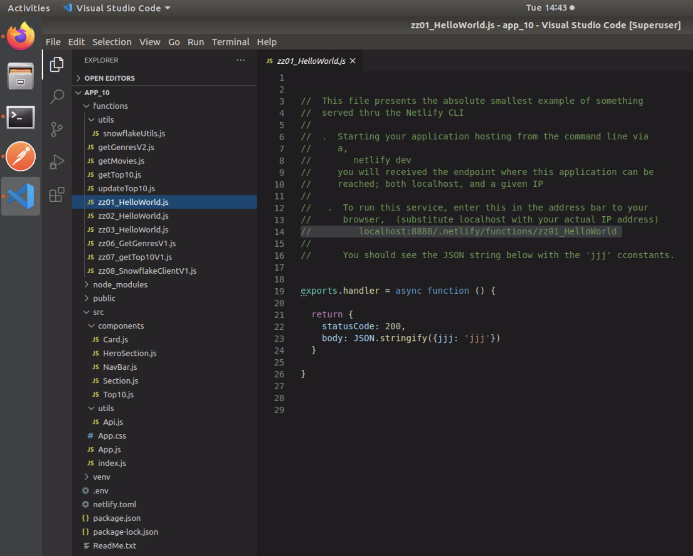
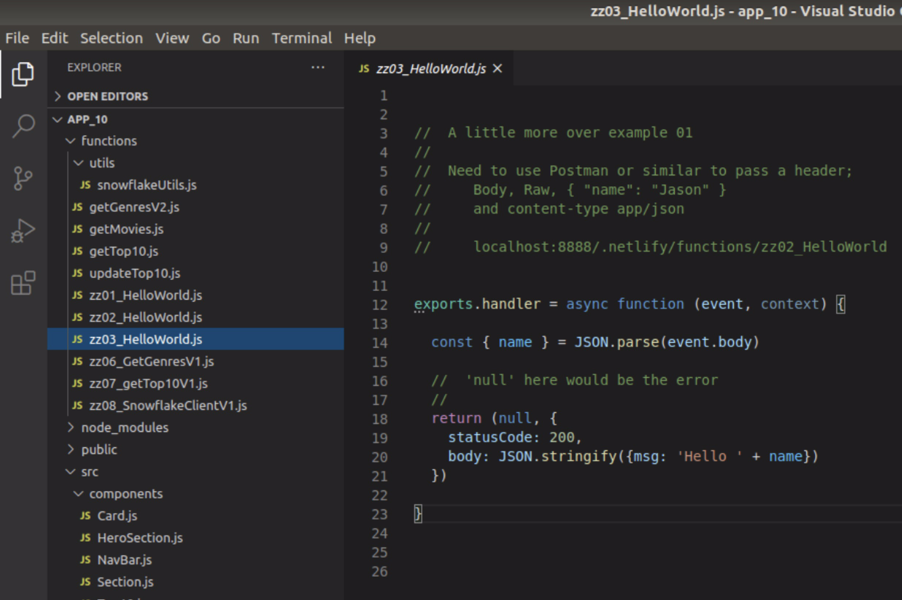
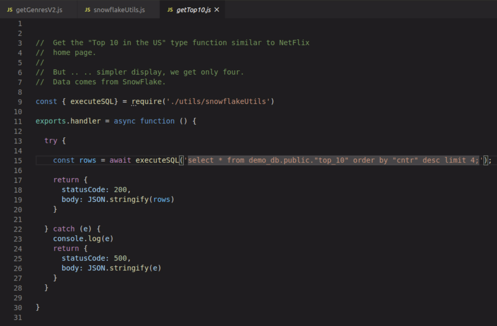
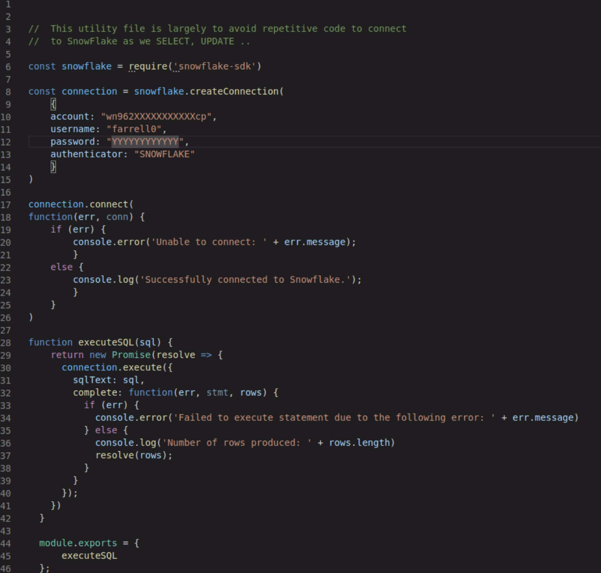
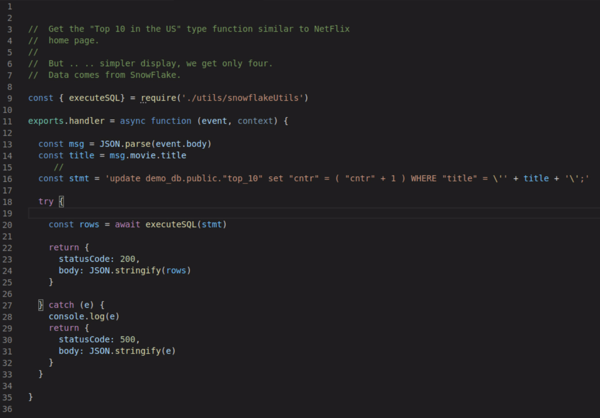

| **[Monthly Articles - 2022](../../README.md)** | **[Monthly Articles - 2021](../../2021/README.md)** | **[Monthly Articles - 2020](../../2020/README.md)** | **[Monthly Articles - 2019](../../2019/README.md)** | **[Monthly Articles - 2018](../../2018/README.md)** | **[Monthly Articles - 2017](../../2017/README.md)** | **[Data Downloads](../../downloads/README.md)** |
|-------------------------|-------------------------|-------------------------|-------------------------|-------------------------|-------------------------|-------------------------|

[Back to 2021 archive](../README.md)
[Download original PDF](../DDN_2021_60_SnowFlake.pdf)
[Companion asset: DDN_2021_60_SnowFlake.tar](../DDN_2021_60_SnowFlake.tar)

## From The Archive

December 2021 - -
>Customer: My company uses a ton of Apache Cassandra, and a ton of SnowFlake. We also want to move to writing applications using Node.js/REACT.
>We’re having trouble understanding what each of Cassandra and SnowFlake should be used for together, and what a sample application might
>look like. Can you help ?
>
>Daniel: Excellent question ! We’ll detail a sample application, written in Node.js and REACT, and then deliver an application that uses both
>Apache Cassandra and SnowFlake.
>
>[View a quick demo of what we're building here](https://youtu.be/uDfVjStGA9o)
>
>[Read article online](./README.md)
>
>[Download Source Code in Tar Format here](../DDN_2021_60_SnowFlake.tar)


---

# DDN 2021 60 SnowFlake

## Chapter 60. December 2021

DataStax Developer’s Notebook -- December 2021 V1.2

Welcome to the December 2021 edition of DataStax Developer’s Notebook (DDN). This month we answer the following question(s); My company uses a ton of Apache Cassandra, and a ton of SnowFlake. We also want to move to writing applications using Node.js/REACT. We’re having trouble understanding what each of Cassandra and SnowFlake should be used for together, and what a sample application might look like. Can you help ? Excellent question ! We’ll detail a sample application, written in Node.js and REACT, and then deliver an application that uses both Apache Cassandra and SnowFlake.

## Software versions

The primary DataStax software component used in this edition of DDN is DataStax Enterprise (DSE), currently release 6.8.*, or DataStax Astra (Apache Cassandra version 4.0.*), as required. When running Kubernetes, we are running Kubernetes version 1.18 locally, or on a major cloud provider. All of the steps outlined below can be run on one laptop with 32GB of RAM, or if you prefer, run these steps on Google GCP/GKE, Amazon Web Services (AWS), Microsoft Azure, or similar, to allow yourself a bit more resource

For isolation and (simplicity), we develop and test all systems inside virtual machines using a hypervisor (Oracle Virtual Box, VMWare Fusion version 8.5, or similar). The guest operating system we use is Ubuntu Desktop version 18.04, 64 bit.

DataStax Developer’s Notebook -- December 2021 V1.2

## 60.1 Terms and core concepts

As stated above, ultimately the end goal is to detail a sample business application that uses Apache Cassandra and SnowFlake, to better understand how these two transformational data platforms may work best together. Bonus, if this application is written using Node.js and REACT.

Sometime earlier in 2021, Ania Kubow did a part in her video series on the topic of writing business applications using Node.js and REACT, and more specifically targeting Apache Cassandra.

- Ania’s GitHub repository is located here,

```text
https://github.com/kubowania/netflix-clone-graphql-datastax
```

- And a two hour video where Ania details the application above is located here,

```text
https://youtu.be/g8COh40v2jU
```

Further comments:

- From the GitHub project above, we’ll harvest Ania’s code and data, and ask that her video serve as a bootstrap to any of the work added below.

- The runtime setup for Node.js is super picky, so we’ll add instruction to setup and use (program) Node.js programming atop an Ubuntu Desktop.

- We’ll add to Ania’s program, specifically pieces that add analytics being served from snowFlake.

Setting up a runtime for Node.js development The following are instructions for performing all of this work on an Ubuntu version 18 Desktop (virtual machine). And we’ll tell you right now, there will be a little of chicken and egg in the instructions below. (We blame Node.js.)

The problem we are trying to overcome relates to Node.js; it’s just super picky to set up. If you have prior installations of Node, differing versions, you’ll likely see what we try to overcome, try to avoid below.

Assuming you have Python, Yes, Python We make use of a Python package to manage our Node.js versions, runtime, other; different Node.js projects require different packages, versions of packages, and things get out of hand quickly. (If you’ve ever had to fix a 4000 line Maven file; it’s that type of pain and grief.)

We use the Python package titled, nodeenv to overcome this challenge.

```text
pip install nodeenv
```

DataStax Developer’s Notebook -- December 2021 V1.2

```text
( cd into Node.js project folder )
nodeenv venv
source venv/bin/activate
```

Related to the above:

- We install nodeenv using the pip command listed above.

- Assuming you already have a Node.js binary installed, we first create the new project folder, then cd into same. (We’ll address the topic of creating a Node.js project soon, below.)

- “nodeenv venv” creates a new folder in the Node.js project root titled, venv. The “venv” word is of our own choosing; call it anything.

> Note: Some versions (all versions ?) of Node.js require absolute pathnames with no spaces in these paths; just FYI.

Any Node.js packages/dependencies we install will reside under venv.

- And the “source” command makes this venv our reference for any Node.js versions, dependencies.

> Note: Use the “source” command (and all related) for the Linux command line to function. (We use the Linux command line below.)

If you’re using an IDE, VS/Code, for example, the IDE will know versions and packages from metadata in the Node.js project folder; the package.json file.

Create a Node.js project Yes, a little chicken and egg. The nodeenv command above will complain if it can't find the Node.js binary, or a proper Node.js project folder. But, we weren’t really read to install Node.js without having nodeenv first. Welcome to Node.js !

Generally we,

- Install Node.js first (and not in the manner we prefer), make the first Node.js project folder, save that folder’s contents, then uninstall Node.js, and install nodeenv.

DataStax Developer’s Notebook -- December 2021 V1.2

> Note: It’s really not as bad as we make it seem. You can just install Node.js inside the operating system, and then just not use it.

Then you will use different copies of the install using nodeenv.

How to install Node.js

```text
curl -o-
https://raw.githubusercontent.com/nvm-sh/nvm/v0.38.0/install.sh |
bash
nvm install node
```

Install nvm using the first command above. Effectively nvm will makes entries in your .basrc file; you’ll find you can’t “which nvm”, or “what nvm”. You can install verify using a “nvm --version”.

The second command above actually installs Node.js. It’s this “node” binary we use only to make our first project.

Make a node.js project, project folder

```text
npx -y create-react-app@latest app_10 --use-npm
```

So, given a Node.js project titled, app_10, use the command above to make a net new Node.js project folder. And cd into same. (Now use nodeenv from above).

> Note: Who installed npx ?

Installing a base Node.js gives you npx, npm, and more.

You’re now ready to program Node.js “cd” into the project directory, “source” venv, as detailed above, and you should be good to go. If you use VS/Code, you should be able to open the folder containing this project.

We will be starting from the Ania Kubow GitHub project listed above. We consider the following steps (results of steps) to be in place:

- You have a DataStax Astra free/trial account.

- You’ve followed Ania’s steps to make every database object (tables), loaded data, and related.

- You can run Ania’s sample GraphQL query and see “genres”, and “movies”.

DataStax Developer’s Notebook -- December 2021 V1.2

> Note: Similar to the DataStax Astra free/trial account, do the same for SnowFlake. You’re done here when you know how to make a SQL table and SQL INSERT data using SnowFlake.

Install a number of Node.js packages After sourcing nodeenv, and from inside the project folder, install the following Node.js packages.

```text
npm install -g
npm -y install node-fetch -g
npm -y install netlify-cli -g
netlify dev
```

Relative to the above:

- The first command above installs Node.js, but, installs a version local to just this project; this isolates us from any prior installs, partial installs, just generally puts us in a guaranteed clean runtime space.

- The second command installs a package used to network communication; separating our view and controller pieces, Ala., model-view-controller.

- The Netlify line, line 3, will give us the ability to isolate, host, out data access routines without needing to run or configure Express.

> Note: This is a killer, must watch video detailing what and how Netlify gives our project,

```text
https://www.youtube.com/watch?v=drJwMlD9Mjo
```

- And the last, fourth line calls to start our runtime interpreter for anything we are about to edit inside our IDE, VS/Code.

From inside our IDE (we’re using VS/Code), here is our project structure, as displayed in Figure 60-1. A code review follows.

DataStax Developer’s Notebook -- December 2021 V1.2



*Figure 60-1 Inside VS/Code, our project structure*

Relative to Figure 60-1, the following is offered:

- All of our data access objects will be under ./functions, and will run through the Netlify CLI. (We’ll follow this list with a few in depth reviews of these types of routines.)

- The bulk of our client side programming goes under ./src/components. We have entries for our 4 main HTML5 divs; NavBar, HeroSection, Top10, and the fourth section, which divides into Section and Card.

> Note: Section presents all of a given Genre, and Card present a given, single movie.

Hello World (a data access routine), using Netlify Figure 60-2 displays a data access routine when using Netlify. A code review follows.

DataStax Developer’s Notebook -- December 2021 V1.2



*Figure 60-2 A sample DAO when using Netlify*

Relative to Figure 60-2, the following is offered:

- This is file 03 in this list. Files 01 and 02 present even simpler versions of this same example.

- The exports.handler is straight up Netlify. An overloaded method, here we choose to define two input arguments: • event gives us access to the body of the message, which we pull any data from. • And context, which we aren’t using in this example. • We can put any programming we want prior to the return, including any interactions with Cassandra, SnowFlake, other.

- The return is where we put what will render on the Browser client.

Moving to Just SnowFlake So again, we’re extending the Node.js application first presented by Ania Kubow. Comments:

- The original Ania version of code is available at the very first GitHub Url listed far above. Our version of this program is available on GitHub, adjacent to this document.

DataStax Developer’s Notebook -- December 2021 V1.2

http://tinurl.com/ddn3000 December/2021

- We did change Ania’s pieces, mostly removing her paging on fetch code, since that was irrelevant to our needs.

- Continuing below, we detail only the real, net new code; code related to SnowFlake.

> Note: Love, love, love SnowFlake, yet, we must say. – JavaScript has been through 3 evolutionary models related to asynchronous programming. – DataStax Astra, StarGate, and related are using the 3’rd/preferred model. (Preferred by us.) – Ania wrote her code using GraphQL; super clean, super brief. – The SnowFlake Node.JS driver is largely still generation-1 type callbacks. So, you’ll see below that we wrappered much of this stuff to suit our own preferences. We’re distributing all of the code, but will only highlight one example below.

Figure 60-3 displays the first of (n) pieces detailing how we read from SnowFlake. A code review follows.

DataStax Developer’s Notebook -- December 2021 V1.2



*Figure 60-3 First SnowFlake piece.*

Relative to Figure 60-3, the following is offered:

- This is the SQL SELECT to populate out Top 10 HTML5 div panel. You should recognize this basic construct from our Netlify section above.

- executeSql is the SnowFlake method to return a query dataset in whole.

Figure 60-4 displays the utils method references in the code example above. A code review follows.

DataStax Developer’s Notebook -- December 2021 V1.2



*Figure 60-4 Our utils code for SnowFlake*

Relative to Figure 60-4, the following is offered:

- Notice how we have to wrapper execute() inside the JavaScript Promise. (This differs how we worked with Cassandra elsewhere in this project.) Nothing wrong/broken; just an older style with more boilerplate code.

- rows is what we’ll return to the rendering function.

We are largely done We’ll show the update example below, so we can detail how we extract values from the service request body. Example as shown in Figure 60-5. A code review follows.

DataStax Developer’s Notebook -- December 2021 V1.2



*Figure 60-5 SnowFlake updates.*

Relative to Figure 60-5, the following is offered:

- In this example, you see the technique to pull a value used in the UPDATE WHERE clause, from the event (message) body.

- Otherwise, this example differs very little from the previous SELECT.

## 60.2 Complete the following

At this point in this document we are ready to run the application.

- If you pull the GitHub code, and run netlify dev, the application should run.

- You must follow all dependency instructions above; make the Cassandra tables, SnowFlake tables, load data, other. Sorry that part of these instruction come from the original Ania project, and some instructions come from us. If not for this choice, this/our document would be 70 pages long.

DataStax Developer’s Notebook -- December 2021 V1.2

## 60.3 In this document, we reviewed or created:

This month and in this document we detailed the following:

- We moved the Ania Kubow DataStax Astra project to also use SnowFlake.

- We also provided a measure of more detail related to how this program code actually works Netlify, other.

### Persons who help this month.

Joshua Norrid, Madhavan Sridhavan, Chris Wilhite, and Yusuf Abediyeh.

### Additional resources:

Free DataStax Enterprise training courses,

```text
https://academy.datastax.com/courses/
```

Take any class, any time, for free. If you complete every class on DataStax Academy, you will actually have achieved a pretty good mastery of DataStax Enterprise, Apache Spark, Apache Solr, Apache TinkerPop, and even some programming.

This document is located here,

```text
https://github.com/farrell0/DataStax-Developers-Notebook
https://tinyurl.com/ddn3000
```

DataStax Developer’s Notebook -- December 2021 V1.2
