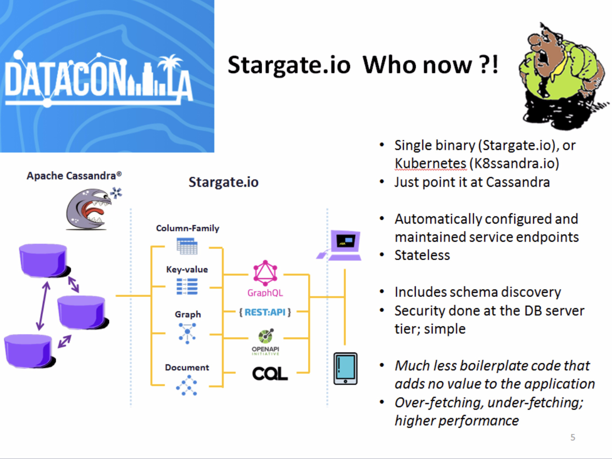

| **[Monthly Articles - 2022](../../README.md)** | **[Monthly Articles - 2021](../../2021/README.md)** | **[Monthly Articles - 2020](../../2020/README.md)** | **[Monthly Articles - 2019](../../2019/README.md)** | **[Monthly Articles - 2018](../../2018/README.md)** | **[Monthly Articles - 2017](../../2017/README.md)** | **[Data Downloads](../../downloads/README.md)** |
|-------------------------|-------------------------|-------------------------|-------------------------|-------------------------|-------------------------|-------------------------|

[Back to 2022 archive](../README.md)
[Download original PDF](../DDN_2022_61_SchemaValidation.pdf)

---

# DDN 2022 61 SchemaValidation

## Chapter 61. January 2022

DataStax Developer’s Notebook -- January 2022 V1.2

Welcome to the January 2022 edition of DataStax Developer’s Notebook (DDN). This month we answer the following question(s); My company wishes to activate SQL-style data ingegrity check constraints atop Apache Cassandra. Can you help ? Excellent question ! You can do this, and we’ll detail all of the steps involved below.

## Software versions

The primary DataStax software component used in this edition of DDN is DataStax Enterprise (DSE), currently release 6.8.*, or DataStax Astra (Apache Cassandra version 4.0.*), as required. When running Kubernetes, we are running Kubernetes version 1.20 locally, or on a major cloud provider. All of the steps outlined below can be run on one laptop with 16-32GB of RAM, or if you prefer, run these steps on Google GCP/GKE, Amazon Web Services (AWS), Microsoft Azure, or similar, to allow yourself a bit more resource

For isolation and (simplicity), we develop and test all systems inside virtual machines using a hypervisor (Oracle Virtual Box, VMWare Fusion version 8.5, or similar). The guest operating system we use is Ubuntu Desktop version 18.04, 64 bit.

DataStax Developer’s Notebook -- January 2022 V1.2

## 61.1 Terms and core concepts

At the simplest level, a database server only provides four primary functions;

- INSERT new rows, a write operation

- DELETE or UPDATE rows previously INSERT(ed), also a write, because these are affecting existing rows, there is also a (preceding) read

- SELECT (read) rows previously written, a read operation

The database server can replicate data to other cities, backup and recover data, and so on, to better guarantee that writes are preserved and made available as expected.

Sometime in the mid-1990s, database servers also added the ability to validate data (SQL-style check constraints), a function that was previously limited to the application or application server tier. Pros and cons in this area;

- It’s reassuring to have the data validation performed directly adjacent to the data. In this manner, there should not be any means with which (bad) data enters the system.

- Centralized at the database server, you are likely writing and maintaining less code than in each of dozens of copies of any applications that access the data.

- But, performance and scale. It’s super important that the database server not be bogged down, and always ready and able to serve data in a performant manner, as required by said applications. If the database server can not (INSERT, UPDATE, DELETE, SELECT) and also simultaneously validate data in the required manner, then bad things happen to the business.

Before SQL-style checks constraints arrived, there was already a small amount of data validation;

- Generally, some column values could be made as “required entry”, through the creation of a unique index or primary key constraint. Apache Cassandra already has this ability, with it’s primary key constraints.

- And semantic integrity constraints arrive in the form of column data types checking. You can’t put textual data in a numeric column; you can not put a float into a boolean. Again, Apache Cassandra already has this.

DataStax Developer’s Notebook -- January 2022 V1.2

API programming, a growing trend A modern Web or mobile application might require a database server, a cache server, image servers, ftp servers, and more. Rather than require the user-interface programmer (the application proper), to have to learn SQL (CQL, in the case of Apache Cassandra), any query language Redis has, and any language for the other servers, the trend is to move to all REST calls or similar.

While Apache Cassandra support CQL (an SQL compatible data command and control language), the open source K8ssandra.io project delivers automatically generated, hosted and maintained service end points in each of; REST, GraphQL, Document API, and soon/now gRPC.

> Note: We’ve written about K8ssandra.io many times in this document series. To avoid duplication, we briefly state; – Using Kubernetes and Helm, you can stand up a complex Apache Cassandra cluster, including these service endpoints, in under a few minutes, and generally with one command. – K8ssandra.io is the over arching project to use here. – Stargate.io, which is embedded inside K8ssandra.io (or available as a stand alone), is the actual piece that automatically generates, hosts, and maintains the REST, GraphQL, Document PI, and more.

Figure 61-1 makes reference to DataCon-LA, 2021, with a supporting video available at,

```text
https://www.youtube.com/watch?v=5uvFMh-Mg0A&t=431s
```

This video might serve to overview the whole topic of; Apache Cassandra, API programming, K8ssandra.io, and Stargate.io.

DataStax Developer’s Notebook -- January 2022 V1.2



*Figure 61-1 From DataCon-LA, 2021*

Back to SQL-style check constraints The Document API to Apache Cassandra, delivered through K8ssandra.io (Stargate.io) gives a document database style interface to Apache Cassandra. With the Document API you receive;

- A polymorphic schema- • The application program can call to creates tables merely by inserting into same. • The application program can create new columns merely by inserting into them. The column data type if inferred by the data being inserted. • Column data types can be overloaded, for example, containing both integer and text type data.

- A polymorphic schema is not schema-less; there are still column names, column data types, other.

- As you might imagine above, these abilities can accelerate time to value when delivering applications; fewer change requests to the data administrator, and such.

DataStax Developer’s Notebook -- January 2022 V1.2

> Note: But speed (accelerating time to value) at what cost ?

If the application can essentially insert anything into the database, what then does the database contain ?

As mentioned above, SQL-style check constraints arrived circa 1994 or so, and provided;

- The ability to require columns values on non-key columns.

- The ability to validate column values in simple ways; ranges, equalities, lists, other.

SQL-style check constraints still had limitations. For example;

- You wouldn’t want to query a second billion row table every time a single row was inserted elsewhere.

- You wouldn’t want to support other operations that were costly, or did not scale. For example, and especially when distributing data (using clustered database servers); foreign key check constraints are generally not favored or available when clustering. These operations would just be too slow to remain useful.

How does Cassandra (K8ssandra.io) deliver these constraints Currently using the Document API, of an on-premise hosted K8ssandra.io Cassandra cluster, you can assign a validation schema to any collection (table). Version 4.x, there are SQL-style check constraints that are not currently supported, for example, the ‘default’ (value) column check constraint is mentioned, but is not currently functional.

Further comments;

- While SQL-style check constraints seem (are ?) really cool, and perhaps really necessary, it seems like very few people actually use them. While no official numbers exist, you seem to see these constraints in less than 3% of so of SQL installs. Part of the reason might be the lack of standardized error codes of any kind. (True for much more than constraints.) So an attempt to insert a duplicate key value might produce a -156 error code on one platform, and a -3000 on another.

- This schema validation capability arrive from a GitHub open source project that is now embedded inside K8ssandra.io. See,

DataStax Developer’s Notebook -- January 2022 V1.2

https://json-schema.org/learn/getting-started-step-by-step https://json-schema.org/learn/ Currently Stargate.io supports version 4 of this standard, and it is expected that version 5 may create some issues with backwards compatibility; stay tuned.

- You call to create these check constraints by submitting a JSON formatted document via aa REST call. Generally, constraints are created at the table level, with all constraints being submitted in a single document, a single call.

## 61.2 Complete the following

Currently these steps only work atop a locally installed K8ssandra.io installation. This condition is expected to change, and include support for DataStax Astra shortly.

Documentation for creating and using “Schema Validation”, aka, SQL-style check constraints is available at,

```text
https://54aCCC169e74f-us-east1.apps.astra.datastax.com/api/rest/swag
ger-ui/#/documents/getJsonSchema
```

where the leading portion of the Url above points to your DataStax Astra instance. Or,

```text
localhost:8082/swagger-ui
```

where localhost points to your K8ssandra.io installation.

> Note: For our notes below, we installed K8ssandra.io, including Stargate.io inside Kubernetes, and have set up port forward using kubectl into that cluster.

## 61.2.1 First we need an “auth token” to our cluster

To get an “auth token” allowing access to our cluster, we run,

```text
l_username=k8ssandra-superuser
l_password=lSzoMK2X8YV5tVSL0oOP
```

```text
curl -L -X POST 'http://localhost:8081/v1/auth' \
-H 'Content-Type: application/json' \
--data-raw "{
```

DataStax Developer’s Notebook -- January 2022 V1.2

```text
\"username\": \"$l_username\",
\"password\": \"$l_password\"
}"
```

```text
{"authToken":"9dfcda14-26fb-4475-9597-d36939620a22"}
```

Where l_username/l_password are the specified username and password into that server.

## 61.2.2 Then create a keyspace

Example as shown,

```text
curl --location --request POST
'localhost:8082/v2/schemas/namespaces' \
--header "X-Cassandra-Token: $l_authToken" \
--header 'Content-Type: application/json' \
--data '{
"name": "my_keyspace",
"replicas": 1
}'
```

```text
curl --location --request GET 'localhost:8082/v2/schemas/namespaces'
\
--header "X-Cassandra-Token: $l_authToken" \
--header 'Content-Type: application/json'
```

## 61.2.3 Make a collection, and one document

Example as shown,

```text
l_keyspace=my_keyspace
l_collection=my_collection
```

```text
curl --request POST \
--url
localhost:8082/v2/namespaces/${l_keyspace}/collections/${l_collectio
n} \
```

DataStax Developer’s Notebook -- January 2022 V1.2

```text
--header "X-Cassandra-Token: $l_authToken" \
--header 'Content-Type: application/json' \
-d '{
"key": "100",
"first_name": "Mary",
"last_name": "Jones",
"cell": "516-555-2048",
"city": "Long Island",
"year_of_birth": 1986,
"location": {
"type": "Point",
"coordinates": [-73.9876, 40.7574 ]
},
"profession": ["Developer", "Engineer"],
"apps": [
{"name": "MyApp", "version": "1.0.4"},
{"name": "DocFinder", "version": "2.5.7"}
],
"cars": [
{"make": "Bentley", "year": 1973},
{"make": "Rolls Royce", "year": 1965}
]
}'
```

```text
{"documentId":"89d3de40-3f3c-486e-b0cf-d0d5029987b4"}
```

```text
curl -L -X GET
localhost:8082/v2/namespaces/${l_keyspace}/collections/${l_collectio
n}'?where=\{"first_name":\{"$eq":"Mary"\}\}' \
--header "X-Cassandra-Token: $l_authToken" \
--header 'Content-Type: application/json'
```

DataStax Developer’s Notebook -- January 2022 V1.2

## 61.2.4 Retrieve any existing schema applied to a collection

This call should fail upon first execution, as no schema is in place. Example as shown,

```text
l_authToken=9dfcda14-26fb-4475-9597-d36939620a22
#
l_keyspace=my_keyspace
l_collection=my_collection
```

```text
curl --request GET \
--url
localhost:8082/v2/namespaces/${l_keyspace}/collections/${l_collectio
n}/json-schema \
--header "X-Cassandra-Token: $l_authToken" \
--header 'Content-Type: application/json'
```

```text
{"description":"Bad request: argument \"content\" is
null","code":400}
```

## 61.2.5 Create your first schema validation set

Example as shown,

```text
curl --request PUT \
--url
localhost:8082/v2/namespaces/${l_keyspace}/collections/${l_collectio
n}/json-schema \
--header "X-Cassandra-Token: $l_authToken" \
--header 'Content-Type: application/json' \
-d '{
"$schema": "http://json-schema.org/draft-04/schema#",
"title": "my_collection",
"description": "The best collection ever.",
"type": "object",
"properties": {
"last_name": {
```

DataStax Developer’s Notebook -- January 2022 V1.2

```text
"description": "The persons last name.",
"type": "string"
},
"first_name": {
"description": "The persons first name.",
"type": "string"
},
"age": {
"type": "number",
"minimum": 0,
"exclusiveMinimum": true,
"description": "Age in years which must be equal to or
greater than zero."
}
},
"required": ["age", "last_name", "first_name"]
}'
```

Related to the sample above:

- 3 Fields are required; age, first_name, last_name

- Age must be a numeric greater than zero

- Both names must be of type text

## 61.2.6 Test the result of our action above-

Example as shown,

```text
curl --request POST \
--url
localhost:8082/v2/namespaces/${l_keyspace}/collections/${l_collectio
n} \
--header "X-Cassandra-Token: $l_authToken" \
--header 'Content-Type: application/json' \
-d '{
"key": "101",
```

DataStax Developer’s Notebook -- January 2022 V1.2

```text
"first_name": "Bob",
"last_name": "Handy",
"age": 20
}'
```

```text
{"documentId":"0c912b0f-b130-4bc9-8217-b0871458f3f3"}
```

```text
curl --request POST \
--url
localhost:8082/v2/namespaces/${l_keyspace}/collections/${l_collectio
n} \
--header "X-Cassandra-Token: $l_authToken" \
--header 'Content-Type: application/json' \
-d '{
"key": "102",
"first_name": "Bob"
}'
```

```text
{"description":"Invalid JSON: [object has missing required
properties ([\"age\",\"last_name\"])]","code":400}
```

```text
curl --request POST \
--url
localhost:8082/v2/namespaces/${l_keyspace}/collections/${l_collectio
n} \
--header "X-Cassandra-Token: $l_authToken" \
--header 'Content-Type: application/json' \
-d '{
"key": "102",
"first_name": "Bob",
"last_name": "Handy",
"age": -4
}'
```

DataStax Developer’s Notebook -- January 2022 V1.2

```text
{"description":"Invalid JSON: [numeric instance is lower than the
required minimum (minimum: 0, found: -4)]","code":400}
```

Related to the sample above:

- The first example succeeds.

- The second example fails to INSERT; missing required columns.

- The third examples fails to INSERT; incorrect range on field.

## 61.2.7 More check constraints

Examples as shown,

```text
curl --request PUT \
--url
localhost:8082/v2/namespaces/${l_keyspace}/collections/${l_collectio
n}/json-schema \
--header "X-Cassandra-Token: $l_authToken" \
--header 'Content-Type: application/json' \
-d '{
"$schema": "http://json-schema.org/draft-04/schema#",
"title": "my_collection",
"description": "The best collection ever.",
"type": "object",
"properties": {
"last_name": {
"description": "The persons last name.",
"type": "string",
"default": "X"
},
"first_name": {
"description": "The persons first name.",
"type": "string",
"minLength": 3,
"maxLength": 16
```

DataStax Developer’s Notebook -- January 2022 V1.2

```text
},
"age": {
"type": "number",
"minimum": 0,
"exclusiveMinimum": true,
"description": "Age in years which must be equal to or
greater than zero."
}
},
"required": ["age", "first_name"]
}'
```

```text
curl --request POST \
--url
localhost:8082/v2/namespaces/${l_keyspace}/collections/${l_collectio
n} \
--header "X-Cassandra-Token: $l_authToken" \
--header 'Content-Type: application/json' \
-d '{
"key": "103",
"age": 40,
"first_name": "Nate Ratcliffe the Earl of Suffixson"
}'
```

```text
{"description":"Invalid JSON: [string \"Nate Ratcliffe the Earl of
Suffixson\" is too long (length: 36, maximum allowed:
16)]","code":400}
```

```text
curl --request POST \
--url
localhost:8082/v2/namespaces/${l_keyspace}/collections/${l_collectio
n} \
```

DataStax Developer’s Notebook -- January 2022 V1.2

```text
--header "X-Cassandra-Token: $l_authToken" \
--header 'Content-Type: application/json' \
-d '{
"key": "103",
"age": 40,
"first_name": "Na"
}'
```

```text
{"description":"Invalid JSON: [string \"Na\" is too short (length: 2,
required minimum: 3)]","code":400}
```

```text
curl --request PUT \
--url
localhost:8082/v2/namespaces/${l_keyspace}/collections/${l_collectio
n}/json-schema \
--header "X-Cassandra-Token: $l_authToken" \
--header 'Content-Type: application/json' \
-d '{
"$schema": "http://json-schema.org/draft-04/schema#",
"title": "my_collection",
"description": "The best collection ever.",
"type": "object",
"properties": {
"first_name": {
"description": "The persons first name.",
"type": "string",
"minLength": 3,
"maxLength": 16
},
"age": {
"type": "number",
"minimum": 0,
"exclusiveMinimum": true,
```

DataStax Developer’s Notebook -- January 2022 V1.2

```text
"description": "Age in years which must be equal to or
greater than zero."
},
"location": {
"type": "object",
"properties": {
"coordinates": {
"type": "array",
"minItems": 2,
"maxItems": 2
}
}
}
},
"required": ["age", "first_name"]
}'
```

```text
curl --request POST \
--url
localhost:8082/v2/namespaces/${l_keyspace}/collections/${l_collectio
n} \
--header "X-Cassandra-Token: $l_authToken" \
--header 'Content-Type: application/json' \
-d '{
"key": "104",
"age": 40,
"first_name": "Joshua",
"location": {
"coordinates": [-73.9876, 40.7574]
}
}'
```

```text
curl --request POST \
```

DataStax Developer’s Notebook -- January 2022 V1.2

```text
--url
localhost:8082/v2/namespaces/${l_keyspace}/collections/${l_collectio
n} \
--header "X-Cassandra-Token: $l_authToken" \
--header 'Content-Type: application/json' \
-d '{
"key": "104",
"age": 40,
"first_name": "Joshua",
"location": {
"coordinates": [-73.9876, 40.7574, 55.55 ]
}
}'
```

```text
{"description":"Invalid JSON: [array is too long: must have at most 2
elements but instance has 3 elements]","code":400}
```

```text
curl --request POST \
--url
localhost:8082/v2/namespaces/${l_keyspace}/collections/${l_collectio
n} \
--header "X-Cassandra-Token: $l_authToken" \
--header 'Content-Type: application/json' \
-d '{
"key": "104",
"age": 40,
"first_name": "Joshua"
}'
```

```text
curl --request PUT \
--url
localhost:8082/v2/namespaces/${l_keyspace}/collections/${l_collectio
n}/json-schema \
--header "X-Cassandra-Token: $l_authToken" \
```

DataStax Developer’s Notebook -- January 2022 V1.2

```text
--header 'Content-Type: application/json' \
-d '{
"$schema": "http://json-schema.org/draft-04/schema#",
"title": "my_collection",
"description": "The best collection ever.",
"type": "object",
"properties": {
"first_name": {
"description": "The persons first name.",
"type": "string",
"minLength": 3,
"maxLength": 16
},
"age": {
"type": "number",
"minimum": 0,
"exclusiveMinimum": true,
"description": "Age in years which must be equal to or
greater than zero."
},
"location": {
"type": "object",
"properties": {
"coordinates": {
"type": "array",
"minItems": 2,
"maxItems": 2
}
}
}
},
"required": ["age", "first_name", "coordinates"]
```

DataStax Developer’s Notebook -- January 2022 V1.2

```text
}'
```

```text
curl --request POST \
--url
localhost:8082/v2/namespaces/${l_keyspace}/collections/${l_collectio
n} \
--header "X-Cassandra-Token: $l_authToken" \
--header 'Content-Type: application/json' \
-d '{
"key": "104",
"age": 40,
"first_name": "Joshua"
}'
```

```text
{"description":"Invalid JSON: [object has missing required
properties ([\"coordinates\"])]","code":400}
```

Related to the above:

- We detail how to use both a min and max length on strings.

- We detail how to add an array length constraint to coordinates.

- In the last gull example, we detail how to embed second level (and beyond) JSON elements, in this case; location.coordinates. Effectively you add an “object” with “properties” to a given (top level) field.

## 61.3 In this document, we reviewed or created:

This month and in this document we detailed the following:

- The history of SQL-style check constraints

DataStax Developer’s Notebook -- January 2022 V1.2

- How to implement same atop Apache Cassandra

### Persons who help this month.

Kiyu Gabriel, Chris Wilhite, Cedric Lunven, and Yusuf Abediyeh.

### Additional resources:

Free DataStax Enterprise training courses,

```text
https://academy.datastax.com/courses/
```

Take any class, any time, for free. If you complete every class on DataStax Academy, you will actually have achieved a pretty good mastery of DataStax Enterprise, Apache Spark, Apache Solr, Apache TinkerPop, and even some programming.

This document is located here,

```text
https://github.com/farrell0/DataStax-Developers-Notebook
https://tinyurl.com/ddn3000
```
